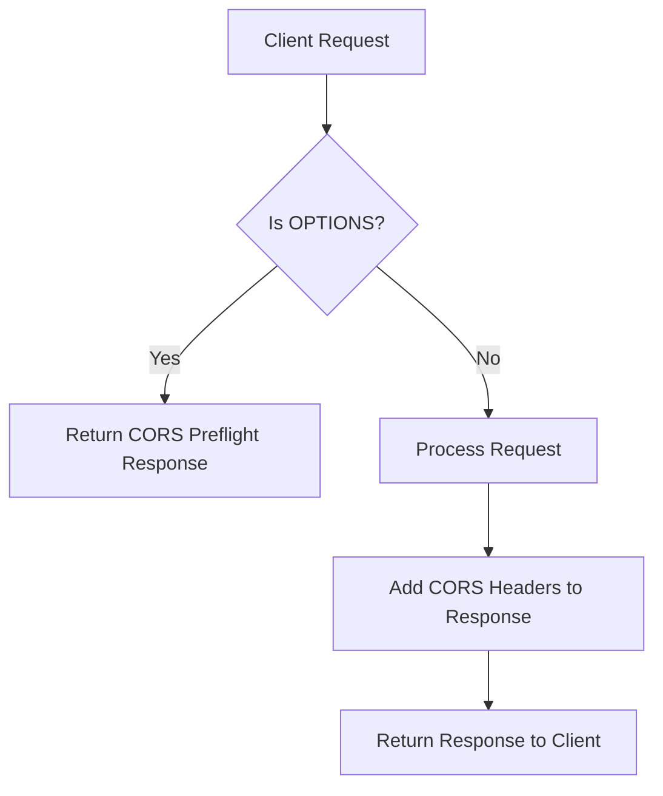
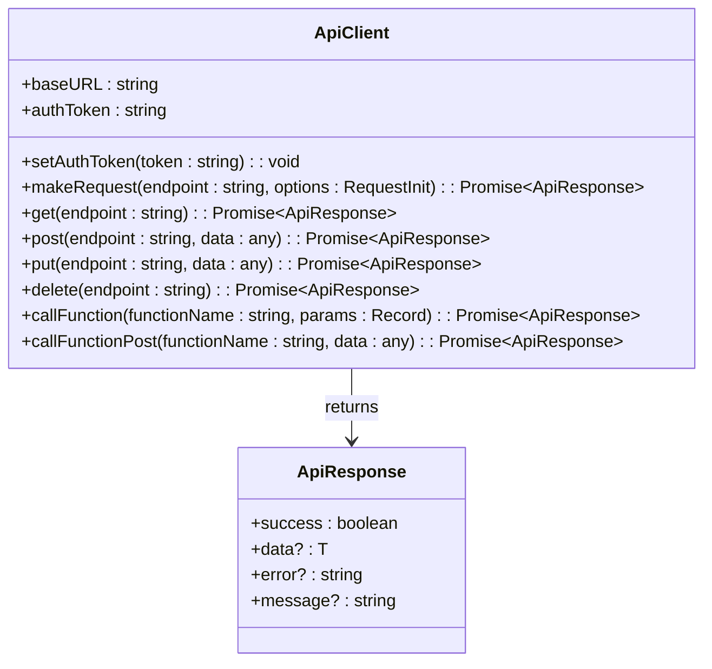
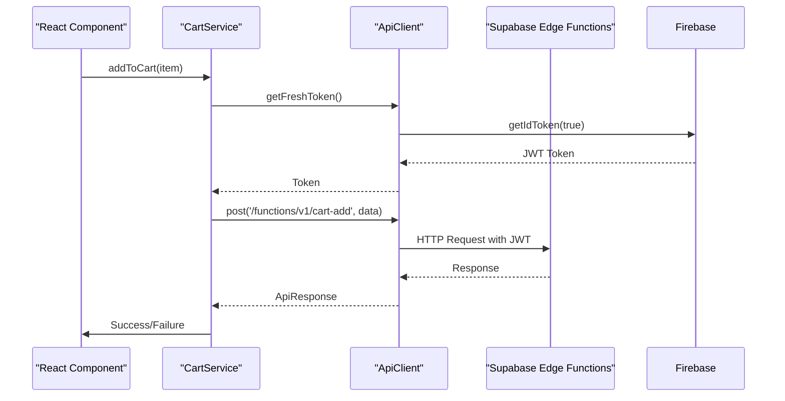

# API Documentation

<cite>
**Referenced Files in This Document**   
- [cors.ts](file://supabase/functions/_shared/cors.ts)
- [cart-add/index.ts](file://supabase/functions/cart-add/index.ts)
- [cart-delete/index.ts](file://supabase/functions/cart-delete/index.ts)
- [cart-get/index.ts](file://supabase/functions/cart-get/index.ts)
- [cart-update/index.ts](file://supabase/functions/cart-update/index.ts)
- [create-order/index.ts](file://supabase/functions/create-order/index.ts)
- [delivery-zone/index.ts](file://supabase/functions/delivery-zone/index.ts)
- [geofence-promotions/index.ts](file://supabase/functions/geofence-promotions/index.ts)
- [heatmap-data/index.ts](file://supabase/functions/heatmap-data/index.ts)
- [merchants-nearby/index.ts](file://supabase/functions/merchants-nearby/index.ts)
- [payment-process/index.ts](file://supabase/functions/payment-process/index.ts)
- [api.ts](file://services/api.ts)
- [apiEndpoints.ts](file://services/apiEndpoints.ts)
- [cartService.ts](file://services/cartService.ts)
- [orderService.ts](file://services/orderService.ts)
- [paymentService.ts](file://services/paymentService.ts)
</cite>

## Table of Contents
1. [Introduction](#introduction)
2. [CORS Configuration](#cors-configuration)
3. [Cart Operations](#cart-operations)
4. [Order Creation](#order-creation)
5. [Delivery Zone Validation](#delivery-zone-validation)
6. [Geofence Promotions](#geofence-promotions)
7. [Heatmap Data Retrieval](#heatmap-data-retrieval)
8. [Nearby Merchants Search](#nearby-merchants-search)
9. [Payment Processing](#payment-processing)
10. [Client Implementation Guidelines](#client-implementation-guidelines)
11. [Error Handling](#error-handling)
12. [Security and Authentication](#security-and-authentication)

## Introduction
This document provides comprehensive API documentation for the Supabase Edge Functions and RESTful endpoints used in the Brillprime-expo application. The system implements a serverless architecture with Firebase for authentication and Supabase for backend logic, database operations, and edge functions. The API endpoints cover core e-commerce functionality including cart management, order processing, delivery validation, location-based services, and payment processing.

The API follows RESTful principles with JSON request and response payloads. All edge functions are deployed to Supabase and accessible via HTTPS endpoints. The system implements robust error handling, input validation, and security measures including JWT authentication and row-level security policies in the PostgreSQL database.

**Section sources**
- [api.ts](file://services/api.ts#L1-L220)
- [apiEndpoints.ts](file://services/apiEndpoints.ts#L1-L197)

## CORS Configuration
The Supabase Edge Functions implement a shared CORS configuration to enable cross-origin requests from the frontend application. The configuration is defined in a shared module and imported by all edge functions.



**Diagram sources**
- [cors.ts](file://supabase/functions/_shared/cors.ts#L1-L45)

The CORS configuration includes the following headers:

- **Access-Control-Allow-Origin**: * (allows requests from any origin)
- **Access-Control-Allow-Headers**: authorization, x-client-info, apikey, content-type
- **Access-Control-Allow-Methods**: POST, GET, OPTIONS, PUT, DELETE
- **Access-Control-Max-Age**: 86400 (24 hours)

The implementation includes three key components:
1. `corsHeaders` object that defines the standard CORS headers
2. `handleCors` function that processes OPTIONS preflight requests
3. `withCors` function that adds CORS headers to responses

All edge functions first check for CORS preflight requests and return an appropriate response if detected, allowing the actual request to proceed only after successful preflight validation.

**Section sources**
- [cors.ts](file://supabase/functions/_shared/cors.ts#L1-L45)

## Cart Operations
The cart operations API provides endpoints for managing user shopping carts, including adding, retrieving, updating, and deleting items. These operations are implemented as Supabase Edge Functions that interact with the PostgreSQL database to maintain cart state.

### Cart Add Function
The cart add function allows users to add products to their shopping cart. If the product already exists in the cart, the quantity is updated; otherwise, a new cart item is created.

**Endpoint**: `POST /functions/v1/cart-add`  
**Authentication**: Required (JWT token in Authorization header)  
**Request Body Schema**:
```json
{
  "productId": "string",
  "quantity": "number"
}
```

**Response Format**:
```json
{
  "message": "Item added to cart",
  "data": {
    // Cart item data
  }
}
```

The function first authenticates the user using the JWT token, then checks if the item already exists in the user's cart. If it exists, the quantity is incremented; otherwise, a new record is inserted into the `cart_items` table.

**Section sources**
- [cart-add/index.ts](file://supabase/functions/cart-add/index.ts#L1-L94)
- [cartService.ts](file://services/cartService.ts#L1-L284)

### Cart Get Function
The cart get function retrieves all items in the user's shopping cart along with associated product and merchant information.

**Endpoint**: `GET /functions/v1/cart-get`  
**Authentication**: Required  
**Response Format**:
```json
{
  "data": [
    {
      "id": "string",
      "product_id": "string",
      "quantity": "number",
      "products": {
        "id": "string",
        "name": "string",
        "price": "number",
        "image_url": "string",
        "merchant": {
          "id": "string",
          "business_name": "string"
        }
      }
    }
  ]
}
```

The function uses Supabase's relational queries to fetch cart items with nested product and merchant data in a single query, reducing database round trips and improving performance.

**Section sources**
- [cart-get/index.ts](file://supabase/functions/cart-get/index.ts#L1-L77)
- [cartService.ts](file://services/cartService.ts#L1-L284)

### Cart Update Function
The cart update function modifies the quantity of a specific item in the user's cart.

**Endpoint**: `POST /functions/v1/cart-update/{itemId}`  
**Authentication**: Required  
**Request Body Schema**:
```json
{
  "quantity": "number"
}
```

**Response Format**:
```json
{
  "message": "Cart updated",
  "data": {
    // Updated cart item
  }
}
```

The function extracts the item ID from the URL path and updates the quantity in the `cart_items` table. It returns the updated cart item data to ensure the frontend has the current state.

**Section sources**
- [cart-update/index.ts](file://supabase/functions/cart-update/index.ts#L1-L59)
- [cartService.ts](file://services/cartService.ts#L1-L284)

### Cart Delete Function
The cart delete function removes an item from the user's shopping cart.

**Endpoint**: `DELETE /functions/v1/cart-delete/{itemId}`  
**Authentication**: Required  
**Response Format**:
```json
{
  "message": "Item removed from cart"
}
```

The function extracts the item ID from the URL path and deletes the corresponding record from the `cart_items` table, ensuring the deletion is scoped to the authenticated user for security.

**Section sources**
- [cart-delete/index.ts](file://supabase/functions/cart-delete/index.ts#L1-L68)
- [cartService.ts](file://services/cartService.ts#L1-L284)

## Order Creation
The order creation function handles the complete order processing workflow, including cart validation, price calculation, order creation, and notification generation.

**Endpoint**: `POST /functions/v1/create-order`  
**Authentication**: Required  
**Request Body Schema**:
```json
{
  "items": [
    {
      "productId": "string",
      "quantity": "number"
    }
  ],
  "deliveryAddressId": "string",
  "paymentMethodId": "string",
  "notes": "string"
}
```

**Response Format**:
```json
{
  "message": "Order created successfully",
  "order": {
    "id": "string",
    "user_id": "string",
    "merchant_id": "string",
    "status": "PENDING",
    "total_amount": "number",
    "subtotal": "number",
    "delivery_fee": "number",
    "delivery_address": "string",
    "payment_method": "string",
    "notes": "string"
  }
}
```

The function implements the following business logic:
1. Validates the user's authentication
2. Calculates the order subtotal by fetching product prices from the database
3. Applies delivery fees (currently fixed at ₦5.00)
4. Creates the order record in the `orders` table
5. Creates corresponding order items in the `order_items` table
6. Generates a notification for the merchant

The function uses database transactions implicitly through Supabase's query interface to ensure data consistency.

**Section sources**
- [create-order/index.ts](file://supabase/functions/create-order/index.ts#L1-L149)
- [orderService.ts](file://services/orderService.ts#L1-L203)

## Delivery Zone Validation
The delivery zone validation function determines whether a specific geographic location is within a merchant's delivery area.

**Endpoint**: `POST /functions/v1/delivery-zone`  
**Authentication**: Not required  
**Request Body Schema**:
```json
{
  "lat": "number",
  "lng": "number",
  "merchant_id": "string"
}
```

**Response Format**:
```json
{
  "is_within_zone": "boolean",
  "success": "boolean"
}
```

The function implements a dual-strategy approach:
1. First attempts to use a PostGIS database function `is_within_delivery_zone` for efficient server-side spatial calculations
2. Falls back to client-side point-in-polygon calculations if the database function is not available

The fallback implementation uses the ray-casting algorithm to determine if a point is inside a polygon, parsing the delivery zone coordinates stored as GeoJSON in the database.

**Section sources**
- [delivery-zone/index.ts](file://supabase/functions/delivery-zone/index.ts#L1-L112)

## Geofence Promotions
The geofence promotions function retrieves active promotions that are relevant to a user's current location.

**Endpoint**: `POST /functions/v1/geofence-promotions`  
**Authentication**: Not required  
**Request Body Schema**:
```json
{
  "lat": "number",
  "lng": "number",
  "user_id": "string"
}
```

**Response Format**:
```json
{
  "data": [
    {
      "id": "string",
      "title": "string",
      "description": "string",
      "discount_percent": "number",
      "radius_km": "number",
      "location_lat": "number",
      "location_lng": "number",
      "start_date": "string",
      "end_date": "string",
      "is_active": "boolean"
    }
  ],
  "success": "boolean"
}
```

Similar to the delivery zone function, this implements a dual-strategy:
1. Attempts to use a PostGIS database function `get_location_promotions` for efficient spatial queries
2. Falls back to client-side distance calculations using the Haversine formula

The function filters promotions by active status and date range before applying the geofence filter, ensuring only relevant promotions are considered.

**Section sources**
- [geofence-promotions/index.ts](file://supabase/functions/geofence-promotions/index.ts#L1-L105)

## Heatmap Data Retrieval
The heatmap data function provides clustered location data for visualizing order density and activity patterns.

**Endpoint**: `GET /functions/v1/heatmap-data`  
**Authentication**: Required  
**Query Parameters**:
- `min_lat`: Minimum latitude of the bounding box
- `min_lng`: Minimum longitude of the bounding box
- `max_lat`: Maximum latitude of the bounding box
- `max_lng`: Maximum longitude of the bounding box
- `days_back`: Number of days of historical data to include (default: 30)
- `grid_size`: Size of grid cells in degrees (default: 0.01)

**Response Format**:
```json
{
  "data": [
    {
      "latitude": "number",
      "longitude": "number",
      "order_count": "number",
      "total_value": "number",
      "intensity": "number"
    }
  ],
  "success": "boolean"
}
```

The function implements a grid-based clustering algorithm that groups order locations into cells of the specified size. For each cell, it calculates the number of orders, total order value, and a normalized intensity value for visualization purposes.

**Section sources**
- [heatmap-data/index.ts](file://supabase/functions/heatmap-data/index.ts#L1-L122)

## Nearby Merchants Search
The nearby merchants function finds merchants within a specified radius of a geographic location.

**Endpoint**: `GET /functions/v1/merchants-nearby`  
**Authentication**: Not required  
**Query Parameters**:
- `lat`: Latitude of the center point
- `lng`: Longitude of the center point
- `radius`: Search radius in kilometers (default: 10)

**Response Format**:
```json
{
  "data": [
    {
      "id": "string",
      "business_name": "string",
      "latitude": "number",
      "longitude": "number",
      "address": "string",
      "phone": "string",
      "is_active": "boolean"
    }
  ],
  "success": "boolean"
}
```

The function fetches all active merchants and filters them client-side using the Haversine formula to calculate distances. This approach allows for flexible filtering without requiring complex database queries.

**Section sources**
- [merchants-nearby/index.ts](file://supabase/functions/merchants-nearby/index.ts#L1-L75)

## Payment Processing
The payment processing function handles the complete payment workflow for orders, including transaction recording and status updates.

**Endpoint**: `POST /functions/v1/payment-process`  
**Authentication**: Required  
**Request Body Schema**:
```json
{
  "orderId": "string",
  "amount": "number",
  "paymentMethod": "string"
}
```

**Response Format**:
```json
{
  "data": {
    "transactionId": "string",
    "status": "completed"
  },
  "success": "boolean"
}
```

The function implements the following workflow:
1. Creates a transaction record in the `transactions` table with status "pending"
2. Simulates payment processing (in production, this would integrate with Paystack or Stripe)
3. Updates the transaction status to "completed"
4. Updates the order's payment status to "paid"

The function is designed to be extended with actual payment gateway integration while maintaining the same interface.

**Section sources**
- [payment-process/index.ts](file://supabase/functions/payment-process/index.ts#L1-L101)
- [paymentService.ts](file://services/paymentService.ts#L1-L276)

## Client Implementation Guidelines
The frontend application uses a service-oriented architecture with dedicated service classes for interacting with the API endpoints. The core API client is implemented in `api.ts` and provides a consistent interface for all HTTP requests.

### API Client Architecture
The API client implements the following features:
- Centralized configuration of base URL and default headers
- Request timeout handling (30 seconds)
- Automatic CORS preflight handling
- Request/response logging for debugging
- Comprehensive error handling with user-friendly messages
- Type safety through TypeScript interfaces



**Diagram sources**
- [api.ts](file://services/api.ts#L1-L220)

### Service Layer Implementation
The application uses dedicated service classes for different domains, such as `cartService`, `orderService`, and `paymentService`. These services encapsulate the business logic for interacting with the API and provide a clean interface for React components.

The `cartService` implements a hybrid approach that prioritizes backend synchronization while maintaining local storage as a fallback for offline scenarios. This ensures a seamless user experience even with intermittent connectivity.



**Diagram sources**
- [cartService.ts](file://services/cartService.ts#L1-L284)
- [api.ts](file://services/api.ts#L1-L220)

### Error Handling Strategy
The API client implements a comprehensive error handling strategy that distinguishes between different types of errors and provides appropriate user feedback:

- **Network errors**: "Unable to connect to the server. Please check your internet connection and try again."
- **Timeout errors**: "The request is taking longer than expected. The server may be waking up from sleep mode. Please wait a moment and try again."
- **Authentication errors**: "Your session has expired. Please sign in again."
- **Permission errors**: "You don't have permission to access this resource."
- **Server errors**: "A server error occurred. Our team has been notified. Please try again later."

This approach ensures that users receive meaningful feedback that helps them understand the issue and take appropriate action.

**Section sources**
- [api.ts](file://services/api.ts#L1-L220)
- [cartService.ts](file://services/cartService.ts#L1-L284)
- [orderService.ts](file://services/orderService.ts#L1-L203)

## Error Handling
The API implements consistent error handling across all endpoints with standardized response formats and HTTP status codes.

### Error Response Format
All error responses follow the same format:
```json
{
  "error": "Error message",
  "success": false
}
```

### HTTP Status Codes
The API uses standard HTTP status codes to indicate the result of requests:
- **200 OK**: Successful request
- **400 Bad Request**: Invalid request parameters or body
- **401 Unauthorized**: Missing or invalid authentication
- **403 Forbidden**: Insufficient permissions
- **404 Not Found**: Resource not found
- **500 Internal Server Error**: Unexpected server error

### Input Validation
All endpoints perform input validation to ensure data integrity:
- Required fields are checked for presence
- Numeric values are validated for appropriate ranges
- Geographic coordinates are validated for proper format
- User authentication is verified before processing sensitive operations

The validation occurs at both the edge function level and the service layer, providing defense in depth against invalid data.

**Section sources**
- [cart-add/index.ts](file://supabase/functions/cart-add/index.ts#L1-L94)
- [create-order/index.ts](file://supabase/functions/create-order/index.ts#L1-L149)
- [api.ts](file://services/api.ts#L1-L220)

## Security and Authentication
The API implements a robust security model using Firebase Authentication and Supabase's built-in security features.

### Authentication Flow
The system uses Firebase for user authentication and Supabase for backend operations. When a user logs in, Firebase generates a JWT token that is used to authenticate requests to the Supabase Edge Functions.

The edge functions validate the JWT token using Supabase's authentication system, which automatically verifies the token signature and extracts the user information. This ensures that only authenticated users can access protected endpoints.

### Row-Level Security
The PostgreSQL database implements row-level security (RLS) policies to ensure that users can only access their own data. For example, users can only view and modify cart items and orders that belong to them.

### Environment Security
Sensitive configuration is stored in environment variables:
- `SUPABASE_URL`: The Supabase project URL
- `SUPABASE_ANON_KEY`: The anonymous API key for Supabase

These variables are securely managed in the Supabase dashboard and are not exposed in the client-side code.

**Section sources**
- [cart-add/index.ts](file://supabase/functions/cart-add/index.ts#L1-L94)
- [api.ts](file://services/api.ts#L1-L220)
- [cartService.ts](file://services/cartService.ts#L1-L284)