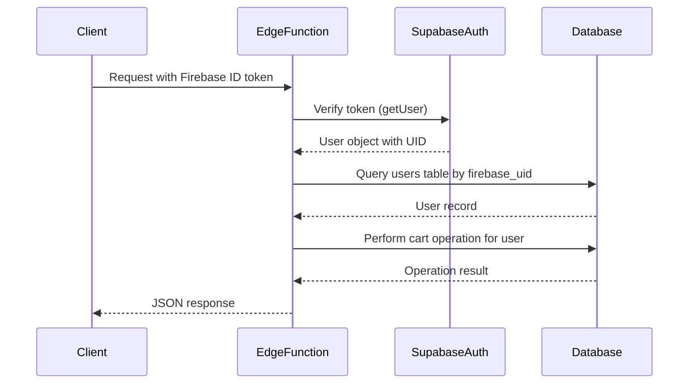
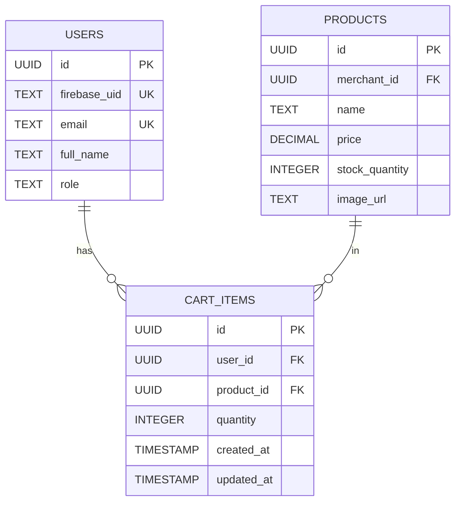
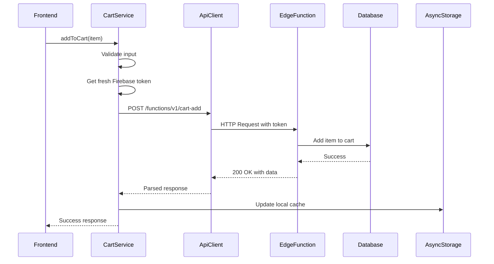

# Cart Operations API

<cite>
**Referenced Files in This Document**   
- [cors.ts](file://supabase/functions/_shared/cors.ts)
- [cart-add/index.ts](file://supabase/functions/cart-add/index.ts)
- [cart-get/index.ts](file://supabase/functions/cart-get/index.ts)
- [cart-update/index.ts](file://supabase/functions/cart-update/index.ts)
- [cart-delete/index.ts](file://supabase/functions/cart-delete/index.ts)
- [apiEndpoints.ts](file://services/apiEndpoints.ts)
- [api.ts](file://services/api.ts)
- [cartService.ts](file://services/cartService.ts)
- [schema.sql](file://supabase/schema.sql)
- [cart-items-table.sql](file://supabase/cart-items-table.sql)
- [validation.ts](file://utils/validation.ts)
</cite>

## Table of Contents
1. [Introduction](#introduction)
2. [API Endpoints Overview](#api-endpoints-overview)
3. [Authentication and Security](#authentication-and-security)
4. [CORS Configuration](#cors-configuration)
5. [Endpoint Details](#endpoint-details)
   - [Add Item to Cart (POST)](#add-item-to-cart-post)
   - [Retrieve Cart Contents (GET)](#retrieve-cart-contents-get)
   - [Update Item Quantity (PUT)](#update-item-quantity-put)
   - [Remove Item from Cart (DELETE)](#remove-item-from-cart-delete)
6. [Database Schema](#database-schema)
7. [Input Validation](#input-validation)
8. [Error Handling](#error-handling)
9. [Client Implementation](#client-implementation)
10. [Rate Limiting Considerations](#rate-limiting-considerations)

## Introduction

The Cart Operations API in Brillprime-expo provides a comprehensive set of endpoints for managing user shopping carts in the application. These Supabase Edge Functions handle all cart-related operations including adding items, retrieving cart contents, updating quantities, and removing items. The API is designed to work seamlessly with the PostgreSQL database to maintain cart state, enforce business logic, and ensure data consistency across sessions.

The cart system is tightly integrated with Firebase authentication, using Firebase UID to identify users and maintain session security. All cart operations are protected by Row Level Security (RLS) policies that ensure users can only access their own cart data. The API follows RESTful principles with clear HTTP methods, URL patterns, and standardized response formats.

This documentation provides comprehensive details about each endpoint, including request parameters, response formats, authentication requirements, and error conditions. It also explains how the frontend client interacts with these endpoints through the API service layer and demonstrates implementation patterns for common use cases.

**Section sources**
- [cart-add/index.ts](file://supabase/functions/cart-add/index.ts#L1-L94)
- [cart-get/index.ts](file://supabase/functions/cart-get/index.ts#L1-L77)
- [cart-update/index.ts](file://supabase/functions/cart-update/index.ts#L1-L59)
- [cart-delete/index.ts](file://supabase/functions/cart-delete/index.ts#L1-L68)

## API Endpoints Overview

The Cart Operations API consists of four primary endpoints that handle all cart management functionality:

| Endpoint | HTTP Method | Description | Authentication Required |
|---------|------------|-------------|------------------------|
| `/functions/v1/cart-add` | POST | Add an item to the user's cart | Yes |
| `/functions/v1/cart-get` | GET | Retrieve all items in the user's cart | Yes |
| `/functions/v1/cart-update` | PUT | Update the quantity of a specific cart item | Yes |
| `/functions/v1/cart-delete` | DELETE | Remove an item from the user's cart | Yes |

These endpoints follow a consistent pattern of authentication, error handling, and response formatting. All requests require a valid Firebase authentication token in the Authorization header. The API returns JSON responses with standardized success and error formats, making it easy for clients to handle different scenarios.

The endpoints are implemented as Supabase Edge Functions using Deno runtime, which allows for serverless execution with low latency. Each function connects to the Supabase PostgreSQL database to perform the necessary operations while enforcing business rules and data integrity constraints.

**Section sources**
- [apiEndpoints.ts](file://services/apiEndpoints.ts#L79-L86)
- [cart-add/index.ts](file://supabase/functions/cart-add/index.ts#L1-L94)
- [cart-get/index.ts](file://supabase/functions/cart-get/index.ts#L1-L77)

## Authentication and Security

The Cart Operations API uses Firebase Authentication for user identity management, integrated with Supabase for database access control. This hybrid approach leverages Firebase's robust authentication system while utilizing Supabase's powerful Row Level Security (RLS) features for data protection.

### Firebase UID Authentication

All cart operations require user authentication via Firebase UID. The authentication flow works as follows:

1. The client obtains a Firebase ID token from the Firebase Authentication service
2. This token is included in the Authorization header of each API request as a Bearer token
3. The Edge Function verifies the token using Supabase Auth's getUser() method
4. Once verified, the function retrieves the corresponding user record from the database using the Firebase UID
5. All subsequent operations are scoped to this user's data



**Diagram sources**
- [cart-add/index.ts](file://supabase/functions/cart-add/index.ts#L22-L30)
- [cart-get/index.ts](file://supabase/functions/cart-get/index.ts#L22-L30)

### Row Level Security (RLS) Policies

The cart system implements strict RLS policies to ensure data isolation between users. The `cart_items` table has the following security policies:

- **SELECT Policy**: Users can only view their own cart items
- **INSERT Policy**: Users can only insert items into their own cart
- **UPDATE Policy**: Users can only update quantities in their own cart
- **DELETE Policy**: Users can only remove items from their own cart

These policies are implemented in the `cart-items-table.sql` file and enforced at the database level, providing an additional security layer beyond application logic.

**Section sources**
- [cart-items-table.sql](file://supabase/cart-items-table.sql#L17-L39)
- [cart-add/index.ts](file://supabase/functions/cart-add/index.ts#L34-L43)
- [cart-get/index.ts](file://supabase/functions/cart-get/index.ts#L32-L41)

## CORS Configuration

The Cart Operations API includes comprehensive CORS (Cross-Origin Resource Sharing) configuration to enable secure cross-origin requests from the Brillprime-expo frontend application. The CORS settings are defined in a shared module used by all Edge Functions.

### Shared CORS Headers

The `cors.ts` file in the `_shared` directory defines the following CORS headers:

```typescript
export const corsHeaders = {
  'Access-Control-Allow-Origin': '*',
  'Access-Control-Allow-Headers': 'authorization, x-client-info, apikey, content-type',
  'Access-Control-Allow-Methods': 'POST, GET, OPTIONS, PUT, DELETE',
  'Access-Control-Max-Age': '86400', // 24 hours
};
```

These headers allow:
- Requests from any origin (`*`)
- The specified HTTP methods (POST, GET, PUT, DELETE)
- The required headers for authentication and content type
- Preflight requests to be cached for 24 hours

### CORS Request Handling

Each Edge Function implements CORS handling through two helper functions:

1. **handleCors(request)**: Processes OPTIONS preflight requests and returns an immediate response
2. **withCors(response)**: Adds CORS headers to the final response before sending it to the client

The request flow is as follows:
1. The Edge Function receives an incoming request
2. It first calls `handleCors()` to check if it's an OPTIONS preflight request
3. If it is a preflight request, a 200 OK response is returned immediately
4. For actual requests, processing continues and the final response is wrapped with `withCors()`

This approach ensures that the API is accessible from the frontend application while maintaining security best practices.

**Section sources**
- [cors.ts](file://supabase/functions/_shared/cors.ts#L1-L45)
- [cart-add/index.ts](file://supabase/functions/cart-add/index.ts#L8-L9)

## Endpoint Details

This section provides comprehensive details for each cart operation endpoint, including URL patterns, request parameters, request body schemas, response formats, and example payloads.

### Add Item to Cart (POST)

Adds an item to the user's cart. If the item already exists in the cart, the quantities are combined.

**Endpoint**
```
POST /functions/v1/cart-add
```

**Request Body Schema**
```json
{
  "productId": "string (UUID)",
  "quantity": "number (integer)"
}
```

**Request Example**
```json
{
  "productId": "a1b2c3d4-e5f6-7890-g1h2-i3j4k5l6m7n8",
  "quantity": 2
}
```

**Response Format**
- Success (200): 
```json
{
  "message": "Item added to cart",
  "data": { /* cart item data */ }
}
```
- Error (400): 
```json
{
  "error": "Error message"
}
```

**Business Logic**
- Checks if the item already exists in the user's cart
- If exists: updates the quantity by adding to the existing amount
- If not exists: creates a new cart item record
- Returns the updated cart item data

**Section sources**
- [cart-add/index.ts](file://supabase/functions/cart-add/index.ts#L32-L79)

### Retrieve Cart Contents (GET)

Retrieves all items in the user's cart with detailed product and merchant information.

**Endpoint**
```
GET /functions/v1/cart-get
```

**Response Format**
- Success (200): 
```json
{
  "data": [
    {
      "id": "string",
      "user_id": "string",
      "product_id": "string",
      "quantity": "number",
      "created_at": "string",
      "updated_at": "string",
      "products": {
        "id": "string",
        "name": "string",
        "price": "number",
        "image_url": "string",
        "merchant": {
          "id": "string",
          "business_name": "string"
        }
      }
    }
  ]
}
```
- Error (400): 
```json
{
  "error": "Error message"
}
```

**Data Enrichment**
The endpoint uses Supabase's relational queries to automatically include:
- Product details (name, price, image)
- Merchant information (business name)
- Properly structured nested JSON response

The results are ordered by creation date with the most recent items first.

**Section sources**
- [cart-get/index.ts](file://supabase/functions/cart-get/index.ts#L44-L60)

### Update Item Quantity (PUT)

Updates the quantity of a specific item in the user's cart.

**Endpoint**
```
PUT /functions/v1/cart-update/{itemId}
```

**URL Parameters**
- `itemId`: The UUID of the cart item to update (extracted from URL path)

**Request Body Schema**
```json
{
  "quantity": "number (integer)"
}
```

**Request Example**
```json
{
  "quantity": 5
}
```

**Response Format**
- Success (200): 
```json
{
  "message": "Cart updated",
  "data": { /* updated cart item */ }
}
```
- Error (400): 
```json
{
  "error": "Error message"
}
```

**Implementation Notes**
- The item ID is extracted from the URL path using `url.pathname.split('/').pop()`
- The update operation targets the specific cart item by ID
- The user context is verified to ensure the item belongs to the authenticated user

**Section sources**
- [cart-update/index.ts](file://supabase/functions/cart-update/index.ts#L32-L34)

### Remove Item from Cart (DELETE)

Removes an item from the user's cart.

**Endpoint**
```
DELETE /functions/v1/cart-delete/{itemId}
```

**URL Parameters**
- `itemId`: The UUID of the cart item to remove (extracted from URL path)

**Response Format**
- Success (200): 
```json
{
  "message": "Item removed from cart"
}
```
- Error (400): 
```json
{
  "error": "Error message"
}
```

**Safety Checks**
The operation includes the following safety measures:
- Verifies the user is authenticated
- Confirms the user exists in the database
- Uses both the item ID and user ID in the delete condition to prevent unauthorized deletions
- Returns a success message on completion

**Section sources**
- [cart-delete/index.ts](file://supabase/functions/cart-delete/index.ts#L32-L33)

## Database Schema

The cart functionality is supported by a well-designed database schema that ensures data integrity and efficient querying.

### Cart Items Table

The `cart_items` table (defined in `cart-items-table.sql`) has the following structure:

```sql
CREATE TABLE cart_items (
  id UUID PRIMARY KEY DEFAULT uuid_generate_v4(),
  user_id UUID REFERENCES users(id) ON DELETE CASCADE,
  product_id UUID REFERENCES products(id) ON DELETE CASCADE,
  quantity INTEGER NOT NULL DEFAULT 1,
  created_at TIMESTAMP WITH TIME ZONE DEFAULT NOW(),
  updated_at TIMESTAMP WITH TIME ZONE DEFAULT NOW(),
  UNIQUE(user_id, product_id)
);
```

**Key Features:**
- **Composite Unique Constraint**: Prevents duplicate items for the same user
- **Foreign Key Relationships**: Ensures referential integrity with users and products
- **Cascade Delete**: Automatically removes cart items when referenced user or product is deleted
- **Timestamps**: Tracks creation and update times for audit purposes

### Indexes for Performance

The table includes optimized indexes:
- `idx_cart_items_user_id`: Speeds up queries by user
- `idx_cart_items_product_id`: Improves product-based queries

These indexes ensure fast retrieval of cart data even as the dataset grows.



**Diagram sources**
- [cart-items-table.sql](file://supabase/cart-items-table.sql#L3-L11)
- [schema.sql](file://supabase/schema.sql#L9-L21)
- [schema.sql](file://supabase/schema.sql#L55-L68)

## Input Validation

The Cart Operations API implements input validation at multiple levels to ensure data quality and prevent invalid operations.

### Request Validation

While the Edge Functions themselves have minimal input validation (relying on database constraints), the frontend service layer implements comprehensive validation:

**Quantity Validation**
- Must be a positive integer
- Minimum value: 1
- Maximum value: 1000 (prevents accidental large orders)

**Product ID Validation**
- Must be a valid UUID format
- Must correspond to an existing product

The validation is implemented in the `validation.ts` utility file with the `validateOrderQuantity` function:

```typescript
export const validateOrderQuantity = (
  quantity: string,
  min: number = 1,
  max: number = 1000
): { isValid: boolean; error?: string } => {
  const numValidation = validateNumber(quantity, 'Quantity', { min, max, allowDecimals: true });
  if (!numValidation.isValid) {
    return numValidation;
  }
  return { isValid: true };
};
```

### Client-Side Validation

The `cartService.ts` implements validation before making API calls:

1. **Token Validation**: Ensures a valid Firebase token is available
2. **Data Structure Validation**: Confirms all required fields are present
3. **Type Checking**: Validates data types before serialization

This multi-layered approach provides robust protection against invalid data while maintaining good user experience.

**Section sources**
- [validation.ts](file://utils/validation.ts#L321-L334)
- [cartService.ts](file://services/cartService.ts#L136-L139)

## Error Handling

The Cart Operations API implements comprehensive error handling to provide meaningful feedback to clients and maintain system stability.

### Error Response Format

All endpoints return standardized error responses:

```json
{
  "error": "Descriptive error message"
}
```

With appropriate HTTP status codes:
- **400 Bad Request**: Invalid input or client errors
- **401 Unauthorized**: Authentication failures
- **500 Internal Server Error**: Unexpected server errors

### Common Error Scenarios

**Authentication Errors**
- No or invalid Firebase token
- Expired session
- User not found in database

**Data Errors**
- Invalid product ID
- Negative or zero quantity
- Database constraint violations

**System Errors**
- Database connection issues
- Timeout errors
- Internal server exceptions

### Frontend Error Handling

The `api.ts` service implements sophisticated error handling with user-friendly messages:

```typescript
// Map technical errors to user-friendly messages
if (error.message.includes('HTTP 401')) {
  userFriendlyMessage = 'Your session has expired. Please sign in again.';
} else if (error.message.includes('HTTP 403')) {
  userFriendlyMessage = 'You don\'t have permission to access this resource.';
} else if (error.message.includes('HTTP 500')) {
  userFriendlyMessage = 'A server error occurred. Our team has been notified. Please try again later.';
}
```

This approach ensures users receive helpful guidance rather than technical error details.

**Section sources**
- [cart-add/index.ts](file://supabase/functions/cart-add/index.ts#L87-L91)
- [api.ts](file://services/api.ts#L128-L137)

## Client Implementation

The frontend implementation of the Cart Operations API follows a service-oriented architecture with clear separation of concerns.

### API Client Service

The `api.ts` file provides a reusable `ApiClient` class with methods for all HTTP operations:

```typescript
class ApiClient {
  async get<T>(endpoint: string): Promise<ApiResponse<T>>
  async post<T>(endpoint: string, data?: any): Promise<ApiResponse<T>>
  async put<T>(endpoint: string, data?: any): Promise<ApiResponse<T>>
  async delete<T>(endpoint: string): Promise<ApiResponse<T>>
}
```

Key features:
- Automatic header management
- Request timeout handling (30 seconds)
- Network error detection and recovery
- Response parsing and error normalization

### Cart Service Layer

The `cartService.ts` file provides a high-level interface for cart operations:

```typescript
class CartService {
  async getCartItems(): Promise<ApiResponse<CartItem[]>>
  async addToCart(item: CartItem): Promise<ApiResponse<{ message: string }>>
  async updateQuantity(itemId: string, newQuantity: number): Promise<ApiResponse<{ message: string }>>
  async removeFromCart(itemId: string): Promise<ApiResponse<{ message: string }>>
}
```

**Offline Support**
The service includes offline functionality:
- Local storage caching using AsyncStorage
- Automatic synchronization when online
- Fallback behavior for network failures



**Diagram sources**
- [cartService.ts](file://services/cartService.ts#L130-L147)
- [api.ts](file://services/api.ts#L163-L179)

### Implementation Guidelines

**Authentication Flow**
1. Obtain Firebase ID token with `auth.currentUser.getIdToken(true)`
2. Include token in Authorization header as Bearer token
3. Handle token refresh automatically

**Error Handling Best Practices**
- Always check `response.success` before accessing data
- Display user-friendly error messages
- Implement retry logic for transient failures
- Provide clear feedback for different error types

**Performance Optimization**
- Cache cart data locally to reduce API calls
- Use optimistic updates for better UX
- Implement loading states during operations
- Handle network connectivity changes gracefully

**Section sources**
- [cartService.ts](file://services/cartService.ts#L34-L58)
- [api.ts](file://services/api.ts#L43-L203)

## Rate Limiting Considerations

While the current implementation does not include explicit rate limiting, the architecture provides several natural protections against abuse:

### Supabase Edge Function Limits

Supabase Edge Functions have built-in rate limiting and resource constraints:
- Maximum execution time per request
- Concurrent request limits
- Daily invocation quotas

These platform-level limits prevent denial-of-service attacks and ensure fair resource usage.

### Database-Level Protections

The database schema includes several protective measures:
- **Unique Constraints**: Prevent duplicate cart items
- **Foreign Key Constraints**: Ensure data integrity
- **Index Optimization**: Prevent slow queries from affecting performance

### Client-Side Throttling

The frontend implementation includes implicit throttling:
- UI prevents rapid consecutive operations
- Loading states provide visual feedback
- Error handling prevents retry loops

### Recommended Enhancements

For production deployment, consider implementing:
- **Explicit Rate Limiting**: Using Supabase's built-in rate limiting or middleware
- **Request Queuing**: For high-frequency operations
- **Monitoring and Alerts**: For unusual usage patterns
- **Caching Layer**: To reduce database load for read operations

The current design prioritizes simplicity and developer experience while maintaining adequate protection against common abuse patterns.

**Section sources**
- [cart-add/index.ts](file://supabase/functions/cart-add/index.ts)
- [cart-get/index.ts](file://supabase/functions/cart-get/index.ts)
- [api.ts](file://services/api.ts#L48-L50)