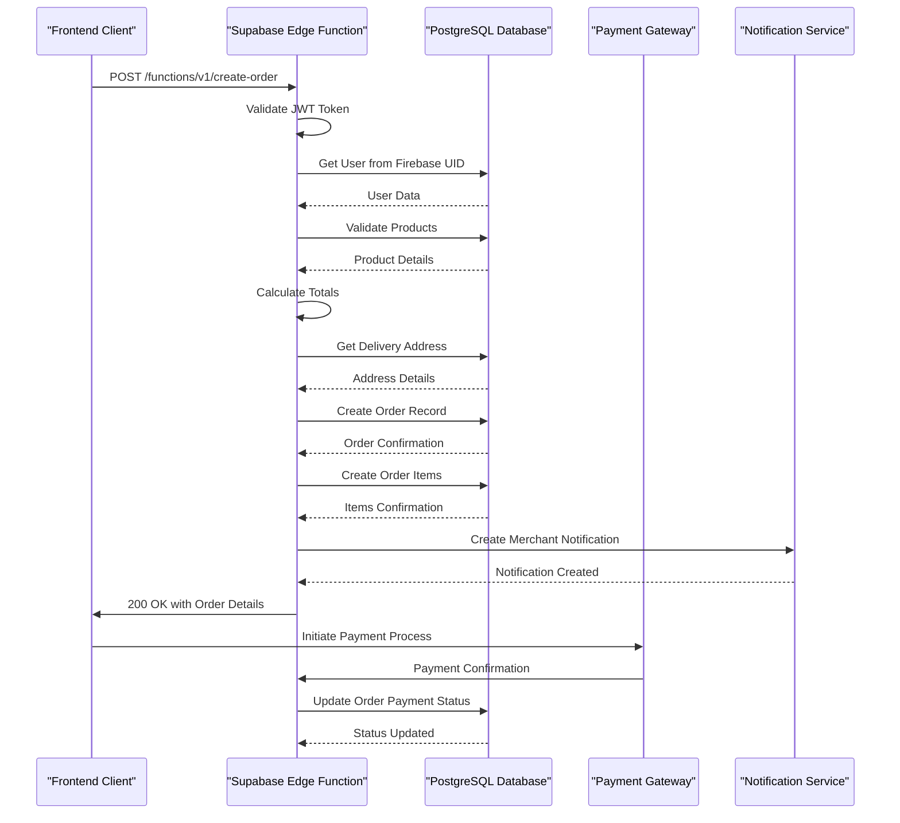

# Order Management API

<cite>
**Referenced Files in This Document**   
- [create-order/index.ts](file://supabase/functions/create-order/index.ts)
- [api.ts](file://services/api.ts)
- [apiEndpoints.ts](file://services/apiEndpoints.ts)
- [cors.ts](file://supabase/functions/_shared/cors.ts)
- [addressValidation.ts](file://utils/addressValidation.ts)
- [schema.sql](file://supabase/schema.sql)
- [orderService.ts](file://services/orderService.ts)
- [paymentService.ts](file://services/paymentService.ts)
- [validation.ts](file://utils/validation.ts)
- [checkout/index.tsx](file://app/checkout/index.tsx)
- [payment-process/index.ts](file://supabase/functions/payment-process/index.ts)
</cite>

## Table of Contents
1. [Introduction](#introduction)
2. [API Endpoint Specification](#api-endpoint-specification)
3. [Request and Response Examples](#request-and-response-examples)
4. [Error Handling](#error-handling)
5. [CORS Configuration](#cors-configuration)
6. [Input Validation](#input-validation)
7. [Client Implementation](#client-implementation)
8. [Database Integration](#database-integration)
9. [Payment Processing Integration](#payment-processing-integration)
10. [Sequence Diagram](#sequence-diagram)

## Introduction
The Order Management API in Brillprime-expo provides a robust system for creating and managing orders through Supabase Edge Functions. This documentation details the `create-order` endpoint, which handles the complete order creation workflow including validation, pricing calculation, database persistence, and integration with payment and notification systems. The API follows a serverless architecture with Firebase handling authentication and Supabase managing the backend logic.

**Section sources**
- [create-order/index.ts](file://supabase/functions/create-order/index.ts)
- [api.ts](file://services/api.ts)

## API Endpoint Specification

### Endpoint Details
- **HTTP Method**: POST
- **URL Pattern**: `/functions/v1/create-order`
- **Authentication**: Required (JWT token in Authorization header)
- **Rate Limiting**: Standard Supabase rate limits apply (1000 requests per hour per client)

### Request Parameters
The request body should be a JSON object with the following properties:

| Parameter | Type | Required | Description |
|---------|------|----------|-------------|
| `items` | Array | Yes | Array of order items containing productId and quantity |
| `deliveryAddressId` | String | Yes | UUID reference to the delivery address in the addresses table |
| `paymentMethodId` | String | Yes | Payment method identifier (card, bank_transfer, cash) |
| `notes` | String | No | Additional delivery instructions or notes |

### Request Body Schema
```json
{
  "items": [
    {
      "productId": "string",
      "quantity": "number"
    }
  ],
  "deliveryAddressId": "string",
  "paymentMethodId": "string",
  "notes": "string"
}
```

### Response Format
Successful responses return a 200 status code with the following structure:

```json
{
  "message": "Order created successfully",
  "order": {
    "id": "string",
    "user_id": "string",
    "merchant_id": "string",
    "status": "PENDING",
    "total_amount": "number",
    "subtotal": "number",
    "delivery_fee": "number",
    "delivery_address": "string",
    "payment_method": "string",
    "notes": "string",
    "created_at": "string",
    "updated_at": "string"
  }
}
```

Failed responses return appropriate HTTP status codes with error details:
```json
{
  "error": "Error message"
}
```

**Section sources**
- [create-order/index.ts](file://supabase/functions/create-order/index.ts)
- [schema.sql](file://supabase/schema.sql)

## Request and Response Examples

### Sample Request
```json
{
  "items": [
    {
      "productId": "a1b2c3d4-e5f6-7890-g1h2-i3j4k5l6m7n8",
      "quantity": 2
    },
    {
      "productId": "b2c3d4e5-f6g7-8901-h2i3-j4k5l6m7n8o9",
      "quantity": 1
    }
  ],
  "deliveryAddressId": "c3d4e5f6-g7h8-9012-i3j4-k5l6m7n8o9p0",
  "paymentMethodId": "card",
  "notes": "Please deliver to the front gate"
}
```

### Successful Response
```json
{
  "message": "Order created successfully",
  "order": {
    "id": "d4e5f6g7-h8i9-0123-j4k5-l6m7n8o9p0q1",
    "user_id": "e5f6g7h8-i9j0-1234-k5l6-m7n8o9p0q1r2",
    "merchant_id": "f6g7h8i9-j0k1-2345-l6m7-n8o9p0q1r2s3",
    "status": "PENDING",
    "total_amount": 2550.00,
    "subtotal": 2500.00,
    "delivery_fee": 50.00,
    "delivery_address": "123 Main Street, Lagos, Lagos",
    "payment_method": "card",
    "notes": "Please deliver to the front gate",
    "created_at": "2024-01-15T10:30:00.000Z",
    "updated_at": "2024-01-15T10:30:00.000Z"
  }
}
```

**Section sources**
- [create-order/index.ts](file://supabase/functions/create-order/index.ts)

## Error Handling

### Error Codes and Scenarios
The API returns specific error messages for various failure scenarios:

| HTTP Status | Error Scenario | Error Message |
|-----------|---------------|---------------|
| 401 | Authentication failed | "Unauthorized" |
| 400 | Invalid product ID | "Product {productId} not found" |
| 400 | Invalid address | "Could not verify this address" |
| 400 | User not found | "User not found" |
| 400 | General validation error | Specific error message based on validation failure |

### Payment Failure Handling
In cases where payment processing fails, the system returns:
```json
{
  "error": "Payment failed"
}
```

The frontend should handle this by prompting the user to try again with a different payment method or contact support.

**Section sources**
- [create-order/index.ts](file://supabase/functions/create-order/index.ts)
- [payment-process/index.ts](file://supabase/functions/payment-process/index.ts)

## CORS Configuration
The API uses a shared CORS configuration across all Supabase Edge Functions to ensure proper cross-origin access.

### CORS Headers
The following CORS headers are applied to all responses:

| Header | Value |
|-------|-------|
| Access-Control-Allow-Origin | * |
| Access-Control-Allow-Headers | authorization, x-client-info, apikey, content-type |
| Access-Control-Allow-Methods | POST, GET, OPTIONS, PUT, DELETE |
| Access-Control-Max-Age | 86400 (24 hours) |

### Preflight Request Handling
The system automatically handles OPTIONS preflight requests by returning a 200 status with the appropriate CORS headers, allowing the actual request to proceed.

```typescript
export function handleCors(request: Request): Response | null {
  if (request.method === 'OPTIONS') {
    return new Response('ok', { 
      headers: {
        ...corsHeaders,
        'Content-Type': 'text/plain',
      } 
    });
  }
  return null;
}
```

**Section sources**
- [cors.ts](file://supabase/functions/_shared/cors.ts)

## Input Validation

### Address Validation
The system implements comprehensive address validation using Google Places API with fallback to Expo Location services.

```typescript
export const validateAddressWithGooglePlaces = async (
  address: string
): Promise<AddressValidationResult> => {
  // Implementation details
}
```

Key validation rules:
- Address must be at least 10 characters long
- Address must be within Nigeria (geographic validation)
- Address components are verified through Google Geocoding API

### Quantity and Pricing Validation
The system validates order quantities and calculates pricing as follows:

```typescript
for (const item of items) {
  const { data: product } = await supabaseClient
    .from('products')
    .select('price, merchant_id')
    .eq('id', item.productId)
    .single();

  if (!product) {
    throw new Error(`Product ${item.productId} not found`);
  }

  const itemTotal = product.price * item.quantity;
  subtotal += itemTotal;
}
```

Validation rules:
- Quantity must be a positive number
- Product must exist in the database
- All items in an order must be from the same merchant

### Frontend Validation
Additional validation is performed in the frontend using the validation utilities:

```typescript
const quantityValidation = validateNumber(
  orderData.quantity.toString(),
  'Quantity',
  { min: 1, max: 1000, allowDecimals: true }
);
```

**Section sources**
- [addressValidation.ts](file://utils/addressValidation.ts)
- [validation.ts](file://utils/validation.ts)
- [create-order/index.ts](file://supabase/functions/create-order/index.ts)

## Client Implementation

### API Client Configuration
The frontend uses a centralized API client for all backend communications:

```typescript
export const apiClient = new ApiClient();
```

Key features:
- Automatic header management
- Request timeout handling (30 seconds)
- Comprehensive error handling with user-friendly messages
- Built-in retry logic for network failures

### Service Integration
The order creation is handled through the order service:

```typescript
async createOrder(orderData: {
  merchantId: string;
  commodityId: string;
  quantity: number;
  deliveryAddress: string;
  deliveryType: 'yourself' | 'merchant';
  paymentMethod: 'card' | 'bank_transfer' | 'cash';
  notes?: string;
}): Promise<ApiResponse<Order>> {
  const token = await authService.getToken();
  
  return apiClient.post<Order>('/functions/v1/create-order', {
    items: [{
      productId: orderData.commodityId,
      quantity: orderData.quantity
    }],
    deliveryAddressId: '1',
    paymentMethodId: orderData.paymentMethod,
    notes: orderData.notes
  }, {
    Authorization: `Bearer ${token}`,
  });
}
```

### Frontend Invocation
The endpoint is invoked from the checkout screen:

```typescript
const response = await apiClient.post('/functions/v1/create-order', orderPayload, {
  Authorization: `Bearer ${token}`
});
```

The `ORDERS.CREATE` endpoint defined in `apiEndpoints.ts` maps to the appropriate URL pattern for type-safe API calls.

**Section sources**
- [api.ts](file://services/api.ts)
- [orderService.ts](file://services/orderService.ts)
- [apiEndpoints.ts](file://services/apiEndpoints.ts)
- [checkout/index.tsx](file://app/checkout/index.tsx)

## Database Integration

### Schema Overview
The order creation process interacts with multiple database tables:

```sql
-- Orders table
CREATE TABLE IF NOT EXISTS orders (
  id UUID PRIMARY KEY DEFAULT uuid_generate_v4(),
  user_id UUID REFERENCES users(id),
  merchant_id UUID REFERENCES merchants(id),
  status TEXT NOT NULL CHECK (status IN ('PENDING', 'CONFIRMED', 'PREPARING', 'READY', 'IN_TRANSIT', 'DELIVERED', 'CANCELLED')),
  total_amount DECIMAL(10, 2) NOT NULL,
  subtotal DECIMAL(10, 2) NOT NULL,
  delivery_fee DECIMAL(10, 2) DEFAULT 0,
  delivery_address TEXT NOT NULL,
  payment_method TEXT,
  payment_status TEXT DEFAULT 'pending',
  notes TEXT,
  created_at TIMESTAMP WITH TIME ZONE DEFAULT NOW(),
  updated_at TIMESTAMP WITH TIME ZONE DEFAULT NOW()
);

-- Order items table
CREATE TABLE IF NOT EXISTS order_items (
  id UUID PRIMARY KEY DEFAULT uuid_generate_v4(),
  order_id UUID REFERENCES orders(id) ON DELETE CASCADE,
  product_id UUID REFERENCES products(id),
  quantity DECIMAL(10, 2) NOT NULL,
  unit_price DECIMAL(10, 2) NOT NULL,
  total_price DECIMAL(10, 2) NOT NULL,
  created_at TIMESTAMP WITH TIME ZONE DEFAULT NOW()
);
```

### Data Flow
1. Validate user authentication and retrieve user ID
2. Calculate order totals (subtotal, delivery fee, total amount)
3. Retrieve delivery address details
4. Create order record in the orders table
5. Create order items records in the order_items table
6. Generate merchant notification

### Transaction Management
The system uses individual database operations with error handling to ensure data consistency:

```typescript
// Create order
const { data: order, error: orderError } = await supabaseClient
  .from('orders')
  .insert({
    user_id: userData.id,
    merchant_id: merchantId,
    status: 'PENDING',
    total_amount: totalAmount,
    subtotal: subtotal,
    delivery_fee: deliveryFee,
    delivery_address: `${address.address_line1}, ${address.city}, ${address.state}`,
    payment_method: paymentMethodId,
    notes: notes,
  })
  .select()
  .single();

if (orderError) {
  throw orderError;
}

// Create order items
const { error: itemsError } = await supabaseClient
  .from('order_items')
  .insert(orderItemsWithOrderId);

if (itemsError) {
  throw itemsError;
}
```

**Section sources**
- [schema.sql](file://supabase/schema.sql)
- [create-order/index.ts](file://supabase/functions/create-order/index.ts)

## Payment Processing Integration

### Workflow Overview
Upon successful order creation, the system initiates payment processing through a separate workflow:

1. Order creation with "pending" payment status
2. Payment initiation via payment processing service
3. Payment gateway integration (Paystack/Stripe)
4. Payment status update in the database
5. Order status update based on payment result

### Payment Process Function
The payment processing is handled by a dedicated Supabase Edge Function:

```typescript
// Create transaction record
const { data: transaction, error: transactionError } = await supabaseClient
  .from('transactions')
  .insert({
    user_id: userData.id,
    order_id: orderId,
    amount: amount,
    payment_method: paymentMethod,
    status: 'pending',
    type: 'order_payment',
  })
  .select()
  .single();
```

### Notification System
The system automatically creates notifications for merchants when new orders are created:

```typescript
// Create notification for merchant
await supabaseClient.from('notifications').insert({
  user_id: merchantId,
  title: 'New Order',
  message: `You have a new order #${order.id.slice(0, 8)}`,
  type: 'order',
  role: 'merchant',
  data: { order_id: order.id },
});
```

This ensures merchants are immediately informed of new orders and can begin preparation.

**Section sources**
- [payment-process/index.ts](file://supabase/functions/payment-process/index.ts)
- [create-order/index.ts](file://supabase/functions/create-order/index.ts)

## Sequence Diagram



**Diagram sources **
- [create-order/index.ts](file://supabase/functions/create-order/index.ts)
- [payment-process/index.ts](file://supabase/functions/payment-process/index.ts)
- [schema.sql](file://supabase/schema.sql)

**Section sources**
- [create-order/index.ts](file://supabase/functions/create-order/index.ts)
- [payment-process/index.ts](file://supabase/functions/payment-process/index.ts)