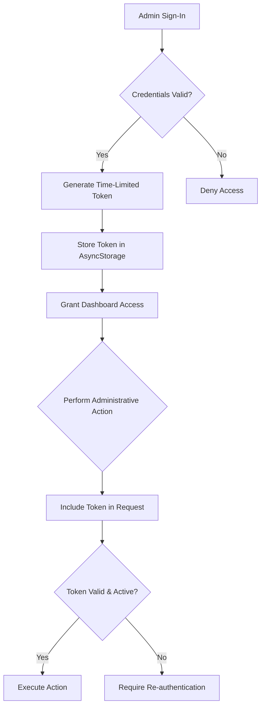
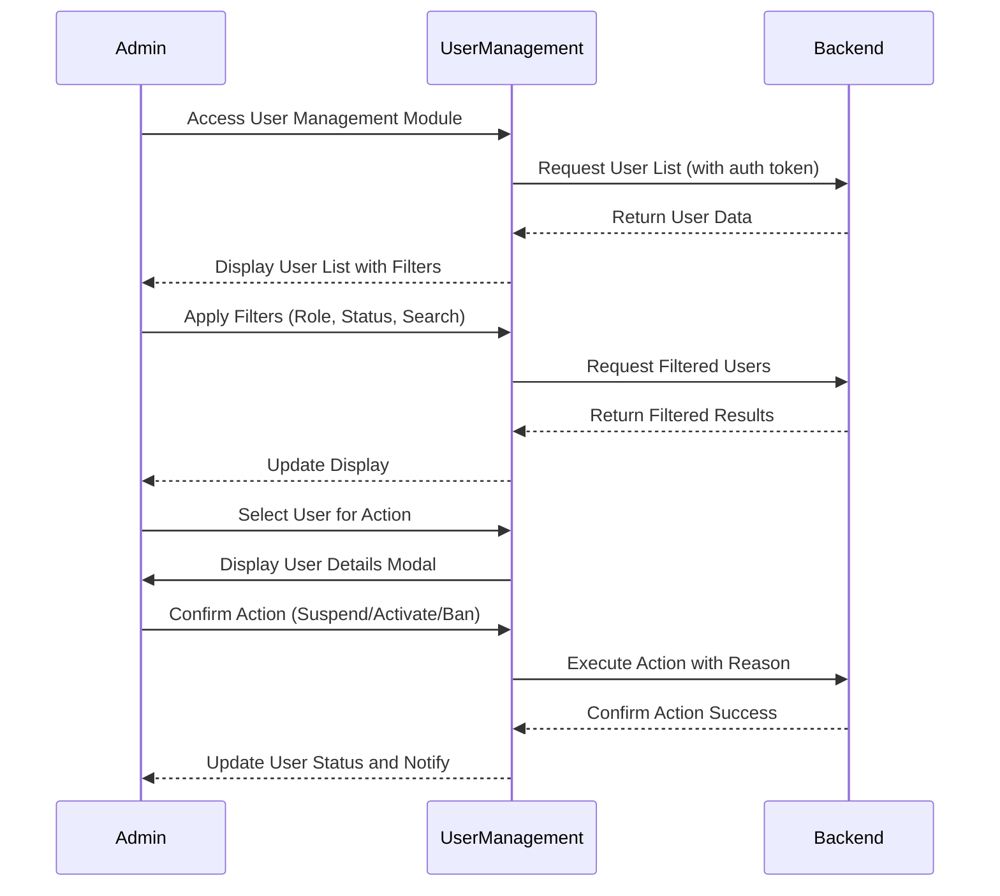
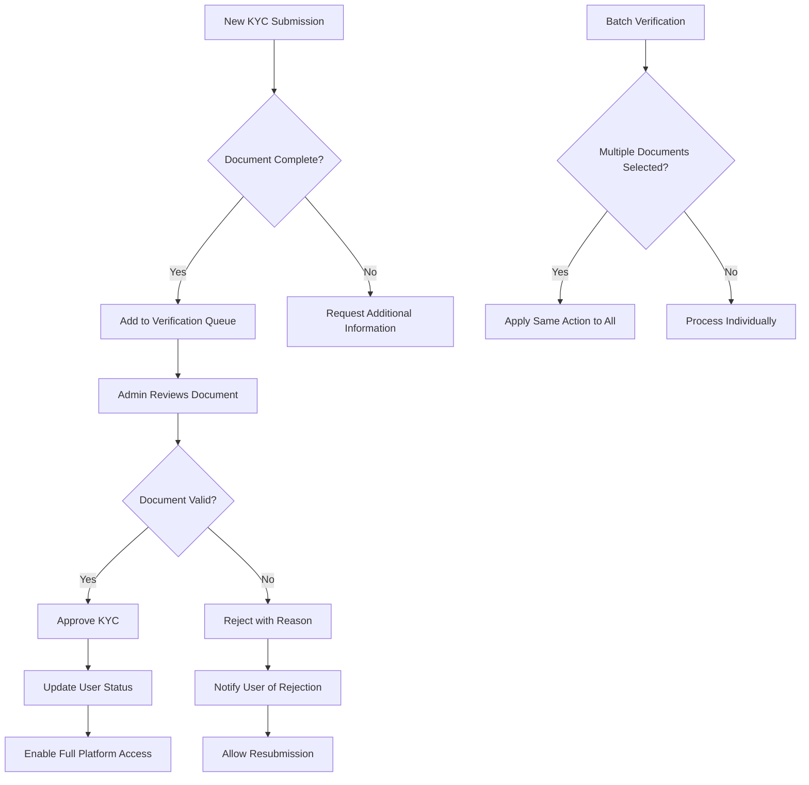
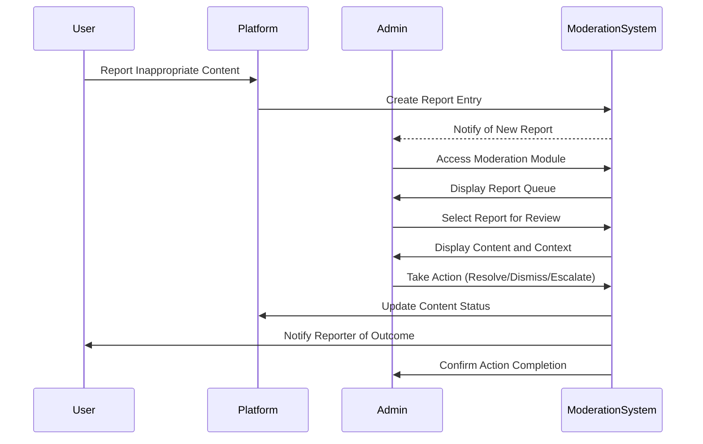
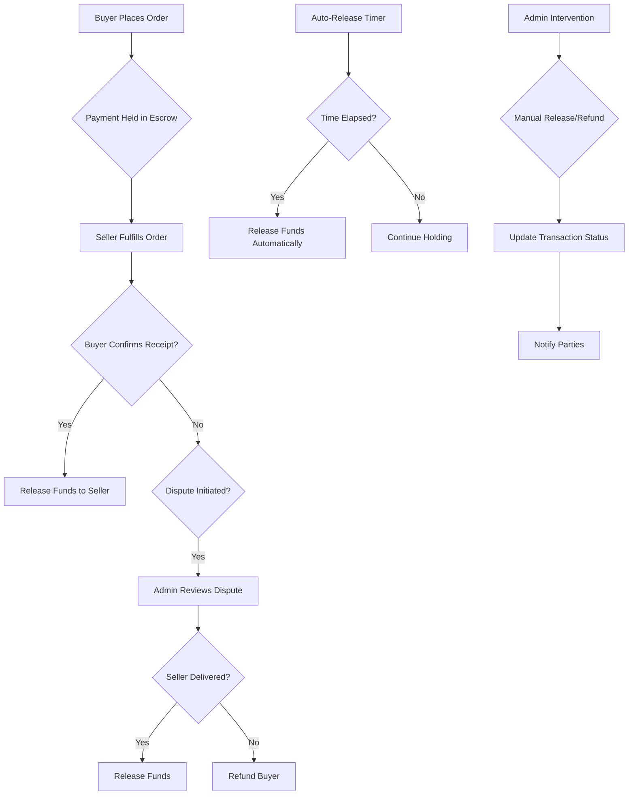
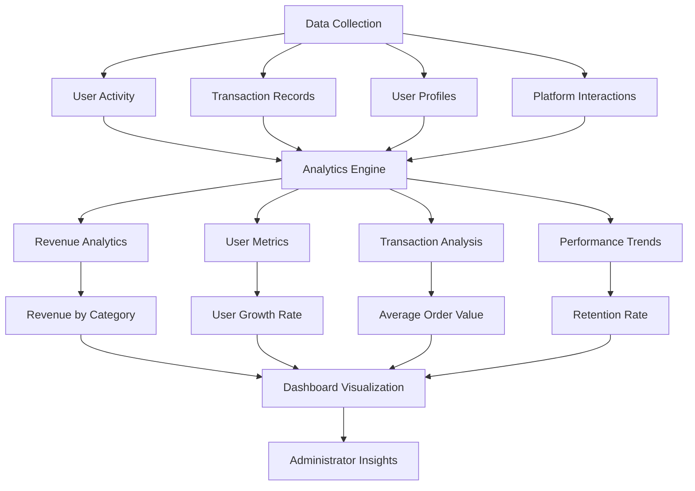

# Admin Panel

<cite>
**Referenced Files in This Document**   
- [adminService.ts](file://services/adminService.ts)
- [index.tsx](file://app/admin/index.tsx)
- [control-center.tsx](file://app/admin/control-center.tsx)
- [users.tsx](file://app/admin/users.tsx)
- [kyc-verification.tsx](file://app/admin/kyc-verification.tsx)
- [moderation.tsx](file://app/admin/moderation.tsx)
- [escrow-management.tsx](file://app/admin/escrow-management.tsx)
- [analytics.tsx](file://app/admin/analytics.tsx)
- [signin.tsx](file://app/admin/auth/signin.tsx)
- [authService.ts](file://services/authService.ts)
- [withRoleAccess.tsx](file://components/withRoleAccess.tsx)
</cite>

## Table of Contents
1. [Introduction](#introduction)
2. [Administrative Interface Overview](#administrative-interface-overview)
3. [Role-Based Access Control](#role-based-access-control)
4. [Admin Panel Components](#admin-panel-components)
5. [User Management](#user-management)
6. [KYC Verification](#kyc-verification)
7. [Content Moderation](#content-moderation)
8. [Escrow Management](#escrow-management)
9. [Business Analytics](#business-analytics)
10. [Security Measures](#security-measures)
11. [Admin Service Architecture](#admin-service-architecture)
12. [Impact on Marketplace Ecosystem](#impact-on-marketplace-ecosystem)

## Introduction
The Brillprime-expo admin panel serves as the central control system for platform management, enabling authorized administrators to oversee and manage critical aspects of the marketplace. This comprehensive interface provides privileged access to backend data and administrative operations, ensuring the platform operates efficiently, securely, and in compliance with regulatory requirements. The admin panel is designed with a focus on security, usability, and operational efficiency, allowing administrators to monitor system health, manage users, verify identities, moderate content, oversee financial transactions, and analyze business performance.

**Section sources**
- [index.tsx](file://app/admin/index.tsx#L1-L365)
- [control-center.tsx](file://app/admin/control-center.tsx#L1-L742)

## Administrative Interface Overview
The Brillprime-expo admin panel provides a centralized interface for platform administrators to manage and monitor all aspects of the marketplace ecosystem. The dashboard serves as the primary entry point, offering a comprehensive overview of system metrics, transaction status, security alerts, and platform health. Administrators gain immediate visibility into key performance indicators such as active users, escrow balances, pending KYC verifications, and system uptime through an intuitive, responsive interface.

The admin panel is organized into distinct modules accessible through a feature grid on the dashboard, each dedicated to a specific administrative function. These modules include user management, KYC verification, content moderation, escrow management, and business analytics. The interface employs a consistent design language with a dark blue gradient background and white content cards, ensuring visual coherence across all administrative functions. Real-time data updates and refresh controls allow administrators to maintain current information without requiring page reloads.

**Section sources**
- [index.tsx](file://app/admin/index.tsx#L1-L365)
- [control-center.tsx](file://app/admin/control-center.tsx#L1-L742)

## Role-Based Access Control
The Brillprime-expo platform implements a robust role-based access control (RBAC) system to ensure that only authorized personnel can access administrative features. Access to the admin panel is restricted through a dedicated authentication process that verifies credentials against a privileged access list. The system employs a multi-layered security approach, combining credential validation, session management, and token-based authentication to protect administrative functions.

Administrators must authenticate through a secure sign-in process that validates their credentials against predefined access rules. Upon successful authentication, the system generates a time-limited access token stored in AsyncStorage, which is required for all subsequent administrative operations. The RBAC system enforces the principle of least privilege, ensuring that administrative users can only access functions relevant to their designated roles and responsibilities.



**Diagram sources**
- [signin.tsx](file://app/admin/auth/signin.tsx#L1-L288)
- [authService.ts](file://services/authService.ts#L690-L944)

**Section sources**
- [signin.tsx](file://app/admin/auth/signin.tsx#L1-L288)
- [authService.ts](file://services/authService.ts#L690-L944)

## Admin Panel Components
The Brillprime-expo admin panel consists of several specialized modules, each designed to address specific platform management requirements. These components are accessible through the main dashboard and provide focused interfaces for different administrative functions. The modular design allows administrators to quickly navigate between different management areas while maintaining context and workflow continuity.

The primary components include user management for viewing and modifying user accounts, KYC verification for approving merchant identities, content moderation for handling reported content, escrow management for transaction oversight, and business analytics for performance monitoring. Each component follows a consistent design pattern with responsive layouts, filtering capabilities, and action controls, ensuring a uniform user experience across all administrative functions.

```mermaid
graph TD
A[Admin Dashboard] --> B[User Management]
A --> C[KYC Verification]
A --> D[Content Moderation]
A --> E[Escrow Management]
A --> F[Business Analytics]
A --> G[Control Center]
B --> B1[View User Accounts]
B --> B2[Modify User Status]
B --> B3[Search and Filter]
C --> C1[Review Documents]
C --> C2[Approve/Reject KYC]
C --> C3[Batch Processing]
D --> D1[Review Reports]
D --> D2[Take Moderation Actions]
D --> D3[Resolve Disputes]
E --> E1[Monitor Transactions]
E --> E2[Release Funds]
E --> E3[Refund Transactions]
F --> F1[Revenue Analytics]
F --> F2[User Metrics]
F --> F3[Performance Trends]
G --> G1[System Health]
G --> G2[Quick Actions]
G --> G3[Platform Controls]
```



**Diagram sources**
- [index.tsx](file://app/admin/index.tsx#L1-L365)
- [control-center.tsx](file://app/admin/control-center.tsx#L1-L742)

**Section sources**
- [index.tsx](file://app/admin/index.tsx#L1-L365)
- [control-center.tsx](file://app/admin/control-center.tsx#L1-L742)

## User Management
The user management module provides administrators with comprehensive tools for viewing, searching, and modifying user accounts within the Brillprime-expo platform. Administrators can access detailed user information including contact details, account status, role designation, registration date, and activity history. The interface features robust filtering capabilities that allow administrators to sort users by role (consumer, merchant, driver), status (active, suspended, pending, banned), and KYC verification status.

Administrators can perform critical account management actions directly from the user management interface, including activating, suspending, or banning user accounts. Each action requires explicit confirmation to prevent accidental modifications, and suspension actions allow administrators to provide specific reasons for account restrictions. The module displays key statistics such as total user count, active users, pending accounts, and users awaiting KYC verification, providing administrators with immediate insights into the user base composition.



**Diagram sources**
- [users.tsx](file://app/admin/users.tsx#L1-L734)
- [adminService.ts](file://services/adminService.ts#L155-L174)

**Section sources**
- [users.tsx](file://app/admin/users.tsx#L1-L734)
- [adminService.ts](file://services/adminService.ts#L155-L174)

## KYC Verification
The KYC (Know Your Customer) verification module enables administrators to review and approve identity documents submitted by merchants and other platform participants. This critical security function ensures compliance with regulatory requirements and helps prevent fraudulent activities on the platform. The interface displays a list of pending verification requests with key information including the user's name, email, document type (ID card, passport, driver's license, utility bill), submission date, and current status.

Administrators can review documents individually or process multiple verifications in batch mode, significantly improving operational efficiency. For each verification request, administrators can approve the submission, reject it with a specific reason, or request additional information. The system maintains a complete audit trail of all verification actions, including timestamps and administrator notes, ensuring accountability and transparency in the verification process.



**Diagram sources**
- [kyc-verification.tsx](file://app/admin/kyc-verification.tsx#L1-L787)
- [adminService.ts](file://services/adminService.ts#L115-L133)

**Section sources**
- [kyc-verification.tsx](file://app/admin/kyc-verification.tsx#L1-L787)
- [adminService.ts](file://services/adminService.ts#L115-L133)

## Content Moderation
The content moderation module provides administrators with tools to review reported content and maintain platform integrity. When users report inappropriate, misleading, or potentially harmful content, these reports are collected in the moderation queue with details including the content type (post, comment, product, user), reason for reporting, priority level, number of reports, and reporter information. Administrators can filter reports by status (pending, reviewed, resolved, dismissed) to prioritize their workflow.

For each reported item, administrators can take appropriate actions such as resolving the issue, dismissing the report as unfounded, or escalating to a higher authority for complex cases. The interface supports batch processing of similar reports, allowing administrators to efficiently address widespread issues. All moderation actions are logged with timestamps and administrator notes, creating a transparent audit trail for accountability and quality assurance.



**Diagram sources**
- [moderation.tsx](file://app/admin/moderation.tsx#L1-L800)
- [adminService.ts](file://services/adminService.ts#L192-L209)

**Section sources**
- [moderation.tsx](file://app/admin/moderation.tsx#L1-L800)
- [adminService.ts](file://services/adminService.ts#L192-L209)

## Escrow Management
The escrow management module provides administrators with oversight of financial transactions within the Brillprime-expo marketplace. This critical function ensures the security of funds during transactions between buyers and sellers, with administrators able to monitor held amounts, resolve disputes, and authorize fund releases. The interface displays key metrics including total escrow balance, held amounts, disputed transactions, and daily release volumes.

Administrators can view detailed transaction information including buyer and seller names, transaction amounts, order references, creation dates, and auto-release timelines. For transactions in dispute, administrators can review the dispute reason and take appropriate actions such as releasing funds to the seller, refunding the buyer, or initiating further investigation. The system supports both individual transaction processing and batch operations for efficiency in handling multiple similar cases.



**Diagram sources**
- [escrow-management.tsx](file://app/admin/escrow-management.tsx#L1-L736)
- [adminService.ts](file://services/adminService.ts#L135-L154)

**Section sources**
- [escrow-management.tsx](file://app/admin/escrow-management.tsx#L1-L736)
- [adminService.ts](file://services/adminService.ts#L135-L154)

## Business Analytics
The business analytics module provides administrators with comprehensive insights into platform performance and business intelligence. This data-driven interface presents key metrics across multiple dimensions including revenue, user growth, transaction volume, and market trends. Administrators can analyze data across different time ranges (today, week, month, year) to identify patterns, measure growth, and make informed strategic decisions.

The analytics dashboard features visual representations of data through charts and graphs, including revenue trends, user distribution by role, transaction breakdowns, and category-based revenue analysis. Detailed sections highlight top-performing merchants and drivers, financial summaries, and user retention metrics. The interface supports data export functionality, allowing administrators to generate reports for external analysis or stakeholder presentations.



**Diagram sources**
- [analytics.tsx](file://app/admin/analytics.tsx#L1-L706)
- [adminService.ts](file://services/adminService.ts#L76-L91)

**Section sources**
- [analytics.tsx](file://app/admin/analytics.tsx#L1-L706)
- [adminService.ts](file://services/adminService.ts#L76-L91)

## Security Measures
The Brillprime-expo admin panel implements multiple security measures to protect sensitive administrative functions and data. Access to the admin interface requires authentication with privileged credentials, and all sessions are protected with time-limited tokens that automatically expire after 24 hours of inactivity. The system employs audit logging for all administrative actions, creating a comprehensive record of who performed what action and when, which supports accountability and forensic analysis.

While the current implementation includes basic authentication, the code contains explicit warnings indicating that multi-factor authentication (MFA) should be implemented in production environments for enhanced security. The system also includes safeguards against unauthorized access, such as requiring explicit confirmation for destructive actions and maintaining separate authentication tokens for administrative and regular user sessions. These security measures work together to protect the integrity of the platform and prevent unauthorized modifications to critical system functions.

**Section sources**
- [signin.tsx](file://app/admin/auth/signin.tsx#L49-L56)
- [adminService.ts](file://services/adminService.ts#L55-L57)
- [authService.ts](file://services/authService.ts#L777-L799)

## Admin Service Architecture
The admin service architecture in Brillprime-expo follows a client-server model with a clear separation between the frontend interface and backend operations. The `adminService.ts` file defines a centralized service class that encapsulates all administrative operations, providing a consistent API for the frontend components to interact with backend systems. This service handles authentication by retrieving admin tokens from AsyncStorage and including them in all API requests to ensure proper authorization.

The service implements methods for key administrative functions including system metrics retrieval, analytics data fetching, platform announcements, maintenance mode toggling, report exporting, and user status management. Each method follows a consistent pattern of token validation, API request execution, and error handling, ensuring reliability and predictable behavior. The architecture supports both individual operations and batch processing, optimizing performance for administrative workflows that involve multiple similar actions.

```mermaid
classDiagram
class AdminService {
+getAdminToken() : Promise<string | null>
+getSystemMetrics() : Promise<ApiResponse<SystemMetrics>>
+getAnalytics(timeframe : string) : Promise<ApiResponse<AdminAnalytics>>
+sendAnnouncement(data : object) : Promise<ApiResponse<{sent : number}>>
+setMaintenanceMode(enabled : boolean, message? : string) : Promise<ApiResponse<{status : string}>>
+exportReport(type : string, format : string) : Promise<ApiResponse<{downloadUrl : string}>>
+toggleUserBlock(userId : string, blocked : boolean, reason? : string) : Promise<ApiResponse<{message : string}>>
}
class SystemMetrics {
+platform : object
+transactions : object
+security : object
}
class AdminAnalytics {
+revenue : object
+users : object
+transactions : object
}
AdminService --> SystemMetrics : returns
AdminService --> AdminAnalytics : returns
AdminService --> apiClient : uses
AdminService --> AsyncStorage : stores/retrieves tokens
```

**Diagram sources**
- [adminService.ts](file://services/adminService.ts#L1-L266)
- [api.ts](file://services/api.ts#L22-L220)

**Section sources**
- [adminService.ts](file://services/adminService.ts#L1-L266)
- [api.ts](file://services/api.ts#L22-L220)

## Impact on Marketplace Ecosystem
Administrative actions in the Brillprime-expo platform have significant impacts on the broader marketplace ecosystem. User management decisions directly affect platform accessibility, with account suspensions or bans removing participants from the marketplace and potentially impacting transaction volumes. KYC verification processes influence merchant onboarding speed and trustworthiness, affecting the diversity and quality of offerings available to consumers.

Content moderation actions maintain platform integrity by removing inappropriate or misleading content, thereby preserving user trust and brand reputation. Escrow management decisions resolve transaction disputes and ensure fair outcomes for buyers and sellers, maintaining confidence in the platform's financial systems. Business analytics insights guide strategic decisions that shape platform development, marketing initiatives, and feature prioritization, ultimately influencing the direction and growth of the entire marketplace ecosystem.

**Section sources**
- [users.tsx](file://app/admin/users.tsx#L1-L734)
- [kyc-verification.tsx](file://app/admin/kyc-verification.tsx#L1-L787)
- [moderation.tsx](file://app/admin/moderation.tsx#L1-L800)
- [escrow-management.tsx](file://app/admin/escrow-management.tsx#L1-L736)
- [analytics.tsx](file://app/admin/analytics.tsx#L1-L706)