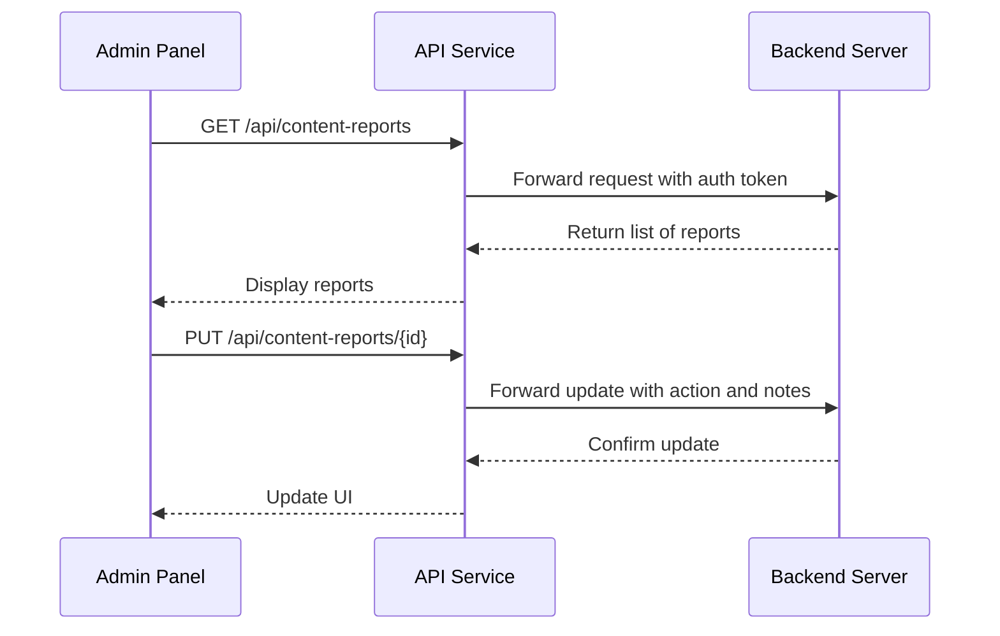
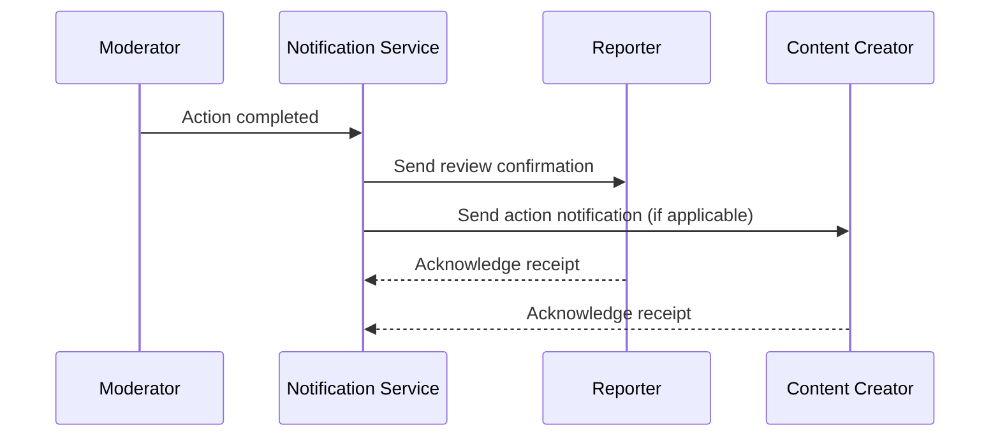

# Content Moderation

<cite>
**Referenced Files in This Document**   
- [moderation.tsx](file://app/admin/moderation.tsx)
- [apiEndpoints.ts](file://services/apiEndpoints.ts)
- [schema.sql](file://supabase/schema.sql)
- [api.ts](file://services/api.ts)
- [notificationService.ts](file://services/notificationService.ts)
- [frontend-api-calls.json](file://docs/frontend-api-calls.json)
</cite>

## Table of Contents
1. [Introduction](#introduction)
2. [Data Models](#data-models)
3. [Moderation Interface](#moderation-interface)
4. [Moderation Workflow](#moderation-workflow)
5. [Integration with Reporting and Notification Services](#integration-with-reporting-and-notification-services)
6. [Automated Flagging Rules](#automated-flagging-rules)
7. [Manual Review Process](#manual-review-process)
8. [Common Issues and Escalation Procedures](#common-issues-and-escalation-procedures)
9. [Best Practices](#best-practices)

## Introduction
The content moderation system in the Brillprime-expo admin panel provides comprehensive tools for managing user-generated content across the platform. This system enables administrators to review and take action on reported content including product listings, user reviews, and chat messages. The moderation interface offers a streamlined workflow for handling reports efficiently while maintaining community guidelines and ensuring fair moderation practices.

## Data Models
The content moderation system relies on a well-defined data model that captures essential metadata for each report. The primary data structure includes:

- **Report ID**: Unique identifier for each report
- **Content Type**: Specifies the type of content being reported (POST, COMMENT, PRODUCT, USER)
- **Content ID**: Reference to the specific content item
- **Reason**: User-provided reason for reporting
- **Status**: Current state of the report (PENDING, REVIEWED, RESOLVED, DISMISSED)
- **Priority**: Severity level (LOW, MEDIUM, HIGH, CRITICAL)
- **Report Count**: Number of times the content has been reported
- **Created At**: Timestamp of when the report was created
- **Reporter**: Information about the user who submitted the report (ID, full name, email)
- **Content**: Optional field containing the actual content that was reported

This data model is implemented in the frontend as a TypeScript interface and mirrored in the backend database schema.

**Section sources**
- [moderation.tsx](file://app/admin/moderation.tsx#L20-L35)
- [schema.sql](file://supabase/schema.sql)

## Moderation Interface
The moderation interface in `moderation.tsx` provides a comprehensive dashboard for administrators to manage content reports. The interface layout includes several key components:

### Header Section
The header contains navigation controls including a back button and refresh button, with the title "Content Moderation" prominently displayed.

### Statistics Cards
Four key performance indicators are displayed in a grid layout:
- **Pending Reports**: Number of reports awaiting review
- **Resolved Today**: Number of reports successfully handled today
- **Average Resolution Time**: Average time to resolve reports
- **Total Reports**: Cumulative count of all reports

### Filter Tabs
Administrators can filter reports by status using tabs for:
- All reports
- Pending reports
- Reviewed reports
- Resolved reports

Each tab displays a badge with the count of reports in that category.

### Reports List
The main content area displays a list of reports with the following information for each:
- Content type icon
- Content type label
- Priority badge with color coding
- Report reason
- Content preview (truncated)
- Status badge with color coding
- Time since report creation
- Report count
- Reporter information

### Action Buttons
For pending reports, an action button labeled "Take Action" is displayed, which opens a modal for moderation decisions.

### Action Modal
When an administrator selects a report for action, a modal appears with:
- Report preview showing content type, reason, and content
- Text input for moderation notes
- Three action buttons:
  - Resolve (green)
  - Dismiss (gray)
  - Escalate (yellow)

**Section sources**
- [moderation.tsx](file://app/admin/moderation.tsx#L37-L800)

## Moderation Workflow
The moderation workflow follows a structured process from report submission to resolution:

### Report Submission
Users can report content through the app interface, which creates a new entry in the content reports system. Each report includes the reporter's information, reason for reporting, and reference to the content.

### Report Review
Administrators access the moderation panel to review pending reports. The system displays reports in order of priority, with critical and high-priority reports appearing first.

### Action Execution
When taking action on a report, administrators must confirm their decision through a confirmation dialog. The available actions are:

- **Resolve**: Removes the reported content and notifies the content creator
- **Dismiss**: Keeps the content as is and notifies the reporter that their report was reviewed and dismissed
- **Escalate**: Flags the report for senior moderators or specialized teams

### Batch Processing
The interface supports batch actions, allowing administrators to resolve or dismiss multiple selected reports simultaneously, improving efficiency for handling similar cases.

### Status Updates
After an action is taken, the report status is updated in the system, and the interface reflects this change immediately without requiring a page refresh.

**Section sources**
- [moderation.tsx](file://app/admin/moderation.tsx#L190-L236)
- [apiEndpoints.ts](file://services/apiEndpoints.ts#L159-L162)

## Integration with Reporting and Notification Services
The moderation system integrates seamlessly with the reporting service and notification service to create a closed-loop moderation process.

### Reporting Service Integration
The moderation panel retrieves reports from the backend API endpoint `/api/content-reports` using the GET method. When actions are taken, the system updates the report status through the PUT method on `/api/content-reports/:id`. The frontend communicates with the backend through the `apiClient` service, which handles authentication and error management.

**Diagram sources**
- [moderation.tsx](file://app/admin/moderation.tsx#L115-L132)
- [apiEndpoints.ts](file://services/apiEndpoints.ts#L148-L151)
- [api.ts](file://services/api.ts#L155-L161)

### Notification Service Integration
After moderation actions are completed, the notification service is triggered to inform relevant parties:

- Reporters are notified when their report has been reviewed
- Content creators are notified when their content has been removed or flagged
- Administrators receive notifications for escalated reports

The notification system uses the `/api/notifications` endpoint to send messages, with different notification types for various moderation outcomes.

**Diagram sources**
- [notificationService.ts](file://services/notificationService.ts#L116-L143)
- [moderation.tsx](file://app/admin/moderation.tsx#L231-L235)

## Automated Flagging Rules
The system employs automated flagging rules to identify potentially problematic content before it reaches human moderators. These rules are implemented in the backend and trigger automatic reporting based on specific criteria:

### Keyword Detection
Content containing predefined keywords or phrases associated with prohibited material is automatically flagged. This includes:
- Hate speech terms
- Explicit sexual content
- Violent threats
- Spam patterns
- Fraudulent claims

### Pattern Recognition
The system identifies suspicious patterns such as:
- Excessive posting frequency
- Duplicate content across multiple accounts
- Suspicious linking behavior
- Price manipulation indicators in product listings

### User Behavior Analysis
Automated systems monitor user behavior for signs of abuse:
- Multiple reports from the same user
- Content repeatedly flagged by different users
- Sudden changes in posting patterns
- Attempts to circumvent previous moderation actions

### Machine Learning Models
The platform utilizes machine learning models trained on historical moderation data to predict the likelihood of content violating community guidelines. These models assign risk scores that determine the priority level of reports.

## Manual Review Process
While automated systems handle initial flagging, human moderators perform the final review and decision-making. The manual review process follows these steps:

### Triage
Reports are sorted by priority, with critical and high-priority reports reviewed first. The system displays the number of previous reports for each item, helping moderators assess the severity.

### Context Evaluation
Moderators review the reported content in context, considering:
- The full content of the post, comment, or product listing
- The conversation thread (for comments and messages)
- The user's history and previous moderation interactions
- Cultural and contextual factors that might affect interpretation

### Decision Making
Based on their evaluation, moderators choose from three actions:
- **Approve**: The content complies with guidelines and remains published
- **Remove**: The content violates guidelines and is removed
- **Warn User**: The content is borderline, and the user receives a warning

### Documentation
Moderators are required to provide notes explaining their decisions, which are stored in the system for audit purposes and to improve automated detection over time.

### Quality Assurance
Senior moderators periodically review decisions made by junior moderators to ensure consistency and adherence to guidelines.

## Common Issues and Escalation Procedures
The moderation system addresses several common challenges in content moderation:

### False Positives in Automated Detection
Automated systems sometimes flag legitimate content as problematic. To address this:

- Moderators are trained to recognize context that algorithms might miss
- A "false positive" feedback mechanism allows moderators to flag incorrect automated detections
- The system tracks false positive rates by content type and keyword to refine detection rules

### Sensitive Content
Certain types of content require special handling:

- **Illegal content**: Immediately escalated to legal team with appropriate law enforcement reporting
- **Self-harm or suicide references**: Escalated to mental health professionals with appropriate support resources
- **Child safety issues**: Immediate escalation with mandatory reporting procedures

### Escalation Procedures
When moderators encounter situations beyond their authority, they follow escalation procedures:

1. **Technical Escalation**: Issues with the moderation tool itself are reported to the engineering team
2. **Policy Escalation**: Ambiguous cases that require policy clarification are sent to the moderation policy team
3. **Legal Escalation**: Potentially illegal content is escalated to the legal department
4. **Executive Escalation**: High-profile cases or systemic issues are escalated to executive leadership

The interface includes an "Escalate" button that initiates this process and routes the report to the appropriate team.

## Best Practices
To maintain community guidelines while ensuring fair moderation, the following best practices are recommended:

### Consistency
Apply rules consistently across all users and content types, regardless of user status or popularity.

### Transparency
Provide clear explanations for moderation decisions and maintain accessible community guidelines.

### Proportionality
Ensure that moderation actions are proportionate to the violation, using warnings for minor infractions and removal for serious violations.

### Appeal Process
Implement a fair appeal process that allows users to contest moderation decisions with new evidence.

### Privacy Protection
Handle sensitive information with appropriate privacy controls, limiting access to authorized personnel only.

### Continuous Training
Provide regular training for moderators on updated policies, cultural sensitivity, and bias recognition.

### Data-Driven Improvement
Analyze moderation data to identify trends, improve guidelines, and refine automated detection systems.

### Community Engagement
Involve the community in guideline development and receive feedback on moderation practices to build trust and improve policies.