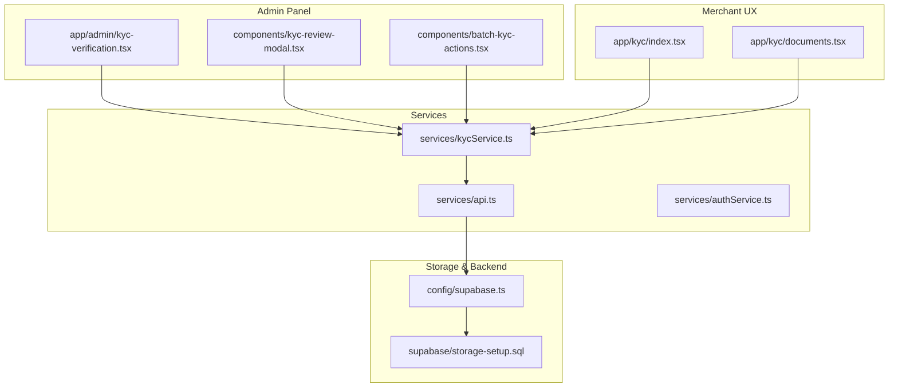
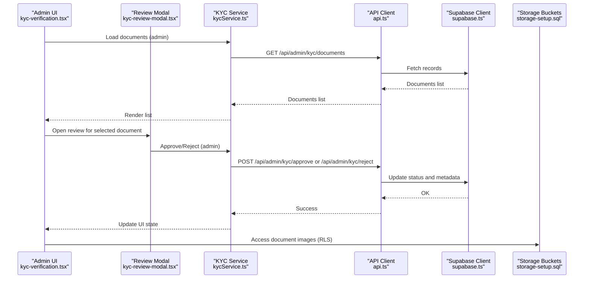
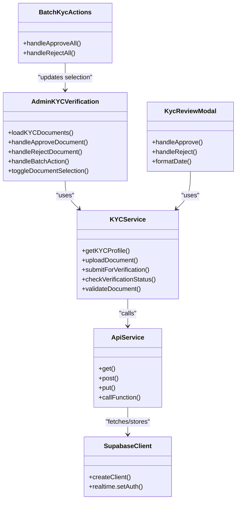
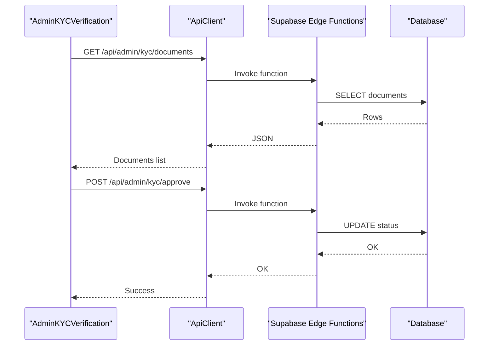
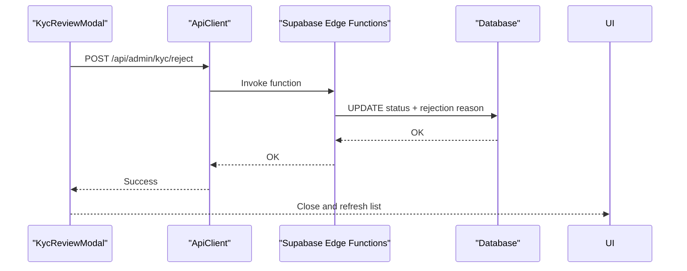
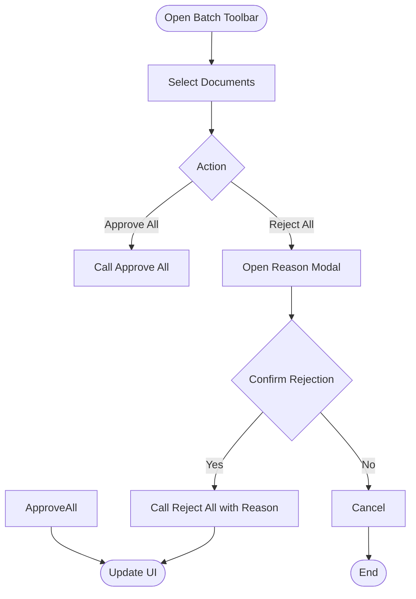
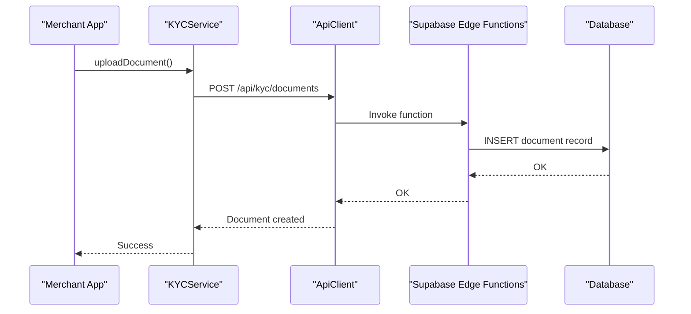
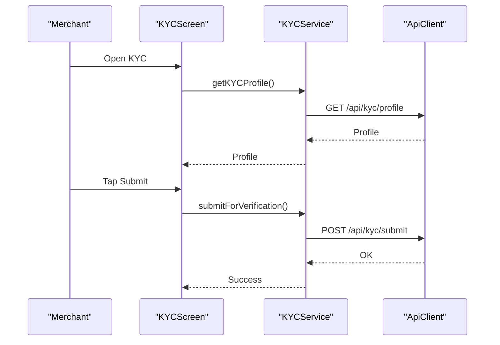
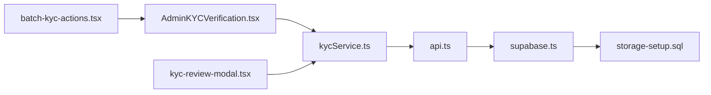

# KYC Verification

<cite>
**Referenced Files in This Document**
- [kyc-verification.tsx](file://app/admin/kyc-verification.tsx)
- [kyc-review-modal.tsx](file://components/kyc-review-modal.tsx)
- [batch-kyc-actions.tsx](file://components/batch-kyc-actions.tsx)
- [kycService.ts](file://services/kycService.ts)
- [documents.tsx](file://app/kyc/documents.tsx)
- [index.tsx](file://app/kyc/index.tsx)
- [supabase.ts](file://config/supabase.ts)
- [storage-setup.sql](file://supabase/storage-setup.sql)
- [api.ts](file://services/api.ts)
- [authService.ts](file://services/authService.ts)
</cite>

## Table of Contents
1. [Introduction](#introduction)
2. [Project Structure](#project-structure)
3. [Core Components](#core-components)
4. [Architecture Overview](#architecture-overview)
5. [Detailed Component Analysis](#detailed-component-analysis)
6. [Dependency Analysis](#dependency-analysis)
7. [Performance Considerations](#performance-considerations)
8. [Troubleshooting Guide](#troubleshooting-guide)
9. [Conclusion](#conclusion)

## Introduction
This document explains the KYC (Know Your Customer) verification feature in the Brillprime-expo admin panel. It covers how merchants submit identity and business documents, how moderators review and approve or reject submissions, and how the system integrates with Supabase storage and backend APIs. It also defines the KYC status domain model, merchant functionality impacts, moderator decision workflows, audit logging practices, and performance recommendations for high-volume verification.

## Project Structure
The KYC verification feature spans:
- Admin UI for reviewing and acting on KYC submissions
- Merchant-side KYC submission and status tracking
- Shared service layer for API communication and validation
- Supabase storage for secure document handling

**Diagram sources**
- [kyc-verification.tsx](file://app/admin/kyc-verification.tsx#L1-L200)
- [kyc-review-modal.tsx](file://components/kyc-review-modal.tsx#L1-L120)
- [batch-kyc-actions.tsx](file://components/batch-kyc-actions.tsx#L1-L80)
- [kycService.ts](file://services/kycService.ts#L1-L120)
- [documents.tsx](file://app/kyc/documents.tsx#L1-L120)
- [index.tsx](file://app/kyc/index.tsx#L1-L80)
- [supabase.ts](file://config/supabase.ts#L1-L60)
- [storage-setup.sql](file://supabase/storage-setup.sql#L38-L60)
- [api.ts](file://services/api.ts#L1-L60)
- [authService.ts](file://services/authService.ts#L1-L60)

**Section sources**
- [kyc-verification.tsx](file://app/admin/kyc-verification.tsx#L1-L120)
- [kycService.ts](file://services/kycService.ts#L1-L120)
- [supabase.ts](file://config/supabase.ts#L1-L60)

## Core Components
- Admin KYC list and actions: loads pending documents, filters by status, supports single and batch approvals/rejections, and opens a review modal.
- KYC review modal: previews document images, displays user and document metadata, and handles approve/reject decisions.
- Batch KYC actions: provides a persistent toolbar to approve or reject multiple documents with a reason.
- KYC service: orchestrates merchant-side KYC operations (profile, requirements, upload, submit, status) and validates documents.
- Merchant KYC screens: index page for status and steps, and documents upload page with validation and submission.
- Supabase integration: client initialization, storage bucket configuration, and RLS policies for secure document storage.

**Section sources**
- [kyc-verification.tsx](file://app/admin/kyc-verification.tsx#L1-L200)
- [kyc-review-modal.tsx](file://components/kyc-review-modal.tsx#L1-L120)
- [batch-kyc-actions.tsx](file://components/batch-kyc-actions.tsx#L1-L80)
- [kycService.ts](file://services/kycService.ts#L1-L120)
- [documents.tsx](file://app/kyc/documents.tsx#L1-L120)
- [index.tsx](file://app/kyc/index.tsx#L1-L80)
- [supabase.ts](file://config/supabase.ts#L1-L60)
- [storage-setup.sql](file://supabase/storage-setup.sql#L38-L60)

## Architecture Overview
The admin panel communicates with the backend via the shared API client. The merchant app uses the same service layer to upload documents and track verification status. Supabase provides:
- Authentication and session management
- Edge Functions for serverless logic
- Storage buckets for KYC documents with strict RLS policies

**Diagram sources**
- [kyc-verification.tsx](file://app/admin/kyc-verification.tsx#L120-L220)
- [kyc-review-modal.tsx](file://components/kyc-review-modal.tsx#L70-L120)
- [kycService.ts](file://services/kycService.ts#L308-L383)
- [api.ts](file://services/api.ts#L155-L214)
- [supabase.ts](file://config/supabase.ts#L67-L83)
- [storage-setup.sql](file://supabase/storage-setup.sql#L112-L132)

## Detailed Component Analysis

### Admin KYC Verification Screen
Responsibilities:
- Load and display pending KYC documents for moderators
- Filter by status (all, pending, approved, rejected)
- Select multiple documents for batch actions
- Open a review modal to approve or reject a document
- Perform batch approve/reject with a reason

UI components:
- Stats bar showing pending count
- Filter tabs for status
- Document cards with user info, document type, dates, and status badges
- Checkbox selection for batch actions
- Review modal with document preview and action buttons
- Batch actions toolbar with approve/reject controls

Backend integration:
- Fetches documents via a dedicated admin endpoint
- Approve/reject endpoints update status and metadata
- Batch endpoint applies bulk decisions

**Section sources**
- [kyc-verification.tsx](file://app/admin/kyc-verification.tsx#L1-L200)
- [kyc-verification.tsx](file://app/admin/kyc-verification.tsx#L200-L420)
- [kyc-verification.tsx](file://app/admin/kyc-verification.tsx#L420-L511)

### KYC Review Modal
Responsibilities:
- Display user and document metadata
- Preview front/back images
- Capture rejection reason and action notes
- Approve or reject with confirmation

UI components:
- Header with close button
- User info section
- Document details section
- Image preview grid
- Rejection reason input (conditionally shown)
- Action buttons with loading states

Backend integration:
- Calls admin approve/reject endpoints
- Updates UI state on success

**Section sources**
- [kyc-review-modal.tsx](file://components/kyc-review-modal.tsx#L1-L120)
- [kyc-review-modal.tsx](file://components/kyc-review-modal.tsx#L120-L220)
- [kyc-review-modal.tsx](file://components/kyc-review-modal.tsx#L220-L338)

### Batch KYC Actions
Responsibilities:
- Provide a persistent toolbar when documents are selected
- Approve all or reject all with a single reason
- Clear selection

UI components:
- Selected count indicator
- Clear, Reject All, Approve All buttons
- Reject reason modal for bulk rejections

Backend integration:
- Approve/reject handlers call admin endpoints
- Clears selection on success

**Section sources**
- [batch-kyc-actions.tsx](file://components/batch-kyc-actions.tsx#L1-L80)
- [batch-kyc-actions.tsx](file://components/batch-kyc-actions.tsx#L80-L176)

### KYC Service (Merchant and Admin)
Responsibilities:
- Merchant-side: get profile, update personal/business/driver info, upload documents, submit for verification, check status, validate documents
- Admin-side: approve/reject/batch actions are invoked from admin screens

Domain model:
- KYCDocument: type, numbers, front/back URLs, status, timestamps, optional rejection reason and expiry
- KYCProfile: overall status, verification level, documents, personal/business/driver info
- Validation helpers for personal/business/driver info and document file checks

Backend integration:
- Uses API client to call endpoints under /api/kyc and /api/admin/kyc
- Uses AuthService to obtain tokens

**Section sources**
- [kycService.ts](file://services/kycService.ts#L1-L120)
- [kycService.ts](file://services/kycService.ts#L120-L240)
- [kycService.ts](file://services/kycService.ts#L240-L383)
- [kycService.ts](file://services/kycService.ts#L383-L430)

### Merchant KYC Screens
KYC Index:
- Loads profile and verification status
- Shows completion steps and next steps
- Submits for verification when prerequisites are met

Documents Upload:
- Validates form fields and document file constraints
- Uploads images/PDFs to backend
- Provides upload guidelines and removal controls

**Section sources**
- [index.tsx](file://app/kyc/index.tsx#L1-L180)
- [index.tsx](file://app/kyc/index.tsx#L180-L324)
- [documents.tsx](file://app/kyc/documents.tsx#L1-L120)
- [documents.tsx](file://app/kyc/documents.tsx#L120-L240)

### Supabase Integration
Supabase client:
- Initialized with URL and anon key from environment
- Configures auth and global headers
- Provides validation and error handling

Storage:
- Dedicated bucket for KYC documents with private access
- RLS policies allow authenticated users to upload/view/delete their own documents
- Admins can access via service role

**Section sources**
- [supabase.ts](file://config/supabase.ts#L1-L60)
- [supabase.ts](file://config/supabase.ts#L67-L120)
- [storage-setup.sql](file://supabase/storage-setup.sql#L38-L60)
- [storage-setup.sql](file://supabase/storage-setup.sql#L112-L132)

## Architecture Overview

**Diagram sources**
- [kyc-verification.tsx](file://app/admin/kyc-verification.tsx#L120-L220)
- [kyc-review-modal.tsx](file://components/kyc-review-modal.tsx#L70-L120)
- [batch-kyc-actions.tsx](file://components/batch-kyc-actions.tsx#L1-L80)
- [kycService.ts](file://services/kycService.ts#L308-L383)
- [api.ts](file://services/api.ts#L155-L214)
- [supabase.ts](file://config/supabase.ts#L67-L83)

## Detailed Component Analysis

### Admin KYC Verification Screen
- Data flow: fetches documents, renders list, applies filters, selects rows, opens modal, performs actions
- UI: responsive layout, status badges, filter tabs, batch toolbar, modal overlay
- Backend: admin endpoints for documents, approve, reject, batch

**Diagram sources**
- [kyc-verification.tsx](file://app/admin/kyc-verification.tsx#L120-L220)
- [api.ts](file://services/api.ts#L155-L214)

**Section sources**
- [kyc-verification.tsx](file://app/admin/kyc-verification.tsx#L1-L200)
- [kyc-verification.tsx](file://app/admin/kyc-verification.tsx#L200-L420)

### KYC Review Modal
- Decision workflow: open modal, optionally capture rejection reason, confirm action, call backend, update UI
- Image preview: front/back images rendered from URLs

**Diagram sources**
- [kyc-review-modal.tsx](file://components/kyc-review-modal.tsx#L70-L120)
- [api.ts](file://services/api.ts#L155-L214)

**Section sources**
- [kyc-review-modal.tsx](file://components/kyc-review-modal.tsx#L1-L120)
- [kyc-review-modal.tsx](file://components/kyc-review-modal.tsx#L120-L220)

### Batch KYC Actions
- Workflow: select multiple, open reject reason modal, confirm bulk action, call batch endpoint, clear selection

**Diagram sources**
- [batch-kyc-actions.tsx](file://components/batch-kyc-actions.tsx#L1-L80)
- [batch-kyc-actions.tsx](file://components/batch-kyc-actions.tsx#L80-L176)

**Section sources**
- [batch-kyc-actions.tsx](file://components/batch-kyc-actions.tsx#L1-L80)
- [batch-kyc-actions.tsx](file://components/batch-kyc-actions.tsx#L80-L176)

### KYC Service (Merchant and Admin)
- Merchant operations: profile, requirements, upload, submit, status, validation
- Admin operations: approve, reject, batch actions (invoked from admin screens)

**Diagram sources**
- [kycService.ts](file://services/kycService.ts#L308-L383)
- [api.ts](file://services/api.ts#L155-L214)

**Section sources**
- [kycService.ts](file://services/kycService.ts#L1-L120)
- [kycService.ts](file://services/kycService.ts#L120-L240)
- [kycService.ts](file://services/kycService.ts#L240-L383)
- [kycService.ts](file://services/kycService.ts#L383-L430)

### Merchant KYC Screens
- KYC Index: loads profile and status, shows completion steps, submits for verification
- Documents Upload: validates form and file constraints, uploads to backend

**Diagram sources**
- [index.tsx](file://app/kyc/index.tsx#L1-L180)
- [kycService.ts](file://services/kycService.ts#L369-L383)
- [api.ts](file://services/api.ts#L155-L214)

**Section sources**
- [index.tsx](file://app/kyc/index.tsx#L1-L180)
- [index.tsx](file://app/kyc/index.tsx#L180-L324)
- [documents.tsx](file://app/kyc/documents.tsx#L1-L120)
- [documents.tsx](file://app/kyc/documents.tsx#L120-L240)

## Dependency Analysis
- Admin screens depend on KYC service for admin endpoints
- KYC service depends on API client and AuthService for tokens
- API client depends on Supabase client and environment configuration
- Supabase client depends on environment variables and RLS policies
- Storage relies on bucket creation and RLS policies for access control

**Diagram sources**
- [kyc-verification.tsx](file://app/admin/kyc-verification.tsx#L120-L220)
- [kyc-review-modal.tsx](file://components/kyc-review-modal.tsx#L70-L120)
- [batch-kyc-actions.tsx](file://components/batch-kyc-actions.tsx#L1-L80)
- [kycService.ts](file://services/kycService.ts#L308-L383)
- [api.ts](file://services/api.ts#L155-L214)
- [supabase.ts](file://config/supabase.ts#L67-L83)
- [storage-setup.sql](file://supabase/storage-setup.sql#L112-L132)

**Section sources**
- [kyc-verification.tsx](file://app/admin/kyc-verification.tsx#L1-L200)
- [kycService.ts](file://services/kycService.ts#L1-L120)
- [api.ts](file://services/api.ts#L1-L60)
- [supabase.ts](file://config/supabase.ts#L1-L60)
- [storage-setup.sql](file://supabase/storage-setup.sql#L38-L60)

## Performance Considerations
- Optimize document previews: lazy-load images and use thumbnails where possible
- Debounce refresh actions to avoid excessive network calls
- Paginate admin document lists for large datasets
- Cache merchant status and profile data locally to reduce repeated fetches
- Compress images before upload to minimize bandwidth and storage costs
- Use background processing for batch actions to prevent UI blocking
- Implement exponential backoff for retrying transient failures

[No sources needed since this section provides general guidance]

## Troubleshooting Guide
Common issues and resolutions:
- Incomplete document uploads:
  - Validate file size and type before upload
  - Ensure storage bucket permissions allow authenticated uploads
- Verification delays:
  - Check backend function health and logs
  - Monitor network timeouts and retry logic
- Authentication failures:
  - Verify Firebase token availability and refresh logic
  - Confirm Supabase client initialization and environment variables
- Storage access denied:
  - Confirm RLS policies and ownership checks
  - Ensure user is authenticated and owns the document

Audit logging practices:
- Record admin actions (approve/reject/batch) with timestamps, reasons, and notes
- Track merchant submission events and status transitions
- Maintain logs for compliance and dispute resolution

**Section sources**
- [documents.tsx](file://app/kyc/documents.tsx#L166-L204)
- [storage-setup.sql](file://supabase/storage-setup.sql#L112-L132)
- [authService.ts](file://services/authService.ts#L777-L800)
- [api.ts](file://services/api.ts#L106-L153)

## Conclusion
The KYC verification feature combines merchant self-service with robust admin moderation and secure document storage. The admin panel enables efficient review and batch processing, while the merchant UX guides users through required steps. Supabase provides secure storage and RLS policies, and the shared service layer ensures consistent API interactions. By following the recommended practices and monitoring the audit trails, the system can scale to handle high verification volumes reliably.