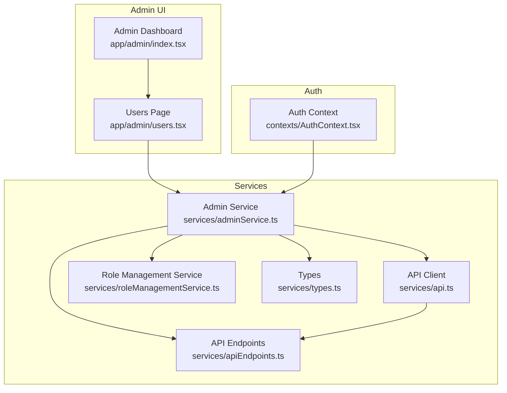
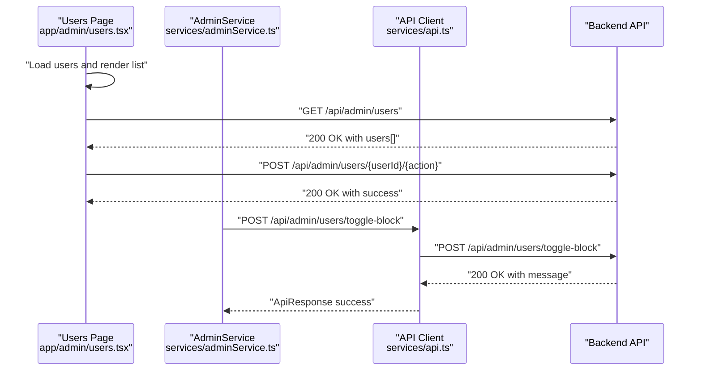
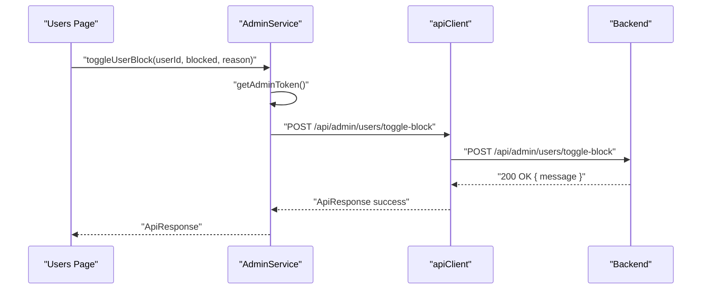
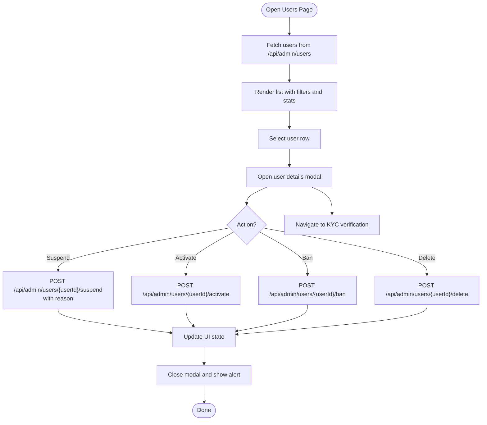
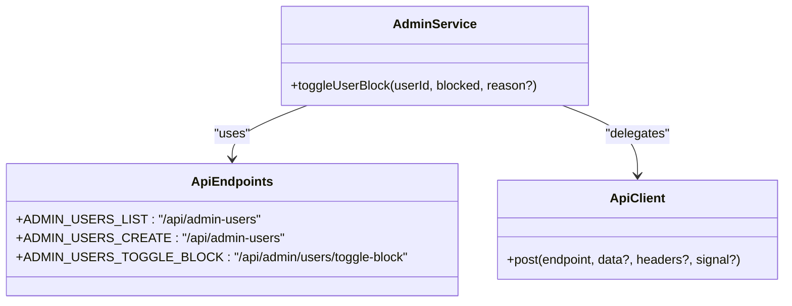
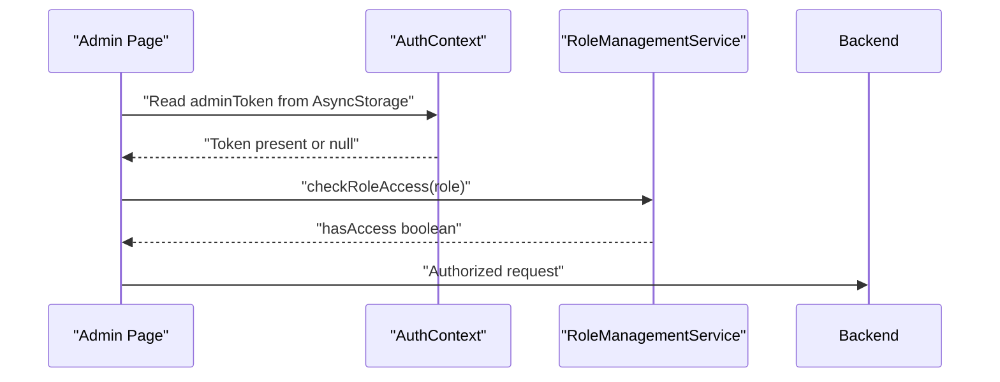
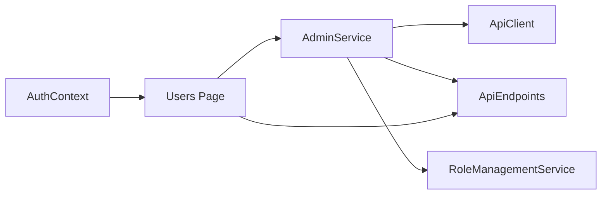

# User Management

<cite>
**Referenced Files in This Document**
- [adminService.ts](file://services/adminService.ts)
- [users.tsx](file://app/admin/users.tsx)
- [AuthContext.tsx](file://contexts/AuthContext.tsx)
- [roleManagementService.ts](file://services/roleManagementService.ts)
- [apiEndpoints.ts](file://services/apiEndpoints.ts)
- [api.ts](file://services/api.ts)
- [types.ts](file://services/types.ts)
- [adminDashboard.tsx](file://app/admin/index.tsx)
- [errorService.ts](file://services/errorService.ts)
</cite>

## Table of Contents
1. [Introduction](#introduction)
2. [Project Structure](#project-structure)
3. [Core Components](#core-components)
4. [Architecture Overview](#architecture-overview)
5. [Detailed Component Analysis](#detailed-component-analysis)
6. [Dependency Analysis](#dependency-analysis)
7. [Performance Considerations](#performance-considerations)
8. [Troubleshooting Guide](#troubleshooting-guide)
9. [Conclusion](#conclusion)
10. [Appendices](#appendices)

## Introduction
This document explains the user management sub-feature in the Brillprime-expo admin panel. It covers how administrators list users, inspect user details, and perform actions such as blocking/unblocking users. It also documents the API surface used by the adminService and the Users management interface, including request/response schemas, error handling, and integration with AuthContext and roleManagementService for permission enforcement. Guidance is included for secure handling of user data in compliance with privacy regulations.

## Project Structure
The user management feature spans UI components, services, and shared types:
- UI: Admin Users page renders a list, filters, and a modal for user inspection and actions.
- Services: adminService encapsulates admin API calls; api.ts provides the HTTP client; apiEndpoints.ts centralizes endpoint definitions; roleManagementService manages role states; types.ts defines shared data structures.
- Context: AuthContext provides authentication state and helpers used by admin pages.

**Diagram sources**
- [users.tsx](file://app/admin/users.tsx#L1-L734)
- [adminService.ts](file://services/adminService.ts#L1-L266)
- [api.ts](file://services/api.ts#L1-L220)
- [apiEndpoints.ts](file://services/apiEndpoints.ts#L1-L197)
- [roleManagementService.ts](file://services/roleManagementService.ts#L1-L302)
- [types.ts](file://services/types.ts#L1-L228)
- [AuthContext.tsx](file://contexts/AuthContext.tsx#L1-L149)
- [adminDashboard.tsx](file://app/admin/index.tsx#L1-L365)

**Section sources**
- [users.tsx](file://app/admin/users.tsx#L1-L734)
- [adminService.ts](file://services/adminService.ts#L1-L266)
- [api.ts](file://services/api.ts#L1-L220)
- [apiEndpoints.ts](file://services/apiEndpoints.ts#L1-L197)
- [roleManagementService.ts](file://services/roleManagementService.ts#L1-L302)
- [types.ts](file://services/types.ts#L1-L228)
- [AuthContext.tsx](file://contexts/AuthContext.tsx#L1-L149)
- [adminDashboard.tsx](file://app/admin/index.tsx#L1-L365)

## Core Components
- AdminService: Provides admin-specific operations including toggling user block status and exporting reports. It reads admin tokens from AsyncStorage and delegates HTTP calls to apiClient.
- Users Page: Implements user listing, filtering, and inline actions (activate/suspend/ban) via direct fetch calls to backend endpoints. It also displays user details in a modal and allows navigation to KYC verification.
- API Client: Centralizes HTTP requests with timeouts, standardized headers, and user-friendly error mapping.
- API Endpoints: Defines endpoint constants for admin routes used by adminService and UI.
- Role Management Service: Manages role status and access checks; useful for enforcing permissions in admin workflows.
- Types: Shared interfaces for user data and API responses.
- Auth Context: Supplies authentication state and utilities used by admin pages.

**Section sources**
- [adminService.ts](file://services/adminService.ts#L155-L174)
- [users.tsx](file://app/admin/users.tsx#L162-L207)
- [api.ts](file://services/api.ts#L157-L206)
- [apiEndpoints.ts](file://services/apiEndpoints.ts#L150-L184)
- [roleManagementService.ts](file://services/roleManagementService.ts#L122-L168)
- [types.ts](file://services/types.ts#L1-L60)
- [AuthContext.tsx](file://contexts/AuthContext.tsx#L1-L149)

## Architecture Overview
The admin user management flow integrates UI actions with service-layer APIs and backend endpoints. AdminService encapsulates admin operations and uses apiClient for HTTP requests. The Users page performs direct fetch calls for listing and state changes. AuthContext supplies authentication state for admin pages.

**Diagram sources**
- [users.tsx](file://app/admin/users.tsx#L60-L129)
- [users.tsx](file://app/admin/users.tsx#L162-L207)
- [adminService.ts](file://services/adminService.ts#L155-L174)
- [api.ts](file://services/api.ts#L157-L206)

## Detailed Component Analysis

### AdminService: User Blocking and Reporting
- Purpose: Encapsulates admin operations such as toggling user block status and exporting reports.
- Key method: toggleUserBlock(userId, blocked, reason?) returns ApiResponse<{ message: string }>.
- Token handling: Retrieves admin token from AsyncStorage and attaches Authorization header.
- Error handling: Returns structured ApiResponse with user-friendly messages.

**Diagram sources**
- [adminService.ts](file://services/adminService.ts#L155-L174)
- [api.ts](file://services/api.ts#L157-L206)

**Section sources**
- [adminService.ts](file://services/adminService.ts#L155-L174)
- [api.ts](file://services/api.ts#L157-L206)

### Users Management Interface: Listing, Filtering, and Actions
- User listing: Loads users via GET /api/admin/users using Authorization header from AsyncStorage.
- Filtering: Supports role and status filters and text search across name, email, and phone.
- Actions: Inline actions include activate, suspend, ban, and delete. These are executed via POST /api/admin/users/{userId}/{action} with reason payload.
- Inspection: Modal displays user details and provides actions such as suspend/activate/ban and navigate to KYC verification.

**Diagram sources**
- [users.tsx](file://app/admin/users.tsx#L60-L129)
- [users.tsx](file://app/admin/users.tsx#L162-L207)
- [users.tsx](file://app/admin/users.tsx#L427-L470)

**Section sources**
- [users.tsx](file://app/admin/users.tsx#L60-L129)
- [users.tsx](file://app/admin/users.tsx#L162-L207)
- [users.tsx](file://app/admin/users.tsx#L427-L470)

### API Endpoints and Schemas
- Endpoint definitions: API endpoints are centralized in apiEndpoints.ts, including admin user routes.
- Request/Response: The Users page posts to /api/admin/users/{userId}/{action} with a JSON body containing reason. Responses are handled via fetch and parsed as JSON.
- AdminService: Uses apiClient.post for /api/admin/users/toggle-block with Authorization header.

**Diagram sources**
- [apiEndpoints.ts](file://services/apiEndpoints.ts#L150-L184)
- [adminService.ts](file://services/adminService.ts#L155-L174)
- [api.ts](file://services/api.ts#L157-L206)

**Section sources**
- [apiEndpoints.ts](file://services/apiEndpoints.ts#L150-L184)
- [adminService.ts](file://services/adminService.ts#L155-L174)
- [api.ts](file://services/api.ts#L157-L206)

### AuthContext and Role Management Integration
- AuthContext: Provides authentication state and utilities used by admin pages. Admin pages rely on AsyncStorage tokens for Authorization headers.
- Role Management: roleManagementService manages role status and access checks. While not directly invoked by user management actions, it enforces role-based access for admin features and can be used to gate access to admin panels.

**Diagram sources**
- [AuthContext.tsx](file://contexts/AuthContext.tsx#L1-L149)
- [roleManagementService.ts](file://services/roleManagementService.ts#L122-L168)
- [users.tsx](file://app/admin/users.tsx#L60-L129)

**Section sources**
- [AuthContext.tsx](file://contexts/AuthContext.tsx#L1-L149)
- [roleManagementService.ts](file://services/roleManagementService.ts#L122-L168)
- [users.tsx](file://app/admin/users.tsx#L60-L129)

## Dependency Analysis
- Coupling: AdminService depends on apiClient and AsyncStorage for admin tokens. The Users page depends on AsyncStorage for tokens and on backend endpoints for data and actions.
- Cohesion: adminService encapsulates admin operations; api.ts centralizes HTTP concerns; apiEndpoints.ts centralizes endpoint definitions; roleManagementService encapsulates role logic.
- External dependencies: Firebase Auth for token management and Supabase for backend logic; AsyncStorage for token persistence.

**Diagram sources**
- [users.tsx](file://app/admin/users.tsx#L60-L129)
- [adminService.ts](file://services/adminService.ts#L155-L174)
- [api.ts](file://services/api.ts#L157-L206)
- [apiEndpoints.ts](file://services/apiEndpoints.ts#L150-L184)
- [roleManagementService.ts](file://services/roleManagementService.ts#L122-L168)
- [AuthContext.tsx](file://contexts/AuthContext.tsx#L1-L149)

**Section sources**
- [users.tsx](file://app/admin/users.tsx#L60-L129)
- [adminService.ts](file://services/adminService.ts#L155-L174)
- [api.ts](file://services/api.ts#L157-L206)
- [apiEndpoints.ts](file://services/apiEndpoints.ts#L150-L184)
- [roleManagementService.ts](file://services/roleManagementService.ts#L122-L168)
- [AuthContext.tsx](file://contexts/AuthContext.tsx#L1-L149)

## Performance Considerations
- Network timeouts: api.ts sets a 30-second timeout for requests to prevent UI hangs.
- Token refresh: AuthContext refreshes tokens with a buffer to minimize 401 errors mid-operation.
- UI responsiveness: Users page uses local state for filtering and avoids unnecessary re-renders by updating only affected rows after actions.

[No sources needed since this section provides general guidance]

## Troubleshooting Guide
Common issues and resolutions:
- Authentication token expiration during admin operations:
  - Symptom: Requests fail with 401 Unauthorized.
  - Resolution: Ensure adminToken is present and not expired. Admin pages check tokens on load and redirect to sign-in when expired. For API calls, refresh tokens before retrying.
- Failed user updates:
  - Symptom: POST to /api/admin/users/{userId}/{action} returns error.
  - Resolution: Verify Authorization header presence and correctness. Check backend logs for validation errors. Confirm user ID and action are valid.
- Network connectivity problems:
  - Symptom: Requests fail with network errors.
  - Resolution: Retry after reconnecting to the internet. The API client maps network errors to user-friendly messages.
- Error handling:
  - Use errorService to capture and categorize errors. For API errors, the API client maps common HTTP statuses to user-friendly messages.

**Section sources**
- [users.tsx](file://app/admin/users.tsx#L162-L207)
- [api.ts](file://services/api.ts#L108-L155)
- [errorService.ts](file://services/errorService.ts#L1-L95)
- [AuthContext.tsx](file://contexts/AuthContext.tsx#L1-L149)

## Conclusion
The user management feature combines a robust admin service layer with a responsive UI. AdminService centralizes admin operations and integrates with the API client and endpoint definitions. The Users page provides listing, filtering, and inline actions, while AuthContext and roleManagementService enforce authentication and role-based access. Proper error handling and token management ensure reliable admin operations.

[No sources needed since this section summarizes without analyzing specific files]

## Appendices

### API Reference: User Queries and State Modifications
- GET /api/admin/users
  - Description: Retrieve paginated or full user listing for admin.
  - Headers: Authorization: Bearer <adminToken>
  - Response: users[] array with fields such as id, fullName, email, phone, role, status, kycStatus, createdAt, lastActive, and optional stats for consumers.
- POST /api/admin/users/{userId}/activate
  - Description: Activate a suspended or banned user.
  - Body: { reason: string? }
  - Headers: Authorization: Bearer <adminToken>
  - Response: Success indicator.
- POST /api/admin/users/{userId}/suspend
  - Description: Suspend an active user.
  - Body: { reason: string? }
  - Headers: Authorization: Bearer <adminToken>
  - Response: Success indicator.
- POST /api/admin/users/{userId}/ban
  - Description: Ban a user.
  - Body: { reason: string? }
  - Headers: Authorization: Bearer <adminToken>
  - Response: Success indicator.
- POST /api/admin/users/{userId}/delete
  - Description: Delete a user account.
  - Body: { reason: string? }
  - Headers: Authorization: Bearer <adminToken>
  - Response: Success indicator.
- POST /api/admin/users/toggle-block
  - Description: Toggle user block status.
  - Body: { userId: string, blocked: boolean, reason?: string }
  - Headers: Authorization: Bearer <adminToken>
  - Response: { message: string }

Notes:
- All endpoints require Authorization header with a valid admin token.
- Reason is optional but recommended for auditability.

**Section sources**
- [users.tsx](file://app/admin/users.tsx#L162-L207)
- [adminService.ts](file://services/adminService.ts#L155-L174)
- [apiEndpoints.ts](file://services/apiEndpoints.ts#L150-L184)

### Data Models Used by User Management
- User
  - Fields: id, email, firstName, lastName, name, phone, profileImageUrl, role, isVerified, createdAt, updatedAt, address, roles, currentRole.
- UserRoleStatus
  - Fields: consumer, merchant, driver; each with isRegistered, isVerified, registeredAt, verifiedAt, verificationStatus, rejectionReason, documents.
- RoleVerification
  - Fields: isRegistered, isVerified, registeredAt, verifiedAt, verificationStatus, rejectionReason, documents[].
- RoleDocument
  - Fields: id, type, url, status, uploadedAt.
- ApiResponse
  - Fields: success, data?, error?, requiresRedirect?

**Section sources**
- [types.ts](file://services/types.ts#L1-L60)
- [types.ts](file://services/types.ts#L222-L228)

### Privacy and Security Guidance
- Token handling:
  - Store admin tokens securely in AsyncStorage and guard against exposure. Clear tokens on sign-out.
- Data minimization:
  - Only collect and display necessary user attributes for admin tasks.
- Access control:
  - Enforce role-based access checks before rendering sensitive admin features.
- Auditability:
  - Include reason fields for state changes to support audits.
- Error handling:
  - Avoid leaking sensitive error details to clients; map errors to user-friendly messages.

[No sources needed since this section provides general guidance]