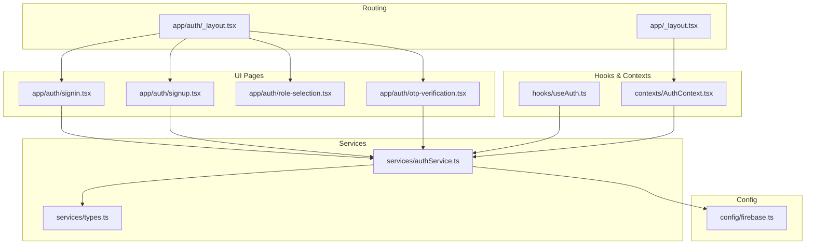
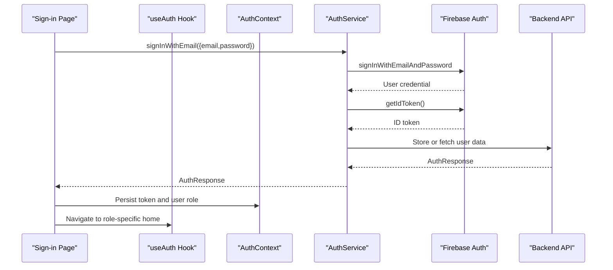
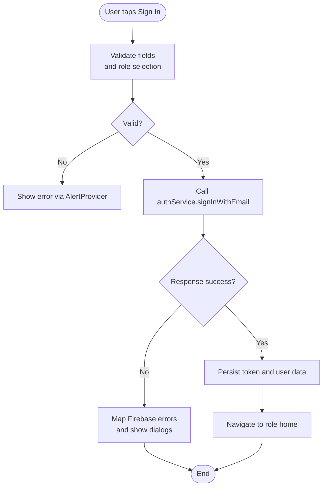
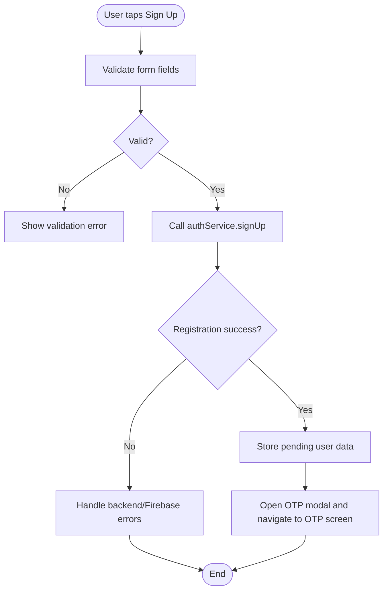
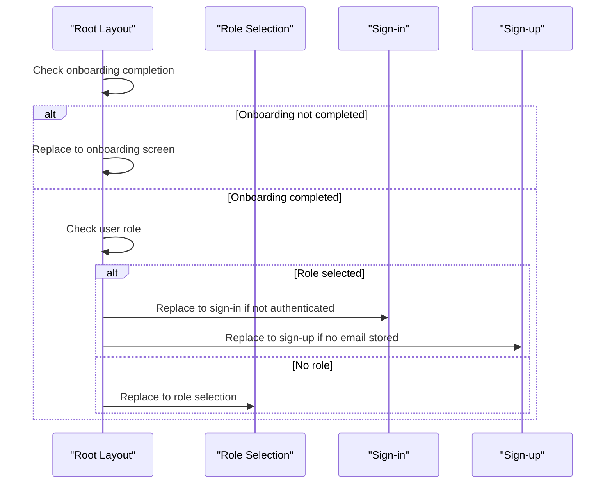
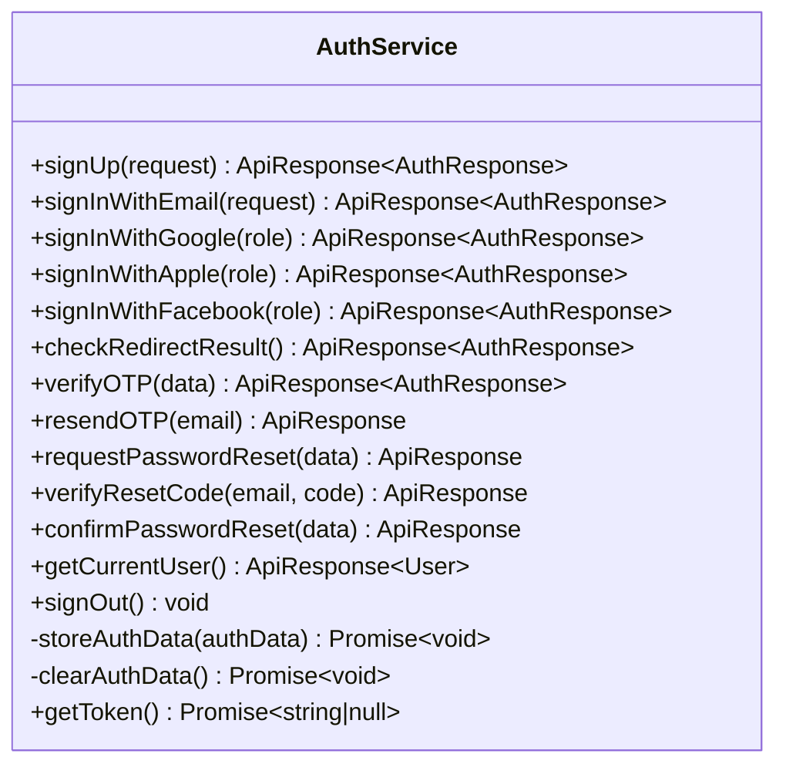
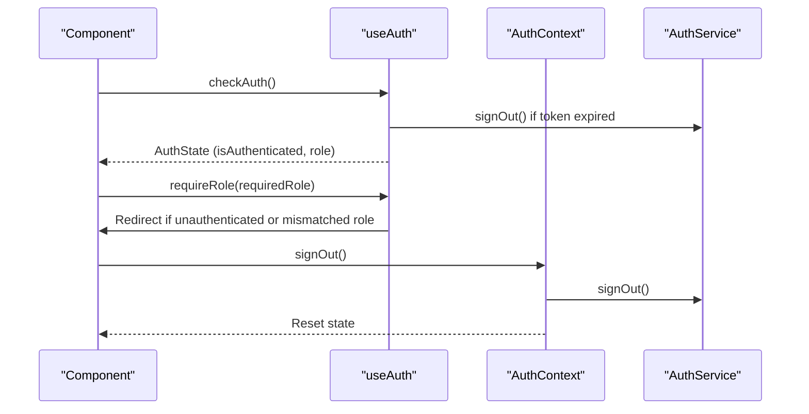
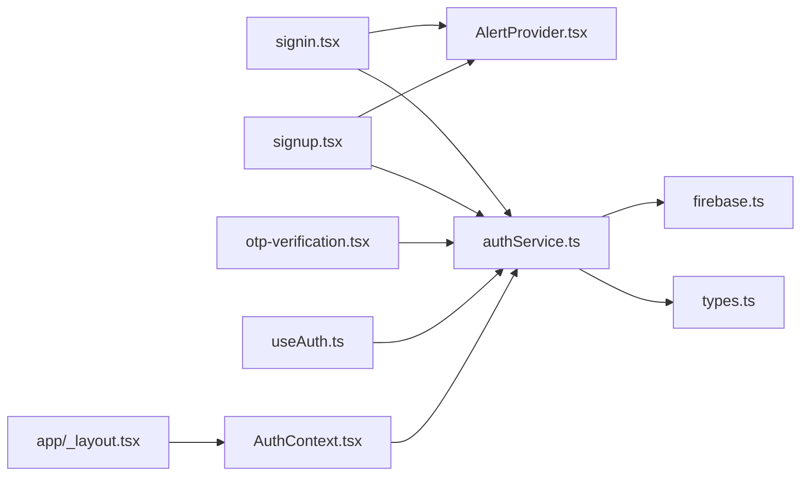

# Authentication Flows

<cite>
**Referenced Files in This Document**
- [signin.tsx](file://app/auth/signin.tsx)
- [signup.tsx](file://app/auth/signup.tsx)
- [authService.ts](file://services/authService.ts)
- [useAuth.ts](file://hooks/useAuth.ts)
- [AuthContext.tsx](file://contexts/AuthContext.tsx)
- [_layout.tsx (Auth)](file://app/auth/_layout.tsx)
- [_layout.tsx (Root)](file://app/_layout.tsx)
- [firebase.ts](file://config/firebase.ts)
- [types.ts](file://services/types.ts)
- [AlertProvider.tsx](file://components/AlertProvider.tsx)
- [role-selection.tsx](file://app/auth/role-selection.tsx)
- [otp-verification.tsx](file://app/auth/otp-verification.tsx)
- [validation.ts](file://utils/validation.ts)
</cite>

## Table of Contents
1. [Introduction](#introduction)
2. [Project Structure](#project-structure)
3. [Core Components](#core-components)
4. [Architecture Overview](#architecture-overview)
5. [Detailed Component Analysis](#detailed-component-analysis)
6. [Dependency Analysis](#dependency-analysis)
7. [Performance Considerations](#performance-considerations)
8. [Troubleshooting Guide](#troubleshooting-guide)
9. [Conclusion](#conclusion)

## Introduction
This document explains the authentication flows in Brillprime-expo with a focus on sign-in and sign-up using Firebase Authentication. It covers UI flows in signin.tsx and signup.tsx, including form validation, loading states, and error handling. It documents how authService.ts abstracts Firebase methods like createUserWithEmailAndPassword and signInWithEmailAndPassword, and how useAuth.ts provides a hook interface for components to access authentication state. It also describes integration with Expo Router via _layout.tsx for route protection and onboarding redirection, and outlines security practices such as secure credential transmission and client-side input sanitization.

## Project Structure
Authentication spans several layers:
- UI pages under app/auth for sign-in, sign-up, role selection, OTP verification, and related flows
- Services layer under services for centralized auth logic and API integration
- Hooks and contexts for state management and route protection
- Router configuration for protected routes and onboarding gating
- Firebase configuration for web-compatible initialization

**Diagram sources**
- [signin.tsx](file://app/auth/signin.tsx#L1-L200)
- [signup.tsx](file://app/auth/signup.tsx#L1-L200)
- [authService.ts](file://services/authService.ts#L1-L120)
- [useAuth.ts](file://hooks/useAuth.ts#L1-L116)
- [AuthContext.tsx](file://contexts/AuthContext.tsx#L1-L149)
- [_layout.tsx (Auth)](file://app/auth/_layout.tsx#L1-L69)
- [_layout.tsx (Root)](file://app/_layout.tsx#L100-L178)
- [firebase.ts](file://config/firebase.ts#L1-L82)
- [types.ts](file://services/types.ts#L1-L120)

**Section sources**
- [signin.tsx](file://app/auth/signin.tsx#L1-L120)
- [signup.tsx](file://app/auth/signup.tsx#L1-L120)
- [authService.ts](file://services/authService.ts#L1-L120)
- [useAuth.ts](file://hooks/useAuth.ts#L1-L116)
- [AuthContext.tsx](file://contexts/AuthContext.tsx#L1-L149)
- [_layout.tsx (Auth)](file://app/auth/_layout.tsx#L1-L69)
- [_layout.tsx (Root)](file://app/_layout.tsx#L100-L178)
- [firebase.ts](file://config/firebase.ts#L1-L82)
- [types.ts](file://services/types.ts#L1-L120)

## Core Components
- UI pages:
  - Sign-in page validates credentials, handles loading, and routes based on role
  - Sign-up page validates form fields, triggers OTP flow, and routes post-verification
- Service abstraction:
  - authService.ts wraps Firebase Authentication APIs and integrates with backend
- State management:
  - useAuth.ts provides a hook to check auth state and enforce role requirements
  - AuthContext.tsx manages persisted user state and exposes sign-out
- Routing and onboarding:
  - app/auth/_layout.tsx defines auth stack screens
  - app/_layout.tsx orchestrates onboarding gating and role-based routing

**Section sources**
- [signin.tsx](file://app/auth/signin.tsx#L90-L180)
- [signup.tsx](file://app/auth/signup.tsx#L73-L120)
- [authService.ts](file://services/authService.ts#L153-L242)
- [useAuth.ts](file://hooks/useAuth.ts#L15-L116)
- [AuthContext.tsx](file://contexts/AuthContext.tsx#L1-L149)
- [_layout.tsx (Auth)](file://app/auth/_layout.tsx#L1-L69)
- [_layout.tsx (Root)](file://app/_layout.tsx#L120-L178)

## Architecture Overview
The authentication architecture follows a layered approach:
- UI pages collect user input and delegate to authService.ts
- authService.ts interacts with Firebase Auth and backend APIs
- useAuth.ts and AuthContext.ts manage persisted state and route protection
- Expo Router stacks define protected routes and onboarding redirection

**Diagram sources**
- [signin.tsx](file://app/auth/signin.tsx#L120-L178)
- [authService.ts](file://services/authService.ts#L153-L242)
- [AuthContext.tsx](file://contexts/AuthContext.tsx#L1-L149)
- [useAuth.ts](file://hooks/useAuth.ts#L15-L116)

## Detailed Component Analysis

### Sign-in Flow (signin.tsx)
- Form handling:
  - Collects email and password, toggles password visibility
  - Validates presence and basic email format before submission
- Loading and error handling:
  - Sets loading state during submission
  - Uses AlertProvider to surface user-friendly errors
- Role gating:
  - Requires role selection before proceeding
- Social login:
  - Supports Google, Apple, and Facebook with popup/redirect fallback
  - Validates role alignment post-login
- Navigation:
  - Routes to role-specific home after successful auth

**Diagram sources**
- [signin.tsx](file://app/auth/signin.tsx#L90-L178)
- [AlertProvider.tsx](file://components/AlertProvider.tsx#L1-L155)

**Section sources**
- [signin.tsx](file://app/auth/signin.tsx#L90-L178)
- [AlertProvider.tsx](file://components/AlertProvider.tsx#L1-L155)

### Sign-up Flow (signup.tsx)
- Form validation:
  - Validates full name, email, phone, password length, and password confirmation
- OTP flow:
  - Submits registration request and stores pending user data
  - Opens OTP verification modal and navigates to OTP screen
- Social login:
  - Supports Google, Apple, and Facebook with role-aware flow
- Navigation:
  - Routes to role-specific dashboards after verification

**Diagram sources**
- [signup.tsx](file://app/auth/signup.tsx#L73-L190)
- [otp-verification.tsx](file://app/auth/otp-verification.tsx#L56-L109)

**Section sources**
- [signup.tsx](file://app/auth/signup.tsx#L73-L190)
- [otp-verification.tsx](file://app/auth/otp-verification.tsx#L56-L109)

### Role Selection and Onboarding Redirection
- Role selection page:
  - Persists selected role and proceeds to auth based on stored email
- Onboarding redirection:
  - Root layout checks onboarding completion and role selection
  - Redirects to onboarding, role selection, sign-in, or home accordingly

**Diagram sources**
- [_layout.tsx (Root)](file://app/_layout.tsx#L120-L178)
- [role-selection.tsx](file://app/auth/role-selection.tsx#L59-L82)

**Section sources**
- [role-selection.tsx](file://app/auth/role-selection.tsx#L59-L82)
- [_layout.tsx (Root)](file://app/_layout.tsx#L120-L178)

### AuthService Abstraction (authService.ts)
- Wraps Firebase Authentication:
  - createUserWithEmailAndPassword for sign-up
  - signInWithEmailAndPassword for sign-in
  - signInWithPopup/signInWithRedirect for social providers
  - getRedirectResult for post-redirect auth
- Token and user persistence:
  - Stores token, user role, and email in AsyncStorage
  - Refreshes token near expiry and updates expiry timestamp
- Backend integration:
  - Syncs user data with backend and merges duplicates
  - Provides OTP verification and resend endpoints
- Error mapping:
  - Converts Firebase error codes to user-friendly messages

**Diagram sources**
- [authService.ts](file://services/authService.ts#L1-L242)
- [authService.ts](file://services/authService.ts#L367-L406)
- [authService.ts](file://services/authService.ts#L607-L721)
- [authService.ts](file://services/authService.ts#L723-L800)

**Section sources**
- [authService.ts](file://services/authService.ts#L63-L151)
- [authService.ts](file://services/authService.ts#L153-L242)
- [authService.ts](file://services/authService.ts#L244-L406)
- [authService.ts](file://services/authService.ts#L607-L721)
- [authService.ts](file://services/authService.ts#L723-L800)

### Hook and Context Interfaces (useAuth.ts, AuthContext.tsx)
- useAuth.ts:
  - Loads cached and persisted auth state
  - Checks token expiry and signs out if expired
  - Exposes requireRole to enforce role-based navigation
- AuthContext.tsx:
  - Manages user, token, and role state
  - Provides signOut and refreshUser helpers
  - Loads user data from AsyncStorage and service

**Diagram sources**
- [useAuth.ts](file://hooks/useAuth.ts#L15-L116)
- [AuthContext.tsx](file://contexts/AuthContext.tsx#L1-L149)

**Section sources**
- [useAuth.ts](file://hooks/useAuth.ts#L15-L116)
- [AuthContext.tsx](file://contexts/AuthContext.tsx#L1-L149)

### Firebase Configuration (firebase.ts)
- Initializes Firebase only when environment variables are present
- Exports initialized auth instance for use across services
- Logs warnings for incomplete configuration

**Section sources**
- [firebase.ts](file://config/firebase.ts#L1-L82)

### Types and Contracts (types.ts)
- Defines AuthResponse, User, SignUpRequest, SignInRequest, and ApiResponse
- Ensures consistent shape for auth responses and requests across services

**Section sources**
- [types.ts](file://services/types.ts#L1-L120)
- [types.ts](file://services/types.ts#L160-L228)

## Dependency Analysis
- UI depends on:
  - AlertProvider for user feedback
  - AsyncStorage for offline-friendly state
  - Router for navigation
- Service depends on:
  - Firebase Auth for authentication primitives
  - Backend API for user synchronization and OTP
- Hook and context depend on:
  - AsyncStorage for persistence
  - Router for navigation decisions

**Diagram sources**
- [signin.tsx](file://app/auth/signin.tsx#L1-L120)
- [signup.tsx](file://app/auth/signup.tsx#L1-L120)
- [otp-verification.tsx](file://app/auth/otp-verification.tsx#L1-L120)
- [authService.ts](file://services/authService.ts#L1-L120)
- [useAuth.ts](file://hooks/useAuth.ts#L1-L116)
- [AuthContext.tsx](file://contexts/AuthContext.tsx#L1-L149)
- [_layout.tsx (Root)](file://app/_layout.tsx#L100-L178)
- [firebase.ts](file://config/firebase.ts#L1-L82)
- [types.ts](file://services/types.ts#L1-L120)

**Section sources**
- [signin.tsx](file://app/auth/signin.tsx#L1-L120)
- [signup.tsx](file://app/auth/signup.tsx#L1-L120)
- [otp-verification.tsx](file://app/auth/otp-verification.tsx#L1-L120)
- [authService.ts](file://services/authService.ts#L1-L120)
- [useAuth.ts](file://hooks/useAuth.ts#L1-L116)
- [AuthContext.tsx](file://contexts/AuthContext.tsx#L1-L149)
- [_layout.tsx (Root)](file://app/_layout.tsx#L100-L178)
- [firebase.ts](file://config/firebase.ts#L1-L82)
- [types.ts](file://services/types.ts#L1-L120)

## Performance Considerations
- Token refresh:
  - authService.ts refreshes tokens near expiry and updates AsyncStorage timestamps
- Async loading:
  - useAuth.ts and AuthContext.ts pre-load critical data to minimize render-time auth checks
- Network resilience:
  - Error mapping converts Firebase error codes to actionable messages
- UI responsiveness:
  - Loading flags prevent double submissions and improve perceived performance

[No sources needed since this section provides general guidance]

## Troubleshooting Guide
Common issues and resolutions:
- Authentication errors:
  - Map Firebase error codes to user-friendly messages and prompt retry or sign-up
- Network connectivity:
  - Show network error alerts and suggest checking connectivity
- Role mismatches:
  - Prompt role selection or correction when social login returns a different role
- OTP verification failures:
  - Allow resending OTP and guide users to check email

**Section sources**
- [signin.tsx](file://app/auth/signin.tsx#L154-L178)
- [signup.tsx](file://app/auth/signup.tsx#L156-L175)
- [otp-verification.tsx](file://app/auth/otp-verification.tsx#L111-L136)
- [authService.ts](file://services/authService.ts#L131-L151)
- [authService.ts](file://services/authService.ts#L215-L242)

## Security Practices
- Secure credential transmission:
  - Firebase Authentication is used for secure sign-in and sign-up
  - Tokens are stored in AsyncStorage and refreshed near expiry
- Client-side input sanitization:
  - Basic validation performed in UI forms (presence, email format, password length)
  - Additional validation utilities available in utils/validation.ts for broader use
- Role enforcement:
  - useAuth.ts and AuthContext.ts enforce role-based navigation and sign-out

**Section sources**
- [signin.tsx](file://app/auth/signin.tsx#L99-L123)
- [signup.tsx](file://app/auth/signup.tsx#L73-L100)
- [validation.ts](file://utils/validation.ts#L1-L120)
- [authService.ts](file://services/authService.ts#L723-L800)
- [useAuth.ts](file://hooks/useAuth.ts#L89-L116)
- [AuthContext.tsx](file://contexts/AuthContext.tsx#L107-L141)

## Conclusion
Brillprime-expo’s authentication system cleanly separates UI concerns from service logic, leveraging Firebase Authentication and a robust service layer. The sign-in and sign-up flows provide clear validation, loading states, and error handling, while useAuth.ts and AuthContext.ts ensure consistent state management and route protection. Integration with Expo Router and onboarding redirection creates a smooth user journey, and security practices around token handling and input validation help maintain a secure client experience.