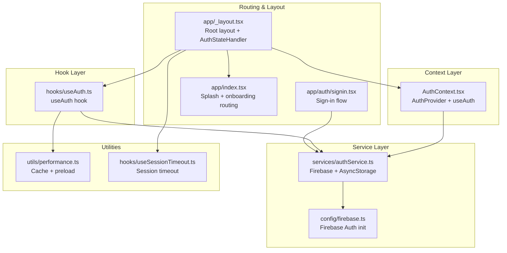
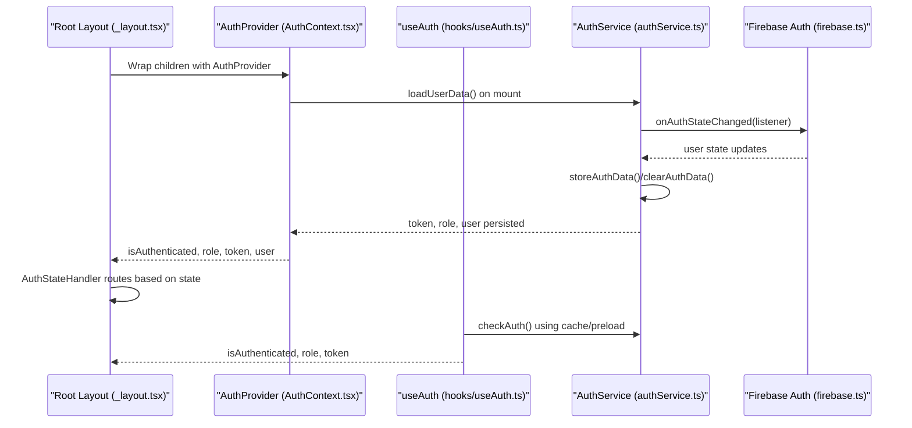
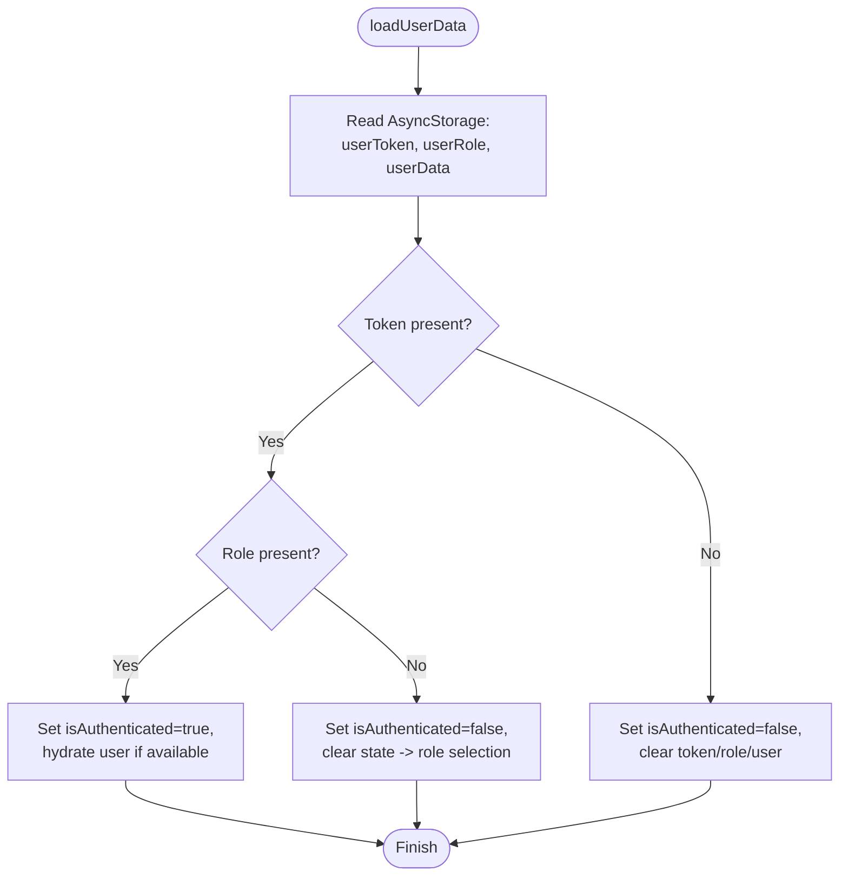
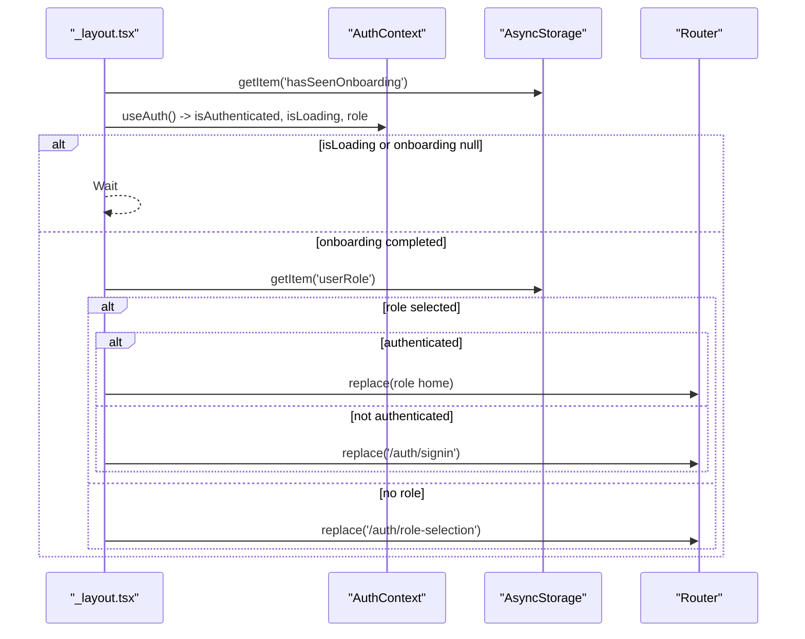
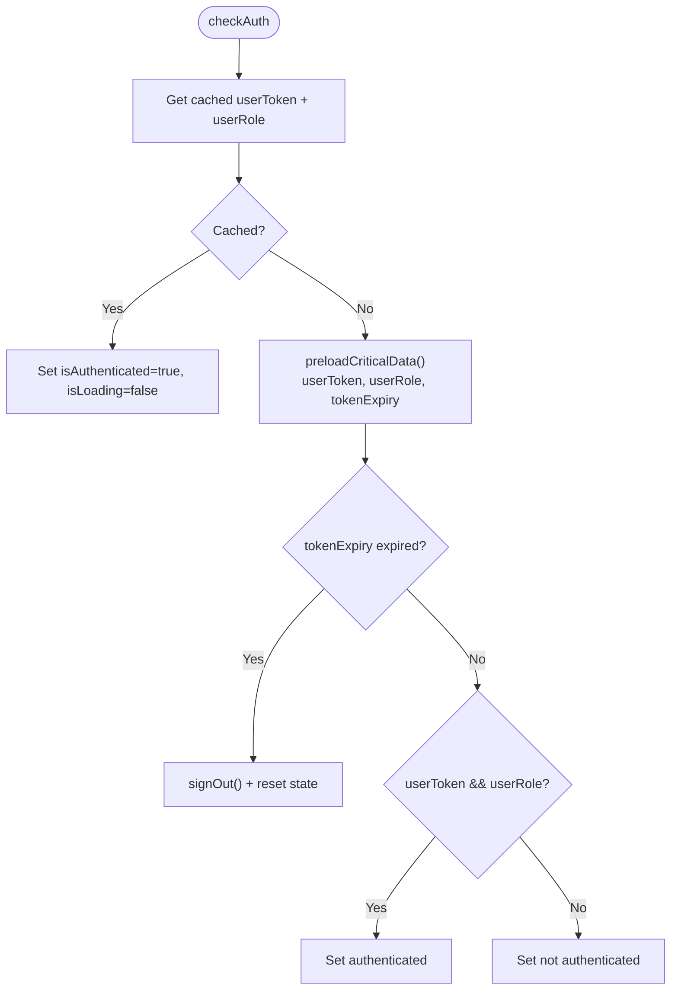
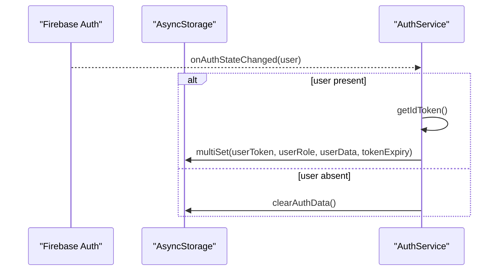
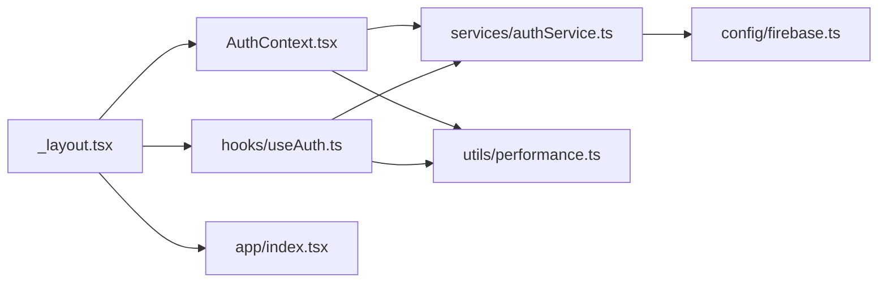

# Authentication State Management

<cite>
**Referenced Files in This Document**
- [AuthContext.tsx](file://contexts/AuthContext.tsx)
- [_layout.tsx](file://app/_layout.tsx)
- [useAuth.ts](file://hooks/useAuth.ts)
- [authService.ts](file://services/authService.ts)
- [firebase.ts](file://config/firebase.ts)
- [signin.tsx](file://app/auth/signin.tsx)
- [performance.ts](file://utils/performance.ts)
- [useSessionTimeout.ts](file://hooks/useSessionTimeout.ts)
- [types.ts](file://services/types.ts)
- [index.tsx](file://app/index.tsx)
</cite>

## Table of Contents
1. [Introduction](#introduction)
2. [Project Structure](#project-structure)
3. [Core Components](#core-components)
4. [Architecture Overview](#architecture-overview)
5. [Detailed Component Analysis](#detailed-component-analysis)
6. [Dependency Analysis](#dependency-analysis)
7. [Performance Considerations](#performance-considerations)
8. [Troubleshooting Guide](#troubleshooting-guide)
9. [Conclusion](#conclusion)

## Introduction
This document explains the authentication state management system built with React Context in a React Native/Expo application. It covers how AuthContext initializes and maintains user state (including authenticated status, user data, loading states, and role), how the context provider is wrapped globally via the root layout, and how the useAuth hook exposes a type-safe interface for components. It also documents conditional rendering based on authentication state, Firebase auth state change listeners, and edge cases such as token persistence across app restarts, session invalidation, and synchronization across multiple components.

## Project Structure
The authentication system spans several layers:
- Context layer: AuthContext manages global authentication state and exposes a provider and hook.
- Hook layer: A custom useAuth hook provides a simplified interface for consumers.
- Service layer: authService coordinates Firebase Auth, token lifecycle, and AsyncStorage persistence.
- Routing and layout: The root layout wraps the app with providers and orchestrates navigation based on authentication and role.
- Utilities: performance.ts optimizes reads from AsyncStorage and caches critical data.

**Diagram sources**
- [AuthContext.tsx](file://contexts/AuthContext.tsx#L1-L149)
- [useAuth.ts](file://hooks/useAuth.ts#L1-L116)
- [authService.ts](file://services/authService.ts#L1-L200)
- [firebase.ts](file://config/firebase.ts#L1-L82)
- [_layout.tsx](file://app/_layout.tsx#L1-L203)
- [signin.tsx](file://app/auth/signin.tsx#L1-L200)
- [performance.ts](file://utils/performance.ts#L1-L140)
- [useSessionTimeout.ts](file://hooks/useSessionTimeout.ts#L1-L103)
- [index.tsx](file://app/index.tsx#L77-L196)

**Section sources**
- [AuthContext.tsx](file://contexts/AuthContext.tsx#L1-L149)
- [_layout.tsx](file://app/_layout.tsx#L1-L203)
- [useAuth.ts](file://hooks/useAuth.ts#L1-L116)
- [authService.ts](file://services/authService.ts#L1-L200)
- [firebase.ts](file://config/firebase.ts#L1-L82)
- [signin.tsx](file://app/auth/signin.tsx#L1-L200)
- [performance.ts](file://utils/performance.ts#L1-L140)
- [useSessionTimeout.ts](file://hooks/useSessionTimeout.ts#L1-L103)
- [index.tsx](file://app/index.tsx#L77-L196)

## Core Components
- AuthContext (AuthProvider + useAuth):
  - Initializes state for user, isAuthenticated, isLoading, token, and role.
  - Loads persisted data from AsyncStorage and synchronizes with Firebase Auth state.
  - Provides signOut and refreshUser helpers.
- useAuth hook:
  - Offers a simplified interface with isAuthenticated, isLoading, token, role, and helper methods.
  - Integrates with performance utilities for fast checks and redirects based on role.
- authService:
  - Manages Firebase Auth state listener, token lifecycle, and AsyncStorage persistence.
  - Implements sign-in/sign-out flows and stores tokens/roles/expiry timestamps.
- Root layout (_layout.tsx):
  - Wraps the app with AuthProvider and orchestrates navigation based on onboarding, role selection, and authentication state.
- Firebase configuration:
  - Initializes Firebase only when environment variables are present and handles initialization safely.

**Section sources**
- [AuthContext.tsx](file://contexts/AuthContext.tsx#L1-L149)
- [useAuth.ts](file://hooks/useAuth.ts#L1-L116)
- [authService.ts](file://services/authService.ts#L1-L200)
- [_layout.tsx](file://app/_layout.tsx#L1-L203)
- [firebase.ts](file://config/firebase.ts#L1-L82)

## Architecture Overview
The authentication architecture combines React Context for state sharing, Firebase Auth for identity, and AsyncStorage for persistence. The root layout coordinates navigation and ensures global access to authentication state. Components consume the context via useAuth or the context directly.

**Diagram sources**
- [_layout.tsx](file://app/_layout.tsx#L80-L178)
- [AuthContext.tsx](file://contexts/AuthContext.tsx#L30-L140)
- [useAuth.ts](file://hooks/useAuth.ts#L15-L115)
- [authService.ts](file://services/authService.ts#L1-L120)
- [firebase.ts](file://config/firebase.ts#L1-L82)

## Detailed Component Analysis

### AuthContext.tsx: Initialization and State Maintenance
- State fields:
  - user: User | null
  - isAuthenticated: boolean
  - isLoading: boolean
  - token: string | null
  - role: string | null
- Initialization flow:
  - loadUserData performs concurrent reads from AsyncStorage for token, role, and user data.
  - If token exists but role is missing, sets isAuthenticated to false and clears state to trigger role selection.
  - If token and role exist, marks authenticated and optionally hydrates user data.
- Helpers:
  - refreshUser fetches latest profile from backend and updates AsyncStorage.
  - signOut delegates to authService and resets state.
- Context export:
  - useAuth throws if used outside AuthProvider.

**Diagram sources**
- [AuthContext.tsx](file://contexts/AuthContext.tsx#L37-L79)

**Section sources**
- [AuthContext.tsx](file://contexts/AuthContext.tsx#L1-L149)

### Root Layout (_layout.tsx): Global Provider and Navigation Orchestration
- Wraps the app with AuthProvider and other providers.
- AuthStateHandler:
  - Checks onboarding completion and role selection via AsyncStorage.
  - Routes to onboarding, role selection, or home screens based on state.
  - Uses isLoading from AuthContext to defer navigation until hydration completes.
- Stack configuration:
  - Configures screens for the app and auth stacks.

**Diagram sources**
- [_layout.tsx](file://app/_layout.tsx#L120-L178)

**Section sources**
- [_layout.tsx](file://app/_layout.tsx#L1-L203)

### useAuth.ts: Consumer Hook Interface
- Provides:
  - isAuthenticated, isLoading, token, role, user
  - checkAuth: Fast check using cache and AsyncStorage preloading.
  - requireRole: Redirects to sign-in or role selection based on state.
  - signOut: Delegates to authService.signOut.
- Caching and preloading:
  - Uses PerformanceOptimizer.getCache for immediate cache hits.
  - Falls back to PerformanceOptimizer.preloadCriticalData to read AsyncStorage in parallel.

**Diagram sources**
- [useAuth.ts](file://hooks/useAuth.ts#L15-L115)
- [performance.ts](file://utils/performance.ts#L98-L139)

**Section sources**
- [useAuth.ts](file://hooks/useAuth.ts#L1-L116)
- [performance.ts](file://utils/performance.ts#L1-L140)

### authService.ts: Firebase Auth State Change Listener and Persistence
- Firebase listener:
  - onAuthStateChanged updates internal currentUser and authToken.
- Token lifecycle:
  - Stores token, role, user data, and tokenExpiry in AsyncStorage.
  - Refreshes token when nearing expiry and updates AsyncStorage.
- Sign-out:
  - Clears AsyncStorage and optionally invalidates server-side tokens.
- Redirect handling:
  - checkRedirectResult integrates with Firebase redirect flow and persists results.

**Diagram sources**
- [authService.ts](file://services/authService.ts#L1-L120)
- [authService.ts](file://services/authService.ts#L724-L775)

**Section sources**
- [authService.ts](file://services/authService.ts#L1-L200)
- [authService.ts](file://services/authService.ts#L724-L775)
- [authService.ts](file://services/authService.ts#L777-L805)

### Conditional Rendering Based on Authentication State
- Root-level routing:
  - AuthStateHandler decides whether to show onboarding, role selection, sign-in, or home pages.
- Component-level patterns:
  - Consumers can use useAuth to gate content and redirect when unauthenticated or mismatched role.
  - Example patterns:
    - If isAuthenticated is false and not loading, redirect to sign-in.
    - If role does not match required role, redirect to role selection.
- Token expiration handling:
  - If tokenExpiry is in the past, signOut is invoked and state is reset.

**Section sources**
- [_layout.tsx](file://app/_layout.tsx#L120-L178)
- [useAuth.ts](file://hooks/useAuth.ts#L89-L103)
- [useAuth.ts](file://hooks/useAuth.ts#L25-L87)

### Token Persistence Across App Restarts and Session Invalidation
- Persistence:
  - Tokens, roles, user data, and tokenExpiry are stored in AsyncStorage.
  - AuthContext hydrates state on mount by reading AsyncStorage concurrently.
- Session invalidation:
  - On sign-out, AsyncStorage is cleared and internal state reset.
  - Token expiry is checked; if expired, signOut is triggered and state reset.
- Synchronization:
  - Firebase onAuthStateChanged keeps internal authToken synchronized.
  - AuthContext refreshUser updates user data and AsyncStorage.

**Section sources**
- [AuthContext.tsx](file://contexts/AuthContext.tsx#L37-L79)
- [authService.ts](file://services/authService.ts#L724-L775)
- [authService.ts](file://services/authService.ts#L777-L805)
- [useAuth.ts](file://hooks/useAuth.ts#L25-L87)

### Handling Firebase Auth State Changes
- AuthService constructor registers onAuthStateChanged.
- Updates internal currentUser and authToken.
- Persists token and user data to AsyncStorage upon sign-in/sign-up.
- Clears AsyncStorage and resets state on sign-out.

**Section sources**
- [authService.ts](file://services/authService.ts#L1-L120)
- [authService.ts](file://services/authService.ts#L689-L721)

### Edge Cases and Multi-Component Synchronization
- Token refresh:
  - AuthService refreshes token when nearing expiry and updates AsyncStorage.
- Session timeout:
  - useSessionTimeout monitors activity and triggers sign-out after inactivity.
- Role mismatches:
  - Sign-in flows validate that selected role matches returned role and redirect to role selection if mismatched.
- Splash and onboarding:
  - app/index.tsx orchestrates onboarding and role selection before routing to auth or home.

**Section sources**
- [authService.ts](file://services/authService.ts#L777-L805)
- [useSessionTimeout.ts](file://hooks/useSessionTimeout.ts#L1-L103)
- [signin.tsx](file://app/auth/signin.tsx#L180-L262)
- [index.tsx](file://app/index.tsx#L77-L196)

## Dependency Analysis
- AuthContext depends on:
  - authService for signOut and user refresh.
  - AsyncStorage for hydration and persistence.
- useAuth depends on:
  - PerformanceOptimizer for cache and preloading.
  - authService for signOut and token validation.
- Root layout depends on:
  - AuthContext for state.
  - AsyncStorage for onboarding and role state.
  - Router for navigation.
- Firebase integration:
  - firebase.ts initializes Firebase only when configured.
  - authService listens to onAuthStateChanged and persists state.

**Diagram sources**
- [AuthContext.tsx](file://contexts/AuthContext.tsx#L1-L149)
- [useAuth.ts](file://hooks/useAuth.ts#L1-L116)
- [_layout.tsx](file://app/_layout.tsx#L1-L203)
- [authService.ts](file://services/authService.ts#L1-L200)
- [firebase.ts](file://config/firebase.ts#L1-L82)
- [performance.ts](file://utils/performance.ts#L1-L140)
- [index.tsx](file://app/index.tsx#L77-L196)

**Section sources**
- [AuthContext.tsx](file://contexts/AuthContext.tsx#L1-L149)
- [useAuth.ts](file://hooks/useAuth.ts#L1-L116)
- [_layout.tsx](file://app/_layout.tsx#L1-L203)
- [authService.ts](file://services/authService.ts#L1-L200)
- [firebase.ts](file://config/firebase.ts#L1-L82)
- [performance.ts](file://utils/performance.ts#L1-L140)
- [index.tsx](file://app/index.tsx#L77-L196)

## Performance Considerations
- Parallel hydration:
  - AuthContext reads token, role, and user data concurrently from AsyncStorage.
- Caching and preloading:
  - useAuth uses cache-first strategy and preloads critical data via PerformanceOptimizer.
- Token refresh strategy:
  - AuthService refreshes tokens with a buffer and updates AsyncStorage to minimize network calls.
- Session timeout:
  - useSessionTimeout reduces unnecessary prompts by leveraging biometrics and warnings before logout.

[No sources needed since this section provides general guidance]

## Troubleshooting Guide
- Firebase not initialized:
  - Check environment variables and ensure Firebase configuration is complete.
- Auth state not updating:
  - Verify onAuthStateChanged listener registration and AsyncStorage writes.
- Redirect loops:
  - Ensure AsyncStorage keys for onboarding and role are set correctly before navigation.
- Token expiration:
  - Confirm tokenExpiry is stored and checked; signOut is invoked when expired.
- Role mismatch:
  - Validate that selected role matches returned role during sign-in flows.

**Section sources**
- [firebase.ts](file://config/firebase.ts#L1-L82)
- [authService.ts](file://services/authService.ts#L1-L120)
- [authService.ts](file://services/authService.ts#L724-L775)
- [signin.tsx](file://app/auth/signin.tsx#L180-L262)
- [useAuth.ts](file://hooks/useAuth.ts#L25-L87)

## Conclusion
The authentication system leverages React Context for centralized state, Firebase Auth for identity, and AsyncStorage for persistence. The root layout ensures global access to authentication state and orchestrates navigation based on onboarding, role selection, and authentication status. The useAuth hook provides a type-safe, cache-aware interface for components, while authService manages token lifecycle and Firebase integration. Edge cases such as token persistence, session invalidation, and synchronization across components are addressed through careful hydration, caching, and listener patterns.