# Authentication System

<cite>
**Referenced Files in This Document**
- [AuthContext.tsx](file://contexts/AuthContext.tsx)
- [useAuth.ts](file://hooks/useAuth.ts)
- [useSessionTimeout.ts](file://hooks/useSessionTimeout.ts)
- [authService.ts](file://services/authService.ts)
- [firebase.ts](file://config/firebase.ts)
- [roleManagementService.ts](file://services/roleManagementService.ts)
- [biometricService.ts](file://services/biometricService.ts)
- [withRoleAccess.tsx](file://components/withRoleAccess.tsx)
- [app/_layout.tsx](file://app/_layout.tsx)
- [app/auth/_layout.tsx](file://app/auth/_layout.tsx)
- [app/auth/signin.tsx](file://app/auth/signin.tsx)
- [app/auth/signup.tsx](file://app/auth/signup.tsx)
- [app/auth/otp-verification.tsx](file://app/auth/otp-verification.tsx)
- [app/auth/forgot-password.tsx](file://app/auth/forgot-password.tsx)
- [app/auth/role-selection.tsx](file://app/auth/role-selection.tsx)
- [performance.ts](file://utils/performance.ts)
</cite>

## Table of Contents
1. [Introduction](#introduction)
2. [Project Structure](#project-structure)
3. [Core Components](#core-components)
4. [Architecture Overview](#architecture-overview)
5. [Detailed Component Analysis](#detailed-component-analysis)
6. [Dependency Analysis](#dependency-analysis)
7. [Performance Considerations](#performance-considerations)
8. [Troubleshooting Guide](#troubleshooting-guide)
9. [Conclusion](#conclusion)

## Introduction
This document explains the authentication system in Brillprime-expo, focusing on Firebase Authentication integration, user onboarding and role selection, OTP verification, password reset, token lifecycle management, session timeout handling, and role-based access control. It also covers how authentication state is managed globally via a React Context and integrated with Expo Router for protected routes and navigation.

## Project Structure
The authentication system spans several layers:
- Configuration: Firebase initialization and environment variables
- Services: Authentication, role management, biometric, and performance utilities
- Hooks: Application-wide authentication checks and session timeout handling
- Context: Global authentication state management
- Pages: Onboarding, sign-up, sign-in, OTP verification, and password reset flows
- Guards: Role-based access control wrappers

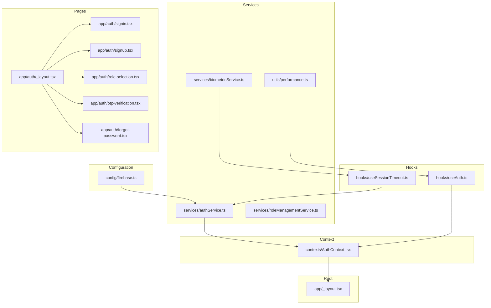

**Diagram sources**
- [firebase.ts](file://config/firebase.ts#L1-L82)
- [authService.ts](file://services/authService.ts#L1-L120)
- [roleManagementService.ts](file://services/roleManagementService.ts#L1-L120)
- [biometricService.ts](file://services/biometricService.ts#L1-L120)
- [performance.ts](file://utils/performance.ts#L98-L140)
- [useAuth.ts](file://hooks/useAuth.ts#L1-L116)
- [useSessionTimeout.ts](file://hooks/useSessionTimeout.ts#L1-L103)
- [AuthContext.tsx](file://contexts/AuthContext.tsx#L1-L149)
- [app/_layout.tsx](file://app/_layout.tsx#L120-L178)
- [app/auth/_layout.tsx](file://app/auth/_layout.tsx#L1-L68)
- [app/auth/signin.tsx](file://app/auth/signin.tsx#L1-L120)
- [app/auth/signup.tsx](file://app/auth/signup.tsx#L1-L120)
- [app/auth/otp-verification.tsx](file://app/auth/otp-verification.tsx#L1-L120)
- [app/auth/forgot-password.tsx](file://app/auth/forgot-password.tsx#L1-L120)
- [app/auth/role-selection.tsx](file://app/auth/role-selection.tsx#L1-L120)

**Section sources**
- [app/_layout.tsx](file://app/_layout.tsx#L120-L178)
- [app/auth/_layout.tsx](file://app/auth/_layout.tsx#L1-L68)

## Core Components
- Firebase configuration and initialization for web compatibility
- Authentication service orchestrating Firebase operations and local token storage
- Role management service coordinating role status and access checks
- Biometric service for hardware-backed authentication
- Session timeout hook managing idle sessions and prompting re-authentication
- Auth context providing global authentication state and helpers
- Hook for app-level authentication checks and role-aware routing
- Protected route guards for role-based access control

**Section sources**
- [firebase.ts](file://config/firebase.ts#L1-L82)
- [authService.ts](file://services/authService.ts#L1-L120)
- [roleManagementService.ts](file://services/roleManagementService.ts#L1-L120)
- [biometricService.ts](file://services/biometricService.ts#L1-L120)
- [useSessionTimeout.ts](file://hooks/useSessionTimeout.ts#L1-L103)
- [AuthContext.tsx](file://contexts/AuthContext.tsx#L1-L149)
- [useAuth.ts](file://hooks/useAuth.ts#L1-L116)
- [withRoleAccess.tsx](file://components/withRoleAccess.tsx#L1-L120)

## Architecture Overview
The authentication architecture combines Firebase Authentication for identity and local token storage for session persistence. The AuthContext exposes user, authentication state, and token/role to the app. Expo Router is used to enforce protected routes and role-aware navigation. Role-based access control is enforced via a higher-order component wrapper.

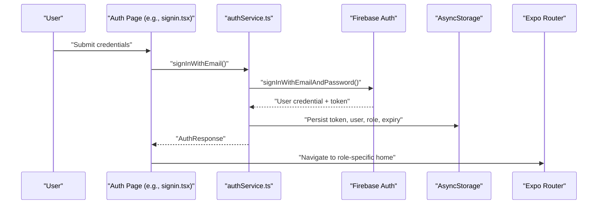

**Diagram sources**
- [app/auth/signin.tsx](file://app/auth/signin.tsx#L120-L170)
- [authService.ts](file://services/authService.ts#L154-L215)
- [authService.ts](file://services/authService.ts#L724-L775)
- [app/_layout.tsx](file://app/_layout.tsx#L140-L168)

## Detailed Component Analysis

### Firebase Authentication Integration
- Firebase configuration is loaded from environment variables and initialized only when complete.
- Authentication service listens to Firebase auth state changes and maintains a current token.
- Operations include email/password sign-in/sign-up, social providers (Google, Apple, Facebook), OTP verification, and password reset.

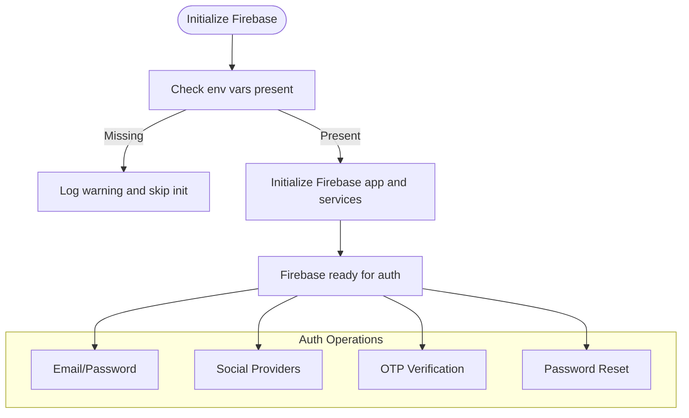

**Diagram sources**
- [firebase.ts](file://config/firebase.ts#L1-L82)
- [authService.ts](file://services/authService.ts#L154-L215)
- [authService.ts](file://services/authService.ts#L244-L365)
- [authService.ts](file://services/authService.ts#L608-L646)

**Section sources**
- [firebase.ts](file://config/firebase.ts#L1-L82)
- [authService.ts](file://services/authService.ts#L154-L215)
- [authService.ts](file://services/authService.ts#L244-L365)
- [authService.ts](file://services/authService.ts#L608-L646)

### Authentication State Management (AuthContext)
- Provides user, authentication status, loading state, token, and role.
- Loads persisted data on startup and refreshes user profile.
- Exposes sign-out and user refresh helpers.
- Ensures role presence is enforced; if token exists without role, forces role selection.

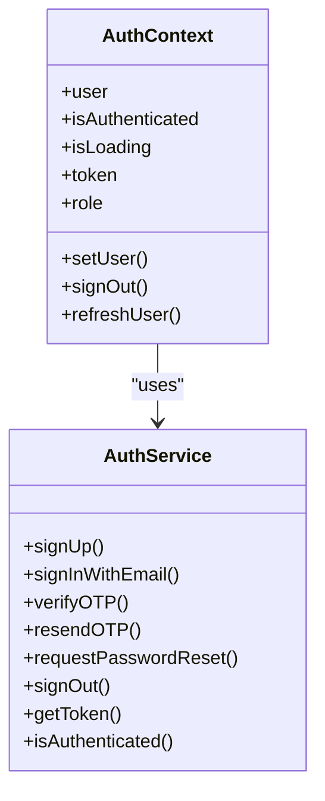

**Diagram sources**
- [AuthContext.tsx](file://contexts/AuthContext.tsx#L1-L149)
- [authService.ts](file://services/authService.ts#L690-L721)

**Section sources**
- [AuthContext.tsx](file://contexts/AuthContext.tsx#L1-L149)

### Role Selection and Onboarding
- Role selection page persists the chosen role and routes to sign-in or sign-up depending on existing email.
- App-level AuthStateHandler enforces onboarding completion and role selection before allowing navigation into the app.

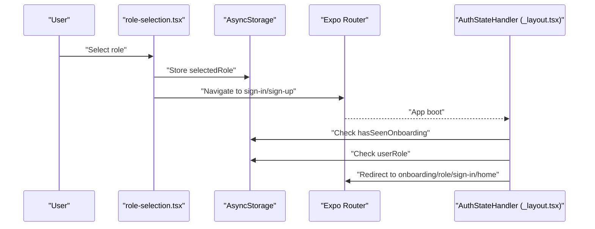

**Diagram sources**
- [app/auth/role-selection.tsx](file://app/auth/role-selection.tsx#L1-L120)
- [app/_layout.tsx](file://app/_layout.tsx#L140-L168)

**Section sources**
- [app/auth/role-selection.tsx](file://app/auth/role-selection.tsx#L1-L120)
- [app/_layout.tsx](file://app/_layout.tsx#L140-L168)

### OTP Verification Flow
- Registration triggers OTP sending; OTP verification validates the code and finalizes authentication.
- Pending user data is stored temporarily until verification completes.

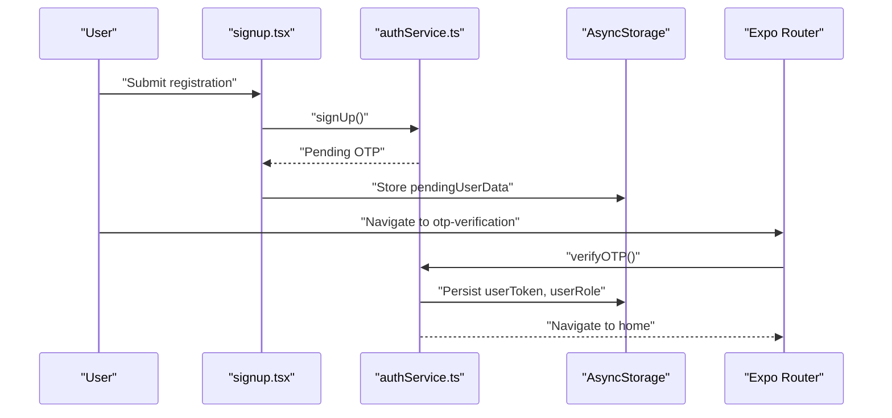

**Diagram sources**
- [app/auth/signup.tsx](file://app/auth/signup.tsx#L120-L190)
- [app/auth/otp-verification.tsx](file://app/auth/otp-verification.tsx#L60-L110)
- [authService.ts](file://services/authService.ts#L608-L617)

**Section sources**
- [app/auth/signup.tsx](file://app/auth/signup.tsx#L120-L190)
- [app/auth/otp-verification.tsx](file://app/auth/otp-verification.tsx#L60-L110)
- [authService.ts](file://services/authService.ts#L608-L617)

### Password Reset Flow
- Uses Firebase’s built-in password reset to send reset instructions to the user’s email.

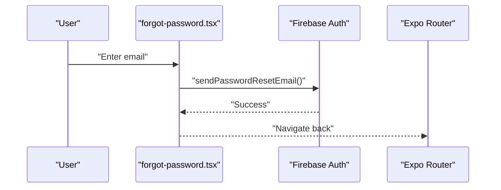

**Diagram sources**
- [app/auth/forgot-password.tsx](file://app/auth/forgot-password.tsx#L60-L95)
- [authService.ts](file://services/authService.ts#L625-L646)

**Section sources**
- [app/auth/forgot-password.tsx](file://app/auth/forgot-password.tsx#L60-L95)
- [authService.ts](file://services/authService.ts#L625-L646)

### Protected Routes and Role-Based Access Control
- App-level handler redirects to onboarding, role selection, sign-in, or home based on state.
- Role-based access guard checks registration and verification status before rendering protected screens.

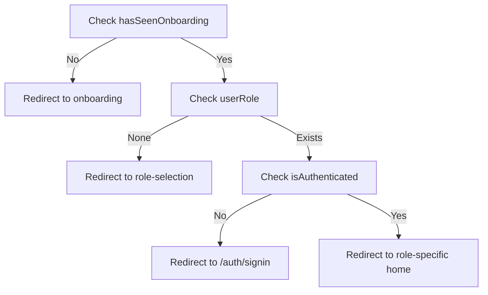

**Diagram sources**
- [app/_layout.tsx](file://app/_layout.tsx#L140-L168)
- [withRoleAccess.tsx](file://components/withRoleAccess.tsx#L1-L120)

**Section sources**
- [app/_layout.tsx](file://app/_layout.tsx#L140-L168)
- [withRoleAccess.tsx](file://components/withRoleAccess.tsx#L1-L120)

### Token Management Strategies
- Tokens are stored in AsyncStorage with an expiry timestamp.
- Token refresh logic checks expiry and refreshes via Firebase or backend validation.
- Token format validation ensures integrity; invalid tokens are cleared.

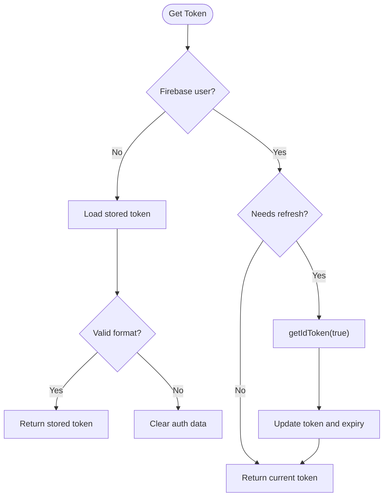

**Diagram sources**
- [authService.ts](file://services/authService.ts#L777-L815)
- [authService.ts](file://services/authService.ts#L842-L888)
- [authService.ts](file://services/authService.ts#L890-L941)

**Section sources**
- [authService.ts](file://services/authService.ts#L777-L815)
- [authService.ts](file://services/authService.ts#L842-L888)
- [authService.ts](file://services/authService.ts#L890-L941)

### Session Timeout and Biometric Authentication
- Session timeout hook tracks user activity and warns before expiration.
- Supports biometric re-authentication; otherwise prompts a confirmation dialog.
- On expiry, logs out and navigates to sign-in.

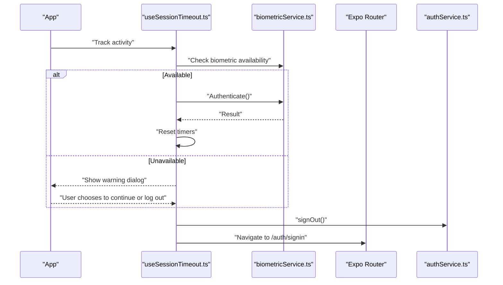

**Diagram sources**
- [useSessionTimeout.ts](file://hooks/useSessionTimeout.ts#L1-L103)
- [biometricService.ts](file://services/biometricService.ts#L1-L120)
- [authService.ts](file://services/authService.ts#L690-L721)

**Section sources**
- [useSessionTimeout.ts](file://hooks/useSessionTimeout.ts#L1-L103)
- [biometricService.ts](file://services/biometricService.ts#L1-L120)
- [authService.ts](file://services/authService.ts#L690-L721)

### Consuming Authentication State in Components
- Components can use the global AuthContext to access user, role, and token.
- The useAuth hook provides a simplified interface for authentication checks and role enforcement.

Examples of consumption patterns:
- Accessing authentication state and helpers from AuthContext
- Using requireRole to enforce role-based redirection
- Using useSessionTimeout to manage idle sessions

**Section sources**
- [AuthContext.tsx](file://contexts/AuthContext.tsx#L1-L149)
- [useAuth.ts](file://hooks/useAuth.ts#L1-L116)

## Dependency Analysis
- Firebase is configured conditionally and only initialized when environment variables are present.
- Authentication service depends on Firebase Auth and AsyncStorage for token persistence.
- Role management service coordinates role status and verification state.
- Session timeout hook integrates with biometric service and router.
- Auth context depends on authentication service for user refresh and sign-out.
- App-level layout orchestrates navigation based on onboarding, role, and authentication state.

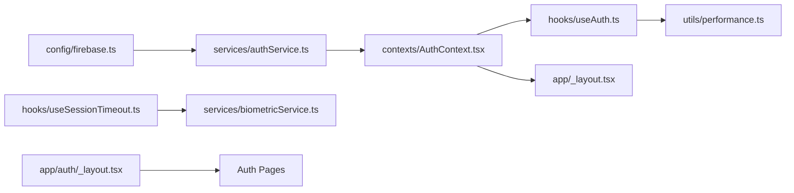

**Diagram sources**
- [firebase.ts](file://config/firebase.ts#L1-L82)
- [authService.ts](file://services/authService.ts#L1-L120)
- [AuthContext.tsx](file://contexts/AuthContext.tsx#L1-L149)
- [useAuth.ts](file://hooks/useAuth.ts#L1-L116)
- [performance.ts](file://utils/performance.ts#L98-L140)
- [useSessionTimeout.ts](file://hooks/useSessionTimeout.ts#L1-L103)
- [biometricService.ts](file://services/biometricService.ts#L1-L120)
- [app/_layout.tsx](file://app/_layout.tsx#L120-L178)
- [app/auth/_layout.tsx](file://app/auth/_layout.tsx#L1-L68)

**Section sources**
- [firebase.ts](file://config/firebase.ts#L1-L82)
- [authService.ts](file://services/authService.ts#L1-L120)
- [AuthContext.tsx](file://contexts/AuthContext.tsx#L1-L149)
- [useAuth.ts](file://hooks/useAuth.ts#L1-L116)
- [performance.ts](file://utils/performance.ts#L98-L140)
- [useSessionTimeout.ts](file://hooks/useSessionTimeout.ts#L1-L103)
- [biometricService.ts](file://services/biometricService.ts#L1-L120)
- [app/_layout.tsx](file://app/_layout.tsx#L120-L178)
- [app/auth/_layout.tsx](file://app/auth/_layout.tsx#L1-L68)

## Performance Considerations
- Caching and preloading critical authentication data reduces startup latency.
- Lazy loading of services minimizes initial bundle size.
- Debounce/throttle utilities help optimize repeated operations.

**Section sources**
- [performance.ts](file://utils/performance.ts#L54-L105)
- [useAuth.ts](file://hooks/useAuth.ts#L1-L116)

## Troubleshooting Guide
Common issues and resolutions:
- Firebase not initialized: Ensure all required environment variables are present; the configuration logs warnings when incomplete.
- Authentication errors: Inspect Firebase error codes and map to user-friendly messages.
- Token expiry: The authentication service validates expiry and refreshes tokens automatically; invalid tokens are cleared.
- Session timeout: If biometric is unavailable, a confirmation dialog is shown; on timeout, the user is logged out and redirected to sign-in.
- Role mismatch: During social sign-in, if the selected role differs from the account role, the user is prompted to select the correct role.

**Section sources**
- [firebase.ts](file://config/firebase.ts#L33-L43)
- [authService.ts](file://services/authService.ts#L131-L151)
- [authService.ts](file://services/authService.ts#L827-L841)
- [useSessionTimeout.ts](file://hooks/useSessionTimeout.ts#L20-L71)
- [app/auth/signin.tsx](file://app/auth/signin.tsx#L180-L262)

## Conclusion
Brillprime-expo’s authentication system integrates Firebase Authentication with robust local token management, role-based navigation, and session timeout handling. The AuthContext centralizes state, while hooks and guards ensure secure, role-aware navigation. OTP verification and password reset flows leverage Firebase APIs for reliability. Security is addressed through token validation, controlled storage, and optional biometric re-authentication.