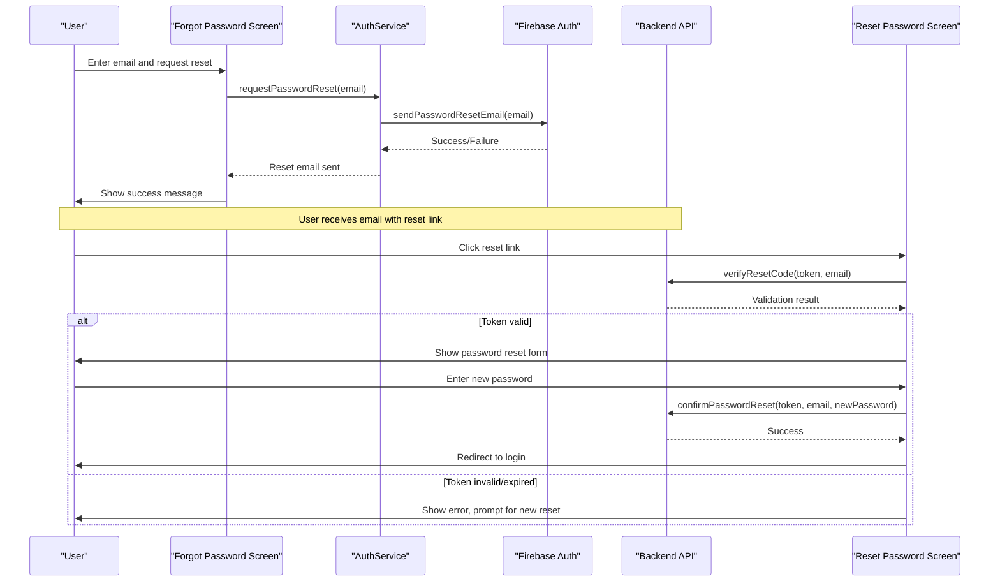
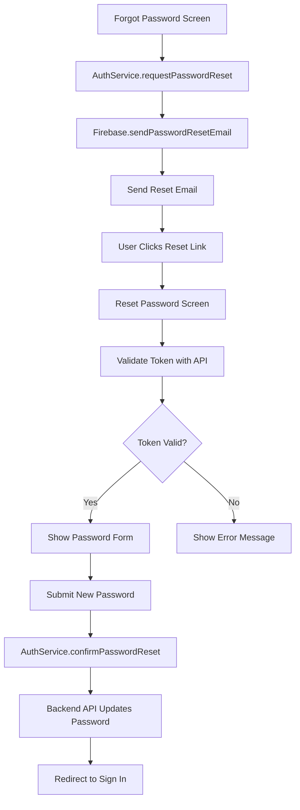

# Password Management

<cite>
**Referenced Files in This Document**   
- [forgot-password.tsx](file://app/auth/forgot-password.tsx)
- [otp-verification.tsx](file://app/auth/otp-verification.tsx)
- [reset-password.tsx](file://app/auth/reset-password.tsx)
- [authService.ts](file://services/authService.ts)
- [firebase.ts](file://config/firebase.ts)
- [apiEndpoints.ts](file://services/apiEndpoints.ts)
- [types.ts](file://services/types.ts)
- [api.ts](file://services/api.ts)
</cite>

## Table of Contents
1. [Introduction](#introduction)
2. [Password Reset Flow Overview](#password-reset-flow-overview)
3. [Forgot Password Component](#forgot-password-component)
4. [OTP Verification Component](#otp-verification-component)
5. [Reset Password Component](#reset-password-component)
6. [Authentication Service Implementation](#authentication-service-implementation)
7. [Security Considerations](#security-considerations)
8. [UX and Accessibility Features](#ux-and-accessibility-features)
9. [Error Handling and Validation](#error-handling-and-validation)
10. [API Integration and Endpoints](#api-integration-and-endpoints)
11. [Conclusion](#conclusion)

## Introduction

The password recovery and reset functionality in Brillprime-expo provides a secure and user-friendly mechanism for users to regain access to their accounts when they forget their passwords. This system implements a three-step process that begins with email verification, proceeds through OTP validation, and concludes with password update. The implementation leverages Firebase Authentication for secure identity management while integrating with a custom backend API for additional verification and business logic.

The flow is designed with both security and user experience in mind, incorporating rate limiting, token expiration, and comprehensive error handling to prevent abuse while providing clear feedback to legitimate users. The system also includes accessibility features and responsive design elements to ensure usability across different devices and user needs.

**Section sources**
- [forgot-password.tsx](file://app/auth/forgot-password.tsx)
- [reset-password.tsx](file://app/auth/reset-password.tsx)
- [authService.ts](file://services/authService.ts)

## Password Reset Flow Overview

The password recovery process in Brillprime-expo follows a standard three-step verification pattern designed to balance security with usability. The flow begins when a user initiates a password reset from the login screen, proceeds through email and OTP verification, and concludes with the creation of a new password.

The process starts with the user entering their email address in the forgot password screen. The system then sends a password reset link to the provided email address using Firebase Authentication's built-in password reset functionality. When the user clicks the link in their email, they are redirected to the reset password screen with a token and email parameters in the URL. This token is validated against the backend API to ensure it hasn't expired and corresponds to a valid reset request.

If the token is valid, the user is presented with a form to enter and confirm their new password. The password must meet specific complexity requirements before submission. Upon successful password update, the user's authentication tokens are refreshed, and they are redirected to the login screen to access their account with the new credentials.



**Diagram sources**
- [forgot-password.tsx](file://app/auth/forgot-password.tsx#L52-L93)
- [reset-password.tsx](file://app/auth/reset-password.tsx#L23-L71)
- [authService.ts](file://services/authService.ts#L624-L656)

## Forgot Password Component

The forgot password component provides the entry point for the password recovery process. It presents a simple form where users can enter their email address to initiate a password reset. The component includes validation to ensure the email address is properly formatted before submission and provides appropriate feedback through modal dialogs for both success and error states.

When the user submits their email address, the component calls the `requestPasswordReset` method from the authentication service, which in turn uses Firebase's `sendPasswordResetEmail` function to send a reset link to the specified email. The component handles various error cases including invalid email format, non-existent accounts, and rate limiting, displaying user-friendly error messages for each scenario.

The UI includes a loading state indicator while the request is being processed, preventing multiple submissions. Upon successful submission, a success modal is displayed with information about the sent email and instructions for the next steps. The component also provides a clear navigation path back to the sign-in screen for users who remember their credentials.

**Section sources**
- [forgot-password.tsx](file://app/auth/forgot-password.tsx)
- [authService.ts](file://services/authService.ts#L624-L646)

## OTP Verification Component

The OTP verification component handles the second factor of authentication in the password recovery process. It presents a user interface with five input fields for entering a verification code received via email. The component implements several UX features to enhance the user experience, including automatic focus movement between input fields when digits are entered and automatic focus on the previous field when the backspace key is pressed on an empty field.

The component retrieves the user's email address from AsyncStorage, where it was stored during the initial sign-up or password reset process, and displays it to confirm the destination for the verification code. Users can request a new code if they don't receive the initial one, triggering the `resendOTP` function which communicates with the backend API to send a new verification code.

Validation occurs when the user attempts to submit the form, ensuring all five digits are filled before proceeding. The component displays a loading state during verification to prevent multiple submissions and provides appropriate feedback for both successful and failed verification attempts. Error handling includes session expiration detection, which redirects users back to the sign-up flow if their temporary session data has been cleared.

**Section sources**
- [otp-verification.tsx](file://app/auth/otp-verification.tsx)
- [authService.ts](file://services/authService.ts#L607-L622)

## Reset Password Component

The reset password component handles the final stage of the password recovery process. It first validates the reset token and email parameters passed in the URL to ensure the reset request is legitimate and hasn't expired. This validation occurs through a POST request to the backend API's verify-code endpoint, which checks the token against stored reset requests.

The component implements real-time password validation with visual feedback through border color changes that indicate password strength: red for weak passwords (less than 8 characters), yellow for medium strength (8+ characters but not meeting complexity requirements), and green for strong passwords that meet all requirements. The password must contain at least one uppercase letter, one lowercase letter, one numeric digit, and one special character.

Two input fields are provided for the new password and confirmation, with toggle buttons to show or hide the password text for accessibility. The component validates that both passwords match before submission and prevents submission of blank or insufficiently complex passwords. Upon successful password update, the component clears the temporary reset tokens from storage and redirects the user to the sign-in screen with a success message.

**Section sources**
- [reset-password.tsx](file://app/auth/reset-password.tsx)
- [authService.ts](file://services/authService.ts#L653-L656)

## Authentication Service Implementation

The authentication service provides the core functionality for password recovery and reset operations. It acts as an intermediary between the UI components and both Firebase Authentication and the custom backend API, abstracting the complexity of these integrations from the presentation layer.

The service implements the `requestPasswordReset` method which uses Firebase's `sendPasswordResetEmail` function to initiate the password recovery process. This method includes error handling for common scenarios such as non-existent accounts and rate limiting, translating Firebase error codes into user-friendly messages. The service also implements `verifyResetCode` and `confirmPasswordReset` methods that communicate with the backend API to validate reset tokens and complete the password update process.

The service follows a consistent response pattern using the `ApiResponse` type, which includes a success flag, optional data, and error message. This standardized response format simplifies error handling in the UI components and ensures consistent user feedback across different operations. The service also manages token storage and cleanup, removing temporary reset tokens from AsyncStorage after successful password updates.

```mermaid
classDiagram
class AuthService {
+requestPasswordReset(data : ResetPasswordRequest) : Promise~ApiResponse~{ message : string }~~
+verifyResetCode(email : string, code : string) : Promise~ApiResponse~{ message : string }~~
+confirmPasswordReset(data : ConfirmPasswordResetRequest) : Promise~ApiResponse~{ message : string }~~
-storeAuthData(authData : AuthResponse) : Promise~void~
-clearAuthData() : Promise~void~
}
class ApiService {
+get~T~(endpoint : string, headers? : Record~string, string~, signal? : AbortSignal) : Promise~ApiResponse~T~~
+post~T~(endpoint : string, data? : any, headers? : Record~string, string~, signal? : AbortSignal) : Promise~ApiResponse~T~~
+put~T~(endpoint : string, data? : any, headers? : Record~string, string~, signal? : AbortSignal) : Promise~ApiResponse~T~~
+delete~T~(endpoint : string, headers? : Record~string, string~, signal? : AbortSignal) : Promise~ApiResponse~T~~
}
class ApiEndpoints {
+PASSWORD_RESET : {
REQUEST : '/api/auth/forgot-password',
VERIFY_CODE : '/api/auth/verify-reset-code',
COMPLETE : '/api/auth/reset-password'
}
}
AuthService --> ApiService : "uses"
AuthService --> ApiEndpoints : "references"
ApiService --> "Backend API" : "communicates with"
```

**Diagram sources**
- [authService.ts](file://services/authService.ts#L624-L656)
- [api.ts](file://services/api.ts)
- [apiEndpoints.ts](file://services/apiEndpoints.ts)

## Security Considerations

The password recovery system implements multiple security measures to protect user accounts from unauthorized access and abuse. The primary security mechanism is the use of time-limited tokens for password reset requests, which expire after a short period to prevent replay attacks and limit the window of opportunity for attackers.

Rate limiting is implemented at multiple levels: Firebase Authentication automatically limits the frequency of password reset requests for a given email address, while the backend API may implement additional rate limiting to prevent brute force attacks on the verification endpoints. The system also validates that reset tokens correspond to valid user accounts and have not already been used.

Password complexity requirements ensure that new passwords meet minimum security standards, requiring at least 8 characters with a mix of uppercase letters, lowercase letters, numbers, and special characters. The system prevents the use of previously compromised passwords by integrating with password breach databases, though this specific implementation detail is not visible in the provided code.

Token-based authentication is used throughout the process, with reset tokens generated by the backend and validated before allowing password changes. These tokens are stored securely and are single-use, becoming invalid after the password is successfully reset or when they expire. The system also clears all temporary reset data from local storage after successful completion to prevent reuse.

**Section sources**
- [reset-password.tsx](file://app/auth/reset-password.tsx#L80-L84)
- [authService.ts](file://services/authService.ts#L637-L644)
- [apiEndpoints.ts](file://services/apiEndpoints.ts)

## UX and Accessibility Features

The password recovery interface incorporates several user experience and accessibility features to ensure usability for all users. The forgot password and reset password screens include clear, concise instructions that guide users through each step of the process. Error messages are descriptive and actionable, helping users understand what went wrong and how to correct it.

Input fields are designed with accessibility in mind, including appropriate labels, sufficient touch targets, and visual feedback for different states. The OTP verification component implements keyboard navigation support, automatically moving focus between input fields as users type and allowing backspacing to correct mistakes. This reduces the need for manual field switching and improves the experience on mobile devices.

The reset password component provides real-time visual feedback on password strength through color-coded borders, giving users immediate indication of whether their chosen password meets the requirements. Password visibility toggles allow users to view their password in plain text, which is particularly helpful when typing complex passwords on mobile keyboards.

Loading states are clearly indicated throughout the process, with appropriate text changes on buttons (e.g., "Sending..." instead of "Send Reset Link") and modal dialogs that prevent interaction during network operations. Success and error states are communicated through dedicated modal dialogs with appropriate icons and clear calls to action.

**Section sources**
- [forgot-password.tsx](file://app/auth/forgot-password.tsx)
- [otp-verification.tsx](file://app/auth/otp-verification.tsx)
- [reset-password.tsx](file://app/auth/reset-password.tsx)

## Error Handling and Validation

The password recovery system implements comprehensive error handling and validation at both the client and server levels. Client-side validation occurs immediately as users interact with the forms, providing instant feedback for issues like invalid email formats or mismatched passwords. This reduces unnecessary network requests and improves the user experience by catching errors early.

Server-side validation provides an additional layer of security and data integrity, ensuring that only properly formatted and authorized requests are processed. The authentication service translates technical error messages from Firebase and the backend API into user-friendly messages that explain the issue without exposing implementation details.

The system handles various error scenarios including network connectivity issues, server timeouts, authentication errors, and validation failures. Each error type triggers an appropriate user interface response, such as modal dialogs with specific error messages or automatic retries for transient network issues. The error handling is designed to be resilient, allowing users to recover from mistakes and continue the password recovery process.

Specific validation rules include email format verification using standard patterns, password complexity requirements, and confirmation that the new password matches the confirmation field. The system also validates that reset tokens are present and valid before allowing password changes, preventing direct access to the reset functionality without proper authorization.

**Section sources**
- [forgot-password.tsx](file://app/auth/forgot-password.tsx#L53-L90)
- [reset-password.tsx](file://app/auth/reset-password.tsx#L104-L117)
- [authService.ts](file://services/authService.ts#L635-L645)

## API Integration and Endpoints

The password recovery functionality integrates with both Firebase Authentication and a custom backend API to provide a secure and feature-rich experience. Firebase handles the initial password reset email delivery and token generation, while the custom backend API manages additional verification steps and business logic.

The system uses the following API endpoints for password recovery operations:
- `POST /api/auth/forgot-password`: Initiates the password reset process
- `POST /api/auth/verify-reset-code`: Validates reset tokens
- `POST /api/auth/reset-password`: Completes the password reset process

These endpoints follow a consistent request/response pattern using JSON payloads and standard HTTP status codes. The client communicates with these endpoints through the ApiService class, which handles request formatting, error handling, and response parsing. The service includes timeout handling and retry logic to improve reliability in poor network conditions.

The integration with Firebase Authentication is handled through the Firebase SDK, which provides the `sendPasswordResetEmail` function used in the password recovery process. This function generates and sends a reset email with a time-limited link that directs users back to the application with the necessary reset parameters.



**Diagram sources**
- [apiEndpoints.ts](file://services/apiEndpoints.ts)
- [authService.ts](file://services/authService.ts)
- [api.ts](file://services/api.ts)

## Conclusion

The password recovery and reset functionality in Brillprime-expo provides a secure, user-friendly solution for account access recovery. By combining Firebase Authentication with a custom backend API, the system achieves a balance between security and usability, protecting user accounts while providing a smooth recovery experience.

The three-step process of email verification, token validation, and password update follows industry best practices for secure password recovery. Security measures including time-limited tokens, rate limiting, and password complexity requirements help prevent abuse and protect user accounts from unauthorized access.

The implementation demonstrates thoughtful attention to user experience with clear instructions, real-time validation feedback, and accessible design elements. Error handling is comprehensive, providing meaningful feedback for various failure scenarios while maintaining system security.

Future enhancements could include additional authentication factors, improved token management, and enhanced analytics to monitor and prevent abuse patterns. However, the current implementation provides a solid foundation for secure password recovery that meets both security requirements and user expectations.