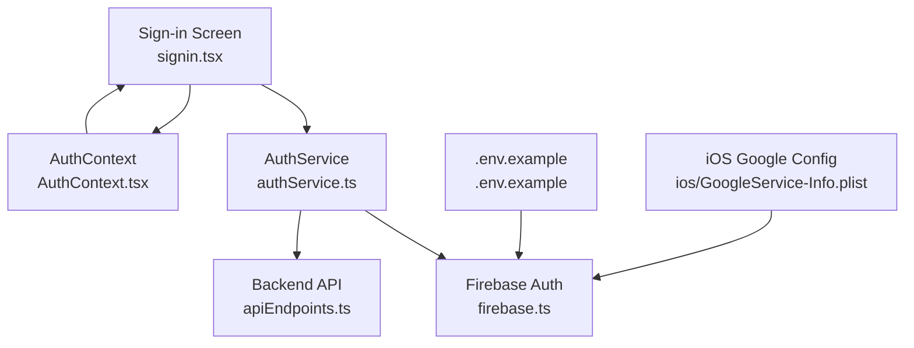
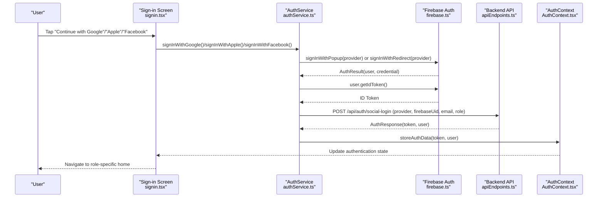
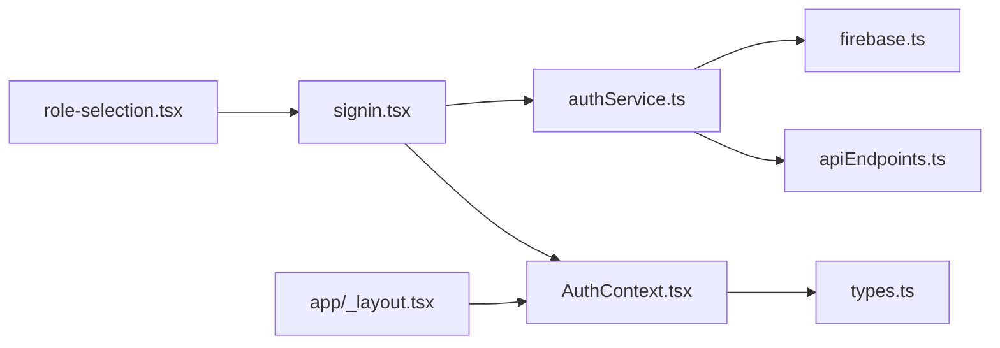

# Social Login Integration

<cite>
**Referenced Files in This Document**
- [authService.ts](file://services/authService.ts)
- [signin.tsx](file://app/auth/signin.tsx)
- [firebase.ts](file://config/firebase.ts)
- [AuthContext.tsx](file://contexts/AuthContext.tsx)
- [useAuth.ts](file://hooks/useAuth.ts)
- [types.ts](file://services/types.ts)
- [apiEndpoints.ts](file://services/apiEndpoints.ts)
- [.env.example](file://.env.example)
- [firebase.json](file://firebase.json)
- [ios/GoogleService-Info.plist](file://ios/GoogleService-Info.plist)
- [app/_layout.tsx](file://app/_layout.tsx)
- [role-selection.tsx](file://app/auth/role-selection.tsx)
</cite>

## Table of Contents
1. [Introduction](#introduction)
2. [Project Structure](#project-structure)
3. [Core Components](#core-components)
4. [Architecture Overview](#architecture-overview)
5. [Detailed Component Analysis](#detailed-component-analysis)
6. [Dependency Analysis](#dependency-analysis)
7. [Performance Considerations](#performance-considerations)
8. [Troubleshooting Guide](#troubleshooting-guide)
9. [Conclusion](#conclusion)
10. [Appendices](#appendices)

## Introduction
This document explains how social authentication is implemented in Brillprime-expo using Firebase Authentication. It focuses on Google, Apple, and Facebook OAuth providers, detailing how the application integrates Firebase’s signInWithPopup and signInWithRedirect flows, how the UI triggers authentication, and how the backend is notified to synchronize user profiles. It also covers configuration requirements, token exchange, user profile creation on first login, error handling, and security considerations such as redirect URI validation and ID token usage.

## Project Structure
The social login feature spans several layers:
- UI layer: The sign-in screen renders social provider buttons and orchestrates the authentication flow.
- Service layer: The authentication service encapsulates Firebase operations, token management, and backend synchronization.
- Configuration layer: Firebase initialization and environment variables define provider settings.
- Context layer: Global authentication state is maintained and consumed by UI components.

**Diagram sources**
- [signin.tsx](file://app/auth/signin.tsx#L180-L370)
- [authService.ts](file://services/authService.ts#L244-L605)
- [firebase.ts](file://config/firebase.ts#L1-L82)
- [apiEndpoints.ts](file://services/apiEndpoints.ts#L15-L24)
- [AuthContext.tsx](file://contexts/AuthContext.tsx#L1-L149)
- [.env.example](file://.env.example#L18-L30)
- [ios/GoogleService-Info.plist](file://ios/GoogleService-Info.plist#L1-L36)

**Section sources**
- [signin.tsx](file://app/auth/signin.tsx#L180-L370)
- [authService.ts](file://services/authService.ts#L244-L605)
- [firebase.ts](file://config/firebase.ts#L1-L82)
- [apiEndpoints.ts](file://services/apiEndpoints.ts#L15-L24)
- [AuthContext.tsx](file://contexts/AuthContext.tsx#L1-L149)
- [.env.example](file://.env.example#L18-L30)
- [ios/GoogleService-Info.plist](file://ios/GoogleService-Info.plist#L1-L36)

## Core Components
- AuthService: Implements Google, Apple, and Facebook OAuth flows using Firebase Auth. It manages popup vs redirect fallbacks, token acquisition, and backend synchronization for new users.
- Sign-in UI: Renders social provider buttons and routes users based on role and authentication outcome.
- Firebase configuration: Initializes Firebase with environment variables and validates configuration completeness.
- Backend endpoints: Provides typed endpoints for social login and related operations.
- AuthContext and hooks: Manage global authentication state and role-aware navigation.

**Section sources**
- [authService.ts](file://services/authService.ts#L244-L605)
- [signin.tsx](file://app/auth/signin.tsx#L180-L370)
- [firebase.ts](file://config/firebase.ts#L1-L82)
- [apiEndpoints.ts](file://services/apiEndpoints.ts#L15-L24)
- [AuthContext.tsx](file://contexts/AuthContext.tsx#L1-L149)
- [useAuth.ts](file://hooks/useAuth.ts#L1-L116)

## Architecture Overview
The social login flow integrates Firebase Auth with a backend API to create or update user profiles and establish a local session.

**Diagram sources**
- [signin.tsx](file://app/auth/signin.tsx#L180-L370)
- [authService.ts](file://services/authService.ts#L244-L605)
- [apiEndpoints.ts](file://services/apiEndpoints.ts#L15-L24)
- [AuthContext.tsx](file://contexts/AuthContext.tsx#L1-L149)

## Detailed Component Analysis

### Firebase Initialization and Configuration
- Environment variables are read via a helper that maps EXPO_PUBLIC_ keys to lowercase snake_case and falls back to process.env. Missing fields are detected and logged.
- Firebase is initialized only if all required fields are present. Services (auth, firestore, storage) are exported for use across the app.
- iOS Google configuration is provided via GoogleService-Info.plist for native Google Sign-In.

Key configuration locations:
- Firebase initialization and environment resolution: [firebase.ts](file://config/firebase.ts#L1-L82)
- Example environment variables for Firebase: [.env.example](file://.env.example#L18-L30)
- iOS Google configuration: [ios/GoogleService-Info.plist](file://ios/GoogleService-Info.plist#L1-L36)

Security note:
- Ensure EXPO_PUBLIC_FIREBASE_* variables are set and correct to avoid runtime initialization failures.

**Section sources**
- [firebase.ts](file://config/firebase.ts#L1-L82)
- [.env.example](file://.env.example#L18-L30)
- [ios/GoogleService-Info.plist](file://ios/GoogleService-Info.plist#L1-L36)

### Social Provider Integration in AuthService
AuthService implements:
- Google OAuth: Adds scopes for email and profile, attempts popup, falls back to redirect on popup-blocked or popup-closed-by-user, and handles unauthorized-domain errors.
- Apple OAuth: Uses OAuthProvider('apple.com'), adds scopes for email and name, with similar popup/redirect fallback logic.
- Facebook OAuth: Adds scopes for email and public_profile, with popup/redirect fallback and unauthorized-domain handling.

Token exchange and user profile creation:
- On successful provider sign-in, the service obtains an ID token from Firebase user.
- It posts to the backend endpoint /api/auth/social-login with provider, firebaseUid, email, role, and optional full name/photo URL.
- On success, the backend returns an AuthResponse containing a token and user object, which is persisted locally and used to update global authentication state.

Error handling:
- Popup-closed-by-user and cancelled-popup-request are treated as “Sign-in cancelled”.
- popup-blocked triggers redirect; unauthorized-domain errors are surfaced to the UI.
- Redirect result handling occurs on app load via checkRedirectResult, which posts to the backend and persists the session.

Key implementation references:
- Google sign-in flow: [authService.ts](file://services/authService.ts#L244-L365)
- Apple sign-in flow: [authService.ts](file://services/authService.ts#L408-L490)
- Facebook sign-in flow: [authService.ts](file://services/authService.ts#L492-L605)
- Redirect result handling: [authService.ts](file://services/authService.ts#L367-L406)

**Section sources**
- [authService.ts](file://services/authService.ts#L244-L605)

### UI Implementation for Social Providers
The sign-in screen provides three social provider buttons:
- Google: [signin.tsx](file://app/auth/signin.tsx#L350-L358)
- Apple: [signin.tsx](file://app/auth/signin.tsx#L358-L366)
- Facebook: [signin.tsx](file://app/auth/signin.tsx#L366-L369)

The handler:
- Ensures a role is selected before initiating OAuth.
- Calls the corresponding AuthService method.
- Persists the returned token and user data to AsyncStorage.
- Routes to the appropriate home page based on role.

Key implementation references:
- Social button handlers: [signin.tsx](file://app/auth/signin.tsx#L180-L262)
- Role requirement and routing: [signin.tsx](file://app/auth/signin.tsx#L180-L262)

**Section sources**
- [signin.tsx](file://app/auth/signin.tsx#L180-L262)

### Backend Endpoint Contracts
The service posts to a typed endpoint for social login:
- Endpoint: /api/auth/social-login
- Payload includes provider, firebaseUid, email, role, and optional full name/photo URL.
- Response shape is an AuthResponse with token and user.

Key references:
- Endpoint definition: [apiEndpoints.ts](file://services/apiEndpoints.ts#L15-L24)
- Payload construction and response handling: [authService.ts](file://services/authService.ts#L367-L406)

**Section sources**
- [apiEndpoints.ts](file://services/apiEndpoints.ts#L15-L24)
- [authService.ts](file://services/authService.ts#L367-L406)

### Token Exchange and Session Management
- After successful OAuth, the service retrieves an ID token from Firebase user and passes it to the backend for validation and session establishment.
- On success, the backend returns an AuthResponse which is stored in AsyncStorage and used to update the global authentication state.
- The service refreshes tokens automatically when nearing expiration and persists token expiry timestamps.

Key references:
- Token retrieval and storage: [authService.ts](file://services/authService.ts#L282-L318)
- Backend sync and AuthResponse handling: [authService.ts](file://services/authService.ts#L367-L406)
- Global state updates: [AuthContext.tsx](file://contexts/AuthContext.tsx#L1-L149)

**Section sources**
- [authService.ts](file://services/authService.ts#L282-L318)
- [authService.ts](file://services/authService.ts#L367-L406)
- [AuthContext.tsx](file://contexts/AuthContext.tsx#L1-L149)

### Error Handling for Denied Permissions or Canceled Flows
Common scenarios and handling:
- Popup closed by user or cancelled-popup-request: Returned as “Sign-in cancelled”.
- Popup blocked: Falls back to redirect; if redirect succeeds, the app expects checkRedirectResult to finalize the session.
- Unauthorized domain errors: Surface specific messages for Google, Apple, and Facebook.
- Redirect result errors: Logged and ignored gracefully to avoid blocking app startup.

Key references:
- Google error handling: [authService.ts](file://services/authService.ts#L324-L365)
- Apple error handling: [authService.ts](file://services/authService.ts#L482-L490)
- Facebook error handling: [authService.ts](file://services/authService.ts#L566-L605)
- Redirect result handling: [authService.ts](file://services/authService.ts#L367-L406)

**Section sources**
- [authService.ts](file://services/authService.ts#L324-L365)
- [authService.ts](file://services/authService.ts#L482-L490)
- [authService.ts](file://services/authService.ts#L566-L605)
- [authService.ts](file://services/authService.ts#L367-L406)

### Security Considerations
- OAuth redirect URI validation: Ensure Firebase Auth providers are configured with allowed redirect URIs in the Firebase console. The app relies on popup-first behavior with redirect fallback; misconfigured domains cause unauthorized-domain errors.
- ID token verification: The service obtains an ID token from Firebase and forwards it to the backend for session establishment. The backend should validate the token and provider claims before creating/updating user records.
- Scope management: Providers are granted minimal scopes (email, profile for Google; email, name for Apple; email, public_profile for Facebook). Adjust scopes according to your app’s needs.
- Native iOS Google configuration: The GoogleService-Info.plist file configures iOS Google Sign-In. Ensure bundle identifiers and client IDs match Firebase settings.

References:
- Firebase initialization and environment variables: [firebase.ts](file://config/firebase.ts#L1-L82), [.env.example](file://.env.example#L18-L30)
- iOS Google configuration: [ios/GoogleService-Info.plist](file://ios/GoogleService-Info.plist#L1-L36)

**Section sources**
- [firebase.ts](file://config/firebase.ts#L1-L82)
- [.env.example](file://.env.example#L18-L30)
- [ios/GoogleService-Info.plist](file://ios/GoogleService-Info.plist#L1-L36)

## Dependency Analysis
The social login stack depends on:
- Firebase Auth for OAuth flows and token management.
- Backend API for user profile synchronization and session establishment.
- UI components for triggering flows and rendering outcomes.
- Context and hooks for global state and navigation.

**Diagram sources**
- [signin.tsx](file://app/auth/signin.tsx#L180-L370)
- [authService.ts](file://services/authService.ts#L244-L605)
- [firebase.ts](file://config/firebase.ts#L1-L82)
- [apiEndpoints.ts](file://services/apiEndpoints.ts#L15-L24)
- [AuthContext.tsx](file://contexts/AuthContext.tsx#L1-L149)
- [types.ts](file://services/types.ts#L60-L66)
- [app/_layout.tsx](file://app/_layout.tsx#L1-L203)
- [role-selection.tsx](file://app/auth/role-selection.tsx#L1-L203)

**Section sources**
- [signin.tsx](file://app/auth/signin.tsx#L180-L370)
- [authService.ts](file://services/authService.ts#L244-L605)
- [firebase.ts](file://config/firebase.ts#L1-L82)
- [apiEndpoints.ts](file://services/apiEndpoints.ts#L15-L24)
- [AuthContext.tsx](file://contexts/AuthContext.tsx#L1-L149)
- [types.ts](file://services/types.ts#L60-L66)
- [app/_layout.tsx](file://app/_layout.tsx#L1-L203)
- [role-selection.tsx](file://app/auth/role-selection.tsx#L1-L203)

## Performance Considerations
- Popup-first strategy reduces redirect overhead; redirect is only used when popup is blocked or closed by user.
- Token refresh logic avoids frequent token exchanges by checking expiry and buffering refresh within a short window.
- Asynchronous backend synchronization prevents blocking the UI during sign-in.

[No sources needed since this section provides general guidance]

## Troubleshooting Guide
Common issues and resolutions:
- Popup blocked or popup closed by user:
  - The service falls back to redirect. If redirect is triggered, the app expects checkRedirectResult to finalize authentication on reload.
  - Reference: [authService.ts](file://services/authService.ts#L253-L272), [authService.ts](file://services/authService.ts#L336-L365)
- Unauthorized domain error:
  - Indicates Firebase Auth domain is not authorized. Add the domain to Firebase Auth settings.
  - Reference: [authService.ts](file://services/authService.ts#L328-L333), [authService.ts](file://services/authService.ts#L568-L574)
- Redirect result not processed:
  - Ensure checkRedirectResult runs on app load and that the backend endpoint /api/auth/social-login is reachable.
  - Reference: [authService.ts](file://services/authService.ts#L367-L406), [apiEndpoints.ts](file://services/apiEndpoints.ts#L15-L24)
- Missing Firebase configuration:
  - Verify EXPO_PUBLIC_FIREBASE_* variables are set and correct.
  - Reference: [.env.example](file://.env.example#L18-L30), [firebase.ts](file://config/firebase.ts#L1-L82)
- iOS Google configuration mismatch:
  - Ensure GoogleService-Info.plist matches Firebase project settings and bundle identifier.
  - Reference: [ios/GoogleService-Info.plist](file://ios/GoogleService-Info.plist#L1-L36)

**Section sources**
- [authService.ts](file://services/authService.ts#L253-L272)
- [authService.ts](file://services/authService.ts#L328-L333)
- [authService.ts](file://services/authService.ts#L336-L365)
- [authService.ts](file://services/authService.ts#L367-L406)
- [apiEndpoints.ts](file://services/apiEndpoints.ts#L15-L24)
- [.env.example](file://.env.example#L18-L30)
- [firebase.ts](file://config/firebase.ts#L1-L82)
- [ios/GoogleService-Info.plist](file://ios/GoogleService-Info.plist#L1-L36)

## Conclusion
Brillprime-expo’s social authentication leverages Firebase Auth with robust popup/redirect fallbacks for Google, Apple, and Facebook. The AuthService centralizes OAuth logic, token exchange, and backend synchronization, while the UI provides intuitive social provider buttons and role-aware routing. Proper Firebase configuration, redirect URI validation, and careful error handling ensure a smooth user experience. The architecture cleanly separates concerns across UI, service, configuration, and context layers.

[No sources needed since this section summarizes without analyzing specific files]

## Appendices

### Configuration Checklist
- Firebase:
  - Set EXPO_PUBLIC_FIREBASE_* variables in environment.
  - Configure OAuth providers in Firebase Console with allowed redirect URIs.
  - Reference: [.env.example](file://.env.example#L18-L30), [firebase.ts](file://config/firebase.ts#L1-L82)
- iOS Google:
  - Ensure GoogleService-Info.plist is present and matches Firebase project settings.
  - Reference: [ios/GoogleService-Info.plist](file://ios/GoogleService-Info.plist#L1-L36)
- Backend:
  - Ensure /api/auth/social-login is implemented to accept provider, firebaseUid, email, role, and return AuthResponse.
  - Reference: [apiEndpoints.ts](file://services/apiEndpoints.ts#L15-L24), [authService.ts](file://services/authService.ts#L367-L406)

**Section sources**
- [.env.example](file://.env.example#L18-L30)
- [firebase.ts](file://config/firebase.ts#L1-L82)
- [ios/GoogleService-Info.plist](file://ios/GoogleService-Info.plist#L1-L36)
- [apiEndpoints.ts](file://services/apiEndpoints.ts#L15-L24)
- [authService.ts](file://services/authService.ts#L367-L406)