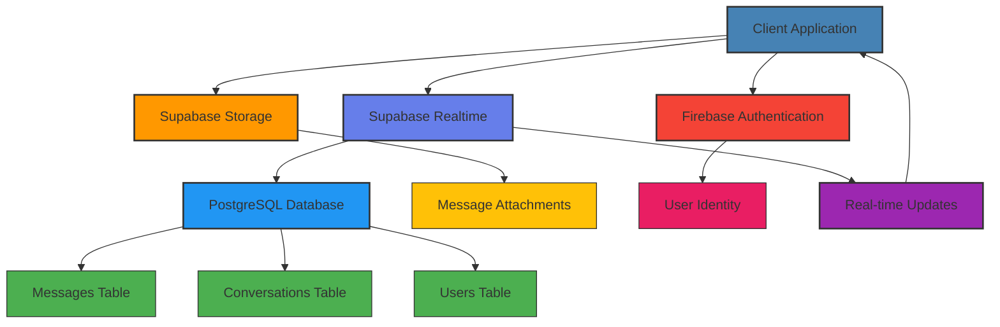
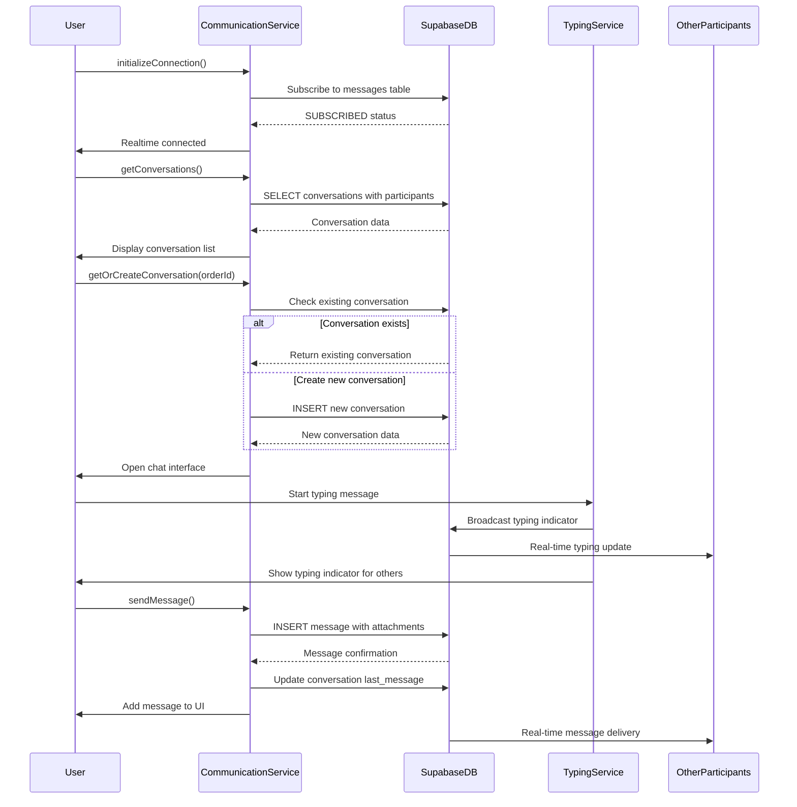
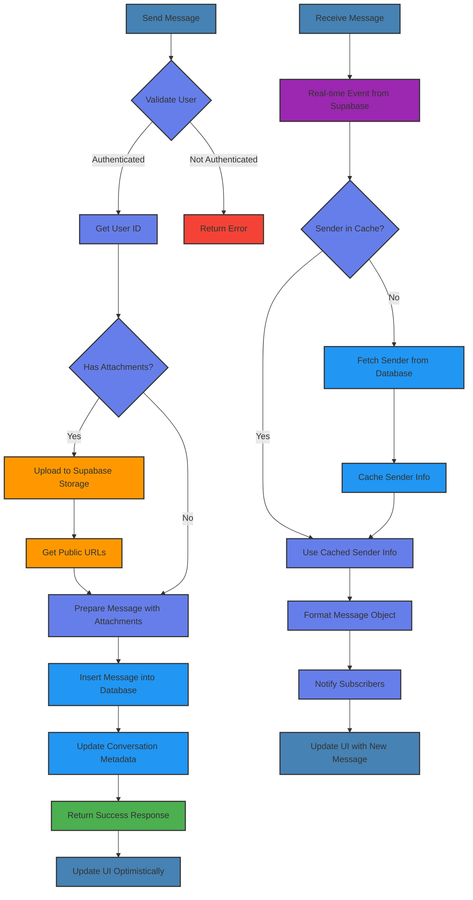
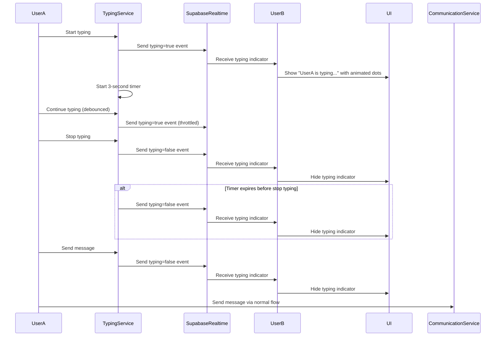
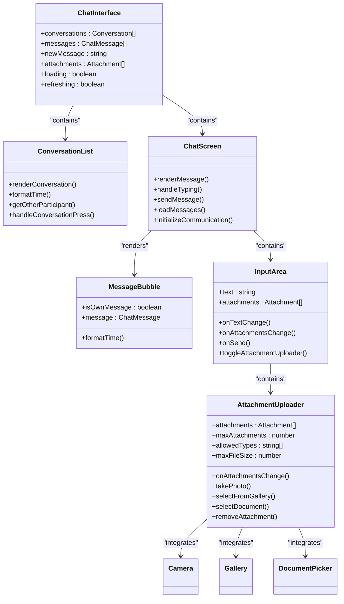
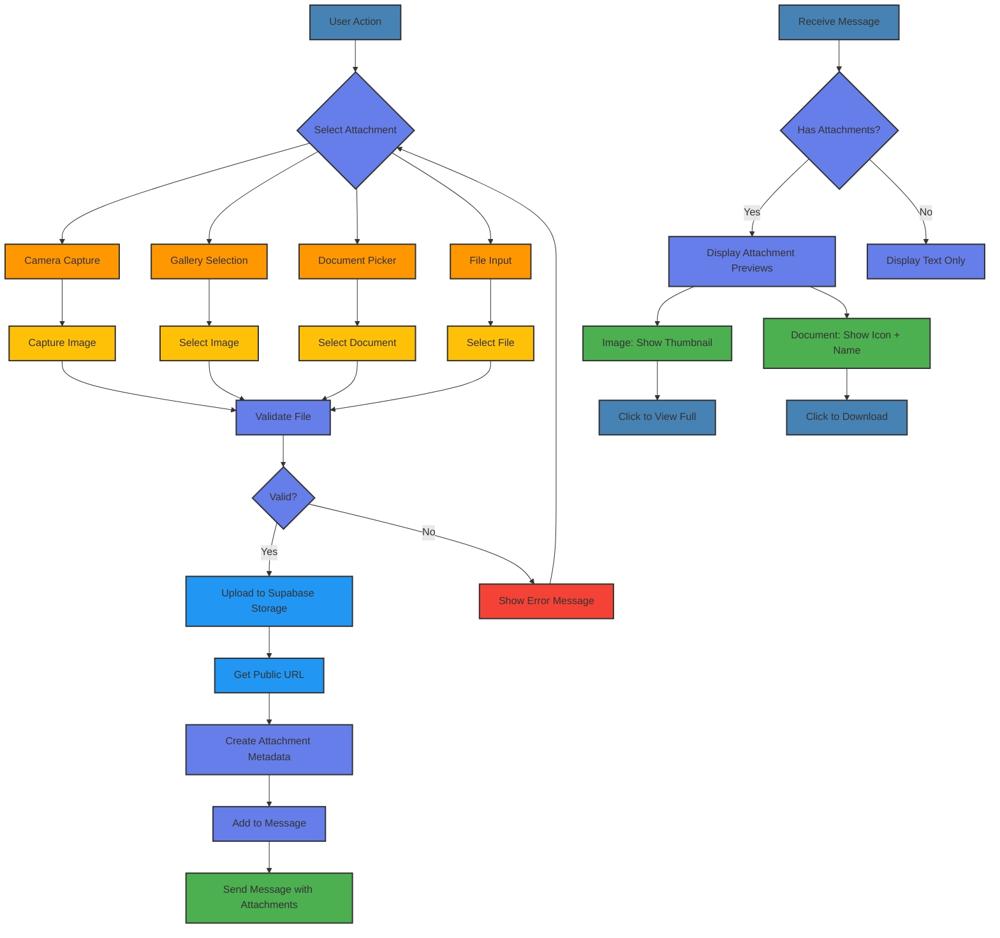
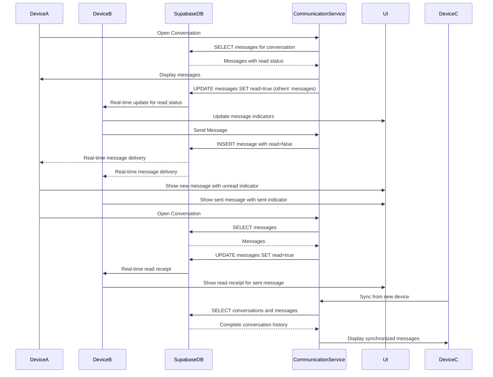
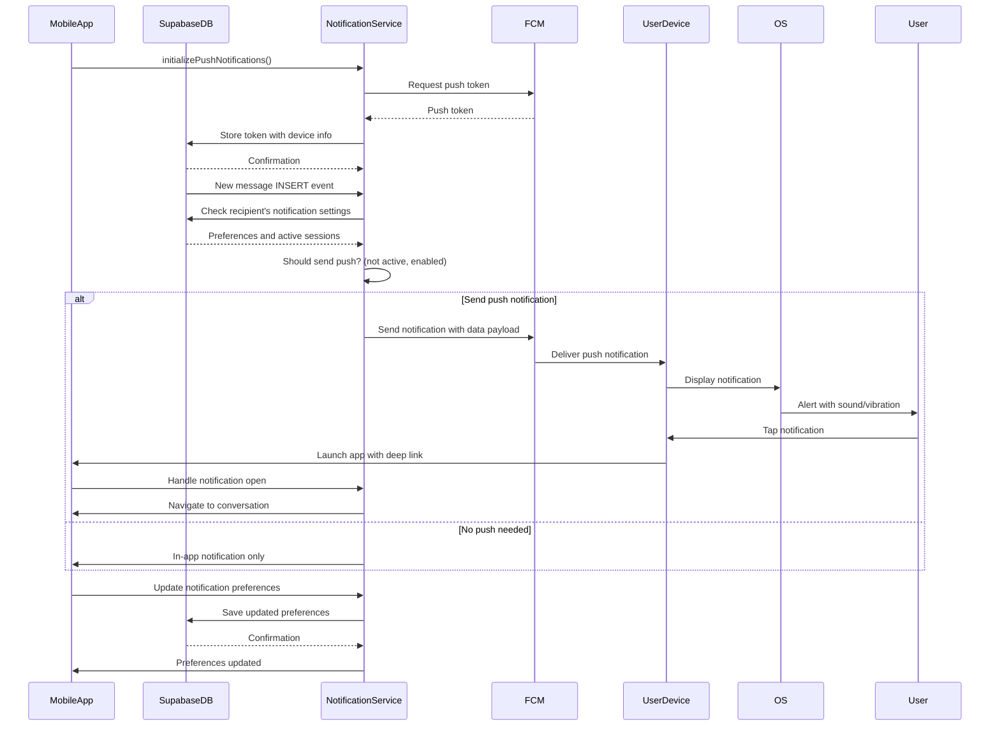
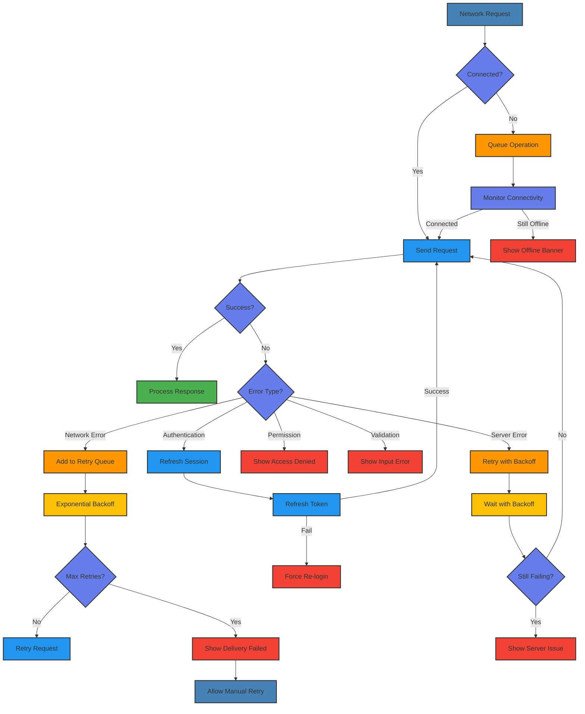
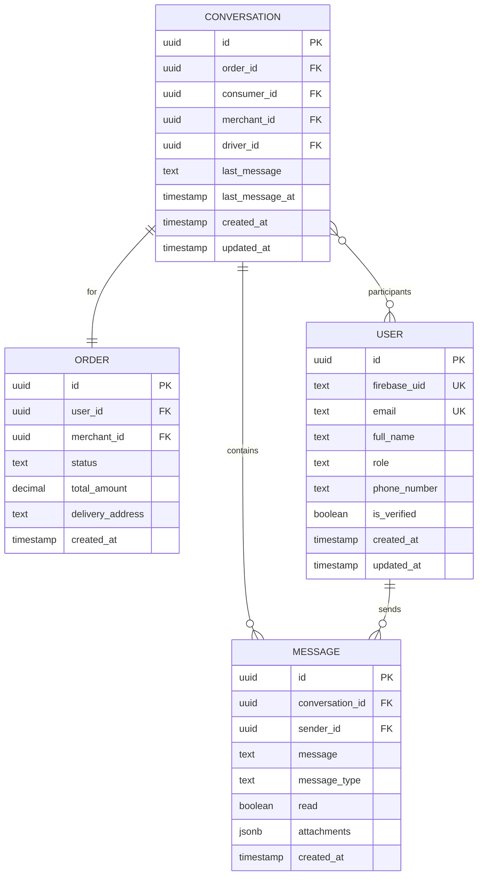

# Communication System

<cite>
**Referenced Files in This Document**   
- [communicationService.ts](file://services/communicationService.ts)
- [typingIndicatorService.ts](file://services/typingIndicatorService.ts)
- [messages-attachments.sql](file://supabase/messages-attachments.sql)
- [fileValidation.ts](file://utils/fileValidation.ts)
- [index.tsx](file://app/chat/index.tsx)
- [\[conversationId\].tsx](file://app/chat/[conversationId].tsx)
- [AttachmentUploader.tsx](file://components/AttachmentUploader.tsx)
- [schema.sql](file://supabase/schema.sql)
- [realtime.sql](file://supabase/realtime.sql)
- [notificationService.ts](file://services/notificationService.ts)
</cite>

## Table of Contents
1. [Real-time Communication Architecture](#real-time-communication-architecture)
2. [One-on-One Chat Implementation](#one-on-one-chat-implementation)
3. [Message Handling and Storage](#message-handling-and-storage)
4. [Typing Indicator Service](#typing-indicator-service)
5. [Chat Interface Components](#chat-interface-components)
6. [Attachment Handling](#attachment-handling)
7. [Message Synchronization and Read Receipts](#message-synchronization-and-read-receipts)
8. [Push Notification Integration](#push-notification-integration)
9. [Error Handling and Network Resilience](#error-handling-and-network-resilience)
10. [User Role Interactions](#user-role-interactions)

## Real-time Communication Architecture

The Brillprime-expo communication system is built on Supabase Realtime, providing a robust foundation for real-time messaging between users, merchants, and drivers. The architecture leverages Supabase's PostgreSQL database with real-time capabilities to enable instant message delivery and synchronization across devices.

The system is designed with a client-server model where the frontend application connects to Supabase directly for real-time updates, eliminating the need for an intermediate WebSocket server. This direct connection reduces latency and simplifies the architecture. The `communicationService.ts` serves as the central hub for all messaging operations, handling connection management, message sending and receiving, and conversation state.

Supabase Realtime is configured to broadcast changes to the `messages` and `conversations` tables, allowing clients to receive updates instantly when new messages are inserted or conversation metadata changes. The `realtime.sql` configuration file enables real-time publication for these core tables, ensuring that authenticated users can subscribe to relevant data changes.

**Diagram sources**
- [communicationService.ts](file://services/communicationService.ts#L67-L98)
- [realtime.sql](file://supabase/realtime.sql#L4-L33)
- [schema.sql](file://supabase/schema.sql#L118-L140)

**Section sources**
- [communicationService.ts](file://services/communicationService.ts#L1-L676)
- [realtime.sql](file://supabase/realtime.sql#L1-L33)

## One-on-One Chat Implementation

The one-on-one chat system in Brillprime-expo enables direct communication between consumers, merchants, and drivers within the context of specific orders. The chat functionality is implemented through the `communicationService.ts` which manages the entire lifecycle of conversations from creation to message exchange.

Conversations are created on-demand when users need to communicate about an order, typically initiated from the order details screen or the messages list. The system uses order IDs as the primary key for conversation lookup, ensuring that all parties involved in an order can join the same conversation thread. The `getOrCreateConversation` method in `communicationService.ts` handles this logic, checking if a conversation already exists for an order and creating one if necessary.

Each conversation is associated with an order and includes all relevant participants: the consumer, merchant, and driver (when assigned). The conversation model includes metadata such as the last message, unread count, and timestamps for sorting and display purposes. This design ensures that users can easily find and resume conversations related to their orders.

The chat interface is implemented across multiple components, with `app/chat/index.tsx` providing the conversation list view and `app/chat/[conversationId].tsx` handling the individual chat screen. The conversation list displays recent chats with participant information, last message previews, and unread message counts, allowing users to quickly identify active conversations.

**Diagram sources**
- [communicationService.ts](file://services/communicationService.ts#L164-L348)
- [typingIndicatorService.ts](file://services/typingIndicatorService.ts#L21-L78)
- [\[conversationId\].tsx](file://app/chat/[conversationId].tsx#L89-L129)

**Section sources**
- [communicationService.ts](file://services/communicationService.ts#L294-L348)
- [index.tsx](file://app/chat/index.tsx#L1-L445)
- [\[conversationId\].tsx](file://app/chat/[conversationId].tsx#L1-L670)

## Message Handling and Storage

The message handling system in Brillprime-expo is designed for efficiency, reliability, and scalability. The `communicationService.ts` implements a comprehensive message management system that handles sending, receiving, and storage of messages through Supabase's real-time database capabilities.

Messages are stored in the `messages` table in the PostgreSQL database, with each message containing essential metadata including the conversation ID, sender ID, message content, timestamp, and read status. The database schema is optimized for real-time queries with appropriate indexes on frequently queried fields. The `schema.sql` file defines the messages table structure, while `realtime.sql` enables real-time subscriptions to this table.

When a user sends a message, the `sendMessage` method in `communicationService.ts` handles the entire process. It first validates the user's authentication status, retrieves the user's database ID, and then inserts the message into the database. The method implements optimistic UI updates, immediately displaying the message in the chat interface before receiving confirmation from the server, providing a responsive user experience.

The system employs several optimization techniques to enhance performance. The `getConversations` method uses batch queries to minimize database round trips, fetching all necessary user data in a single query rather than making multiple individual requests. Additionally, the service maintains a user cache to avoid repeated database lookups for sender information when processing incoming messages.

Message retrieval is handled by the `getMessages` method, which fetches messages for a specific conversation with proper ordering and pagination support. The method joins the messages table with the users table to include sender information in the results, eliminating the need for additional queries to resolve sender details.

**Diagram sources**
- [communicationService.ts](file://services/communicationService.ts#L413-L547)
- [communicationService.ts](file://services/communicationService.ts#L357-L409)
- [communicationService.ts](file://services/communicationService.ts#L101-L139)

**Section sources**
- [communicationService.ts](file://services/communicationService.ts#L413-L547)
- [schema.sql](file://supabase/schema.sql#L131-L140)

## Typing Indicator Service

The typing indicator service enhances the real-time communication experience by showing when other participants are composing messages. Implemented in `typingIndicatorService.ts`, this feature uses Supabase's real-time presence and broadcast capabilities to provide immediate visual feedback to users.

The service creates a dedicated real-time channel for each conversation using a naming convention of `typing:{conversationId}`. When a user begins typing, the service broadcasts a typing indicator event containing the user's ID, name, and typing status. Other participants in the conversation subscribe to this channel and receive the typing events in real-time, allowing the UI to display an appropriate indicator.

The implementation includes several sophisticated features to ensure a smooth user experience. A 3-second timeout automatically clears the typing indicator if the user stops typing without sending a message, preventing stale indicators from remaining visible. The service also debounces rapid typing events to reduce unnecessary network traffic and improve performance.

The typing indicator is integrated into the chat interface in `app/chat/[conversationId].tsx`, where it displays a "typing..." message along with animated dots when one or more participants are composing a message. For multiple participants, the indicator shows the names of all users currently typing, providing clear context about who is actively engaged in the conversation.

**Diagram sources**
- [typingIndicatorService.ts](file://services/typingIndicatorService.ts#L46-L78)
- [typingIndicatorService.ts](file://services/typingIndicatorService.ts#L109-L128)
- [\[conversationId\].tsx](file://app/chat/[conversationId].tsx#L107-L119)

**Section sources**
- [typingIndicatorService.ts](file://services/typingIndicatorService.ts#L1-L147)
- [\[conversationId\].tsx](file://app/chat/[conversationId].tsx#L106-L125)

## Chat Interface Components

The chat interface in Brillprime-expo is composed of several reusable components that work together to provide a seamless messaging experience. The primary components include the conversation list, individual chat screen, message bubbles, and input controls, all implemented with responsive design principles for optimal display across different device sizes.

The conversation list, implemented in `app/chat/index.tsx`, displays all active conversations with key information including the participant's name, order number, last message preview, and unread message count. Each conversation item includes a visual indicator for online status and uses color-coded avatars to distinguish between different user roles (consumer, merchant, driver). The list supports pull-to-refresh functionality for manual updates and automatically updates when new messages arrive through real-time subscriptions.

The individual chat screen, implemented in `app/chat/[conversationId].tsx`, provides the main messaging interface with a message list, input area, and attachment functionality. The message list displays messages in chronological order with distinct styling for sent and received messages. Sent messages are aligned to the right with a blue background, while received messages are aligned to the left with a white background and subtle border.

The input area includes a multi-line text input with adaptive height, an attachment button that toggles the attachment uploader, and a send button that is enabled only when there is content to send. The attachment uploader component allows users to add images and documents to their messages, with support for both camera capture and gallery selection on mobile devices.

**Diagram sources**
- [index.tsx](file://app/chat/index.tsx#L1-L445)
- [\[conversationId\].tsx](file://app/chat/[conversationId].tsx#L1-L670)
- [AttachmentUploader.tsx](file://components/AttachmentUploader.tsx#L1-L515)

**Section sources**
- [index.tsx](file://app/chat/index.tsx#L1-L445)
- [\[conversationId\].tsx](file://app/chat/[conversationId].tsx#L1-L670)
- [AttachmentUploader.tsx](file://components/AttachmentUploader.tsx#L1-L515)

## Attachment Handling

The attachment handling system in Brillprime-expo enables users to share images and documents within conversations, enhancing communication capabilities beyond text messages. The implementation spans multiple components and services, with the `AttachmentUploader.tsx` component providing the user interface and `communicationService.ts` handling the backend integration with Supabase Storage.

Attachments are stored in Supabase Storage, a secure object storage service integrated with the Supabase platform. When a user selects an attachment, the `AttachmentUploader` component handles the file selection process, supporting different methods based on the platform: camera capture, photo gallery selection, and document picker on mobile devices, and file input elements on web. The component validates file size and type according to configurable limits before proceeding with upload.

The `messages-attachments.sql` migration file modifies the messages table to include an `attachments` column of type JSONB, allowing storage of multiple attachment metadata objects within a single message record. This column stores information about each attachment including its ID, public URL, name, type, size, and MIME type, enabling efficient retrieval and display without requiring additional database queries.

When sending a message with attachments, the `sendMessage` method in `communicationService.ts` first uploads each attachment to Supabase Storage, generating a public URL that can be shared with other conversation participants. The attachment metadata is then included in the message record as a JSON array, allowing the recipient to access and download the files. The system implements proper error handling for failed uploads, providing user feedback and allowing retry attempts.

File validation is handled by the `fileValidation.ts` utility, which enforces size limits (default 5MB) and restricts allowed file types to common image formats (JPEG, PNG) and PDF documents. This validation occurs both on the client side before upload and can be reinforced on the server side through Supabase's Row Level Security policies.

**Diagram sources**
- [messages-attachments.sql](file://supabase/messages-attachments.sql#L3-L20)
- [fileValidation.ts](file://utils/fileValidation.ts#L1-L61)
- [communicationService.ts](file://services/communicationService.ts#L436-L492)
- [AttachmentUploader.tsx](file://components/AttachmentUploader.tsx#L1-L515)

**Section sources**
- [messages-attachments.sql](file://supabase/messages-attachments.sql#L1-L21)
- [fileValidation.ts](file://utils/fileValidation.ts#L1-L99)
- [communicationService.ts](file://services/communicationService.ts#L413-L547)

## Message Synchronization and Read Receipts

The message synchronization and read receipts system in Brillprime-expo ensures consistent message delivery and provides users with visibility into message status across all their devices. The implementation leverages Supabase Realtime for instant synchronization and includes a comprehensive read receipt mechanism to indicate when messages have been viewed.

Message synchronization is achieved through Supabase's real-time database capabilities, which broadcast changes to the `messages` table to all connected clients. When a message is sent from one device, it is immediately inserted into the database and pushed to all other devices where the user is logged in. This ensures that conversations remain consistent across devices without requiring manual refresh or polling.

The read receipt system is implemented through the `markMessagesAsRead` method in `communicationService.ts`, which updates the `read` status of messages in the database. When a user opens a conversation, the application automatically marks all messages from other participants as read, providing a clean unread message count in the conversation list. The system distinguishes between sent and received messages, only marking received messages as read to avoid incorrectly indicating that sent messages have been viewed by the recipient.

The conversation model includes an `unreadCount` field that is updated whenever new messages arrive or existing messages are marked as read. This count is used in the conversation list to display a badge indicating the number of unread messages, helping users quickly identify active conversations. The count is calculated efficiently by maintaining a map of unread message counts for all conversations during the initial fetch, avoiding the need for individual queries for each conversation.

**Diagram sources**
- [communicationService.ts](file://services/communicationService.ts#L549-L588)
- [communicationService.ts](file://services/communicationService.ts#L164-L284)
- [communicationService.ts](file://services/communicationService.ts#L67-L98)

**Section sources**
- [communicationService.ts](file://services/communicationService.ts#L549-L588)
- [communicationService.ts](file://services/communicationService.ts#L164-L284)

## Push Notification Integration

The push notification system in Brillprime-expo complements the real-time messaging functionality by ensuring users are notified of new messages even when the application is not actively in use. The integration combines Supabase Realtime for in-app notifications with Firebase Cloud Messaging (FCM) for push notifications to mobile devices.

The `notificationService.ts` handles the push notification functionality, including device registration, notification preferences management, and local notification delivery. When a user logs in, the application registers the device with FCM and stores the push token in the backend, associating it with the user's account. This allows the system to deliver notifications to all devices where the user is logged in.

Push notifications are triggered by real-time database changes, with the system listening for new message inserts in the `messages` table. When a new message arrives for a user who is not currently active in the conversation, the system sends a push notification containing the sender's name, message preview, and conversation context. The notification includes data payload that allows the application to deep link directly to the relevant conversation when tapped.

The notification system respects user preferences, allowing users to customize which types of notifications they receive (order updates, promotions, system messages) and whether they prefer push, email, or in-app notifications for each category. The `quietHours` setting allows users to specify time periods when notifications should be suppressed, preventing disturbances during specified hours.

**Diagram sources**
- [notificationService.ts](file://services/notificationService.ts#L157-L222)
- [notificationService.ts](file://services/notificationService.ts#L419-L456)
- [notificationService.ts](file://services/notificationService.ts#L224-L234)

**Section sources**
- [notificationService.ts](file://services/notificationService.ts#L1-L681)
- [communicationService.ts](file://services/communicationService.ts#L67-L98)

## Error Handling and Network Resilience

The error handling and network resilience system in Brillprime-expo ensures reliable message delivery and a robust user experience even under challenging network conditions. The implementation includes comprehensive error handling at multiple levels, from network connectivity issues to database operation failures.

The `communicationService.ts` implements several strategies to handle network interruptions and ensure message delivery. When sending a message, the system uses optimistic UI updates, immediately displaying the message in the chat interface while the actual database operation proceeds in the background. If the operation fails due to network issues, the message remains visible but is marked with a delivery failure indicator, allowing users to retry sending.

For network connectivity detection, the system uses a combination of React Native's NetInfo module and HTTP-based connectivity checks. The `checkNetworkConnectivity` method in `notificationService.ts` first attempts to use NetInfo for real-time network status, falling back to a HEAD request to a reliable endpoint if NetInfo is unavailable. This hybrid approach ensures accurate connectivity detection across different platforms and environments.

The system implements retry logic with exponential backoff for failed operations, automatically attempting to resend messages or re-establish real-time connections after network interruptions. The `withRetry` helper function in `notificationService.ts` provides a generic retry mechanism that can be applied to various operations, with configurable retry counts and delay intervals.

Database operations include comprehensive error handling with user-friendly error messages. The system distinguishes between different types of errors (authentication failures, permission denied, server errors) and provides appropriate guidance to users. For example, a 401 error triggers a session expiration message, while a 500 error suggests server issues and recommends retrying later.

**Diagram sources**
- [communicationService.ts](file://services/communicationService.ts#L419-L547)
- [notificationService.ts](file://services/notificationService.ts#L290-L331)
- [notificationService.ts](file://services/notificationService.ts#L280-L288)
- [api.ts](file://services/api.ts#L116-L136)

**Section sources**
- [communicationService.ts](file://services/communicationService.ts#L419-L547)
- [notificationService.ts](file://services/notificationService.ts#L280-L414)
- [api.ts](file://services/api.ts#L116-L136)

## User Role Interactions

The messaging system in Brillprime-expo facilitates communication between different user roles—consumers, merchants, and drivers—within the context of specific orders. The implementation ensures appropriate interactions based on user roles while maintaining a consistent messaging interface across all participant types.

The conversation model in `schema.sql` explicitly defines the roles of participants in a conversation through the `consumer_id`, `merchant_id`, and `driver_id` fields in the `conversations` table. This structure ensures that only authorized participants can join a conversation, with Row Level Security policies enforcing access controls based on user roles and ownership.

When a consumer initiates communication about an order, the system automatically includes the merchant in the conversation. As the order progresses, the driver is added to the conversation when assigned to fulfill the delivery. This progressive inclusion ensures that all relevant parties can communicate about order details, delivery status, and any issues that arise during fulfillment.

The chat interface adapts to display participant information relevant to their role. In the conversation list and chat header, participants are identified by their role-specific names (e.g., "Lagos Fuel Station" for a merchant, "Mike (Driver)" for a driver). Color-coded avatars provide visual differentiation between roles, with blue for merchants, green for drivers, and gray for consumers.

The system supports role-specific messaging patterns. Consumers can ask merchants about product availability or order details, while drivers can communicate with both consumers and merchants about delivery timing and location. The typing indicator service works across all roles, showing when any participant is composing a message regardless of their role.

**Diagram sources**
- [schema.sql](file://supabase/schema.sql#L118-L140)
- [communicationService.ts](file://services/communicationService.ts#L27-L41)
- [communicationService.ts](file://services/communicationService.ts#L8-L25)

**Section sources**
- [schema.sql](file://supabase/schema.sql#L118-L140)
- [communicationService.ts](file://services/communicationService.ts#L8-L41)