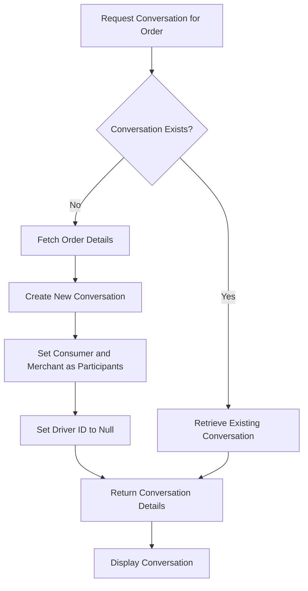
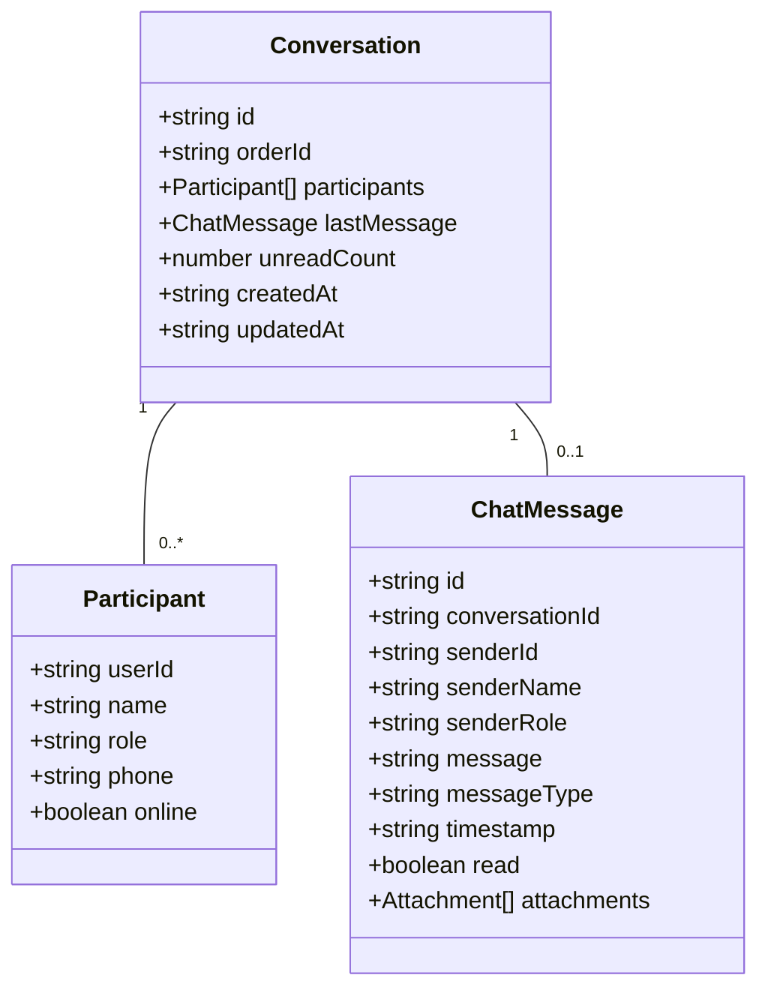
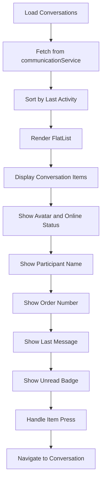
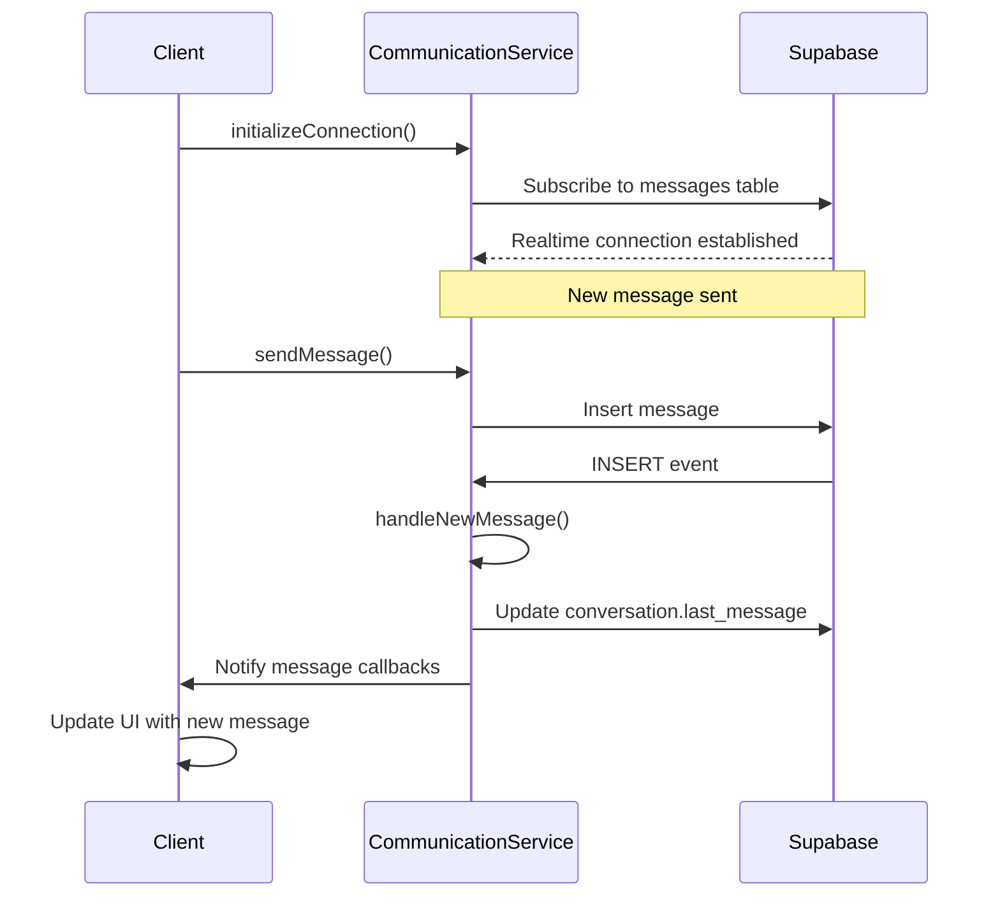
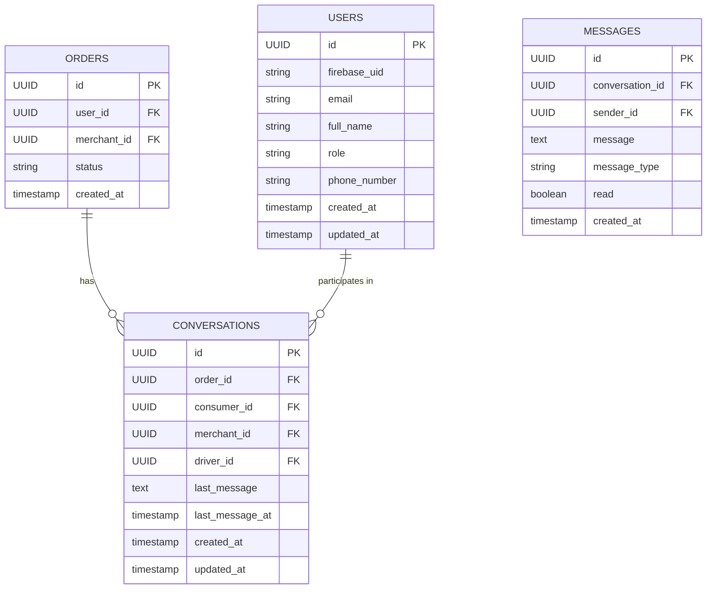

# Conversation Management

<cite>
**Referenced Files in This Document**   
- [communicationService.ts](file://services/communicationService.ts)
- [chat/index.tsx](file://app/chat/index.tsx)
- [chat/[conversationId].tsx](file://app/chat/[conversationId].tsx)
- [schema.sql](file://supabase/schema.sql)
- [types.ts](file://services/types.ts)
</cite>

## Table of Contents
1. [Introduction](#introduction)
2. [Conversation Creation and Retrieval](#conversation-creation-and-retrieval)
3. [Conversation Interface and Properties](#conversation-interface-and-properties)
4. [Conversations List Implementation](#conversations-list-implementation)
5. [Real-time Updates and Metadata Management](#real-time-updates-and-metadata-management)
6. [Order Integration and Participant Management](#order-integration-and-participant-management)
7. [Conversation Lifecycle Management](#conversation-lifecycle-management)
8. [Common Issues and Solutions](#common-issues-and-solutions)

## Introduction
The conversation management system in Brillprime-expo provides a comprehensive messaging solution that connects consumers, merchants, and drivers throughout the order lifecycle. Built on Supabase Realtime, the system enables seamless communication between all parties involved in an order, facilitating coordination, updates, and customer service. This documentation details the implementation of conversation creation, retrieval, organization, and lifecycle management within the application.

**Section sources**
- [communicationService.ts](file://services/communicationService.ts#L1-L676)
- [chat/index.tsx](file://app/chat/index.tsx#L1-L445)

## Conversation Creation and Retrieval
The conversation management system centers around the `getOrCreateConversation` method in the `communicationService.ts` file, which handles both the retrieval of existing conversations and the creation of new ones when needed. This method follows a systematic approach to ensure that conversations are properly linked to orders and participants.

When a user attempts to access a conversation for a specific order, the system first checks if a conversation already exists by querying the `conversations` table with the order ID. If a conversation is found, it retrieves the full conversation details by calling the `getConversations` method and finding the specific conversation by ID. This approach ensures that the conversation data is consistent with the current state of the system.

If no existing conversation is found, the system creates a new one by first fetching the order details to identify the participants. The conversation is then created with the consumer and merchant as initial participants, while the driver ID is set to null initially. This reflects the typical order lifecycle where a driver is assigned after the order is placed. The conversation creation process includes proper error handling and returns appropriate success or error responses.

**Diagram sources**
- [communicationService.ts](file://services/communicationService.ts#L294-L355)

**Section sources**
- [communicationService.ts](file://services/communicationService.ts#L294-L355)
- [chat/[conversationId].tsx](file://app/chat/[conversationId].tsx#L57-L69)

## Conversation Interface and Properties
The `Conversation` interface defined in `communicationService.ts` represents the structure of a conversation in the system. Each conversation has several key properties that define its state and metadata:

- **id**: A unique identifier for the conversation
- **orderId**: The ID of the associated order, establishing the link between conversation and order
- **participants**: An array of participant objects, each containing userId, name, role, phone, and online status
- **lastMessage**: The most recent message in the conversation, containing message content and metadata
- **unreadCount**: The number of unread messages for the current user
- **createdAt**: Timestamp when the conversation was created
- **updatedAt**: Timestamp when the conversation was last updated

The participants array is particularly important as it defines who can participate in the conversation. Each participant is identified by their role (consumer, merchant, or driver), which determines their permissions and access level within the conversation. The system automatically determines the current user's identity and displays them as "You" in the participant list for better user experience.

**Diagram sources**
- [communicationService.ts](file://services/communicationService.ts#L27-L41)
- [types.ts](file://services/types.ts#L3-L18)

**Section sources**
- [communicationService.ts](file://services/communicationService.ts#L27-L41)
- [types.ts](file://services/types.ts#L3-L18)

## Conversations List Implementation
The conversations list in `chat/index.tsx` displays all active conversations ordered by last activity, providing users with an organized view of their ongoing communications. The implementation uses a FlatList component to efficiently render the conversation items, with each conversation displayed as a card showing key information.

The list is populated by calling the `getConversations` method from the communication service, which retrieves all conversations where the current user is a participant. The conversations are automatically ordered by the `last_message_at` timestamp in descending order, ensuring that the most recently active conversations appear at the top of the list.

Each conversation item in the list displays several pieces of information:
- The participant's avatar with a color-coded background based on their role
- An online indicator for active participants
- The participant's name
- The order number associated with the conversation
- The last message content, with "You: " prefix for messages sent by the current user
- An unread message badge showing the count of unread messages

The list also includes pull-to-refresh functionality to allow users to manually refresh the conversation list when needed.

**Diagram sources**
- [chat/index.tsx](file://app/chat/index.tsx#L18-L283)

**Section sources**
- [chat/index.tsx](file://app/chat/index.tsx#L18-L283)
- [communicationService.ts](file://services/communicationService.ts#L164-L291)

## Real-time Updates and Metadata Management
The conversation system implements real-time updates through Supabase Realtime, ensuring that conversation metadata is always up-to-date across all clients. When a new message arrives, the system updates several pieces of metadata to reflect the current state of the conversation.

The `onMessage` subscription in the chat list component listens for new messages and updates the conversation list accordingly. When a new message is received, the system updates the conversation's last message, increments the unread count, and updates the last updated timestamp. This ensures that the conversation list always reflects the most current state, even when the user is not actively viewing the specific conversation.

When a user sends a message, the system updates the conversation's `last_message` and `last_message_at` fields in the database. This update is performed after the message is successfully sent, ensuring that the conversation metadata accurately reflects the latest activity. The system also handles marking messages as read when a user views a conversation, updating the read status of all messages from other participants.

**Diagram sources**
- [communicationService.ts](file://services/communicationService.ts#L66-L93)
- [chat/index.tsx](file://app/chat/index.tsx#L125-L138)

**Section sources**
- [communicationService.ts](file://services/communicationService.ts#L66-L93)
- [chat/index.tsx](file://app/chat/index.tsx#L125-L138)

## Order Integration and Participant Management
The conversation system is tightly integrated with the order management system, ensuring that conversations are properly linked to orders and participants are correctly determined based on user roles. When a conversation is created for an order, the system queries the `orders` table to identify the consumer and merchant associated with the order.

The database schema reflects this relationship through foreign key constraints in the `conversations` table, which includes references to the `orders` table as well as direct references to the `users` table for each participant role. This design allows for efficient querying of conversations by order ID or by participant ID.

Participants are determined based on their roles in the system: consumer, merchant, or driver. The system automatically includes the consumer and merchant as participants when a conversation is created, while the driver is added later when they are assigned to the order. This reflects the typical order lifecycle where the driver is not involved until after the order is placed and confirmed.

**Diagram sources**
- [schema.sql](file://supabase/schema.sql#L118-L129)
- [communicationService.ts](file://services/communicationService.ts#L316-L335)

**Section sources**
- [schema.sql](file://supabase/schema.sql#L118-L129)
- [communicationService.ts](file://services/communicationService.ts#L316-L335)

## Conversation Lifecycle Management
The conversation lifecycle is managed through a combination of automated processes and user actions. Conversations are created automatically when a user first attempts to communicate about an order, ensuring that a communication channel is always available when needed.

The system handles conversation deletion through the `deleteConversation` method, which removes the conversation from the database. This operation is irreversible and removes all messages associated with the conversation due to the cascade delete constraint defined in the database schema.

Conversation metadata is automatically updated throughout the lifecycle:
- When a new message is sent, the conversation's last message and timestamp are updated
- When a user views a conversation, messages from other participants are marked as read
- When a driver is assigned to an order, they are added as a participant to the existing conversation

The system also handles edge cases such as network failures through appropriate error handling and user feedback, ensuring a robust user experience even in challenging conditions.

**Section sources**
- [communicationService.ts](file://services/communicationService.ts#L616-L637)
- [schema.sql](file://supabase/schema.sql#L118-L129)

## Common Issues and Solutions
Several common issues can arise in conversation management, and the system implements specific solutions to address them:

**Duplicate Conversations**: The system prevents duplicate conversations by first checking if a conversation already exists for an order before creating a new one. The `getOrCreateConversation` method queries the database for an existing conversation with the same order ID, ensuring that only one conversation is created per order.

**Missing Participants**: When a driver is assigned to an order, the system needs to update the conversation to include the driver as a participant. This is handled by updating the `driver_id` field in the conversations table, which automatically adds the driver to the participant list.

**Real-time Sync Issues**: Network connectivity problems can disrupt real-time updates. The system implements proper error handling and fallback mechanisms, such as local optimistic updates when sending messages, which are then synchronized with the server when connectivity is restored.

**Unread Count Accuracy**: To ensure accurate unread counts, the system batches the calculation of unread messages for all conversations when loading the conversation list. This approach is more efficient than making individual queries for each conversation and ensures consistency across the user interface.

**Section sources**
- [communicationService.ts](file://services/communicationService.ts#L302-L314)
- [communicationService.ts](file://services/communicationService.ts#L231-L244)
- [chat/index.tsx](file://app/chat/index.tsx#L125-L138)