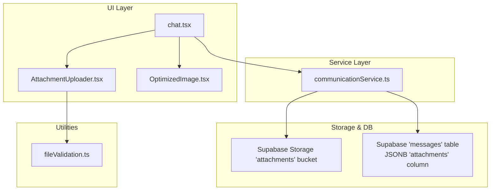
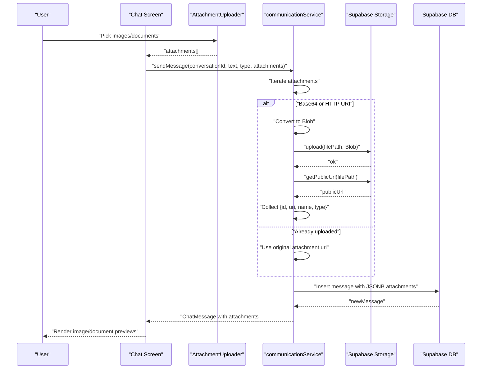
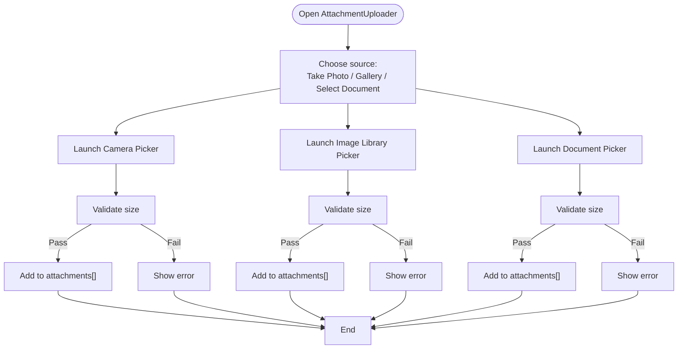
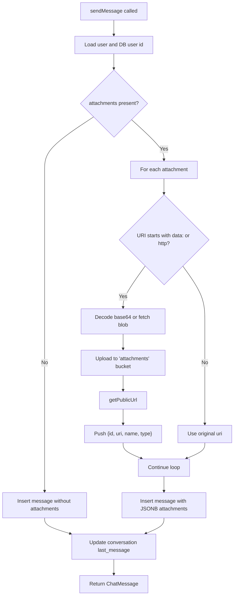
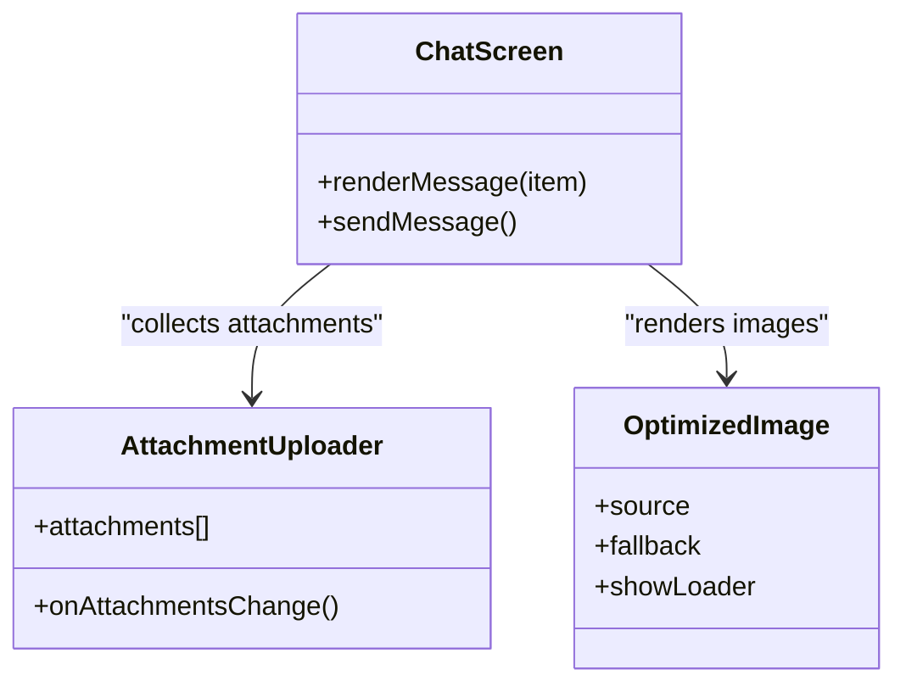
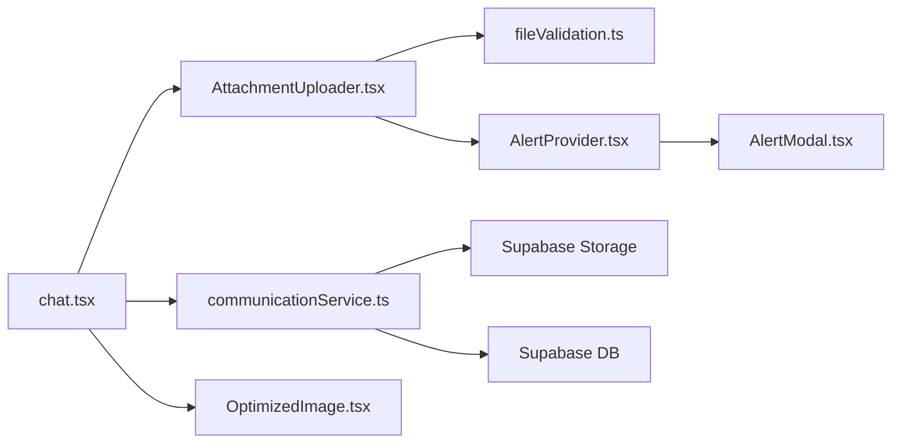

# Message Attachments

<cite>
**Referenced Files in This Document**
- [AttachmentUploader.tsx](file://components/AttachmentUploader.tsx)
- [communicationService.ts](file://services/communicationService.ts)
- [messages-attachments.sql](file://supabase/messages-attachments.sql)
- [fileValidation.ts](file://utils/fileValidation.ts)
- [storage-setup.sql](file://supabase/storage-setup.sql)
- [chat.tsx](file://app/chat/[conversationId].tsx)
- [OptimizedImage.tsx](file://components/OptimizedImage.tsx)
- [AlertProvider.tsx](file://components/AlertProvider.tsx)
- [AlertModal.tsx](file://components/AlertModal.tsx)
</cite>

## Table of Contents
1. [Introduction](#introduction)
2. [Project Structure](#project-structure)
3. [Core Components](#core-components)
4. [Architecture Overview](#architecture-overview)
5. [Detailed Component Analysis](#detailed-component-analysis)
6. [Dependency Analysis](#dependency-analysis)
7. [Performance Considerations](#performance-considerations)
8. [Troubleshooting Guide](#troubleshooting-guide)
9. [Conclusion](#conclusion)

## Introduction
This document explains the message attachment system in Brillprime-expo. It covers how users attach images and documents in the chat interface, how the AttachmentUploader component collects and validates attachments, how the communicationService uploads files to Supabase Storage, how the database schema stores attachment metadata, and how the UI renders images and documents in chat messages. It also provides guidance on handling failures and retry strategies.

## Project Structure
The message attachment feature spans several layers:
- UI: AttachmentUploader component and chat screen UI
- Services: communicationService orchestrates message sending and file uploads
- Utilities: fileValidation provides size/type checks
- Database: Supabase schema changes to support JSONB attachments
- Storage: Supabase storage bucket configuration for attachments

**Diagram sources**
- [AttachmentUploader.tsx](file://components/AttachmentUploader.tsx#L1-L434)
- [chat.tsx](file://app/chat/[conversationId].tsx#L1-L453)
- [communicationService.ts](file://services/communicationService.ts#L412-L547)
- [messages-attachments.sql](file://supabase/messages-attachments.sql#L1-L21)
- [storage-setup.sql](file://supabase/storage-setup.sql#L27-L47)
- [fileValidation.ts](file://utils/fileValidation.ts#L1-L99)
- [OptimizedImage.tsx](file://components/OptimizedImage.tsx#L1-L78)

**Section sources**
- [AttachmentUploader.tsx](file://components/AttachmentUploader.tsx#L1-L434)
- [communicationService.ts](file://services/communicationService.ts#L412-L547)
- [messages-attachments.sql](file://supabase/messages-attachments.sql#L1-L21)
- [storage-setup.sql](file://supabase/storage-setup.sql#L27-L47)
- [fileValidation.ts](file://utils/fileValidation.ts#L1-L99)
- [chat.tsx](file://app/chat/[conversationId].tsx#L1-L453)
- [OptimizedImage.tsx](file://components/OptimizedImage.tsx#L1-L78)

## Core Components
- AttachmentUploader: Collects images and documents, validates size/type, and emits attachment objects to the chat UI.
- communicationService.sendMessage: Uploads attachments to Supabase Storage, resolves public URLs, and persists message with JSONB attachments.
- Supabase schema: Adds JSONB column to messages and sets RLS policies for attachment visibility.
- Supabase storage: Creates the 'attachments' bucket with policies and limits.
- Chat UI: Renders images and documents inline with messages and displays attachment counts.

**Section sources**
- [AttachmentUploader.tsx](file://components/AttachmentUploader.tsx#L1-L434)
- [communicationService.ts](file://services/communicationService.ts#L412-L547)
- [messages-attachments.sql](file://supabase/messages-attachments.sql#L1-L21)
- [storage-setup.sql](file://supabase/storage-setup.sql#L27-L47)
- [chat.tsx](file://app/chat/[conversationId].tsx#L275-L327)

## Architecture Overview
The end-to-end flow for sending a message with attachments:
1. User selects images/documents via AttachmentUploader.
2. Chat screen composes an optimistic message and calls communicationService.sendMessage.
3. For each attachment:
   - If the URI is a data URL or HTTP URL, convert to Blob and upload to Supabase Storage 'attachments' bucket.
   - Retrieve the public URL and collect metadata (id, uri, name, type).
4. Persist the message to the 'messages' table with JSONB attachments.
5. Update conversation last_message and notify subscribers.
6. Chat UI renders images and documents inline.

**Diagram sources**
- [chat.tsx](file://app/chat/[conversationId].tsx#L131-L182)
- [communicationService.ts](file://services/communicationService.ts#L412-L547)
- [AttachmentUploader.tsx](file://components/AttachmentUploader.tsx#L1-L434)

## Detailed Component Analysis

### AttachmentUploader Component
Responsibilities:
- Capture images from camera/gallery and documents from device.
- On web, use hidden file inputs to read local files and convert to base64 URIs.
- Validate file size against configured maxFileSize.
- Enforce maxAttachments limit and allowedTypes.
- Emit Attachment objects to parent via onAttachmentsChange.

Key behaviors:
- Permissions: Requests camera and library permissions for native platforms.
- Validation: Rejects oversized files locally before upload.
- UI: Shows thumbnails for images and file-type icons for documents; allows removal.

**Diagram sources**
- [AttachmentUploader.tsx](file://components/AttachmentUploader.tsx#L94-L213)

**Section sources**
- [AttachmentUploader.tsx](file://components/AttachmentUploader.tsx#L1-L434)

### File Validation Utility
Provides:
- validateFileUpload: Checks size, MIME type, and extension against allowed lists.
- validateImageDimensions: Optional dimension check for images (skips on mobile environments).
- formatFileSize: Human-readable file size formatting.

These utilities help enforce constraints before upload and during selection.

**Section sources**
- [fileValidation.ts](file://utils/fileValidation.ts#L1-L99)

### Communication Service: Sending Messages with Attachments
Highlights:
- Converts base64 data URIs to Blobs and uploads to Supabase Storage 'attachments' bucket.
- Resolves public URLs and builds attachment metadata arrays.
- Persists message with JSONB attachments column.
- Updates conversation last_message and last_message_at.

Important implementation points:
- Base64 conversion: Splits data URL scheme and decodes bytes to construct a Blob.
- HTTP URL handling: Fetches the resource and converts to Blob.
- Bucket path: Uses a structured path under 'chat-attachments/' with conversation-scoped filenames.
- JSONB persistence: Stores an array of attachment objects with id, uri, name, type.

**Diagram sources**
- [communicationService.ts](file://services/communicationService.ts#L412-L547)

**Section sources**
- [communicationService.ts](file://services/communicationService.ts#L412-L547)

### Database Schema Changes
- Added JSONB column 'attachments' to 'messages' table with default empty array.
- Created GIN index on 'attachments' for efficient querying.
- Updated RLS policy to allow authenticated users who are conversation participants to view messages with attachments.
- Added comment describing the JSON structure stored in the column.

**Section sources**
- [messages-attachments.sql](file://supabase/messages-attachments.sql#L1-L21)

### Supabase Storage Setup
- Created 'attachments' bucket with public=true and configured file size limit and allowed MIME types.
- Defined RLS policies allowing authenticated users to insert/update/delete their own objects and enabling public SELECT access.

**Section sources**
- [storage-setup.sql](file://supabase/storage-setup.sql#L27-L47)
- [storage-setup.sql](file://supabase/storage-setup.sql#L91-L110)

### Chat UI: Rendering Attachments
- Displays images inline using Image with cover resize mode.
- Documents are rendered as a row with an icon and filename.
- Shows attachment count below the input field.
- Uses OptimizedImage for robust image loading with loader and fallback.

**Diagram sources**
- [chat.tsx](file://app/chat/[conversationId].tsx#L275-L327)
- [AttachmentUploader.tsx](file://components/AttachmentUploader.tsx#L1-L434)
- [OptimizedImage.tsx](file://components/OptimizedImage.tsx#L1-L78)

**Section sources**
- [chat.tsx](file://app/chat/[conversationId].tsx#L275-L327)
- [OptimizedImage.tsx](file://components/OptimizedImage.tsx#L1-L78)

## Dependency Analysis
- AttachmentUploader depends on:
  - Expo ImagePicker and DocumentPicker for native selection.
  - AlertProvider/AlertModal for user feedback.
  - fileValidation for client-side checks.
- communicationService depends on:
  - Supabase client for database and storage operations.
  - AuthService for user context.
  - Realtime channel for live updates.
- Chat UI depends on:
  - AttachmentUploader for attachment capture.
  - communicationService for sending and receiving messages.
  - OptimizedImage for rendering.

**Diagram sources**
- [AttachmentUploader.tsx](file://components/AttachmentUploader.tsx#L1-L434)
- [AlertProvider.tsx](file://components/AlertProvider.tsx#L1-L155)
- [AlertModal.tsx](file://components/AlertModal.tsx#L1-L253)
- [fileValidation.ts](file://utils/fileValidation.ts#L1-L99)
- [chat.tsx](file://app/chat/[conversationId].tsx#L1-L453)
- [communicationService.ts](file://services/communicationService.ts#L412-L547)
- [OptimizedImage.tsx](file://components/OptimizedImage.tsx#L1-L78)

**Section sources**
- [AttachmentUploader.tsx](file://components/AttachmentUploader.tsx#L1-L434)
- [AlertProvider.tsx](file://components/AlertProvider.tsx#L1-L155)
- [AlertModal.tsx](file://components/AlertModal.tsx#L1-L253)
- [fileValidation.ts](file://utils/fileValidation.ts#L1-L99)
- [chat.tsx](file://app/chat/[conversationId].tsx#L1-L453)
- [communicationService.ts](file://services/communicationService.ts#L412-L547)
- [OptimizedImage.tsx](file://components/OptimizedImage.tsx#L1-L78)

## Performance Considerations
- Client-side validation reduces unnecessary uploads and improves UX.
- Using a structured bucket path and consistent naming helps with cacheability and cleanup.
- JSONB indexing on messages.attachments supports fast filtering and querying when needed.
- OptimizedImage minimizes layout thrashing and improves perceived performance.

[No sources needed since this section provides general guidance]

## Troubleshooting Guide

Common issues and resolutions:
- Permission denied for camera/library:
  - Ensure camera and media library permissions are granted on native platforms.
  - AttachmentUploader requests permissions before launching pickers.
  - Reference: [AttachmentUploader.tsx](file://components/AttachmentUploader.tsx#L54-L68)

- File too large:
  - AttachmentUploader enforces maxFileSize locally; adjust maxFileSize prop if needed.
  - Supabase storage bucket also enforces file size limits.
  - References:
    - [AttachmentUploader.tsx](file://components/AttachmentUploader.tsx#L70-L76)
    - [storage-setup.sql](file://supabase/storage-setup.sql#L27-L47)

- Unsupported file type or extension:
  - Use fileValidation to check MIME type and extension before upload.
  - Reference: [fileValidation.ts](file://utils/fileValidation.ts#L1-L99)

- Upload fails or partial attachments:
  - communicationService continues processing remaining attachments on individual errors and still inserts the message with available attachments.
  - If a message fails to send, the UI removes the optimistic message.
  - References:
    - [communicationService.ts](file://services/communicationService.ts#L439-L492)
    - [chat.tsx](file://app/chat/[conversationId].tsx#L177-L182)

- Images not displaying:
  - Verify public URL resolution and bucket policies.
  - Use OptimizedImage for robust loading and fallback.
  - References:
    - [communicationService.ts](file://services/communicationService.ts#L474-L483)
    - [OptimizedImage.tsx](file://components/OptimizedImage.tsx#L1-L78)

- Retry mechanism:
  - No built-in automatic retry in the current implementation.
  - Recommended approach: On failure, surface a retry action to resend the message with the same attachments.

**Section sources**
- [AttachmentUploader.tsx](file://components/AttachmentUploader.tsx#L54-L76)
- [fileValidation.ts](file://utils/fileValidation.ts#L1-L99)
- [storage-setup.sql](file://supabase/storage-setup.sql#L27-L47)
- [communicationService.ts](file://services/communicationService.ts#L439-L492)
- [chat.tsx](file://app/chat/[conversationId].tsx#L177-L182)
- [OptimizedImage.tsx](file://components/OptimizedImage.tsx#L1-L78)

## Conclusion
The message attachment system integrates a robust UI component, client-side validation, and server-side storage and persistence. AttachmentUploader captures and validates files, communicationService uploads to Supabase Storage and persists JSONB metadata, and the chat UI renders images and documents seamlessly. While there is no built-in retry, the design allows for graceful handling of partial failures and provides clear extension points for adding retry logic.