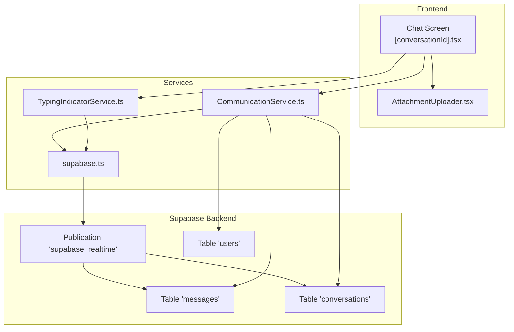
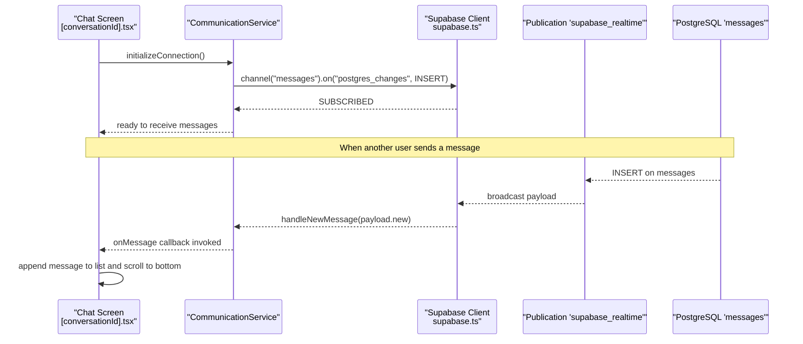
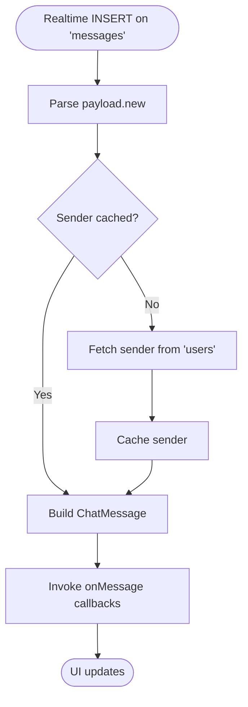
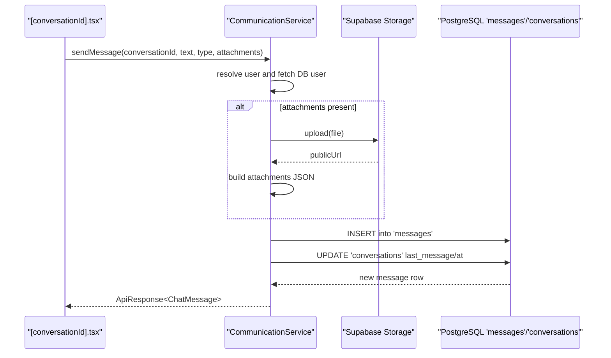
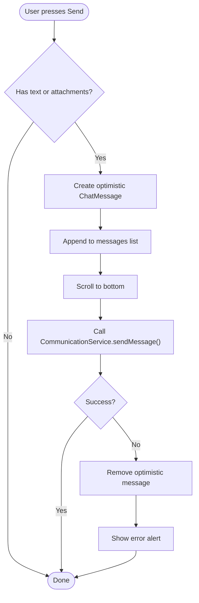
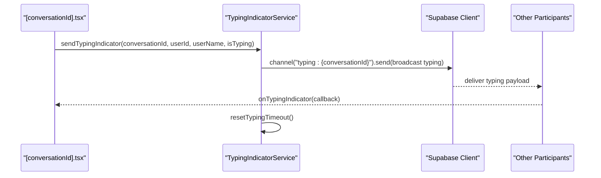
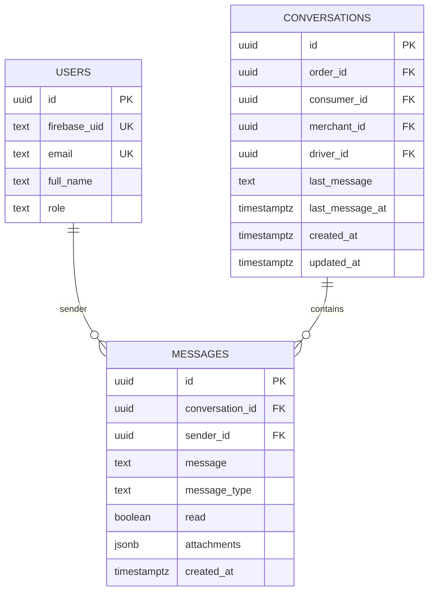
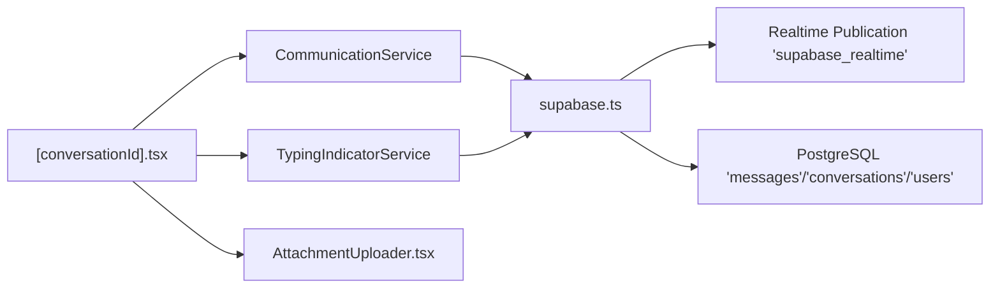

# Real-Time Messaging

<cite>
**Referenced Files in This Document**
- [communicationService.ts](file://services/communicationService.ts)
- [typingIndicatorService.ts](file://services/typingIndicatorService.ts)
- [supabase.ts](file://config/supabase.ts)
- [schema.sql](file://supabase/schema.sql)
- [realtime.sql](file://supabase/realtime.sql)
- [messages-attachments.sql](file://supabase/messages-attachments.sql)
- [AttachmentUploader.tsx](file://components/AttachmentUploader.tsx)
- [[conversationId].tsx](file://app/chat/[conversationId].tsx)
</cite>

## Table of Contents
1. [Introduction](#introduction)
2. [Project Structure](#project-structure)
3. [Core Components](#core-components)
4. [Architecture Overview](#architecture-overview)
5. [Detailed Component Analysis](#detailed-component-analysis)
6. [Dependency Analysis](#dependency-analysis)
7. [Performance Considerations](#performance-considerations)
8. [Troubleshooting Guide](#troubleshooting-guide)
9. [Conclusion](#conclusion)

## Introduction
This document explains the real-time messaging implementation in Brillprime-expo. It focuses on how Supabase Realtime powers instant message delivery through PostgreSQL change subscriptions on the messages table, how the communicationService orchestrates sending and receiving messages, and how the UI achieves optimistic updates and synchronized read status. It also covers database storage patterns for messages and attachments, cross-device synchronization, and error handling strategies.

## Project Structure
The messaging feature spans several layers:
- Frontend screens and UI logic for chat rendering and input
- Services for communication, typing indicators, and Supabase client configuration
- Supabase schema and policies enabling real-time and secure access



**Diagram sources**
- [communicationService.ts](file://services/communicationService.ts#L60-L100)
- [typingIndicatorService.ts](file://services/typingIndicatorService.ts#L18-L41)
- [supabase.ts](file://config/supabase.ts#L67-L118)
- [realtime.sql](file://supabase/realtime.sql#L1-L18)
- [schema.sql](file://supabase/schema.sql#L118-L141)

**Section sources**
- [communicationService.ts](file://services/communicationService.ts#L60-L100)
- [typingIndicatorService.ts](file://services/typingIndicatorService.ts#L18-L41)
- [supabase.ts](file://config/supabase.ts#L67-L118)
- [realtime.sql](file://supabase/realtime.sql#L1-L18)
- [schema.sql](file://supabase/schema.sql#L118-L141)

## Core Components
- CommunicationService: Initializes Supabase Realtime, subscribes to messages table changes, sends messages with optional attachments, loads conversations/messages, marks messages as read, and manages lifecycle.
- TypingIndicatorService: Manages typing indicators via a dedicated Realtime channel per conversation.
- Supabase client configuration: Validates environment variables and sets up Realtime broadcast error handling.
- Supabase schema and policies: Defines tables, indexes, publication grants, and RLS policies for secure access.

**Section sources**
- [communicationService.ts](file://services/communicationService.ts#L60-L100)
- [typingIndicatorService.ts](file://services/typingIndicatorService.ts#L18-L41)
- [supabase.ts](file://config/supabase.ts#L67-L118)
- [schema.sql](file://supabase/schema.sql#L118-L141)
- [realtime.sql](file://supabase/realtime.sql#L1-L18)
- [messages-attachments.sql](file://supabase/messages-attachments.sql#L1-L21)

## Architecture Overview
Supabase Realtime listens for INSERT events on the messages table and pushes them to subscribed clients. The frontend receives these events and updates the UI immediately. The CommunicationService augments received rows with sender metadata and dispatches normalized messages to subscribers. Outbound messages are inserted into the database and broadcast to other clients. Attachments are stored in Supabase Storage and referenced by a JSON field in the messages table.



**Diagram sources**
- [communicationService.ts](file://services/communicationService.ts#L67-L99)
- [supabase.ts](file://config/supabase.ts#L67-L118)
- [realtime.sql](file://supabase/realtime.sql#L1-L18)
- [schema.sql](file://supabase/schema.sql#L132-L141)

## Detailed Component Analysis

### CommunicationService
Responsibilities:
- Realtime initialization and subscription to messages INSERT events
- Normalization of incoming messages with sender metadata
- Sending messages with optional attachments to Supabase Storage and database
- Loading conversations and messages
- Marking messages as read
- Lifecycle management (disconnect)

Key implementation patterns:
- Realtime subscription using Supabase Realtime’s postgres_changes event on the messages table.
- Caching of sender profiles to minimize per-message database lookups.
- Attachment upload pipeline to Supabase Storage with subsequent JSON metadata insertion.
- Conversation last_message update to reflect the latest activity.

```mermaid
classDiagram
class CommunicationService {
-realtimeChannel
-messageCallbacks
-callCallbacks
-userCache
+initializeConnection() void
-handleNewMessage(messageData) Promise~void~
+onMessage(callback) () => void
+onCall(callback) () => void
+getConversations() ApiResponse~Conversation[]~
+getOrCreateConversation(orderId) ApiResponse~Conversation~
+getMessages(conversationId, limit, offset) ApiResponse~ChatMessage[]~
+sendMessage(conversationId, message, messageType, attachments) ApiResponse~ChatMessage~
+markMessagesAsRead(conversationId) ApiResponse~{ message }~
+markConversationAsRead(conversationId) ApiResponse~{ message }~
+deleteConversation(conversationId) ApiResponse~{ message }~
+disconnect() void
}
class ChatMessage {
+string id
+string conversationId
+string senderId
+string senderName
+string senderRole
+string message
+string messageType
+string timestamp
+boolean read
+attachments?
}
class Conversation {
+string id
+string orderId
+participants[]
+lastMessage?
+number unreadCount
+string createdAt
+string updatedAt
}
CommunicationService --> ChatMessage : "emits"
CommunicationService --> Conversation : "returns"
```

**Diagram sources**
- [communicationService.ts](file://services/communicationService.ts#L60-L100)
- [communicationService.ts](file://services/communicationService.ts#L8-L51)

**Section sources**
- [communicationService.ts](file://services/communicationService.ts#L67-L99)
- [communicationService.ts](file://services/communicationService.ts#L101-L140)
- [communicationService.ts](file://services/communicationService.ts#L142-L162)
- [communicationService.ts](file://services/communicationService.ts#L165-L291)
- [communicationService.ts](file://services/communicationService.ts#L294-L355)
- [communicationService.ts](file://services/communicationService.ts#L358-L410)
- [communicationService.ts](file://services/communicationService.ts#L412-L547)
- [communicationService.ts](file://services/communicationService.ts#L549-L588)
- [communicationService.ts](file://services/communicationService.ts#L616-L637)
- [communicationService.ts](file://services/communicationService.ts#L666-L674)

### ChatMessage and Conversation Interfaces
- ChatMessage: Core message entity with identifiers, sender info, content, type, timestamp, read flag, and optional attachments array.
- Conversation: Represents a chat thread with participants, last message preview, unread count, and timestamps.

Properties and semantics:
- messageType supports text, image, and location variants.
- Attachments metadata is stored as JSON in the messages table and parsed into typed arrays.
- Unread count is computed server-side via a query counting unread messages per conversation.

**Section sources**
- [communicationService.ts](file://services/communicationService.ts#L8-L51)
- [communicationService.ts](file://services/communicationService.ts#L294-L355)
- [communicationService.ts](file://services/communicationService.ts#L358-L410)
- [messages-attachments.sql](file://supabase/messages-attachments.sql#L1-L21)
- [schema.sql](file://supabase/schema.sql#L118-L141)

### Realtime Channel and Message Delivery
- Realtime channel name: "messages".
- Event type: postgres_changes with INSERT on the public schema and messages table.
- Payload normalization: Sender metadata is fetched and cached; message is emitted to subscribers.



**Diagram sources**
- [communicationService.ts](file://services/communicationService.ts#L67-L99)
- [communicationService.ts](file://services/communicationService.ts#L101-L140)

**Section sources**
- [communicationService.ts](file://services/communicationService.ts#L67-L99)
- [communicationService.ts](file://services/communicationService.ts#L101-L140)

### Message Sending Pipeline
- Authentication: Resolves current user and maps to database user record.
- Attachment handling: Uploads to Supabase Storage when needed and constructs JSON metadata.
- Database insert: Inserts message row with message_type, read=false, and optional attachments JSON.
- Last message update: Updates conversation last_message and last_message_at for UI freshness.



**Diagram sources**
- [communicationService.ts](file://services/communicationService.ts#L412-L547)
- [messages-attachments.sql](file://supabase/messages-attachments.sql#L1-L21)
- [schema.sql](file://supabase/schema.sql#L118-L141)

**Section sources**
- [communicationService.ts](file://services/communicationService.ts#L412-L547)
- [messages-attachments.sql](file://supabase/messages-attachments.sql#L1-L21)

### Optimistic UI Updates in [conversationId].tsx
- Pre-send state: Append a temporary optimistic message to the UI list with a local id and pending state.
- Scroll behavior: Auto-scroll to bottom after appending.
- Failure handling: If backend fails, remove the optimistic message and alert the user.



**Diagram sources**
- [[conversationId].tsx](file://app/chat/[conversationId].tsx#L131-L190)

**Section sources**
- [[conversationId].tsx](file://app/chat/[conversationId].tsx#L131-L190)

### Typing Indicators
- Dedicated Realtime channel per conversation named with a prefix and conversation id.
- Broadcasts typing events with user id, name, and isTyping flag.
- Automatic timeout to stop typing after a period.



**Diagram sources**
- [typingIndicatorService.ts](file://services/typingIndicatorService.ts#L18-L41)
- [typingIndicatorService.ts](file://services/typingIndicatorService.ts#L46-L78)
- [typingIndicatorService.ts](file://services/typingIndicatorService.ts#L80-L104)
- [typingIndicatorService.ts](file://services/typingIndicatorService.ts#L106-L144)

**Section sources**
- [typingIndicatorService.ts](file://services/typingIndicatorService.ts#L18-L41)
- [typingIndicatorService.ts](file://services/typingIndicatorService.ts#L46-L78)
- [typingIndicatorService.ts](file://services/typingIndicatorService.ts#L80-L104)
- [typingIndicatorService.ts](file://services/typingIndicatorService.ts#L106-L144)
- [[conversationId].tsx](file://app/chat/[conversationId].tsx#L90-L129)

### Database Storage Patterns
- messages table: UUID primary key, foreign keys to conversations and users, message_type enum, read flag, created_at, and optional attachments JSONB.
- conversations table: Tracks order_id and participant ids, plus last_message and last_message_at for UI.
- Indexes: messages(conversation_id) and messages(attachments) GIN for efficient queries.
- Policies: RLS policy ensures users can only view message attachments if they participate in the conversation.



**Diagram sources**
- [schema.sql](file://supabase/schema.sql#L118-L141)
- [messages-attachments.sql](file://supabase/messages-attachments.sql#L1-L21)

**Section sources**
- [schema.sql](file://supabase/schema.sql#L118-L141)
- [messages-attachments.sql](file://supabase/messages-attachments.sql#L1-L21)

### Cross-Device Synchronization and Read Status
- Cross-device: Realtime subscriptions ensure all devices connected to the same conversation receive the same INSERT events and updates.
- Read status: markMessagesAsRead updates all messages in a conversation to read for other participants, excluding the current user’s own messages.

**Section sources**
- [communicationService.ts](file://services/communicationService.ts#L549-L588)
- [communicationService.ts](file://services/communicationService.ts#L612-L614)

### Error Handling for Failed Deliveries
- Realtime broadcast error suppression: Known constraint-related messages are logged silently to avoid noisy UI feedback.
- Frontend optimistic rollback: On send failure, the optimistic message is removed and the user is alerted.
- Backend error propagation: API responses include success/error fields for callers to handle failures gracefully.

**Section sources**
- [supabase.ts](file://config/supabase.ts#L98-L117)
- [[conversationId].tsx](file://app/chat/[conversationId].tsx#L170-L188)
- [communicationService.ts](file://services/communicationService.ts#L412-L547)

## Dependency Analysis
- CommunicationService depends on:
  - Supabase client for Realtime and database operations
  - authService for current user resolution
  - Supabase Storage for attachments
- TypingIndicatorService depends on:
  - Supabase client for Realtime channels
- UI depends on:
  - CommunicationService for data and events
  - TypingIndicatorService for typing indicators
  - AttachmentUploader for composing attachments



**Diagram sources**
- [communicationService.ts](file://services/communicationService.ts#L60-L100)
- [typingIndicatorService.ts](file://services/typingIndicatorService.ts#L18-L41)
- [supabase.ts](file://config/supabase.ts#L67-L118)
- [realtime.sql](file://supabase/realtime.sql#L1-L18)
- [schema.sql](file://supabase/schema.sql#L118-L141)

**Section sources**
- [communicationService.ts](file://services/communicationService.ts#L60-L100)
- [typingIndicatorService.ts](file://services/typingIndicatorService.ts#L18-L41)
- [supabase.ts](file://config/supabase.ts#L67-L118)
- [realtime.sql](file://supabase/realtime.sql#L1-L18)
- [schema.sql](file://supabase/schema.sql#L118-L141)

## Performance Considerations
- Realtime efficiency: Using postgres_changes on messages avoids polling and reduces latency.
- Sender caching: User lookup is cached per message to reduce N+1 queries.
- Batch operations: Conversation loading batches participant lookups and unread counts to minimize round trips.
- Indexing: Index on messages(conversation_id) and GIN index on messages(attachments) improve query performance.
- Attachment uploads: Base64 conversion and blob creation occur before upload; consider streaming large files if needed.

[No sources needed since this section provides general guidance]

## Troubleshooting Guide
Common issues and solutions:
- Network interruptions:
  - Realtime reconnection: The Supabase client handles session persistence; ensure auto-refresh is enabled.
  - UI resilience: The chat screen initializes Realtime on mount and disconnects on unmount.
- Invalid Supabase configuration:
  - Environment variables must be set; the client validates URL and key format and logs guidance.
- Broadcast errors:
  - Known constraint messages are suppressed to avoid user-facing noise; unexpected errors are still logged.
- Attachment upload failures:
  - The service continues processing other attachments and logs errors; UI alerts the user and removes optimistic message on failure.
- Read status not updating:
  - Ensure markMessagesAsRead is called when the conversation becomes active; verify the current user id mapping.

**Section sources**
- [supabase.ts](file://config/supabase.ts#L67-L118)
- [communicationService.ts](file://services/communicationService.ts#L412-L547)
- [communicationService.ts](file://services/communicationService.ts#L549-L588)
- [[conversationId].tsx](file://app/chat/[conversationId].tsx#L170-L188)

## Conclusion
Brillprime-expo’s messaging system leverages Supabase Realtime to achieve near-instantaneous message delivery and a responsive UI. CommunicationService centralizes database and Realtime operations, while [conversationId].tsx implements optimistic updates and robust error handling. The schema and policies ensure secure, performant access to messages and attachments, and cross-device synchronization is achieved through shared Realtime subscriptions.