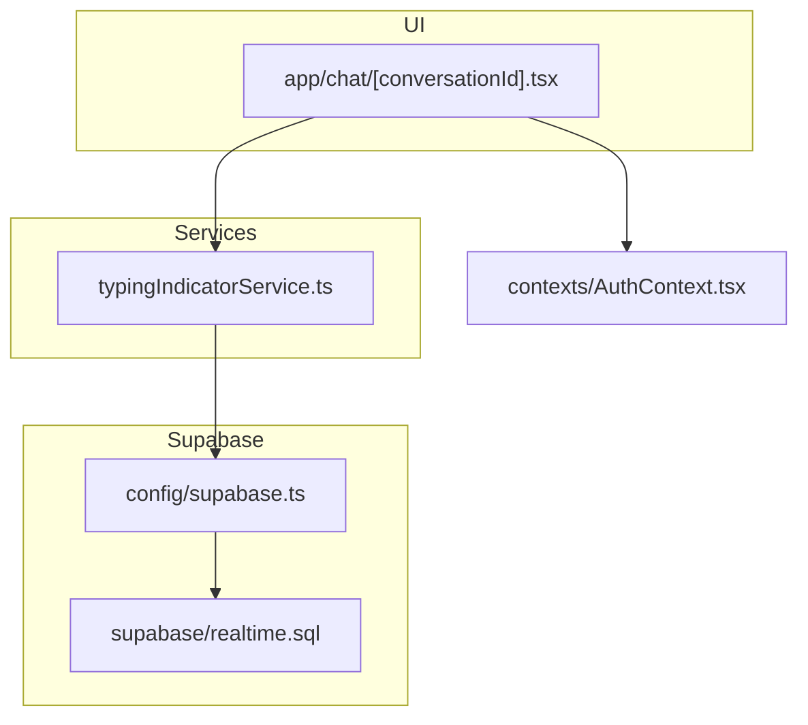
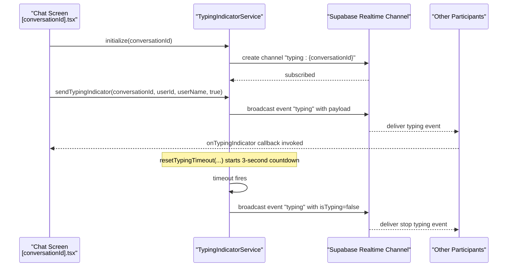
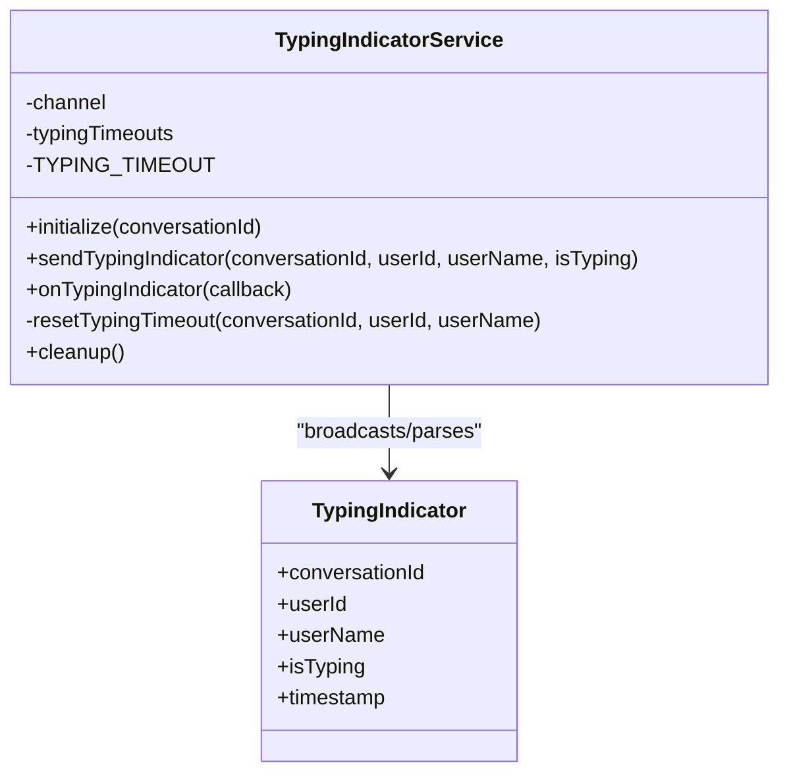
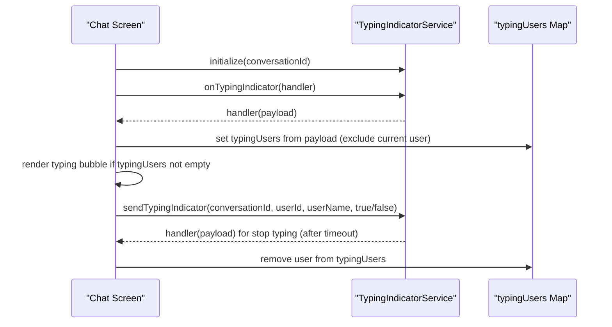
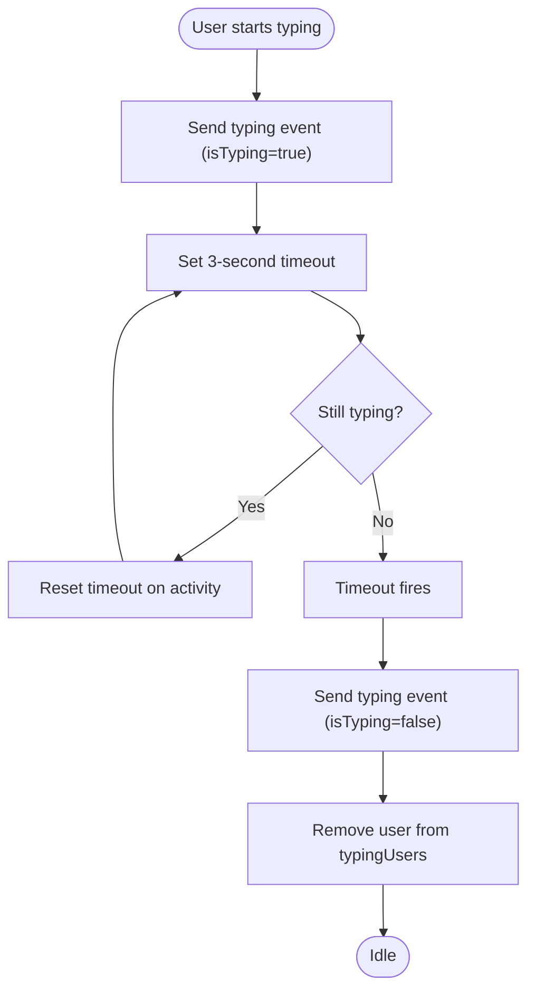
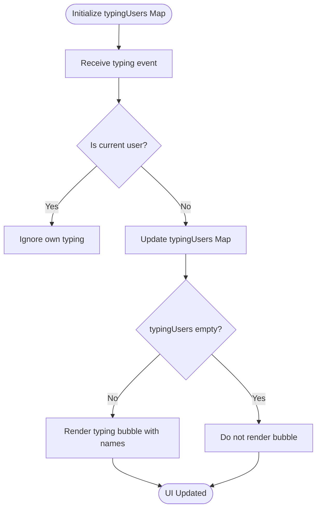
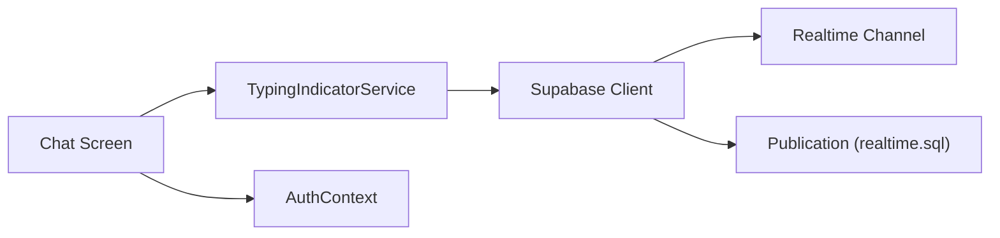

# Typing Indicators

<cite>
**Referenced Files in This Document**
- [typingIndicatorService.ts](file://services/typingIndicatorService.ts)
- [conversationId].tsx](file://app/chat/[conversationId].tsx)
- [supabase.ts](file://config/supabase.ts)
- [realtime.sql](file://supabase/realtime.sql)
- [AuthContext.tsx](file://contexts/AuthContext.tsx)
</cite>

## Table of Contents
1. [Introduction](#introduction)
2. [Project Structure](#project-structure)
3. [Core Components](#core-components)
4. [Architecture Overview](#architecture-overview)
5. [Detailed Component Analysis](#detailed-component-analysis)
6. [Dependency Analysis](#dependency-analysis)
7. [Performance Considerations](#performance-considerations)
8. [Troubleshooting Guide](#troubleshooting-guide)
9. [Conclusion](#conclusion)

## Introduction
This document explains the typing indicator feature in Brillprime-expo. It covers how the typingIndicatorService uses Supabase Realtime broadcast to notify participants when others are composing messages, the TypingIndicator interface and its properties, the sendTypingIndicator method and its automatic timeout behavior, and how the chat interface renders the animated typing bubble with participant names. It also provides practical guidance for handling stale typing states and cleaning up timeouts and channel subscriptions.

## Project Structure
The typing indicator feature spans two primary areas:
- A service that manages Supabase Realtime channels and broadcasts typing events
- A chat screen that subscribes to typing events and renders the animated typing bubble

**Diagram sources**
- [typingIndicatorService.ts](file://services/typingIndicatorService.ts#L1-L147)
- [conversationId].tsx](file://app/chat/[conversationId].tsx#L1-L453)
- [supabase.ts](file://config/supabase.ts#L68-L120)
- [realtime.sql](file://supabase/realtime.sql#L1-L33)
- [AuthContext.tsx](file://contexts/AuthContext.tsx#L1-L149)

**Section sources**
- [typingIndicatorService.ts](file://services/typingIndicatorService.ts#L1-L147)
- [conversationId].tsx](file://app/chat/[conversationId].tsx#L1-L453)
- [supabase.ts](file://config/supabase.ts#L68-L120)
- [realtime.sql](file://supabase/realtime.sql#L1-L33)
- [AuthContext.tsx](file://contexts/AuthContext.tsx#L1-L149)

## Core Components
- TypingIndicator interface: Defines the shape of typing events broadcast over Supabase Realtime.
- TypingIndicatorService: Manages Supabase Realtime channels, broadcasting typing status, listening for typing events, and managing automatic timeouts.
- Chat Screen ([conversationId].tsx): Initializes the typing indicator service, subscribes to typing events, and renders the animated typing bubble.

Key responsibilities:
- TypingIndicatorService: initialize, sendTypingIndicator, onTypingIndicator, resetTypingTimeout, cleanup
- Chat Screen: subscribe to typing events, update typingUsers state, render typing bubble, manage local typing state and timeouts

**Section sources**
- [typingIndicatorService.ts](file://services/typingIndicatorService.ts#L5-L11)
- [typingIndicatorService.ts](file://services/typingIndicatorService.ts#L21-L37)
- [typingIndicatorService.ts](file://services/typingIndicatorService.ts#L46-L78)
- [typingIndicatorService.ts](file://services/typingIndicatorService.ts#L83-L104)
- [typingIndicatorService.ts](file://services/typingIndicatorService.ts#L109-L128)
- [typingIndicatorService.ts](file://services/typingIndicatorService.ts#L133-L144)
- [conversationId].tsx](file://app/chat/[conversationId].tsx#L104-L125)
- [conversationId].tsx](file://app/chat/[conversationId].tsx#L231-L268)
- [conversationId].tsx](file://app/chat/[conversationId].tsx#L374-L388)

## Architecture Overview
The typing indicator architecture uses Supabase Realtime broadcast channels scoped per conversation. Each participant’s device sends a typing event when they start typing and automatically stops typing after a short timeout. Other participants’ devices receive these events and update the UI accordingly.

**Diagram sources**
- [typingIndicatorService.ts](file://services/typingIndicatorService.ts#L21-L37)
- [typingIndicatorService.ts](file://services/typingIndicatorService.ts#L46-L78)
- [typingIndicatorService.ts](file://services/typingIndicatorService.ts#L83-L104)
- [typingIndicatorService.ts](file://services/typingIndicatorService.ts#L109-L128)
- [conversationId].tsx](file://app/chat/[conversationId].tsx#L104-L125)

## Detailed Component Analysis

### TypingIndicator Interface
The interface defines the structure of typing events:
- conversationId: identifies the conversation
- userId: identifier of the typing user
- userName: display name of the typing user
- isTyping: whether the user is currently typing
- timestamp: ISO timestamp of the event

Implementation note: The service sets timestamp on the fly when sending events.

**Section sources**
- [typingIndicatorService.ts](file://services/typingIndicatorService.ts#L5-L11)
- [typingIndicatorService.ts](file://services/typingIndicatorService.ts#L57-L63)

### TypingIndicatorService
Responsibilities:
- initialize(conversationId): Creates a Supabase Realtime channel named “typing:{conversationId}” with broadcast enabled for self and presence configured.
- sendTypingIndicator(conversationId, userId, userName, isTyping): Broadcasts a typing event payload and schedules an automatic stop after a 3-second timeout when isTyping is true.
- onTypingIndicator(callback): Subscribes to broadcast events named “typing” and invokes the callback with the received payload.
- resetTypingTimeout(conversationId, userId, userName): Clears any existing timeout for the user and sets a new 3-second timeout that sends isTyping=false.
- cleanup(): Clears all pending timeouts and unsubscribes from the channel.

Important behaviors:
- Broadcast configuration allows the sender to receive their own events (self: true).
- Presence is keyed by conversationId to scope users.
- Automatic stop ensures typing indicators do not remain stuck.

**Diagram sources**
- [typingIndicatorService.ts](file://services/typingIndicatorService.ts#L13-L144)
- [typingIndicatorService.ts](file://services/typingIndicatorService.ts#L5-L11)

**Section sources**
- [typingIndicatorService.ts](file://services/typingIndicatorService.ts#L21-L37)
- [typingIndicatorService.ts](file://services/typingIndicatorService.ts#L46-L78)
- [typingIndicatorService.ts](file://services/typingIndicatorService.ts#L83-L104)
- [typingIndicatorService.ts](file://services/typingIndicatorService.ts#L109-L128)
- [typingIndicatorService.ts](file://services/typingIndicatorService.ts#L133-L144)

### Chat Screen Integration ([conversationId].tsx)
Responsibilities:
- Initialize typing indicator service with the current conversationId.
- Subscribe to typing events and update typingUsers state (excluding the current user).
- Render the animated typing bubble when there are typing participants.
- Manage local typing state and a separate timeout to stop typing after inactivity.

Key integration points:
- Initialization and subscription: initialize typing service and listen for typing events.
- Broadcasting: send typing events when the user starts/stops typing.
- Rendering: display animated typing bubble with participant names.

**Diagram sources**
- [conversationId].tsx](file://app/chat/[conversationId].tsx#L104-L125)
- [conversationId].tsx](file://app/chat/[conversationId].tsx#L231-L268)
- [conversationId].tsx](file://app/chat/[conversationId].tsx#L374-L388)
- [typingIndicatorService.ts](file://services/typingIndicatorService.ts#L83-L104)

**Section sources**
- [conversationId].tsx](file://app/chat/[conversationId].tsx#L104-L125)
- [conversationId].tsx](file://app/chat/[conversationId].tsx#L231-L268)
- [conversationId].tsx](file://app/chat/[conversationId].tsx#L374-L388)

### Automatic Timeout Mechanism
The service enforces a 3-second automatic stop for typing indicators:
- When isTyping=true is sent, resetTypingTimeout creates a NodeJS timeout keyed by “conversationId-userId”.
- On timeout, the service sends isTyping=false and removes the timeout from storage.
- The chat screen also maintains a local 2-second timeout to stop typing when the user pauses typing, complementing the service’s 3-second policy.

**Diagram sources**
- [typingIndicatorService.ts](file://services/typingIndicatorService.ts#L109-L128)
- [typingIndicatorService.ts](file://services/typingIndicatorService.ts#L122-L124)
- [conversationId].tsx](file://app/chat/[conversationId].tsx#L257-L267)

**Section sources**
- [typingIndicatorService.ts](file://services/typingIndicatorService.ts#L109-L128)
- [conversationId].tsx](file://app/chat/[conversationId].tsx#L257-L267)

### UI Rendering of Typing Bubble
The chat screen renders a typing bubble when there are typing participants:
- Uses a Map keyed by userId to track typing participants and values as usernames.
- Displays a list of names joined by commas and pluralization (“is/are”) along with animated dots.
- Styles define the bubble layout, dot animation delays, and responsive sizing.

**Diagram sources**
- [conversationId].tsx](file://app/chat/[conversationId].tsx#L106-L119)
- [conversationId].tsx](file://app/chat/[conversationId].tsx#L374-L388)
- [conversationId].tsx](file://app/chat/[conversationId].tsx#L630-L669)

**Section sources**
- [conversationId].tsx](file://app/chat/[conversationId].tsx#L106-L119)
- [conversationId].tsx](file://app/chat/[conversationId].tsx#L374-L388)
- [conversationId].tsx](file://app/chat/[conversationId].tsx#L630-L669)

## Dependency Analysis
- Supabase Realtime: The service relies on Supabase Realtime channels and broadcast events. The client is configured globally and includes a wrapper around channel.subscribe to handle known constraint errors.
- Realtime publication: The database script enables real-time for relevant tables, ensuring the client can subscribe to changes and broadcasts.
- Authentication context: The chat screen reads user identity from AuthContext to exclude the current user from typing bubbles and to populate typing event metadata.

**Diagram sources**
- [typingIndicatorService.ts](file://services/typingIndicatorService.ts#L21-L37)
- [supabase.ts](file://config/supabase.ts#L68-L120)
- [realtime.sql](file://supabase/realtime.sql#L1-L33)
- [AuthContext.tsx](file://contexts/AuthContext.tsx#L1-L149)
- [conversationId].tsx](file://app/chat/[conversationId].tsx#L104-L125)

**Section sources**
- [supabase.ts](file://config/supabase.ts#L68-L120)
- [realtime.sql](file://supabase/realtime.sql#L1-L33)
- [AuthContext.tsx](file://contexts/AuthContext.tsx#L1-L149)

## Performance Considerations
- Channel scoping: Channels are conversation-scoped (“typing:{conversationId}”), minimizing cross-conversation traffic.
- Broadcast self: Enabling broadcast.self ensures the sender receives their own typing events, simplifying UI state management.
- Presence: Presence keyed by conversationId helps track participants without global presence overhead.
- Local timers: The chat screen maintains a separate local timeout to complement the service’s 3-second stop, reducing perceived latency for UI updates.

[No sources needed since this section provides general guidance]

## Troubleshooting Guide
Common issues and solutions:
- Stale typing states
  - Symptom: Typing bubble remains visible after the other party stopped typing.
  - Cause: Missed stop typing event or lingering timeout.
  - Solution: Ensure cleanup is called when leaving the screen and that the service’s resetTypingTimeout clears previous timeouts before setting new ones. Verify the chat screen’s local timeout clears and resets on user input.

- Duplicate typing entries
  - Symptom: Multiple entries for the same user in typingUsers.
  - Cause: Missing deduplication or lack of user filtering.
  - Solution: The chat screen filters out the current user and uses a Map keyed by userId to prevent duplicates.

- Channel not initialized
  - Symptom: onTypingIndicator warns “Channel not initialized.”
  - Cause: Attempting to listen before initialization.
  - Solution: Call initialize(conversationId) before subscribing to typing events.

- Memory leaks from timers
  - Symptom: Timers accumulate across navigation.
  - Solution: Clear all timeouts in cleanup and ensure the chat screen clears its local timeout on unmount.

- Subscription cleanup
  - Symptom: Receiving typing events after leaving the conversation.
  - Solution: Return and call the unsubscribe function from onTypingIndicator and call typingIndicatorService.cleanup() on unmount.

Concrete references:
- Service initialization and subscription
  - [typingIndicatorService.ts](file://services/typingIndicatorService.ts#L21-L37)
  - [typingIndicatorService.ts](file://services/typingIndicatorService.ts#L83-L104)
- Chat screen initialization and cleanup
  - [conversationId].tsx](file://app/chat/[conversationId].tsx#L104-L125)
- Local typing state and timeout management
  - [conversationId].tsx](file://app/chat/[conversationId].tsx#L231-L268)
- Service cleanup and timeout clearing
  - [typingIndicatorService.ts](file://services/typingIndicatorService.ts#L133-L144)

**Section sources**
- [typingIndicatorService.ts](file://services/typingIndicatorService.ts#L21-L37)
- [typingIndicatorService.ts](file://services/typingIndicatorService.ts#L83-L104)
- [typingIndicatorService.ts](file://services/typingIndicatorService.ts#L133-L144)
- [conversationId].tsx](file://app/chat/[conversationId].tsx#L104-L125)
- [conversationId].tsx](file://app/chat/[conversationId].tsx#L231-L268)

## Conclusion
The typing indicator feature integrates Supabase Realtime broadcast with a clean service abstraction and a responsive UI. The service handles channel lifecycle, event broadcasting, and automatic timeouts, while the chat screen manages user identity, local typing state, and rendering. Proper cleanup and timeout management ensure reliable behavior and prevent stale states.