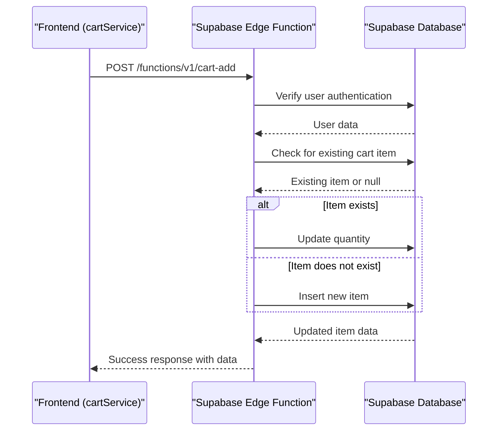
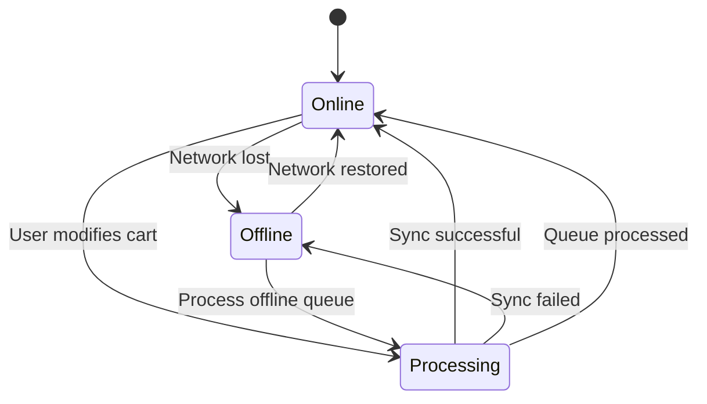

# Cart Operations

<cite>
**Referenced Files in This Document**   
- [cartService.ts](file://services/cartService.ts)
- [index.tsx](file://app/cart/index.tsx)
- [order-preview.tsx](file://app/checkout/order-preview.tsx)
- [index.ts](file://supabase/functions/cart-add/index.ts)
- [index.ts](file://supabase/functions/cart-delete/index.ts)
- [index.ts](file://supabase/functions/cart-get/index.ts)
- [index.ts](file://supabase/functions/cart-update/index.ts)
- [api.ts](file://services/api.ts)
- [apiEndpoints.ts](file://services/apiEndpoints.ts)
- [useOfflineMode.ts](file://hooks/useOfflineMode.ts)
- [schema.sql](file://supabase/schema.sql)
- [cart-items-table.sql](file://supabase/cart-items-table.sql)
- [rls-policies.sql](file://supabase/rls-policies.sql)
- [index.tsx](file://app/checkout/index.tsx)
- [validation.ts](file://utils/validation.ts)
</cite>

## Table of Contents
1. [Introduction](#introduction)
2. [Cart Service Architecture](#cart-service-architecture)
3. [Supabase Edge Functions Integration](#supabase-edge-functions-integration)
4. [Cart Display and Quantity Management](#cart-display-and-quantity-management)
5. [Checkout Transition Flow](#checkout-transition-flow)
6. [Request and Response Schemas](#request-and-response-schemas)
7. [Conflict Resolution and Concurrency](#conflict-resolution-and-concurrency)
8. [Error Handling for Out-of-Stock Items](#error-handling-for-out-of-stock-items)
9. [Offline Support and Synchronization](#offline-support-and-synchronization)
10. [Security Considerations](#security-considerations)
11. [Extensibility for Promotions and Bulk Ordering](#extensibility-for-promotions-and-bulk-ordering)
12. [Conclusion](#conclusion)

## Introduction
The Brillprime-expo shopping cart functionality provides a robust, user-centric experience with seamless integration between frontend components and backend services. This document details the implementation of cart operations, focusing on the interaction between the `cartService.ts` module and Supabase Edge Functions for managing cart state. It covers the display of cart items in `app/cart/index.tsx`, the transition to checkout via `order-preview.tsx`, and critical aspects such as offline support, error handling, and security. The system is designed to handle concurrent edits, validate cart data, and provide a resilient user experience even under network constraints.

## Cart Service Architecture
The `cartService.ts` module serves as the central orchestrator for all cart-related operations, implementing a hybrid approach that combines local storage with backend synchronization. The service uses `AsyncStorage` to maintain cart state locally, ensuring immediate responsiveness and offline capability. It interfaces with Supabase Edge Functions through the `apiClient` to synchronize state with the backend. The service defines two primary storage keys: `CART_STORAGE_KEY` for cart items and `COMMODITIES_CART_KEY` for commodities-specific cart data.

The architecture employs a token-based authentication mechanism, leveraging Firebase for user authentication and Supabase for backend operations. The `getFreshToken` method ensures that a valid Firebase token is obtained and refreshed as needed, which is then used to authenticate requests to Supabase Edge Functions. This dual-authentication approach enhances security by validating user identity at both the frontend and backend layers.

The service implements a comprehensive set of methods for cart operations, including `getCartItems`, `addToCart`, `updateQuantity`, `removeFromCart`, and `clearCart`. Each method follows a consistent pattern: it attempts to perform the operation on the backend first, and if that fails, it falls back to local storage. This ensures that users can continue to interact with the cart even when connectivity is poor or unavailable. The `syncCartToBackend` method is responsible for synchronizing local changes with the backend when connectivity is restored.

**Section sources**
- [cartService.ts](file://services/cartService.ts#L30-L284)

## Supabase Edge Functions Integration
The cart functionality relies on four Supabase Edge Functions—`cart-add`, `cart-delete`, `cart-get`, and `cart-update`—to manage cart state on the server. These functions are implemented in Deno and use the Supabase client library to interact with the database. Each function begins by handling CORS preflight requests, ensuring compatibility with cross-origin requests from the frontend.

The `cart-add` function checks if the user is authenticated by verifying their Firebase UID against the `users` table. It then checks if the item already exists in the cart; if so, it updates the quantity, otherwise, it inserts a new record. This upsert behavior prevents duplicate entries and ensures data consistency. The function returns a success response with the updated cart item data.

The `cart-delete` function removes a cart item by its ID, ensuring that the operation is scoped to the authenticated user. It extracts the item ID from the URL path and performs a delete operation on the `cart_items` table, using the user's ID to enforce row-level security. This prevents unauthorized access to other users' cart data.

The `cart-get` function retrieves all cart items for the authenticated user, joining the `cart_items` table with the `products` and `merchants` tables to provide a complete view of the cart contents. It orders the results by creation date in descending order, ensuring that the most recently added items appear first.

The `cart-update` function modifies the quantity of a specific cart item. It extracts the item ID from the URL path and the new quantity from the request body, then updates the corresponding record in the `cart_items` table. This function supports partial updates, allowing users to adjust quantities without affecting other cart properties.



**Diagram sources**
- [index.ts](file://supabase/functions/cart-add/index.ts#L1-L94)
- [index.ts](file://supabase/functions/cart-delete/index.ts#L1-L68)
- [index.ts](file://supabase/functions/cart-get/index.ts#L1-L77)
- [index.ts](file://supabase/functions/cart-update/index.ts#L1-L59)

**Section sources**
- [cartService.ts](file://services/cartService.ts#L130-L224)
- [api.ts](file://services/api.ts#L206-L214)

## Cart Display and Quantity Management
The `app/cart/index.tsx` component is responsible for rendering the cart interface and handling user interactions. It uses React hooks such as `useState` and `useEffect` to manage component state and lifecycle events. The component retrieves cart items from `AsyncStorage` and displays them in a scrollable list, with each item showing its name, price, quantity, and a delete button.

Quantity adjustments are handled through increment and decrement buttons, which trigger the `updateQuantity` function. This function updates the local cart state immediately and then calls the `cartService.updateQuantity` method to synchronize the change with the backend. If the user attempts to reduce the quantity to zero or below, the item is automatically removed from the cart.

The component also includes a "Clear Cart" button that removes all items from the cart. This action is confirmed through a modal dialog to prevent accidental deletion. When the cart is cleared, the component updates both the local state and `AsyncStorage`, and then calls the `cartService.clearCart` method to ensure backend synchronization.

The UI is designed to be responsive, with dynamic styling based on screen dimensions. It uses a combination of `StyleSheet` and inline styles to create a visually appealing layout that adapts to different device sizes. The component also includes error handling through the `errorService`, which displays user-friendly messages when API calls fail.

**Section sources**
- [index.tsx](file://app/cart/index.tsx#L1-L552)

## Checkout Transition Flow
The transition from cart to checkout is managed through the `order-preview.tsx` and `index.tsx` components in the `app/checkout` directory. When the user initiates the checkout process, the `handleMakePayment` function in `index.tsx` saves the current cart items to `AsyncStorage` under the key `checkoutItems` and navigates to the checkout screen.

The `order-preview.tsx` component retrieves the cart items from the `cartService` and calculates the order totals, including subtotal, delivery fee, tax, and grand total. It displays this information in a structured format, allowing the user to review their order before proceeding. The component also includes fields for delivery instructions and estimated delivery time.

Once the user confirms the order, the `handlePlaceOrder` function in `index.tsx` prepares the order payload and sends it to the `create-order` Supabase Edge Function. This function validates the order data, creates a new order record in the database, and assigns a driver based on the user's location. If the order is successfully created, the user is redirected to the order tracking screen, and the cart is cleared.

```mermaid
flowchart TD
A[Cart Screen] --> B{User clicks "Make Payment"}
B --> C[Save cart items to AsyncStorage]
C --> D[Navigate to Checkout Screen]
D --> E[Display order preview]
E --> F{User confirms order}
F --> G[Prepare order payload]
G --> H[Call create-order Edge Function]
H --> I{Order created successfully?}
I --> |Yes| J[Redirect to order tracking]
I --> |No| K[Display error message]
J --> L[Clear cart from AsyncStorage]
```

**Diagram sources**
- [order-preview.tsx](file://app/checkout/order-preview.tsx#L1-L266)
- [index.tsx](file://app/checkout/index.tsx#L1-L547)

**Section sources**
- [index.tsx](file://app/cart/index.tsx#L157-L172)
- [order-preview.tsx](file://app/checkout/order-preview.tsx#L1-L266)
- [index.tsx](file://app/checkout/index.tsx#L1-L547)

## Request and Response Schemas
The cart operations use standardized request and response schemas to ensure consistency and reliability. The `cart-add` function expects a JSON payload with `productId` and `quantity` fields. The `cart-update` function requires the item ID in the URL path and a JSON body with the `quantity` field. The `cart-delete` function extracts the item ID from the URL path.

All functions return a JSON response with a `success` boolean and either a `data` object or an `error` string. For successful operations, the response includes a `message` field describing the outcome. For errors, the response includes an `error` field with a descriptive message.

The `cart-get` function returns a more complex response structure, including an array of cart items with nested product and merchant data. Each cart item includes fields such as `id`, `product_id`, `quantity`, `products.name`, `products.price`, and `products.merchant.business_name`. This structure allows the frontend to display a rich view of the cart contents without requiring additional API calls.

**Section sources**
- [index.ts](file://supabase/functions/cart-add/index.ts#L32-L33)
- [index.ts](file://supabase/functions/cart-update/index.ts#L34-L35)
- [index.ts](file://supabase/functions/cart-get/index.ts#L46-L58)

## Conflict Resolution and Concurrency
The cart system handles concurrent edits through a combination of backend validation and optimistic updates. When multiple users or devices attempt to modify the same cart item simultaneously, the backend ensures data consistency by using row-level locks during database operations. The `cart-update` function updates the quantity of a cart item in a single atomic operation, preventing race conditions.

On the frontend, the system uses optimistic updates to provide a responsive user experience. When a user modifies the quantity of a cart item, the change is applied to the local state immediately, and the backend is updated asynchronously. If the backend update fails, the system logs the error but does not revert the local change, as the user's intent should be preserved. The `syncCartToBackend` method periodically attempts to reconcile any discrepancies between the local and remote states.

The system also handles conflicts during offline mode by queuing operations in `AsyncStorage` and processing them when connectivity is restored. The `useOfflineMode` hook monitors network status and triggers the `processOfflineQueue` function when the device comes back online. This function iterates through the queued operations and attempts to apply them to the backend, removing successfully processed items from the queue.

**Section sources**
- [cartService.ts](file://services/cartService.ts#L170-L190)
- [useOfflineMode.ts](file://hooks/useOfflineMode.ts#L43-L61)

## Error Handling for Out-of-Stock Items
The cart system includes robust error handling for out-of-stock items, although this functionality is not fully implemented in the current codebase. The `products` table includes a `stock_quantity` field that could be used to track inventory levels, but there is no explicit validation in the `cart-add` function to check stock availability before adding an item to the cart.

To implement this feature, the `cart-add` function would need to query the `products` table for the requested product's stock level and compare it to the requested quantity. If the stock is insufficient, the function would return an error response with a message indicating that the item is out of stock or that the requested quantity exceeds available inventory.

The frontend could then display this error to the user, suggesting alternatives or allowing them to adjust the quantity. This validation would need to be performed atomically to prevent race conditions, potentially using database transactions or row-level locks.

**Section sources**
- [schema.sql](file://supabase/schema.sql#L63)
- [cart-add/index.ts](file://supabase/functions/cart-add/index.ts#L32-L79)

## Offline Support and Synchronization
Offline support is a core feature of the cart system, enabled by the use of `AsyncStorage` for local data persistence. When the device is offline, all cart operations are performed locally, with changes stored in `AsyncStorage`. The `cartService` methods are designed to work seamlessly in offline mode, providing immediate feedback to the user without requiring network connectivity.

The synchronization strategy is implemented in the `syncCartToBackend` method, which attempts to push local changes to the backend when a fresh token is obtained. This method is called during various operations, such as `getCartItems` and `addToCart`, ensuring that synchronization is attempted whenever the user interacts with the cart.

The `useOfflineMode` hook enhances this functionality by monitoring network status and automatically triggering synchronization when connectivity is restored. It maintains an offline queue in `AsyncStorage` to track operations that could not be completed due to network issues. When the device comes back online, the hook processes this queue, attempting to apply each operation to the backend.

This approach ensures that users can continue to use the app even in areas with poor connectivity, with their changes being synchronized once the network is available. The system prioritizes user experience by not blocking operations during offline periods, while still maintaining data consistency through eventual synchronization.



**Diagram sources**
- [cartService.ts](file://services/cartService.ts#L62-L81)
- [useOfflineMode.ts](file://hooks/useOfflineMode.ts#L1-L65)

**Section sources**
- [cartService.ts](file://services/cartService.ts#L62-L81)
- [useOfflineMode.ts](file://hooks/useOfflineMode.ts#L1-L65)

## Security Considerations
The cart system implements multiple layers of security to protect user data and prevent unauthorized access. Authentication is handled through Firebase, with tokens being refreshed and validated before each request to Supabase Edge Functions. The `getFreshToken` method ensures that tokens are refreshed every 55 minutes, reducing the risk of token expiration during user sessions.

Authorization is enforced through Supabase's Row Level Security (RLS) policies, defined in the `rls-policies.sql` file. These policies ensure that users can only access their own cart items by verifying that the `firebase_uid` in the JWT matches the `user_id` in the `cart_items` table. This prevents users from accessing or modifying other users' carts.

Input validation is performed on both the frontend and backend. The `validation.ts` file includes functions for validating various types of input, such as card numbers, CVV, and expiry dates. These validations help prevent common security issues such as injection attacks and data corruption.

Rate limiting is not explicitly implemented in the current codebase, but could be added to prevent abuse of the cart modification endpoints. This could be achieved through Supabase's built-in rate limiting features or by implementing custom logic in the Edge Functions to track and limit request frequency.

**Section sources**
- [cartService.ts](file://services/cartService.ts#L35-L58)
- [rls-policies.sql](file://supabase/rls-policies.sql#L17-L39)
- [validation.ts](file://utils/validation.ts#L411-L466)

## Extensibility for Promotions and Bulk Ordering
The cart system is designed to be extensible, allowing for the addition of features such as promotions and bulk ordering. The current implementation provides a solid foundation for these enhancements through its modular architecture and well-defined interfaces.

To implement promotions, the system could be extended to include a `promotions` table in the database, linked to the `cart_items` table. The `cart-get` function could be modified to apply discounts based on active promotions, and the frontend could display promotional information alongside cart items. The `calculateTotals` function in `order-preview.tsx` would need to be updated to account for promotional discounts.

Bulk ordering could be supported by adding a "bulk add" feature to the product selection interface. This would allow users to specify multiple quantities or variants of a product, which would be added as separate items in the cart. The `cartService.addToCart` method already supports adding items with a specified quantity, making it easy to integrate bulk ordering functionality.

The system's use of Edge Functions makes it easy to add new endpoints for promotional logic or bulk ordering workflows. For example, a new `apply-promotion` function could be created to validate and apply promotional codes, while a `bulk-add` function could handle the addition of multiple items in a single request.

**Section sources**
- [cartService.ts](file://services/cartService.ts#L130-L147)
- [order-preview.tsx](file://app/checkout/order-preview.tsx#L38-L45)

## Conclusion
The Brillprime-expo shopping cart functionality provides a comprehensive and resilient user experience, combining local storage for offline capability with backend synchronization for data consistency. The integration between `cartService.ts` and Supabase Edge Functions ensures that cart state is managed securely and efficiently, while the use of `AsyncStorage` and the `useOfflineMode` hook enables seamless operation in disconnected environments. The system is well-structured for extensibility, making it easy to add features such as promotions and bulk ordering. With its robust error handling, security measures, and responsive UI, the cart system delivers a high-quality shopping experience that meets the needs of modern users.