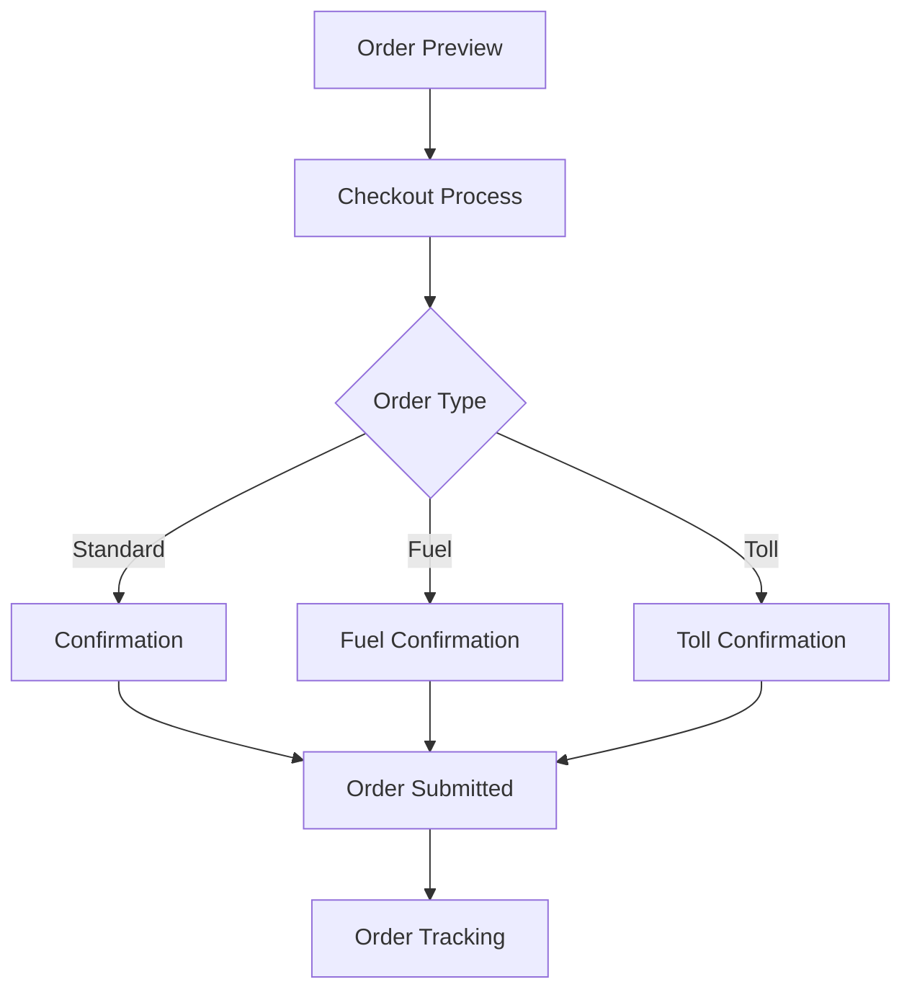
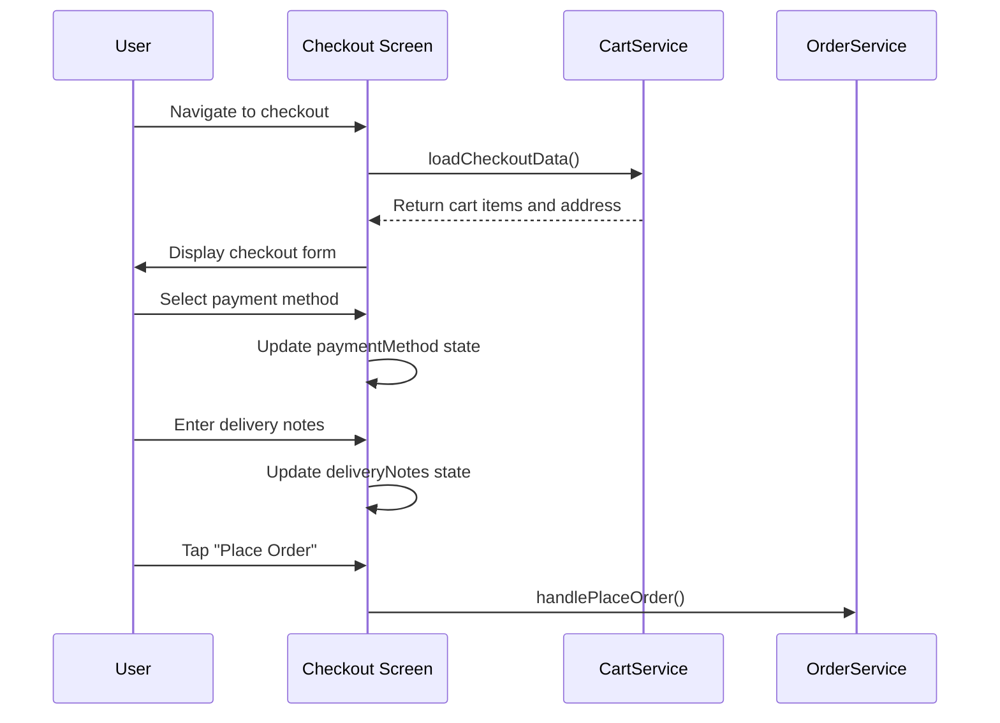
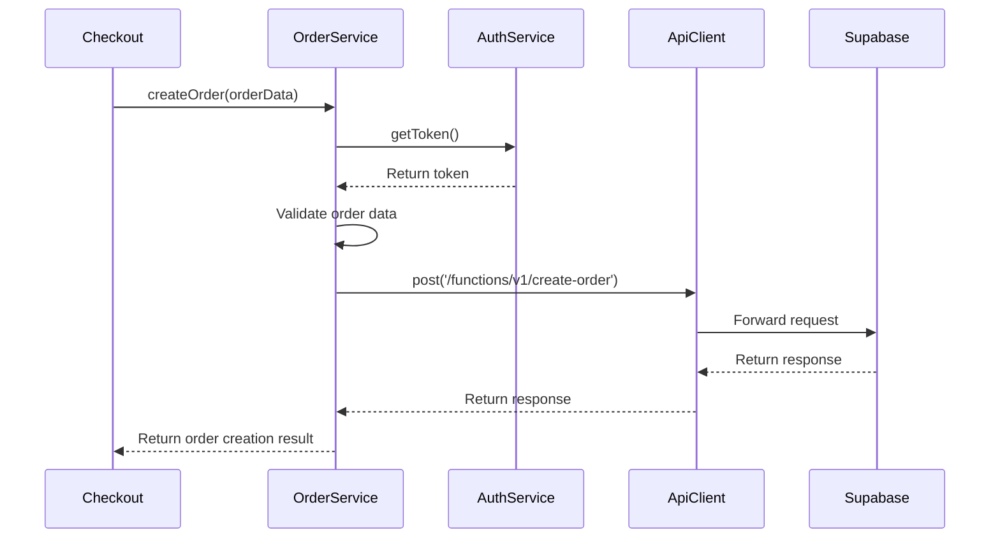

# Checkout Flow

<cite>
**Referenced Files in This Document**   
- [order-preview.tsx](file://app/checkout/order-preview.tsx)
- [index.tsx](file://app/checkout/index.tsx)
- [confirmation.tsx](file://app/checkout/confirmation.tsx)
- [fuel-confirmation.tsx](file://app/checkout/fuel-confirmation.tsx)
- [toll-confirmation.tsx](file://app/checkout/toll-confirmation.tsx)
- [change-address.tsx](file://app/orders/change-address.tsx)
- [orderService.ts](file://services/orderService.ts)
- [cartService.ts](file://services/cartService.ts)
- [create-order/index.ts](file://supabase/functions/create-order/index.ts)
- [types.ts](file://services/types.ts)
- [validation.ts](file://utils/validation.ts)
- [api.ts](file://services/api.ts)
</cite>

## Table of Contents
1. [Introduction](#introduction)
2. [Checkout Workflow Overview](#checkout-workflow-overview)
3. [Order Preview](#order-preview)
4. [Checkout Process](#checkout-process)
5. [Confirmation Screens](#confirmation-screens)
6. [Order Service and Data Preparation](#order-service-and-data-preparation)
7. [State Management](#state-management)
8. [Order Payload Structure](#order-payload-structure)
9. [Partial Failure Handling](#partial-failure-handling)
10. [Rollback Procedures](#rollback-procedures)
11. [UX Considerations](#ux-considerations)
12. [Testing and Monitoring](#testing-and-monitoring)
13. [Conclusion](#conclusion)

## Introduction
The checkout flow in Brillprime-expo is a multi-step process that guides users from order preview to final confirmation. This document details the complete workflow, focusing on the transition from order-preview.tsx to various confirmation screens, the role of orderService.ts in preparing and submitting order data, state management throughout the process, and handling of edge cases such as partial failures and rollbacks. The flow incorporates address selection, order validation, and provides a seamless user experience with appropriate loading states and error recovery mechanisms.

## Checkout Workflow Overview
The checkout process in Brillprime-expo follows a structured flow that ensures a smooth transition from cart to order confirmation. The workflow begins with the order preview screen, where users can review their selected items before proceeding to the checkout process. During checkout, users select delivery addresses, payment methods, and add delivery instructions. The process culminates in confirmation screens that vary based on the order type (standard, fuel, or toll). Throughout this journey, the application maintains state using React's useState and AsyncStorage, ensuring data persistence across screens and sessions.



**Diagram sources**
- [order-preview.tsx](file://app/checkout/order-preview.tsx)
- [index.tsx](file://app/checkout/index.tsx)
- [confirmation.tsx](file://app/checkout/confirmation.tsx)
- [fuel-confirmation.tsx](file://app/checkout/fuel-confirmation.tsx)
- [toll-confirmation.tsx](file://app/checkout/toll-confirmation.tsx)

## Order Preview
The order preview screen serves as the entry point to the checkout process, allowing users to review their cart items before proceeding. This screen displays a comprehensive breakdown of the order, including items, delivery information, delivery instructions, and price details. The implementation uses React's useState and useEffect hooks to manage component state and lifecycle.

The order preview retrieves cart items through the cartService, which synchronizes data between local storage and the backend. The screen calculates totals including subtotal, delivery fee, tax, and final total, providing transparency to the user. Users can navigate back to modify their cart or proceed to checkout with a single tap.

**Section sources**
- [order-preview.tsx](file://app/checkout/order-preview.tsx#L1-L266)
- [cartService.ts](file://services/cartService.ts#L84-L119)

## Checkout Process
The checkout process is implemented in the index.tsx file within the checkout directory. This screen collects essential information for order fulfillment, including delivery address, payment method, and delivery notes. The interface is designed with a responsive layout that adapts to different screen sizes, ensuring a consistent user experience across devices.

The checkout screen manages several state variables:
- cartItems: The items being purchased
- selectedAddress: Delivery address for the order
- paymentMethod: Selected payment method (card, bank, or cash)
- deliveryNotes: Special instructions for delivery

Users can select from saved addresses or enter a new one. The payment method selection is implemented as a series of touchable options, with visual feedback for the selected method. The screen calculates and displays the order summary, including subtotal, delivery fee, service fee, and total amount.



**Diagram sources**
- [index.tsx](file://app/checkout/index.tsx#L1-L547)
- [cartService.ts](file://services/cartService.ts#L268-L280)

## Confirmation Screens
Brillprime-expo implements specialized confirmation screens for different order types: standard orders, fuel orders, and toll payments. Each confirmation screen provides a tailored experience that highlights relevant information for the specific order type.

### Standard Confirmation
The standard confirmation screen (confirmation.tsx) displays order details including commodity information, delivery details, payment method, and price breakdown. Users can review and confirm their order before final submission. The screen includes animation effects to enhance the user experience during the confirmation process.

### Fuel Confirmation
The fuel-confirmation.tsx screen is optimized for fuel orders, displaying fuel type, quantity, delivery address, and estimated delivery time. This screen acknowledges the specific nature of fuel delivery and provides appropriate information to the user.

### Toll Confirmation
The toll-confirmation.tsx screen handles toll payments, displaying toll gate information, vehicle type, journey details, and cost breakdown. This screen is designed for quick transactions, as toll payments typically require less information than standard orders.

All confirmation screens implement consistent patterns for payment method selection, price breakdown, and order submission, ensuring a familiar experience across different order types.

**Section sources**
- [confirmation.tsx](file://app/checkout/confirmation.tsx#L1-L620)
- [fuel-confirmation.tsx](file://app/checkout/fuel-confirmation.tsx#L1-L518)
- [toll-confirmation.tsx](file://app/checkout/toll-confirmation.tsx#L1-L542)

## Order Service and Data Preparation
The orderService.ts file plays a crucial role in the checkout process by handling order validation, creation, and management. This service acts as an intermediary between the frontend checkout screens and the backend API, ensuring data integrity and proper error handling.

The order service implements several key functions:
- validateOrderData: Validates order information before submission
- createOrder: Prepares and submits order data to the create-order Supabase function
- getUserOrders: Retrieves user's order history
- getOrder: Fetches details of a specific order
- updateOrderStatus: Updates the status of an existing order
- cancelOrder: Handles order cancellation
- trackOrder: Provides order tracking information

When creating an order, the service prepares a payload that includes items, delivery address ID, payment method ID, and notes. It obtains an authentication token through the authService and includes it in the request headers. The service uses the apiClient to make a POST request to the create-order Supabase function, handling both success and error responses appropriately.



**Diagram sources**
- [orderService.ts](file://services/orderService.ts#L58-L86)
- [api.ts](file://services/api.ts#L163-L179)
- [create-order/index.ts](file://supabase/functions/create-order/index.ts#L1-L149)

## State Management
The checkout flow employs a hybrid state management approach combining React's useState hook for component-level state and AsyncStorage for persistent storage. This strategy ensures data persistence across screen navigations and app restarts while maintaining responsive UI updates.

Key state management patterns include:
- Component state: Used for temporary UI state like loading indicators, selected payment methods, and form inputs
- AsyncStorage: Used for persistent data like cart items, user addresses, and order history
- Service layer state: The cartService and orderService manage their own state and provide methods to interact with storage

The cartService implements a synchronization strategy that attempts to sync local cart data with the backend when possible, falling back to local storage when the network is unavailable. This ensures users can continue shopping even in offline scenarios, with changes synced when connectivity is restored.

Address selection state is managed through the change-address.tsx component, which allows users to select from saved addresses or enter a new one. The selected address is stored in AsyncStorage and referenced during the checkout process.

**Section sources**
- [index.tsx](file://app/checkout/index.tsx#L37-L41)
- [cartService.ts](file://services/cartService.ts#L31-L32)
- [change-address.tsx](file://app/orders/change-address.tsx#L32-L35)

## Order Payload Structure
The order payload structure is designed to capture all necessary information for order fulfillment while maintaining flexibility for different order types. When submitting an order to the create-order Supabase function, the payload follows this structure:

```json
{
  "items": [
    {
      "productId": "string",
      "quantity": "number"
    }
  ],
  "deliveryAddressId": "string",
  "paymentMethodId": "string",
  "notes": "string"
}
```

The backend function (create-order/index.ts) processes this payload by:
1. Validating the user's authentication token
2. Retrieving user information from the database
3. Calculating order totals based on product prices and quantities
4. Creating the order record in the database
5. Creating order items records
6. Sending notifications to relevant parties

The response from the create-order function includes a success message and the created order data, which is then stored locally and used to update the user interface.

**Section sources**
- [index.tsx](file://app/checkout/index.tsx#L118-L123)
- [create-order/index.ts](file://supabase/functions/create-order/index.ts#L36-L37)

## Partial Failure Handling
The checkout system implements robust error handling to manage partial failures and ensure data consistency. When an order submission fails, the system provides clear error messages to the user while preserving their cart data for retry.

Key failure handling mechanisms include:
- Network error detection and user-friendly messaging
- Authentication token refresh and retry logic
- Local data persistence to prevent data loss
- Transactional operations to maintain data integrity

The api.ts service implements comprehensive error handling that distinguishes between different types of errors (network, authentication, server, etc.) and provides appropriate user feedback. For example, network timeouts display a message suggesting the server may be waking from sleep mode, while authentication errors prompt users to sign in again.

In the event of a partial failure during order creation, the system rolls back any partial changes and maintains the original cart state, allowing users to attempt the transaction again without losing their selections.

**Section sources**
- [api.ts](file://services/api.ts#L105-L152)
- [index.tsx](file://app/checkout/index.tsx#L184-L187)

## Rollback Procedures
Rollback procedures are implemented at multiple levels to ensure data consistency and prevent orphaned records. When an error occurs during order processing, the system follows a structured rollback approach:

1. **Frontend Rollback**: If the order submission fails, the cart remains unchanged, and users are notified of the failure without losing their items.

2. **Backend Transaction Management**: The create-order Supabase function uses database transactions to ensure that either all operations succeed or none do. If any step fails (e.g., creating order items), the entire transaction is rolled back.

3. **Local Storage Synchronization**: After a failed order attempt, the system maintains the cart in its pre-attempt state, allowing users to retry without re-adding items.

4. **Error Recovery**: Users can modify their order details (address, payment method, etc.) and attempt the transaction again, with the system preserving their previous selections.

The rollback mechanism ensures that users never lose their cart data due to transaction failures and can seamlessly retry their purchase with minimal friction.

**Section sources**
- [index.tsx](file://app/checkout/index.tsx#L184-L189)
- [create-order/index.ts](file://supabase/functions/create-order/index.ts#L141-L147)

## UX Considerations
The checkout flow incorporates several UX considerations to create a smooth and intuitive user experience:

### Loading States
Loading states are implemented throughout the checkout process to provide feedback during asynchronous operations. The "Place Order" button displays a loading indicator and disables interaction during processing to prevent duplicate submissions.

### Error Recovery
Error recovery is prioritized with clear, actionable error messages that guide users toward resolution. The system preserves user input when possible, minimizing the need to re-enter information after an error.

### Navigation Guards
Navigation guards prevent accidental exit from the checkout process. While not explicitly implemented in the provided code, the flow design naturally guides users forward, and critical actions require explicit confirmation.

### Responsive Design
The checkout screens implement responsive design principles, adjusting padding and layout based on screen dimensions to ensure usability across different device sizes.

### Accessibility
The interface includes accessibility features such as proper contrast ratios, semantic elements, and screen reader support through appropriate component usage.

**Section sources**
- [index.tsx](file://app/checkout/index.tsx#L41-L42)
- [confirmation.tsx](file://app/checkout/confirmation.tsx#L44-L45)

## Testing and Monitoring
To ensure the reliability of the checkout flow, comprehensive testing and monitoring strategies should be implemented:

### Testing the Complete Checkout Journey
Testing should cover:
- Happy path: Successful completion of the entire checkout process
- Edge cases: Empty cart, invalid addresses, payment method failures
- Error scenarios: Network interruptions, authentication failures
- Different order types: Standard, fuel, and toll orders

Automated tests should verify:
- State management across screens
- Data persistence in AsyncStorage
- Proper error handling and user feedback
- Correct order payload structure
- Integration with the create-order function

### Monitoring for Cart Abandonment
Monitoring strategies should include:
- Tracking user progression through the checkout funnel
- Identifying common drop-off points
- Analyzing error rates at each step
- Monitoring network performance and API response times

Analytics should capture:
- Time spent on each checkout screen
- Conversion rates from cart to order confirmation
- Success and failure rates for order submissions
- Most common error types

This data can inform optimizations to reduce cart abandonment and improve the overall checkout experience.

**Section sources**
- [test-cart-checkout.sh](file://scripts/test-cart-checkout.sh)
- [test-endpoints.sh](file://scripts/test-endpoints.sh)

## Conclusion
The checkout flow in Brillprime-expo represents a comprehensive implementation of e-commerce functionality, balancing user experience with technical robustness. By following a structured approach from order preview to confirmation, the system provides a seamless purchasing experience while maintaining data integrity through proper state management and error handling.

The integration between frontend components and backend services is well-architected, with clear separation of concerns and appropriate error recovery mechanisms. The use of Supabase edge functions for order creation provides scalability and security, while local storage ensures functionality in offline scenarios.

To further enhance the checkout experience, additional features could include:
- Guest checkout functionality
- Saved payment methods
- Order scheduling
- Real-time inventory checks
- Enhanced address validation with geocoding

These improvements would build upon the solid foundation already established in the current implementation.