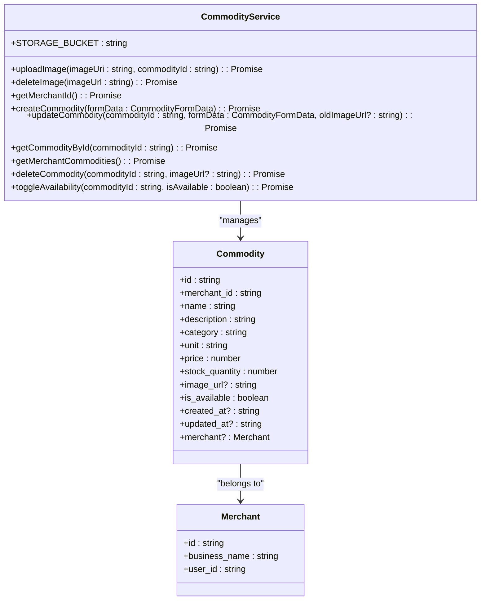
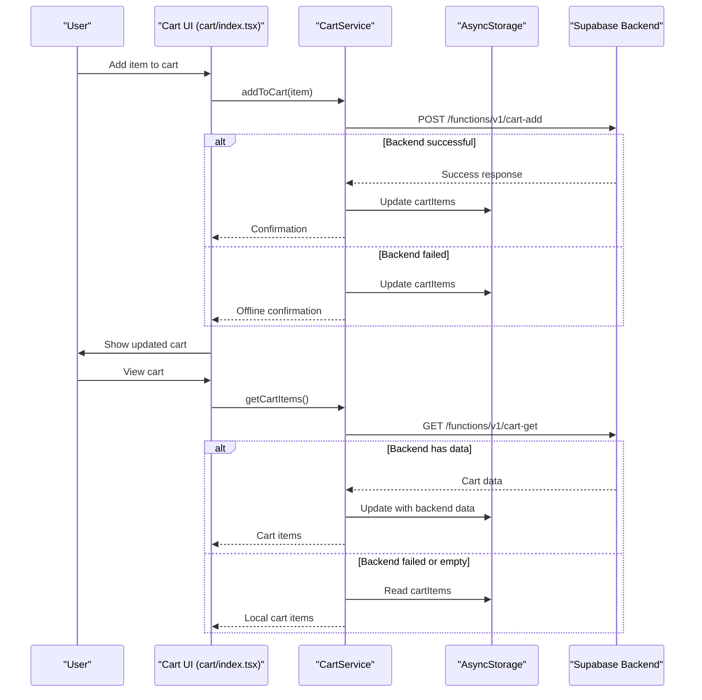
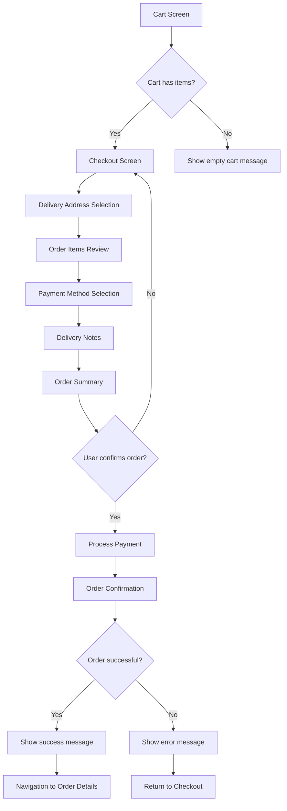
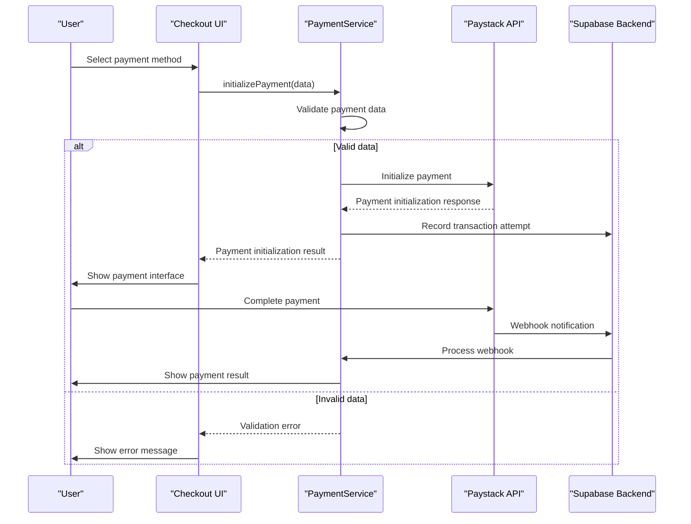
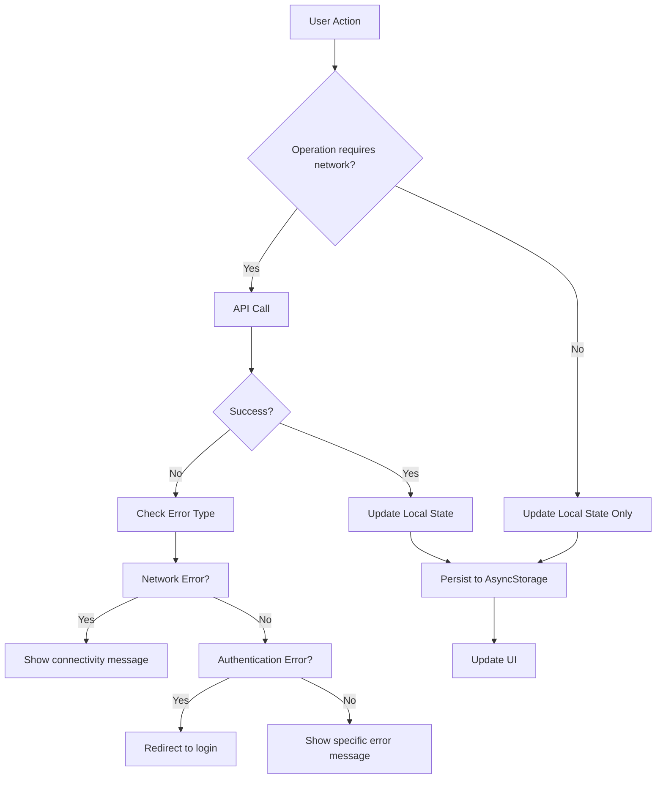

# Core Features

<cite>
**Referenced Files in This Document**   
- [commodityService.ts](file://services/commodityService.ts)
- [cartService.ts](file://services/cartService.ts)
- [orderService.ts](file://services/orderService.ts)
- [paymentService.ts](file://services/paymentService.ts)
- [commodities.tsx](file://app/commodity/commodities.tsx)
- [cart/index.tsx](file://app/cart/index.tsx)
- [checkout/index.tsx](file://app/checkout/index.tsx)
- [checkout/order-preview.tsx](file://app/checkout/order-preview.tsx)
- [checkout/confirmation.tsx](file://app/checkout/confirmation.tsx)
- [transactions/index.tsx](file://app/transactions/index.tsx)
- [consumer-orders.tsx](file://app/orders/consumer-orders.tsx)
- [types.ts](file://services/types.ts)
- [api.ts](file://services/api.ts)
- [merchantService.ts](file://services/merchantService.ts)
</cite>

## Table of Contents
1. [Product Discovery and Management](#product-discovery-and-management)
2. [Shopping Cart Operations](#shopping-cart-operations)
3. [Checkout Process](#checkout-process)
4. [Order Processing and Status Tracking](#order-processing-and-status-tracking)
5. [Payment Processing with Paystack](#payment-processing-with-paystack)
6. [User Journey and Transaction History](#user-journey-and-transaction-history)
7. [State Management and Error Handling](#state-management-and-error-handling)
8. [Performance Optimization](#performance-optimization)

## Product Discovery and Management

The product discovery and management functionality in Brillprime-expo is primarily handled by the `commodityService.ts` service, which provides a comprehensive interface for merchants to manage their inventory and for consumers to browse available products. The service implements a robust CRUD (Create, Read, Update, Delete) system for commodities with integrated image handling through Supabase Storage.

Merchants can create new commodities through the `createCommodity` method, which accepts a `CommodityFormData` object containing product details such as name, description, category, price, and available quantity. The service automatically generates a unique commodity ID and handles image uploads to the Supabase storage bucket named 'product-images'. When a merchant uploads an image, the service converts the image URI to a blob and uploads it with a timestamped filename to ensure uniqueness. The public URL of the uploaded image is then stored in the database record.

For product retrieval, the service provides multiple methods to fetch commodities based on different criteria. The `getCommodityById` method allows retrieval of a specific product by its unique identifier, while `getMerchantCommodities` fetches all products for the currently authenticated merchant. The service also implements proper error handling and validation throughout, ensuring that operations fail gracefully when merchant profiles are incomplete or database operations encounter issues.

Consumers discover products through the `commodities.tsx` component, which displays a categorized browsing interface with search functionality. The component fetches products using the `merchantService.getCommodities()` method and organizes them by category for easy navigation. Users can search for products by name or description, and the interface provides real-time auto-refresh every minute to ensure product information remains current.



**Diagram sources**
- [commodityService.ts](file://services/commodityService.ts#L27-L386)
- [types.ts](file://services/types.ts#L87-L99)

**Section sources**
- [commodityService.ts](file://services/commodityService.ts#L27-L386)
- [commodities.tsx](file://app/commodity/commodities.tsx#L1-L796)
- [merchantService.ts](file://services/merchantService.ts#L110-L136)

## Shopping Cart Operations

The shopping cart functionality in Brillprime-expo is managed by the `cartService.ts` service, which implements a hybrid persistence strategy combining local storage with backend synchronization. This approach ensures that users can add items to their cart even when offline, with automatic synchronization when connectivity is restored.

The service uses AsyncStorage to store cart items locally with the key 'cartItems', providing immediate feedback to users when they add or modify items in their cart. Each cart item contains essential information such as commodity ID, name, merchant details, price, quantity, and unit. The service implements methods for all standard cart operations: `addToCart`, `updateQuantity`, `removeFromCart`, and `clearCart`.

A key feature of the cart service is its dual-write strategy. When a user performs cart operations, the service first updates the local storage immediately for responsiveness, then attempts to sync with the backend using Supabase edge functions. For example, when adding an item to the cart, the service first tries to call the `/functions/v1/cart-add` endpoint, and if that fails (due to network issues), it falls back to updating only the local storage. This ensures a seamless user experience regardless of connectivity status.

The cart interface in `cart/index.tsx` provides a clean, responsive design that displays all items in the cart with controls to adjust quantities or remove items. The component calculates the total cart value and displays it prominently. It also integrates with the AppContext to update the cart count badge that appears throughout the application. When users proceed to checkout, the service prepares the cart by saving the current items to the 'checkoutItems' storage key, ensuring the checkout process has access to the correct cart state.



**Diagram sources**
- [cartService.ts](file://services/cartService.ts#L30-L284)
- [cart/index.tsx](file://app/cart/index.tsx#L1-L552)

**Section sources**
- [cartService.ts](file://services/cartService.ts#L30-L284)
- [cart/index.tsx](file://app/cart/index.tsx#L1-L552)

## Checkout Process

The checkout process in Brillprime-expo is implemented across multiple components that guide users through a structured flow from cart review to order confirmation. The process begins in the cart interface where users click "Make Payment" to navigate to the checkout flow, which consists of several steps: order preview, delivery information, payment method selection, and final confirmation.

The `checkout/index.tsx` component serves as the main checkout interface, where users can review their order details including items, quantities, prices, and delivery fees. Users must select a delivery address (with support for both self-collection and delivery to another person) and choose a payment method from available options: credit/debit card, bank transfer, or cash on delivery. The component calculates the total amount including a fixed delivery fee of ₦500 and service fee of ₦200.

Before proceeding to payment, users can access the `order-preview.tsx` component which provides a summary of their order with estimated delivery time and price breakdown including subtotal, delivery fee, and tax (7.5% VAT). This preview step allows users to verify their order details before committing to the purchase.

The final step occurs in `confirmation.tsx`, where users review all order details including delivery instructions and selected payment method before confirming the order. The component implements visual feedback with success/failure states and navigates users to their order details upon successful placement. The checkout process also handles edge cases such as empty carts and missing delivery addresses with appropriate validation and user feedback.



**Diagram sources**
- [checkout/index.tsx](file://app/checkout/index.tsx#L1-L547)
- [checkout/order-preview.tsx](file://app/checkout/order-preview.tsx#L1-L266)
- [checkout/confirmation.tsx](file://app/checkout/confirmation.tsx#L1-L620)

**Section sources**
- [checkout/index.tsx](file://app/checkout/index.tsx#L1-L547)
- [checkout/order-preview.tsx](file://app/checkout/order-preview.tsx#L1-L266)
- [checkout/confirmation.tsx](file://app/checkout/confirmation.tsx#L1-L620)

## Order Processing and Status Tracking

Order processing in Brillprime-expo is managed by the `orderService.ts` service, which handles the creation, retrieval, and status management of user orders. The service acts as an intermediary between the frontend application and the backend API, providing a clean interface for order-related operations.

When a user completes the checkout process, the `handlePlaceOrder` function in `checkout/index.tsx` prepares the order payload and sends it to the backend via the `/functions/v1/create-order` Supabase edge function. The order payload includes the list of items, delivery address ID, payment method, and any delivery notes. The service validates the order data before submission, checking for required fields such as merchant selection, commodity selection, valid quantity, and properly formatted delivery address.

Once an order is created, it is stored both in the backend database and locally in AsyncStorage under the 'userOrders' key. This dual storage approach allows users to access their order history even when offline. The `consumer-orders.tsx` component displays a user's order history with visual indicators for different order statuses (pending, confirmed, preparing, ready, delivered, cancelled) using distinct color coding for easy identification.

The order service provides comprehensive methods for order management:
- `getUserOrders()`: Retrieves a user's orders with optional filtering by status
- `getOrder()`: Fetches details of a specific order by ID
- `updateOrderStatus()`: Updates the status of an order (requires appropriate permissions)
- `cancelOrder()`: Allows users to cancel orders that haven't been processed
- `trackOrder()`: Provides real-time tracking information including status history and estimated delivery

```mermaid
classDiagram
class OrderService {
+validateOrderData(orderData : CreateOrderRequest) : { isValid : boolean; error? : string }
+createOrder(orderData : CreateOrderRequest) : Promise
+getUserOrders(filters? : { status? : string; limit? : number; offset? : number }) : Promise
+getOrder(orderId : string) : Promise
+updateOrderStatus(orderId : string, status : OrderStatus) : Promise
+cancelOrder(orderId : string, reason? : string) : Promise
+trackOrder(orderId : string) : Promise
+getOrderSummary() : Promise
}
class Order {
+id : string
+userId : string
+merchantId : string
+merchantName : string
+commodityId : string
+commodityName : string
+quantity : number
+unit : string
+unitPrice : number
+totalAmount : number
+status : OrderStatus
+deliveryAddress : string
+deliveryType : DeliveryType
+recipientName? : string
+recipientPhone? : string
+notes? : string
+createdAt : string
+updatedAt : string
+estimatedDelivery? : string
}
class OrderStatus {
<<enumeration>>
pending
confirmed
preparing
ready
delivered
cancelled
}
class DeliveryType {
<<enumeration>>
yourself
merchant
}
OrderService --> Order : "manages"
```

**Diagram sources**
- [orderService.ts](file://services/orderService.ts#L8-L203)
- [types.ts](file://services/types.ts#L111-L131)

**Section sources**
- [orderService.ts](file://services/orderService.ts#L8-L203)
- [consumer-orders.tsx](file://app/orders/consumer-orders.tsx#L1-L372)
- [checkout/index.tsx](file://app/checkout/index.tsx#L87-L190)

## Payment Processing with Paystack

Payment processing in Brillprime-expo is handled by the `paymentService.ts` service, which integrates with Paystack to provide secure transaction processing. The service implements a comprehensive payment management system that supports multiple payment methods and provides transaction history functionality.

The payment service exposes methods for various payment operations:
- `initializePayment()`: Initiates a payment transaction with Paystack, validating the amount (ensuring it's positive and doesn't exceed ₦10,000,000) and verifying the payment method (CARD or BANK_TRANSFER)
- `getPaymentHistory()`: Retrieves a user's payment history with pagination support
- `getTransaction()`: Fetches details of a specific transaction by ID
- `confirmTransaction()`: Confirms a completed transaction
- `requestRefund()`: Processes refund requests for eligible transactions
- `getPaymentMethods()`: Retrieves the user's saved payment methods from their profile
- `addPaymentMethod()`: Allows users to add new payment methods to their account
- `removePaymentMethod()`: Enables removal of existing payment methods
- `setDefaultPaymentMethod()`: Sets a specific payment method as the default for future transactions

The service implements robust validation to prevent common errors, such as ensuring the payment amount is positive and within acceptable limits, and verifying that the selected payment method is supported. Error messages are user-friendly and provide clear guidance when issues occur.

The payment flow is integrated into the checkout process, where users select their preferred payment method (card, bank transfer, or cash on delivery) before confirming their order. For card and bank transfer payments, the service communicates with Paystack's API to process the transaction securely. The implementation follows security best practices by handling sensitive payment information through the secure Paystack gateway rather than storing it directly in the application.



**Diagram sources**
- [paymentService.ts](file://services/paymentService.ts#L8-L276)
- [api.ts](file://services/api.ts#L22-L220)

**Section sources**
- [paymentService.ts](file://services/paymentService.ts#L8-L276)

## User Journey and Transaction History

The user journey in Brillprime-expo follows a comprehensive flow from product discovery to post-purchase transaction history review. Users begin by browsing commodities through the `commodities.tsx` interface, which presents products in a categorized grid layout with search functionality. When users find items they wish to purchase, they can add them to their cart, where the quantity can be adjusted or items removed as needed.

After populating their cart, users proceed to checkout where they provide delivery information and select a payment method. The system guides users through each step with clear visual feedback and validation. Upon successful order placement, users receive confirmation and can track their order status through the consumer orders interface.

Post-purchase, users can review their transaction history in the `transactions/index.tsx` component, which displays a comprehensive list of all financial transactions including purchases, refunds, payments, and rewards. The interface allows filtering by transaction type and provides visual indicators for transaction status (completed, pending, failed) with appropriate color coding. Users can see the total amount spent and total refunds received in summary cards at the top of the screen.

The transaction history component implements pull-to-refresh functionality for real-time updates and uses responsive design to adapt to different screen sizes. Each transaction entry includes an icon representing the transaction type, the amount (with positive/negative indicators), description, date, and status badge. This comprehensive transaction history provides users with full visibility into their financial activity within the application.


**Diagram sources**
- [commodities.tsx](file://app/commodity/commodities.tsx#L1-L796)
- [cart/index.tsx](file://app/cart/index.tsx#L1-L552)
- [checkout/index.tsx](file://app/checkout/index.tsx#L1-L547)
- [transactions/index.tsx](file://app/transactions/index.tsx#L1-L456)

**Section sources**
- [transactions/index.tsx](file://app/transactions/index.tsx#L1-L456)

## State Management and Error Handling

Brillprime-expo implements a hybrid state management approach combining React's built-in state management with AsyncStorage for persistent data storage. The application uses React hooks such as `useState` and `useEffect` for component-level state, while leveraging context providers like `AppContext` and `AuthContext` for global state that needs to be accessed across multiple components.

For shopping cart data, the application uses AsyncStorage with the key 'cartItems' to persist cart contents between sessions. This ensures that users don't lose their cart contents when closing the app or restarting their device. The cart service synchronizes this local storage with the backend when possible, creating a resilient system that works both online and offline.

Error handling is implemented at multiple levels throughout the application:
- **Service level**: Each service method includes try-catch blocks to handle exceptions and return structured error responses
- **Component level**: Components use error boundaries like `FormErrorBoundary` and `ErrorBoundary` to gracefully handle rendering errors
- **User interface level**: Error messages are displayed using Alert components with appropriate titles and actions
- **Network level**: The API client implements timeout handling and provides user-friendly messages for common network issues

The `errorService.ts` provides centralized error handling with the `handleApiError` method that maps technical error messages to user-friendly explanations. For example, network timeout errors are presented as "The server is taking too long to respond" rather than showing raw technical messages. Authentication errors trigger session expiration messages that guide users to sign in again.

Validation is implemented both on the client and server sides. The order service includes a `validateOrderData` method that checks for required fields and proper formatting, while the payment service validates amounts and payment methods. Form inputs in the UI provide real-time feedback when validation fails, helping users correct errors before submission.



**Section sources**
- [cartService.ts](file://services/cartService.ts#L3-L284)
- [errorService.ts](file://services/errorService.ts#L1-L100)
- [api.ts](file://services/api.ts#L107-L154)

## Performance Optimization

Brillprime-expo implements several performance optimization techniques to ensure a smooth user experience, particularly for product listing rendering and search functionality. The application uses responsive design principles with dynamic padding and font sizing based on screen dimensions to provide an optimal experience across different device sizes.

For product listing rendering, the application implements several optimizations:
- **Lazy loading**: Images are loaded only when they enter the viewport
- **Caching**: Product data is cached in AsyncStorage and refreshed periodically (every minute) rather than on every screen view
- **Efficient rendering**: The use of FlatList with proper key extraction ensures only visible items are rendered
- **Debounced search**: Search queries are debounced to prevent excessive API calls during typing

The `commodities.tsx` component uses a two-column grid layout for product display, which maximizes screen real estate while maintaining readability. The component implements pull-to-refresh functionality with visual feedback, allowing users to manually refresh product listings when needed.

Network performance is optimized through:
- **Edge functions**: Supabase edge functions are used for API calls, reducing latency
- **Batch operations**: Multiple cart operations are batched when possible
- **Conditional requests**: Data is only fetched from the backend when necessary, with fallback to local storage
- **Efficient queries**: Database queries are optimized with proper indexing and filtering

The application also implements code splitting and lazy loading for certain components and services, reducing the initial bundle size and improving startup time. Image optimization is handled through Supabase Storage, which automatically serves appropriately sized images based on the requesting device.

**Section sources**
- [commodities.tsx](file://app/commodity/commodities.tsx#L1-L796)
- [cart/index.tsx](file://app/cart/index.tsx#L1-L552)
- [performance.ts](file://utils/performance.ts#L1-L50)
- [mapOptimization.ts](file://utils/mapOptimization.ts#L1-L30)