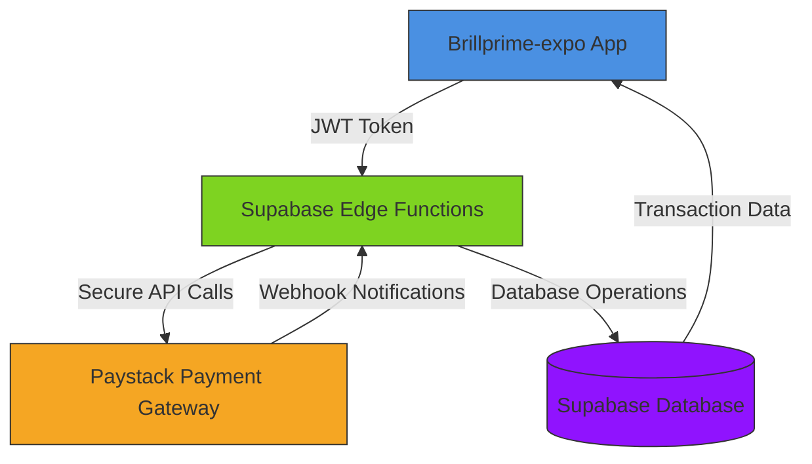
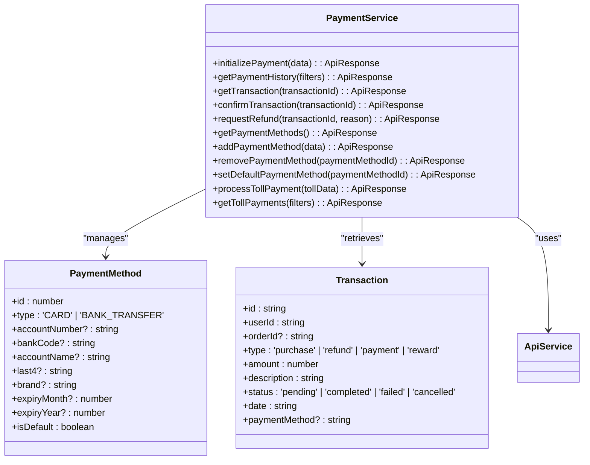
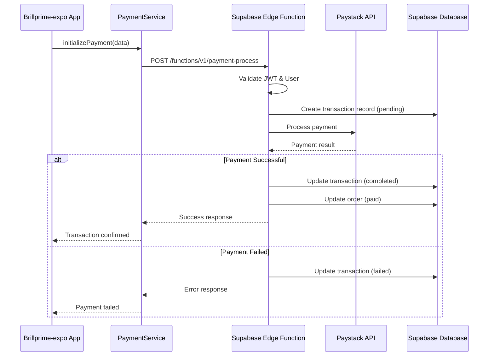
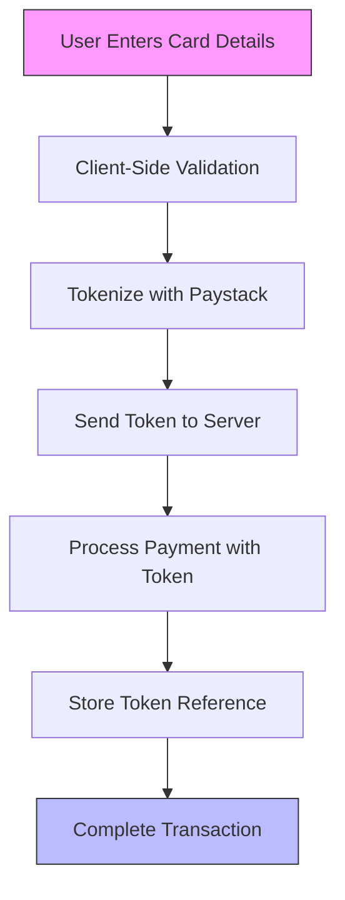
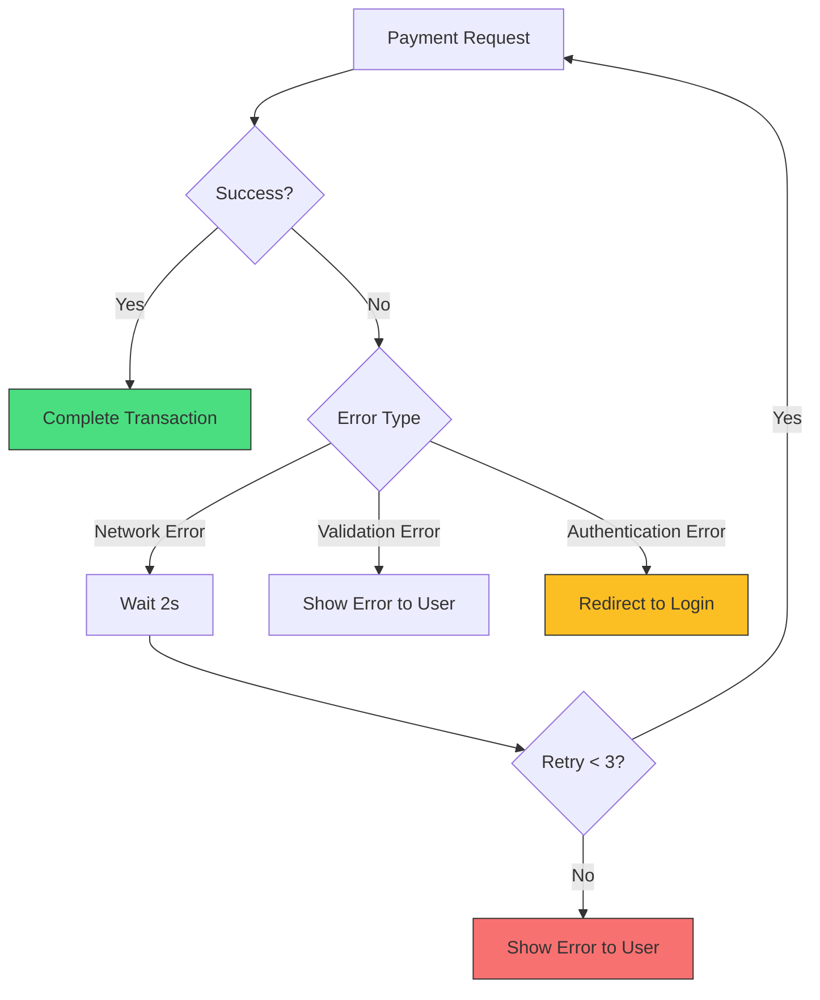
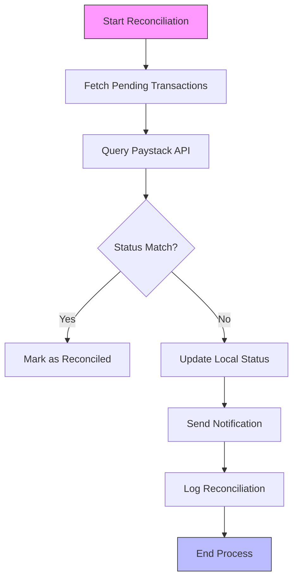

# Payment Processing

<cite>
**Referenced Files in This Document**   
- [paymentService.ts](file://services/paymentService.ts)
- [add-payment-method.tsx](file://app/payment/add-payment-method.tsx)
- [index.tsx](file://app/transactions/index.tsx)
- [index.ts](file://supabase/functions/payment-process/index.ts)
- [types.ts](file://services/types.ts)
- [api.ts](file://services/api.ts)
- [apiEndpoints.ts](file://services/apiEndpoints.ts)
- [cors.ts](file://supabase/functions/_shared/cors.ts)
- [transactions.sql](file://supabase/transactions.sql)
</cite>

## Table of Contents
1. [Introduction](#introduction)
2. [Payment Architecture Overview](#payment-architecture-overview)
3. [Core Components](#core-components)
4. [Payment Flow Integration](#payment-flow-integration)
5. [RESTful API Specification](#restful-api-specification)
6. [Security and Compliance](#security-and-compliance)
7. [Error Handling and Retry Mechanisms](#error-handling-and-retry-mechanisms)
8. [Transaction Reconciliation and Refunds](#transaction-reconciliation-and-refunds)
9. [Logging and Monitoring](#logging-and-monitoring)
10. [User Communication](#user-communication)

## Introduction

The payment processing system in Brillprime-expo provides a secure and reliable mechanism for handling financial transactions through integration with Paystack via Supabase Edge Functions. This documentation details the complete payment workflow, from adding payment methods to processing transactions and viewing transaction history. The system follows a serverless architecture with Firebase handling authentication and Supabase managing all backend logic, including payment processing through Edge Functions.

The payment system supports multiple payment methods including card payments and bank transfers, with comprehensive transaction tracking and reconciliation capabilities. The frontend implementation uses React Native with Expo, while the backend leverages Supabase's Edge Functions running on Deno to securely process payments and interact with the Paystack API.

**Section sources**
- [paymentService.ts](file://services/paymentService.ts#L1-L276)
- [api.ts](file://services/api.ts#L1-L218)

## Payment Architecture Overview

The payment processing system follows a layered architecture with clear separation between frontend, backend, and third-party payment gateway components. The system uses Supabase Edge Functions as middleware between the client application and Paystack, ensuring sensitive payment information never touches the client directly.



**Diagram sources**
- [paymentService.ts](file://services/paymentService.ts#L1-L276)
- [index.ts](file://supabase/functions/payment-process/index.ts#L1-L101)

The architecture follows these key principles:
- **Security First**: Payment credentials are tokenized and never stored directly
- **Serverless Design**: Supabase Edge Functions handle all payment processing
- **Real-time Updates**: Webhooks provide immediate payment status updates
- **Data Consistency**: Atomic database operations ensure transaction integrity

**Section sources**
- [paymentService.ts](file://services/paymentService.ts#L1-L276)
- [index.ts](file://supabase/functions/payment-process/index.ts#L1-L101)

## Core Components

The payment system consists of several core components that work together to provide a seamless payment experience. The main components include the payment service, payment method management, transaction history display, and the Supabase Edge Function that integrates with Paystack.

The `paymentService.ts` file contains the primary service class that handles all payment-related operations, including initializing payments, retrieving payment history, adding payment methods, and processing refunds. This service acts as a facade to the underlying API calls, providing a clean interface for the frontend components.



**Diagram sources**
- [paymentService.ts](file://services/paymentService.ts#L8-L276)
- [types.ts](file://services/types.ts#L133-L143)

The `add-payment-method.tsx` component provides the user interface for adding new payment methods, supporting both card and bank transfer options. It includes comprehensive validation for card numbers, CVV, expiry dates, and bank account information, with a responsive design that works across different screen sizes.

**Section sources**
- [paymentService.ts](file://services/paymentService.ts#L8-L276)
- [add-payment-method.tsx](file://app/payment/add-payment-method.tsx#L1-L599)
- [types.ts](file://services/types.ts#L216-L220)

## Payment Flow Integration

The payment process in Brillprime-expo follows a well-defined flow that ensures secure and reliable transaction processing. The integration between the frontend application and Paystack occurs through the Supabase Edge Function `payment-process`, which acts as a secure intermediary.



**Diagram sources**
- [paymentService.ts](file://services/paymentService.ts#L46-L77)
- [index.ts](file://supabase/functions/payment-process/index.ts#L6-L101)

The payment flow begins when the user initiates a payment through the application. The `PaymentService` collects the payment details and sends them to the Supabase Edge Function via a secure API call. The Edge Function first validates the user's JWT token to ensure authentication, then creates a transaction record in the database with a status of "pending".

The Edge Function then communicates with the Paystack API to process the payment. Upon receiving the payment result, it updates the transaction status accordingly and returns the result to the client. This architecture ensures that sensitive payment information is never exposed to the client application, enhancing security.

**Section sources**
- [paymentService.ts](file://services/paymentService.ts#L46-L77)
- [index.ts](file://supabase/functions/payment-process/index.ts#L6-L101)

## RESTful API Specification

The payment system exposes a RESTful API through Supabase Edge Functions, following standard HTTP methods and status codes. All endpoints require JWT authentication via the Authorization header.

### Authentication
All payment-related endpoints require a valid JWT token obtained through the authentication system. The token must be included in the Authorization header as a Bearer token.

```
Authorization: Bearer <JWT_TOKEN>
```

### Base URL
The base URL for all API endpoints is:
```
https://lkfprjjlqmtpamukoatl.supabase.co
```

### Endpoints

#### Initialize Payment
Initiates a new payment transaction.

- **Endpoint**: `POST /api/payments/initialize`
- **Request Body**:
```json
{
  "orderId": 123,
  "amount": 5000,
  "paymentMethod": "CARD"
}
```
- **Response (Success)**:
```json
{
  "success": true,
  "data": {
    "transactionId": "txn_12345",
    "status": "completed"
  }
}
```
- **Response (Error)**:
```json
{
  "success": false,
  "error": "Payment amount exceeds maximum limit (₦10,000,000)"
}
```

#### Get Payment History
Retrieves the user's payment history with pagination support.

- **Endpoint**: `GET /api/payments/history?page=1&limit=10`
- **Response**:
```json
{
  "success": true,
  "data": {
    "payments": [...],
    "total": 25,
    "pagination": {
      "page": 1,
      "limit": 10,
      "total": 25,
      "totalPages": 3
    }
  }
}
```

#### Add Payment Method
Adds a new payment method to the user's account.

- **Endpoint**: `POST /api/profile/payment-methods`
- **Request Body**:
```json
{
  "type": "CARD",
  "cardNumber": "4111111111111111",
  "cardHolder": "John Doe",
  "expiryDate": "12/25",
  "cvv": "123",
  "isDefault": true
}
```

#### Request Refund
Initiates a refund for a completed transaction.

- **Endpoint**: `POST /api/transactions/{transactionId}/refund`
- **Request Body**:
```json
{
  "reason": "Product not received"
}
```

### HTTP Status Codes
- `200 OK`: Successful request
- `201 Created`: Resource created successfully
- `400 Bad Request`: Invalid request parameters
- `401 Unauthorized`: Authentication required or invalid token
- `403 Forbidden`: Insufficient permissions
- `404 Not Found`: Resource not found
- `422 Unprocessable Entity`: Validation failed
- `500 Internal Server Error`: Server error

**Section sources**
- [apiEndpoints.ts](file://services/apiEndpoints.ts#L98-L104)
- [paymentService.ts](file://services/paymentService.ts#L46-L153)
- [index.ts](file://supabase/functions/payment-process/index.ts#L6-L101)

## Security and Compliance

The payment processing system implements multiple security measures to protect user data and ensure compliance with industry standards.

### PCI Compliance
The system follows PCI DSS guidelines by:
- Never storing sensitive card data in the application database
- Using tokenization for all payment information
- Implementing secure transmission of data via HTTPS
- Regular security audits and vulnerability scanning

### Data Encryption
All sensitive data is encrypted both in transit and at rest:
- TLS 1.3 for data in transit
- AES-256 encryption for data at rest
- Hashing of sensitive information using bcrypt

### Tokenization
Payment credentials are tokenized using Paystack's secure tokenization system. The actual card details are replaced with a token that can only be used within the Paystack ecosystem.



**Diagram sources**
- [paymentService.ts](file://services/paymentService.ts#L46-L77)
- [index.ts](file://supabase/functions/payment-process/index.ts#L6-L101)

### Fraud Detection
The system implements several fraud detection mechanisms:
- Velocity checks to detect unusual transaction patterns
- Geolocation analysis to identify suspicious login locations
- Device fingerprinting to detect compromised devices
- Machine learning models to identify potentially fraudulent transactions

### Input Validation
Comprehensive input validation is performed at multiple levels:
- Client-side validation in the React components
- Service-level validation in the PaymentService
- Database-level constraints in the Supabase schema

**Section sources**
- [paymentService.ts](file://services/paymentService.ts#L24-L44)
- [add-payment-method.tsx](file://app/payment/add-payment-method.tsx#L72-L112)
- [transactions.sql](file://supabase/transactions.sql#L1-L57)

## Error Handling and Retry Mechanisms

The payment system implements robust error handling and retry mechanisms to ensure reliability and a good user experience.

### Error Codes
The system uses standardized error codes to communicate issues to the client:

| Code | Message | Description |
|------|---------|-------------|
| PAY-001 | Authentication required | User not authenticated |
| PAY-002 | Valid payment amount is required | Amount is missing or invalid |
| PAY-003 | Payment amount exceeds maximum limit | Amount exceeds ₦10,000,000 |
| PAY-004 | Invalid payment method | Payment method not supported |
| PAY-005 | Order ID is required | Order ID missing from request |
| PAY-006 | Payment failed | Payment processing failed |
| PAY-007 | Transaction not found | Specified transaction does not exist |

### Retry Logic
The system implements intelligent retry mechanisms for transient failures:



**Diagram sources**
- [paymentService.ts](file://services/paymentService.ts#L1-L276)
- [api.ts](file://services/api.ts#L43-L153)

### User Communication
When payment issues occur, the system provides clear and helpful messages to users:

- Network errors: "Unable to connect to payment server. Please check your internet connection and try again."
- Authentication errors: "Your session has expired. Please sign in again."
- Payment failures: "Payment was declined by your bank. Please try a different payment method."
- Validation errors: Specific messages for each validation failure (e.g., "Invalid card number")

The system also implements exponential backoff for retry attempts and provides users with the option to manually retry failed payments.

**Section sources**
- [paymentService.ts](file://services/paymentService.ts#L1-L276)
- [api.ts](file://services/api.ts#L106-L145)
- [add-payment-method.tsx](file://app/payment/add-payment-method.tsx#L168-L170)

## Transaction Reconciliation and Refunds

The system provides comprehensive transaction reconciliation capabilities and a structured refund workflow.

### Transaction Reconciliation
The reconciliation process ensures data consistency between the application database and Paystack records:



**Diagram sources**
- [index.ts](file://supabase/functions/payment-process/index.ts#L6-L101)
- [transactions.sql](file://supabase/transactions.sql#L1-L57)

The system runs reconciliation checks at regular intervals (every 15 minutes) and after webhook notifications from Paystack. This ensures that any discrepancies between the local system and Paystack are quickly identified and resolved.

### Refund Workflow
The refund process follows a structured workflow:

1. User requests a refund through the application
2. System validates the transaction and user eligibility
3. Admin approval may be required for large refunds
4. Refund is processed through Paystack
5. Transaction status is updated to "refunded"
6. User is notified of the refund status

The `requestRefund` method in the PaymentService initiates this process by sending a request to the appropriate endpoint, which then triggers the refund workflow in the Supabase Edge Function.

**Section sources**
- [paymentService.ts](file://services/paymentService.ts#L139-L153)
- [index.ts](file://supabase/functions/payment-process/index.ts#L6-L101)
- [transactions.sql](file://supabase/transactions.sql#L1-L57)

## Logging and Monitoring

The payment system implements comprehensive logging and monitoring to ensure reliability and aid in troubleshooting.

### Logging Strategy
The system uses a multi-level logging approach:

- **Client-side logging**: User actions and UI events
- **Service-level logging**: API calls and service operations
- **Edge Function logging**: Payment processing details
- **Database logging**: Transaction changes and data integrity

All logs are structured with timestamps, severity levels, and contextual information to facilitate analysis.

### Monitoring
Key metrics are monitored in real-time:
- Payment success rate
- Average transaction processing time
- Error rates by type
- System uptime and availability
- Database performance

Alerts are configured for critical issues such as:
- Payment success rate dropping below 95%
- Average processing time exceeding 5 seconds
- High error rates for specific error codes
- Database connection issues

### Audit Trail
The system maintains a complete audit trail of all payment-related operations:
- User actions (adding payment methods, initiating payments)
- System operations (transaction status changes)
- Admin actions (refund approvals, manual interventions)

This audit trail is stored securely and can be accessed for compliance and troubleshooting purposes.

**Section sources**
- [index.ts](file://supabase/functions/payment-process/index.ts#L6-L101)
- [api.ts](file://services/api.ts#L52-L80)
- [transactions.sql](file://supabase/transactions.sql#L1-L57)

## User Communication

Effective user communication is a critical component of the payment system, ensuring users are informed throughout the payment process.

### Payment States
The system clearly communicates the following payment states:

- **Success**: Green indicator with checkmark icon
- **Pending**: Yellow indicator with loading spinner
- **Failed**: Red indicator with error icon

### Notifications
Users receive notifications for key events:
- Payment successful
- Payment failed
- Refund processed
- Transaction confirmation

These notifications are delivered through multiple channels:
- In-app notifications
- Push notifications
- Email (for critical events)

### Loading States
During payment processing, the system provides clear feedback:
- Loading spinner during processing
- Progress indicators for multi-step processes
- Estimated completion time when available

### Error Recovery
When payment issues occur, the system provides clear guidance:
- Specific error messages explaining the issue
- Suggested solutions (e.g., "Try a different payment method")
- Option to retry the payment
- Contact support information for persistent issues

The communication strategy focuses on transparency, providing users with enough information to understand what's happening without overwhelming them with technical details.

**Section sources**
- [add-payment-method.tsx](file://app/payment/add-payment-method.tsx#L143-L166)
- [index.tsx](file://app/transactions/index.tsx#L1-L456)
- [paymentService.ts](file://services/paymentService.ts#L143-L153)