# Product Management

<cite>
**Referenced Files in This Document**   
- [commodityService.ts](file://services/commodityService.ts)
- [commodity/[id].tsx](file://app/commodity/[id].tsx)
- [commodities.tsx](file://app/commodity/commodities.tsx)
- [add-commodity.tsx](file://app/merchant/add-commodity.tsx)
- [merchant/commodities.tsx](file://app/merchant/commodities.tsx)
- [merchantService.ts](file://services/merchantService.ts)
- [commodityUtils.ts](file://utils/commodityUtils.ts)
- [OptimizedImage.tsx](file://components/OptimizedImage.tsx)
- [SearchBar.tsx](file://app/_components/SearchBar.tsx)
</cite>

## Table of Contents
1. [Introduction](#introduction)
2. [Commodity Service Architecture](#commodity-service-architecture)
3. [CRUD Operations Implementation](#crud-operations-implementation)
4. [Merchant-Specific Workflows](#merchant-specific-workflows)
5. [Integration with Merchant Service](#integration-with-merchant-service)
6. [Request/Response Payloads and Error Handling](#requestresponse-payloads-and-error-handling)
7. [Performance Considerations](#performance-considerations)
8. [Search and Filtering Behavior](#search-and-filtering-behavior)
9. [Conclusion](#conclusion)

## Introduction
The product/commodity management system in Brillprime-expo provides a comprehensive solution for managing products within the application. This system enables merchants to create, view, update, and delete commodities while allowing consumers to browse and purchase products. The architecture leverages Supabase for backend operations, Firebase for authentication, and React Native for the frontend interface. The system is designed to handle product listings, individual product details, inventory management, and merchant-specific workflows efficiently.

## Commodity Service Architecture
The commodity management system is centered around the `commodityService.ts` file, which implements a class-based service architecture for handling all product-related operations. This service interacts with Supabase for database operations and storage management, providing a clean abstraction layer between the frontend components and backend services.

```mermaid
classDiagram
class CommodityService {
+STORAGE_BUCKET : string
+uploadImage(imageUri : string, commodityId : string) : Promise<{ success : boolean; url? : string; error? : string }>
+deleteImage(imageUrl : string) : Promise<boolean>
+getMerchantId() : Promise<{ success : boolean; merchantId? : string; error? : string }>
+createCommodity(formData : CommodityFormData) : Promise<{ success : boolean; commodity? : Commodity; error? : string }>
+updateCommodity(commodityId : string, formData : CommodityFormData, oldImageUrl? : string) : Promise<{ success : boolean; commodity? : Commodity; error? : string }>
+getCommodityById(commodityId : string) : Promise<{ success : boolean; commodity? : Commodity; error? : string }>
+getMerchantCommodities() : Promise<{ success : boolean; commodities? : Commodity[]; error? : string }>
+deleteCommodity(commodityId : string, imageUrl? : string) : Promise<{ success : boolean; error? : string }>
+toggleAvailability(commodityId : string, isAvailable : boolean) : Promise<{ success : boolean; error? : string }>
}
class Commodity {
+id : string
+merchant_id : string
+name : string
+description : string
+category : string
+unit : string
+price : number
+stock_quantity : number
+image_url? : string
+is_available : boolean
+created_at? : string
+updated_at? : string
+merchant? : Merchant
}
class Merchant {
+id : string
+business_name : string
+user_id : string
}
class CommodityFormData {
+name : string
+description : string
+category : string
+unit : string
+price : string
+availableQuantity : string
+minOrderQuantity : string
+images : string[]
+specifications : Record<string, any>
+tags : string[]
}
CommodityService --> Commodity : "manages"
CommodityService --> Merchant : "associates"
CommodityService --> CommodityFormData : "uses"
```

**Diagram sources**
- [commodityService.ts](file://services/commodityService.ts#L27-L386)

**Section sources**
- [commodityService.ts](file://services/commodityService.ts#L1-L387)

## CRUD Operations Implementation
The commodity service implements comprehensive CRUD (Create, Read, Update, Delete) operations for product management. Each operation follows a consistent pattern of validation, database interaction, and error handling.

### Create Operation
The `createCommodity` method handles the creation of new products. It first verifies the merchant's identity, then uploads any product images to Supabase Storage, and finally creates the product record in the database.

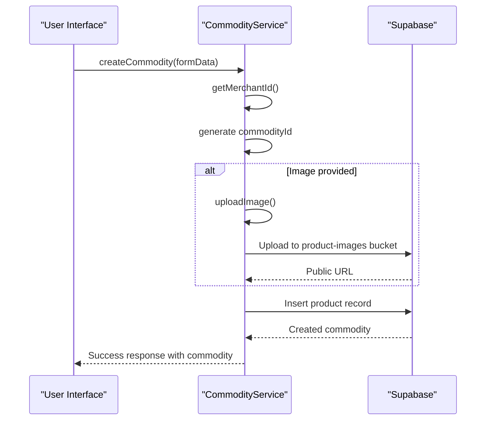

**Diagram sources**
- [commodityService.ts](file://services/commodityService.ts#L163-L210)

### Read Operations
The service provides multiple methods for retrieving product data:
- `getCommodityById`: Fetches a specific product with its associated merchant information
- `getMerchantCommodities`: Retrieves all products for the current merchant

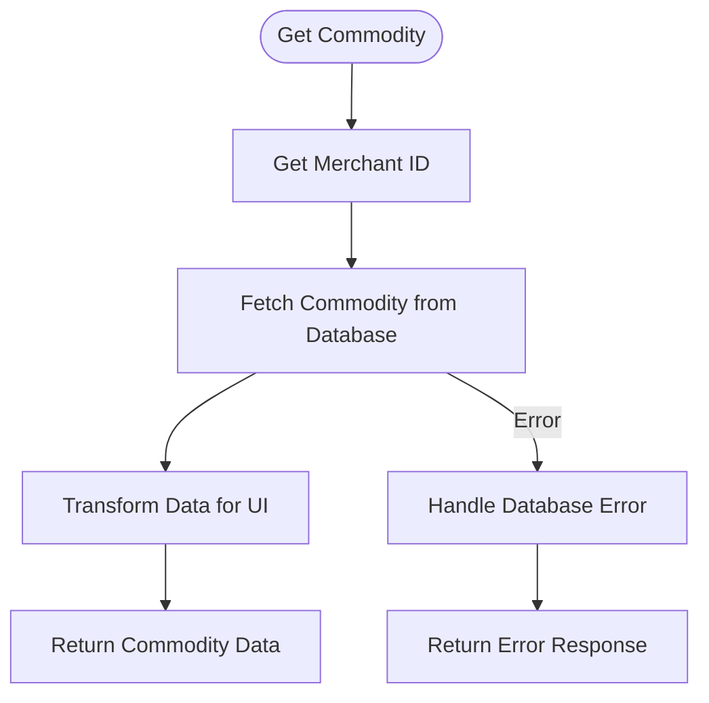

**Diagram sources**
- [commodityService.ts](file://services/commodityService.ts#L279-L304)

### Update Operation
The update process carefully manages image updates to prevent data loss. It uploads the new image before updating the database record and only deletes the old image after successful database update.

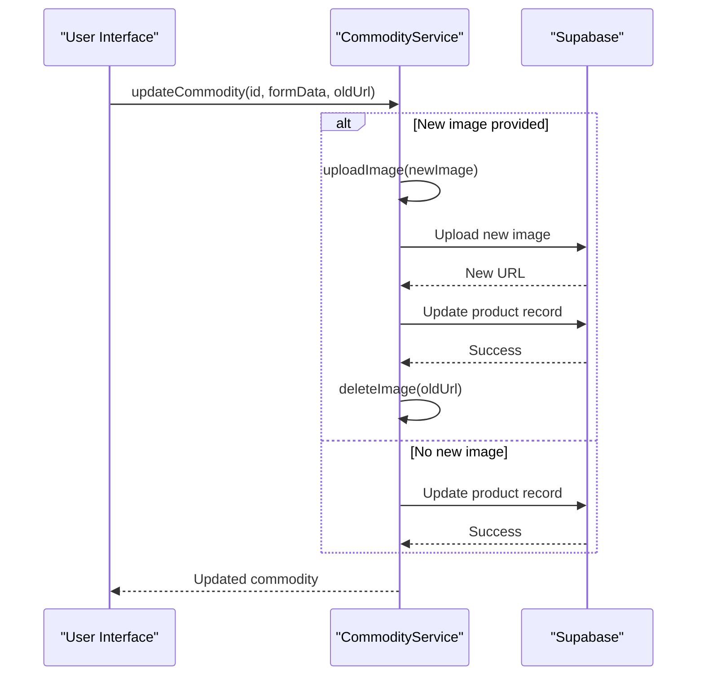

**Diagram sources**
- [commodityService.ts](file://services/commodityService.ts#L216-L273)

### Delete Operation
The delete operation follows a safe pattern by first removing the image from storage and then deleting the database record.

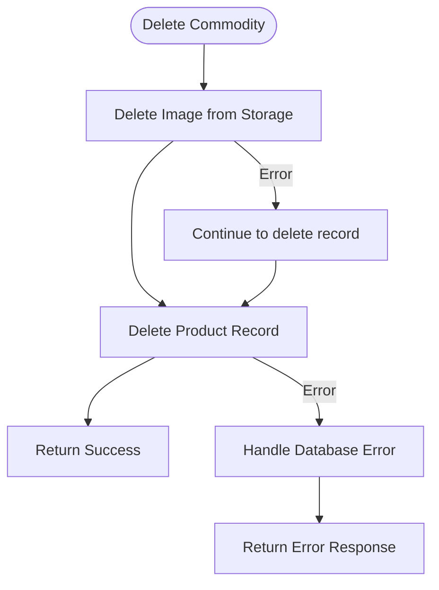

**Diagram sources**
- [commodityService.ts](file://services/commodityService.ts#L337-L360)

## Merchant-Specific Workflows
The system provides dedicated workflows for merchants to manage their products through the `add-commodity.tsx` and `merchant/commodities.tsx` components.

### Add Commodity Workflow
The `add-commodity.tsx` component provides a form interface for merchants to create or edit products. It includes validation, image selection, and category selection functionality.

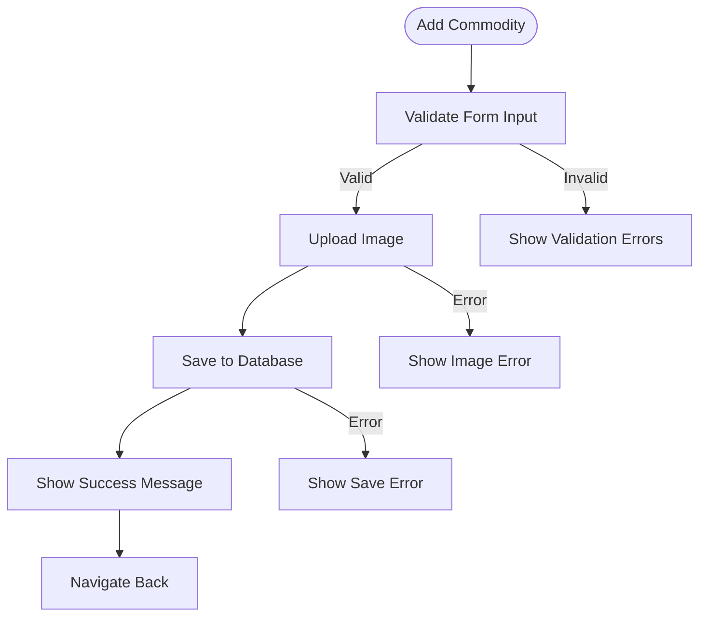

**Section sources**
- [add-commodity.tsx](file://app/merchant/add-commodity.tsx#L1-L718)

### View Commodities Workflow
The `merchant/commodities.tsx` component displays a merchant's product catalog with options to edit, delete, and toggle availability.

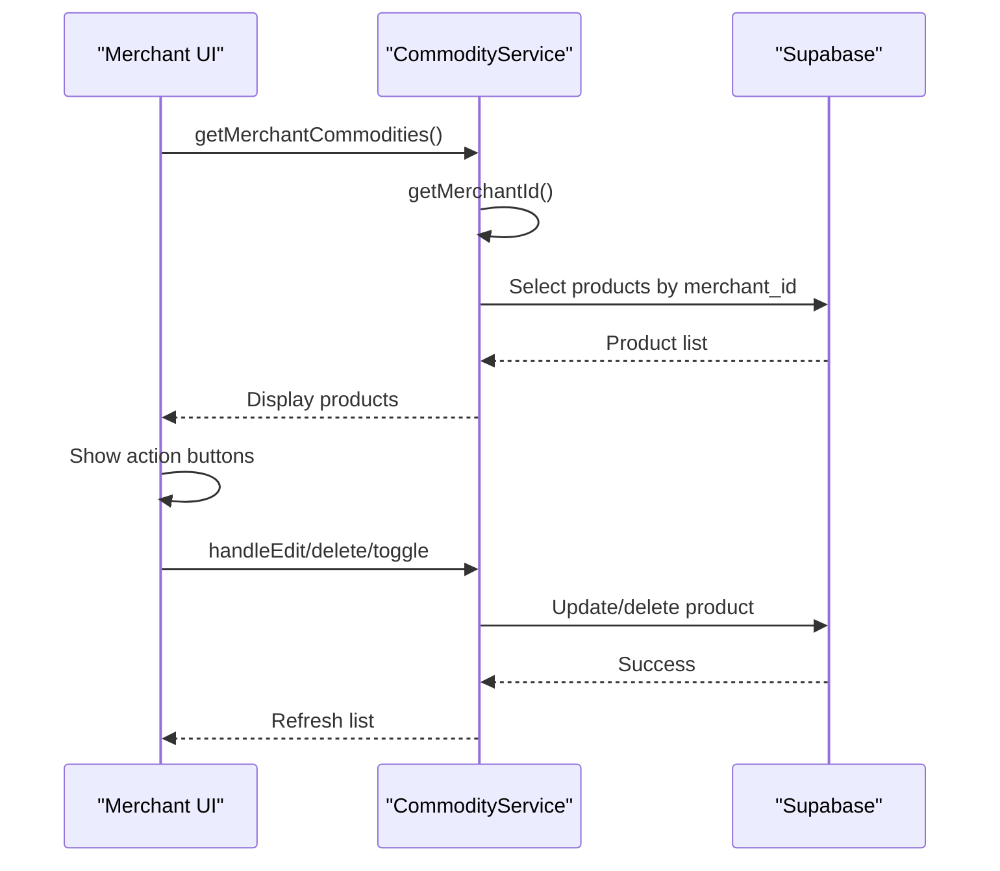

**Section sources**
- [merchant/commodities.tsx](file://app/merchant/commodities.tsx#L1-L401)

## Integration with Merchant Service
The commodity management system integrates with the merchant service to associate products with specific business entities. This integration ensures that products are properly linked to merchant profiles and business information.

```mermaid
classDiagram
class commodityService {
+getMerchantId() : Promise<{ success : boolean; merchantId? : string; error? : string }>
}
class merchantService {
+getMerchantById(id : string) : Promise<Merchant | null>
+getMerchants() : Promise<Merchant[]>
+getMerchantCommodities(merchantId : string) : Promise<{ success : boolean; data? : Commodity[] }>
}
class Commodity {
+merchant? : Merchant
}
commodityService --> merchantService : "uses"
Commodity --> merchantService : "references"
```

The integration follows these key patterns:
1. Authentication verification through Firebase tokens
2. Merchant identification using user-merchant relationships
3. Business-level product association in the database
4. Consistent data structures across services

**Section sources**
- [commodityService.ts](file://services/commodityService.ts#L111-L157)
- [merchantService.ts](file://services/merchantService.ts#L110-L136)

## Request/Response Payloads and Error Handling
The system implements robust error handling and validation for all commodity operations.

### Request Payloads
When creating or updating a commodity, the request payload follows the `CommodityFormData` structure:

```json
{
  "name": "Premium Product",
  "description": "High-quality product description",
  "category": "electronics",
  "unit": "piece",
  "price": "1500",
  "availableQuantity": "50",
  "minOrderQuantity": "1",
  "images": ["https://supabase-url.com/image.jpg"],
  "specifications": {},
  "tags": []
}
```

### Response Payloads
Successful responses include the created or updated commodity:

```json
{
  "success": true,
  "commodity": {
    "id": "commodity_123",
    "merchant_id": "merchant_456",
    "name": "Premium Product",
    "description": "High-quality product description",
    "category": "electronics",
    "unit": "piece",
    "price": 1500,
    "stock_quantity": 50,
    "image_url": "https://supabase-url.com/image.jpg",
    "is_available": true,
    "created_at": "2024-01-01T00:00:00Z",
    "updated_at": "2024-01-01T00:00:00Z"
  }
}
```

### Error Handling
The system implements comprehensive error handling with user-friendly messages:

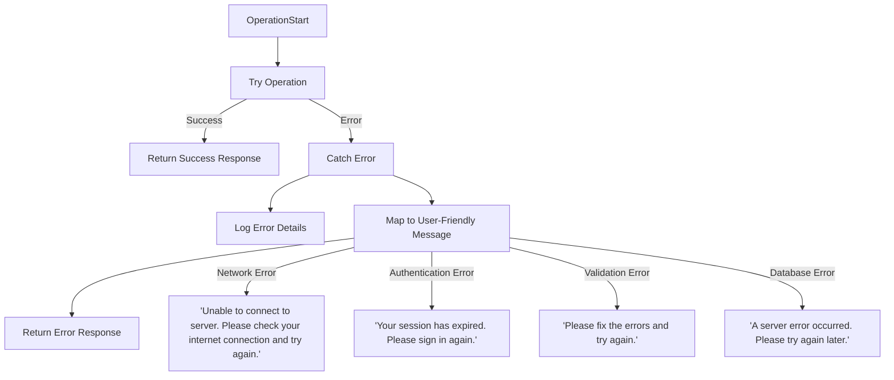

Validation rules are enforced through the `commodityUtils.ts` file, which includes:
- Name validation (required, 3-50 characters)
- Description validation (10-200 characters)
- Price validation (numeric, positive, reasonable limits)
- Category and unit validation (must be from predefined lists)

**Section sources**
- [commodityUtils.ts](file://utils/commodityUtils.ts#L99-L138)
- [commodityService.ts](file://services/commodityService.ts#L163-L210)

## Performance Considerations
The system implements several performance optimizations for handling product data and media.

### Image Optimization
The `OptimizedImage.tsx` component provides efficient image loading with fallbacks and loading indicators:

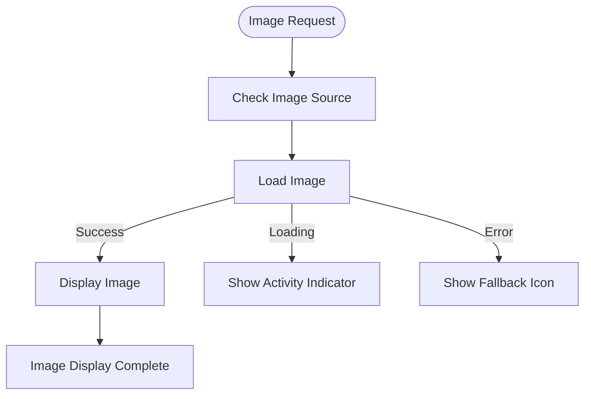

The component features:
- Loading indicators during image fetch
- Error fallback with placeholder icon
- Configurable loading behavior
- Responsive styling

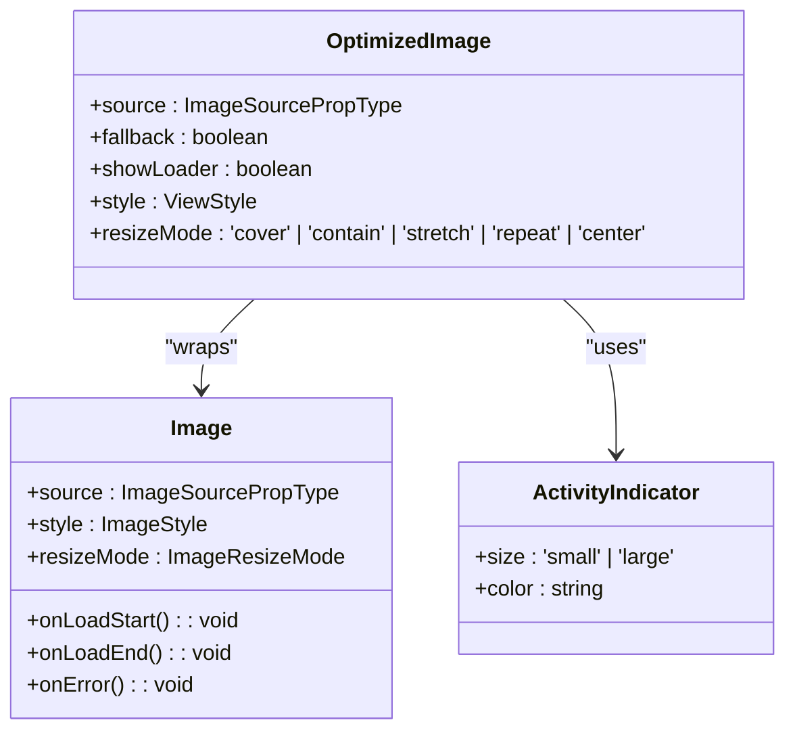

**Section sources**
- [OptimizedImage.tsx](file://components/OptimizedImage.tsx#L1-L78)

### Large Catalog Rendering
For rendering large product catalogs, the system implements:
- FlatList with efficient rendering
- Pull-to-refresh functionality
- Empty state handling
- Error recovery with retry options
- Responsive layout for different screen sizes

The `commodities.tsx` component uses a category-based browsing approach to manage large catalogs:

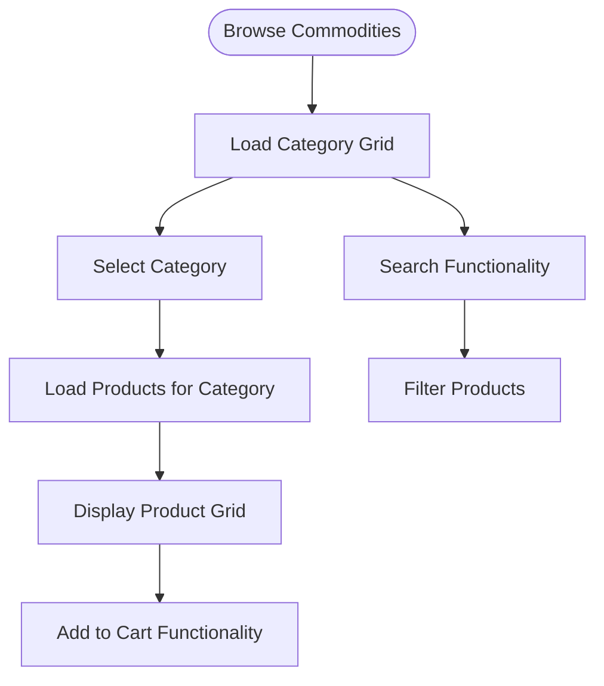

**Section sources**
- [commodities.tsx](file://app/commodity/commodities.tsx#L1-L796)

## Search and Filtering Behavior
The product management system implements search and filtering through the `SearchBar` component and integrated filtering logic.

### Search Implementation
The search functionality is integrated into the commodities browsing interface:

```mermaid
flowchart TD
Start([Search Initiated]) --> TextInput["User Types in Search Box"]
TextInput --> FilterLocal["Filter Products Locally"]
FilterLocal --> UpdateDisplay["Update Product Display"]
UpdateDisplay --> ShowResults["Show Matching Products"]
TextInput --> Debounce["Apply Debounce (300ms)"]
Debounce --> APIRequest["Optional API Search"]
APIRequest --> UpdateDisplay
class TextInput style stroke:#4682B4,stroke-width:2px
class FilterLocal style stroke:#4682B4,stroke-width:2px
class UpdateDisplay style stroke:#4682B4,stroke-width:2px
```

The search filters products by:
- Product name (case-insensitive)
- Product description (case-insensitive)
- Category name (when browsing categories)

### Filtering Architecture
The filtering system uses a combination of client-side filtering and potential server-side search:

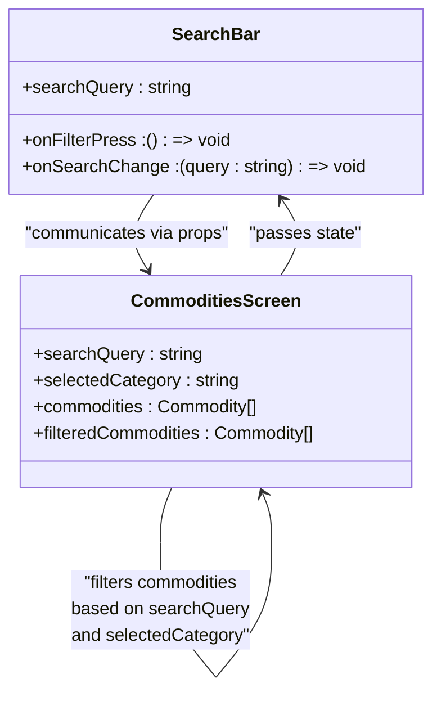

The system also implements auto-refresh functionality, refreshing the product list every minute to ensure data freshness:

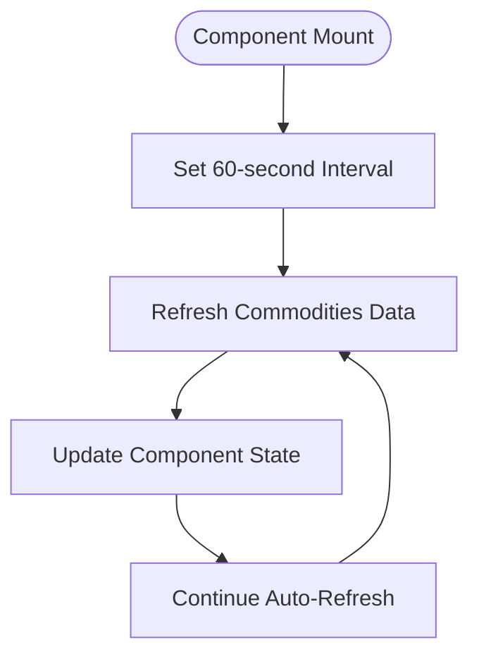

**Section sources**
- [SearchBar.tsx](file://app/_components/SearchBar.tsx#L1-L78)
- [commodities.tsx](file://app/commodity/commodities.tsx#L1-L796)

## Conclusion
The product/commodity management system in Brillprime-expo provides a robust, scalable solution for managing products in a marketplace application. The architecture effectively separates concerns between service logic, UI components, and data management, enabling efficient CRUD operations for products. Key strengths of the system include:

1. **Comprehensive CRUD operations** with proper error handling and validation
2. **Merchant-specific workflows** that streamline product management
3. **Robust integration** with merchant services for business-level associations
4. **Effective performance optimizations** for image handling and large catalogs
5. **Intuitive search and filtering** capabilities for product discovery

The system leverages Supabase for backend operations, providing a serverless architecture that scales efficiently. The use of React Query patterns (evident in the dataconnect-generated code) suggests a sophisticated caching strategy that enhances performance and user experience. Overall, the implementation demonstrates a well-architected approach to product management in a modern mobile application.