# Database Schema Design

<cite>
**Referenced Files in This Document**   
- [schema.sql](file://supabase/schema.sql)
- [rls-policies.sql](file://supabase/rls-policies.sql)
- [realtime.sql](file://supabase/realtime.sql)
- [cart-items-table.sql](file://supabase/cart-items-table.sql)
- [driver-locations.sql](file://supabase/driver-locations.sql)
- [transactions.sql](file://supabase/transactions.sql)
- [reviews-enhancements.sql](file://supabase/reviews-enhancements.sql)
- [privacy-settings.sql](file://supabase/privacy-settings.sql)
- [messages-attachments.sql](file://supabase/messages-attachments.sql)
- [storage-setup.sql](file://supabase/storage-setup.sql)
- [seed-comprehensive-data.sql](file://supabase/seed-comprehensive-data.sql)
- [setup-database.sh](file://scripts/setup-database.sh)
- [seed-database.sh](file://scripts/seed-database.sh)
</cite>

## Table of Contents
1. [Introduction](#introduction)
2. [Core Entity Relationships](#core-entity-relationships)
3. [Data Model Schema](#data-model-schema)
4. [Row Level Security Policies](#row-level-security-policies)
5. [Real-time Subscription Capabilities](#real-time-subscription-capabilities)
6. [Specialized Tables](#specialized-tables)
7. [Data Validation and Integrity](#data-validation-and-integrity)
8. [Migration Strategy and Version Control](#migration-strategy-and-version-control)
9. [Storage Configuration](#storage-configuration)
10. [Conclusion](#conclusion)

## Introduction
The Brillprime-expo application utilizes a Supabase backend to manage its data persistence layer, implementing a comprehensive database schema that supports e-commerce functionality for consumers, merchants, and delivery drivers. This documentation provides a detailed overview of the database schema design, focusing on the core entities: users, merchants, commodities, orders, transactions, reviews, and messages. The schema incorporates modern database practices including Row Level Security (RLS), real-time subscriptions, geolocation support, and robust data integrity constraints. The system is designed to support a multi-role marketplace with strict access controls and real-time updates.

**Section sources**
- [schema.sql](file://supabase/schema.sql#L1-L233)
- [setup-database.sh](file://scripts/setup-database.sh#L1-L47)

## Core Entity Relationships
The database schema is structured around a central marketplace model where users interact with merchants to purchase commodities through orders, with transactions, reviews, and messages forming additional relationship layers. The primary entities and their relationships are as follows:

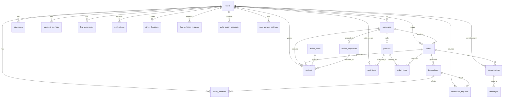

**Diagram sources**
- [schema.sql](file://supabase/schema.sql#L8-L197)
- [transactions.sql](file://supabase/transactions.sql#L4-L124)
- [reviews-enhancements.sql](file://supabase/reviews-enhancements.sql#L5-L131)

**Section sources**
- [schema.sql](file://supabase/schema.sql#L8-L197)

## Data Model Schema
The database schema consists of multiple interconnected tables that represent the core business entities of the Brillprime-expo application. Each table is designed with appropriate data types, constraints, and indexes to ensure data integrity and query performance.

### Users Table
The `users` table serves as the foundation of the system, storing user accounts synced from Firebase authentication. It includes basic profile information, contact details, and role-based access control.

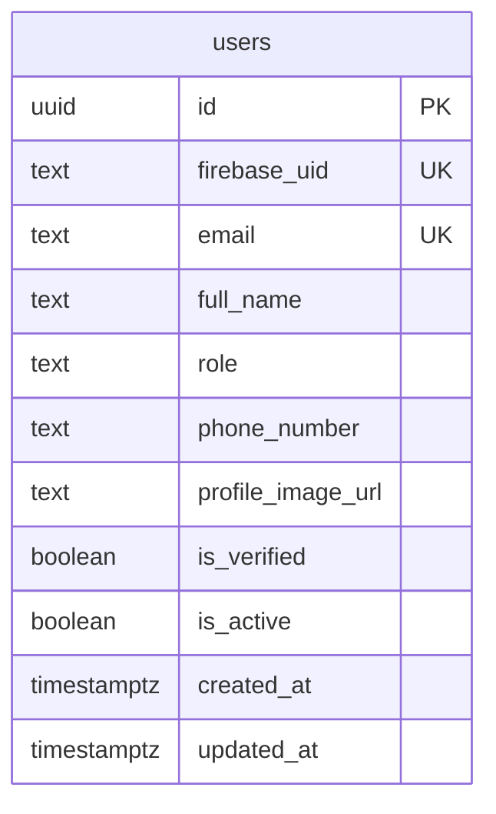

**Diagram sources**
- [schema.sql](file://supabase/schema.sql#L8-L21)

### Merchants Table
The `merchants` table extends user accounts to represent business entities, storing merchant-specific information including business details, location data, and operational status.

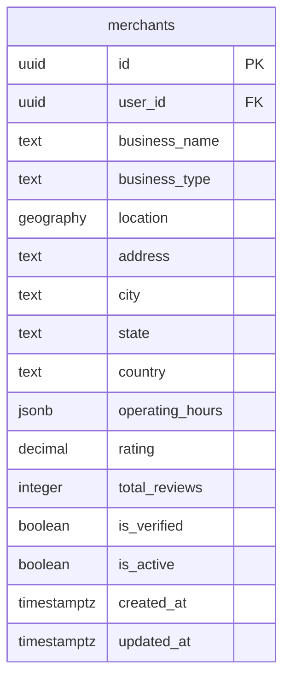

**Diagram sources**
- [schema.sql](file://supabase/schema.sql#L34-L52)

### Products Table
The `products` table (referred to as commodities in the application) stores inventory items available for purchase, with relationships to merchants and pricing information.

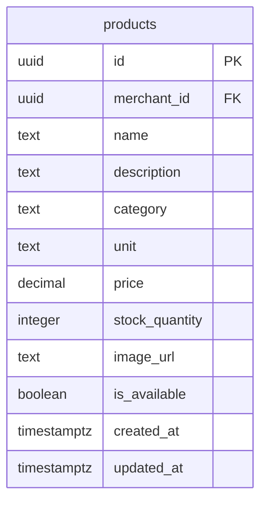

**Diagram sources**
- [schema.sql](file://supabase/schema.sql#L54-L68)

### Orders Table
The `orders` table manages transactional records of purchases, tracking order status, pricing, delivery details, and associated users and merchants.

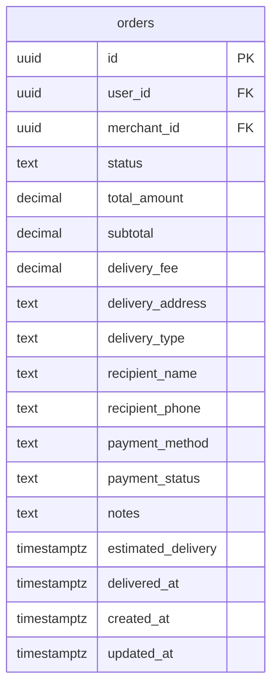

**Diagram sources**
- [schema.sql](file://supabase/schema.sql#L70-L89)

### Transactions Table
The `transactions` table records all financial activities within the system, including payments, refunds, withdrawals, and commissions, providing a complete audit trail.

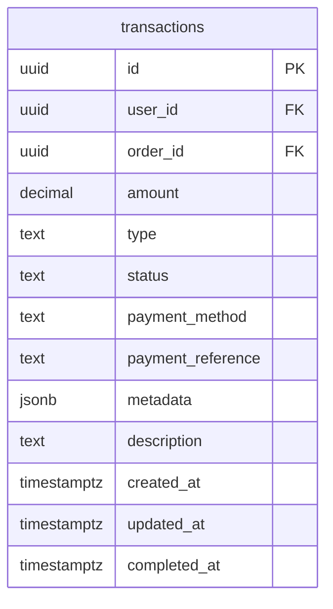

**Diagram sources**
- [transactions.sql](file://supabase/transactions.sql#L5-L19)

### Reviews Table
The `reviews` table captures user feedback on merchant services, with ratings and comments linked to specific orders and merchants.

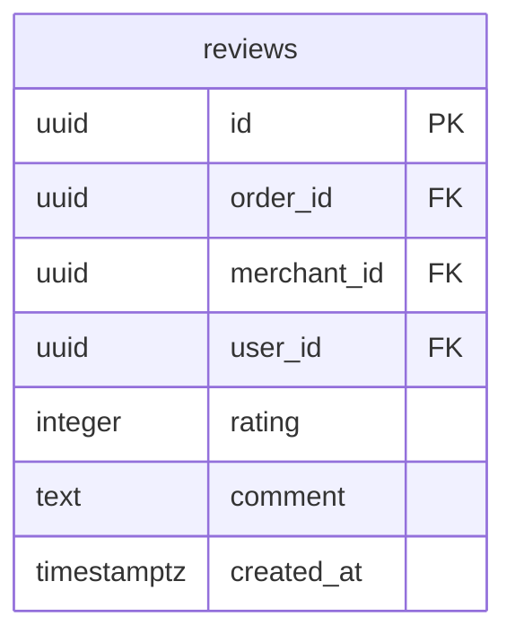

**Diagram sources**
- [schema.sql](file://supabase/schema.sql#L188-L197)

### Messages Table
The `messages` table supports communication between users through conversations, enabling real-time messaging functionality.

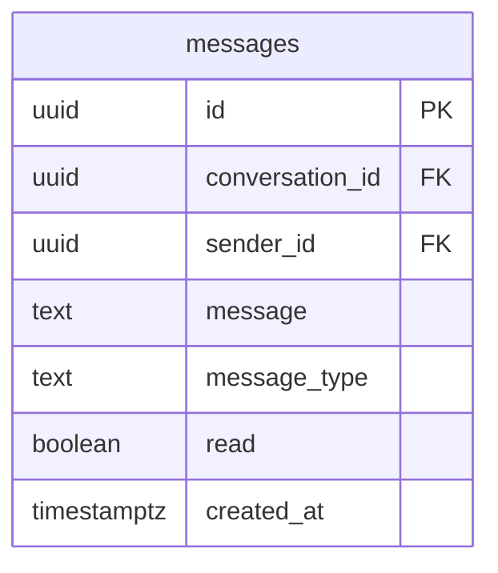

**Diagram sources**
- [schema.sql](file://supabase/schema.sql#L131-L140)

## Row Level Security Policies
The database implements comprehensive Row Level Security (RLS) policies to enforce data access controls based on user roles and ownership. These policies ensure that users can only access data they are authorized to view or modify.

### Users Table Policies
- **Select Policy**: Users can only view their own data based on Firebase UID
- **Update Policy**: Users can only update their own data
- **Insert Policy**: Anyone can insert new users (during registration)

### Merchants Table Policies
- **Select Policy**: Anyone can view active merchants
- **Update Policy**: Merchants can only update their own data
- **Insert Policy**: Users can create merchant profiles linked to their account

### Products Table Policies
- **Select Policy**: Anyone can view available products
- **All Policy**: Merchants can manage only their own products

### Orders Table Policies
- **Select Policy**: Users can view orders they placed or received as a merchant
- **Insert Policy**: Users can create orders with their user ID
- **Update Policy**: Users and merchants can update orders they are associated with

### Transactions Table Policies
- **Select Policy**: Users can only view their own transactions
- **Insert Policy**: System can insert transactions (via service role)
- **Update Policy**: System can update transactions

### Reviews Table Policies
- **Select Policy**: Anyone can view reviews
- **Insert Policy**: Users can create reviews for their own orders

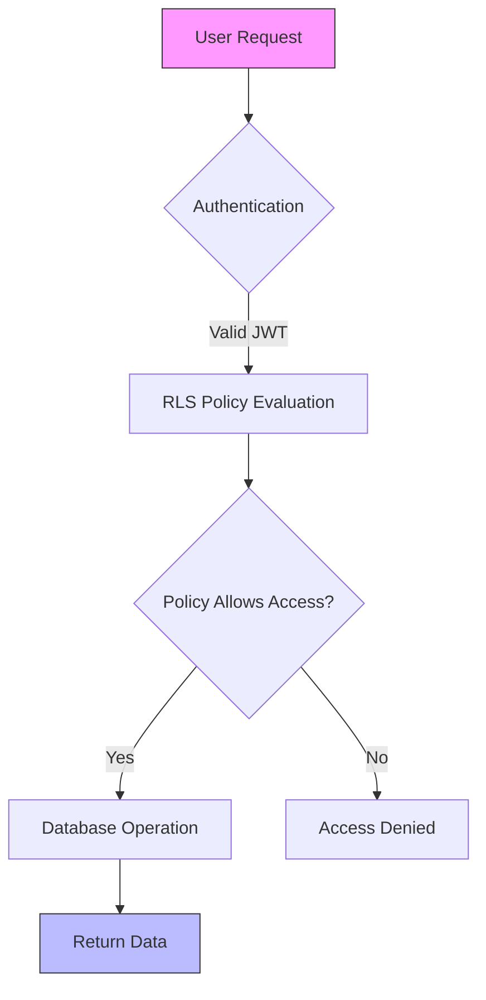

**Diagram sources**
- [rls-policies.sql](file://supabase/rls-policies.sql#L1-L199)
- [cart-items-table.sql](file://supabase/cart-items-table.sql#L13-L39)
- [driver-locations.sql](file://supabase/driver-locations.sql#L22-L40)
- [transactions.sql](file://supabase/transactions.sql#L57-L103)

**Section sources**
- [rls-policies.sql](file://supabase/rls-policies.sql#L1-L199)

## Real-time Subscription Capabilities
The database enables real-time functionality through Supabase's Realtime service, allowing clients to subscribe to changes in specific tables and receive updates instantly.

### Realtime Configuration
The `realtime.sql` script configures the publication of tables for real-time subscriptions:

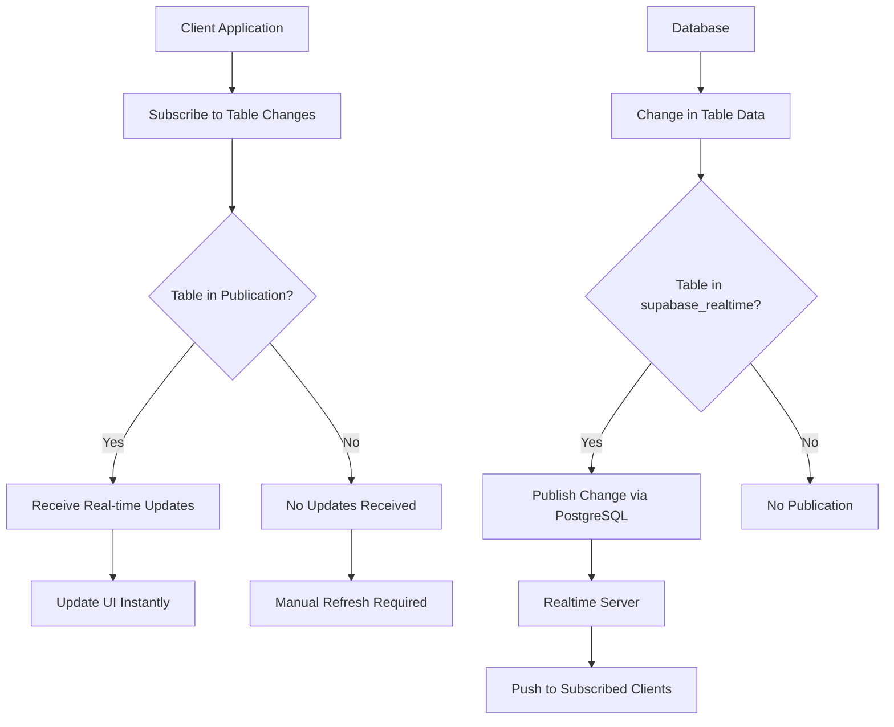

**Diagram sources**
- [realtime.sql](file://supabase/realtime.sql#L1-L33)

The following tables are included in the realtime publication:
- users
- orders
- order_items
- notifications
- messages
- conversations
- products
- cart_items
- driver_locations
- merchants
- user_privacy_settings
- data_deletion_requests
- data_export_requests

This configuration enables real-time features such as:
- Live order status updates
- Real-time messaging
- Instant notification delivery
- Live driver location tracking
- Cart updates across devices

**Section sources**
- [realtime.sql](file://supabase/realtime.sql#L1-L33)
- [driver-locations.sql](file://supabase/driver-locations.sql#L56-L58)

## Specialized Tables
The database includes several specialized tables that support specific application features beyond the core e-commerce functionality.

### Driver Locations Table
The `driver_locations` table enables real-time tracking of delivery personnel, storing their current position, movement data, and timestamps.

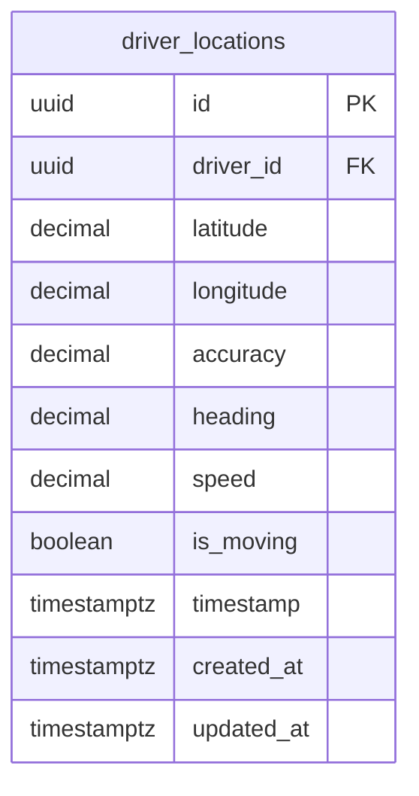

**Diagram sources**
- [driver-locations.sql](file://supabase/driver-locations.sql#L3-L16)

Key features:
- Unique constraint on driver_id to store only the latest location
- Indexes on driver_id and timestamp for efficient querying
- RLS policies allowing drivers to update their own location
- Public read access for real-time tracking by consumers and merchants

### Cart Items Table
The `cart_items` table persists users' shopping cart contents, allowing for cart recovery across sessions.

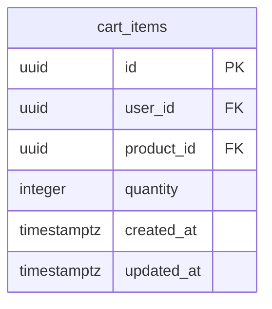

**Diagram sources**
- [cart-items-table.sql](file://supabase/cart-items-table.sql#L3-L11)

Key features:
- Composite unique constraint on user_id and product_id to prevent duplicates
- Cascade delete on user and product references
- RLS policies ensuring users can only access their own cart items

### Reviews Enhancements
The `reviews-enhancements.sql` script extends the basic reviews functionality with additional features:

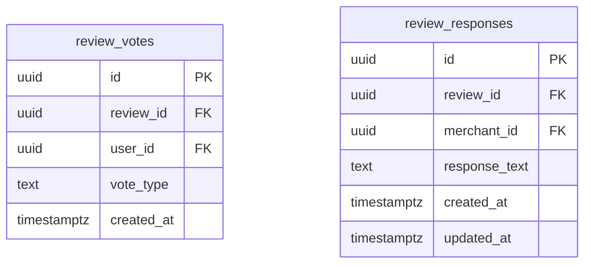

**Diagram sources**
- [reviews-enhancements.sql](file://supabase/reviews-enhancements.sql#L5-L24)

Key features:
- Review voting system allowing users to mark reviews as helpful or not helpful
- Merchant response capability to address customer feedback
- Trigger functions to maintain helpful vote counts efficiently
- Additional columns on reviews table for pre-calculated vote counts

**Section sources**
- [driver-locations.sql](file://supabase/driver-locations.sql#L1-L58)
- [cart-items-table.sql](file://supabase/cart-items-table.sql#L1-L44)
- [reviews-enhancements.sql](file://supabase/reviews-enhancements.sql#L1-L131)

## Data Validation and Integrity
The database schema incorporates multiple layers of data validation and integrity constraints to ensure data quality and consistency.

### Primary and Foreign Key Constraints
The schema enforces referential integrity through comprehensive primary and foreign key constraints:
- All tables have UUID primary keys generated automatically
- Foreign keys maintain relationships between entities
- CASCADE delete actions ensure cleanup of dependent records
- SET NULL actions preserve data when non-critical relationships are broken

### Check Constraints
Several tables implement check constraints to validate data:
- Users table: Role must be one of 'consumer', 'merchant', 'driver', 'admin'
- Orders table: Status must be one of predefined order states
- Notifications table: Type and priority must be from allowed values
- Products table: Rating must be between 0.0 and 5.0
- Reviews table: Rating must be between 1 and 5

### Unique Constraints
Unique constraints prevent duplicate data:
- Users table: Unique constraints on firebase_uid and email
- Merchants table: Unique constraint on user_id (1:1 relationship)
- Cart items table: Unique constraint on user_id and product_id combination
- Driver locations table: Unique constraint on driver_id
- Privacy settings table: Unique constraint on user_id

### Indexes for Query Performance
The schema includes strategic indexes to optimize query performance:
- B-tree indexes on frequently queried columns (user_id, merchant_id, etc.)
- GIST index on geography columns for efficient spatial queries
- GIN index on JSONB columns for fast JSON queries
- Composite indexes on commonly filtered column combinations

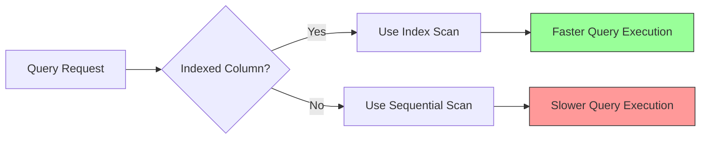

**Diagram sources**
- [schema.sql](file://supabase/schema.sql#L199-L211)
- [cart-items-table.sql](file://supabase/cart-items-table.sql#L41-L44)
- [driver-locations.sql](file://supabase/driver-locations.sql#L18-L21)
- [transactions.sql](file://supabase/transactions.sql#L47-L55)

**Section sources**
- [schema.sql](file://supabase/schema.sql#L199-L211)
- [transactions.sql](file://supabase/transactions.sql#L47-L55)

## Migration Strategy and Version Control
The database changes are managed through a structured migration strategy that ensures consistency across development, testing, and production environments.

### Migration Process
The migration process follows these steps:
1. Schema changes are defined in SQL scripts
2. Scripts are versioned and stored in the repository
3. Migrations are applied using Supabase CLI tools
4. Changes are tracked and can be rolled back if necessary

### Database Setup Scripts
The `setup-database.sh` script automates the database setup process:

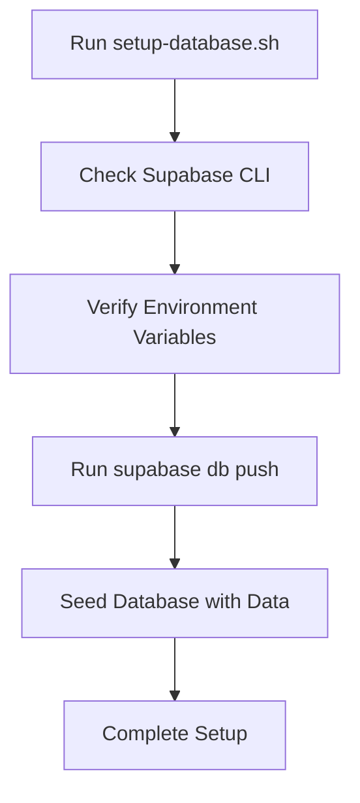

**Diagram sources**
- [setup-database.sh](file://scripts/setup-database.sh#L1-L47)

### Seeding Strategy
The database includes comprehensive seeding capabilities:
- `seed-comprehensive-data.sql` contains realistic test data
- `seed-database.sh` script automates the seeding process
- Test data includes users, merchants, products, orders, and driver locations
- Data represents real-world scenarios in Abuja, Nigeria

The seeding process ensures that developers and testers have access to consistent, realistic data for development and testing purposes.

**Section sources**
- [setup-database.sh](file://scripts/setup-database.sh#L1-L47)
- [seed-database.sh](file://scripts/seed-database.sh#L1-L39)
- [seed-comprehensive-data.sql](file://supabase/seed-comprehensive-data.sql#L1-L137)

## Storage Configuration
The database integrates with Supabase Storage to manage file uploads and attachments, with a structured bucket system for different content types.

### Storage Buckets
The `storage-setup.sql` script configures multiple storage buckets:

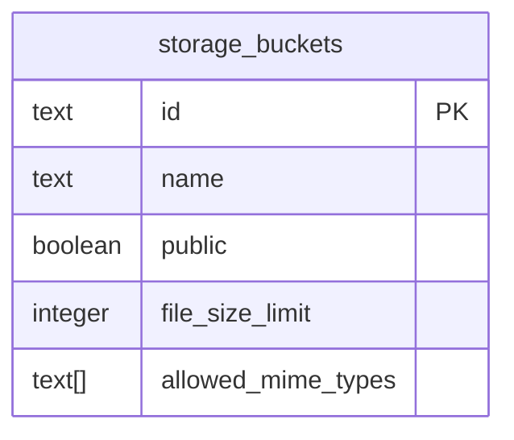

**Diagram sources**
- [storage-setup.sql](file://supabase/storage-setup.sql#L5-L47)

Configured buckets include:
- **product-images**: Public bucket for product images (5MB limit)
- **profile-images**: Public bucket for user profile images (2MB limit)
- **attachments**: Public bucket for chat attachments (10MB limit)
- **kyc-documents**: Private bucket for KYC documents (10MB limit)

### Storage Security
Each bucket has specific RLS policies:
- Authenticated users can upload to relevant buckets
- Owners can update and delete their own files
- Public buckets allow anyone to view files
- Private buckets restrict viewing to owners and admins

The storage configuration supports the application's file management needs while maintaining appropriate security controls.

**Section sources**
- [storage-setup.sql](file://supabase/storage-setup.sql#L1-L132)
- [messages-attachments.sql](file://supabase/messages-attachments.sql#L1-L21)

## Conclusion
The Brillprime-expo database schema is a comprehensive, well-structured implementation that supports a multi-role e-commerce marketplace. The design incorporates best practices in database modeling, security, and real-time functionality. Key strengths include:

1. **Robust Security**: Comprehensive RLS policies ensure data isolation and access control based on user roles
2. **Real-time Capabilities**: Integration with Supabase Realtime enables live updates for orders, messages, and driver tracking
3. **Data Integrity**: Extensive constraints, indexes, and validation rules maintain data quality
4. **Scalable Design**: UUID primary keys and proper indexing support growth
5. **Geolocation Support**: PostGIS extension enables location-based features
6. **Comprehensive Testing**: Seeding scripts provide realistic test data

The schema effectively balances the needs of consumers, merchants, and delivery drivers while maintaining data security and performance. The migration and version control strategy ensures that database changes can be managed reliably across environments.