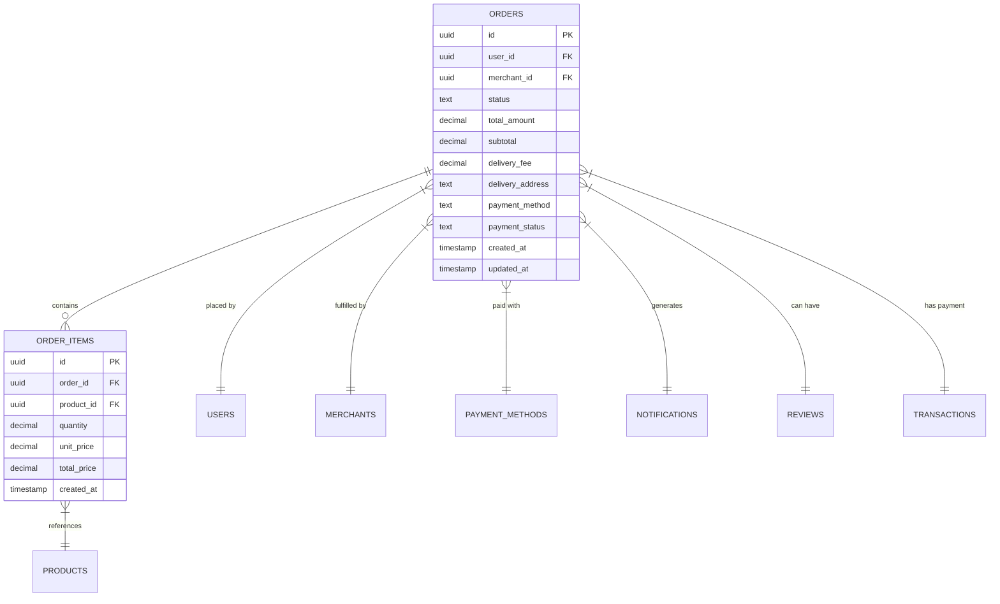
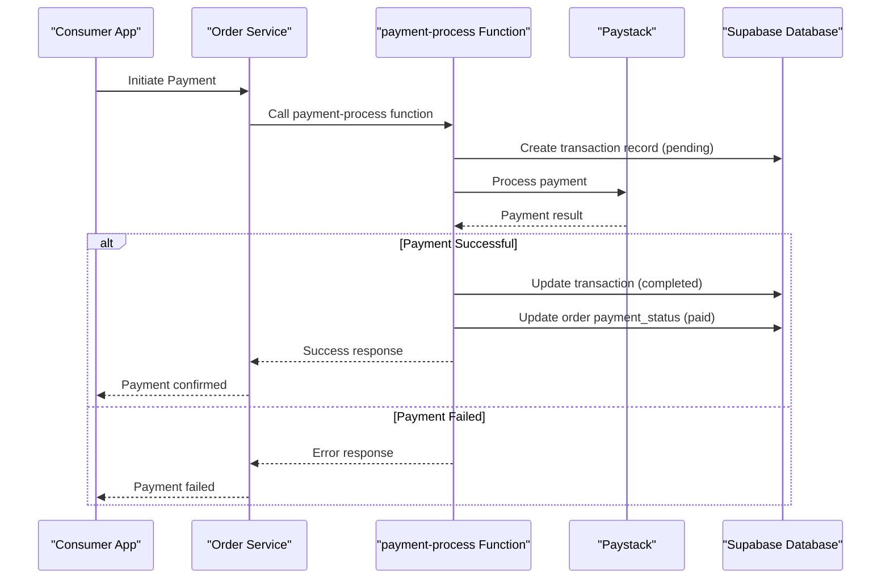
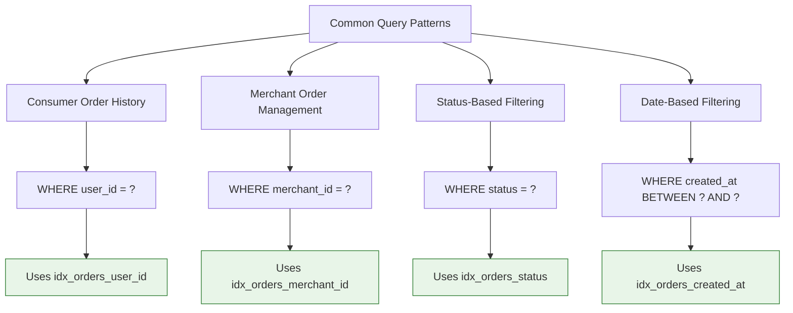
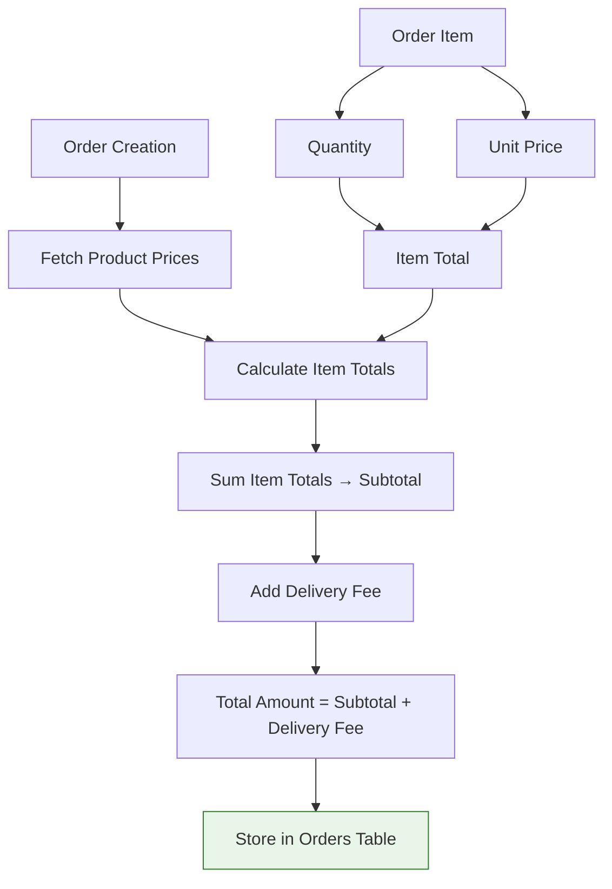

# Order Management Schema

<cite>
**Referenced Files in This Document**   
- [schema.sql](file://supabase/schema.sql)
- [rls-policies.sql](file://supabase/rls-policies.sql)
- [create-order/index.ts](file://supabase/functions/create-order/index.ts)
- [payment-process/index.ts](file://supabase/functions/payment-process/index.ts)
- [orderService.ts](file://services/orderService.ts)
- [merchantOrderService.ts](file://services/merchantOrderService.ts)
- [consumer-orders.tsx](file://app/orders/consumer-orders.tsx)
</cite>

## Table of Contents
1. [Introduction](#introduction)
2. [Data Model Overview](#data-model-overview)
3. [Entity Relationship Diagram](#entity-relationship-diagram)
4. [Orders Table](#orders-table)
5. [Order Items Table](#order-items-table)
6. [Order Status Lifecycle](#order-status-lifecycle)
7. [Payment Status Tracking](#payment-status-tracking)
8. [Row Level Security Policies](#row-level-security-policies)
9. [Database Indexes](#database-indexes)
10. [Updated At Trigger](#updated-at-trigger)
11. [Order Total Calculation](#order-total-calculation)
12. [Common Queries](#common-queries)
13. [Data Integrity and Related Systems](#data-integrity-and-related-systems)
14. [Conclusion](#conclusion)

## Introduction

The Order Management Schema in Brillprime-expo provides a robust system for handling order processing, tracking, and management across consumers, merchants, and drivers. This documentation details the data model for the orders and order_items tables, including their relationships, constraints, and integration with other system components. The schema supports a comprehensive order lifecycle from creation through delivery or cancellation, with proper security, performance optimization, and data integrity measures in place.

## Data Model Overview

The order management system in Brillprime-expo consists of two primary tables: `orders` and `order_items`. These tables work together to store comprehensive information about customer orders, including order details, items, pricing, status, and delivery information. The data model is designed to support the complete order lifecycle while maintaining data integrity through proper constraints and relationships.

The system integrates with multiple other components including user management, product catalog, payment processing, notifications, and reviews. It employs Row Level Security (RLS) to ensure data privacy and appropriate access control, allowing users to only access orders they are involved in as either consumers or merchants.

**Section sources**
- [schema.sql](file://supabase/schema.sql#L70-L101)

## Entity Relationship Diagram



**Diagram sources**
- [schema.sql](file://supabase/schema.sql#L70-L101)

## Orders Table

The `orders` table serves as the primary entity for storing order information in the Brillprime-expo system. It contains comprehensive details about each order including financial information, status, delivery details, and timestamps.

Key attributes of the orders table include:
- **id**: Primary key using UUID for unique identification
- **user_id**: Foreign key referencing the consumer who placed the order
- **merchant_id**: Foreign key referencing the merchant fulfilling the order
- **status**: Current status of the order (PENDING, CONFIRMED, PREPARING, READY, IN_TRANSIT, DELIVERED, CANCELLED)
- **total_amount**: Final amount charged for the order including all fees
- **subtotal**: Sum of all order items before additional fees
- **delivery_fee**: Cost for delivery service
- **delivery_address**: Complete delivery address for the order
- **payment_method**: Method used for payment (card, bank transfer, cash)
- **payment_status**: Current status of payment processing (pending, paid, failed)
- **created_at**: Timestamp when the order was created
- **updated_at**: Timestamp automatically updated when the order is modified

The table enforces data integrity through foreign key constraints and cascading deletes, ensuring that related data is properly maintained. The status field is constrained to a specific set of valid values to maintain consistency in the order lifecycle.

**Section sources**
- [schema.sql](file://supabase/schema.sql#L70-L89)

## Order Items Table

The `order_items` table stores the individual items that comprise each order, establishing a one-to-many relationship with the orders table. This design allows for flexible order composition with multiple items from the product catalog.

Key attributes of the order_items table include:
- **id**: Primary key using UUID for unique identification
- **order_id**: Foreign key referencing the parent order with cascading delete
- **product_id**: Foreign key referencing the product from the catalog
- **quantity**: Amount of the product ordered (supports decimal values for items like fuel)
- **unit_price**: Price per unit at the time of order creation
- **total_price**: Calculated total for this item (quantity × unit_price)
- **created_at**: Timestamp when the order item was created

The table design captures pricing information at the time of order creation, preserving historical pricing data even if product prices change in the future. This ensures accurate financial records and prevents discrepancies in order totals. The cascading delete constraint ensures that when an order is deleted, all associated order items are automatically removed, maintaining referential integrity.

**Section sources**
- [schema.sql](file://supabase/schema.sql#L93-L100)

## Order Status Lifecycle

The order status lifecycle in Brillprime-expo represents the complete journey of an order from creation to completion or cancellation. The system defines seven distinct status states that provide clear visibility into the order's progress:

```mermaid
stateDiagram-v2
[*] --> PENDING
PENDING --> CONFIRMED : Consumer confirmation
CONFIRMED --> PREPARING : Merchant acceptance
PREPARING --> READY : Preparation complete
READY --> IN_TRANSIT : Driver pickup
IN_TRANSIT --> DELIVERED : Delivery complete
PENDING --> CANCELLED : Consumer cancellation
CONFIRMED --> CANCELLED : Merchant rejection
PREPARING --> CANCELLED : Order cancellation
IN_TRANSIT --> CANCELLED : Delivery issue
state PENDING {
direction LR
note right : Order created\nWaiting for confirmation
}
state CONFIRMED {
direction LR
note right : Payment processed\nMerchant notified
}
state PREPARING {
direction LR
note right : Merchant preparing\norder items
}
state READY {
direction LR
note right : Order prepared\nReady for pickup
}
state IN_TRANSIT {
direction LR
note right : Driver en route\nto delivery
}
state DELIVERED {
direction LR
note right : Order delivered\nCustomer confirmed
}
state CANCELLED {
direction LR
note right : Order cancelled\nTransaction reversed
}
```

**Diagram sources**
- [schema.sql](file://supabase/schema.sql#L75)
- [merchantOrderService.ts](file://services/merchantOrderService.ts#L10)

The status transitions are managed through the merchantOrderService, which provides methods for updating order status at each stage of the lifecycle. Each status change triggers appropriate notifications to involved parties and updates the updated_at timestamp to track the progression of the order.

**Section sources**
- [schema.sql](file://supabase/schema.sql#L75)
- [merchantOrderService.ts](file://services/merchantOrderService.ts#L10)

## Payment Status Tracking

Payment status tracking is a critical component of the order management system, ensuring that financial transactions are properly recorded and monitored. The orders table includes a payment_status field that tracks the current state of payment processing, with a default value of 'pending'.

The payment process is handled through the payment-process edge function, which follows this workflow:
1. A transaction record is created in the transactions table with status 'pending'
2. The payment gateway (Paystack) is called to process the payment
3. Upon successful payment, the transaction status is updated to 'completed'
4. The order's payment_status is updated to 'paid'



**Diagram sources**
- [payment-process/index.ts](file://supabase/functions/payment-process/index.ts)
- [schema.sql](file://supabase/schema.sql#L84)

The system maintains data consistency by updating both the transaction record and the order's payment status in sequence, ensuring that the order's financial state accurately reflects the payment outcome.

**Section sources**
- [payment-process/index.ts](file://supabase/functions/payment-process/index.ts)
- [schema.sql](file://supabase/schema.sql#L84)

## Row Level Security Policies

The Brillprime-expo system implements comprehensive Row Level Security (RLS) policies to ensure that users can only access order data they are authorized to view. These policies are defined in the rls-policies.sql file and applied to both the orders and order_items tables.

For the orders table, the RLS policy allows access when:
- The user is the consumer who placed the order (user_id matches the authenticated user)
- The user is a merchant associated with the order (merchant_id matches a merchant owned by the authenticated user)

```sql
CREATE POLICY "Users can view own orders" ON orders
  FOR SELECT USING (
    user_id IN (
      SELECT id FROM users WHERE firebase_uid = current_setting('request.jwt.claims', true)::json->>'sub'
    )
    OR merchant_id IN (
      SELECT m.id FROM merchants m
      INNER JOIN users u ON m.user_id = u.id
      WHERE u.firebase_uid = current_setting('request.jwt.claims', true)::json->>'sub'
    )
  );
```

Similarly, the order_items table inherits permissions from the parent order:

```sql
CREATE POLICY "Order items inherit order permissions" ON order_items
  FOR ALL USING (
    order_id IN (
      SELECT id FROM orders
      WHERE user_id IN (
        SELECT id FROM users WHERE firebase_uid = current_setting('request.jwt.claims', true)::json->>'sub'
      )
    )
  );
```

These policies ensure that consumers can only view their own order history, while merchants can only access orders for their own business. This security model prevents unauthorized access to sensitive order information while enabling the necessary functionality for both consumer and merchant interfaces.

**Section sources**
- [rls-policies.sql](file://supabase/rls-policies.sql#L58-L107)

## Database Indexes

The order management system includes several database indexes to optimize query performance for common access patterns. These indexes are defined in the schema.sql file and target the most frequently queried columns.

Key indexes include:
- **idx_orders_user_id**: Index on user_id for fast retrieval of a consumer's order history
- **idx_orders_merchant_id**: Index on merchant_id for efficient merchant order management
- **idx_orders_status**: Index on status for filtering orders by their current state
- **idx_orders_created_at**: Index on created_at for chronological ordering and date-based filtering



**Diagram sources**
- [schema.sql](file://supabase/schema.sql#L205-L207)

These indexes significantly improve query performance for the most common operations in the application, such as displaying a user's order history, showing a merchant's current orders, or filtering orders by status. The indexing strategy balances query performance with the overhead of maintaining indexes during write operations.

**Section sources**
- [schema.sql](file://supabase/schema.sql#L205-L207)

## Updated At Trigger

The order management system implements an automated updated_at trigger to track when records are modified. This trigger ensures that the updated_at timestamp is automatically updated whenever an order is changed, providing an accurate audit trail of order modifications.

The trigger is implemented using a PostgreSQL function and trigger:

```sql
-- Function to update the updated_at column
CREATE OR REPLACE FUNCTION update_updated_at_column()
RETURNS TRIGGER AS $$
BEGIN
  NEW.updated_at = NOW();
  RETURN NEW;
END;
$$ LANGUAGE plpgsql;

-- Trigger on orders table
CREATE TRIGGER update_orders_updated_at BEFORE UPDATE ON orders
  FOR EACH ROW EXECUTE FUNCTION update_updated_at_column();
```

This mechanism provides several benefits:
- **Audit trail**: Accurate tracking of when orders were last modified
- **Data consistency**: Automatic timestamp updates prevent client-side errors
- **Real-time features**: Enables real-time updates and notifications based on order changes
- **Performance monitoring**: Helps identify processing delays in the order lifecycle

The trigger fires before any UPDATE operation on the orders table, ensuring that the updated_at field always reflects the most recent modification time. This is particularly important for the order status lifecycle, where timely updates are critical for coordinating between consumers, merchants, and drivers.

**Section sources**
- [schema.sql](file://supabase/schema.sql#L213-L232)

## Order Total Calculation

Order totals in Brillprime-expo are calculated through a multi-step process that ensures accuracy and consistency. The total amount is derived from the sum of order items plus additional fees, with calculations performed at order creation time to capture pricing at that moment.

The calculation process follows these steps:
1. Calculate the subtotal by summing the total_price of all order_items
2. Add the delivery_fee (fixed or calculated based on distance)
3. The sum becomes the total_amount stored in the orders table



**Diagram sources**
- [create-order/index.ts](file://supabase/functions/create-order/index.ts#L49-L79)

The calculation is performed in the create-order edge function, which retrieves current product prices from the database and calculates the totals before creating the order record. This approach ensures that price changes after order creation do not affect existing orders, maintaining financial accuracy.

The system also stores both the subtotal and total_amount in the orders table, providing transparency into the order's cost breakdown. This information is used in the consumer and merchant interfaces to display detailed order summaries.

**Section sources**
- [create-order/index.ts](file://supabase/functions/create-order/index.ts#L49-L79)

## Common Queries

The order management system supports several common query patterns that are essential for the application's functionality. These queries leverage the database indexes and RLS policies to provide efficient data retrieval.

### Order History Query
Retrieves a consumer's order history with filtering by status:

```sql
SELECT * FROM orders 
WHERE user_id = 'user_id_value' 
  AND status = 'DELIVERED'
ORDER BY created_at DESC 
LIMIT 20;
```

### Merchant Order Management
Retrieves all orders for a merchant, filterable by status:

```sql
SELECT o.*, u.email as consumer_email
FROM orders o
JOIN users u ON o.user_id = u.id
WHERE o.merchant_id = 'merchant_id_value'
  AND o.status IN ('CONFIRMED', 'PREPARING', 'READY')
ORDER BY o.created_at ASC;
```

### Status-Based Filtering
Queries for orders in specific statuses for operational dashboards:

```sql
SELECT COUNT(*) as count, SUM(total_amount) as revenue
FROM orders 
WHERE merchant_id = 'merchant_id_value'
  AND status = 'DELIVERED'
  AND created_at >= '2025-01-01';
```

### Real-time Order Tracking
Retrieves order details with items for tracking interface:

```sql
SELECT o.*, 
       json_agg(oi.*) as items
FROM orders o
LEFT JOIN order_items oi ON o.id = oi.order_id
WHERE o.id = 'order_id_value'
GROUP BY o.id;
```

These queries are implemented in the orderService and merchantOrderService classes, which provide a clean API interface for the application components to retrieve order data efficiently while respecting security constraints.

**Section sources**
- [orderService.ts](file://services/orderService.ts)
- [merchantOrderService.ts](file://services/merchantOrderService.ts)

## Data Integrity and Related Systems

The order management system maintains data integrity through several mechanisms and integrates with various related systems to provide a comprehensive e-commerce experience.

### Data Integrity Measures
- **Foreign key constraints**: Ensure referential integrity between orders, users, merchants, and products
- **Cascading deletes**: Automatically remove order items when an order is deleted
- **Check constraints**: Validate status values against the defined lifecycle
- **NOT NULL constraints**: Ensure critical fields are always populated
- **UUID primary keys**: Prevent ID collisions and enhance security

### Integration with Related Systems
- **Payments**: Orders are linked to transactions in the payments system, with status synchronization
- **Notifications**: Status changes trigger notifications to consumers and merchants
- **Reviews**: Completed orders become eligible for reviews, creating a feedback loop
- **Analytics**: Order data feeds into merchant analytics for business insights
- **Inventory**: Future integration could update product inventory based on order items

The system's design ensures that order data serves as the central hub connecting various aspects of the e-commerce platform. When an order is created, it potentially triggers actions across multiple systems, creating a cohesive user experience while maintaining data consistency and integrity.

**Section sources**
- [schema.sql](file://supabase/schema.sql)
- [rls-policies.sql](file://supabase/rls-policies.sql)
- [create-order/index.ts](file://supabase/functions/create-order/index.ts)

## Conclusion

The Order Management Schema in Brillprime-expo provides a robust, secure, and efficient system for handling orders in a multi-vendor marketplace. The data model effectively captures the complexity of order processing while maintaining simplicity through well-defined relationships and constraints.

Key strengths of the implementation include:
- Comprehensive order lifecycle management with clear status transitions
- Strong security through Row Level Security policies
- Optimized performance with strategic indexing
- Accurate financial tracking with proper total calculation
- Seamless integration with payment, notification, and review systems

The schema balances normalization with practical performance considerations, storing calculated values like totals while maintaining referential integrity through proper relationships. This design enables both consumer and merchant interfaces to efficiently access the order data they need while ensuring data privacy and consistency across the platform.