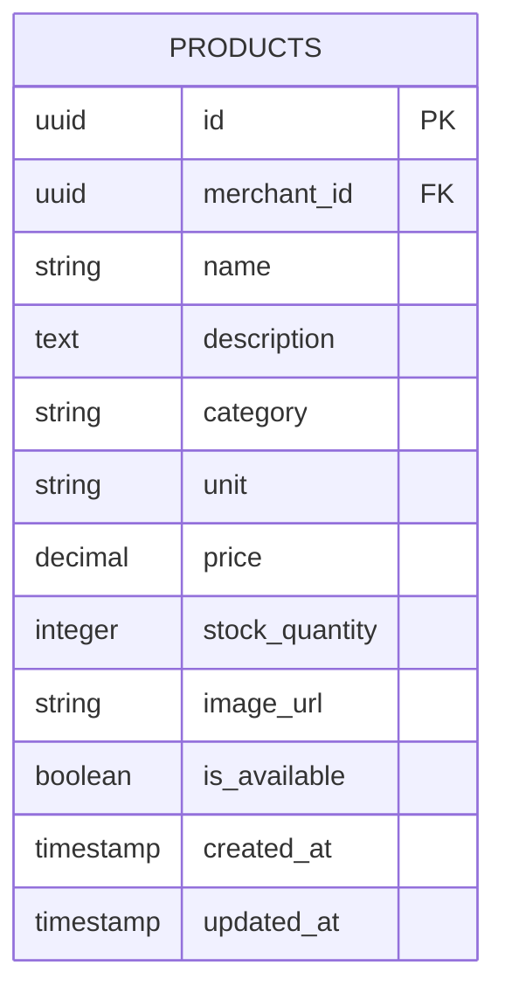
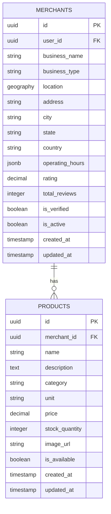
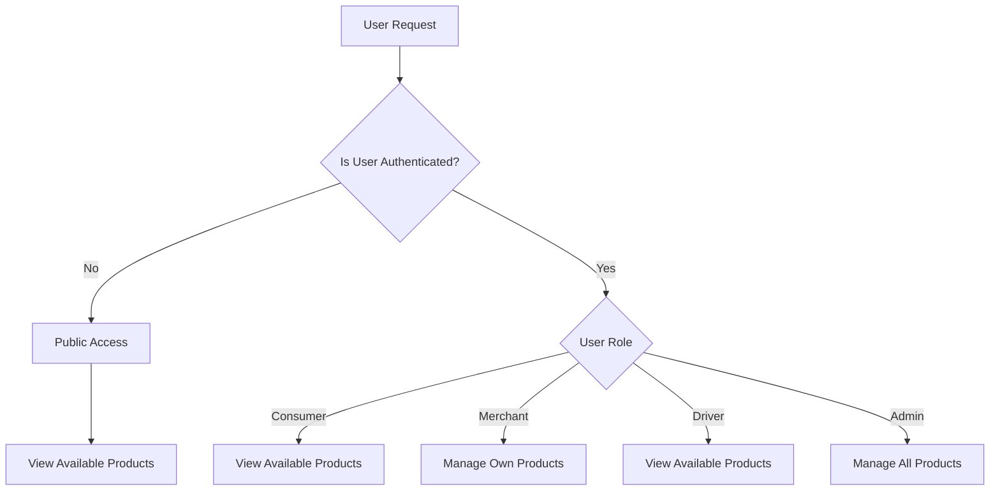
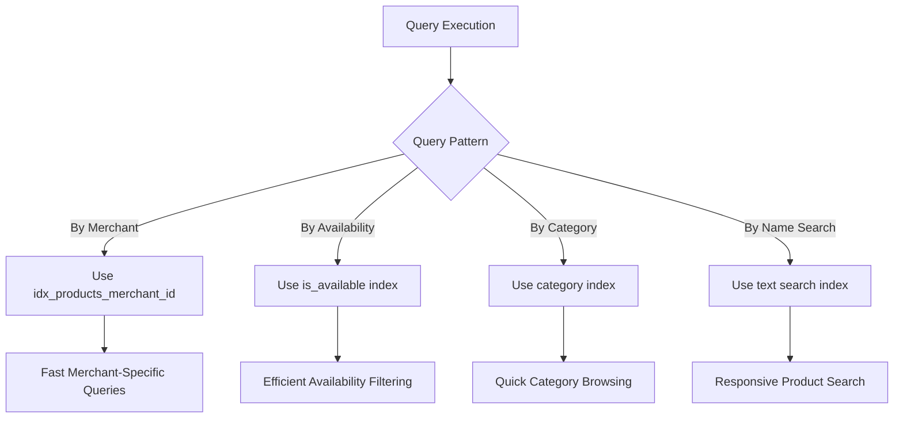
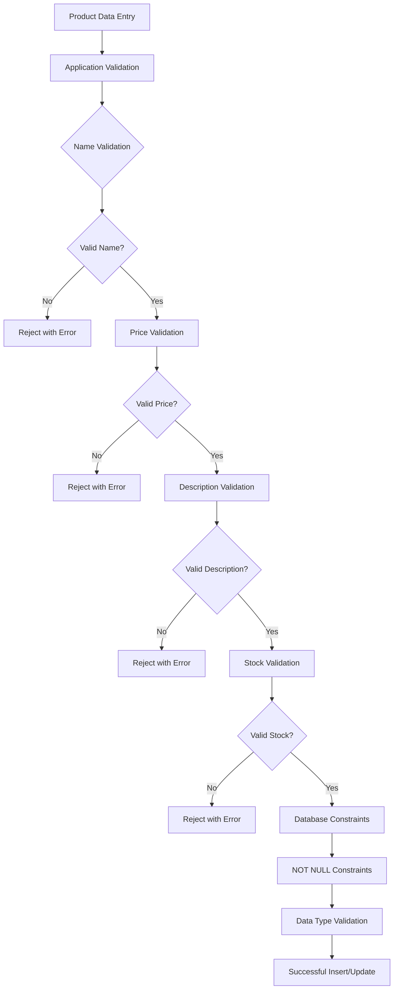
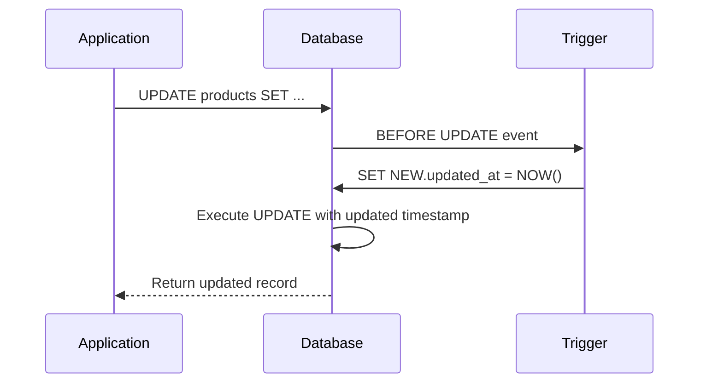
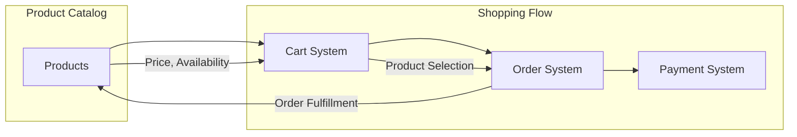
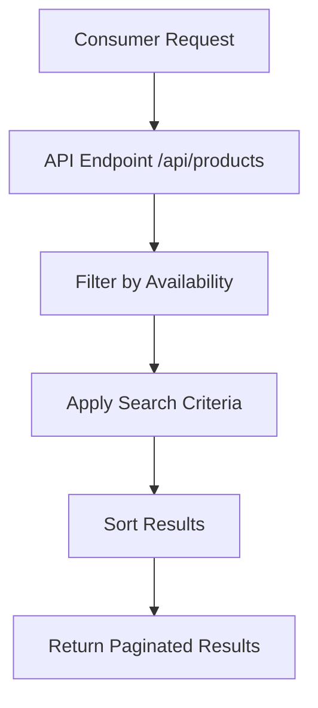
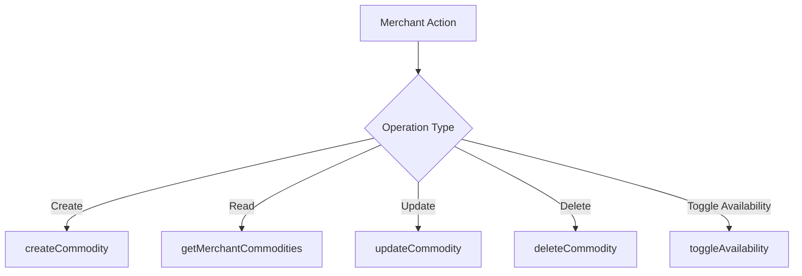

# Product Catalog Schema

<cite>
**Referenced Files in This Document**   
- [schema.sql](file://supabase/schema.sql#L54-L68)
- [rls-policies.sql](file://supabase/rls-policies.sql#L45-L55)
- [commodityService.ts](file://services/commodityService.ts#L5-L23)
- [cartService.ts](file://services/cartService.ts#L6-L17)
- [create-order\index.ts](file://supabase/functions/create-order/index.ts#L53-L74)
- [validation.ts](file://utils/validation.ts#L337-L345)
- [commodityUtils.ts](file://utils/commodityUtils.ts#L99-L115)
</cite>

## Table of Contents
1. [Introduction](#introduction)
2. [Entity Structure](#entity-structure)
3. [Relationships and Constraints](#relationships-and-constraints)
4. [Row Level Security Policies](#row-level-security-policies)
5. [Database Indexing and Performance](#database-indexing-and-performance)
6. [Data Validation Rules](#data-validation-rules)
7. [Updated_at Trigger Mechanism](#updated_at-trigger-mechanism)
8. [Integration with Cart and Order Systems](#integration-with-cart-and-order-systems)
9. [Common Operations](#common-operations)
10. [Conclusion](#conclusion)

## Introduction
The products table in Brillprime-expo serves as the central repository for all product listings within the marketplace platform. This document provides comprehensive documentation of the products table schema, detailing its structure, relationships, security policies, and integration points with other system components. The schema is designed to support a multi-merchant marketplace where each merchant can manage their own product catalog while maintaining data isolation and security through Row Level Security (RLS) policies.

**Section sources**
- [schema.sql](file://supabase/schema.sql#L54-L68)

## Entity Structure
The products table contains the core attributes for product listings in the Brillprime-expo platform. Each product record includes essential information for display, pricing, inventory management, and categorization.



The entity structure includes the following fields:

- **id**: UUID primary key that uniquely identifies each product
- **merchant_id**: Foreign key reference to the merchants table, establishing ownership
- **name**: Text field for the product name (required)
- **description**: Text field for product description
- **category**: Text field for product categorization
- **unit**: Text field specifying the unit of measurement (e.g., "kg", "litre", "unit")
- **price**: Decimal field with precision (10,2) for storing product pricing
- **stock_quantity**: Integer field for tracking available inventory
- **image_url**: Text field storing the public URL of the product image
- **is_available**: Boolean flag indicating product availability status
- **created_at**: Timestamp with time zone for record creation
- **updated_at**: Timestamp with time zone for last modification

**Diagram sources**
- [schema.sql](file://supabase/schema.sql#L54-L68)

**Section sources**
- [schema.sql](file://supabase/schema.sql#L54-L68)
- [commodityService.ts](file://services/commodityService.ts#L5-L23)

## Relationships and Constraints
The products table maintains a critical relationship with the merchants table through the merchant_id foreign key. This relationship enforces data integrity and ownership semantics within the marketplace.



The foreign key constraint includes cascading delete behavior, meaning that when a merchant record is deleted, all associated products are automatically removed from the database. This ensures data consistency and prevents orphaned product records.

The relationship is implemented with the following constraint:
```sql
merchant_id UUID REFERENCES merchants(id) ON DELETE CASCADE
```

This design supports the business requirement that when a merchant account is deactivated or removed from the platform, their entire product catalog should be removed as well.

**Diagram sources**
- [schema.sql](file://supabase/schema.sql#L35-L52)
- [schema.sql](file://supabase/schema.sql#L54-L68)

**Section sources**
- [schema.sql](file://supabase/schema.sql#L57)
- [commodityService.ts](file://services/commodityService.ts#L163-L207)

## Row Level Security Policies
The products table implements Row Level Security (RLS) policies to control data access based on user roles and authentication status. These policies ensure that product data is accessible according to business rules while maintaining security and privacy.



The RLS policies are defined as follows:

- **Public Viewing Policy**: Allows anyone to view products where `is_available = true`. This enables consumers to browse the product catalog without requiring authentication.
- **Merchant Management Policy**: Allows merchants to perform all operations (create, read, update, delete) on products where the merchant_id matches their own merchant record.

The policies are implemented in the rls-policies.sql file with the following statements:

```sql
-- Anyone can view available products
CREATE POLICY "Anyone can view available products" ON products
  FOR SELECT USING (is_available = true);

-- Merchants can manage own products
CREATE POLICY "Merchants can manage own products" ON products
  FOR ALL USING (
    merchant_id IN (
      SELECT m.id FROM merchants m
      INNER JOIN users u ON m.user_id = u.id
      WHERE u.firebase_uid = current_setting('request.jwt.claims', true)::json->>'sub'
    )
  );
```

These policies ensure that only authorized merchants can modify their own product listings, while maintaining public visibility of available products for consumers.

**Diagram sources**
- [rls-policies.sql](file://supabase/rls-policies.sql#L45-L55)

**Section sources**
- [rls-policies.sql](file://supabase/rls-policies.sql#L45-L55)

## Database Indexing and Performance
The products table includes strategic database indexing to optimize query performance, particularly for operations that filter by merchant_id. This indexing strategy supports efficient data retrieval patterns used throughout the application.



The primary index on the merchant_id column enables efficient retrieval of all products for a specific merchant, which is a common operation when merchants manage their inventory or when the system needs to display a merchant's product catalog.

The index is created with the following SQL statement:
```sql
CREATE INDEX IF NOT EXISTS idx_products_merchant_id ON products(merchant_id);
```

This indexing strategy ensures that:
- Merchant inventory management operations perform efficiently
- Product listing queries by merchant are optimized
- Cascading operations related to merchant_id are accelerated
- Join operations between products and merchants are performant

The index supports the application's need for responsive merchant dashboards and efficient product catalog management.

**Section sources**
- [schema.sql](file://supabase/schema.sql#L204)

## Data Validation Rules
The products table implements comprehensive data validation rules to ensure data quality and consistency. These rules are enforced at both the application and database levels to maintain integrity across the system.



The validation rules include:

- **Price Validation**: Ensures prices are positive values greater than zero, implemented in the validation.ts utility:
```typescript
export const validatePrice = (price: string): { isValid: boolean; error?: string } => {
  if (!price.trim()) {
    return { isValid: false, error: 'Price is required' };
  }
  const numValidation = validateNumber(price, 'Price', { min: 0.01, allowDecimals: true });
  return numValidation;
};
```

- **Description Validation**: Requires descriptions to be between 10 and 200 characters, ensuring meaningful product information.

- **Name Validation**: Requires product names to be provided and meet minimum length requirements.

- **Stock Quantity Validation**: Ensures inventory levels are non-negative integers.

These validation rules are implemented in the commodityUtils.ts file and are applied when creating or updating product records through the commodityService.

**Section sources**
- [validation.ts](file://utils/validation.ts#L337-L345)
- [commodityUtils.ts](file://utils/commodityUtils.ts#L99-L115)
- [commodityService.ts](file://services/commodityService.ts#L163-L207)

## Updated_at Trigger Mechanism
The products table implements an automated updated_at trigger mechanism to track the last modification time of each record. This feature provides audit capabilities and supports data synchronization across the application.



The trigger mechanism is implemented using a reusable PostgreSQL function that can be applied to multiple tables:

```sql
-- Create updated_at trigger function
CREATE OR REPLACE FUNCTION update_updated_at_column()
RETURNS TRIGGER AS $$
BEGIN
  NEW.updated_at = NOW();
  RETURN NEW;
END;
$$ LANGUAGE plpgsql;

-- Add updated_at triggers
CREATE TRIGGER update_products_updated_at BEFORE UPDATE ON products
  FOR EACH ROW EXECUTE FUNCTION update_updated_at_column();
```

This implementation ensures that:
- The updated_at timestamp is automatically updated on every record modification
- Applications cannot bypass the timestamp update through direct database operations
- The trigger operates consistently across all tables that use it
- Timestamps are set using the database server's clock, ensuring consistency

The updated_at field is valuable for:
- Tracking when products were last modified
- Implementing cache invalidation strategies
- Supporting audit trails for product changes
- Enabling "recently updated" sorting in product listings

**Section sources**
- [schema.sql](file://supabase/schema.sql#L213-L229)

## Integration with Cart and Order Systems
The products table is tightly integrated with the cart and order management systems, forming the foundation of the e-commerce functionality in Brillprime-expo. This integration enables seamless product discovery, selection, and purchase.



The integration points include:

- **Cart Addition**: When users add products to their cart, the system references the products table to retrieve pricing and availability information:
```typescript
async addToCart(item: CartItem): Promise<ApiResponse<{ message: string }>> {
  const response = await apiClient.post('/functions/v1/cart-add', {
    productId: item.commodityId,
    quantity: item.quantity
  });
}
```

- **Order Creation**: When orders are created, the system retrieves product details including price and merchant information to calculate totals and route the order appropriately:
```typescript
// In create-order function
const { data: product } = await supabaseClient
  .from('products')
  .select('price, merchant_id')
  .eq('id', item.productId)
  .single();
```

- **Inventory Management**: The stock_quantity field in the products table supports inventory tracking, though additional business logic may be needed to prevent overselling.

- **Price Consistency**: The system uses the current price from the products table when creating orders, ensuring that order pricing reflects the current catalog pricing.

This integration enables a cohesive shopping experience where product information flows seamlessly from discovery through purchase.

**Section sources**
- [commodityService.ts](file://services/commodityService.ts#L163-L207)
- [cartService.ts](file://services/cartService.ts#L130-L147)
- [create-order\index.ts](file://supabase/functions/create-order/index.ts#L53-L74)

## Common Operations
The products table supports several common operations that are essential to the marketplace functionality. These operations are optimized for both consumer browsing and merchant management use cases.

### Product Listing Retrieval
Consumers can retrieve product listings with various filtering options:



The service implementation supports filtering by category, price range, and search terms:
```typescript
async getProducts(filters?: {
  page?: number;
  limit?: number;
  categoryId?: number;
  search?: string;
  minPrice?: number;
  maxPrice?: number;
}): Promise<ApiResponse<{ products: Product[]; pagination: any }>>
```

### Availability Filtering
The system supports filtering products by availability status through the RLS policy that only exposes products where `is_available = true` to public queries. Merchants can view all their products regardless of availability status.

### Merchant-Specific Product Management
Merchants can perform CRUD operations on their products through dedicated service methods:



Key service methods include:
- `createCommodity`: Creates a new product listing with image upload
- `getMerchantCommodities`: Retrieves all products for the authenticated merchant
- `updateCommodity`: Modifies existing product details
- `deleteCommodity`: Removes a product and its associated image
- `toggleAvailability`: Changes the availability status without deleting the product

These operations are secured by the RLS policies, ensuring that merchants can only manage their own products.

**Section sources**
- [commodityService.ts](file://services/commodityService.ts#L163-L386)
- [productService.ts](file://services/productService.ts#L38-L154)

## Conclusion
The products table in Brillprime-expo is a well-designed component that effectively supports the marketplace's e-commerce functionality. Its structure balances simplicity with the necessary features for product management, including robust security through Row Level Security policies, performance optimization through strategic indexing, and seamless integration with the cart and order systems.

The schema design reflects best practices for multi-tenant marketplace applications, with clear ownership semantics through the merchant_id foreign key and appropriate data validation at both the application and database levels. The cascading delete behavior ensures data consistency when merchants are removed from the platform.

The integration with the broader system enables a cohesive user experience from product discovery through purchase, while the RLS policies maintain appropriate data access controls. The updated_at trigger mechanism provides valuable audit capabilities, and the comprehensive validation rules ensure data quality.

This documentation provides a complete overview of the products table schema, serving as a reference for developers, database administrators, and stakeholders involved in the Brillprime-expo platform.