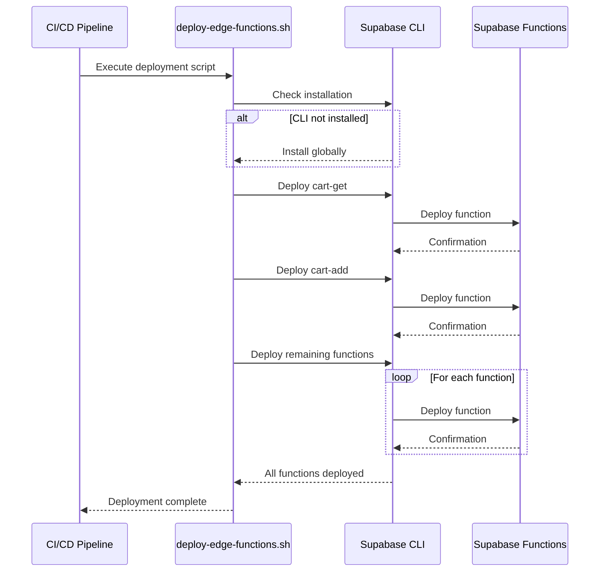
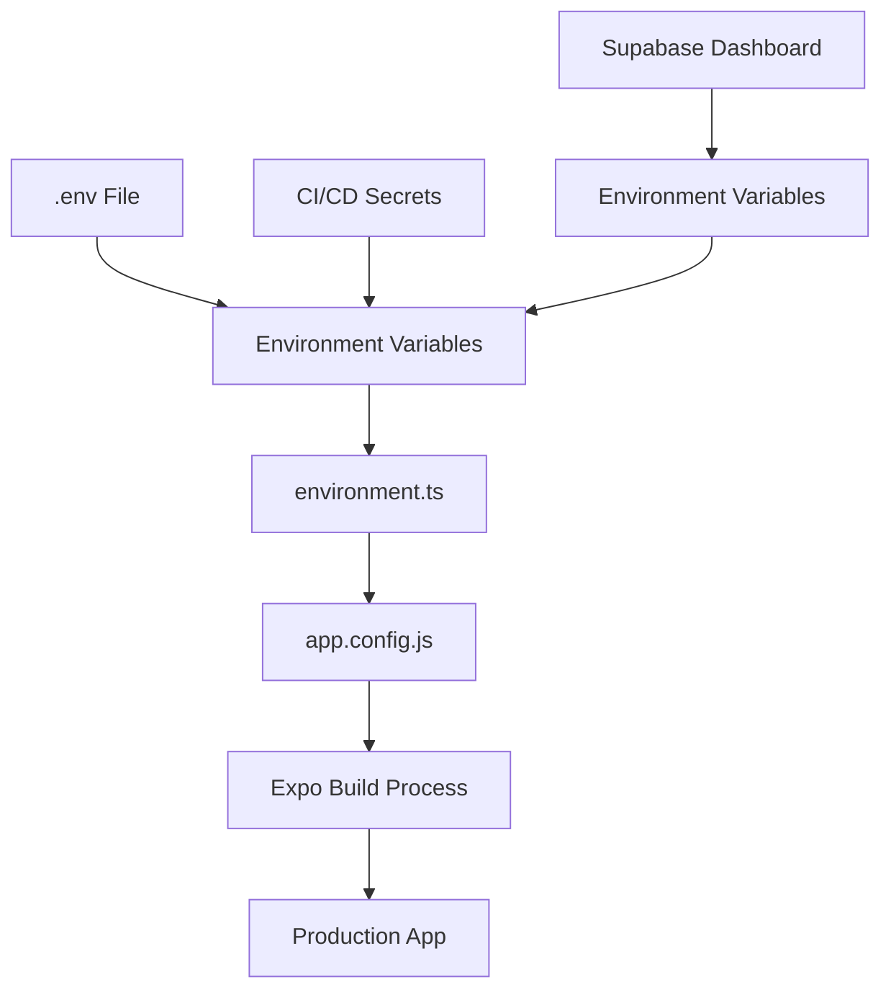
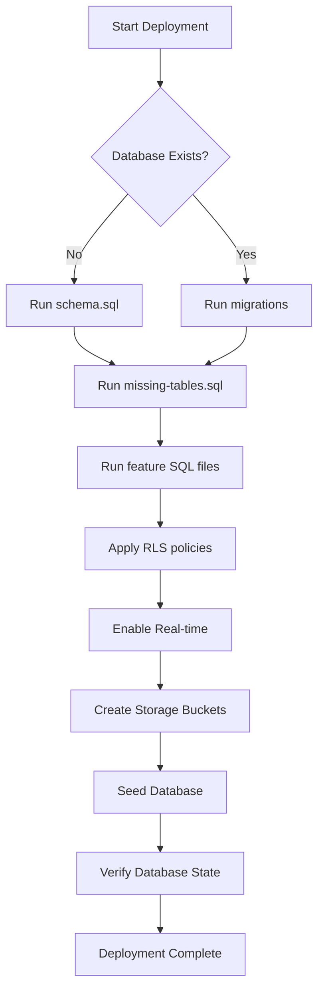

# Deployment Guide

<cite>
**Referenced Files in This Document**   
- [eas.json](file://eas.json)
- [deploy-edge-functions.sh](file://scripts/deploy-edge-functions.sh)
- [verify-database.sh](file://scripts/verify-database.sh)
- [environment.ts](file://config/environment.ts)
- [app.config.js](file://app.config.js)
- [DEPLOYMENT_INSTRUCTIONS.md](file://supabase/DEPLOYMENT_INSTRUCTIONS.md)
- [setup-database.sh](file://scripts/setup-database.sh)
- [seed-database.sh](file://scripts/seed-database.sh)
- [schema.sql](file://supabase/schema.sql)
- [seed-comprehensive-data.sql](file://supabase/seed-comprehensive-data.sql)
</cite>

## Table of Contents
1. [Expo Application Services (EAS) Build Configuration](#expo-application-services-eas-build-configuration)
2. [Supabase Edge Functions Deployment](#supabase-edge-functions-deployment)
3. [Database State Management](#database-state-management)
4. [Environment Configuration Management](#environment-configuration-management)
5. [CI/CD Pipeline Considerations](#cicd-pipeline-considerations)
6. [Database Migration and Data Seeding](#database-migration-and-data-seeding)
7. [Rollback Strategies and Versioning](#rollback-strategies-and-versioning)
8. [Progressive Deployment Techniques](#progressive-deployment-techniques)
9. [Monitoring and Analytics](#monitoring-and-analytics)
10. [Post-Deployment Verification](#post-deployment-verification)

## Expo Application Services (EAS) Build Configuration

The Brillprime-expo application utilizes Expo Application Services (EAS) for building and distributing Android and iOS applications. The EAS configuration is defined in the `eas.json` file, which specifies different build profiles for development, preview, and production environments.

The production build profile is configured with auto-increment enabled, ensuring version numbers are automatically incremented with each build. This prevents version conflicts and ensures proper app store submission requirements are met. The development and preview builds are configured for internal distribution, allowing for controlled testing among team members and stakeholders before public release.

EAS provides a streamlined workflow for building native binaries without requiring local native development environments. The build process is cloud-based, ensuring consistent builds across different developer machines and reducing setup complexity. For production deployments, EAS handles the entire build pipeline from source code to app store-ready binaries.

**Section sources**
- [eas.json](file://eas.json#L1-L18)
- [app.config.js](file://app.config.js#L1-L99)

## Supabase Edge Functions Deployment

Supabase Edge Functions are deployed using the `deploy-edge-functions.sh` script, which automates the deployment process for all critical backend functions. The script first verifies the presence of the Supabase CLI, installing it if necessary, then proceeds to deploy each function individually.

The deployed functions include:
- `cart-get`: Retrieves user cart information
- `cart-add`: Adds items to user cart
- `cart-update`: Updates cart item quantities
- `payment-process`: Handles payment processing
- `merchants-nearby`: Finds merchants near a specified location
- `create-order`: Creates new orders in the system

Each function deployment is logged with a status message, providing visibility into the deployment process. The script concludes with instructions for testing the deployed endpoints and monitoring function logs. The shared CORS configuration in `cors.ts` ensures proper cross-origin resource sharing headers are applied to all functions, enabling secure communication between the frontend application and backend services.

**Diagram sources**
- [deploy-edge-functions.sh](file://scripts/deploy-edge-functions.sh#L1-L45)
- [supabase/functions/_shared/cors.ts](file://supabase/functions/_shared/cors.ts#L1-L45)

**Section sources**
- [deploy-edge-functions.sh](file://scripts/deploy-edge-functions.sh#L1-L45)
- [supabase/functions/_shared/cors.ts](file://supabase/functions/_shared/cors.ts#L1-L45)

## Database State Management

Database state verification is handled by the `verify-database.sh` script, which checks the configuration and provides SQL queries to validate the database state. The script first verifies that the `EXPO_PUBLIC_SUPABASE_URL` environment variable is set, ensuring the application can connect to the correct database instance.

The verification process includes generating SQL queries to check key data points:
- User count by role
- Total merchants in the system
- Product count by category
- Order count by status
- Active driver locations

These verification queries help ensure data integrity and completeness after deployment. The script serves as a quick checklist for confirming that the database contains expected data and that critical business entities are properly represented.

**Section sources**
- [verify-database.sh](file://scripts/verify-database.sh#L1-L34)

## Environment Configuration Management

Environment-specific configuration is managed through environment variables and the `environment.ts` configuration file. The application follows a structured approach to environment management, with different settings for development and production environments.

Critical environment variables include:
- `EXPO_PUBLIC_SUPABASE_URL`: Supabase project URL
- `EXPO_PUBLIC_SUPABASE_ANON_KEY`: Supabase anonymous key for client access
- `EXPO_PUBLIC_GOOGLE_MAPS_API_KEY`: Google Maps API key
- `EXPO_PUBLIC_SENTRY_DSN`: Sentry DSN for error tracking
- `EXPO_PUBLIC_ENABLE_ANALYTICS`: Flag to enable analytics

The `environment.ts` file provides a centralized location for all environment-specific settings, including API timeouts, retry limits, and caching configurations. The `app.config.js` file integrates these environment variables into the Expo configuration, ensuring they are available at runtime.

**Diagram sources**
- [environment.ts](file://config/environment.ts#L1-L52)
- [app.config.js](file://app.config.js#L1-L99)

**Section sources**
- [environment.ts](file://config/environment.ts#L1-L52)
- [app.config.js](file://app.config.js#L1-L99)

## CI/CD Pipeline Considerations

The deployment process should be integrated into a CI/CD pipeline to ensure consistent and reliable deployments. The pipeline should include the following stages:

1. **Code Validation**: Run linting and type checking
2. **Testing**: Execute unit and integration tests
3. **Build**: Use EAS to build Android and iOS applications
4. **Database Deployment**: Apply migrations and seed data
5. **Function Deployment**: Deploy Supabase Edge Functions
6. **Verification**: Run post-deployment checks
7. **Distribution**: Release to app stores or distribution platforms

The scripts in the `scripts/` directory provide the foundation for automation, but should be enhanced with proper error handling, logging, and notifications. Environment variables should be securely managed in the CI/CD system, with different values for staging and production environments.

**Section sources**
- [scripts/deploy-edge-functions.sh](file://scripts/deploy-edge-functions.sh#L1-L45)
- [scripts/verify-database.sh](file://scripts/verify-database.sh#L1-L34)
- [scripts/setup-database.sh](file://scripts/setup-database.sh#L1-L47)

## Database Migration and Data Seeding

Database migrations and data seeding are critical components of the deployment process. The `setup-database.sh` script handles both operations, first pushing database schema changes and then seeding the database with initial data.

The migration process follows the instructions in `DEPLOYMENT_INSTRUCTIONS.md`, which outlines the order for running SQL files:
1. `schema.sql`: Core schema definition
2. `missing-tables.sql`: Additional tables
3. Feature-specific SQL files (cart, driver locations, privacy settings, etc.)
4. `rls-policies.sql`: Row Level Security policies
5. `realtime.sql`: Real-time subscriptions
6. `storage-setup.sql`: Storage buckets

Data seeding is performed using the `seed-database.sh` script, which populates the database with comprehensive test data including users, merchants, commodities, orders, and driver locations. This ensures the application has realistic data for testing and demonstration purposes.

**Diagram sources**
- [supabase/DEPLOYMENT_INSTRUCTIONS.md](file://supabase/DEPLOYMENT_INSTRUCTIONS.md#L1-L342)
- [scripts/setup-database.sh](file://scripts/setup-database.sh#L1-L47)
- [scripts/seed-database.sh](file://scripts/seed-database.sh#L1-L39)
- [supabase/schema.sql](file://supabase/schema.sql#L1-L233)
- [supabase/seed-comprehensive-data.sql](file://supabase/seed-comprehensive-data.sql#L1-L137)

**Section sources**
- [supabase/DEPLOYMENT_INSTRUCTIONS.md](file://supabase/DEPLOYMENT_INSTRUCTIONS.md#L1-L342)
- [scripts/setup-database.sh](file://scripts/setup-database.sh#L1-L47)
- [scripts/seed-database.sh](file://scripts/seed-database.sh#L1-L39)
- [supabase/schema.sql](file://supabase/schema.sql#L1-L233)
- [supabase/seed-comprehensive-data.sql](file://supabase/seed-comprehensive-data.sql#L1-L137)

## Rollback Strategies and Versioning

The deployment system incorporates several rollback strategies to ensure reliability and minimize downtime:

1. **EAS Build Versioning**: Production builds use auto-incremented version numbers, allowing easy identification of specific builds. Previous builds can be re-promoted if issues are discovered in a new release.

2. **Database Migration Management**: The Supabase CLI supports database migrations with version control. Each migration can be rolled back to a previous state if needed, though this should be done with caution in production environments.

3. **Supabase Function Versioning**: Edge Functions can be deployed with specific versions, allowing rollback to previous function implementations. The CLI supports listing and redeploying specific function versions.

4. **Environment Variable Management**: Critical configuration is managed through environment variables, which can be quickly updated without requiring a full application rebuild.

For production deployments, a blue-green deployment strategy is recommended, where the new version is deployed alongside the current version and traffic is gradually shifted after verification. This minimizes risk and allows for immediate rollback if issues are detected.

**Section sources**
- [eas.json](file://eas.json#L1-L18)
- [supabase/DEPLOYMENT_INSTRUCTIONS.md](file://supabase/DEPLOYMENT_INSTRUCTIONS.md#L1-L342)

## Progressive Deployment Techniques

The application supports progressive deployment techniques to minimize risk and gather user feedback before full rollout:

1. **Internal Distribution**: The development and preview builds are configured for internal distribution, allowing controlled testing among team members and trusted users before public release.

2. **Feature Flags**: Critical functionality can be controlled through environment variables or database settings, allowing features to be enabled or disabled without code changes.

3. **Gradual Rollout**: When releasing to app stores, use staged rollouts (e.g., 10% initially) to monitor performance and user feedback before full release.

4. **Canary Releases**: Deploy new versions to a subset of users and monitor key metrics before expanding to all users.

5. **A/B Testing**: Use analytics to compare performance and user engagement between different versions or feature variations.

These techniques allow the team to validate changes with real users while minimizing the impact of potential issues. Monitoring and analytics are critical components of progressive deployment, providing the data needed to make informed decisions about rollout progression.

**Section sources**
- [eas.json](file://eas.json#L1-L18)
- [environment.ts](file://config/environment.ts#L1-L52)

## Monitoring and Analytics

Comprehensive monitoring and analytics are essential for maintaining application health and understanding user behavior:

1. **Application Performance Monitoring**: Track key performance metrics such as app startup time, screen load times, and API response times. The `performance.ts` utility provides tools for measuring and reporting performance data.

2. **Error Tracking**: Integrate with Sentry using the `EXPO_PUBLIC_SENTRY_DSN` environment variable to capture and analyze runtime errors. This enables proactive identification and resolution of issues.

3. **User Analytics**: Enable analytics to track user engagement, feature usage, and conversion funnels. This data informs product decisions and helps identify areas for improvement.

4. **Function Monitoring**: Monitor Supabase Edge Function invocations, execution times, and error rates through the Supabase dashboard.

5. **Database Monitoring**: Track database performance, connection counts, and query execution times to identify potential bottlenecks.

6. **Real-time Monitoring**: Utilize Supabase real-time capabilities to monitor active users, driver locations, and order status changes.

The monitoring strategy should include alerting for critical issues, regular review of performance trends, and analysis of user feedback to continuously improve the application.

**Section sources**
- [environment.ts](file://config/environment.ts#L1-L52)
- [utils/performance.ts](file://utils/performance.ts)
- [services/analyticsService.ts](file://services/analyticsService.ts)

## Post-Deployment Verification

After deployment, a comprehensive verification process should be conducted to ensure all services are functioning correctly:

1. **Application Verification**: Install and launch the application, verifying that it starts correctly and displays the expected content.

2. **Authentication Test**: Complete the sign-in flow to verify authentication is working with both Firebase and Supabase.

3. **API Endpoint Testing**: Use the `test-supabase-functions.sh` script to verify all Edge Functions are accessible and returning expected responses.

4. **Database Verification**: Run the queries from `verify-database.sh` in the Supabase SQL Editor to confirm data integrity and completeness.

5. **Feature Testing**: Test core functionality including:
   - Browsing merchants and commodities
   - Adding items to cart
   - Creating and tracking orders
   - Viewing order history
   - Updating user profile

6. **Performance Testing**: Measure app startup time, screen transitions, and API response times under normal conditions.

7. **Error Handling**: Test error scenarios such as offline mode, invalid inputs, and failed transactions to ensure proper error handling and user feedback.

8. **Security Verification**: Confirm that Row Level Security policies are enforced and that users can only access their own data.

This verification process should be documented and repeated for each deployment to ensure consistent quality and reliability.

**Section sources**
- [scripts/verify-database.sh](file://scripts/verify-database.sh#L1-L34)
- [scripts/test-supabase-functions.sh](file://scripts/test-supabase-functions.sh#L1-L35)
- [supabase/DEPLOYMENT_INSTRUCTIONS.md](file://supabase/DEPLOYMENT_INSTRUCTIONS.md#L1-L342)