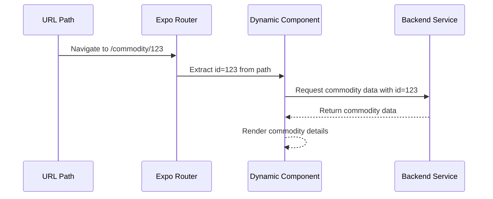
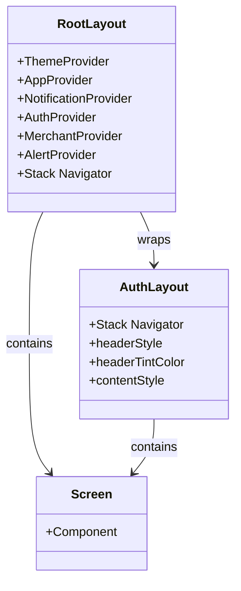
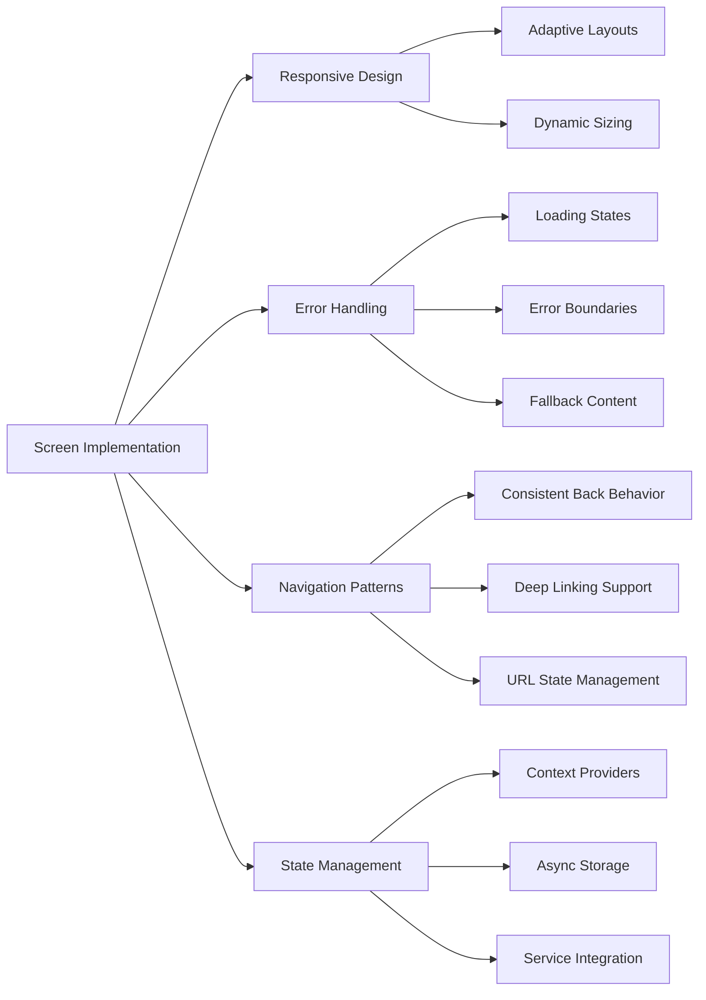

# App Directory

<cite>
**Referenced Files in This Document**   
- [app/_layout.tsx](file://app/_layout.tsx)
- [app/index.tsx](file://app/index.tsx)
- [app/auth/_layout.tsx](file://app/auth/_layout.tsx)
- [app/commodity/[id].tsx](file://app/commodity/[id].tsx)
- [app/chat/[conversationId].tsx](file://app/chat/[conversationId].tsx)
- [app/merchant/[id].tsx](file://app/merchant/[id].tsx)
- [app/merchant/[id]/reviews.tsx](file://app/merchant/[id]/reviews.tsx)
- [app/feature/[id].tsx](file://app/feature/[id].tsx)
- [app/role-registration/[role].tsx](file://app/role-registration/[role].tsx)
- [app/home/consumer.tsx](file://app/home/consumer.tsx)
- [app/dashboard/merchant.tsx](file://app/dashboard/merchant.tsx)
- [app/feature/browse-commodities.tsx](file://app/feature/browse-commodities.tsx)
- [app/feature/my-orders.tsx](file://app/feature/my-orders.tsx)
- [hooks/useDeepLinking.ts](file://hooks/useDeepLink.ts)
</cite>

## Table of Contents
1. [Introduction](#introduction)
2. [File-Based Routing System](#file-based-routing-system)
3. [Dynamic Routes](#dynamic-routes)
4. [Layout Files and Context Providers](#layout-files-and-context-providers)
5. [Feature-Specific Directories](#feature-specific-directories)
6. [Route Nesting and Organization](#route-nesting-and-organization)
7. [Best Practices for Screen Implementation](#best-practices-for-screen-implementation)
8. [Common Routing Issues](#common-routing-issues)
9. [Conclusion](#conclusion)

## Introduction
The app/ directory serves as the core of the Expo Router-based navigation system for the Brillprime application. This directory structure implements a file-based routing approach that maps directly to URL paths, providing a clear and intuitive navigation architecture. The system leverages Expo Router's capabilities to create a seamless user experience across different user roles including consumers, merchants, and drivers. This document provides a comprehensive analysis of the routing system, explaining how file organization translates to navigation paths, how layout files provide shared context, and how dynamic routes handle variable parameters.

**Section sources**
- [app/_layout.tsx](file://app/_layout.tsx#L1-L203)
- [app/index.tsx](file://app/index.tsx#L1-L287)

## File-Based Routing System
The Expo Router implementation in this application follows a conventional file-based routing pattern where the file structure directly determines the application's URL paths. Each file in the app/ directory corresponds to a specific route in the application. For example, app/index.tsx represents the root route (/), while app/auth/signin.tsx corresponds to the /auth/signin path. This approach eliminates the need for manual route configuration and makes the navigation structure immediately apparent from the file organization.

The root _layout.tsx file in the app/ directory configures the primary stack navigator that manages the top-level routes of the application. This layout defines screen options such as header visibility and animation styles, applying them consistently across all routes. The Stack component from Expo Router is used to define the navigation stack, with each Stack.Screen representing a specific route that can be navigated to within the application.

This file-based approach provides several advantages, including automatic route generation, predictable URL structures, and simplified navigation management. Developers can add new routes simply by creating new files in the appropriate directory, with the routing system automatically recognizing and incorporating them into the application's navigation structure.

```mermaid
graph TB
A[app/] --> B[index.tsx]
A --> C[_layout.tsx]
A --> D[auth/]
A --> E[commodity/]
A --> F[chat/]
A --> G[merchant/]
A --> H[feature/]
A --> I[role-registration/]
B --> J[/]
D --> K[signin.tsx]
D --> L[signup.tsx]
E --> M[[id].tsx]
F --> N[[conversationId].tsx]
G --> O[[id].tsx]
I --> P[[role].tsx]
style A fill:#f9f,stroke:#333,stroke-width:2px
style B fill:#bbf,stroke:#333
style C fill:#bbf,stroke:#333
style D fill:#f96,stroke:#333
style E fill:#f96,stroke:#333
style F fill:#f96,stroke:#333
style G fill:#f96,stroke:#333
style I fill:#f96,stroke:#333
```

**Diagram sources**
- [app/_layout.tsx](file://app/_layout.tsx#L94-L107)
- [app/index.tsx](file://app/index.tsx#L1-L287)

**Section sources**
- [app/_layout.tsx](file://app/_layout.tsx#L1-L203)
- [app/index.tsx](file://app/index.tsx#L1-L287)

## Dynamic Routes
The application implements dynamic routing through the use of square bracket notation in filenames, allowing for routes with variable parameters. This pattern is used extensively throughout the application to handle entity-specific views where the URL contains an identifier for a specific resource.

The [id].tsx pattern is used in multiple contexts across the application. In the commodity directory, app/commodity/[id].tsx handles product detail views, where the id parameter corresponds to a specific commodity. Similarly, app/merchant/[id].tsx manages merchant detail pages, using the id to identify a particular merchant. The chat functionality uses app/chat/[conversationId].tsx to display specific conversation threads, with conversationId serving as the unique identifier for each chat session.

Dynamic routes are accessed using the useLocalSearchParams hook from Expo Router, which provides access to the route parameters. For example, in the commodity detail screen, the id parameter is extracted and used to fetch the corresponding commodity data from the backend services. This approach enables the creation of reusable component templates that can display different content based on the route parameters.



**Diagram sources**
- [app/commodity/[id].tsx](file://app/commodity/[id].tsx#L29-L30)
- [app/chat/[conversationId].tsx](file://app/chat/[conversationId].tsx#L25-L26)
- [app/merchant/[id].tsx](file://app/merchant/[id].tsx#L87-L88)

**Section sources**
- [app/commodity/[id].tsx](file://app/commodity/[id].tsx#L1-L800)
- [app/chat/[conversationId].tsx](file://app/chat/[conversationId].tsx#L1-L670)
- [app/merchant/[id].tsx](file://app/merchant/[id].tsx#L1-L800)

## Layout Files and Context Providers
Layout files, identified by the _layout.tsx naming convention, play a crucial role in the application's architecture by providing shared layout components and context providers across nested routes. These files wrap child routes with common UI elements and functionality, ensuring consistency and reducing code duplication.

The root _layout.tsx file in the app/ directory serves as the primary layout, wrapping the entire application with essential context providers such as AuthProvider, ThemeProvider, and NotificationProvider. This ensures that all screens have access to authentication state, theme preferences, and notification functionality without requiring individual imports. The layout also configures the Stack navigator with default screen options that apply to all routes, such as header visibility and animation styles.

Feature-specific layouts, like app/auth/_layout.tsx, provide specialized configurations for particular sections of the application. The authentication layout configures screen options specific to the auth flow, including header styling and animation settings. It defines the navigation stack for all authentication-related screens, ensuring a consistent user experience throughout the sign-in, sign-up, and password recovery processes.



**Diagram sources**
- [app/_layout.tsx](file://app/_layout.tsx#L1-L203)
- [app/auth/_layout.tsx](file://app/auth/_layout.tsx#L1-L69)

**Section sources**
- [app/_layout.tsx](file://app/_layout.tsx#L1-L203)
- [app/auth/_layout.tsx](file://app/auth/_layout.tsx#L1-L69)

## Feature-Specific Directories
The application organizes its functionality into distinct feature-specific directories, each serving a particular domain or user role. This modular approach enhances code organization, improves maintainability, and facilitates team collaboration by clearly separating concerns.

The auth directory contains all authentication-related screens, including sign-in, sign-up, password recovery, and role selection. This separation ensures that authentication logic is self-contained and can be easily modified or extended without affecting other parts of the application. The directory structure reflects the user journey through the authentication process, with each file representing a specific step.

The merchant directory is particularly comprehensive, containing multiple subdirectories and files that support the merchant role. It includes functionality for managing commodities, handling orders, viewing analytics, managing inventory, assigning drivers, and configuring store settings. The nested structure with dynamic routes like [id]/reviews.tsx demonstrates how the application handles complex, hierarchical data relationships.

Other feature directories include commodity for product management, chat for messaging functionality, and feature for high-level feature access points. The role-registration directory handles the onboarding process for different user roles, using dynamic routing with [role].tsx to provide a unified registration interface that adapts based on the selected role.

```mermaid
graph TD
A[app/] --> B[auth/]
A --> C[merchant/]
A --> D[commodity/]
A --> E[chat/]
A --> F[feature/]
A --> G[role-registration/]
B --> H[signin.tsx]
B --> I[signup.tsx]
B --> J[role-selection.tsx]
C --> K[[id].tsx]
C --> L[commodities.tsx]
C --> M[analytics.tsx]
C --> N[inventory.tsx]
C --> O[order-management.tsx]
C --> P[driver-assignment.tsx]
C --> Q[store-settings.tsx]
C --> R[[id]/]
R --> S[reviews.tsx]
D --> T[[id].tsx]
D --> U[commodities.tsx]
E --> V[[conversationId].tsx]
E --> W[index.tsx]
F --> X[[id].tsx]
F --> Y[browse-commodities.tsx]
F --> Z[my-orders.tsx]
G --> AA[[role].tsx]
style A fill:#f9f,stroke:#333,stroke-width:2px
style B fill:#f96,stroke:#333
style C fill:#f96,stroke:#333
style D fill:#f96,stroke:#333
style E fill:#f96,stroke:#333
style F fill:#f96,stroke:#333
style G fill:#f96,stroke:#333
```

**Diagram sources**
- [app/auth/](file://app/auth/)
- [app/merchant/](file://app/merchant/)
- [app/commodity/](file://app/commodity/)
- [app/chat/](file://app/chat/)
- [app/feature/](file://app/feature/)
- [app/role-registration/](file://app/role-registration/)

**Section sources**
- [app/merchant/[id].tsx](file://app/merchant/[id].tsx#L1-L800)
- [app/merchant/[id]/reviews.tsx](file://app/merchant/[id]/reviews.tsx#L1-L398)
- [app/feature/[id].tsx](file://app/feature/[id].tsx#L1-L180)
- [app/role-registration/[role].tsx](file://app/role-registration/[role].tsx#L1-L387)

## Route Nesting and Organization
The application employs a hierarchical route structure that reflects the logical organization of its features and user flows. Route nesting is achieved through directory structure, with parent directories containing layout files that wrap child routes in a shared navigation context.

The root-level routes include top-level features such as auth, commodity, chat, merchant, and feature. These routes serve as entry points to major application sections. Within these sections, additional nesting provides more granular organization. For example, the merchant directory contains both top-level routes like analytics.tsx and inventory.tsx, as well as dynamic routes like [id].tsx for merchant details.

Special routing patterns are used for specific use cases. The (tabs) convention, though not explicitly shown in the provided files, suggests the presence of tab-based navigation in the application. Dynamic segments in parentheses, such as [id] and [conversationId], enable parameterized routes that can display different content based on the URL parameters.

The organization follows a logical progression from general to specific, with broad categories at the top level and increasingly specific functionality in nested directories. This structure supports intuitive navigation and makes it easy for developers to locate relevant code. The use of index.tsx files in directories provides default routes that serve as entry points to feature sections.

```mermaid
flowchart TD
A[/] --> B[/auth]
A --> C[/commodity]
A --> D[/chat]
A --> E[/merchant]
A --> F[/feature]
B --> G[/auth/signin]
B --> H[/auth/signup]
B --> I[/auth/role-selection]
C --> J[/commodity/commodities]
C --> K[/commodity/:id]
D --> L[/chat]
D --> M[/chat/:conversationId]
E --> N[/merchant/commodities]
E --> O[/merchant/analytics]
E --> P[/merchant/inventory]
E --> Q[/merchant/:id]
Q --> R[/merchant/:id/reviews]
F --> S[/feature/browse-commodities]
F --> T[/feature/my-orders]
F --> U[/feature/:id]
style A fill:#bbf,stroke:#333
style B fill:#f96,stroke:#333
style C fill:#f96,stroke:#333
style D fill:#f96,stroke:#333
style E fill:#f96,stroke:#333
style F fill:#f96,stroke:#333
```

**Diagram sources**
- [app/_layout.tsx](file://app/_layout.tsx#L94-L107)
- [app/merchant/[id].tsx](file://app/merchant/[id].tsx#L1-L800)
- [app/merchant/[id]/reviews.tsx](file://app/merchant/[id]/reviews.tsx#L1-L398)

**Section sources**
- [app/_layout.tsx](file://app/_layout.tsx#L1-L203)
- [app/merchant/[id].tsx](file://app/merchant/[id].tsx#L1-L800)
- [app/merchant/[id]/reviews.tsx](file://app/merchant/[id]/reviews.tsx#L1-L398)

## Best Practices for Screen Implementation
The application demonstrates several best practices for implementing screens within the Expo Router framework. Components are designed to be reusable and maintainable, with clear separation of concerns and consistent patterns across different screens.

One key practice is the use of responsive design principles to ensure optimal user experience across different device sizes. Components like home/consumer.tsx implement responsive sizing utilities that adjust based on screen dimensions, providing appropriate spacing and font sizes for both mobile and tablet devices. This approach enhances accessibility and usability across the diverse range of devices on which the application may be used.

Error handling is implemented consistently across screens, with dedicated error boundaries and fallback states. For example, the merchant detail screen displays a loading state when data is being fetched and provides appropriate error messages if the merchant cannot be found. This ensures a smooth user experience even when data is not immediately available.

Navigation patterns follow established conventions, with consistent back button behavior and intuitive user flows. The use of router.push, router.replace, and router.back methods is standardized across the application, providing predictable navigation behavior. Deep linking is supported through the useDeepLinking hook, enabling the application to respond to external URLs and maintain state across sessions.



**Diagram sources**
- [app/home/consumer.tsx](file://app/home/consumer.tsx#L1-L800)
- [app/merchant/[id].tsx](file://app/merchant/[id].tsx#L1-L800)
- [hooks/useDeepLinking.ts](file://hooks/useDeepLink.ts#L1-L50)

**Section sources**
- [app/home/consumer.tsx](file://app/home/consumer.tsx#L1-L800)
- [app/dashboard/merchant.tsx](file://app/dashboard/merchant.tsx#L1-L515)
- [app/feature/browse-commodities.tsx](file://app/feature/browse-commodities.tsx#L1-L102)
- [app/feature/my-orders.tsx](file://app/feature/my-orders.tsx#L1-L102)

## Common Routing Issues
The application addresses several common routing issues through careful implementation and architectural decisions. Authentication state management is handled at the root layout level, ensuring that users are redirected appropriately based on their authentication status and role selection.

Deep linking configuration is implemented through the useDeepLinking hook, which processes incoming URLs and navigates to the appropriate screens. This enables the application to respond to external links and maintain state across sessions, supporting features like password reset emails and promotional campaigns.

Route accessibility is managed through a combination of client-side checks and server-side validation. The authentication flow ensures that users cannot access protected routes without proper authentication, while role-based access controls prevent users from accessing functionality outside their designated roles. The onboarding process guides new users through the necessary steps to establish their account and role before accessing the main application features.

Performance considerations include lazy loading of route components and efficient state management to minimize memory usage. The application uses React's useEffect hook to manage side effects and data fetching, ensuring that components are updated appropriately when route parameters change.

**Section sources**
- [app/_layout.tsx](file://app/_layout.tsx#L119-L178)
- [app/index.tsx](file://app/index.tsx#L65-L147)
- [hooks/useDeepLinking.ts](file://hooks/useDeepLink.ts#L1-L50)

## Conclusion
The app/ directory in the Brillprime application demonstrates a well-structured implementation of Expo Router's file-based routing system. By leveraging dynamic routes, layout files, and a logical directory organization, the application achieves a scalable and maintainable navigation architecture. The use of context providers in layout files ensures consistent access to application state across all screens, while feature-specific directories promote code organization and separation of concerns.

The routing system effectively handles complex user flows, including authentication, role-based access, and deep linking, providing a seamless user experience. The implementation follows best practices for responsive design, error handling, and navigation patterns, resulting in a robust and user-friendly application. As the application continues to evolve, this routing structure provides a solid foundation for adding new features and functionality while maintaining code quality and developer productivity.