# Components Directory

<cite>
**Referenced Files in This Document**   
- [Map.tsx](file://components/Map.tsx)
- [Map.native.tsx](file://components/Map.native.tsx)
- [Map.web.tsx](file://components/Map.web.tsx)
- [RoleSwitcher.tsx](file://components/RoleSwitcher.tsx)
- [withRoleAccess.tsx](file://components/withRoleAccess.tsx)
- [button.tsx](file://components/ui/button.tsx)
- [card.tsx](file://components/ui/card.tsx)
- [dialog.tsx](file://components/ui/dialog.tsx)
- [AccessibilityWrapper.tsx](file://components/AccessibilityWrapper.tsx)
- [AlertProvider.tsx](file://components/AlertProvider.tsx)
- [useAuth.ts](file://hooks/useAuth.ts)
- [useSearchHistory.ts](file://hooks/useSearchHistory.ts)
- [LiveOrderTracker.tsx](file://components/LiveOrderTracker.tsx)
- [OptimizedImage.tsx](file://components/OptimizedImage.tsx)
- [Toast.tsx](file://components/Toast.tsx)
</cite>

## Table of Contents
1. [Introduction](#introduction)
2. [Component Architecture Overview](#component-architecture-overview)
3. [Presentational vs. Specialized Components](#presentational-vs-specialized-components)
4. [Cross-Platform Component Implementation](#cross-platform-component-implementation)
5. [Role-Based UI Components](#role-based-ui-components)
6. [React Hooks in Components](#react-hooks-in-components)
7. [Component Composition Patterns](#component-composition-patterns)
8. [Styling, Accessibility, and Responsiveness](#styling-accessibility-and-responsiveness)
9. [Best Practices for Creating New Components](#best-practices-for-creating-new-components)

## Introduction
The components directory in the Brillprime-expo application contains a comprehensive collection of reusable UI elements that form the foundation of the application's user interface. This documentation provides detailed information about the component architecture, implementation patterns, and best practices for creating and using components within the application. The components are organized to support cross-platform functionality, role-based access control, and consistent user experience across different device types and user roles.

## Component Architecture Overview
The components directory is structured to separate general-purpose UI elements from specialized components that handle specific application functionality. The architecture follows React best practices for component organization, reusability, and maintainability.

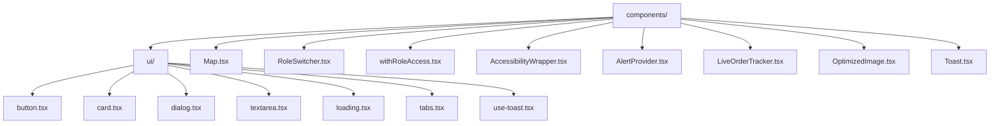

**Diagram sources**
- [components/ui/button.tsx](file://components/ui/button.tsx)
- [components/ui/card.tsx](file://components/ui/card.tsx)
- [components/ui/dialog.tsx](file://components/ui/dialog.tsx)

**Section sources**
- [components/Map.tsx](file://components/Map.tsx)
- [components/RoleSwitcher.tsx](file://components/RoleSwitcher.tsx)
- [components/withRoleAccess.tsx](file://components/withRoleAccess.tsx)

## Presentational vs. Specialized Components
The components directory distinguishes between presentational components in the root directory and specialized UI components in the components/ui/ subdirectory.

### Presentational Components
Presentational components in the root of the components directory are higher-level components that implement specific application functionality. These components often combine multiple UI components to create complex interfaces.

### Specialized UI Components
The components/ui/ directory contains atomic, reusable UI elements that follow a consistent design system. These components are designed to be used across the application to maintain visual consistency.

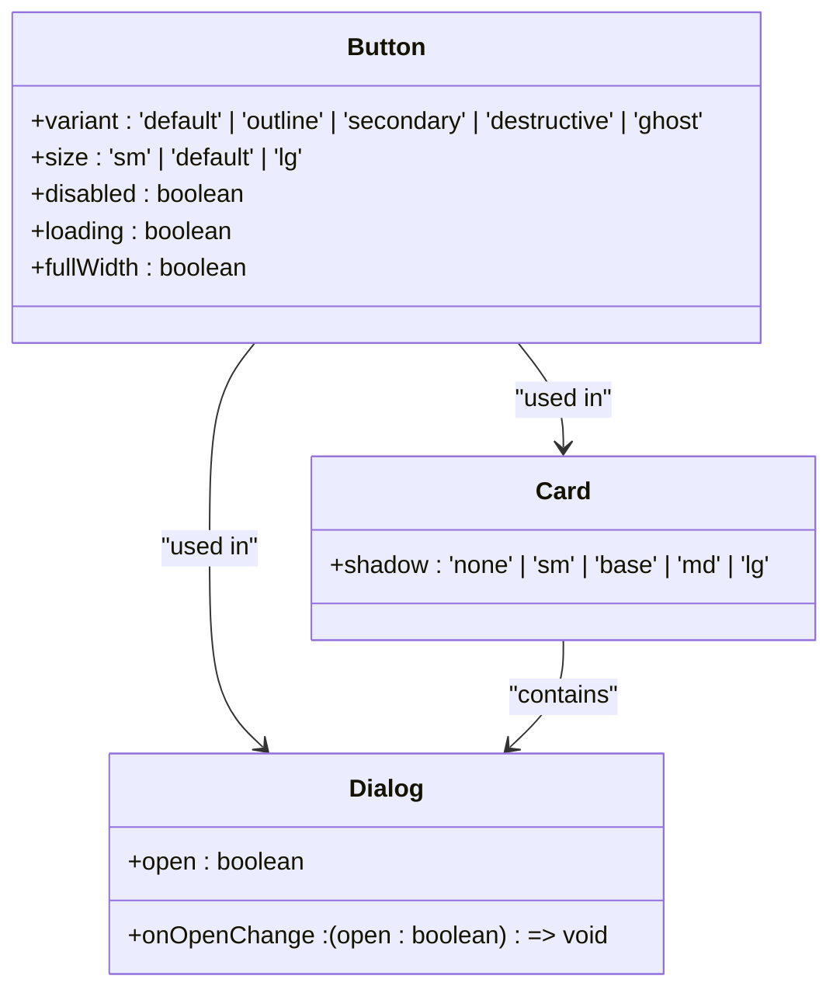

**Diagram sources**
- [components/ui/button.tsx](file://components/ui/button.tsx)
- [components/ui/card.tsx](file://components/ui/card.tsx)
- [components/ui/dialog.tsx](file://components/ui/dialog.tsx)

**Section sources**
- [components/ui/button.tsx](file://components/ui/button.tsx)
- [components/ui/card.tsx](file://components/ui/card.tsx)
- [components/ui/dialog.tsx](file://components/ui/dialog.tsx)

## Cross-Platform Component Implementation
The application implements cross-platform components that conditionally render native or web variants based on the runtime environment. The Map component is a prime example of this pattern.

### Map Component Architecture
The Map component uses platform detection to render the appropriate implementation for native (iOS/Android) or web environments.

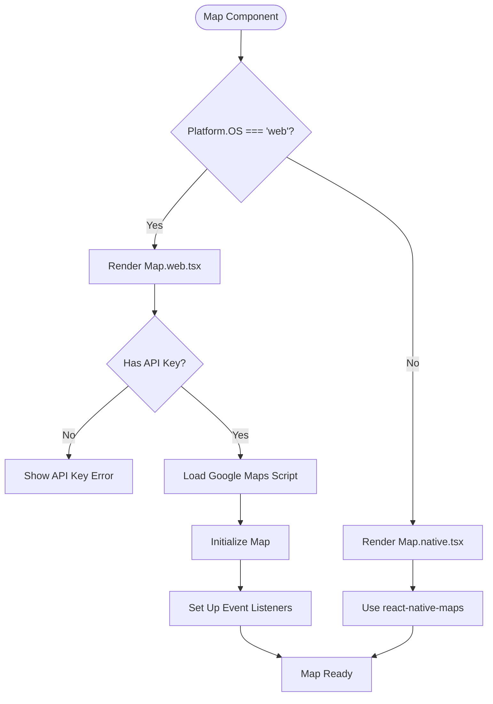

**Diagram sources**
- [components/Map.tsx](file://components/Map.tsx)
- [components/Map.native.tsx](file://components/Map.native.tsx)
- [components/Map.web.tsx](file://components/Map.web.tsx)

**Section sources**
- [components/Map.tsx](file://components/Map.tsx)
- [components/Map.native.tsx](file://components/Map.native.tsx)
- [components/Map.web.tsx](file://components/Map.web.tsx)

## Role-Based UI Components
The application implements role-based UI rendering through specialized components that control access and display based on user roles.

### RoleSwitcher Component
The RoleSwitcher component provides a modal interface for users to switch between different roles (consumer, merchant, driver) within the application.

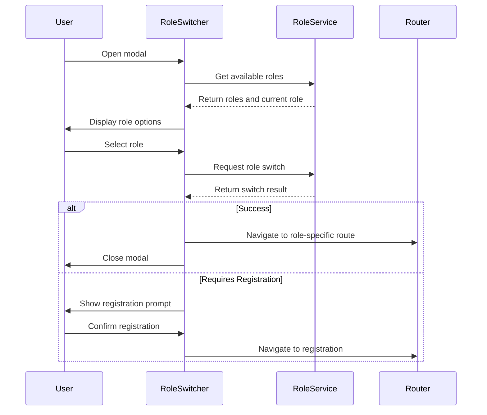

**Diagram sources**
- [components/RoleSwitcher.tsx](file://components/RoleSwitcher.tsx)
- [services/roleManagementService.ts](file://services/roleManagementService.ts)
- [app.config.js](file://app.config.js)

**Section sources**
- [components/RoleSwitcher.tsx](file://components/RoleSwitcher.tsx)

### withRoleAccess Higher-Order Component
The withRoleAccess component is a higher-order component that wraps other components to enforce role-based access control.

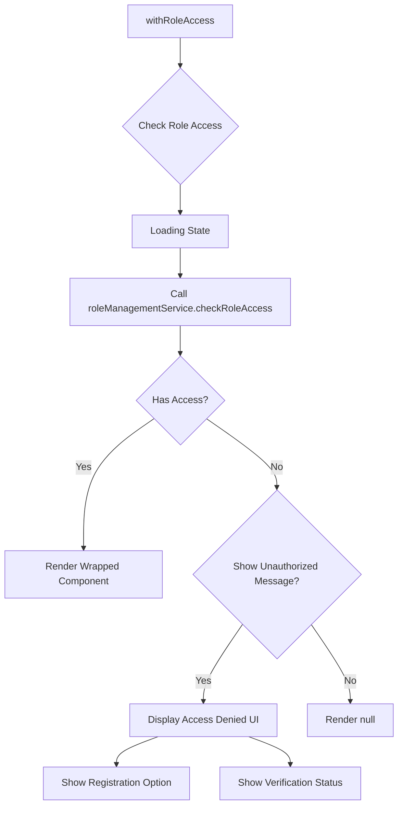

**Diagram sources**
- [components/withRoleAccess.tsx](file://components/withRoleAccess.tsx)
- [services/roleManagementService.ts](file://services/roleManagementService.ts)

**Section sources**
- [components/withRoleAccess.tsx](file://components/withRoleAccess.tsx)

## React Hooks in Components
The application leverages React hooks within components for state management and side effects, following modern React patterns.

### Custom Hooks Usage
Components use both built-in React hooks and custom application hooks to manage state and side effects.

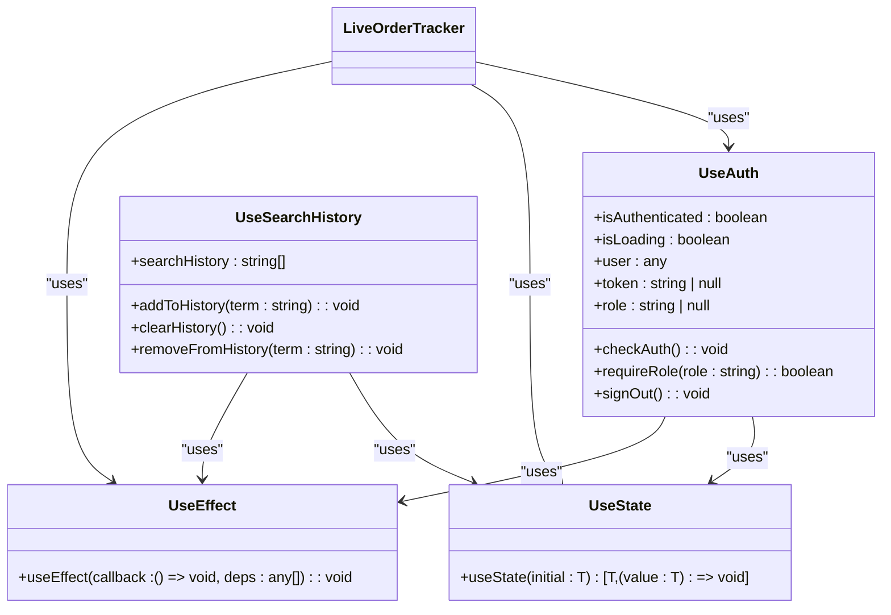

**Diagram sources**
- [hooks/useAuth.ts](file://hooks/useAuth.ts)
- [hooks/useSearchHistory.ts](file://hooks/useSearchHistory.ts)
- [components/LiveOrderTracker.tsx](file://components/LiveOrderTracker.tsx)

**Section sources**
- [hooks/useAuth.ts](file://hooks/useAuth.ts)
- [hooks/useSearchHistory.ts](file://hooks/useSearchHistory.ts)

## Component Composition Patterns
The application employs various component composition patterns to create complex UIs from simpler, reusable components.

### Container-Component Pattern
Many screens use a container-component pattern where a container manages state and data fetching, while presentational components handle rendering.

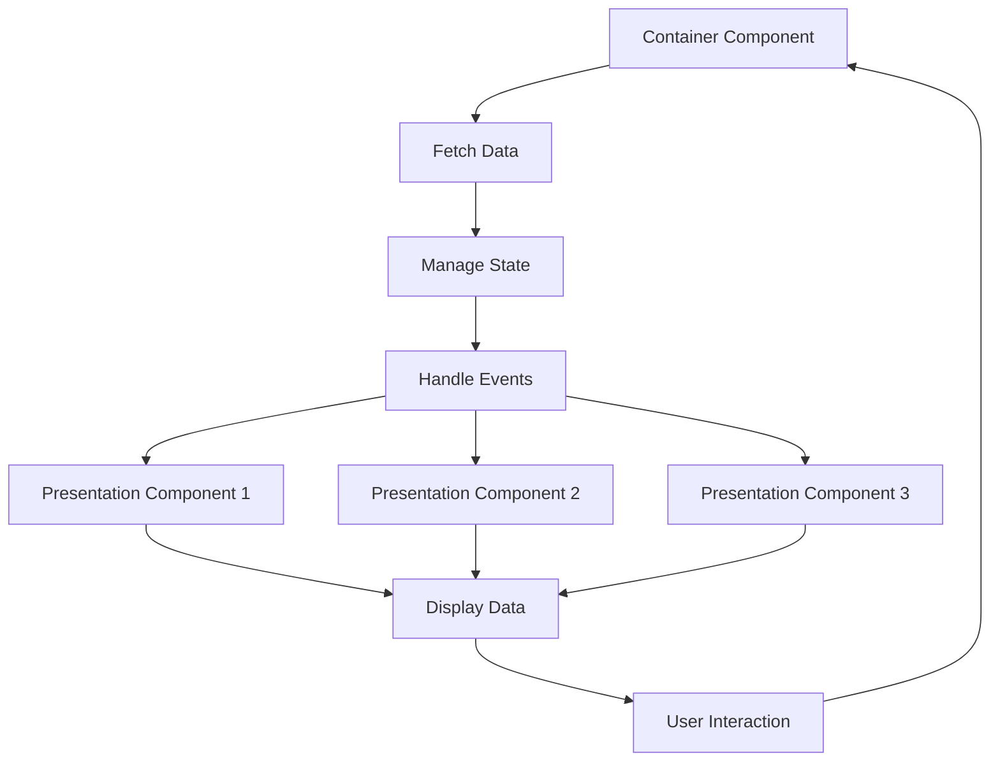

**Diagram sources**
- [components/LiveOrderTracker.tsx](file://components/LiveOrderTracker.tsx)
- [components/RoleSwitcher.tsx](file://components/RoleSwitcher.tsx)

**Section sources**
- [components/LiveOrderTracker.tsx](file://components/LiveOrderTracker.tsx)

### Provider Pattern
The application uses the React context provider pattern for global state management and service access.

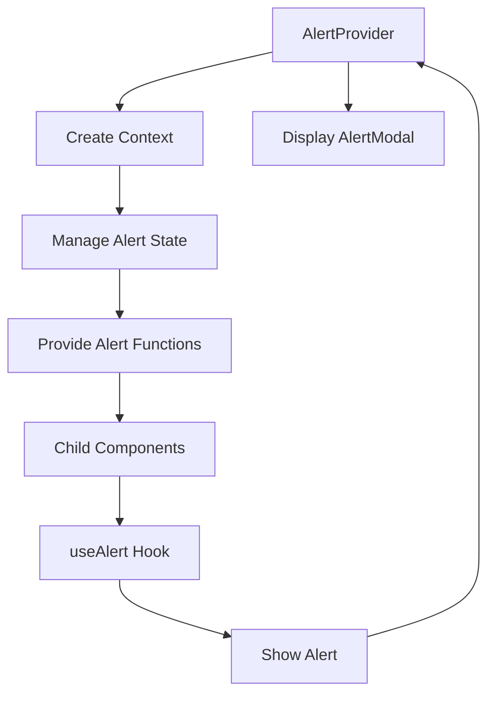

**Diagram sources**
- [components/AlertProvider.tsx](file://components/AlertProvider.tsx)
- [components/AlertModal.tsx](file://components/AlertModal.tsx)

**Section sources**
- [components/AlertProvider.tsx](file://components/AlertProvider.tsx)

## Styling, Accessibility, and Responsiveness
The components follow consistent patterns for styling, accessibility, and responsiveness to ensure a high-quality user experience across devices.

### Styling System
The application uses a theme-based styling system that centralizes design tokens and ensures consistency.

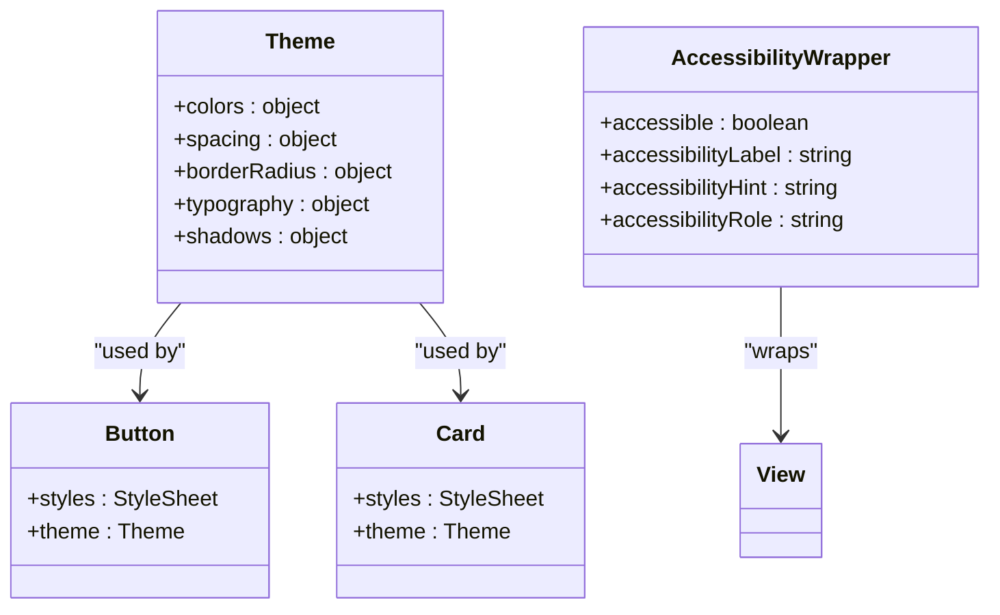

**Diagram sources**
- [config/theme.ts](file://config/theme.ts)
- [components/ui/button.tsx](file://components/ui/button.tsx)
- [components/ui/card.tsx](file://components/ui/card.tsx)
- [components/AccessibilityWrapper.tsx](file://components/AccessibilityWrapper.tsx)

**Section sources**
- [config/theme.ts](file://config/theme.ts)
- [components/AccessibilityWrapper.tsx](file://components/AccessibilityWrapper.tsx)

### Responsive Design
Components implement responsive design patterns to adapt to different screen sizes and orientations.

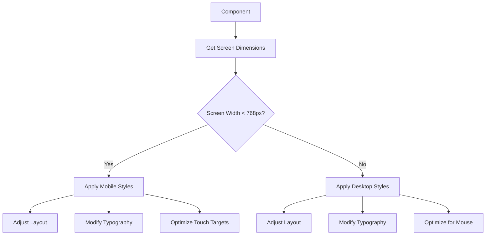

**Diagram sources**
- [components/ui/card.tsx](file://components/ui/card.tsx)
- [components/OptimizedImage.tsx](file://components/OptimizedImage.tsx)

**Section sources**
- [components/ui/card.tsx](file://components/ui/card.tsx)

## Best Practices for Creating New Components
When creating new components, follow these established patterns and conventions to maintain consistency with the existing codebase.

### Component Structure
New components should follow the established structure and organization patterns.

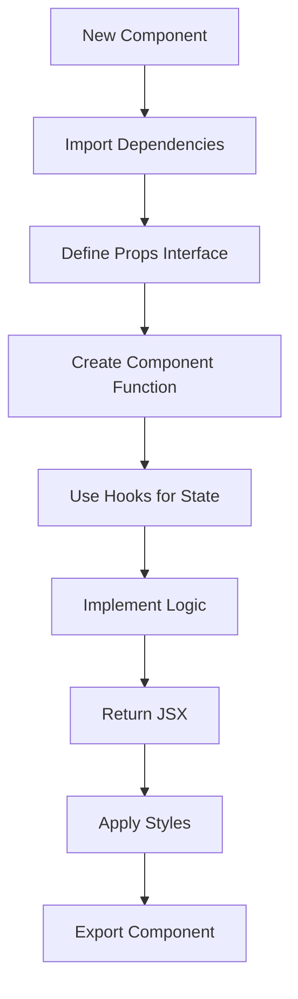

**Section sources**
- [components/ui/button.tsx](file://components/ui/button.tsx)
- [components/Toast.tsx](file://components/Toast.tsx)

### Styling Guidelines
Follow the established styling conventions when creating new components.

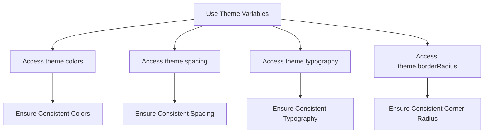

**Section sources**
- [config/theme.ts](file://config/theme.ts)
- [components/ui/button.tsx](file://components/ui/button.tsx)

### Accessibility Implementation
Ensure all new components are accessible to users with disabilities.

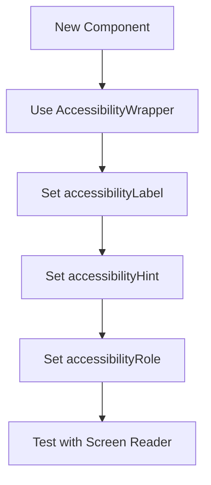

**Section sources**
- [components/AccessibilityWrapper.tsx](file://components/AccessibilityWrapper.tsx)

### Performance Optimization
Implement performance optimizations in new components.

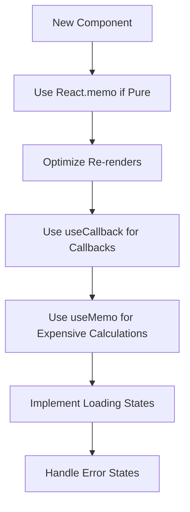

**Section sources**
- [components/OptimizedImage.tsx](file://components/OptimizedImage.tsx)
- [components/Toast.tsx](file://components/Toast.tsx)