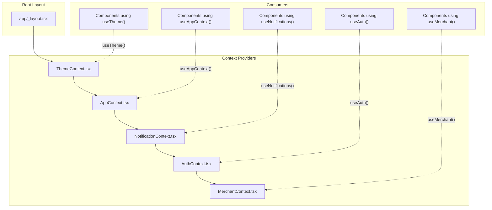
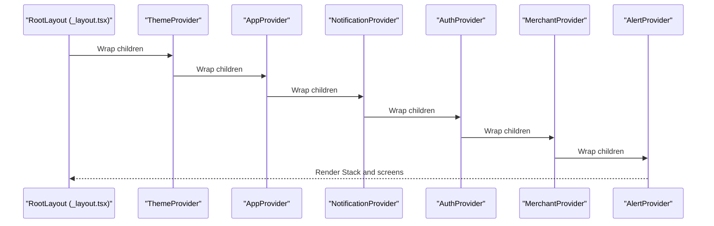
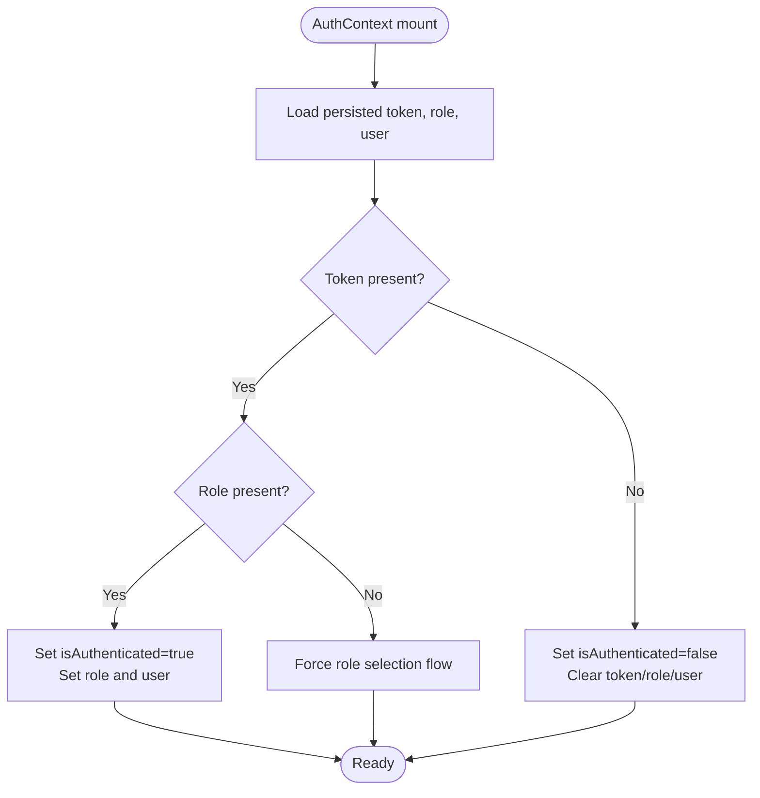
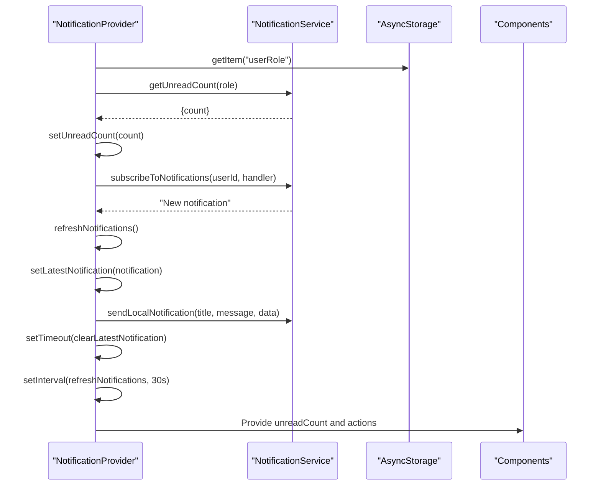
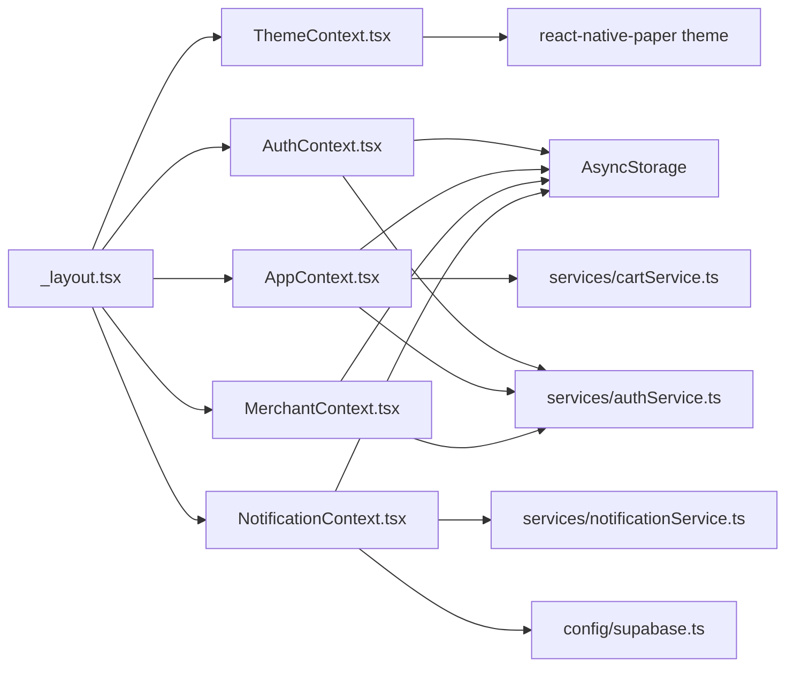

# Contexts Directory

<cite>
**Referenced Files in This Document**
- [AuthContext.tsx](file://contexts/AuthContext.tsx)
- [AppContext.tsx](file://contexts/AppContext.tsx)
- [MerchantContext.tsx](file://contexts/MerchantContext.tsx)
- [NotificationContext.tsx](file://contexts/NotificationContext.tsx)
- [ThemeContext.tsx](file://contexts/ThemeContext.tsx)
- [_layout.tsx](file://app/_layout.tsx)
- [useAuth.ts](file://hooks/useAuth.ts)
- [performance.ts](file://utils/performance.ts)
- [ErrorBoundary.tsx](file://components/ErrorBoundary.tsx)
- [AlertProvider.tsx](file://components/AlertProvider.tsx)
</cite>

## Table of Contents
1. [Introduction](#introduction)
2. [Project Structure](#project-structure)
3. [Core Components](#core-components)
4. [Architecture Overview](#architecture-overview)
5. [Detailed Component Analysis](#detailed-component-analysis)
6. [Dependency Analysis](#dependency-analysis)
7. [Performance Considerations](#performance-considerations)
8. [Troubleshooting Guide](#troubleshooting-guide)
9. [Conclusion](#conclusion)

## Introduction
This document explains the contexts directory that manages global application state using React Context API. It covers the purpose, state shape, update mechanisms, and composition of five context providers:
- AuthContext: user authentication state and lifecycle
- AppContext: role-aware session and app-wide preferences
- MerchantContext: merchant identity persistence
- NotificationContext: real-time alerts and unread counts
- ThemeContext: visual theme and color palette

It also documents how providers are composed in the root layout to make state available throughout the app, consumer patterns, performance considerations, and common issues such as initialization order and error boundaries.

## Project Structure
The contexts are organized as individual files under contexts/, each exporting a Provider and a typed hook. They are composed in the root layout to wrap the entire navigation tree.

**Diagram sources**
- [_layout.tsx](file://app/_layout.tsx#L80-L117)
- [ThemeContext.tsx](file://contexts/ThemeContext.tsx#L65-L143)
- [AppContext.tsx](file://contexts/AppContext.tsx#L35-L139)
- [NotificationContext.tsx](file://contexts/NotificationContext.tsx#L18-L155)
- [AuthContext.tsx](file://contexts/AuthContext.tsx#L30-L140)
- [MerchantContext.tsx](file://contexts/MerchantContext.tsx#L14-L63)

**Section sources**
- [_layout.tsx](file://app/_layout.tsx#L80-L117)

## Core Components
- AuthContext: Manages user identity, authentication status, token, role, and exposes sign-out and refresh helpers. Loads persisted credentials and user data on startup.
- AppContext: Centralizes user, cart count, online status, and history lists. Persists and restores search history and recently viewed items.
- MerchantContext: Stores and persists merchantId for merchant role users, with fallback to AsyncStorage.
- NotificationContext: Tracks unread count, latest notification, and provides actions to mark as read. Subscribes to real-time notifications and falls back to periodic polling.
- ThemeContext: Controls theme mode (light/dark/system), computed colors, and toggles dark mode while syncing with a UI library theme.

**Section sources**
- [AuthContext.tsx](file://contexts/AuthContext.tsx#L1-L149)
- [AppContext.tsx](file://contexts/AppContext.tsx#L1-L148)
- [MerchantContext.tsx](file://contexts/MerchantContext.tsx#L1-L63)
- [NotificationContext.tsx](file://contexts/NotificationContext.tsx#L1-L164)
- [ThemeContext.tsx](file://contexts/ThemeContext.tsx#L1-L154)

## Architecture Overview
The root layout composes providers in a strict order to ensure downstream consumers can rely on upstream state. The composition ensures:
- ThemeProvider wraps everything to apply theme consistently
- AppProvider initializes app-wide state and preferences
- NotificationProvider sets up real-time subscriptions and unread counters
- AuthProvider loads authentication state and exposes sign-out/refresh
- MerchantProvider persists merchant identity for merchant role users
- AlertProvider provides alert modal orchestration

**Diagram sources**
- [_layout.tsx](file://app/_layout.tsx#L80-L117)

**Section sources**
- [_layout.tsx](file://app/_layout.tsx#L80-L117)

## Detailed Component Analysis

### AuthContext
Purpose:
- Manage user authentication state, token, role, and loading status.
- Persist and restore user data and role across sessions.
- Provide sign-out and refresh helpers.

State shape:
- user: User object or null
- isAuthenticated: boolean
- isLoading: boolean
- token: string | null
- role: string | null

Update mechanisms:
- loadUserData: Reads AsyncStorage for token, role, and stored user; sets state accordingly; triggers role selection flow if token present but role absent.
- refreshUser: Fetches current profile from service and updates AsyncStorage and context state.
- signOut: Clears tokens and roles, resets state.

Consumer pattern:
- useAuth hook returns the context value; components call signOut and refreshUser as needed.

**Diagram sources**
- [AuthContext.tsx](file://contexts/AuthContext.tsx#L37-L79)

**Section sources**
- [AuthContext.tsx](file://contexts/AuthContext.tsx#L1-L149)

### AppContext
Purpose:
- Maintain app-wide state: user, cart count, online status, search history, and recently viewed items.
- Persist and restore search history and recently viewed items.

State shape:
- user: User | null
- cartCount: number
- isOnline: boolean
- searchHistory: string[]
- recentlyViewed: any[]

Update mechanisms:
- loadPersistedData: Restores user, search history, and recently viewed items from AsyncStorage.
- setUser: Updates user field.
- updateCartCount: Calls cart service to fetch and set cart count.
- setIsOnline: Sets network online/offline status.
- addToSearchHistory: Deduplicates and limits to last 10 entries; persists to AsyncStorage.
- clearSearchHistory: Removes persisted search history and clears state.
- addToRecentlyViewed: Deduplicates by item id and limits to last 20; persists to AsyncStorage.
- refreshUserData: Fetches current user from auth service and updates state.

Consumer pattern:
- useAppContext hook returns the state plus setters and helpers; components call updateCartCount and manage history.

**Section sources**
- [AppContext.tsx](file://contexts/AppContext.tsx#L1-L148)

### MerchantContext
Purpose:
- Persist merchantId for merchant role users and provide helpers to load/set it.

State shape:
- merchantId: string | null

Update mechanisms:
- loadMerchantId: Attempts to derive merchantId from stored user data; falls back to AsyncStorage.
- setMerchantId: Updates state and persists/removes merchantId in AsyncStorage.

Consumer pattern:
- useMerchant hook returns merchantId and helpers; merchant pages call loadMerchantId and setMerchantId.

**Section sources**
- [MerchantContext.tsx](file://contexts/MerchantContext.tsx#L1-L63)

### NotificationContext
Purpose:
- Track unread notification count and latest notification.
- Provide actions to mark as read and mark all as read.
- Subscribe to real-time notifications and poll periodically.

State shape:
- unreadCount: number
- latestNotification: Notification | null

Update mechanisms:
- refreshNotifications: Queries unread count by user role; defaults to 0 on error.
- markAsRead: Marks a notification as read and refreshes unread count.
- markAllAsRead: Marks all as read and refreshes unread count.
- clearLatestNotification: Clears the latest notification display.
- Real-time subscription: Subscribes to notifications via a service, updates unread count, shows latest notification, sends local push, and auto-clears after delay.
- Fallback polling: Every 30 seconds; listens to window focus to refresh unread count.

Consumer pattern:
- useNotifications hook returns unreadCount, latestNotification, and actions; components display badges and banners.

**Diagram sources**
- [NotificationContext.tsx](file://contexts/NotificationContext.tsx#L18-L155)

**Section sources**
- [NotificationContext.tsx](file://contexts/NotificationContext.tsx#L1-L164)

### ThemeContext
Purpose:
- Control theme mode (light/dark/system), compute theme colors, and toggle dark mode.
- Sync with a UI library theme provider.

State shape:
- theme: 'light' | 'dark' | 'system'
- colors: ThemeColors derived from theme mode
- isDark: boolean reflecting effective dark mode

Update mechanisms:
- Toggle theme: Switches between light and dark modes.
- System color scheme: Reacts to device/system preference when theme is 'system'.
- Paper theme sync: Updates the UI library theme colors and dark flag when isDark changes.

Consumer pattern:
- useTheme hook returns theme controls and colors; components consume colors for styling.

**Section sources**
- [ThemeContext.tsx](file://contexts/ThemeContext.tsx#L1-L154)

## Dependency Analysis
Contexts depend on services and AsyncStorage for persistence and remote data. The root layout composes providers in a strict order to ensure downstream consumers can rely on upstream state.

**Diagram sources**
- [AuthContext.tsx](file://contexts/AuthContext.tsx#L1-L149)
- [AppContext.tsx](file://contexts/AppContext.tsx#L1-L148)
- [MerchantContext.tsx](file://contexts/MerchantContext.tsx#L1-L63)
- [NotificationContext.tsx](file://contexts/NotificationContext.tsx#L1-L164)
- [ThemeContext.tsx](file://contexts/ThemeContext.tsx#L1-L154)
- [_layout.tsx](file://app/_layout.tsx#L80-L117)

**Section sources**
- [AuthContext.tsx](file://contexts/AuthContext.tsx#L1-L149)
- [AppContext.tsx](file://contexts/AppContext.tsx#L1-L148)
- [MerchantContext.tsx](file://contexts/MerchantContext.tsx#L1-L63)
- [NotificationContext.tsx](file://contexts/NotificationContext.tsx#L1-L164)
- [ThemeContext.tsx](file://contexts/ThemeContext.tsx#L1-L154)
- [_layout.tsx](file://app/_layout.tsx#L80-L117)

## Performance Considerations
- Memoization and callbacks:
  - Context providers use useCallback for action functions to prevent unnecessary re-renders of consumers.
  - Consumers can leverage React.memo and useMemo to minimize re-renders when consuming multiple context values.
- Asynchronous initialization:
  - Providers perform asynchronous reads from AsyncStorage and services during mount. Consumers should guard against loading states (e.g., isLoading) until providers finish hydration.
- Real-time updates:
  - NotificationProvider subscribes to real-time events and polls periodically. Consumers should avoid triggering excessive refreshes and rely on the provider’s refreshNotifications.
- Persistence:
  - AppContext persists search history and recently viewed items to AsyncStorage; ensure updates are debounced or batched to reduce write frequency.
- Hook-based auth checks:
  - useAuth performs caching and token expiry checks to avoid redundant network calls. Consumers should use requireRole and checkAuth to gate routes efficiently.

**Section sources**
- [AppContext.tsx](file://contexts/AppContext.tsx#L72-L111)
- [NotificationContext.tsx](file://contexts/NotificationContext.tsx#L18-L155)
- [useAuth.ts](file://hooks/useAuth.ts#L1-L116)
- [performance.ts](file://utils/performance.ts#L1-L240)

## Troubleshooting Guide
Common issues and resolutions:
- Context initialization order:
  - Ensure providers are wrapped in the correct order in the root layout. AuthProvider depends on persisted data; NotificationProvider depends on user role; MerchantProvider depends on user role.
- Missing provider:
  - Using a hook without its provider throws a descriptive error. Verify the provider is included in the layout chain.
- Authentication state mismatches:
  - If a token exists but role is missing, AuthContext forces role selection. Ensure AsyncStorage keys are consistent and synchronized.
- Real-time notifications not updating:
  - NotificationProvider falls back to polling and window focus handling. If real-time subscription fails, verify user role and backend connectivity.
- Theme not applying:
  - ThemeContext syncs with the UI library theme. Ensure ThemeProvider is at the top of the tree and that system color scheme changes propagate.

Error handling patterns:
- Root-level error boundary:
  - RootLayout wraps the app in an error boundary to gracefully handle runtime errors and provide a reset option.
- Component-level error boundary:
  - Components can use a class-based ErrorBoundary to capture and log errors locally.

**Section sources**
- [_layout.tsx](file://app/_layout.tsx#L80-L117)
- [ErrorBoundary.tsx](file://components/ErrorBoundary.tsx#L1-L92)
- [AuthContext.tsx](file://contexts/AuthContext.tsx#L142-L149)
- [AppContext.tsx](file://contexts/AppContext.tsx#L141-L148)
- [MerchantContext.tsx](file://contexts/MerchantContext.tsx#L56-L63)
- [NotificationContext.tsx](file://contexts/NotificationContext.tsx#L156-L164)
- [ThemeContext.tsx](file://contexts/ThemeContext.tsx#L145-L151)

## Conclusion
The contexts directory centralizes global state with clear separation of concerns:
- AuthContext handles authentication and user identity
- AppContext manages session and preferences
- MerchantContext persists merchant identity
- NotificationContext delivers real-time alerts and unread counts
- ThemeContext controls visual styling

They are composed in the root layout to ensure predictable initialization order and consistent availability across the app. Consumers use typed hooks to access state and actions, while performance utilities and error boundaries help maintain reliability and responsiveness.