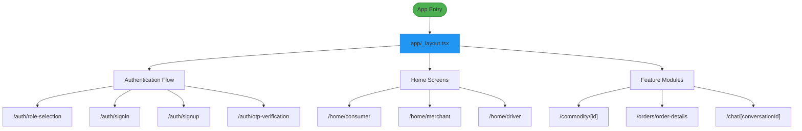
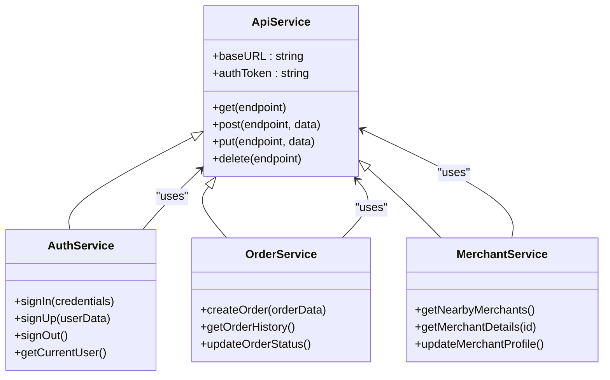
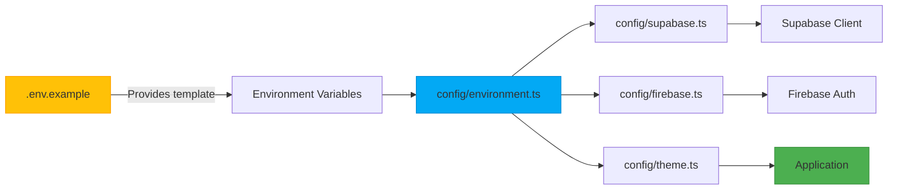

# Directory Structure

<cite>
**Referenced Files in This Document**   
- [app.config.js](file://app.config.js)
- [package.json](file://package.json)
- [ARCHITECTURE.md](file://ARCHITECTURE.md)
- [.env.example](file://.env.example)
- [app/_layout.tsx](file://app/_layout.tsx)
- [config/environment.ts](file://config/environment.ts)
- [config/supabase.ts](file://config/supabase.ts)
- [contexts/AppContext.tsx](file://contexts/AppContext.tsx)
- [contexts/AuthContext.tsx](file://contexts/AuthContext.tsx)
- [services/api.ts](file://services/api.ts)
- [services/types.ts](file://services/types.ts)
- [dataconnect/schema/schema.gql](file://dataconnect/schema/schema.gql)
- [src/dataconnect-generated](file://src/dataconnect-generated)
- [src/dataconnect-admin-generated](file://src/dataconnect-admin-generated)
</cite>

## Table of Contents
1. [Top-Level Directory Overview](#top-level-directory-overview)
2. [Native Configuration Directories](#native-configuration-directories)
3. [Application Screens and Routing](#application-screens-and-routing)
4. [Reusable UI Components](#reusable-ui-components)
5. [Business Logic and Services](#business-logic-and-services)
6. [State Management Contexts](#state-management-contexts)
7. [Database and Backend Configuration](#database-and-backend-configuration)
8. [Configuration and Environment Setup](#configuration-and-environment-setup)
9. [Generated Code Structure](#generated-code-structure)
10. [Architectural Guidance for New Features](#architectural-guidance-for-new-features)

## Top-Level Directory Overview

The BrillPrime application follows a well-organized directory structure designed to separate concerns and maintain scalability across its cross-platform implementation. The architecture leverages Expo Router for file-based routing, React Context for state management, and a serverless backend powered by Supabase and Firebase. This structure enables clear separation between native configurations, application logic, UI components, and backend services.

**Section sources**
- [ARCHITECTURE.md](file://ARCHITECTURE.md)
- [app.config.js](file://app.config.js)
- [package.json](file://package.json)

## Native Configuration Directories

### android/
This directory contains all Android-specific native configurations and build files required for the Expo-managed workflow. It includes the AndroidManifest.xml files for different build variants (debug, debugOptimized, main), Gradle configuration files, and platform-specific resources such as drawables and string values. The build.gradle files configure the Android application package, dependencies, and compilation settings.

### ios/
This directory contains iOS-specific configuration files, primarily the GoogleService-Info.plist file which provides Firebase configuration for the iOS platform. In a complete implementation, this directory would typically contain additional iOS-specific files such as AppDelegate configuration, Info.plist, and other native iOS resources. The current structure indicates a minimal iOS configuration focused on Firebase integration.

**Section sources**
- [app.config.js](file://app.config.js)
- [ios/GoogleService-Info.plist](file://ios/GoogleService-Info.plist)
- [android/app/src/main/AndroidManifest.xml](file://android/app/src/main/AndroidManifest.xml)

## Application Screens and Routing

### app/
This directory serves as the core of the application's user interface, implementing the Expo Router-based file system routing. The directory structure directly maps to navigation paths in the application:

- **Authentication flows**: `auth/` contains signin, signup, password recovery, and role selection screens
- **User roles**: `consumer/`, `merchant/`, and `driver/` directories contain role-specific functionality
- **Feature modules**: `commodity/`, `orders/`, `payment/`, and other business domains
- **Layout system**: `_layout.tsx` defines the root stack navigator and global providers
- **Dynamic routes**: Files like `[id].tsx` and `[conversationId].tsx` enable parameterized routing

The file-based routing system automatically generates navigation paths based on the directory structure, with special files like `_layout.tsx` defining nested navigators and `index.tsx` representing default routes.

**Diagram sources**
- [app/_layout.tsx](file://app/_layout.tsx)
- [app/auth/role-selection.tsx](file://app/auth/role-selection.tsx)
- [app/home/consumer.tsx](file://app/home/consumer.tsx)

**Section sources**
- [app/_layout.tsx](file://app/_layout.tsx)
- [ROUTING_VERIFICATION.md](file://ROUTING_VERIFICATION.md)
- [app.config.js](file://app.config.js)

## Reusable UI Components

### components/
This directory houses all reusable UI elements that can be shared across different screens and features of the application. The structure separates generic UI components from application-specific ones:

- **ui/**: Contains atomic design system components like Button, Card, Dialog, and Tabs
- **Functional components**: Specialized components like MapContainer, LiveOrderTracker, and CommunicationModal
- **Utility components**: Higher-order components like withRoleAccess and ErrorBoundary
- **Styling**: CSS modules for component-specific styling

These components follow React best practices with proper TypeScript typing and are designed to be composable and reusable across the application.

**Section sources**
- [components/ui/button.tsx](file://components/ui/button.tsx)
- [components/MapContainer.tsx](file://components/MapContainer.tsx)
- [components/withRoleAccess.tsx](file://components/withRoleAccess.tsx)

## Business Logic and Services

### services/
This directory contains all business logic and API service implementations that handle communication with backend systems. Each service file corresponds to a specific domain:

- **Authentication**: authService.ts handles user sign-in, sign-up, and session management
- **Data operations**: api.ts provides the base API client configuration
- **Domain-specific services**: commodityService.ts, orderService.ts, merchantService.ts
- **Utility services**: locationService.ts, notificationService.ts, errorService.ts

The services abstract away the complexity of API calls, error handling, and data transformation, providing a clean interface for components to interact with backend functionality.

**Diagram sources**
- [services/api.ts](file://services/api.ts)
- [services/authService.ts](file://services/authService.ts)
- [services/orderService.ts](file://services/orderService.ts)

**Section sources**
- [services/api.ts](file://services/api.ts)
- [services/types.ts](file://services/types.ts)
- [services/authService.ts](file://services/authService.ts)

## State Management Contexts

### contexts/
This directory implements the React Context API for global state management across the application. Each context file provides a provider component and custom hooks for consuming state:

- **AppContext.tsx**: Manages global application state including user data, cart count, and search history
- **AuthContext.tsx**: Handles authentication state, user session, and role-based access
- **MerchantContext.tsx**: Stores merchant-specific data and preferences
- **NotificationContext.tsx**: Manages push notifications and in-app alerts
- **ThemeContext.tsx**: Handles light/dark mode and visual theme preferences

The context providers are wrapped in the root _layout.tsx file, making state available throughout the application hierarchy.

**Section sources**
- [contexts/AppContext.tsx](file://contexts/AppContext.tsx)
- [contexts/AuthContext.tsx](file://contexts/AuthContext.tsx)
- [app/_layout.tsx](file://app/_layout.tsx)

## Database and Backend Configuration

### supabase/
This directory contains all database schema definitions, migration scripts, and edge function implementations:

- **Database schema**: SQL files defining table structures and constraints
- **Edge functions**: TypeScript functions in `supabase/functions/` that run on the server
- **Migration scripts**: SQL files for database setup and seed data
- **Security policies**: Row-level security (RLS) configurations

The architecture follows a serverless pattern where Supabase handles all backend operations, including database access, authentication, and real-time subscriptions.

### dataconnect/
This directory contains Data Connect configuration files and GraphQL schema definitions that define the data model and API endpoints for the application.

**Section sources**
- [supabase/functions/index.ts](file://supabase/functions/index.ts)
- [supabase/schema.sql](file://supabase/schema.sql)
- [dataconnect/schema/schema.gql](file://dataconnect/schema/schema.gql)

## Configuration and Environment Setup

### config/
This directory centralizes all application configuration and environment-specific settings:

- **environment.ts**: Exports configuration constants based on environment variables
- **supabase.ts**: Initializes and configures the Supabase client with validation
- **firebase.ts**: Configures Firebase services for authentication
- **theme.ts**: Defines the application's visual theme and styling constants

### .env.example
This file provides a template for environment variables required by the application. It includes configuration for:

- **Supabase**: URL and anonymous key for database access
- **Firebase**: API keys and project identifiers for authentication
- **Google Maps**: API key for map functionality
- **Feature flags**: Optional settings for analytics and debug mode

The environment variables are loaded at runtime and accessed through the configuration files in the config/ directory.

**Diagram sources**
- [.env.example](file://.env.example)
- [config/environment.ts](file://config/environment.ts)
- [config/supabase.ts](file://config/supabase.ts)

**Section sources**
- [.env.example](file://.env.example)
- [config/environment.ts](file://config/environment.ts)
- [app.config.js](file://app.config.js)

## Generated Code Structure

### src/dataconnect-generated/
This directory contains auto-generated code from the Data Connect configuration. The generated files provide type-safe access to the backend data model and are automatically updated when the schema changes. The structure includes:

- **ESM modules**: Modern JavaScript modules for tree-shaking
- **TypeScript definitions**: Type declarations for type safety
- **React hooks**: Generated hooks for data fetching and mutations

### src/dataconnect-admin-generated/
This directory contains admin-specific generated code with elevated permissions for administrative operations on the data model.

The separation between manually written code and generated code ensures that developers can extend functionality without modifying generated files, which would be overwritten on regeneration.

**Section sources**
- [src/dataconnect-generated](file://src/dataconnect-generated)
- [src/dataconnect-admin-generated](file://src/dataconnect-admin-generated)
- [package.json](file://package.json)

## Architectural Guidance for New Features

When adding new features to the BrillPrime application, follow these architectural patterns:

1. **Screens and Navigation**: Place new UI screens in the `app/` directory following the feature-based organization. Use dynamic route parameters (`[id].tsx`) for item-specific views.

2. **Reusable Components**: Add shared UI elements to the `components/` directory, placing generic components in `components/ui/` and feature-specific components at the root level.

3. **Business Logic**: Implement new service methods in the appropriate service file in `services/`, or create a new service file for major domains.

4. **State Management**: Use existing contexts when possible, or create a new context in `contexts/` for feature-specific global state.

5. **Backend Integration**: Define new database schema in `supabase/` and implement edge functions in `supabase/functions/` for complex business logic.

6. **Configuration**: Add new environment variables to `.env.example` and access them through the configuration system in `config/`.

7. **Generated Code**: Never modify files in `src/dataconnect-generated/` or `src/dataconnect-admin-generated/` as they are auto-generated.

The architecture follows a clear separation of concerns, with the frontend (Expo), authentication (Firebase), and backend (Supabase) operating as independent but integrated systems.

**Section sources**
- [ARCHITECTURE.md](file://ARCHITECTURE.md)
- [app.config.js](file://app.config.js)
- [.env.example](file://.env.example)
- [config/environment.ts](file://config/environment.ts)