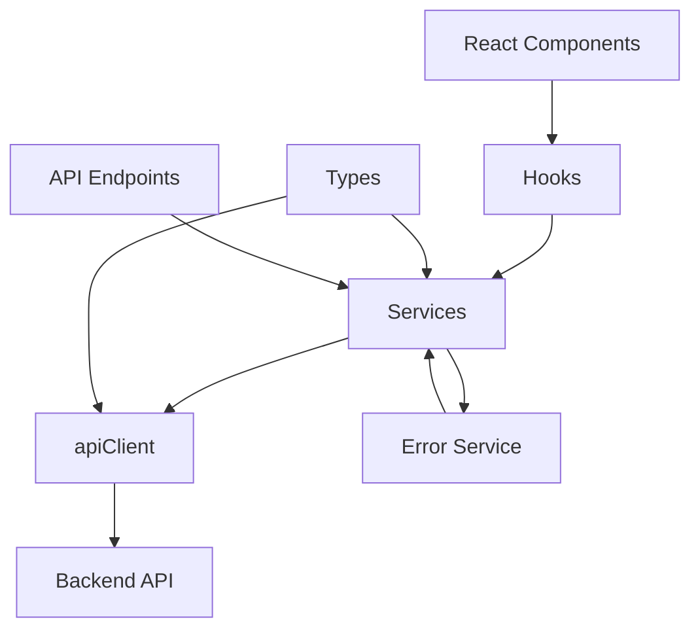
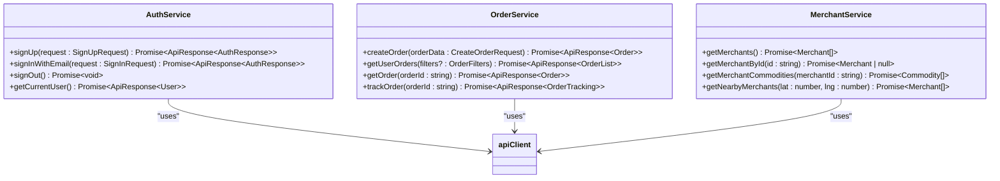
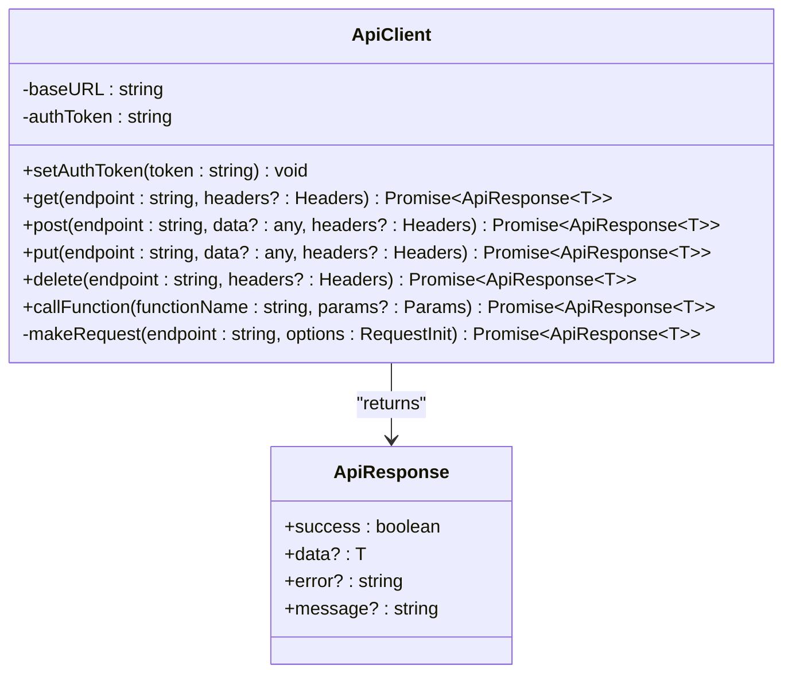
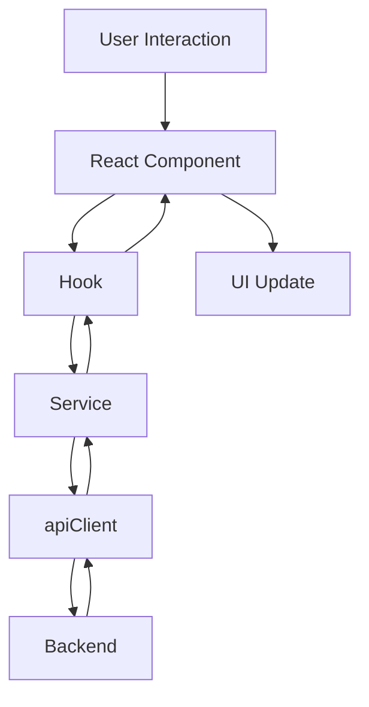
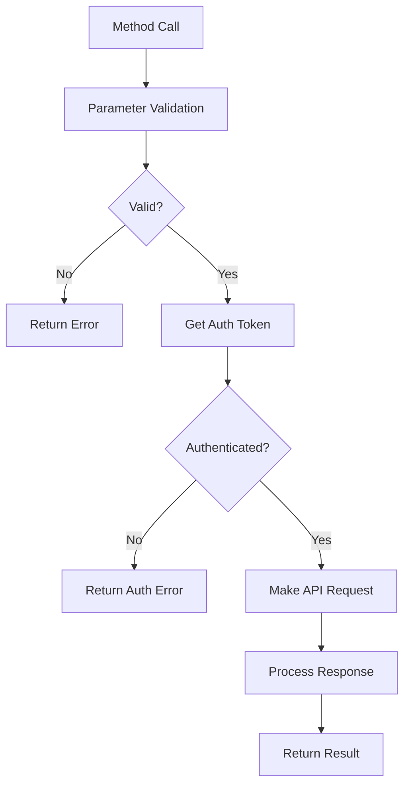

# Services Directory

<cite>
**Referenced Files in This Document**   
- [api.ts](file://services/api.ts)
- [types.ts](file://services/types.ts)
- [apiEndpoints.ts](file://services/apiEndpoints.ts)
- [authService.ts](file://services/authService.ts)
- [orderService.ts](file://services/orderService.ts)
- [merchantService.ts](file://services/merchantService.ts)
- [locationService.ts](file://services/locationService.ts)
- [commodityService.ts](file://services/commodityService.ts)
- [paymentService.ts](file://services/paymentService.ts)
- [userService.ts](file://services/userService.ts)
- [cartService.ts](file://services/cartService.ts)
- [notificationService.ts](file://services/notificationService.ts)
- [errorService.ts](file://services/errorService.ts)
</cite>

## Table of Contents
1. [Introduction](#introduction)
2. [Architecture Overview](#architecture-overview)
3. [Core Components](#core-components)
4. [Service Pattern Implementation](#service-pattern-implementation)
5. [Centralized API Client](#centralized-api-client)
6. [Separation of Concerns](#separation-of-concerns)
7. [Service Method Structure](#service-method-structure)
8. [Best Practices](#best-practices)
9. [Conclusion](#conclusion)

## Introduction
The services directory in the BrillPrime application implements the business logic layer using a service-oriented architecture. Each service encapsulates API interactions for a specific domain such as authentication, orders, merchants, and location. This documentation provides a comprehensive overview of the service pattern implementation, detailing how services depend on the centralized apiClient for HTTP requests and error handling, the separation of concerns between services and React components, and best practices for extending services with new endpoints while maintaining type safety with TypeScript.

## Architecture Overview

**Diagram sources**
- [api.ts](file://services/api.ts#L21-L217)
- [authService.ts](file://services/authService.ts#L35-L800)
- [types.ts](file://services/types.ts#L1-L228)

## Core Components

The services directory contains multiple service files, each responsible for a specific domain of functionality:

- **authService.ts**: Handles user authentication, session management, and user state
- **orderService.ts**: Manages order creation, retrieval, and tracking
- **merchantService.ts**: Handles merchant and commodity operations
- **locationService.ts**: Manages geolocation features and location tracking
- **commodityService.ts**: Handles commodity management and Supabase storage operations
- **paymentService.ts**: Manages payment processing and transaction history
- **userService.ts**: Handles user profile and account management
- **cartService.ts**: Manages shopping cart operations with local storage fallback
- **notificationService.ts**: Handles push and in-app notifications
- **errorService.ts**: Provides centralized error handling and logging

Each service follows a consistent pattern of encapsulating business logic and API interactions for its specific domain.

**Section sources**
- [authService.ts](file://services/authService.ts#L35-L800)
- [orderService.ts](file://services/orderService.ts#L8-L203)
- [merchantService.ts](file://services/merchantService.ts#L24-L401)

## Service Pattern Implementation

### Domain-Specific Services
The service pattern implementation follows a domain-driven design approach where each service is responsible for a specific business domain. This encapsulation ensures that related functionality is grouped together, making the codebase more maintainable and easier to understand.

For example, the `authService` handles all authentication-related operations including user sign-up, sign-in, password reset, and session management. Similarly, the `orderService` manages order creation, retrieval, and tracking operations.

**Diagram sources**
- [authService.ts](file://services/authService.ts#L35-L800)
- [orderService.ts](file://services/orderService.ts#L8-L203)
- [merchantService.ts](file://services/merchantService.ts#L24-L401)

### Service Dependencies
Services depend on several shared resources to perform their functions:

- **apiClient**: The centralized API client from `api.ts` for making HTTP requests
- **authService**: For authentication tokens and user state
- **types.ts**: For type definitions and interfaces
- **apiEndpoints.ts**: For API endpoint configuration

This dependency structure ensures consistency across services and reduces code duplication.

**Section sources**
- [api.ts](file://services/api.ts#L21-L217)
- [authService.ts](file://services/authService.ts#L4-L33)
- [types.ts](file://services/types.ts#L1-L228)

## Centralized API Client

### apiClient Implementation
The `apiClient` in `api.ts` provides a centralized interface for all HTTP requests in the application. It encapsulates the fetch API with consistent error handling, request configuration, and response processing.

**Diagram sources**
- [api.ts](file://services/api.ts#L21-L217)

### Request Lifecycle
The API client implements a comprehensive request lifecycle that includes:

1. **Request Configuration**: Setting default headers, authentication tokens, and request options
2. **Timeout Handling**: 30-second timeout with automatic cancellation
3. **Error Handling**: Comprehensive error handling with user-friendly messages
4. **Response Processing**: JSON parsing with error handling
5. **Logging**: Detailed request and response logging for debugging

The client also handles specific error cases such as network errors, timeout errors, and authentication errors, providing appropriate user-friendly messages for each scenario.

**Section sources**
- [api.ts](file://services/api.ts#L43-L153)

### Error Handling Strategy
The API client implements a sophisticated error handling strategy that transforms technical error messages into user-friendly messages. This improves the user experience by providing clear guidance on how to resolve issues.

For example:
- HTTP 401 errors are transformed to "Your session has expired. Please sign in again."
- Network errors are transformed to "Unable to connect to the server. Please check your internet connection and try again."
- Timeout errors are transformed to "The request is taking longer than expected. The server may be waking up from sleep mode. Please wait a moment and try again."

This approach ensures that users receive helpful feedback rather than technical error messages.

**Section sources**
- [api.ts](file://services/api.ts#L115-L144)

## Separation of Concerns

### Services vs Components
The architecture maintains a clear separation of concerns between services and React components. Services handle business logic and API interactions, while components handle UI rendering and user interaction.

**Diagram sources**
- [useAuth.ts](file://hooks/useAuth.ts#L1-L116)
- [authService.ts](file://services/authService.ts#L35-L800)

### Hook Layer
The hook layer serves as an intermediary between components and services, providing a clean interface for components to interact with business logic. Hooks handle state management, data fetching, and error handling, abstracting these concerns from the components.

For example, the `useAuth` hook provides authentication state and methods to components without requiring them to directly interact with the `authService`. This abstraction allows components to focus on UI concerns while the hook manages the business logic integration.

**Section sources**
- [useAuth.ts](file://hooks/useAuth.ts#L1-L116)

### Component Responsibilities
React components are responsible for:
- Rendering UI elements
- Handling user interactions
- Displaying data provided by hooks
- Managing local UI state
- Presenting error messages

Components do not directly make API calls or handle business logic. Instead, they use hooks and services to access data and perform actions, maintaining a clear separation between presentation and business logic.

**Section sources**
- [useAuth.ts](file://hooks/useAuth.ts#L1-L116)

## Service Method Structure

### Parameter Validation
Service methods implement comprehensive parameter validation to ensure data integrity and provide early error detection. Validation occurs before any API calls are made, preventing unnecessary network requests.

For example, the `orderService` validates order data including merchant selection, commodity selection, quantity, delivery address, and recipient information when applicable.

**Diagram sources**
- [orderService.ts](file://services/orderService.ts#L10-L56)
- [userService.ts](file://services/userService.ts#L10-L41)

### Error Propagation
Services follow a consistent pattern of error propagation, returning structured error responses that include both technical details and user-friendly messages. The `ApiResponse` interface standardizes the response format across all services.

All service methods return a Promise containing an `ApiResponse` object with:
- `success`: Boolean indicating if the operation was successful
- `data`: The response data if successful
- `error`: User-friendly error message if unsuccessful
- `message`: Additional message information

This consistent pattern makes error handling predictable and straightforward for consumers of the services.

**Section sources**
- [types.ts](file://services/types.ts#L14-L19)
- [api.ts](file://services/api.ts#L14-L19)

### Response Handling
Services handle responses by processing the raw API response and transforming it into a format suitable for consumption by components and hooks. This may include data transformation, error handling, and local storage updates.

For example, the `cartService` synchronizes local storage with backend data, ensuring that the user's cart is consistent across sessions and devices.

**Section sources**
- [cartService.ts](file://services/cartService.ts#L84-L119)

## Best Practices

### Extending Services
When extending services with new endpoints, follow these best practices:

1. **Use apiEndpoints.ts**: Define new endpoints in the `apiEndpoints.ts` file to maintain centralized endpoint management
2. **Type Safety**: Use TypeScript interfaces and types to ensure type safety
3. **Consistent Method Structure**: Follow the existing pattern of parameter validation, authentication checking, and response handling
4. **Error Handling**: Implement comprehensive error handling with user-friendly messages
5. **Documentation**: Add JSDoc comments to describe the method purpose, parameters, and return values

### Type Safety with TypeScript
The services directory leverages TypeScript extensively to ensure type safety throughout the application. Key practices include:

- **Shared Types**: Define shared types in `types.ts` for consistent data structures
- **Generic Responses**: Use generic types for API responses to ensure type safety
- **Interface Definitions**: Define clear interfaces for request and response data
- **Type Guards**: Use type guards to ensure type safety when working with dynamic data

### Testing Considerations
While not explicitly shown in the code, the service pattern facilitates testing by:

- **Dependency Injection**: Services can be easily mocked for unit testing
- **Pure Functions**: Service methods are typically pure functions that depend only on their inputs
- **Isolated Logic**: Business logic is isolated from UI concerns, making it easier to test

### Performance Optimization
Services implement several performance optimizations:

- **Caching**: Services like `locationService` implement caching to reduce redundant API calls
- **Batching**: Operations are batched when possible to reduce network overhead
- **Error Resilience**: Services handle errors gracefully and provide fallback mechanisms
- **Asynchronous Operations**: Non-critical operations are performed asynchronously to avoid blocking the main thread

**Section sources**
- [types.ts](file://services/types.ts#L1-L228)
- [apiEndpoints.ts](file://services/apiEndpoints.ts#L5-L197)

## Conclusion
The services directory in the BrillPrime application implements a robust service-oriented architecture that effectively separates business logic from presentation concerns. By encapsulating API interactions within domain-specific services and leveraging a centralized apiClient, the application achieves consistency, maintainability, and type safety. The clear separation of concerns between services, hooks, and components enables a clean architecture that is easy to understand, test, and extend. Following the documented best practices ensures that new features can be added while maintaining code quality and consistency across the application.