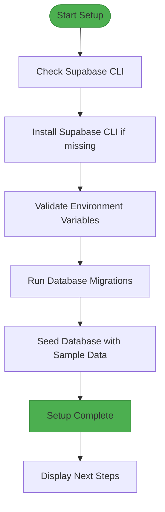
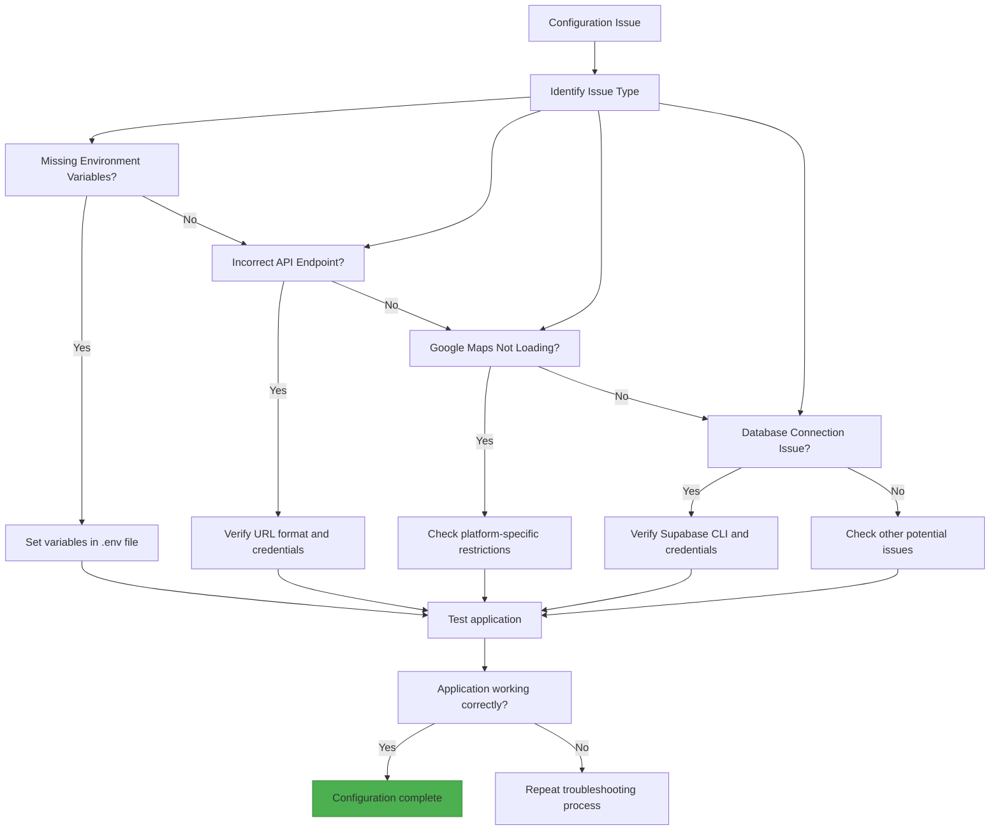

# Environment Configuration

<cite>
**Referenced Files in This Document**   
- [.env.example](file://.env.example)
- [config/environment.ts](file://config/environment.ts)
- [config/firebase.ts](file://config/firebase.ts)
- [config/supabase.ts](file://config/supabase.ts)
- [GOOGLE_MAPS_SETUP.md](file://GOOGLE_MAPS_SETUP.md)
- [scripts/setup-database.sh](file://scripts/setup-database.sh)
- [scripts/deploy-edge-functions.sh](file://scripts/deploy-edge-functions.sh)
- [supabase/functions/payment-process/index.ts](file://supabase/functions/payment-process/index.ts)
- [services/paymentService.ts](file://services/paymentService.ts)
- [app.config.js](file://app.config.js)
</cite>

## Table of Contents
1. [Introduction](#introduction)
2. [Environment Variables Configuration](#environment-variables-configuration)
3. [External Services Configuration](#external-services-configuration)
4. [Local Development Setup](#local-development-setup)
5. [Deployment Environment Configuration](#deployment-environment-configuration)
6. [Sensitive Credentials Management](#sensitive-credentials-management)
7. [Troubleshooting Common Configuration Issues](#troubleshooting-common-configuration-issues)

## Introduction
This document provides comprehensive guidance on environment configuration and setup for the Brillprime-expo application. It covers the purpose and usage of environment variables, configuration for external services, local development setup processes, deployment environment configuration, secure management of sensitive credentials, and troubleshooting for common configuration issues. The application follows a serverless architecture utilizing Firebase for authentication and Supabase for database, edge functions, storage, and real-time subscriptions.

## Environment Variables Configuration

The Brillprime-expo application uses environment variables to manage configuration across different environments (development, staging, production). The `.env.example` file serves as a template for the actual `.env` file, which should never be committed to version control. Environment variables are loaded through the `environment.ts` configuration file, which centralizes access to these values throughout the application.

The environment variables are prefixed with `EXPO_PUBLIC_` to make them accessible in the frontend code. The configuration system supports different environments through Node.js's `process.env.NODE_ENV` variable, which determines whether the application is running in development or production mode. The `environment.ts` file exports configuration objects that are consumed by various parts of the application, including API base URLs, timeout settings, and feature flags.

**Section sources**
- [.env.example](file://.env.example)
- [config/environment.ts](file://config/environment.ts)

## External Services Configuration

### Supabase Configuration
Supabase is a core component of the Brillprime-expo architecture, providing database services, edge functions, storage, and real-time subscriptions. The following environment variables are required for Supabase integration:

- **EXPO_PUBLIC_SUPABASE_URL**: The URL of your Supabase project (e.g., https://xxxxx.supabase.co). This can be found in the Supabase dashboard under Project Settings > API.
- **EXPO_PUBLIC_SUPABASE_ANON_KEY**: The anonymous/public API key for your Supabase project, which starts with "eyJ...". This key is used for unauthenticated access to the database.

The Supabase client is initialized in `config/supabase.ts` with validation checks to ensure both the URL and anon key are properly configured. The configuration includes error handling and logging to help diagnose configuration issues during development.

### Firebase Authentication
Firebase is used for user authentication and management in the Brillprime-expo application. The following environment variables are required:

- **EXPO_PUBLIC_FIREBASE_API_KEY**: The API key for your Firebase project.
- **EXPO_PUBLIC_FIREBASE_AUTH_DOMAIN**: The authentication domain for your Firebase project.
- **EXPO_PUBLIC_FIREBASE_PROJECT_ID**: Your Firebase project ID.
- **EXPO_PUBLIC_FIREBASE_STORAGE_BUCKET**: The storage bucket URL for your Firebase project.
- **EXPO_PUBLIC_FIREBASE_MESSAGING_SENDER_ID**: The messaging sender ID for Firebase Cloud Messaging.
- **EXPO_PUBLIC_FIREBASE_APP_ID**: The unique identifier for your Firebase application.
- **EXPO_PUBLIC_FIREBASE_MEASUREMENT_ID**: Optional Google Analytics measurement ID.
- **EXPO_PUBLIC_FIREBASE_DATABASE_URL**: Optional Firebase Realtime Database URL.

The Firebase configuration is implemented in `config/firebase.ts`, which includes validation to check for missing required fields and initializes Firebase services only when the configuration is complete.

### Google Maps API
Google Maps is used across all platforms (Web, iOS, Android) for map features in the application. The primary environment variable required is:

- **EXPO_PUBLIC_GOOGLE_MAPS_API_KEY**: The API key obtained from the Google Cloud Console.

The Google Maps API key must be restricted appropriately for each platform:
- For Android: Restrict by package name and SHA-1 certificate fingerprint
- For iOS: Restrict by bundle identifier
- For Web: Restrict by domain(s)

The API key is automatically configured in platform-specific files through `app.config.js`, which reads the environment variable and injects it into the appropriate configuration files for each platform.

### Paystack Integration
Paystack is integrated for payment processing in the Brillprime-expo application. While specific Paystack API keys are not visible in the client-side environment variables (for security reasons), the payment processing is handled through Supabase edge functions. The `payment-process` edge function in `supabase/functions/payment-process/index.ts` handles payment transactions, creating transaction records in the database and updating order payment status upon successful payment.

The payment service in `services/paymentService.ts` provides methods for initializing payments, managing payment methods, and retrieving payment history. The integration uses the Supabase client to communicate with the backend functions, ensuring secure handling of payment data.

**Section sources**
- [.env.example](file://.env.example)
- [config/supabase.ts](file://config/supabase.ts)
- [config/firebase.ts](file://config/firebase.ts)
- [GOOGLE_MAPS_SETUP.md](file://GOOGLE_MAPS_SETUP.md)
- [supabase/functions/payment-process/index.ts](file://supabase/functions/payment-process/index.ts)
- [services/paymentService.ts](file://services/paymentService.ts)
- [app.config.js](file://app.config.js)

## Local Development Setup

The Brillprime-expo application includes shell scripts to automate the local development setup process. These scripts configure the database, seed test data, and deploy edge functions to ensure a consistent development environment.

### Database Setup
The `scripts/setup-database.sh` script handles the database configuration process:

1. Checks for the presence of the Supabase CLI, installing it if necessary
2. Validates that the required Supabase environment variables are set
3. Runs database migrations using `supabase db push`
4. Seeds the database with sample data using `psql` and the seed SQL file

The script provides clear feedback on each step and exits with an error if required environment variables are missing. After successful setup, it displays a summary of the seeded data, including users, merchants, products, and orders.

### Edge Functions Deployment
The `scripts/deploy-edge-functions.sh` script deploys the Supabase edge functions required for the application:

1. Checks for the presence of the Supabase CLI, installing it if necessary
2. Deploys each edge function individually, including:
   - cart-get
   - cart-add
   - cart-update
   - payment-process
   - merchants-nearby
   - create-order

The script provides progress feedback for each function deployment and confirms successful deployment of all functions. After deployment, developers are advised to test API endpoints and monitor function logs.



**Diagram sources**
- [scripts/setup-database.sh](file://scripts/setup-database.sh)

**Section sources**
- [scripts/setup-database.sh](file://scripts/setup-database.sh)
- [scripts/deploy-edge-functions.sh](file://scripts/deploy-edge-functions.sh)

## Deployment Environment Configuration

The Brillprime-expo application is designed to work across multiple deployment environments (development, staging, production) with appropriate configuration for each. The environment-specific configuration is managed through environment variables that are set differently for each deployment environment.

For production deployment, all environment variables must be set with production values, including production API keys, database URLs, and service endpoints. The application architecture supports environment-specific configuration through the use of different `.env` files or environment variable settings in the deployment environment.

The serverless architecture eliminates the need for a separate backend server, with all API calls going through Supabase edge functions. This simplifies deployment as there is no Express server or separate backend to configure and maintain.

**Section sources**
- [.env.example](file://.env.example)
- [config/environment.ts](file://config/environment.ts)

## Sensitive Credentials Management

Security of sensitive credentials is a critical aspect of the Brillprime-expo application configuration. The following practices are implemented to ensure secure management of credentials:

1. **Environment Variables**: All sensitive credentials are stored in environment variables rather than hardcoded in the source code.
2. **.env File**: The actual `.env` file containing real credentials is excluded from version control via `.gitignore`.
3. **EXPO_PUBLIC_ Prefix**: Only variables prefixed with `EXPO_PUBLIC_` are exposed to the client-side code, ensuring that truly sensitive server-side credentials remain protected.
4. **API Key Restrictions**: External service API keys (Google Maps, Firebase) are restricted to specific platforms and domains to prevent unauthorized use.
5. **Secure Storage**: On mobile platforms, sensitive data is stored using secure storage mechanisms provided by the operating system.

For production environments, additional security measures should be implemented, such as using secret management services and rotating API keys periodically.

**Section sources**
- [.env.example](file://.env.example)
- [config/environment.ts](file://config/environment.ts)
- [app.config.js](file://app.config.js)

## Troubleshooting Common Configuration Issues

### Missing Environment Variables
If environment variables are missing, the application will display warning messages in the console. For Supabase configuration, the application will show:
```
⚠️ EXPO_PUBLIC_SUPABASE_URL not set, using fallback
```
For Firebase configuration, incomplete configuration will trigger:
```
⚠️ Firebase configuration incomplete. Some features may be disabled. Missing: [missing fields]
```

**Solution**: Ensure all required environment variables are set in the `.env` file, copied from `.env.example`.

### Incorrect API Endpoints
If the Supabase URL is incorrect or malformed, the application will display validation errors:
```
❌ Supabase Configuration Error:
  - URL: Invalid Supabase URL format (should contain .supabase.co)
```

**Solution**: Verify that the Supabase URL follows the format `https://your-project-ref.supabase.co` and contains the `.supabase.co` domain.

### Google Maps Not Loading
Common issues with Google Maps include:
- Map not loading on web: Verify `EXPO_PUBLIC_GOOGLE_MAPS_API_KEY` is set and JavaScript API is enabled
- Map not loading on Android: Ensure Maps SDK for Android is enabled and package name matches restrictions
- Map not loading on iOS: Ensure Maps SDK for iOS is enabled and bundle identifier matches restrictions

**Solution**: Follow the verification steps in `GOOGLE_MAPS_SETUP.md` and check the console for specific error messages.

### Database Connection Issues
If the database setup script fails, it will display:
```
❌ Error: Supabase environment variables not set!
Please set EXPO_PUBLIC_SUPABASE_URL and EXPO_PUBLIC_SUPABASE_ANON_KEY in Secrets
```

**Solution**: Ensure the Supabase environment variables are set in the shell environment before running the setup script.



**Diagram sources**
- [config/environment.ts](file://config/environment.ts)
- [config/supabase.ts](file://config/supabase.ts)
- [GOOGLE_MAPS_SETUP.md](file://GOOGLE_MAPS_SETUP.md)
- [scripts/setup-database.sh](file://scripts/setup-database.sh)

**Section sources**
- [config/environment.ts](file://config/environment.ts)
- [config/supabase.ts](file://config/supabase.ts)
- [GOOGLE_MAPS_SETUP.md](file://GOOGLE_MAPS_SETUP.md)
- [scripts/setup-database.sh](file://scripts/setup-database.sh)