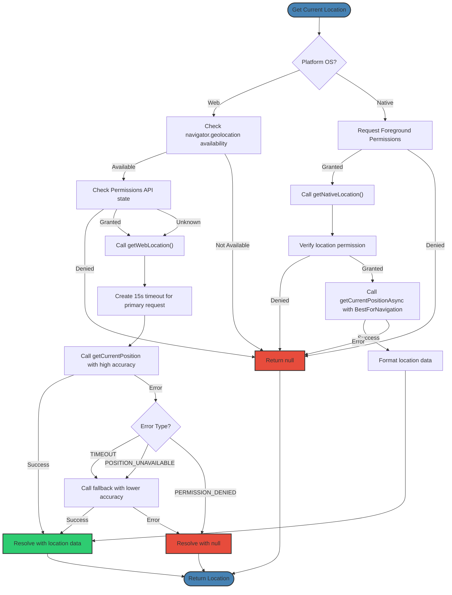
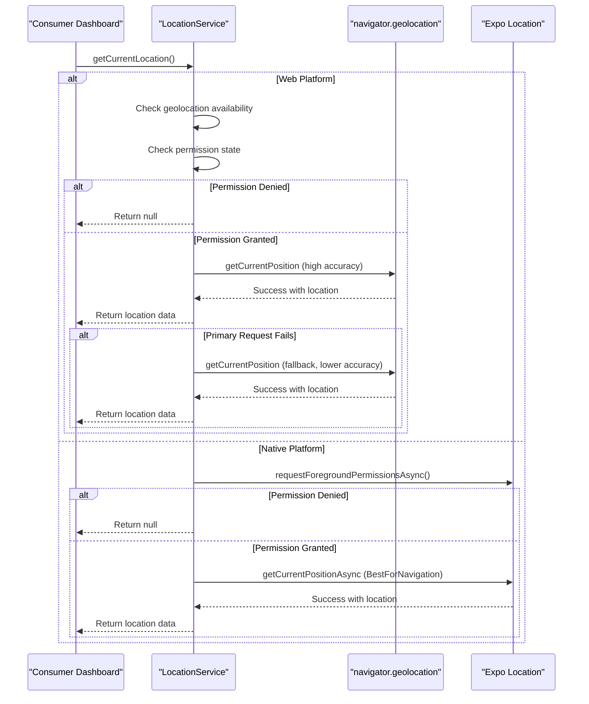
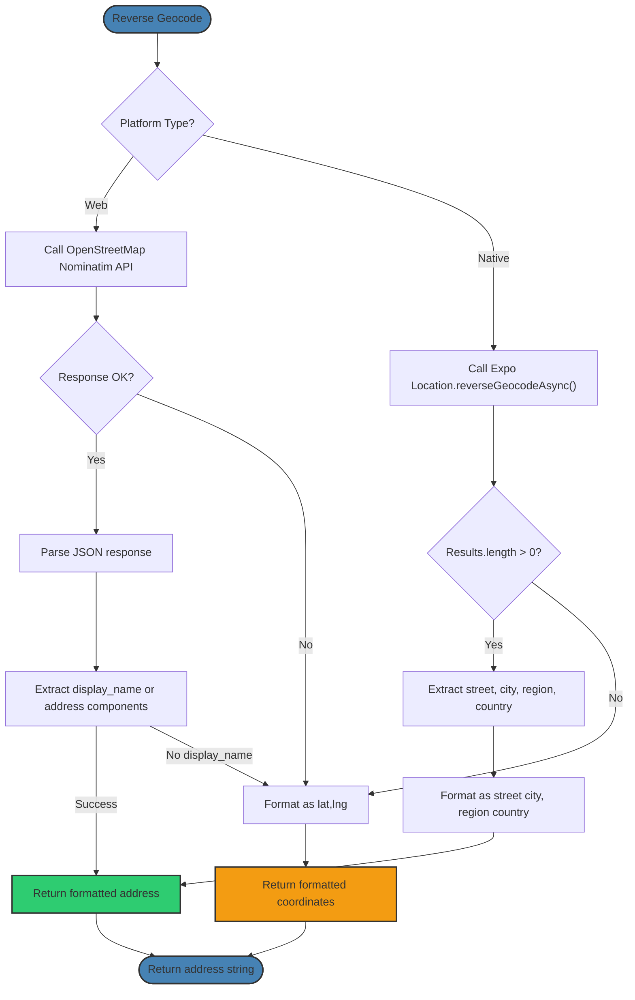
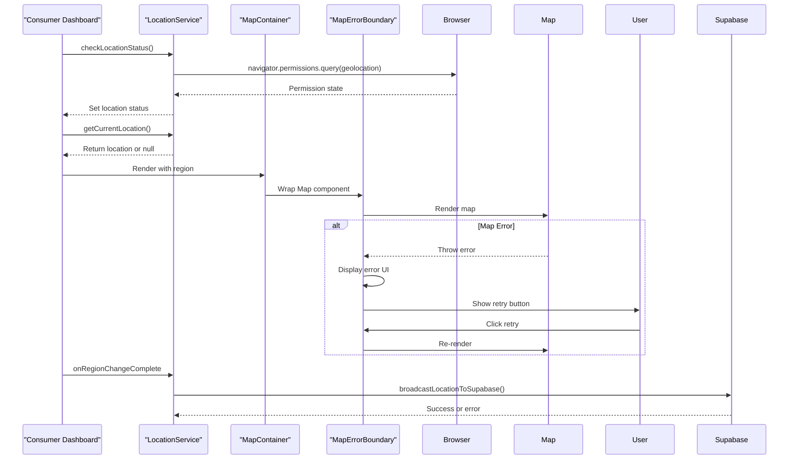
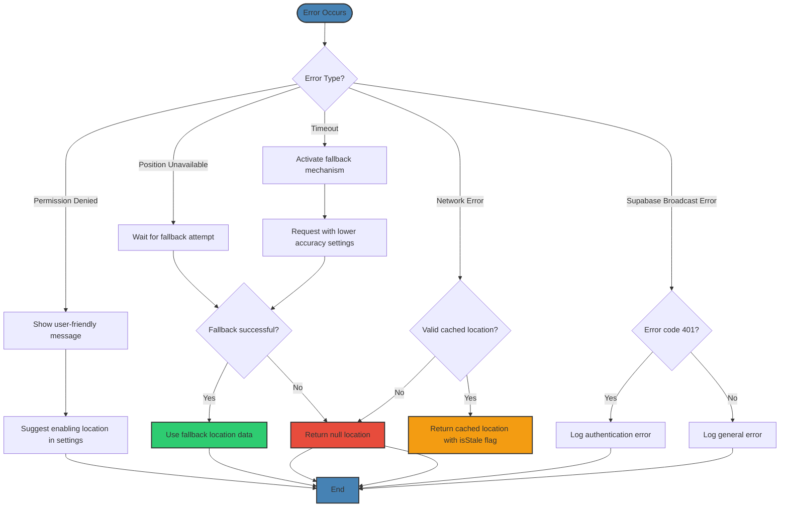

# Geolocation Services

<cite>
**Referenced Files in This Document**   
- [locationService.ts](file://services/locationService.ts)
- [consumer.tsx](file://app/dashboard/consumer.tsx)
- [MapErrorBoundary.tsx](file://app/_components/MapErrorBoundary.tsx)
- [MapContainer.tsx](file://app/_components/MapContainer.tsx)
- [Map.tsx](file://components/Map.tsx)
- [Map.web.tsx](file://components/Map.web.tsx)
- [types.ts](file://services/types.ts)
- [environment.ts](file://config/environment.ts)
</cite>

## Table of Contents
1. [Introduction](#introduction)
2. [Location Service Architecture](#location-service-architecture)
3. [Platform-Specific Geolocation Implementation](#platform-specific-geolocation-implementation)
4. [getCurrentLocation Method Analysis](#getcurrentlocation-method-analysis)
5. [Reverse Geocoding with OpenStreetMap](#reverse-geocoding-with-openstreetmap)
6. [Integration with Consumer Dashboard](#integration-with-consumer-dashboard)
7. [Error Handling and Recovery](#error-handling-and-recovery)
8. [Best Practices and Optimization](#best-practices-and-optimization)

## Introduction
The geolocation services in Brillprime-expo provide a comprehensive solution for location-based functionality across web, iOS, and Android platforms. The implementation centers around the `locationService.ts` module, which handles platform-specific geolocation through `navigator.geolocation` for web and Expo Location for native platforms. This document details the architecture, implementation, and integration of these services, focusing on automatic location detection, permission handling, error recovery, and reverse geocoding capabilities.

The system is designed to provide high-accuracy location data while implementing robust fallback mechanisms and error handling strategies. It integrates seamlessly with the consumer dashboard and other components through well-defined interfaces and error boundaries, ensuring a reliable user experience across different device types and network conditions.

## Location Service Architecture

```mermaid
classDiagram
class LocationService {
+requestLocationPermission() Promise~boolean~
+getCurrentLocation() Promise~Location | null~
+reverseGeocode(latitude, longitude) Promise~string | null~
+getNearbyMerchants(latitude, longitude, radius, type) Promise~ApiResponse~Merchant[]~~
+calculateDistance(lat1, lon1, lat2, lon2) number
+startLiveTracking(updateInterval) Promise~void~
+stopLiveTracking() void
+getLiveLocation(userId) Promise~ApiResponse~LocationData~~
-getWebLocation() Promise~Location | null~
-getNativeLocation() Promise~Location | null~
-detectMovement(newLocation) {isMoving, heading, speed}
-broadcastLocationToSupabase(location) Promise~void~
}
class Location {
+latitude : number
+longitude : number
+accuracy? : number | null
+timestamp : number
+isStale? : boolean
}
class LocationData {
+latitude : number
+longitude : number
+address? : string
+timestamp : number
+accuracy? : number
+heading? : number
+speed? : number
+isMoving? : boolean
}
class MapErrorBoundary {
+hasError : boolean
+error? : Error
+getDerivedStateFromError(error) State
+componentDidCatch(error, errorInfo) void
+handleRetry() void
}
LocationService --> Location : "uses"
LocationService --> LocationData : "manages"
MapErrorBoundary --> LocationService : "protects"
```

**Diagram sources**
- [locationService.ts](file://services/locationService.ts#L31-L773)
- [types.ts](file://services/types.ts#L155-L159)
- [MapErrorBoundary.tsx](file://app/_components/MapErrorBoundary.tsx#L1-L109)

**Section sources**
- [locationService.ts](file://services/locationService.ts#L1-L773)
- [types.ts](file://services/types.ts#L1-L228)

## Platform-Specific Geolocation Implementation



**Diagram sources**
- [locationService.ts](file://services/locationService.ts#L69-L209)
- [Map.web.tsx](file://components/Map.web.tsx#L1-L330)

**Section sources**
- [locationService.ts](file://services/locationService.ts#L69-L209)
- [Map.web.tsx](file://components/Map.web.tsx#L1-L330)
- [Map.tsx](file://components/Map.tsx#L1-L294)

## getCurrentLocation Method Analysis



**Diagram sources**
- [locationService.ts](file://services/locationService.ts#L69-L209)
- [consumer.tsx](file://app/dashboard/consumer.tsx#L175-L222)

**Section sources**
- [locationService.ts](file://services/locationService.ts#L69-L209)
- [consumer.tsx](file://app/dashboard/consumer.tsx#L175-L222)

## Reverse Geocoding with OpenStreetMap



**Diagram sources**
- [locationService.ts](file://services/locationService.ts#L213-L246)
- [environment.ts](file://config/environment.ts#L1-L52)

**Section sources**
- [locationService.ts](file://services/locationService.ts#L213-L246)

## Integration with Consumer Dashboard



**Diagram sources**
- [consumer.tsx](file://app/dashboard/consumer.tsx#L174-L222)
- [MapContainer.tsx](file://app/_components/MapContainer.tsx#L1-L286)
- [MapErrorBoundary.tsx](file://app/_components/MapErrorBoundary.tsx#L1-L109)

**Section sources**
- [consumer.tsx](file://app/dashboard/consumer.tsx#L174-L222)
- [MapContainer.tsx](file://app/_components/MapContainer.tsx#L1-L286)
- [MapErrorBoundary.tsx](file://app/_components/MapErrorBoundary.tsx#L1-L109)

## Error Handling and Recovery



**Diagram sources**
- [locationService.ts](file://services/locationService.ts#L153-L168)
- [MapErrorBoundary.tsx](file://app/_components/MapErrorBoundary.tsx#L1-L109)
- [consumer.tsx](file://app/dashboard/consumer.tsx#L964-L1004)

**Section sources**
- [locationService.ts](file://services/locationService.ts#L153-L168)
- [MapErrorBoundary.tsx](file://app/_components/MapErrorBoundary.tsx#L1-L109)
- [consumer.tsx](file://app/dashboard/consumer.tsx#L964-L1004)

## Best Practices and Optimization

```mermaid
flowchart TD
Start([Location Best Practices]) --> BatteryConservation["Battery Conservation"]
Start --> AccuracyOptimization["Accuracy Optimization"]
Start --> PerformanceOptimization["Performance Optimization"]
Start --> ErrorResilience["Error Resilience"]
BatteryConservation --> UseHighAccuracy["Use high accuracy only when necessary"]
BatteryConservation --> ImplementCaching["Implement location caching (5 min)"]
BatteryConservation --> StopTracking["Stop live tracking when not needed"]
BatteryConservation --> UseEfficientIntervals["Use appropriate update intervals"]
AccuracyOptimization --> PlatformSpecific["Use platform-specific best accuracy settings"]
AccuracyOptimization --> WebFallback["Implement web fallback with timeout"]
AccuracyOptimization --> NativeBest["Use BestForNavigation on native platforms"]
AccuracyOptimization --> ValidateData["Validate location accuracy before use"]
PerformanceOptimization --> BatchUpdates["Batch location updates when possible"]
PerformanceOptimization --> QueueProcessing["Process location queue with timeout"]
PerformanceOptimization --> LimitHistory["Limit movement history size"]
PerformanceOptimization --> DebounceCalls["Debounce frequent location requests"]
ErrorResilience --> MultipleAttempts["Implement multiple retry attempts"]
ErrorResilience --> FallbackMechanisms["Use fallback location mechanisms"]
ErrorResilience --> GracefulDegradation["Gracefully degrade functionality"]
ErrorResilience --> InformUser["Inform user of location issues"]
style Start fill:#4682B4,stroke:#333,stroke-width:2px
style BatteryConservation fill:#3498DB,stroke:#333,stroke-width:2px
style AccuracyOptimization fill:#2ECC71,stroke:#333,stroke-width:2px
style PerformanceOptimization fill:#F39C12,stroke:#333,stroke-width:2px
style ErrorResilience fill:#E74C3C,stroke:#333,stroke-width:2px
```



**Diagram sources**
- [locationService.ts](file://services/locationService.ts#L35-L36)
- [locationService.ts](file://services/locationService.ts#L504-L532)
- [locationService.ts](file://services/locationService.ts#L355-L360)
- [consumer.tsx](file://app/dashboard/consumer.tsx#L964-L971)

**Section sources**
- [locationService.ts](file://services/locationService.ts#L35-L36)
- [locationService.ts](file://services/locationService.ts#L504-L532)
- [locationService.ts](file://services/locationService.ts#L355-L360)
- [consumer.tsx](file://app/dashboard/consumer.tsx#L964-L971)