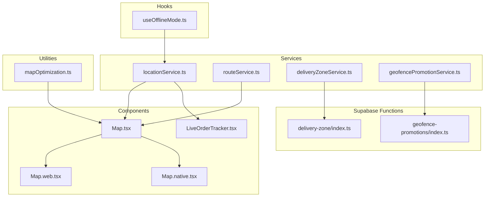
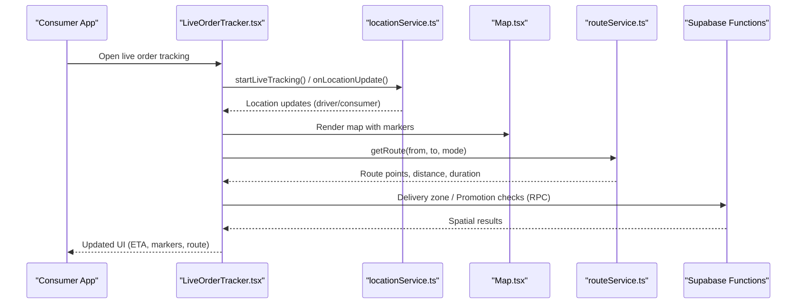
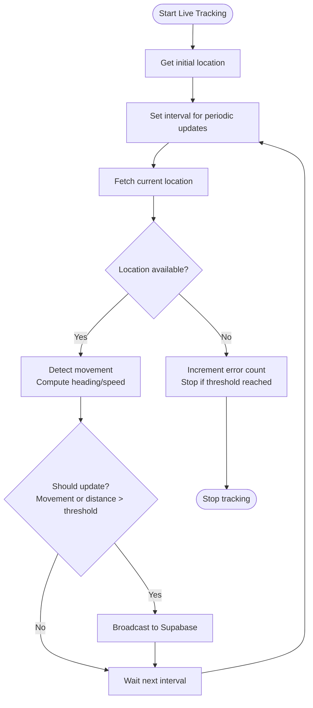
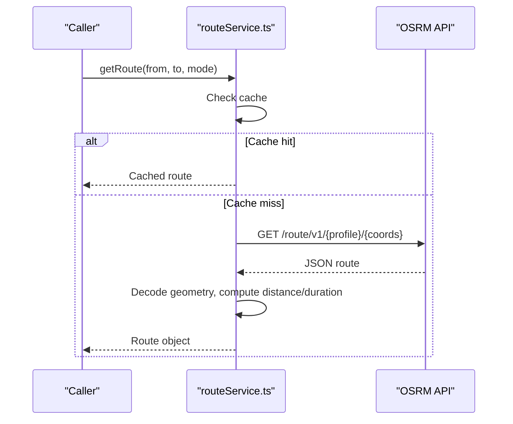
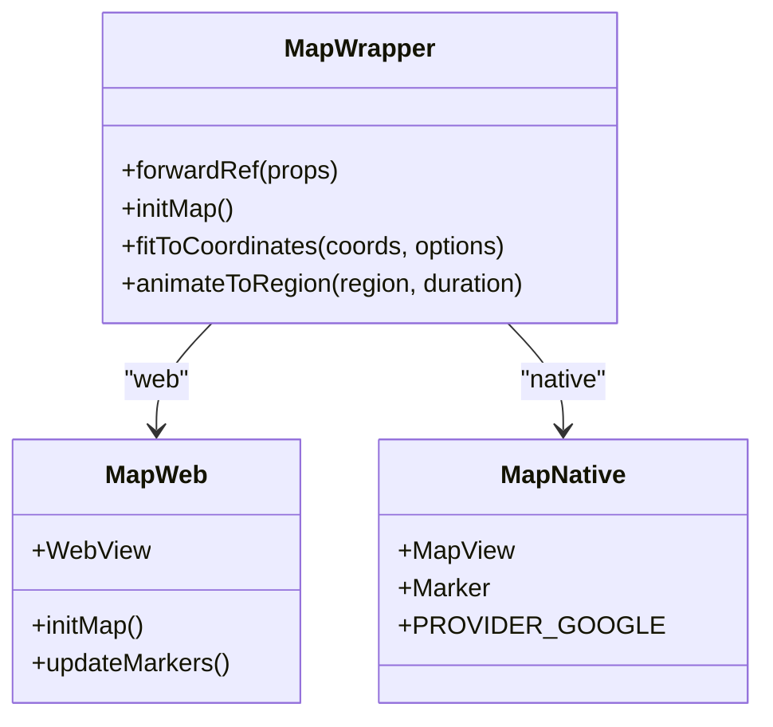
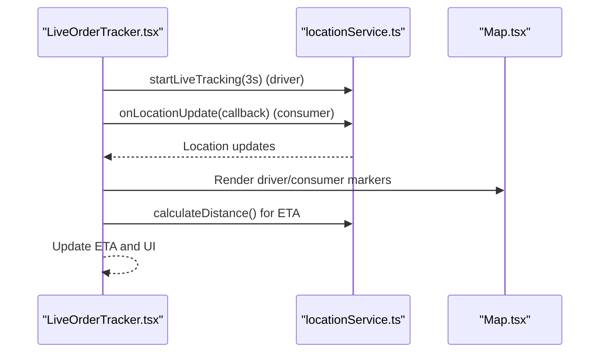
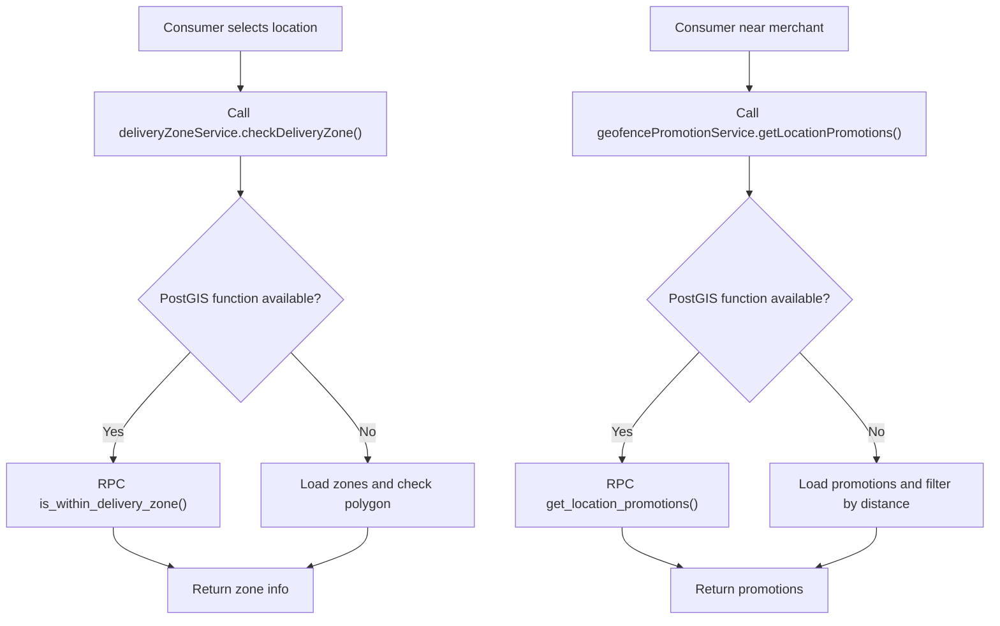
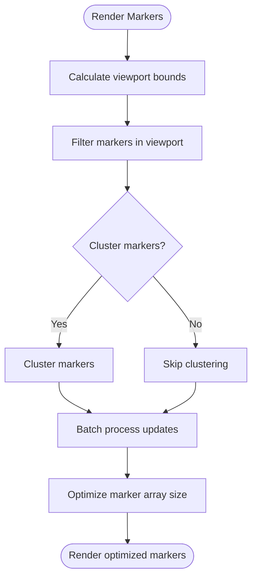
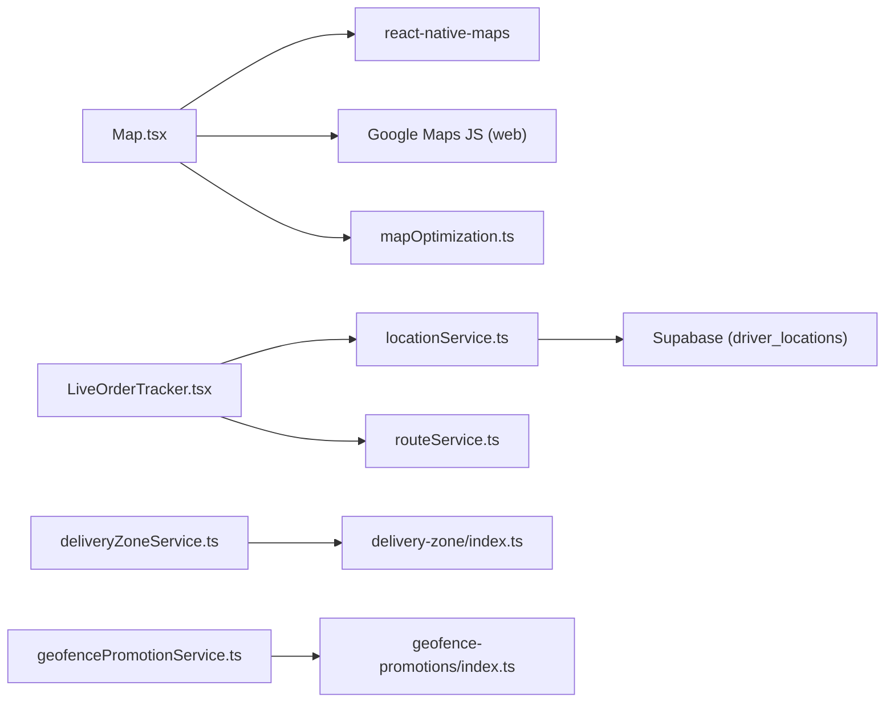

# Location and Mapping

<cite>
**Referenced Files in This Document**
- [locationService.ts](file://services/locationService.ts)
- [routeService.ts](file://services/routeService.ts)
- [Map.tsx](file://components/Map.tsx)
- [Map.web.tsx](file://components/Map.web.tsx)
- [Map.native.tsx](file://components/Map.native.tsx)
- [mapOptimization.ts](file://utils/mapOptimization.ts)
- [LiveOrderTracker.tsx](file://components/LiveOrderTracker.tsx)
- [deliveryZoneService.ts](file://services/deliveryZoneService.ts)
- [geofencePromotionService.ts](file://services/geofencePromotionService.ts)
- [GOOGLE_MAPS_SETUP.md](file://GOOGLE_MAPS_SETUP.md)
- [useOfflineMode.ts](file://hooks/useOfflineMode.ts)
- [order-tracking.tsx](file://app/orders/order-tracking.tsx)
- [index.ts](file://supabase/functions/delivery-zone/index.ts)
- [index.ts](file://supabase/functions/geofence-promotions/index.ts)
</cite>

## Table of Contents
1. [Introduction](#introduction)
2. [Project Structure](#project-structure)
3. [Core Components](#core-components)
4. [Architecture Overview](#architecture-overview)
5. [Detailed Component Analysis](#detailed-component-analysis)
6. [Dependency Analysis](#dependency-analysis)
7. [Performance Considerations](#performance-considerations)
8. [Troubleshooting Guide](#troubleshooting-guide)
9. [Conclusion](#conclusion)

## Introduction
This document explains the geolocation and mapping system in Brillprime-expo, focusing on:
- Real-time driver and consumer location tracking
- Cross-platform map implementation (web and native)
- Route calculation using OSRM
- Delivery zone validation and geofencing promotions
- Optimization techniques for rendering and memory usage
- Offline handling and accuracy considerations

## Project Structure
The location and mapping system spans services, components, utilities, and Supabase functions:
- Services: location tracking, routing, delivery zones, geofencing promotions
- Components: cross-platform Map wrapper and live order tracker
- Utilities: map optimization helpers
- Supabase functions: spatial checks for zones and promotions
- Hooks: offline mode handling

**Diagram sources**
- [locationService.ts](file://services/locationService.ts#L1-L773)
- [routeService.ts](file://services/routeService.ts#L1-L171)
- [Map.tsx](file://components/Map.tsx#L1-L294)
- [Map.web.tsx](file://components/Map.web.tsx#L1-L330)
- [Map.native.tsx](file://components/Map.native.tsx#L1-L5)
- [mapOptimization.ts](file://utils/mapOptimization.ts#L1-L203)
- [LiveOrderTracker.tsx](file://components/LiveOrderTracker.tsx#L1-L385)
- [deliveryZoneService.ts](file://services/deliveryZoneService.ts#L1-L186)
- [geofencePromotionService.ts](file://services/geofencePromotionService.ts#L1-L89)
- [index.ts](file://supabase/functions/delivery-zone/index.ts#L1-L112)
- [index.ts](file://supabase/functions/geofence-promotions/index.ts#L1-L105)
- [useOfflineMode.ts](file://hooks/useOfflineMode.ts#L1-L65)

**Section sources**
- [locationService.ts](file://services/locationService.ts#L1-L773)
- [routeService.ts](file://services/routeService.ts#L1-L171)
- [Map.tsx](file://components/Map.tsx#L1-L294)
- [Map.web.tsx](file://components/Map.web.tsx#L1-L330)
- [Map.native.tsx](file://components/Map.native.tsx#L1-L5)
- [mapOptimization.ts](file://utils/mapOptimization.ts#L1-L203)
- [LiveOrderTracker.tsx](file://components/LiveOrderTracker.tsx#L1-L385)
- [deliveryZoneService.ts](file://services/deliveryZoneService.ts#L1-L186)
- [geofencePromotionService.ts](file://services/geofencePromotionService.ts#L1-L89)
- [index.ts](file://supabase/functions/delivery-zone/index.ts#L1-L112)
- [index.ts](file://supabase/functions/geofence-promotions/index.ts#L1-L105)
- [useOfflineMode.ts](file://hooks/useOfflineMode.ts#L1-L65)

## Core Components
- LocationService: permission handling, current position retrieval, reverse geocoding, live tracking, movement detection, caching, and route optimization helpers.
- RouteService: OSRM-based route fetching, decoding, and distance calculations.
- Map components: unified cross-platform wrapper with web and native variants.
- LiveOrderTracker: live order tracking UI integrating driver/consumer positions.
- DeliveryZoneService and geofencePromotionService: backend-driven spatial checks.
- mapOptimization utilities: throttling, clustering, viewport filtering, batching, and marker optimization.
- useOfflineMode hook: network-aware offline queueing.

**Section sources**
- [locationService.ts](file://services/locationService.ts#L1-L773)
- [routeService.ts](file://services/routeService.ts#L1-L171)
- [Map.tsx](file://components/Map.tsx#L1-L294)
- [Map.web.tsx](file://components/Map.web.tsx#L1-L330)
- [Map.native.tsx](file://components/Map.native.tsx#L1-L5)
- [LiveOrderTracker.tsx](file://components/LiveOrderTracker.tsx#L1-L385)
- [deliveryZoneService.ts](file://services/deliveryZoneService.ts#L1-L186)
- [geofencePromotionService.ts](file://services/geofencePromotionService.ts#L1-L89)
- [mapOptimization.ts](file://utils/mapOptimization.ts#L1-L203)
- [useOfflineMode.ts](file://hooks/useOfflineMode.ts#L1-L65)

## Architecture Overview
The system integrates location services with a cross-platform map renderer and backend spatial functions:
- Web: Google Maps JavaScript API via a WebView-based component or direct script injection.
- Native: Google Maps via react-native-maps.
- Backend: Supabase RPC functions for delivery zone and geofence promotion checks.
- Routing: OSRM for turn-by-turn and distance/duration.

**Diagram sources**
- [LiveOrderTracker.tsx](file://components/LiveOrderTracker.tsx#L1-L385)
- [locationService.ts](file://services/locationService.ts#L1-L773)
- [Map.tsx](file://components/Map.tsx#L1-L294)
- [routeService.ts](file://services/routeService.ts#L1-L171)
- [index.ts](file://supabase/functions/delivery-zone/index.ts#L1-L112)
- [index.ts](file://supabase/functions/geofence-promotions/index.ts#L1-L105)

## Detailed Component Analysis

### LocationService: Real-time Location Tracking and Movement Detection
Responsibilities:
- Permission handling for web and native platforms
- Current position retrieval with fallbacks and caching
- Reverse geocoding for address display
- Live tracking with movement detection, heading/speed computation, and throttled updates
- Broadcasting driver location to Supabase
- Nearby merchant queries and distance/bearing calculations
- Route optimization helpers (nearest-neighbor prioritization)

Key behaviors:
- Web: Uses browser Geolocation API with high-accuracy first, then low-accuracy fallback; caches results for short durations.
- Native: Uses Expo Location with BestForNavigation accuracy; requests foreground permissions.
- Movement detection: compares recent positions to infer motion, compute heading, and smooth direction changes.
- Live tracking: periodic polling with thresholds to avoid redundant updates; maintains movement history for smoothing.
- Supabase broadcast: upserts driver location with metadata (accuracy, speed, heading, moving flag).
- Caching: live location cache with short TTL; stale data fallback on errors.

**Diagram sources**
- [locationService.ts](file://services/locationService.ts#L368-L510)
- [locationService.ts](file://services/locationService.ts#L571-L623)

**Section sources**
- [locationService.ts](file://services/locationService.ts#L1-L773)

### RouteService: OSRM-Based Routing
Responsibilities:
- Fetch routes from OSRM with car/bike/foot profiles
- Cache routes keyed by origin/destination/mode
- Decode polyline geometry and compute distances
- Provide route instructions extraction

Implementation highlights:
- URL construction with overview/full geometry and steps
- Response parsing to extract points, distance, duration, and instructions
- Degraded fallbacks and error handling

**Diagram sources**
- [routeService.ts](file://services/routeService.ts#L1-L171)

**Section sources**
- [routeService.ts](file://services/routeService.ts#L1-L171)

### Cross-Platform Map Component
Unified wrapper with platform-specific implementations:
- Map.tsx: Provides a single interface for both web and native; loads Google Maps JS on web and renders react-native-maps on native.
- Map.web.tsx: WebView-based Google Maps with region change events and marker updates.
- Map.native.tsx: Exports react-native-maps with Google provider.

Features:
- API key validation and error messaging
- Event bridging (region change, idle) to React props
- Fit-to-coordinates and animation helpers
- Custom map styles and map type selection

**Diagram sources**
- [Map.tsx](file://components/Map.tsx#L1-L294)
- [Map.web.tsx](file://components/Map.web.tsx#L1-L330)
- [Map.native.tsx](file://components/Map.native.tsx#L1-L5)

**Section sources**
- [Map.tsx](file://components/Map.tsx#L1-L294)
- [Map.web.tsx](file://components/Map.web.tsx#L1-L330)
- [Map.native.tsx](file://components/Map.native.tsx#L1-L5)

### Live Order Tracking
Integrates live tracking with a map UI:
- Starts live tracking for drivers or subscribes to driver location updates for consumers
- Calculates ETA using distance and average speed
- Renders driver and consumer markers on the map
- Supports communication actions

**Diagram sources**
- [LiveOrderTracker.tsx](file://components/LiveOrderTracker.tsx#L1-L385)
- [locationService.ts](file://services/locationService.ts#L1-L773)
- [Map.tsx](file://components/Map.tsx#L1-L294)

**Section sources**
- [LiveOrderTracker.tsx](file://components/LiveOrderTracker.tsx#L1-L385)

### Delivery Zone Validation and Geofencing Promotions
Backend-driven spatial checks:
- DeliveryZoneService: RPC wrapper around PostGIS function to check if a point is within a merchant’s delivery zone; supports CRUD operations for zones.
- GeofencePromotionService: RPC wrapper to fetch active promotions near a location and compute discounts.

Supabase functions:
- delivery-zone/index.ts: Attempts PostGIS function; falls back to client-side polygon containment check.
- geofence-promotions/index.ts: Attempts PostGIS function; falls back to client-side distance check within radius.

**Diagram sources**
- [deliveryZoneService.ts](file://services/deliveryZoneService.ts#L1-L186)
- [geofencePromotionService.ts](file://services/geofencePromotionService.ts#L1-L89)
- [index.ts](file://supabase/functions/delivery-zone/index.ts#L1-L112)
- [index.ts](file://supabase/functions/geofence-promotions/index.ts#L1-L105)

**Section sources**
- [deliveryZoneService.ts](file://services/deliveryZoneService.ts#L1-L186)
- [geofencePromotionService.ts](file://services/geofencePromotionService.ts#L1-L89)
- [index.ts](file://supabase/functions/delivery-zone/index.ts#L1-L112)
- [index.ts](file://supabase/functions/geofence-promotions/index.ts#L1-L105)

### Map Optimization Utilities
Performance enhancements:
- Debounce region changes to reduce frequent API calls
- Throttle location updates to limit render frequency
- Marker clustering for large datasets
- Viewport bounds calculation and in-viewport filtering
- Batch processing for large lists
- Marker array optimization by keeping most recent/high-priority items
- Distance-based filtering

**Diagram sources**
- [mapOptimization.ts](file://utils/mapOptimization.ts#L1-L203)

**Section sources**
- [mapOptimization.ts](file://utils/mapOptimization.ts#L1-L203)

### Offline Scenarios and Accuracy Considerations
- Offline handling: useOfflineMode hook monitors connectivity and queues actions; persists queue to AsyncStorage for later processing.
- Accuracy: native uses BestForNavigation; web uses high-accuracy first, then falls back; movement smoothing reduces jitter; cache TTL balances freshness vs. bandwidth.

**Section sources**
- [useOfflineMode.ts](file://hooks/useOfflineMode.ts#L1-L65)
- [locationService.ts](file://services/locationService.ts#L1-L773)

## Dependency Analysis
- Map.tsx depends on react-native-maps and Google Maps API keys; web variant dynamically loads the Google Maps script.
- LiveOrderTracker depends on locationService for live updates and routeService for ETA calculations.
- Supabase functions depend on PostGIS for spatial operations; fallbacks ensure functionality without PostGIS.
- mapOptimization utilities are standalone helpers used by map components and screens.

**Diagram sources**
- [Map.tsx](file://components/Map.tsx#L1-L294)
- [LiveOrderTracker.tsx](file://components/LiveOrderTracker.tsx#L1-L385)
- [locationService.ts](file://services/locationService.ts#L1-L773)
- [routeService.ts](file://services/routeService.ts#L1-L171)
- [deliveryZoneService.ts](file://services/deliveryZoneService.ts#L1-L186)
- [geofencePromotionService.ts](file://services/geofencePromotionService.ts#L1-L89)
- [index.ts](file://supabase/functions/delivery-zone/index.ts#L1-L112)
- [index.ts](file://supabase/functions/geofence-promotions/index.ts#L1-L105)
- [mapOptimization.ts](file://utils/mapOptimization.ts#L1-L203)

**Section sources**
- [Map.tsx](file://components/Map.tsx#L1-L294)
- [LiveOrderTracker.tsx](file://components/LiveOrderTracker.tsx#L1-L385)
- [locationService.ts](file://services/locationService.ts#L1-L773)
- [routeService.ts](file://services/routeService.ts#L1-L171)
- [deliveryZoneService.ts](file://services/deliveryZoneService.ts#L1-L186)
- [geofencePromotionService.ts](file://services/geofencePromotionService.ts#L1-L89)
- [index.ts](file://supabase/functions/delivery-zone/index.ts#L1-L112)
- [index.ts](file://supabase/functions/geofence-promotions/index.ts#L1-L105)
- [mapOptimization.ts](file://utils/mapOptimization.ts#L1-L203)

## Performance Considerations
- Reduce location update frequency using throttling/debouncing
- Use viewport filtering and clustering to minimize DOM/markers
- Cache routes and live locations with short TTLs
- Batch large updates to avoid blocking the UI thread
- Prefer native BestForNavigation accuracy for navigation-grade precision
- Gracefully degrade on web with fallbacks and reduced features

[No sources needed since this section provides general guidance]

## Troubleshooting Guide
Common issues and resolutions:
- Missing Google Maps API key: Ensure EXPO_PUBLIC_GOOGLE_MAPS_API_KEY is set and restricted in Google Cloud Console; verify platform-specific configuration.
- Map not loading on web: Confirm script load success and check browser console for API errors; verify JavaScript API enabled.
- Map not loading on native: Verify API key presence and correct platform restrictions.
- Live tracking errors: Inspect permission denials and error counts; adjust update intervals; confirm Supabase credentials if broadcasting.
- Delivery zone/promotion checks failing: Confirm PostGIS functions exist or rely on client-side fallbacks; validate polygon coordinates and radii.

**Section sources**
- [GOOGLE_MAPS_SETUP.md](file://GOOGLE_MAPS_SETUP.md#L1-L94)
- [Map.tsx](file://components/Map.tsx#L1-L294)
- [locationService.ts](file://services/locationService.ts#L1-L773)
- [index.ts](file://supabase/functions/delivery-zone/index.ts#L1-L112)
- [index.ts](file://supabase/functions/geofence-promotions/index.ts#L1-L105)

## Conclusion
The Brillprime-expo location and mapping system provides a robust, cross-platform solution for real-time tracking, routing, and spatial validation. It leverages Google Maps for consistent UX across platforms, OSRM for route planning, and Supabase for backend spatial operations. Performance is enhanced through throttling, clustering, and caching, while offline handling ensures resilience. Delivery zone validation and geofencing promotions add contextual commerce features powered by spatial logic.