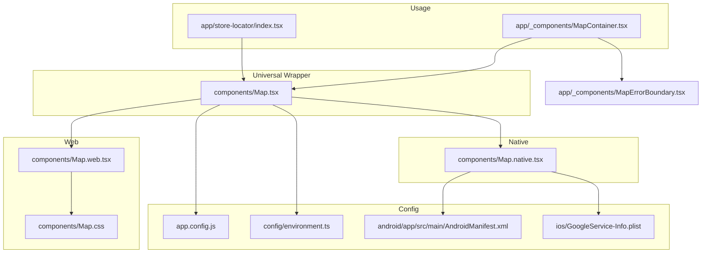
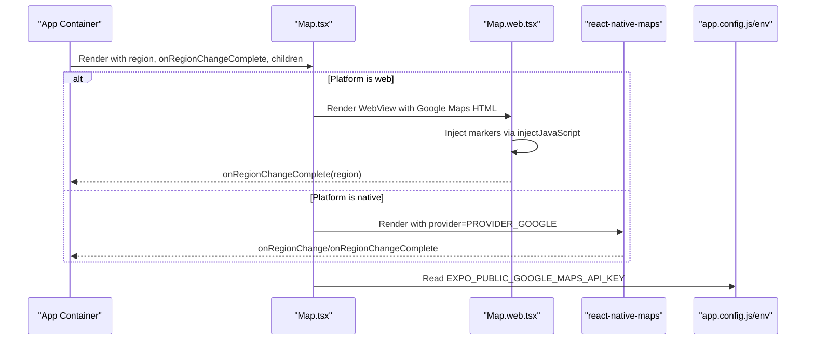
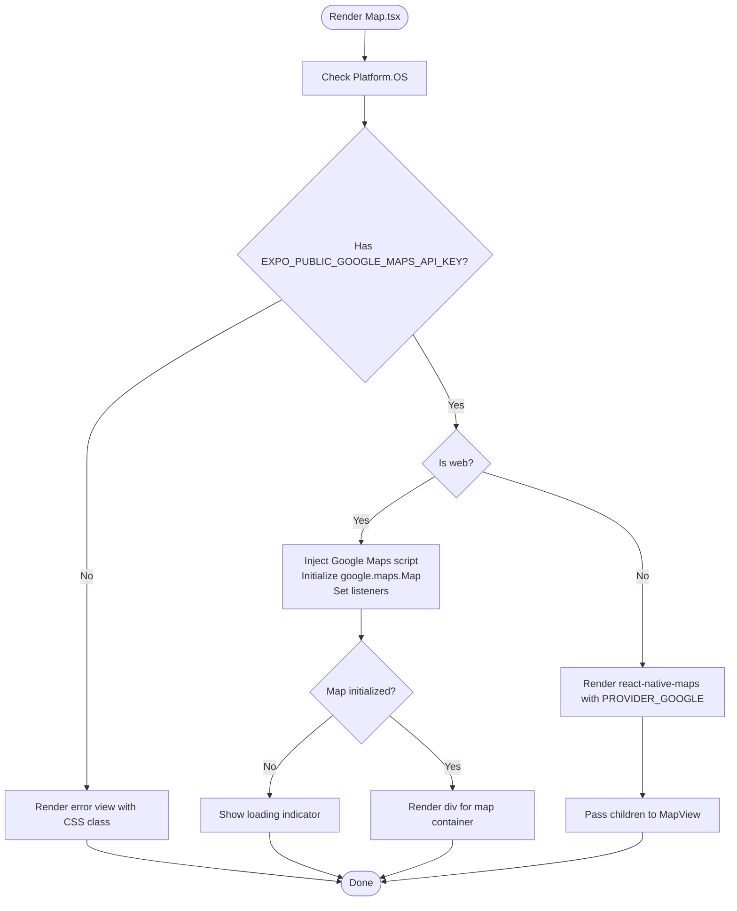
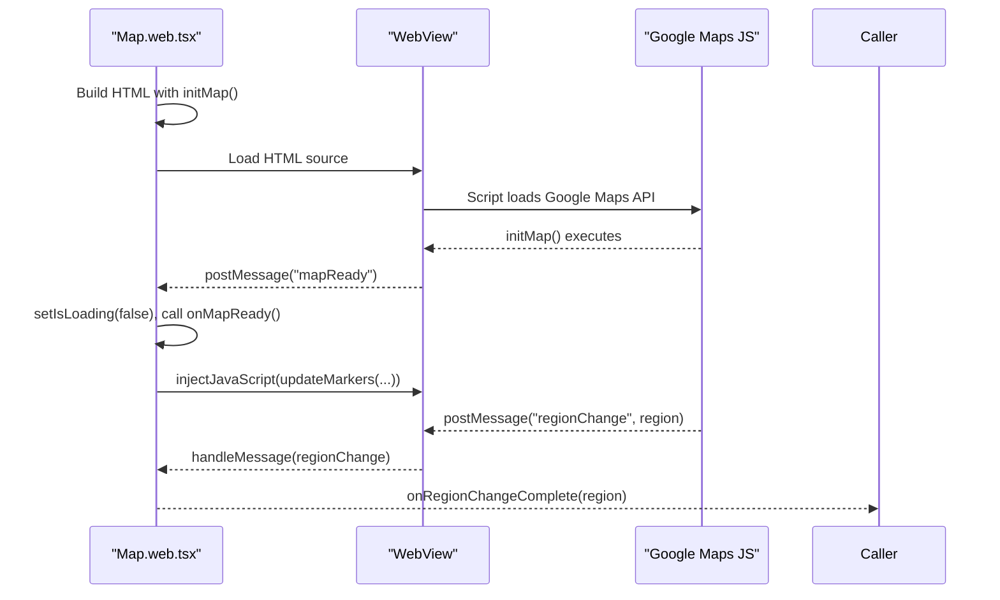
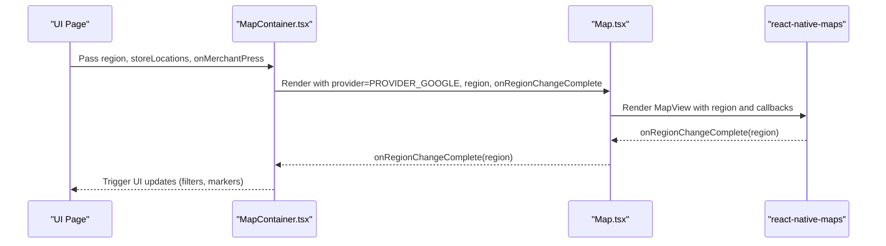
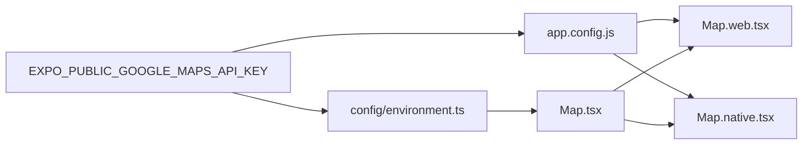

# Map Implementation

<cite>
**Referenced Files in This Document**
- [Map.tsx](file://components/Map.tsx)
- [Map.web.tsx](file://components/Map.web.tsx)
- [Map.native.tsx](file://components/Map.native.tsx)
- [MapContainer.tsx](file://app/_components/MapContainer.tsx)
- [MapErrorBoundary.tsx](file://app/_components/MapErrorBoundary.tsx)
- [Map.css](file://components/Map.css)
- [MAP_MIGRATION_SUMMARY.md](file://MAP_MIGRATION_SUMMARY.md)
- [GOOGLE_MAPS_SETUP.md](file://GOOGLE_MAPS_SETUP.md)
- [app.config.js](file://app.config.js)
- [environment.ts](file://config/environment.ts)
- [AndroidManifest.xml](file://android/app/src/main/AndroidManifest.xml)
- [GoogleService-Info.plist](file://ios/GoogleService-Info.plist)
- [store-locator/index.tsx](file://app/store-locator/index.tsx)
</cite>

## Table of Contents
1. [Introduction](#introduction)
2. [Project Structure](#project-structure)
3. [Core Components](#core-components)
4. [Architecture Overview](#architecture-overview)
5. [Detailed Component Analysis](#detailed-component-analysis)
6. [Dependency Analysis](#dependency-analysis)
7. [Performance Considerations](#performance-considerations)
8. [Troubleshooting Guide](#troubleshooting-guide)
9. [Conclusion](#conclusion)
10. [Appendices](#appendices)

## Introduction
This document explains the cross-platform map implementation in Brillprime-expo. The system uses a universal wrapper component that conditionally renders platform-specific implementations:
- Web: Google Maps JavaScript API via WebView with robust API key management and loading/error states.
- Native (iOS/Android): react-native-maps with Google Maps provider.

The migration from Leaflet to Google Maps was completed for all platforms, as documented in MAP_MIGRATION_SUMMARY.md. Configuration requirements are centralized in app.config.js and environment.ts. Error handling is enforced through CSS styling and component boundaries.

## Project Structure
The map system is organized around a small set of files:
- Universal wrapper: components/Map.tsx
- Web-specific implementation: components/Map.web.tsx
- Native export: components/Map.native.tsx
- Example usage: app/_components/MapContainer.tsx and app/store-locator/index.tsx
- Error boundary: app/_components/MapErrorBoundary.tsx
- Styles: components/Map.css
- Configuration: app.config.js, config/environment.ts
- Platform metadata: android/app/src/main/AndroidManifest.xml, ios/GoogleService-Info.plist
- Migration and setup guides: MAP_MIGRATION_SUMMARY.md, GOOGLE_MAPS_SETUP.md

**Diagram sources**
- [Map.tsx](file://components/Map.tsx#L1-L293)
- [Map.web.tsx](file://components/Map.web.tsx#L1-L357)
- [Map.native.tsx](file://components/Map.native.tsx#L1-L5)
- [MapContainer.tsx](file://app/_components/MapContainer.tsx#L1-L286)
- [MapErrorBoundary.tsx](file://app/_components/MapErrorBoundary.tsx#L1-L109)
- [Map.css](file://components/Map.css#L1-L38)
- [app.config.js](file://app.config.js#L1-L99)
- [environment.ts](file://config/environment.ts#L1-L52)
- [AndroidManifest.xml](file://android/app/src/main/AndroidManifest.xml#L1-L30)
- [GoogleService-Info.plist](file://ios/GoogleService-Info.plist#L1-L36)

**Section sources**
- [Map.tsx](file://components/Map.tsx#L1-L293)
- [Map.web.tsx](file://components/Map.web.tsx#L1-L357)
- [Map.native.tsx](file://components/Map.native.tsx#L1-L5)
- [MapContainer.tsx](file://app/_components/MapContainer.tsx#L1-L286)
- [MapErrorBoundary.tsx](file://app/_components/MapErrorBoundary.tsx#L1-L109)
- [Map.css](file://components/Map.css#L1-L38)
- [app.config.js](file://app.config.js#L1-L99)
- [environment.ts](file://config/environment.ts#L1-L52)
- [AndroidManifest.xml](file://android/app/src/main/AndroidManifest.xml#L1-L30)
- [GoogleService-Info.plist](file://ios/GoogleService-Info.plist#L1-L36)

## Core Components
- Universal wrapper (Map.tsx): Provides a single API surface for web and native. It conditionally initializes either the Google Maps JavaScript API in a WebView (web) or react-native-maps (native). It exposes provider constants and a Marker alias for consistency.
- Web implementation (Map.web.tsx): Renders a WebView containing a Google Maps JavaScript page. Handles region change callbacks, user location, markers, and loading/error states.
- Native export (Map.native.tsx): Exposes react-native-maps’ Marker and PROVIDER_GOOGLE for iOS/Android.
- Usage containers (MapContainer.tsx, store-locator/index.tsx): Demonstrate region management, marker rendering, and event callbacks.
- Error boundary (MapErrorBoundary.tsx): Wraps map rendering to present friendly error UI and retry behavior.
- Styles (Map.css): Provides CSS classes for error states and responsive sizing on web.

**Section sources**
- [Map.tsx](file://components/Map.tsx#L1-L293)
- [Map.web.tsx](file://components/Map.web.tsx#L1-L357)
- [Map.native.tsx](file://components/Map.native.tsx#L1-L5)
- [MapContainer.tsx](file://app/_components/MapContainer.tsx#L1-L286)
- [store-locator/index.tsx](file://app/store-locator/index.tsx#L1-L154)
- [MapErrorBoundary.tsx](file://app/_components/MapErrorBoundary.tsx#L1-L109)
- [Map.css](file://components/Map.css#L1-L38)

## Architecture Overview
The architecture centers on a universal Map component that abstracts platform differences:
- On web: Map.tsx detects Platform.OS and initializes Google Maps via a script tag. It manages loading states, error reporting, and region change callbacks. Alternatively, Map.web.tsx can be used directly for WebView-based integration.
- On native: Map.tsx delegates to react-native-maps with PROVIDER_GOOGLE. The exported Marker and PROVIDER_GOOGLE are re-exported from Map.native.tsx.
- Configuration is injected via app.config.js and environment.ts so the API key is available at runtime on all platforms.

**Diagram sources**
- [Map.tsx](file://components/Map.tsx#L1-L293)
- [Map.web.tsx](file://components/Map.web.tsx#L1-L357)
- [Map.native.tsx](file://components/Map.native.tsx#L1-L5)
- [app.config.js](file://app.config.js#L1-L99)
- [environment.ts](file://config/environment.ts#L1-L52)

## Detailed Component Analysis

### Universal Wrapper: Map.tsx
- Purpose: Cross-platform map wrapper that selects the appropriate implementation based on Platform.OS.
- Key behaviors:
  - API key validation and warning when missing.
  - Web path: Loads Google Maps JS via script injection, initializes a google.maps.Map instance, sets up drag/idle listeners to emit region updates, and manages loading/error states.
  - Native path: Delegates to react-native-maps with PROVIDER_GOOGLE and forwards region/zoom/mapType/customMapStyle props.
  - Utility methods exposed via ref: fitToCoordinates, animateToRegion.
  - Exports PROVIDER_GOOGLE and Marker for consistent API across platforms.

**Diagram sources**
- [Map.tsx](file://components/Map.tsx#L1-L293)

**Section sources**
- [Map.tsx](file://components/Map.tsx#L1-L293)

### Web Implementation: Map.web.tsx
- Purpose: WebView-based Google Maps integration for the web platform.
- Key behaviors:
  - Validates API key presence and shows an error view if missing.
  - Generates HTML with embedded Google Maps initialization and marker management.
  - Listens to WebView messages to propagate region changes and readiness to the parent component.
  - Supports dynamic marker updates via injectJavaScript.
  - Provides loading overlay and error handling hooks.

**Diagram sources**
- [Map.web.tsx](file://components/Map.web.tsx#L1-L357)

**Section sources**
- [Map.web.tsx](file://components/Map.web.tsx#L1-L357)

### Native Implementation: Map.native.tsx
- Purpose: Expose react-native-maps with Google Maps provider for iOS and Android.
- Key behaviors:
  - Re-exports Marker and PROVIDER_GOOGLE from react-native-maps.
  - Used by Map.tsx on native platforms.

**Section sources**
- [Map.native.tsx](file://components/Map.native.tsx#L1-L5)

### Usage Examples: MapContainer.tsx and store-locator/index.tsx
- MapContainer.tsx demonstrates:
  - Passing region, onRegionChangeComplete, onMapReady, and customMapStyle.
  - Rendering user location and merchant/driver markers using the shared Marker API.
  - Wrapping the map in an error boundary for graceful failure.
- store-locator/index.tsx demonstrates:
  - Using MapView (aliased to Map.tsx) with provider=PROVIDER_GOOGLE and region props.
  - Integrating with service calls to populate store locations.

**Diagram sources**
- [MapContainer.tsx](file://app/_components/MapContainer.tsx#L1-L286)
- [Map.tsx](file://components/Map.tsx#L1-L293)

**Section sources**
- [MapContainer.tsx](file://app/_components/MapContainer.tsx#L1-L286)
- [store-locator/index.tsx](file://app/store-locator/index.tsx#L1-L154)

### Error Handling and Styling
- CSS styling: components/Map.css defines error container and text styles for web error states.
- Component boundaries: app/_components/MapErrorBoundary.tsx wraps map rendering to present a friendly error UI and a retry action.

**Section sources**
- [Map.css](file://components/Map.css#L1-L38)
- [MapErrorBoundary.tsx](file://app/_components/MapErrorBoundary.tsx#L1-L109)

## Dependency Analysis
- Configuration dependencies:
  - app.config.js reads environment variables and injects Google Maps API keys for iOS, Android, and web.
  - config/environment.ts centralizes environment variables including the map API key.
- Platform metadata:
  - AndroidManifest.xml does not declare a Google Maps API key meta-data tag; configuration is handled via app.config.js.
  - GoogleService-Info.plist is for Firebase; Google Maps API key is configured elsewhere.
- Migration impact:
  - MAP_MIGRATION_SUMMARY.md documents removal of Leaflet dependencies and adoption of Google Maps across platforms.

**Diagram sources**
- [app.config.js](file://app.config.js#L1-L99)
- [environment.ts](file://config/environment.ts#L1-L52)
- [Map.tsx](file://components/Map.tsx#L1-L293)
- [Map.web.tsx](file://components/Map.web.tsx#L1-L357)
- [Map.native.tsx](file://components/Map.native.tsx#L1-L5)

**Section sources**
- [app.config.js](file://app.config.js#L1-L99)
- [environment.ts](file://config/environment.ts#L1-L52)
- [MAP_MIGRATION_SUMMARY.md](file://MAP_MIGRATION_SUMMARY.md#L1-L174)
- [AndroidManifest.xml](file://android/app/src/main/AndroidManifest.xml#L1-L30)
- [GoogleService-Info.plist](file://ios/GoogleService-Info.plist#L1-L36)

## Performance Considerations
- Web:
  - WebView overhead: Rendering Google Maps inside a WebView introduces overhead compared to native. Prefer minimizing DOM updates and marker count.
  - Lazy initialization: The script is injected only when needed and only once, reducing unnecessary loads.
  - Event throttling: Region change callbacks are emitted on drag and idle; consider debouncing UI updates in consumers.
- Native:
  - react-native-maps with Google Maps provider offers native performance. Keep marker counts reasonable and avoid frequent re-renders of the MapView subtree.
- Shared:
  - Use fitToCoordinates and animateToRegion judiciously to avoid excessive animations.
  - Apply customMapStyle selectively to reduce rendering complexity.

[No sources needed since this section provides general guidance]

## Troubleshooting Guide
- Missing API key:
  - Symptom: Error view appears on web or warning logged on all platforms.
  - Action: Add EXPO_PUBLIC_GOOGLE_MAPS_API_KEY to .env and restart the dev server. Verify GOOGLE_MAPS_SETUP.md.
- Web errors:
  - Symptom: Blank map or error message in WebView.
  - Action: Check browser console for API key or CORS errors; confirm JavaScript API is enabled in Google Cloud Console.
- Native errors:
  - Symptom: Map fails to render on iOS/Android.
  - Action: Confirm Maps SDKs are enabled and API key restrictions match platform identifiers.
- Migration-related:
  - Symptom: Leaflet-specific code no longer works.
  - Action: Remove Leaflet dependencies and rely on Google Maps for all platforms as per MAP_MIGRATION_SUMMARY.md.

**Section sources**
- [GOOGLE_MAPS_SETUP.md](file://GOOGLE_MAPS_SETUP.md#L1-L94)
- [MAP_MIGRATION_SUMMARY.md](file://MAP_MIGRATION_SUMMARY.md#L1-L174)
- [Map.tsx](file://components/Map.tsx#L1-L293)
- [Map.web.tsx](file://components/Map.web.tsx#L1-L357)

## Conclusion
The map system is a unified, cross-platform solution that standardizes on Google Maps across web, iOS, and Android. The universal wrapper abstracts platform differences while preserving feature parity. Configuration is centralized and validated, and error handling is enforced through both CSS and component boundaries. The migration to Google Maps improves consistency, performance on web, and maintenance simplicity.

[No sources needed since this section summarizes without analyzing specific files]

## Appendices

### Configuration Requirements
- Environment variables:
  - EXPO_PUBLIC_GOOGLE_MAPS_API_KEY must be set in .env.
- app.config.js:
  - iOS, Android, and web sections pull the API key from environment variables.
- environment.ts:
  - Centralizes mapApiKey for client-side usage.

**Section sources**
- [GOOGLE_MAPS_SETUP.md](file://GOOGLE_MAPS_SETUP.md#L1-L94)
- [app.config.js](file://app.config.js#L1-L99)
- [environment.ts](file://config/environment.ts#L1-L52)

### Platform-Specific Notes
- Web:
  - Uses Google Maps JavaScript API via WebView.
  - API key must be present; otherwise, an error view is shown.
- Native:
  - Uses react-native-maps with Google Maps provider.
  - Configuration is injected via app.config.js; AndroidManifest.xml does not declare a Google Maps meta-data tag.
- iOS:
  - GoogleService-Info.plist is for Firebase; Google Maps API key is configured via app.config.js.

**Section sources**
- [Map.web.tsx](file://components/Map.web.tsx#L1-L357)
- [Map.native.tsx](file://components/Map.native.tsx#L1-L5)
- [app.config.js](file://app.config.js#L1-L99)
- [AndroidManifest.xml](file://android/app/src/main/AndroidManifest.xml#L1-L30)
- [GoogleService-Info.plist](file://ios/GoogleService-Info.plist#L1-L36)