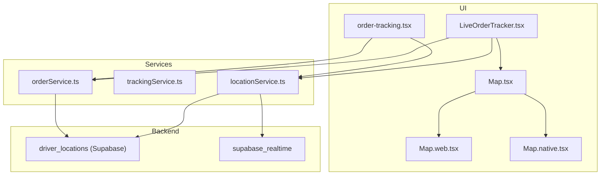
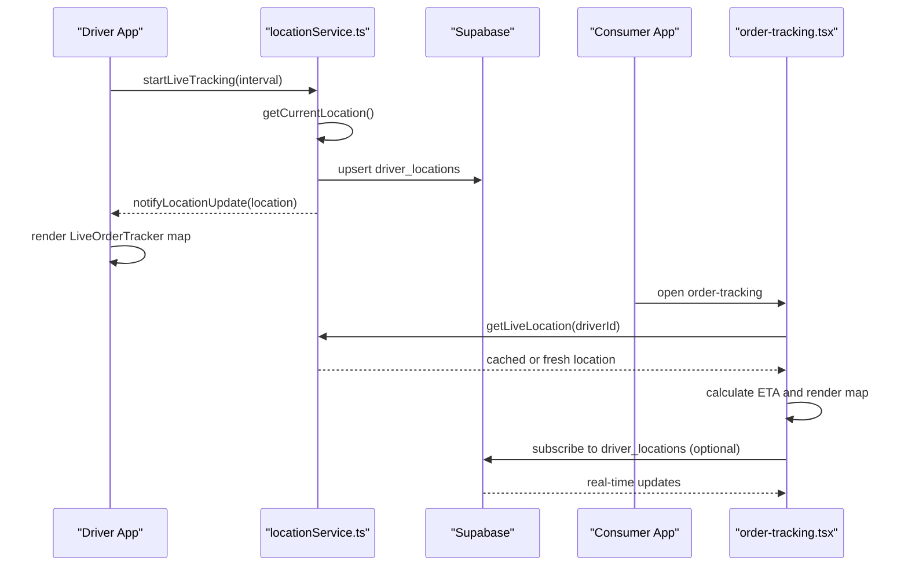
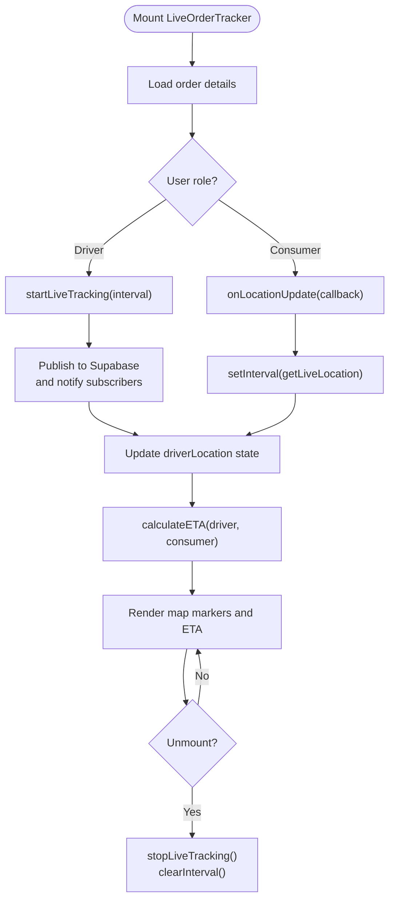
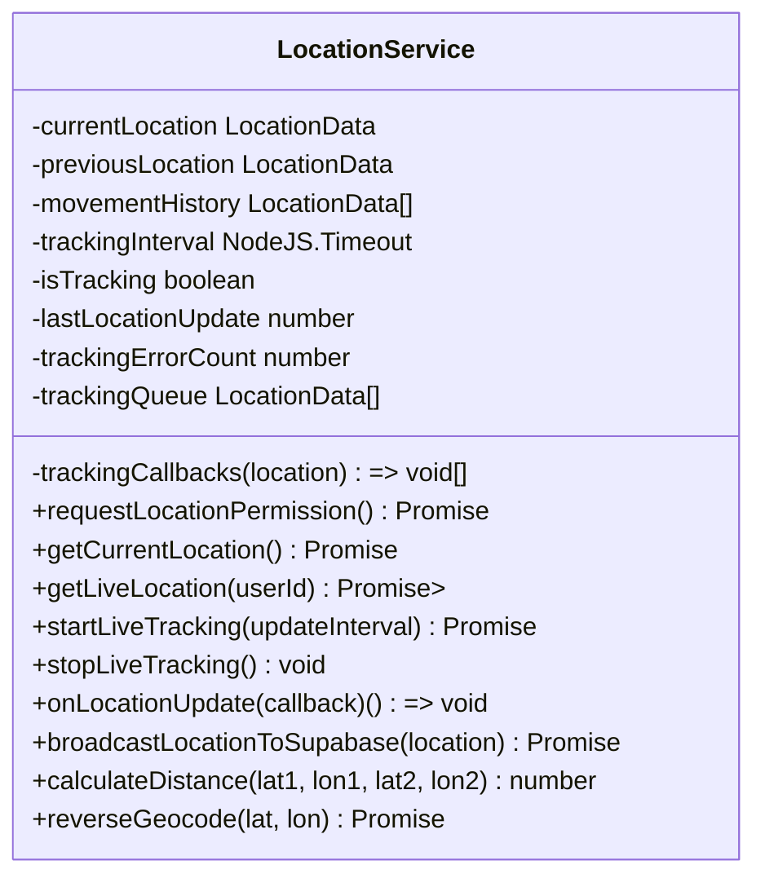
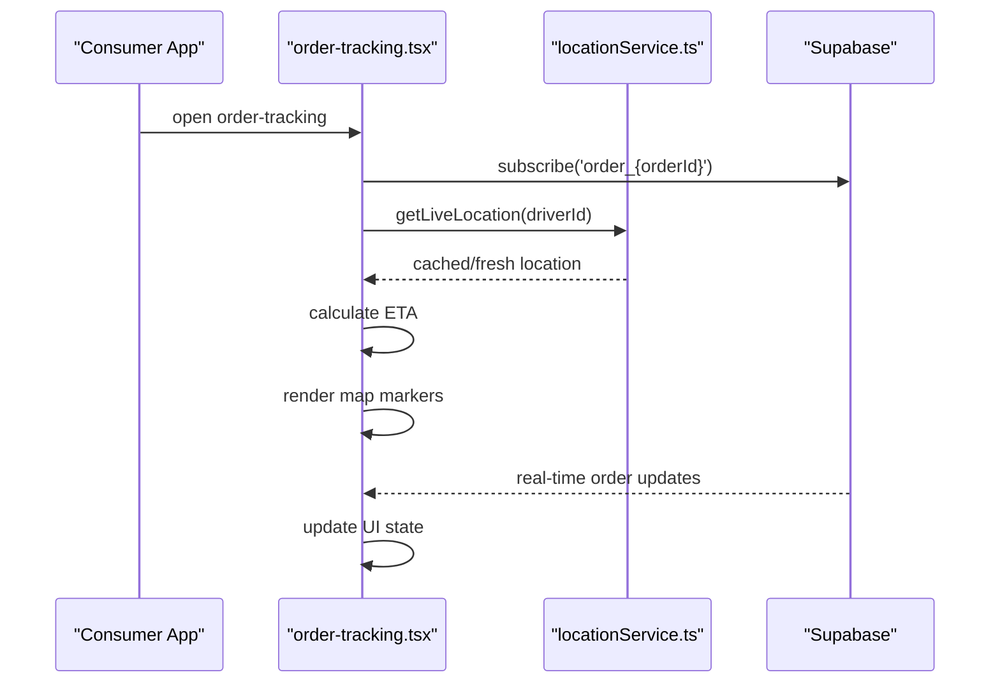
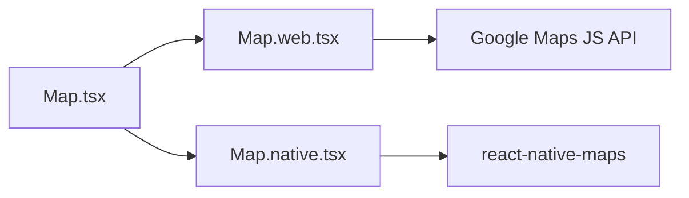
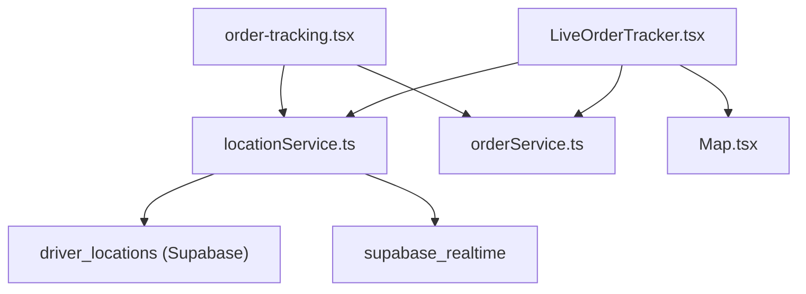

# Real-time Tracking

<cite>
**Referenced Files in This Document**
- [LiveOrderTracker.tsx](file://components/LiveOrderTracker.tsx)
- [locationService.ts](file://services/locationService.ts)
- [trackingService.ts](file://services/trackingService.ts)
- [order-tracking.tsx](file://app/orders/order-tracking.tsx)
- [consumer.tsx](file://app/dashboard/consumer.tsx)
- [Map.tsx](file://components/Map.tsx)
- [Map.web.tsx](file://components/Map.web.tsx)
- [Map.native.tsx](file://components/Map.native.tsx)
- [orderService.ts](file://services/orderService.ts)
- [driver-locations.sql](file://supabase/driver-locations.sql)
- [realtime.sql](file://supabase/realtime.sql)
- [types.ts](file://services/types.ts)
- [apiEndpoints.ts](file://services/apiEndpoints.ts)
</cite>

## Table of Contents
1. [Introduction](#introduction)
2. [Project Structure](#project-structure)
3. [Core Components](#core-components)
4. [Architecture Overview](#architecture-overview)
5. [Detailed Component Analysis](#detailed-component-analysis)
6. [Dependency Analysis](#dependency-analysis)
7. [Performance Considerations](#performance-considerations)
8. [Troubleshooting Guide](#troubleshooting-guide)
9. [Conclusion](#conclusion)
10. [Appendices](#appendices)

## Introduction
This document explains the real-time tracking system in Brillprime-expo, focusing on how driver and consumer locations are monitored during order fulfillment. It covers:
- How LiveOrderTracker.tsx enables live monitoring for drivers and consumers
- Integration between locationService.ts and trackingService.ts for publishing and retrieving live location data
- The getLiveLocation method’s caching strategy and fallback polling mechanism
- The consumer.tsx implementation that subscribes to driver location updates during active deliveries
- The order-tracking.tsx interface for viewing delivery progress on a map
- The data model for location updates including accuracy, timestamp, and movement status
- Examples of tracking initialization, interval management, and cleanup to prevent memory leaks
- Privacy considerations, battery optimization, and offline scenario handling

## Project Structure
The real-time tracking spans UI components, services, and backend infrastructure:
- UI components: LiveOrderTracker.tsx, order-tracking.tsx, Map.tsx, Map.web.tsx, Map.native.tsx
- Services: locationService.ts, trackingService.ts, orderService.ts
- Backend: Supabase tables and real-time publication for driver locations

**Diagram sources**
- [LiveOrderTracker.tsx](file://components/LiveOrderTracker.tsx#L1-L120)
- [order-tracking.tsx](file://app/orders/order-tracking.tsx#L1-L120)
- [Map.tsx](file://components/Map.tsx#L1-L35)
- [Map.web.tsx](file://components/Map.web.tsx#L1-L120)
- [Map.native.tsx](file://components/Map.native.tsx#L1-L5)
- [locationService.ts](file://services/locationService.ts#L368-L471)
- [trackingService.ts](file://services/trackingService.ts#L1-L58)
- [orderService.ts](file://services/orderService.ts#L156-L182)
- [driver-locations.sql](file://supabase/driver-locations.sql#L1-L58)
- [realtime.sql](file://supabase/realtime.sql#L1-L33)

**Section sources**
- [LiveOrderTracker.tsx](file://components/LiveOrderTracker.tsx#L1-L120)
- [order-tracking.tsx](file://app/orders/order-tracking.tsx#L1-L120)
- [Map.tsx](file://components/Map.tsx#L1-L35)
- [Map.web.tsx](file://components/Map.web.tsx#L1-L120)
- [Map.native.tsx](file://components/Map.native.tsx#L1-L5)
- [locationService.ts](file://services/locationService.ts#L368-L471)
- [trackingService.ts](file://services/trackingService.ts#L1-L58)
- [orderService.ts](file://services/orderService.ts#L156-L182)
- [driver-locations.sql](file://supabase/driver-locations.sql#L1-L58)
- [realtime.sql](file://supabase/realtime.sql#L1-L33)

## Core Components
- LiveOrderTracker.tsx: Driver and consumer-facing tracker with live map overlays, ETA calculation, and action buttons.
- locationService.ts: Centralized location management with movement detection, caching, live tracking intervals, and Supabase broadcasting.
- trackingService.ts: Order tracking API wrapper for fetching order details and updating delivery location.
- order-tracking.tsx: Consumer view for order progress and live driver location refresh.
- Map components: Cross-platform map rendering with platform-specific implementations.

Key responsibilities:
- Live tracking: startLiveTracking, stopLiveTracking, onLocationUpdate
- Data model: LocationData with accuracy, timestamp, heading, speed, isMoving
- Caching: getLiveLocation with in-memory cache and fallback to stale data on errors
- Fallback: polling intervals for driver location retrieval
- Supabase integration: broadcasting driver location updates and enabling real-time

**Section sources**
- [LiveOrderTracker.tsx](file://components/LiveOrderTracker.tsx#L1-L120)
- [locationService.ts](file://services/locationService.ts#L368-L471)
- [trackingService.ts](file://services/trackingService.ts#L1-L58)
- [order-tracking.tsx](file://app/orders/order-tracking.tsx#L1-L120)

## Architecture Overview
The system combines client-side location sampling with backend persistence and real-time subscriptions:
- Drivers: startLiveTracking publishes periodic updates to Supabase and broadcasts via channels.
- Consumers: subscribe to driver location via polling and/or Supabase real-time channels.
- UI: LiveOrderTracker and order-tracking render map overlays and progress.

**Diagram sources**
- [LiveOrderTracker.tsx](file://components/LiveOrderTracker.tsx#L47-L95)
- [locationService.ts](file://services/locationService.ts#L368-L471)
- [order-tracking.tsx](file://app/orders/order-tracking.tsx#L288-L315)
- [driver-locations.sql](file://supabase/driver-locations.sql#L1-L58)
- [realtime.sql](file://supabase/realtime.sql#L1-L33)

## Detailed Component Analysis

### LiveOrderTracker.tsx
Purpose:
- Provides a live tracking overlay for drivers and consumers.
- Renders driver and consumer positions on a map.
- Calculates ETA based on current driver and consumer locations.
- Offers actions like contacting the driver/customer and marking delivery complete.

Key behaviors:
- Initialization: loads order details and starts tracking based on user role.
- Driver mode: starts live tracking at a short interval and publishes updates.
- Consumer mode: subscribes to live updates and polls every few seconds as fallback.
- Cleanup: clears intervals and subscriptions on unmount.

**Diagram sources**
- [LiveOrderTracker.tsx](file://components/LiveOrderTracker.tsx#L28-L95)

**Section sources**
- [LiveOrderTracker.tsx](file://components/LiveOrderTracker.tsx#L1-L120)
- [LiveOrderTracker.tsx](file://components/LiveOrderTracker.tsx#L120-L241)
- [LiveOrderTracker.tsx](file://components/LiveOrderTracker.tsx#L241-L301)

### locationService.ts
Responsibilities:
- Location acquisition: getCurrentLocation with platform-specific logic (web and native).
- Movement detection: calculates speed, heading, and determines isMoving.
- Live tracking: periodic sampling with throttling and batching.
- Broadcasting: upserts driver location to Supabase and triggers real-time events.
- Caching: getLiveLocation caches results with a timeout and returns stale data on errors.
- Utilities: distance calculation, reverse geocoding, nearby merchants.

Data model:
- LocationData: latitude, longitude, accuracy, timestamp, heading, speed, isMoving.
- Movement history: sliding window to smooth direction and speed.

Caching strategy:
- In-memory cache keyed by userId with a short timeout.
- On error, returns cached data with a stale flag to keep UI responsive.

Polling fallback:
- Consumers poll getLiveLocation periodically when real-time subscription is not available.

**Diagram sources**
- [locationService.ts](file://services/locationService.ts#L1-L120)
- [locationService.ts](file://services/locationService.ts#L368-L471)
- [locationService.ts](file://services/locationService.ts#L625-L679)

**Section sources**
- [locationService.ts](file://services/locationService.ts#L1-L120)
- [locationService.ts](file://services/locationService.ts#L368-L471)
- [locationService.ts](file://services/locationService.ts#L625-L679)

### trackingService.ts
Purpose:
- Wraps order tracking APIs for consumers and drivers.
- Fetches order tracking details and updates delivery location.

Key endpoints:
- trackOrder(orderId)
- updateDeliveryLocation(orderId, data)

**Section sources**
- [trackingService.ts](file://services/trackingService.ts#L1-L58)

### order-tracking.tsx
Purpose:
- Consumer-facing order tracking screen with live driver location refresh.
- Subscribes to Supabase real-time updates for order changes.
- Falls back to polling when subscriptions are unavailable.

Behavior:
- Loads order details and driver location.
- Subscribes to Supabase channel for order updates.
- Polls every 10 seconds for updates when needed.
- Calculates ETA using distance and assumed speed.

**Diagram sources**
- [order-tracking.tsx](file://app/orders/order-tracking.tsx#L112-L169)
- [order-tracking.tsx](file://app/orders/order-tracking.tsx#L183-L189)
- [order-tracking.tsx](file://app/orders/order-tracking.tsx#L288-L315)
- [order-tracking.tsx](file://app/orders/order-tracking.tsx#L157-L164)

**Section sources**
- [order-tracking.tsx](file://app/orders/order-tracking.tsx#L112-L169)
- [order-tracking.tsx](file://app/orders/order-tracking.tsx#L183-L189)
- [order-tracking.tsx](file://app/orders/order-tracking.tsx#L288-L315)

### Map Components
Cross-platform map rendering:
- Map.tsx selects platform-specific implementation.
- Map.web.tsx initializes Google Maps, handles markers, and exposes ref methods.
- Map.native.tsx exports react-native-maps components.

**Diagram sources**
- [Map.tsx](file://components/Map.tsx#L1-L35)
- [Map.web.tsx](file://components/Map.web.tsx#L1-L120)
- [Map.native.tsx](file://components/Map.native.tsx#L1-L5)

**Section sources**
- [Map.tsx](file://components/Map.tsx#L1-L35)
- [Map.web.tsx](file://components/Map.web.tsx#L1-L120)
- [Map.native.tsx](file://components/Map.native.tsx#L1-L5)

### Data Model for Location Updates
Fields:
- latitude, longitude: decimal coordinates
- accuracy: horizontal accuracy in meters
- timestamp: ISO timestamp of the location sample
- heading: direction in degrees (0–360)
- speed: meters per second
- isMoving: boolean indicating motion threshold exceeded

Storage and real-time:
- Supabase driver_locations table stores driver location updates with RLS policies and real-time publication.

**Section sources**
- [locationService.ts](file://services/locationService.ts#L12-L30)
- [driver-locations.sql](file://supabase/driver-locations.sql#L1-L58)
- [realtime.sql](file://supabase/realtime.sql#L1-L33)

## Dependency Analysis
- LiveOrderTracker depends on:
  - locationService for live updates and driver location retrieval
  - orderService for initial order details
  - Map components for rendering
- locationService depends on:
  - Supabase client for broadcasting driver locations
  - Expo Location for native geolocation
  - Browser Geolocation API for web
- order-tracking depends on:
  - locationService for live driver location
  - Supabase for real-time order updates

**Diagram sources**
- [LiveOrderTracker.tsx](file://components/LiveOrderTracker.tsx#L1-L120)
- [order-tracking.tsx](file://app/orders/order-tracking.tsx#L1-L120)
- [locationService.ts](file://services/locationService.ts#L368-L471)
- [driver-locations.sql](file://supabase/driver-locations.sql#L1-L58)
- [realtime.sql](file://supabase/realtime.sql#L1-L33)

**Section sources**
- [LiveOrderTracker.tsx](file://components/LiveOrderTracker.tsx#L1-L120)
- [order-tracking.tsx](file://app/orders/order-tracking.tsx#L1-L120)
- [locationService.ts](file://services/locationService.ts#L368-L471)
- [driver-locations.sql](file://supabase/driver-locations.sql#L1-L58)
- [realtime.sql](file://supabase/realtime.sql#L1-L33)

## Performance Considerations
- Interval tuning:
  - Drivers: startLiveTracking accepts an updateInterval parameter; adjust to balance responsiveness and battery usage.
  - Consumers: polling interval in LiveOrderTracker and order-tracking is set to a reasonable cadence.
- Movement-aware updates:
  - locationService throttles updates by detecting movement and distance thresholds.
- Caching:
  - getLiveLocation caches results for a short timeout and returns stale data on errors to minimize network requests.
- Platform differences:
  - Native vs web location APIs have different capabilities; ensure appropriate accuracy and timeout settings per platform.
- Map rendering:
  - Avoid excessive re-renders by memoizing derived regions and using platform-specific map implementations.

[No sources needed since this section provides general guidance]

## Troubleshooting Guide
Common issues and resolutions:
- Location permission denied:
  - locationService checks platform permissions and returns null; prompt users to enable location access.
- Web geolocation unavailable:
  - Map.web.tsx logs initialization failures and errors; verify API key and network connectivity.
- Supabase authentication errors:
  - locationService broadcasts driver locations with RLS policies; ensure user is authenticated and API keys are configured.
- Memory leaks:
  - LiveOrderTracker cleans up tracking intervals and subscriptions on unmount; ensure similar cleanup in consumers.
- Offline scenarios:
  - locationService.getCachedLocation returns cached data if available; consumers can poll until connectivity resumes.

**Section sources**
- [locationService.ts](file://services/locationService.ts#L39-L67)
- [locationService.ts](file://services/locationService.ts#L103-L178)
- [Map.web.tsx](file://components/Map.web.tsx#L170-L267)
- [LiveOrderTracker.tsx](file://components/LiveOrderTracker.tsx#L60-L69)

## Conclusion
The real-time tracking system integrates client-side location sampling, movement-aware updates, caching, and Supabase real-time broadcasting to deliver responsive driver and consumer tracking experiences. LiveOrderTracker and order-tracking provide complementary views for drivers and consumers, while locationService centralizes location logic and caching. Proper interval management, cleanup, and platform-specific considerations ensure reliability and performance across devices.

[No sources needed since this section summarizes without analyzing specific files]

## Appendices

### Privacy Considerations
- Location data is stored with RLS policies; ensure only authorized users can access driver locations.
- Consumers should be informed about location sharing and have controls to manage privacy settings.
- Consider aggregating or anonymizing location data for analytics to protect driver privacy.

**Section sources**
- [driver-locations.sql](file://supabase/driver-locations.sql#L1-L58)
- [realtime.sql](file://supabase/realtime.sql#L1-L33)

### Battery Optimization
- Use shorter update intervals only when necessary; increase intervals when the device is stationary.
- Apply movement thresholds to avoid frequent updates.
- Avoid unnecessary polling when real-time subscriptions are available.

**Section sources**
- [locationService.ts](file://services/locationService.ts#L404-L463)

### Offline Scenario Handling
- Use cached location data when network is unavailable.
- Poll at longer intervals to conserve resources.
- Display a stale indicator and allow manual refresh.

**Section sources**
- [locationService.ts](file://services/locationService.ts#L625-L679)
- [order-tracking.tsx](file://app/orders/order-tracking.tsx#L288-L315)

### Examples: Tracking Initialization, Intervals, and Cleanup
- Driver initialization:
  - startLiveTracking with a short interval to publish frequent updates.
- Consumer subscription:
  - onLocationUpdate for real-time updates plus periodic polling fallback.
- Cleanup:
  - stopLiveTracking and clearing intervals to prevent leaks.

**Section sources**
- [LiveOrderTracker.tsx](file://components/LiveOrderTracker.tsx#L47-L95)
- [LiveOrderTracker.tsx](file://components/LiveOrderTracker.tsx#L60-L69)
- [locationService.ts](file://services/locationService.ts#L378-L471)