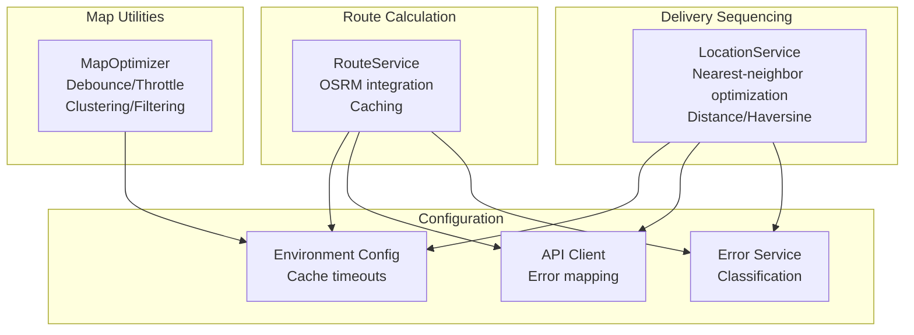
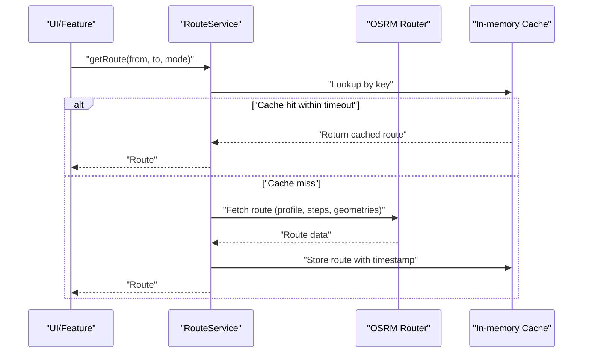
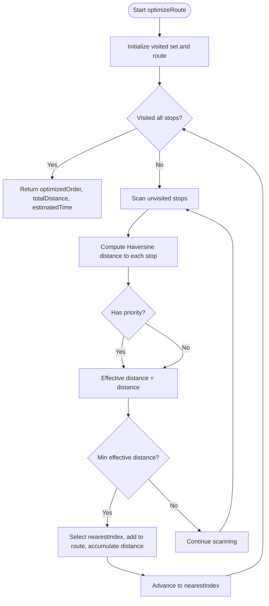
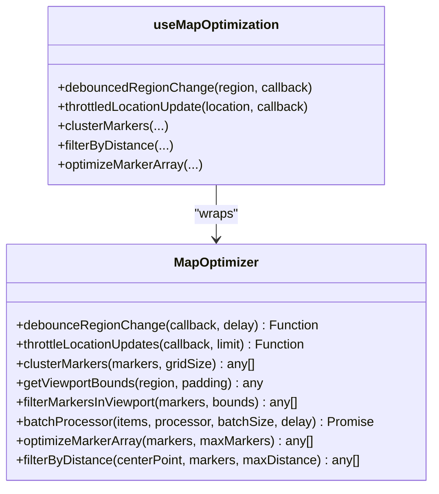
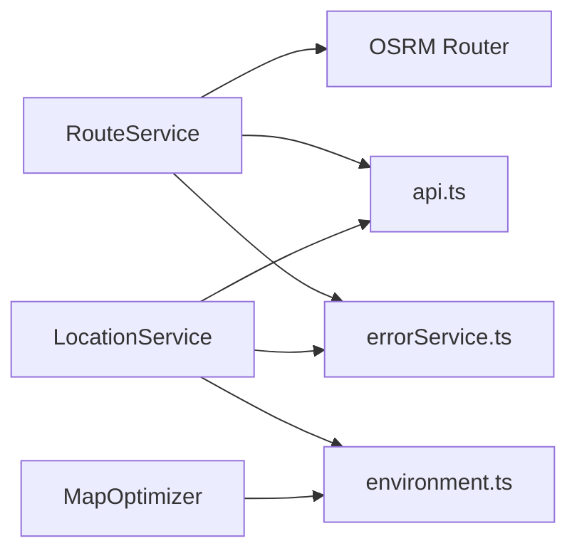

# Route Optimization

<cite>
**Referenced Files in This Document**
- [routeService.ts](file://services/routeService.ts)
- [locationService.ts](file://services/locationService.ts)
- [mapOptimization.ts](file://utils/mapOptimization.ts)
- [environment.ts](file://config/environment.ts)
- [api.ts](file://services/api.ts)
- [errorService.ts](file://services/errorService.ts)
</cite>

## Table of Contents
1. [Introduction](#introduction)
2. [Project Structure](#project-structure)
3. [Core Components](#core-components)
4. [Architecture Overview](#architecture-overview)
5. [Detailed Component Analysis](#detailed-component-analysis)
6. [Dependency Analysis](#dependency-analysis)
7. [Performance Considerations](#performance-considerations)
8. [Troubleshooting Guide](#troubleshooting-guide)
9. [Conclusion](#conclusion)
10. [Appendices](#appendices)

## Introduction
This document explains the route optimization system in Brillprime-expo. It covers:
- OSRM integration for driving, walking, and bicycling routes with turn-by-turn instructions
- Caching mechanisms to reduce API calls and improve performance
- Distance calculations using the Haversine formula
- Delivery stop sequencing using a nearest-neighbor algorithm with priority weighting
- Utility functions for debouncing region changes and throttling location updates
- Example scenarios for multi-stop deliveries
- Error handling, fallback strategies, and rate limiting considerations for external APIs

## Project Structure
The route optimization system spans three primary areas:
- Route calculation and caching: services/routeService.ts
- Delivery sequencing and location utilities: services/locationService.ts
- Map performance utilities: utils/mapOptimization.ts
- Global configuration and API helpers: config/environment.ts, services/api.ts, services/errorService.ts



**Diagram sources**
- [routeService.ts](file://services/routeService.ts#L1-L171)
- [locationService.ts](file://services/locationService.ts#L1-L773)
- [mapOptimization.ts](file://utils/mapOptimization.ts#L1-L203)
- [environment.ts](file://config/environment.ts#L1-L52)
- [api.ts](file://services/api.ts#L81-L168)
- [errorService.ts](file://services/errorService.ts#L48-L95)

**Section sources**
- [routeService.ts](file://services/routeService.ts#L1-L171)
- [locationService.ts](file://services/locationService.ts#L1-L773)
- [mapOptimization.ts](file://utils/mapOptimization.ts#L1-L203)
- [environment.ts](file://config/environment.ts#L1-L52)

## Core Components
- RouteService: Fetches routes from OSRM, decodes geometry, extracts turn-by-turn instructions, and caches results.
- LocationService: Provides distance calculations (Haversine), live tracking, and a nearest-neighbor delivery optimization routine with priority weighting.
- MapOptimizer: Offers debounce/throttle utilities and clustering/filtering for map performance.

**Section sources**
- [routeService.ts](file://services/routeService.ts#L1-L171)
- [locationService.ts](file://services/locationService.ts#L690-L750)
- [mapOptimization.ts](file://utils/mapOptimization.ts#L1-L203)

## Architecture Overview
The system integrates external routing and geolocation services with internal caching and optimization logic.



**Diagram sources**
- [routeService.ts](file://services/routeService.ts#L19-L91)

## Detailed Component Analysis

### RouteService: OSRM Integration and Caching
- OSRM Profile Mapping: Maps driving/walking/bicycling modes to OSRM profiles.
- Route Fetch: Calls OSRM with overview=full, geometries=geojson, steps=true to receive turn-by-turn instructions.
- Geometry Decoding: Converts GeoJSON coordinates to internal RoutePoint format.
- Turn-by-Turn Instructions: Extracts maneuver instructions from steps.
- Caching: Stores route keyed by origin/destination/mode with a 5-minute TTL.
- Fallback: Returns null on network/API errors; logs errors for diagnostics.
- Utilities:
  - decodePolyline: Decodes encoded polylines to RoutePoint arrays.
  - calculateRouteDistance: Sums distances between consecutive points using Haversine.
  - clearCache: Clears stored routes.

```mermaid
classDiagram
class RouteService {
-Map~string, {route, timestamp}~ cachedRoutes
-number cacheTimeout
+getRoute(from, to, mode) Route|null
-getRouteFromOSRM(from, to, mode) Route|null
+decodePolyline(encoded) RoutePoint[]
+calculateRouteDistance(points) number
+clearCache() void
}
class RoutePoint {
+number latitude
+number longitude
}
class Route {
+RoutePoint[] points
+number distance
+number duration
+string[] instructions
}
RouteService --> Route : "returns"
Route --> RoutePoint : "contains"
```

**Diagram sources**
- [routeService.ts](file://services/routeService.ts#L1-L171)

**Section sources**
- [routeService.ts](file://services/routeService.ts#L19-L91)
- [routeService.ts](file://services/routeService.ts#L93-L171)

### LocationService: Nearest-Neighbor Optimization with Priority Weighting
- Distance Calculation: Implements Haversine formula for accurate distance between coordinates.
- Delivery Optimization:
  - Uses a greedy nearest-neighbor algorithm starting from index 0.
  - Considers priority values to weight effective distance (higher priority lowers effective distance).
  - Estimates travel time at 30 km/h.
- Live Tracking and Caching:
  - Tracks movement thresholds and smooths heading using recent history.
  - Caches live driver locations with a 10-second TTL.
  - Broadcasts driver location updates to Supabase when authenticated.



**Diagram sources**
- [locationService.ts](file://services/locationService.ts#L690-L750)

**Section sources**
- [locationService.ts](file://services/locationService.ts#L690-L750)
- [locationService.ts](file://services/locationService.ts#L273-L309)
- [locationService.ts](file://services/locationService.ts#L625-L679)

### MapOptimizer: Debounce Region Changes and Throttle Updates
- Debounce Region Change: Delays callbacks after region changes to reduce unnecessary API calls.
- Throttle Location Updates: Limits frequency of location update callbacks to improve performance.
- Clustering and Filtering:
  - Grid-based clustering for large datasets.
  - Viewport bounds calculation and marker filtering.
  - Batch processing and memory optimization for marker arrays.
  - Distance-based filtering around a center point.
- Hook: useMapOptimization exposes debouncedRegionChange and throttledLocationUpdate for React components.



**Diagram sources**
- [mapOptimization.ts](file://utils/mapOptimization.ts#L1-L203)

**Section sources**
- [mapOptimization.ts](file://utils/mapOptimization.ts#L1-L203)

## Dependency Analysis
- External Dependencies:
  - OSRM Router for route computation and turn-by-turn instructions.
  - Overpass API for place discovery (used by PlacesService).
  - Supabase for driver location broadcasting.
- Internal Dependencies:
  - API client for standardized HTTP requests and error mapping.
  - Error service for classification of network/server/client errors.
  - Environment configuration for cache timeouts and API base URLs.



**Diagram sources**
- [routeService.ts](file://services/routeService.ts#L19-L91)
- [locationService.ts](file://services/locationService.ts#L690-L750)
- [mapOptimization.ts](file://utils/mapOptimization.ts#L1-L203)
- [api.ts](file://services/api.ts#L81-L168)
- [errorService.ts](file://services/errorService.ts#L48-L95)
- [environment.ts](file://config/environment.ts#L1-L52)

**Section sources**
- [routeService.ts](file://services/routeService.ts#L19-L91)
- [locationService.ts](file://services/locationService.ts#L690-L750)
- [mapOptimization.ts](file://utils/mapOptimization.ts#L1-L203)
- [api.ts](file://services/api.ts#L81-L168)
- [errorService.ts](file://services/errorService.ts#L48-L95)
- [environment.ts](file://config/environment.ts#L1-L52)

## Performance Considerations
- Route Caching: RouteService caches routes for 5 minutes to minimize repeated OSRM calls.
- Live Location Caching: LocationService caches driver locations for 10 seconds to reduce backend calls.
- Debounce/Throttle: MapOptimizer reduces frequent map interactions and location updates.
- Batch Processing: MapOptimizer’s batchProcessor spreads heavy workloads across time slices.
- Distance Computation: Haversine formula ensures accurate distance calculations for route optimization and clustering.

[No sources needed since this section provides general guidance]

## Troubleshooting Guide
- OSRM API Errors:
  - Symptom: getRoute returns null; console logs OSRM API error.
  - Action: Verify mode mapping and coordinates; check network connectivity; inspect response status.
- Supabase Broadcasting:
  - Symptom: 401 Unauthorized or “No API key found” errors.
  - Action: Confirm Supabase credentials and authentication token availability.
- Live Tracking Failures:
  - Symptom: Too many tracking errors triggers automatic stop.
  - Action: Inspect tracking interval, movement detection thresholds, and error counts.
- API Client Errors:
  - Symptom: HTTP 401/403/404/500/503 mapped to user-friendly messages.
  - Action: Review environment configuration and backend health.

**Section sources**
- [routeService.ts](file://services/routeService.ts#L45-L91)
- [locationService.ts](file://services/locationService.ts#L571-L623)
- [locationService.ts](file://services/locationService.ts#L454-L471)
- [api.ts](file://services/api.ts#L81-L168)
- [errorService.ts](file://services/errorService.ts#L48-L95)

## Conclusion
The route optimization system combines OSRM-based routing with internal caching, Haversine-based distance computations, and a nearest-neighbor delivery sequencing algorithm. Map utilities provide performance enhancements through debouncing, throttling, and clustering. Robust error handling and fallback strategies ensure resilience against external API failures and rate limiting.

[No sources needed since this section summarizes without analyzing specific files]

## Appendices

### Example Scenarios

- Multi-stop Delivery Optimization
  - Input: Array of stops with latitude/longitude and optional priority weights.
  - Process: Greedy nearest-neighbor selection with priority weighting; accumulate total distance; estimate time at 30 km/h.
  - Output: Optimized stop order, total distance, and estimated time.

  **Section sources**
  - [locationService.ts](file://services/locationService.ts#L690-L750)

- Route Calculation with Turn-by-Turn Instructions
  - Input: Origin/destination coordinates and mode (driving/walking/bicycling).
  - Process: Build OSRM URL with profile mapping; fetch route; decode geometry; extract instructions.
  - Output: Route with points, distance, duration, and instructions; cached for 5 minutes.

  **Section sources**
  - [routeService.ts](file://services/routeService.ts#L19-L91)

- Cache Management
  - RouteService cache: Keys by origin/destination/mode; TTL 5 minutes; clearCache clears all entries.
  - Live driver location cache: TTL 10 seconds; clearLiveLocationCache supports selective deletion.

  **Section sources**
  - [routeService.ts](file://services/routeService.ts#L16-L171)
  - [locationService.ts](file://services/locationService.ts#L625-L679)

- Map Performance Utilities
  - Debounce region changes: 300 ms default.
  - Throttle location updates: 1000 ms default.
  - Clustering: Grid-based grouping; filtering by viewport and distance.

  **Section sources**
  - [mapOptimization.ts](file://utils/mapOptimization.ts#L1-L203)

### Rate Limiting and Fallback Strategies
- OSRM Router: No explicit rate limiting enforced in code; caching mitigates repeated calls.
- Supabase: Broadcasting requires valid authentication; 401 errors are handled gracefully.
- API Client: Standardized HTTP error mapping and user-friendly messages for common statuses.
- Environment Configuration: Centralized cacheTimeout and API timeout values.

**Section sources**
- [routeService.ts](file://services/routeService.ts#L19-L91)
- [locationService.ts](file://services/locationService.ts#L571-L623)
- [api.ts](file://services/api.ts#L81-L168)
- [environment.ts](file://config/environment.ts#L23-L35)