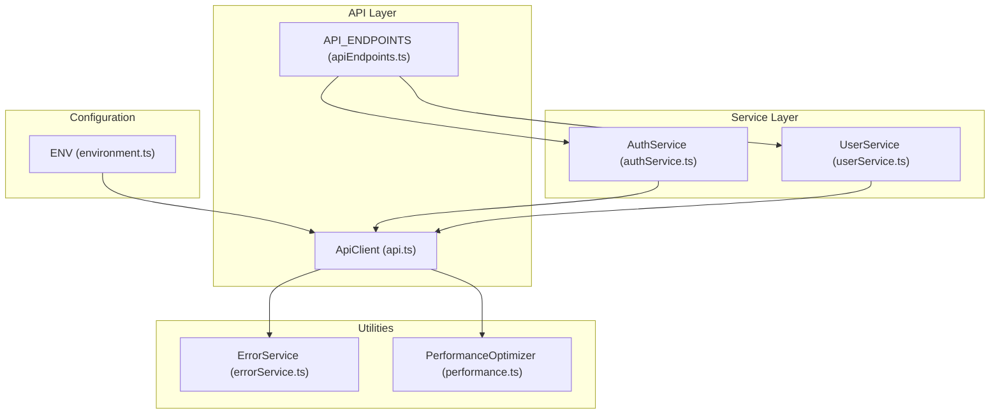
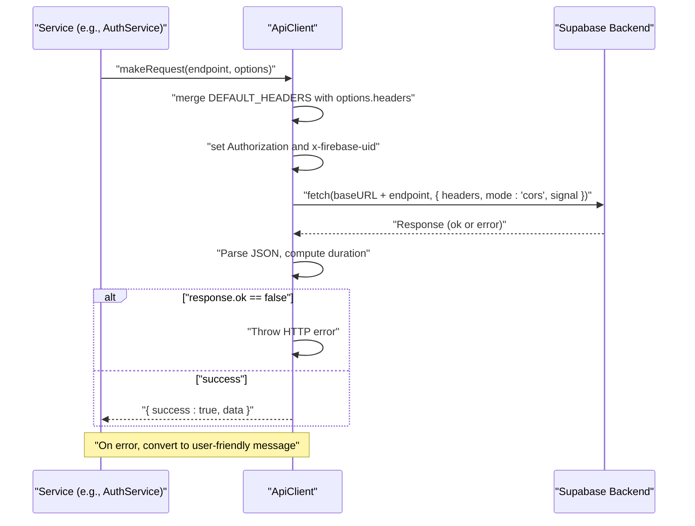
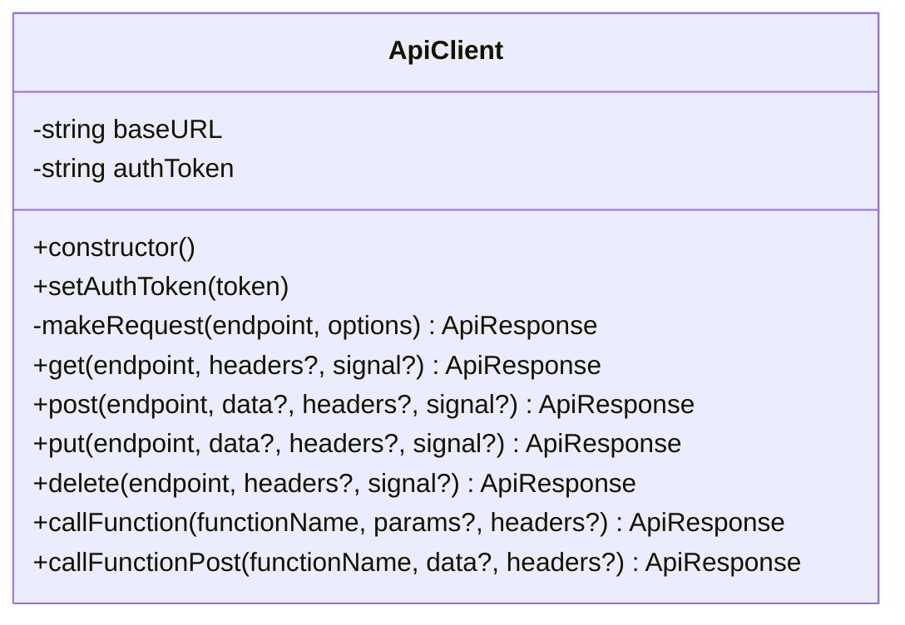
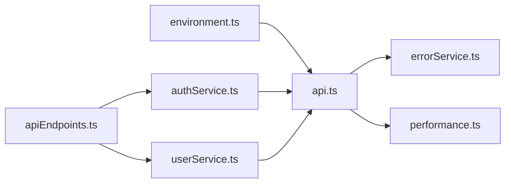

# API Client Configuration

<cite>
**Referenced Files in This Document**
- [api.ts](file://services/api.ts)
- [environment.ts](file://config/environment.ts)
- [apiEndpoints.ts](file://services/apiEndpoints.ts)
- [authService.ts](file://services/authService.ts)
- [userService.ts](file://services/userService.ts)
- [errorService.ts](file://services/errorService.ts)
- [performance.ts](file://utils/performance.ts)
- [SUPABASE_MIGRATION_GUIDE.md](file://SUPABASE_MIGRATION_GUIDE.md)
</cite>

## Table of Contents
1. [Introduction](#introduction)
2. [Project Structure](#project-structure)
3. [Core Components](#core-components)
4. [Architecture Overview](#architecture-overview)
5. [Detailed Component Analysis](#detailed-component-analysis)
6. [Dependency Analysis](#dependency-analysis)
7. [Performance Considerations](#performance-considerations)
8. [Troubleshooting Guide](#troubleshooting-guide)
9. [Conclusion](#conclusion)

## Introduction
This document explains the centralized API client used across the application, focusing on how it configures requests, injects authentication headers, and manages cross-cutting concerns such as logging, timeouts, and error handling. It also details how environment variables from the configuration module are used to set the Supabase backend URL and API keys, and how the client’s request pipeline works, including request/response interception, timeout handling via AbortController, and CORS configuration. Guidance is provided for setting default headers (including Content-Type, Authorization, and x-firebase-uid for role-based access), and practical usage patterns for GET, POST, PUT, and DELETE. Helpers for Supabase Edge Functions are documented, along with strategies for handling network errors, server errors, and user-friendly messaging. Finally, performance considerations such as request duration logging and retry strategies are addressed.

## Project Structure
The API client lives in a dedicated service module and integrates with configuration and service layers:
- Centralized API client: services/api.ts
- Environment configuration: config/environment.ts
- Endpoint definitions: services/apiEndpoints.ts
- Example service usage: services/authService.ts, services/userService.ts
- Error handling utilities: services/errorService.ts
- Performance utilities: utils/performance.ts
- Migration and usage guidance: SUPABASE_MIGRATION_GUIDE.md

**Diagram sources**
- [api.ts](file://services/api.ts#L1-L220)
- [environment.ts](file://config/environment.ts#L1-L52)
- [apiEndpoints.ts](file://services/apiEndpoints.ts#L1-L197)
- [authService.ts](file://services/authService.ts#L1-L240)
- [userService.ts](file://services/userService.ts#L160-L200)
- [errorService.ts](file://services/errorService.ts#L1-L95)
- [performance.ts](file://utils/performance.ts#L1-L240)

**Section sources**
- [api.ts](file://services/api.ts#L1-L220)
- [environment.ts](file://config/environment.ts#L1-L52)
- [apiEndpoints.ts](file://services/apiEndpoints.ts#L1-L197)

## Core Components
- ApiClient: central HTTP client that encapsulates request configuration, authentication header injection, timeout handling, CORS, and unified error handling. It exposes typed methods for GET, POST, PUT, DELETE, plus helpers for Supabase Edge Functions.
- Environment configuration: provides runtime configuration including Supabase base URL, API timeout, and other feature flags.
- API endpoints: a strongly-typed catalog of backend endpoints used by services.
- Services: consume the ApiClient to perform authenticated operations and manage user state.

Key responsibilities:
- Request configuration: merges default headers with caller-provided headers, sets Content-Type, and injects Authorization and x-firebase-uid.
- Authentication: accepts a token and injects it into headers for role-based access.
- Cross-cutting concerns: logs request/response, measures duration, enforces timeouts, and converts errors into user-friendly messages.
- Supabase integration: helper methods for calling Edge Functions via REST endpoints.

**Section sources**
- [api.ts](file://services/api.ts#L22-L220)
- [environment.ts](file://config/environment.ts#L1-L52)
- [apiEndpoints.ts](file://services/apiEndpoints.ts#L1-L197)

## Architecture Overview
The API client sits between services and the Supabase backend. Services prepare endpoint paths and payload, while the client ensures consistent headers, timeouts, and error handling.

**Diagram sources**
- [api.ts](file://services/api.ts#L44-L155)
- [environment.ts](file://config/environment.ts#L12-L35)

## Detailed Component Analysis

### ApiClient Class
The ApiClient class centralizes HTTP operations with a robust request pipeline:
- Constructor reads the Supabase base URL from environment variables and falls back to a known Supabase URL if not configured.
- setAuthToken allows injecting a Firebase ID token for role-based access.
- makeRequest orchestrates:
  - AbortController-based timeout (default 30 seconds)
  - Logging of request start and response finish with duration
  - Header merging: default headers, caller headers, and x-firebase-uid
  - Preflight handling for OPTIONS
  - CORS mode and credentials inclusion
  - Response parsing and error conversion
- Typed convenience methods: get, post, put, delete
- Supabase Edge Function helpers: callFunction (GET), callFunctionPost (POST)

**Diagram sources**
- [api.ts](file://services/api.ts#L22-L220)

**Section sources**
- [api.ts](file://services/api.ts#L22-L220)

### Request Configuration and Authentication Headers
- Default headers include Content-Type, Accept, apikey, Authorization, and Access-Control-Allow-Credentials.
- Authorization is set using the Supabase anonymous key from environment variables.
- x-firebase-uid is injected from the current auth token, enabling role-based access control on the backend.
- Caller-provided headers override defaults when passed to get/post/put/delete.

Practical usage patterns:
- GET: pass endpoint and optional headers; the client merges defaults and injects Authorization and x-firebase-uid.
- POST/PUT/DELETE: pass endpoint, optional body/data, and optional headers; the client ensures Content-Type is application/json and merges headers.

**Section sources**
- [api.ts](file://services/api.ts#L6-L13)
- [api.ts](file://services/api.ts#L56-L63)
- [api.ts](file://services/api.ts#L157-L205)

### Timeout Handling via AbortController
- A 30-second timeout is enforced using AbortController. On timeout, the client throws an AbortError and returns a user-friendly message indicating the request timed out.
- The client measures request duration and logs it upon success.

**Section sources**
- [api.ts](file://services/api.ts#L49-L51)
- [api.ts](file://services/api.ts#L71-L81)
- [api.ts](file://services/api.ts#L120-L123)

### CORS Configuration
- The client sets fetch mode to cors and credentials to include, enabling cookies and credentials to be sent with cross-origin requests.

**Section sources**
- [api.ts](file://services/api.ts#L73-L77)

### Supabase Edge Functions Helpers
- callFunction: performs a GET to /functions/v1/{functionName} with optional query parameters.
- callFunctionPost: performs a POST to /functions/v1/{functionName} with optional body data.
- These helpers simplify invoking Edge Functions and can be used with Authorization headers for protected routes.

**Section sources**
- [api.ts](file://services/api.ts#L207-L217)
- [SUPABASE_MIGRATION_GUIDE.md](file://SUPABASE_MIGRATION_GUIDE.md#L173-L230)

### Environment Variables and Supabase Configuration
- The client reads EXPO_PUBLIC_SUPABASE_URL and falls back to a known Supabase URL if missing.
- EXPO_PUBLIC_SUPABASE_ANON_KEY is used for Authorization and apikey headers.
- The environment module also defines apiTimeout and other flags that can influence client behavior.

**Section sources**
- [api.ts](file://services/api.ts#L26-L38)
- [api.ts](file://services/api.ts#L8-L13)
- [environment.ts](file://config/environment.ts#L12-L35)

### Example Usage Patterns
- GET: services use apiClient.get with Authorization headers for authenticated endpoints.
- POST/PUT/DELETE: services pass Authorization headers and optional body/data.
- Edge Functions: services call callFunction or callFunctionPost depending on whether a body is needed.

Examples in code:
- Authenticated GET: [authService.ts](file://services/authService.ts#L660-L679)
- Authenticated PUT: [userService.ts](file://services/userService.ts#L166-L179)
- Authenticated DELETE: [userService.ts](file://services/userService.ts#L198-L207)
- Edge Function POST: [SUPABASE_MIGRATION_GUIDE.md](file://SUPABASE_MIGRATION_GUIDE.md#L217-L230)

**Section sources**
- [authService.ts](file://services/authService.ts#L659-L679)
- [userService.ts](file://services/userService.ts#L166-L207)
- [SUPABASE_MIGRATION_GUIDE.md](file://SUPABASE_MIGRATION_GUIDE.md#L173-L230)

### Error Handling and User-Friendly Messaging
- On HTTP errors, the client logs the status and response body, then throws an error with a descriptive message.
- On parse errors, it throws an “Invalid JSON response” error.
- On exceptions, the client converts them into user-friendly messages:
  - AbortError -> timeout message
  - TypeError with “Failed to fetch” -> network connectivity message
  - HTTP 401/403/404/500/503 -> mapped to user-friendly messages
  - Other network-related messages -> mapped to user-friendly equivalents
- The client returns a standardized ApiResponse with success, data, and message fields.

**Section sources**
- [api.ts](file://services/api.ts#L83-L101)
- [api.ts](file://services/api.ts#L108-L154)

### Logging and Request Duration
- The client logs request start and response finish with status and duration.
- Duration is computed as the difference between start and end times.

**Section sources**
- [api.ts](file://services/api.ts#L53-L55)
- [api.ts](file://services/api.ts#L79-L82)

## Dependency Analysis
- ApiClient depends on:
  - Environment configuration for base URL and keys
  - API endpoint constants for endpoint paths
  - Services for authenticated usage patterns
- Services depend on:
  - ApiClient for HTTP operations
  - Auth tokens for Authorization headers
  - API endpoint constants for endpoint paths

**Diagram sources**
- [api.ts](file://services/api.ts#L1-L220)
- [environment.ts](file://config/environment.ts#L1-L52)
- [apiEndpoints.ts](file://services/apiEndpoints.ts#L1-L197)
- [authService.ts](file://services/authService.ts#L1-L240)
- [userService.ts](file://services/userService.ts#L160-L200)
- [errorService.ts](file://services/errorService.ts#L1-L95)
- [performance.ts](file://utils/performance.ts#L1-L240)

**Section sources**
- [api.ts](file://services/api.ts#L1-L220)
- [environment.ts](file://config/environment.ts#L1-L52)
- [apiEndpoints.ts](file://services/apiEndpoints.ts#L1-L197)
- [authService.ts](file://services/authService.ts#L1-L240)
- [userService.ts](file://services/userService.ts#L160-L200)

## Performance Considerations
- Request duration logging: The client measures and logs the time taken for each request, aiding performance monitoring.
- Timeout enforcement: A 30-second AbortController timeout prevents hanging requests.
- Retry strategies: While the client does not implement automatic retries, the application demonstrates exponential backoff retry logic in UI components. This pattern can be adapted to wrap API calls when needed.
- Caching and batching: The performance utilities module provides caching and batching helpers that can be used to optimize repeated API calls.

Recommendations:
- Use AbortController signals to cancel long-running requests when appropriate.
- Consider adding retry logic with exponential backoff for transient failures, especially for critical flows.
- Apply caching for read-heavy endpoints to reduce load and improve responsiveness.

**Section sources**
- [api.ts](file://services/api.ts#L49-L51)
- [api.ts](file://services/api.ts#L79-L82)
- [performance.ts](file://utils/performance.ts#L1-L240)
- [app/home/consumer.tsx](file://app/home/consumer.tsx#L250-L272)

## Troubleshooting Guide
Common issues and resolutions:
- Missing Supabase URL: The client logs a warning and falls back to a known Supabase URL. Ensure EXPO_PUBLIC_SUPABASE_URL is set in the environment.
- Timeout errors: The client returns a user-friendly timeout message. Consider increasing timeouts for heavy operations or splitting tasks.
- Network errors: “Failed to fetch” is mapped to a user-friendly connectivity message. Verify device connectivity and proxy/firewall settings.
- HTTP 401/403/404/500/503: Mapped to user-friendly messages; inspect server-side logs for root causes.
- Invalid JSON response: Indicates malformed server responses; validate backend serialization.
- CORS issues: Ensure credentials are included and mode is cors. Verify backend CORS configuration.

Guidance:
- Use the standardized ApiResponse pattern to handle errors consistently across services.
- For persistent errors, leverage the error service to track and report issues.

**Section sources**
- [api.ts](file://services/api.ts#L26-L38)
- [api.ts](file://services/api.ts#L120-L147)
- [errorService.ts](file://services/errorService.ts#L1-L95)

## Conclusion
The ApiClient provides a robust, centralized foundation for all HTTP operations in the application. It standardizes request configuration, authentication headers, timeouts, CORS, and error handling. By leveraging environment variables, it remains flexible across environments. The helper methods for Supabase Edge Functions streamline integration with serverless logic. With consistent usage patterns and the provided error and performance utilities, teams can build reliable, maintainable API integrations.