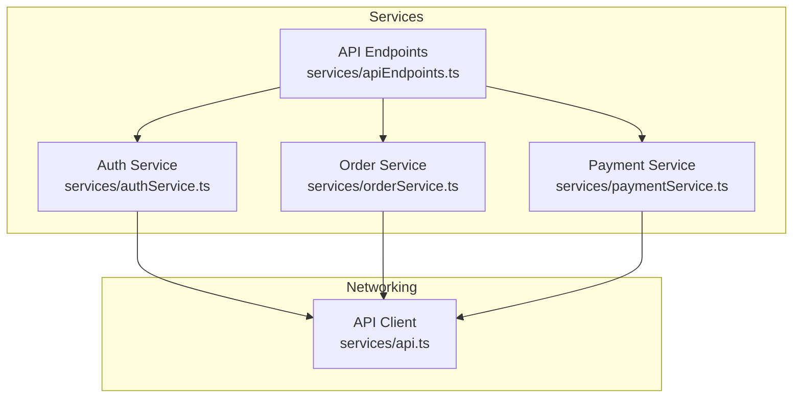
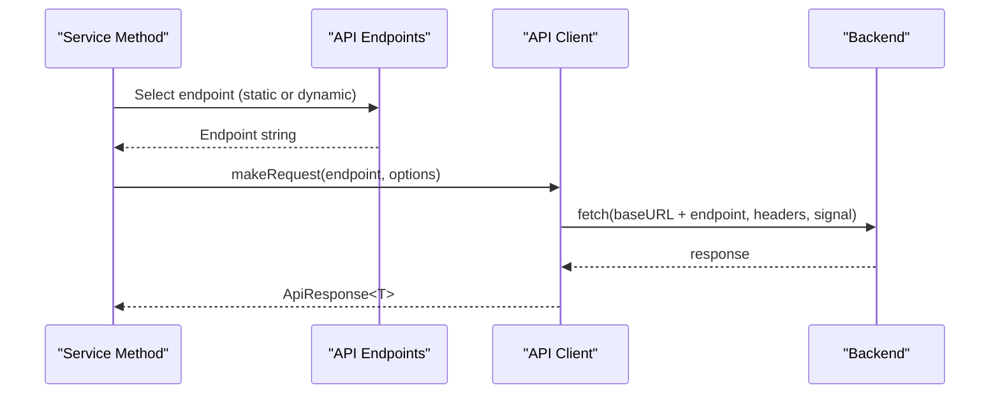
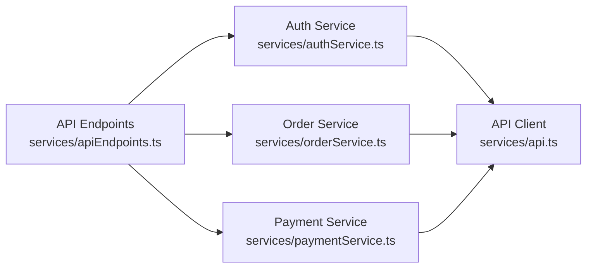

# API Endpoints Management

<cite>
**Referenced Files in This Document**
- [apiEndpoints.ts](file://services/apiEndpoints.ts)
- [api.ts](file://services/api.ts)
- [authService.ts](file://services/authService.ts)
- [orderService.ts](file://services/orderService.ts)
- [paymentService.ts](file://services/paymentService.ts)
- [types.ts](file://services/types.ts)
</cite>

## Table of Contents
1. [Introduction](#introduction)
2. [Project Structure](#project-structure)
3. [Core Components](#core-components)
4. [Architecture Overview](#architecture-overview)
5. [Detailed Component Analysis](#detailed-component-analysis)
6. [Dependency Analysis](#dependency-analysis)
7. [Performance Considerations](#performance-considerations)
8. [Troubleshooting Guide](#troubleshooting-guide)
9. [Conclusion](#conclusion)
10. [Appendices](#appendices)

## Introduction
This document explains the centralized API endpoints management implemented in the project. It focuses on the API_ENDPOINTS constant exported from services/apiEndpoints.ts, detailing how all backend endpoints are defined with strict TypeScript type safety using the as const assertion. The document organizes endpoints by domain (AUTH, USERS, PROFILE, ORDERS, PAYMENTS, ADMIN, etc.), describes dynamic endpoints using arrow functions for parameterized URLs, and documents the ApiEndpoints type export. It also demonstrates how services consume these endpoints and how the structure prevents hardcoded URLs, improves autocomplete, and reduces errors. Versioning considerations and guidelines for adding new endpoints are included.

## Project Structure
The API endpoints are defined in a single module and consumed by service modules. The API client encapsulates network requests and error handling, while services orchestrate business logic and call the endpoints.

**Diagram sources**
- [apiEndpoints.ts](file://services/apiEndpoints.ts#L1-L197)
- [api.ts](file://services/api.ts#L1-L218)
- [authService.ts](file://services/authService.ts#L1-L200)
- [orderService.ts](file://services/orderService.ts#L1-L203)
- [paymentService.ts](file://services/paymentService.ts#L1-L276)

**Section sources**
- [apiEndpoints.ts](file://services/apiEndpoints.ts#L1-L197)
- [api.ts](file://services/api.ts#L1-L218)

## Core Components
- API_ENDPOINTS: Central registry of all backend endpoints, organized by domain and grouped by HTTP method semantics. Dynamic endpoints are expressed as arrow functions accepting parameters such as IDs or references.
- ApiEndpoints type: A TypeScript type derived from API_ENDPOINTS via typeof, enabling strict autocompletion and compile-time safety across the codebase.
- API Client: Provides a unified fetch wrapper with timeouts, headers, and robust error handling. Services pass endpoint strings to the client.

Key characteristics:
- Hierarchical grouping by domain (e.g., AUTH, USERS, PROFILE, ORDERS, PAYMENTS, ADMIN).
- Static endpoints are plain strings; dynamic endpoints are functions that interpolate parameters into URL segments.
- The as const assertion ensures literal types for static endpoints and preserves function signatures for dynamic endpoints.

Examples of usage patterns:
- Static endpoints: API_ENDPOINTS.AUTH.LOGIN
- Dynamic endpoints: API_ENDPOINTS.ORDERS.BY_ID(id), API_ENDPOINTS.PAYMENTS.VERIFY(reference)

**Section sources**
- [apiEndpoints.ts](file://services/apiEndpoints.ts#L1-L197)
- [api.ts](file://services/api.ts#L1-L218)

## Architecture Overview
The endpoint registry is consumed by service methods that construct requests and pass them to the API client. The client handles base URL resolution, headers, timeouts, and error normalization.

**Diagram sources**
- [apiEndpoints.ts](file://services/apiEndpoints.ts#L1-L197)
- [api.ts](file://services/api.ts#L1-L218)
- [authService.ts](file://services/authService.ts#L380-L410)
- [orderService.ts](file://services/orderService.ts#L120-L130)
- [paymentService.ts](file://services/paymentService.ts#L115-L125)

## Detailed Component Analysis

### API_ENDPOINTS Registry
- Organization by domain:
  - AUTH: Registration, login, logout, refresh, email/OTP verification, resend OTP.
  - PASSWORD_RESET: Forgot password, verify reset code, complete reset.
  - USERS: List, by-id, update, delete.
  - PROFILE: Get/update profile; nested subdomains for addresses, payment methods, privacy settings, and password change.
  - PRODUCTS: List, create, by-id, update, delete.
  - CATEGORIES: List, create.
  - CART: Get, add, update-item, remove-item, clear.
  - ORDERS: List, create, by-id, update-status, cancel, ETA.
  - PAYMENTS: Initialize, verify by reference, history, refund.
  - ESCROW: List, by-id, release, dispute.
  - DRIVERS: List, by-id, register, update-status, update-location.
  - TRACKING: Order tracking, update location.
  - NOTIFICATIONS: List, mark-read by id, mark-all-read.
  - MESSAGES: Conversations, messages by conversation, send.
  - RATINGS: Create, by-user.
  - ADMIN: Admin users, dashboard, moderation, control center, escrow management, KYC, reports, system metrics.
  - WEBHOOKS: Paystack webhook.
  - WEBSOCKET: WebSocket endpoint.
- Dynamic endpoints:
  - USERS.BY_ID(id), USERS.UPDATE(id), USERS.DELETE(id)
  - PROFILE.ADDRESSES.UPDATE(id), PROFILE.ADDRESSES.DELETE(id)
  - PROFILE.PAYMENT_METHODS.UPDATE(id), PROFILE.PAYMENT_METHODS.DELETE(id)
  - PRODUCTS.BY_ID(id), PRODUCTS.UPDATE(id), PRODUCTS.DELETE(id)
  - CART.UPDATE(itemId), CART.REMOVE(itemId)
  - ORDERS.BY_ID(id), ORDERS.UPDATE_STATUS(id), ORDERS.CANCEL(id), ORDERS.ETA(id)
  - PAYMENTS.VERIFY(reference)
  - ESCROW.BY_ID(id), ESCROW.RELEASE(id), ESCROW.DISPUTE(id)
  - DRIVERS.BY_ID(id), DRIVERS.UPDATE_STATUS(id)
  - TRACKING.ORDER(orderId), TRACKING.UPDATE_LOCATION(orderId)
  - NOTIFICATIONS.MARK_READ(id)
  - MESSAGES.BY_CONVERSATION(conversationId)
  - RATINGS.BY_USER(userId)
  - ADMIN.MODERATION.ACTION(reportId)
  - ADMIN.ESCROW.ACTION(escrowId)
  - ADMIN.REPORTS.EXPORT(reportType)
- Type export:
  - ApiEndpoints = typeof API_ENDPOINTS
  - Enables precise autocompletion and compile-time checks across services.

Benefits:
- Prevents hardcoded URLs.
- Centralizes endpoint definitions.
- Improves developer productivity with autocompletion.
- Reduces runtime errors by enforcing correct endpoint shapes.

**Section sources**
- [apiEndpoints.ts](file://services/apiEndpoints.ts#L1-L197)

### API Client
- Responsibilities:
  - Base URL resolution from environment variables with fallback.
  - Default headers (content-type, accept, API key, authorization).
  - Unified request lifecycle: timeout handling, preflight detection, response parsing, and error normalization.
  - Helper methods for GET, POST, PUT, DELETE, plus Supabase Edge Functions helpers.
- Error handling:
  - Distinguishes aborts, network failures, HTTP status codes, and JSON parse errors.
  - Maps common HTTP statuses to user-friendly messages.
- Token propagation:
  - Adds x-firebase-uid header from the current auth token.

**Section sources**
- [api.ts](file://services/api.ts#L1-L218)

### Service Usage Patterns
- Authentication service:
  - Uses API_ENDPOINTS.AUTH.SOCIAL_LOGIN, API_ENDPOINTS.AUTH.VERIFY_OTP, API_ENDPOINTS.AUTH.RESEND_OTP, API_ENDPOINTS.PASSWORD_RESET.VERIFY_CODE, API_ENDPOINTS.PASSWORD_RESET.COMPLETE, API_ENDPOINTS.PROFILE.GET, API_ENDPOINTS.AUTH.LOGOUT.
- Orders service:
  - Uses dynamic endpoints like ORDERS.BY_ID(orderId) and static endpoints for listing and status updates.
- Payments service:
  - Uses dynamic endpoints like PAYMENTS.VERIFY(reference) and static endpoints for initialization and history.

These usages demonstrate:
- Consistent consumption of endpoints via API_ENDPOINTS.
- Passing parameters through dynamic endpoints.
- Using the API client’s typed methods to send requests.

**Section sources**
- [authService.ts](file://services/authService.ts#L380-L410)
- [authService.ts](file://services/authService.ts#L608-L622)
- [authService.ts](file://services/authService.ts#L649-L656)
- [authService.ts](file://services/authService.ts#L666-L670)
- [authService.ts](file://services/authService.ts#L706-L710)
- [orderService.ts](file://services/orderService.ts#L120-L130)
- [paymentService.ts](file://services/paymentService.ts#L115-L125)

### Type Safety and Autocomplete
- The ApiEndpoints type ensures:
  - Strictly typed access to endpoints.
  - Compile-time detection of typos or incorrect nesting.
  - Accurate parameter inference for dynamic endpoints (e.g., BY_ID expects a string).
- Consumers can import the type to annotate variables or function parameters that accept endpoints.

**Section sources**
- [apiEndpoints.ts](file://services/apiEndpoints.ts#L191-L197)
- [types.ts](file://services/types.ts#L1-L228)

### Versioning Considerations
- Current endpoint definitions do not include explicit version segments in the URL strings.
- If versioning is introduced, the recommended approach is to prefix endpoint paths with a version segment (e.g., "/v1") at the domain level. For example:
  - AUTH.LOGIN could become "/v1/api/auth/login".
  - ORDERS.BY_ID(id) could become "/v1/api/orders/:id".
- This maintains backward compatibility by keeping the API_ENDPOINTS structure intact while updating the underlying URL strings.

[No sources needed since this section provides general guidance]

### Adding New Endpoints
Follow these steps to add a new endpoint:
1. Choose or create a domain group in API_ENDPOINTS (e.g., NEW_FEATURE or extend an existing domain).
2. Add a static endpoint as a string or a dynamic endpoint as an arrow function accepting parameters.
3. Export the ApiEndpoints type if consumers need to reference the endpoint shape.
4. Import API_ENDPOINTS in the relevant service and use it in the service method.
5. Ensure the service passes the constructed endpoint string to the API client’s get/post/put/delete methods.
6. If versioning is required, update the URL strings to include the version segment.

**Section sources**
- [apiEndpoints.ts](file://services/apiEndpoints.ts#L1-L197)
- [api.ts](file://services/api.ts#L1-L218)

## Dependency Analysis
The following diagram shows how services depend on the endpoint registry and the API client.

**Diagram sources**
- [apiEndpoints.ts](file://services/apiEndpoints.ts#L1-L197)
- [api.ts](file://services/api.ts#L1-L218)
- [authService.ts](file://services/authService.ts#L1-L200)
- [orderService.ts](file://services/orderService.ts#L1-L203)
- [paymentService.ts](file://services/paymentService.ts#L1-L276)

**Section sources**
- [apiEndpoints.ts](file://services/apiEndpoints.ts#L1-L197)
- [api.ts](file://services/api.ts#L1-L218)
- [authService.ts](file://services/authService.ts#L1-L200)
- [orderService.ts](file://services/orderService.ts#L1-L203)
- [paymentService.ts](file://services/paymentService.ts#L1-L276)

## Performance Considerations
- Centralized endpoint definitions reduce duplication and potential maintenance overhead.
- Using dynamic endpoints avoids string concatenation errors and improves readability.
- The API client enforces timeouts and normalized error handling, preventing unhandled exceptions from cascading.

[No sources needed since this section provides general guidance]

## Troubleshooting Guide
Common issues and resolutions:
- Incorrect endpoint usage:
  - Symptom: Runtime errors or 404 responses.
  - Resolution: Verify the endpoint path exists under the intended domain and that dynamic endpoints receive the correct parameter types.
- Parameter mismatch:
  - Symptom: Unexpected URL segments or wrong resource access.
  - Resolution: Ensure dynamic endpoints are invoked with the correct parameter names and types (e.g., BY_ID expects a string).
- Missing authentication:
  - Symptom: 401 responses.
  - Resolution: Ensure the API client receives the current auth token via headers.
- Network or timeout errors:
  - Symptom: Requests fail with timeout or network errors.
  - Resolution: Check the API client’s timeout configuration and network connectivity.

**Section sources**
- [api.ts](file://services/api.ts#L1-L218)
- [authService.ts](file://services/authService.ts#L660-L679)

## Conclusion
The API_ENDPOINTS registry centralizes endpoint definitions with strong TypeScript guarantees, enabling safer, more maintainable service code. Dynamic endpoints simplify parameterized URLs, while the ApiEndpoints type ensures autocompletion and compile-time correctness. The API client provides a consistent request pipeline with robust error handling. Following the outlined patterns and versioning guidance will keep the endpoint management scalable and reliable.

[No sources needed since this section summarizes without analyzing specific files]

## Appendices

### Endpoint Catalog (Selected)
- AUTH: LOGIN, REGISTER, SOCIAL_LOGIN, LOGOUT, REFRESH, VERIFY_EMAIL, VERIFY_OTP, RESEND_OTP
- PASSWORD_RESET: REQUEST, VERIFY_CODE, COMPLETE
- USERS: LIST, BY_ID(id), UPDATE(id), DELETE(id)
- PROFILE: GET, UPDATE, ADDRESSES.LIST, ADDRESSES.CREATE, ADDRESSES.UPDATE(id), ADDRESSES.DELETE(id), PAYMENT_METHODS.LIST, PAYMENT_METHODS.CREATE, PAYMENT_METHODS.UPDATE(id), PAYMENT_METHODS.DELETE(id), PRIVACY_SETTINGS.GET, PRIVACY_SETTINGS.UPDATE, CHANGE_PASSWORD
- PRODUCTS: LIST, CREATE, BY_ID(id), UPDATE(id), DELETE(id)
- CATEGORIES: LIST, CREATE
- CART: GET, ADD, UPDATE(itemId), REMOVE(itemId), CLEAR
- ORDERS: LIST, CREATE, BY_ID(id), UPDATE_STATUS(id), CANCEL(id), ETA(id)
- PAYMENTS: INITIALIZE, VERIFY(reference), HISTORY, REFUND
- ESCROW: LIST, BY_ID(id), RELEASE(id), DISPUTE(id)
- DRIVERS: LIST, BY_ID(id), REGISTER, UPDATE_STATUS(id), UPDATE_LOCATION
- TRACKING: ORDER(orderId), UPDATE_LOCATION(orderId)
- NOTIFICATIONS: LIST, MARK_READ(id), MARK_ALL_READ
- MESSAGES: CONVERSATIONS, BY_CONVERSATION(conversationId), SEND
- RATINGS: CREATE, BY_USER(userId)
- ADMIN: USERS.LIST, USERS.CREATE, DASHBOARD.OVERVIEW, DASHBOARD.ALERTS, MODERATION.LIST, MODERATION.ACTION(reportId), CONTROL_CENTER.DASHBOARD, CONTROL_CENTER.ACTION, ESCROW.LIST, ESCROW.ACTION(escrowId), KYC.LIST, REPORTS.FINANCIAL, REPORTS.USER_GROWTH, REPORTS.PERFORMANCE, REPORTS.EXPORT(reportType), SYSTEM_METRICS.OVERVIEW, SYSTEM_METRICS.HEALTH
- WEBHOOKS: PAYSTACK
- WEBSOCKET: WS

**Section sources**
- [apiEndpoints.ts](file://services/apiEndpoints.ts#L1-L197)