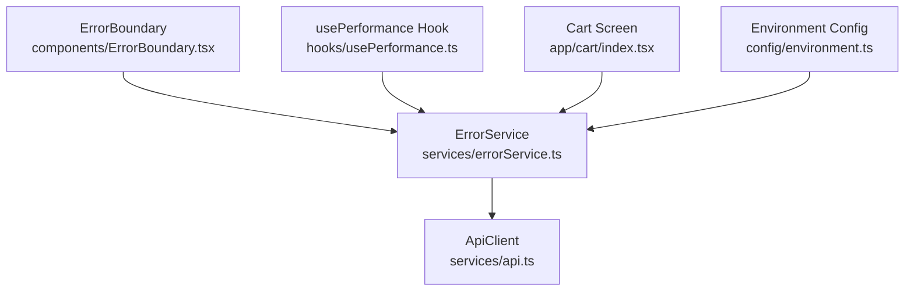
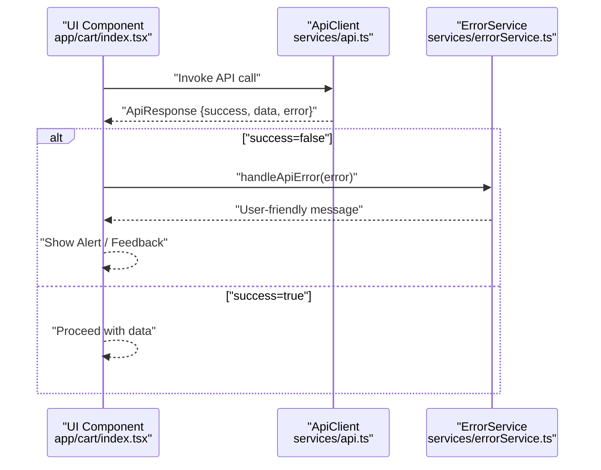
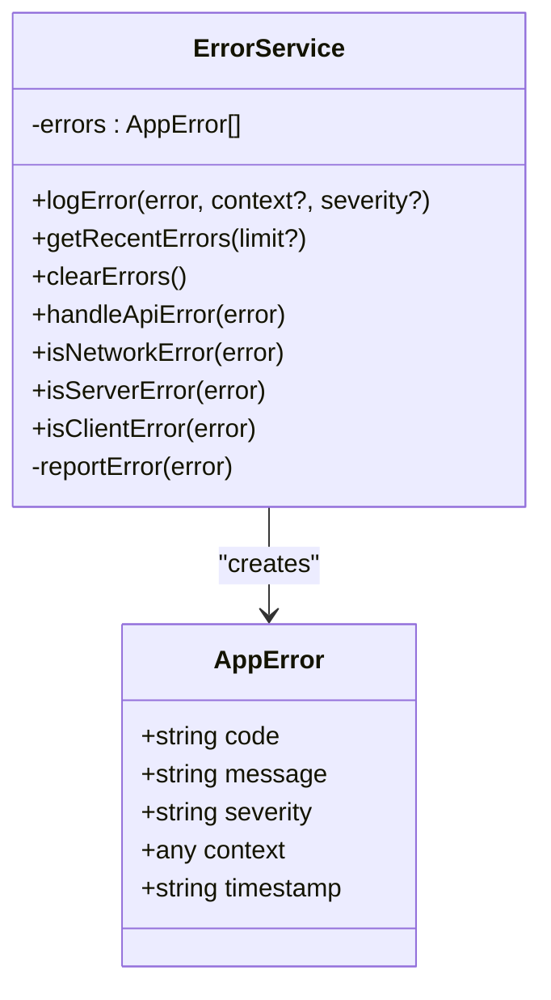
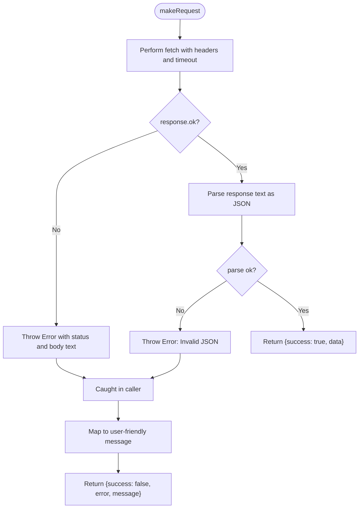
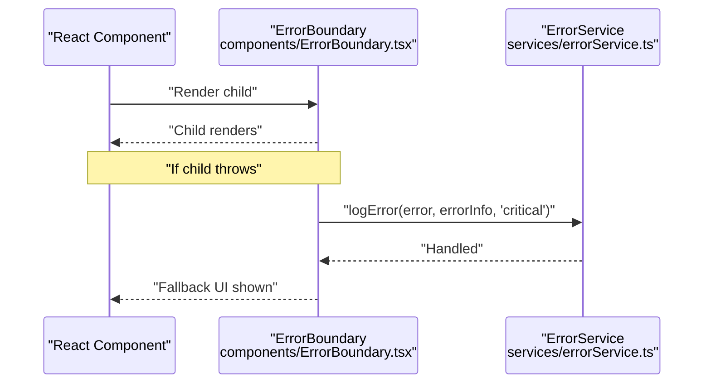
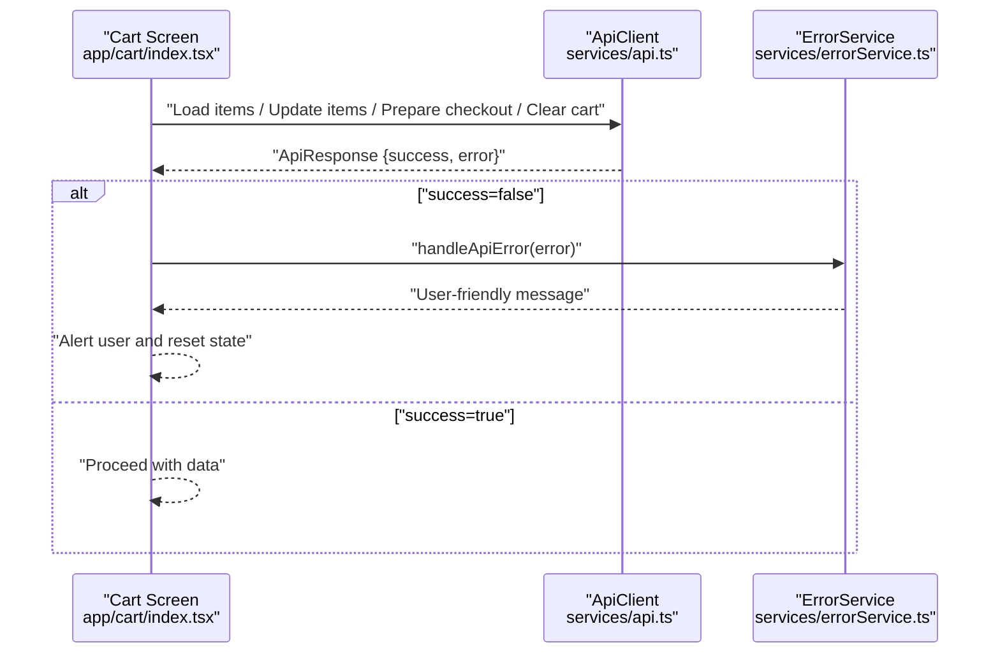
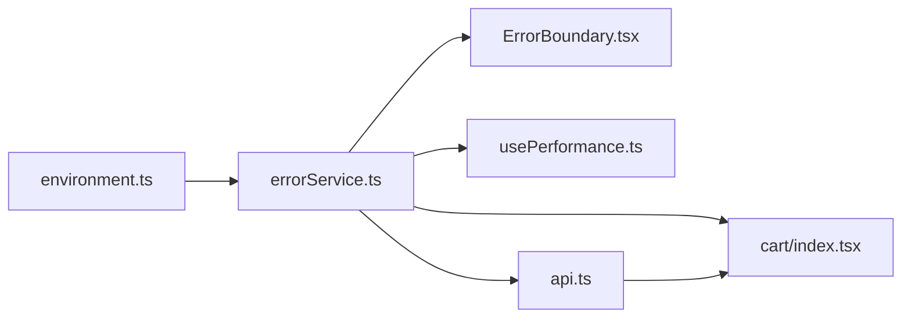

# Error Handling Strategy

<cite>
**Referenced Files in This Document**
- [errorService.ts](file://services/errorService.ts)
- [api.ts](file://services/api.ts)
- [ErrorBoundary.tsx](file://components/ErrorBoundary.tsx)
- [usePerformance.ts](file://hooks/usePerformance.ts)
- [cart/index.tsx](file://app/cart/index.tsx)
- [environment.ts](file://config/environment.ts)
</cite>

## Table of Contents
1. [Introduction](#introduction)
2. [Project Structure](#project-structure)
3. [Core Components](#core-components)
4. [Architecture Overview](#architecture-overview)
5. [Detailed Component Analysis](#detailed-component-analysis)
6. [Dependency Analysis](#dependency-analysis)
7. [Performance Considerations](#performance-considerations)
8. [Troubleshooting Guide](#troubleshooting-guide)
9. [Conclusion](#conclusion)

## Introduction
This document explains the error handling strategy centered around the ErrorService class and its integration with the API client. It details how errors are standardized through the AppError interface, how the logError method prevents console spam while reporting in production, and how handleApiError categorizes network, server, and client errors with user-friendly messages. It also covers how ErrorService integrates with apiClient’s error handling to provide consistent user feedback, demonstrates examples of error tracking in UI components, and outlines best practices for error context inclusion and severity classification.

## Project Structure
The error handling strategy spans several modules:
- services/errorService.ts defines the centralized ErrorService with standardized error representation and categorization utilities.
- services/api.ts encapsulates HTTP requests and transforms low-level failures into user-friendly responses.
- components/ErrorBoundary.tsx integrates ErrorService to capture unhandled runtime errors and log them with critical severity.
- hooks/usePerformance.ts uses ErrorService to log performance-related anomalies.
- app/cart/index.tsx demonstrates handleApiError usage for user-facing error messages during cart operations.
- config/environment.ts exposes environment flags used to conditionally enable production reporting.

**Diagram sources**
- [errorService.ts](file://services/errorService.ts#L1-L95)
- [api.ts](file://services/api.ts#L1-L218)
- [ErrorBoundary.tsx](file://components/ErrorBoundary.tsx#L1-L48)
- [usePerformance.ts](file://hooks/usePerformance.ts#L1-L52)
- [cart/index.tsx](file://app/cart/index.tsx#L65-L184)
- [environment.ts](file://config/environment.ts#L1-L52)

**Section sources**
- [errorService.ts](file://services/errorService.ts#L1-L95)
- [api.ts](file://services/api.ts#L1-L218)
- [ErrorBoundary.tsx](file://components/ErrorBoundary.tsx#L1-L48)
- [usePerformance.ts](file://hooks/usePerformance.ts#L1-L52)
- [cart/index.tsx](file://app/cart/index.tsx#L65-L184)
- [environment.ts](file://config/environment.ts#L1-L52)

## Core Components
- AppError interface: Defines the standardized error shape with code, message, severity, optional context, and timestamp.
- ErrorService: Centralized logging and categorization utility with methods to log application-level exceptions, deduplicate recent logs, and produce user-friendly messages for API errors.
- ApiClient: Encapsulates HTTP requests and returns structured ApiResponse objects, converting low-level failures into user-friendly messages and error metadata.

Key responsibilities:
- Standardize error representation and severity classification.
- Deduplicate console logs to avoid spam while preserving production reporting.
- Categorize API errors into network, server, and client classes for targeted handling.
- Integrate with UI boundaries to capture unhandled exceptions and surface user-friendly messages.

**Section sources**
- [errorService.ts](file://services/errorService.ts#L1-L95)
- [api.ts](file://services/api.ts#L1-L218)

## Architecture Overview
The error handling pipeline connects UI components, the API client, and the ErrorService:

**Diagram sources**
- [cart/index.tsx](file://app/cart/index.tsx#L65-L184)
- [api.ts](file://services/api.ts#L147-L151)
- [errorService.ts](file://services/errorService.ts#L69-L80)

## Detailed Component Analysis

### ErrorService: Standardized Error Representation and Categorization
- AppError interface fields:
  - code: Unique identifier for the error category.
  - message: Human-readable description.
  - severity: Enumerated level for triage.
  - context: Optional structured metadata (e.g., endpoint).
  - timestamp: ISO string for event ordering.
- logError:
  - Builds an AppError object from a thrown Error.
  - Deduplicates recent entries by checking the last five errors for matching code, message, and context.endpoint.
  - Logs to console only when unique.
  - Reports to an external error tracking service in production.
- handleApiError:
  - Categorizes axios-style errors:
    - Server error: returns server-provided message or a default message.
    - Network error: returns a user-friendly network message.
    - Other: returns the underlying message or a default message.
- Utility methods:
  - isNetworkError: detects network failures when there is no response but a request object.
  - isServerError: detects server-side failures (status >= 500).
  - isClientError: detects client-side failures (status >= 400 and < 500).

**Diagram sources**
- [errorService.ts](file://services/errorService.ts#L1-L95)

**Section sources**
- [errorService.ts](file://services/errorService.ts#L1-L95)

### ApiClient: HTTP Layer and User-Friendly Messages
- Converts low-level failures into a consistent ApiResponse shape.
- On HTTP errors:
  - Throws a descriptive Error with status and body text.
  - Logs error metadata including endpoint and error details.
- On JSON parse errors:
  - Throws a descriptive Error indicating invalid JSON.
- On timeouts and network failures:
  - Produces user-friendly messages tailored to AbortError and network failures.
- Returns ApiResponse with success flag and user-friendly error message.

**Diagram sources**
- [api.ts](file://services/api.ts#L43-L151)

**Section sources**
- [api.ts](file://services/api.ts#L1-L218)

### UI Integration: ErrorBoundary and Performance Hook
- ErrorBoundary:
  - Captures unhandled runtime errors and logs them with critical severity using ErrorService.
- usePerformance:
  - Detects slow renders and long-lived components and logs them with medium and low severity respectively, including timing and render counts in context.

**Diagram sources**
- [ErrorBoundary.tsx](file://components/ErrorBoundary.tsx#L1-L48)
- [errorService.ts](file://services/errorService.ts#L23-L49)

**Section sources**
- [ErrorBoundary.tsx](file://components/ErrorBoundary.tsx#L1-L48)
- [usePerformance.ts](file://hooks/usePerformance.ts#L1-L52)

### Example: Cart Screen Error Handling
- The cart screen uses handleApiError to present user-friendly messages for operations like loading items, updating items, preparing checkout, and clearing the cart.
- It logs underlying errors and clears state appropriately when operations fail.

**Diagram sources**
- [cart/index.tsx](file://app/cart/index.tsx#L65-L184)
- [api.ts](file://services/api.ts#L147-L151)
- [errorService.ts](file://services/errorService.ts#L69-L80)

**Section sources**
- [cart/index.tsx](file://app/cart/index.tsx#L65-L184)

## Dependency Analysis
- ErrorService depends on:
  - Environment configuration for NODE_ENV checks to decide production reporting.
  - UI boundaries (ErrorBoundary) to capture unhandled exceptions.
  - Hooks (usePerformance) to log performance anomalies.
  - API client to categorize and translate API errors into user-friendly messages.
- ApiClient depends on:
  - Environment configuration for base URL and timeouts.
  - ErrorService indirectly via UI components that call handleApiError.

**Diagram sources**
- [environment.ts](file://config/environment.ts#L1-L52)
- [errorService.ts](file://services/errorService.ts#L1-L95)
- [ErrorBoundary.tsx](file://components/ErrorBoundary.tsx#L1-L48)
- [usePerformance.ts](file://hooks/usePerformance.ts#L1-L52)
- [cart/index.tsx](file://app/cart/index.tsx#L65-L184)
- [api.ts](file://services/api.ts#L1-L218)

**Section sources**
- [environment.ts](file://config/environment.ts#L1-L52)
- [errorService.ts](file://services/errorService.ts#L1-L95)
- [api.ts](file://services/api.ts#L1-L218)

## Performance Considerations
- Console deduplication reduces noise by limiting repeated logs to a rolling window of recent errors.
- Production reporting is gated by NODE_ENV, preventing unnecessary overhead in development.
- API client timeouts and user-friendly messages improve perceived reliability and reduce retries under transient conditions.

[No sources needed since this section provides general guidance]

## Troubleshooting Guide
Common scenarios and resolutions:
- Network errors:
  - Use isNetworkError to detect and show connectivity prompts.
  - Consider retry logic with exponential backoff for transient network issues.
- Server errors:
  - Use isServerError to trigger user-friendly messages and notify administrators.
  - Log with high severity to ensure visibility in production reports.
- Client errors:
  - Use isClientError to differentiate invalid requests and surface actionable messages.
- Unexpected errors:
  - Use handleApiError to present friendly messages while preserving developer visibility via logs.

Best practices:
- Include context in logError calls to identify endpoints and component names.
- Choose severity based on impact: critical for unrecoverable UI crashes, high for major functional failures, medium for noticeable but recoverable issues, low for minor performance anomalies.
- Avoid logging sensitive data; keep context minimal and safe.

**Section sources**
- [errorService.ts](file://services/errorService.ts#L23-L49)
- [errorService.ts](file://services/errorService.ts#L69-L92)
- [api.ts](file://services/api.ts#L115-L151)

## Conclusion
The ErrorService and ApiClient together provide a robust, standardized error handling strategy. They transform low-level failures into user-friendly outcomes, preserve actionable context for developers, and integrate seamlessly with UI boundaries and performance monitoring. By following the outlined patterns—standardizing error shapes, categorizing failures, and enriching logs with context—you can deliver consistent, reliable user experiences while maintaining strong observability in production.