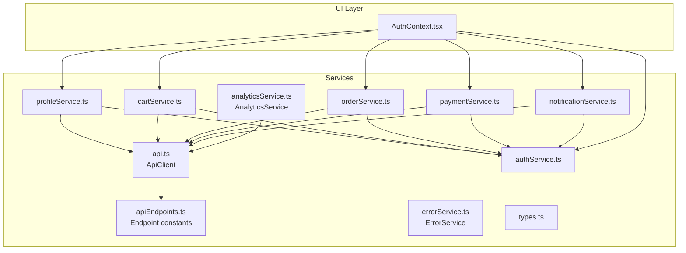
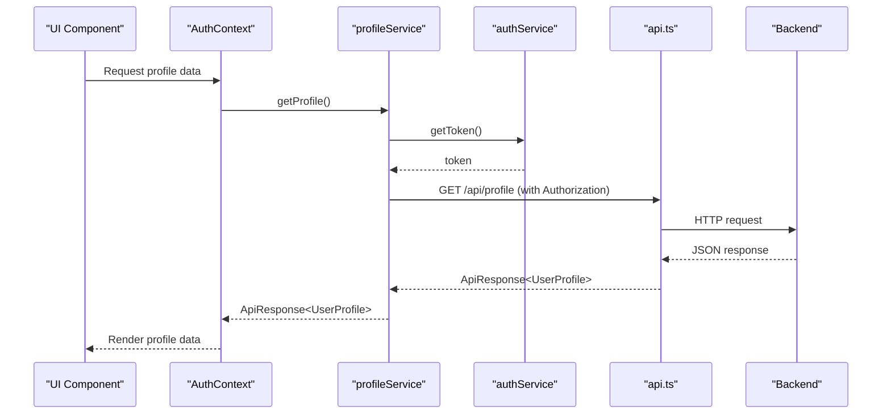
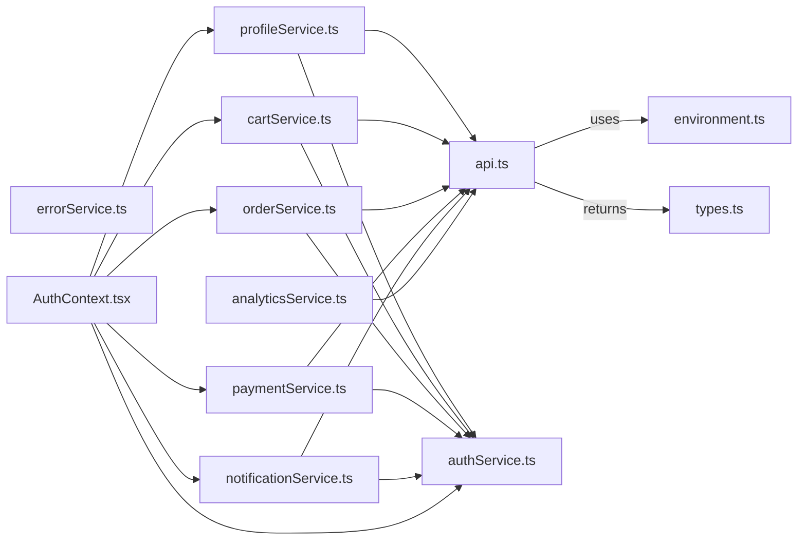

# Service Layer Architecture

<cite>
**Referenced Files in This Document**
- [api.ts](file://services/api.ts)
- [apiEndpoints.ts](file://services/apiEndpoints.ts)
- [errorService.ts](file://services/errorService.ts)
- [analyticsService.ts](file://services/analyticsService.ts)
- [profileService.ts](file://services/profileService.ts)
- [authService.ts](file://services/authService.ts)
- [cartService.ts](file://services/cartService.ts)
- [orderService.ts](file://services/orderService.ts)
- [paymentService.ts](file://services/paymentService.ts)
- [notificationService.ts](file://services/notificationService.ts)
- [types.ts](file://services/types.ts)
- [AuthContext.tsx](file://contexts/AuthContext.tsx)
</cite>

## Table of Contents
1. [Introduction](#introduction)
2. [Project Structure](#project-structure)
3. [Core Components](#core-components)
4. [Architecture Overview](#architecture-overview)
5. [Detailed Component Analysis](#detailed-component-analysis)
6. [Dependency Analysis](#dependency-analysis)
7. [Performance Considerations](#performance-considerations)
8. [Troubleshooting Guide](#troubleshooting-guide)
9. [Conclusion](#conclusion)

## Introduction
This document explains the service layer pattern in Brillprime-expo. It focuses on how business logic is separated from UI components through dedicated service classes that encapsulate API calls, data transformation, and error handling. The centralized API client configuration in api.ts and endpoint definitions in apiEndpoints.ts are described, along with standardized error handling via errorService.ts and user interaction tracking via analyticsService.ts. The structure of service methods is documented, including request/response types, retry mechanisms, and loading states. Examples of service composition, such as profileService.ts coordinating calls to multiple endpoints, are included. Cross-cutting concerns like authentication headers, request logging, and performance monitoring are addressed, as well as the relationship between services and React Query for data fetching and caching.

## Project Structure
The service layer is organized under the services directory and integrates with React components via contexts and hooks. The API client and endpoints are centralized, while individual services encapsulate domain-specific logic and orchestrate multiple backend calls.



**Diagram sources**
- [api.ts](file://services/api.ts#L1-L220)
- [apiEndpoints.ts](file://services/apiEndpoints.ts#L1-L197)
- [errorService.ts](file://services/errorService.ts#L1-L95)
- [analyticsService.ts](file://services/analyticsService.ts#L1-L130)
- [profileService.ts](file://services/profileService.ts#L1-L251)
- [authService.ts](file://services/authService.ts#L1-L200)
- [cartService.ts](file://services/cartService.ts#L1-L284)
- [orderService.ts](file://services/orderService.ts#L1-L203)
- [paymentService.ts](file://services/paymentService.ts#L1-L276)
- [notificationService.ts](file://services/notificationService.ts#L1-L681)
- [types.ts](file://services/types.ts#L1-L228)
- [AuthContext.tsx](file://contexts/AuthContext.tsx#L1-L149)

**Section sources**
- [api.ts](file://services/api.ts#L1-L220)
- [apiEndpoints.ts](file://services/apiEndpoints.ts#L1-L197)
- [AuthContext.tsx](file://contexts/AuthContext.tsx#L1-L149)

## Core Components
- Centralized API client: Provides a unified fetch wrapper with timeouts, CORS, credentials, and default headers. It exposes typed methods for GET, POST, PUT, DELETE, and helpers for Supabase Edge Functions. It returns a consistent ApiResponse<T> shape and handles parsing, timeouts, and user-friendly error mapping.
- Endpoint catalog: A single source of truth for all backend endpoints, including dynamic routes and nested resources. This enables type-safe usage across services.
- Error service: Centralized logging and classification of errors, with production reporting hooks and helpers to distinguish network vs server/client errors.
- Analytics service: Queues and flushes analytics events to the backend, tracks user actions, navigation, purchases, and API calls, and persists the queue to storage.
- Domain services: Each service encapsulates a domain (profile, cart, orders, payments, notifications) with typed requests/responses, authentication header injection, and data transformations.

**Section sources**
- [api.ts](file://services/api.ts#L1-L220)
- [apiEndpoints.ts](file://services/apiEndpoints.ts#L1-L197)
- [errorService.ts](file://services/errorService.ts#L1-L95)
- [analyticsService.ts](file://services/analyticsService.ts#L1-L130)
- [types.ts](file://services/types.ts#L1-L228)

## Architecture Overview
The service layer enforces separation of concerns:
- UI components depend on services, not on raw fetch calls.
- Services depend on the API client and shared types.
- Services coordinate multiple endpoints and transform data for UI consumption.
- Cross-cutting concerns (auth headers, logging, analytics) are injected by services.



**Diagram sources**
- [profileService.ts](file://services/profileService.ts#L1-L120)
- [authService.ts](file://services/authService.ts#L659-L720)
- [api.ts](file://services/api.ts#L157-L205)

## Detailed Component Analysis

### API Client (ApiClient)
- Responsibilities:
  - Centralizes HTTP configuration (base URL, headers, credentials, CORS).
  - Implements timeouts via AbortController and logs request/response durations.
  - Normalizes responses to a consistent ApiResponse<T> structure.
  - Maps low-level errors to user-friendly messages and categorizes them.
  - Provides helpers for Supabase Edge Functions.
- Key behaviors:
  - Default headers include content type, accept, API key, and Firebase UID propagation.
  - Preflight handling for OPTIONS requests.
  - JSON parsing with robust error handling.
  - Timeout and network error detection with user-friendly messages.

**Section sources**
- [api.ts](file://services/api.ts#L1-L220)

### Endpoint Catalog (API_ENDPOINTS)
- Responsibilities:
  - Defines all backend endpoints as constants with type-safe dynamic routes.
  - Supports nested resources and query parameters via helper functions.
- Benefits:
  - Eliminates magic strings and reduces endpoint drift.
  - Enables IDE autocomplete and refactoring safety.

**Section sources**
- [apiEndpoints.ts](file://services/apiEndpoints.ts#L1-L197)

### Error Service (ErrorService)
- Responsibilities:
  - Logs structured errors with severity and context.
  - Deduplicates recent errors to reduce console noise.
  - Reports errors to external services in production.
  - Provides helpers to classify network/server/client errors.
- Usage:
  - Services can delegate error reporting to this singleton.

**Section sources**
- [errorService.ts](file://services/errorService.ts#L1-L95)

### Analytics Service (AnalyticsService)
- Responsibilities:
  - Queues analytics events and flushes to backend periodically and on demand.
  - Tracks user actions, navigation, purchases, API calls, and errors.
  - Persists queue to storage for reliability.
  - Initializes periodic flush intervals.
- Integration:
  - Uses apiClient.post to send queued events to /api/analytics/events.

**Section sources**
- [analyticsService.ts](file://services/analyticsService.ts#L1-L130)

### Profile Service (ProfileService)
- Responsibilities:
  - Encapsulates profile-related operations: get/update profile, change password, manage addresses, manage payment methods, and privacy settings.
  - Injects Authorization headers using tokens from authService.
  - Returns typed ApiResponse<T> responses.
- Composition example:
  - Coordinates multiple endpoints under /api/profile/* and delegates token acquisition to authService.

```mermaid
classDiagram
class ProfileService {
+getProfile() ApiResponse~UserProfile~
+updateProfile(data) ApiResponse~UserProfile~
+changePassword(data) ApiResponse~{message}~
+getAddresses() ApiResponse~Address[]~
+addAddress(data) ApiResponse~Address~
+updateAddress(id, data) ApiResponse~Address~
+deleteAddress(id) ApiResponse~{message}~
+getPaymentMethods() ApiResponse~PaymentMethod[]~
+addPaymentMethod(data) ApiResponse~PaymentMethod~
+updatePaymentMethod(id, data) ApiResponse~PaymentMethod~
+deletePaymentMethod(id) ApiResponse~{message}~
+getPrivacySettings() ApiResponse~PrivacySettings~
+updatePrivacySettings(data) ApiResponse~PrivacySettings~
}
class AuthService {
+getToken() string
}
class ApiClient {
+get(path, headers) ApiResponse
+post(path, data, headers) ApiResponse
+put(path, data, headers) ApiResponse
+delete(path, headers) ApiResponse
}
ProfileService --> AuthService : "uses"
ProfileService --> ApiClient : "uses"
```

**Diagram sources**
- [profileService.ts](file://services/profileService.ts#L1-L251)
- [authService.ts](file://services/authService.ts#L777-L800)
- [api.ts](file://services/api.ts#L157-L205)

**Section sources**
- [profileService.ts](file://services/profileService.ts#L1-L251)
- [authService.ts](file://services/authService.ts#L659-L720)
- [api.ts](file://services/api.ts#L157-L205)

### Cart Service (CartService)
- Responsibilities:
  - Manages cart lifecycle with backend synchronization and local storage fallback.
  - Uses Supabase Edge Functions for cart operations.
  - Maintains offline-first behavior with local storage and syncs when online.
- Patterns:
  - Token refresh via Firebase with AsyncStorage updates.
  - Local storage as primary source of truth with backend sync attempts.

**Section sources**
- [cartService.ts](file://services/cartService.ts#L1-L284)

### Order Service (OrderService)
- Responsibilities:
  - Validates order data and orchestrates order creation via Supabase Edge Function.
  - Retrieves user orders with filtering and paginated responses.
  - Updates order status, cancels orders, and tracks order progress.
- Integration:
  - Uses authService.getToken() to inject Authorization headers.

**Section sources**
- [orderService.ts](file://services/orderService.ts#L1-L203)
- [authService.ts](file://services/authService.ts#L777-L800)

### Payment Service (PaymentService)
- Responsibilities:
  - Initializes payment intents, processes payments, retrieves payment history, and manages payment methods via profile endpoints.
  - Validates payment data and enforces limits.
- Integration:
  - Uses authService.getToken() for Authorization headers.

**Section sources**
- [paymentService.ts](file://services/paymentService.ts#L1-L276)
- [authService.ts](file://services/authService.ts#L777-L800)

### Notification Service (NotificationService)
- Responsibilities:
  - Fetches notifications, marks as read, deletes, and manages preferences.
  - Registers push tokens, initializes push notifications, and schedules notifications.
  - Implements retry logic and network connectivity checks for robustness.
  - Subscribes to real-time notifications via Supabase.
- Robustness:
  - withRetry helper with exponential backoff.
  - checkNetworkConnectivity fallback using fetch HEAD.

**Section sources**
- [notificationService.ts](file://services/notificationService.ts#L1-L681)

### Types and Contracts
- Shared types define request/response shapes for consistent service APIs.
- ApiResponse<T> standardizes success/error fields across services.

**Section sources**
- [types.ts](file://services/types.ts#L1-L228)

## Dependency Analysis
- Cohesion:
  - Each service encapsulates a cohesive domain (profile, cart, orders, payments, notifications).
- Coupling:
  - Services depend on api.ts and authService for HTTP and authentication.
  - api.ts depends on environment configuration and uses default headers.
- Cross-cutting:
  - errorService and analyticsService are consumed by services for error reporting and telemetry.
- Context integration:
  - AuthContext orchestrates authentication state and triggers service calls for profile and user refresh.



**Diagram sources**
- [api.ts](file://services/api.ts#L1-L220)
- [profileService.ts](file://services/profileService.ts#L1-L251)
- [authService.ts](file://services/authService.ts#L1-L200)
- [cartService.ts](file://services/cartService.ts#L1-L284)
- [orderService.ts](file://services/orderService.ts#L1-L203)
- [paymentService.ts](file://services/paymentService.ts#L1-L276)
- [notificationService.ts](file://services/notificationService.ts#L1-L681)
- [analyticsService.ts](file://services/analyticsService.ts#L1-L130)
- [errorService.ts](file://services/errorService.ts#L1-L95)
- [types.ts](file://services/types.ts#L1-L228)
- [AuthContext.tsx](file://contexts/AuthContext.tsx#L1-L149)

**Section sources**
- [api.ts](file://services/api.ts#L1-L220)
- [profileService.ts](file://services/profileService.ts#L1-L251)
- [authService.ts](file://services/authService.ts#L1-L200)
- [cartService.ts](file://services/cartService.ts#L1-L284)
- [orderService.ts](file://services/orderService.ts#L1-L203)
- [paymentService.ts](file://services/paymentService.ts#L1-L276)
- [notificationService.ts](file://services/notificationService.ts#L1-L681)
- [analyticsService.ts](file://services/analyticsService.ts#L1-L130)
- [errorService.ts](file://services/errorService.ts#L1-L95)
- [types.ts](file://services/types.ts#L1-L228)
- [AuthContext.tsx](file://contexts/AuthContext.tsx#L1-L149)

## Performance Considerations
- Request timeouts: api.ts sets a 30-second timeout and aborts slow requests, preventing UI hangs.
- Logging and telemetry: api.ts logs request/response timing; analyticsService tracks API_CALL events with endpoint, method, status, and duration.
- Offline-first: cartService persists to AsyncStorage and syncs when online, reducing network dependency.
- Retry strategies: notificationService implements exponential backoff with withRetry and network checks.
- Caching and React Query: While the codebase includes generated Data Connect React hooks, services remain the primary abstraction for domain logic. UI components can leverage React Query’s useQuery/useMutation hooks to fetch and mutate data, while services continue to encapsulate business logic and normalize responses.

[No sources needed since this section provides general guidance]

## Troubleshooting Guide
- Authentication failures:
  - Services check for tokens via authService.getToken(); if missing, they return an authentication-required error. Ensure AuthContext is hydrated and tokens are stored.
- Network errors:
  - api.ts maps network failures to user-friendly messages. notificationService’s checkNetworkConnectivity and withRetry help mitigate transient failures.
- Timeout errors:
  - api.ts converts AbortError into a user-friendly timeout message. Consider retrying operations with exponential backoff.
- Error logging:
  - errorService logs structured errors and deduplicates recent duplicates. Use it to centralize error reporting and classification.
- Analytics persistence:
  - analyticsService persists the event queue to storage and flushes periodically. If events fail to send, they remain queued for later retry.

**Section sources**
- [api.ts](file://services/api.ts#L116-L155)
- [notificationService.ts](file://services/notificationService.ts#L279-L414)
- [errorService.ts](file://services/errorService.ts#L1-L95)
- [analyticsService.ts](file://services/analyticsService.ts#L1-L130)
- [authService.ts](file://services/authService.ts#L777-L800)

## Conclusion
The service layer in Brillprime-expo cleanly separates business logic from UI components. A centralized API client and endpoint catalog ensure consistent HTTP behavior and type safety. Services encapsulate domain logic, inject authentication headers, and return standardized responses. Cross-cutting concerns like error handling and analytics are centralized for consistency. The architecture supports offline-first patterns, robust retry strategies, and observability through analytics and logging. While React Query is present in the codebase, services remain the primary abstraction for domain operations, enabling predictable data fetching and caching strategies.