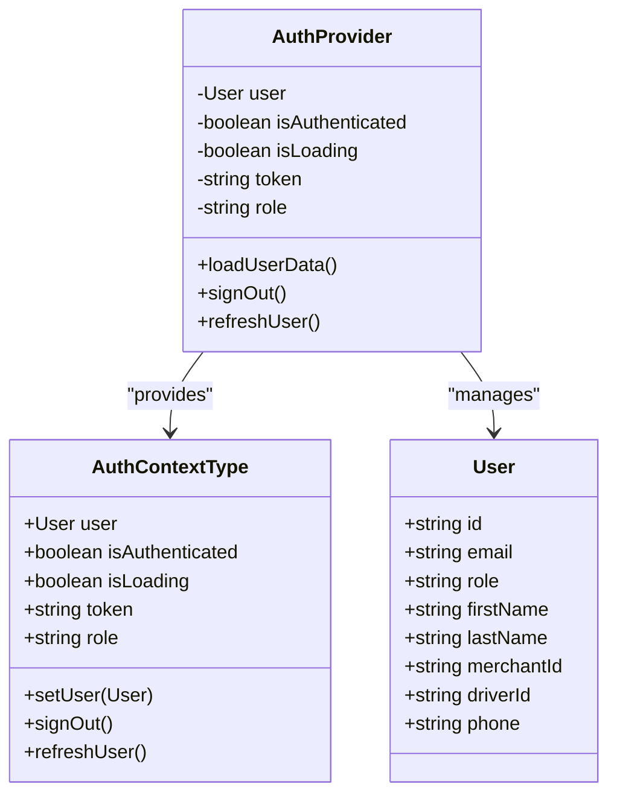
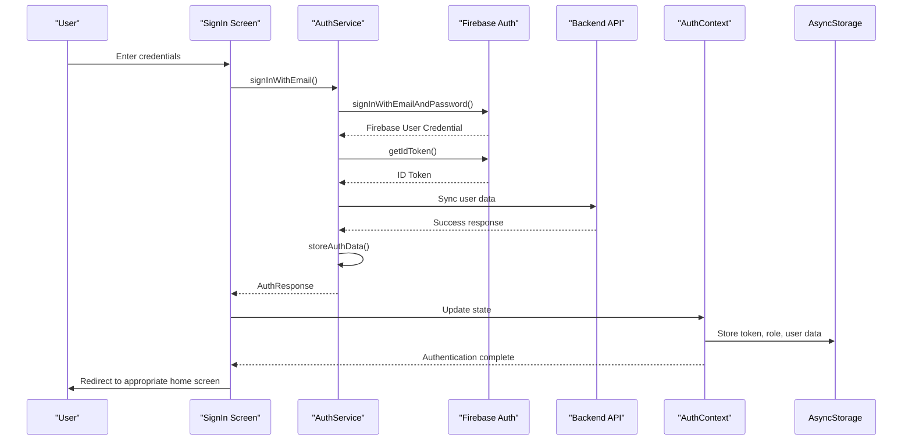
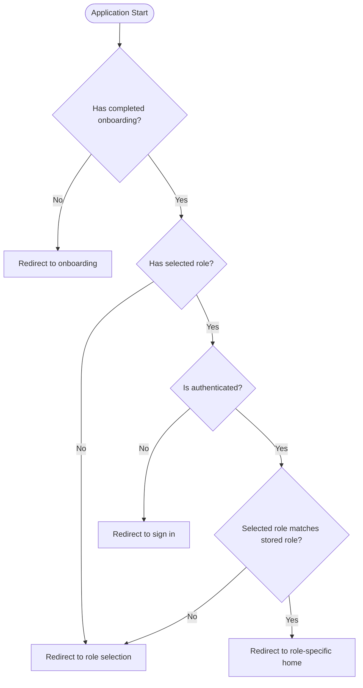
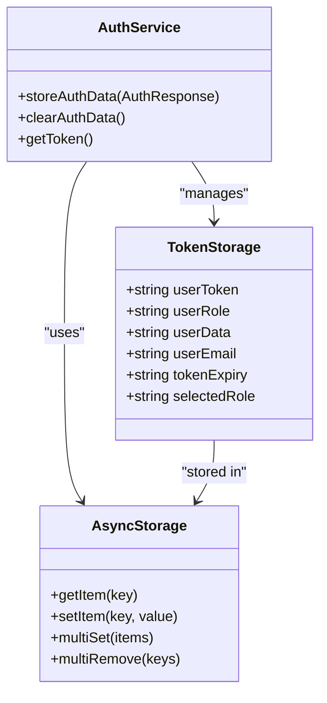
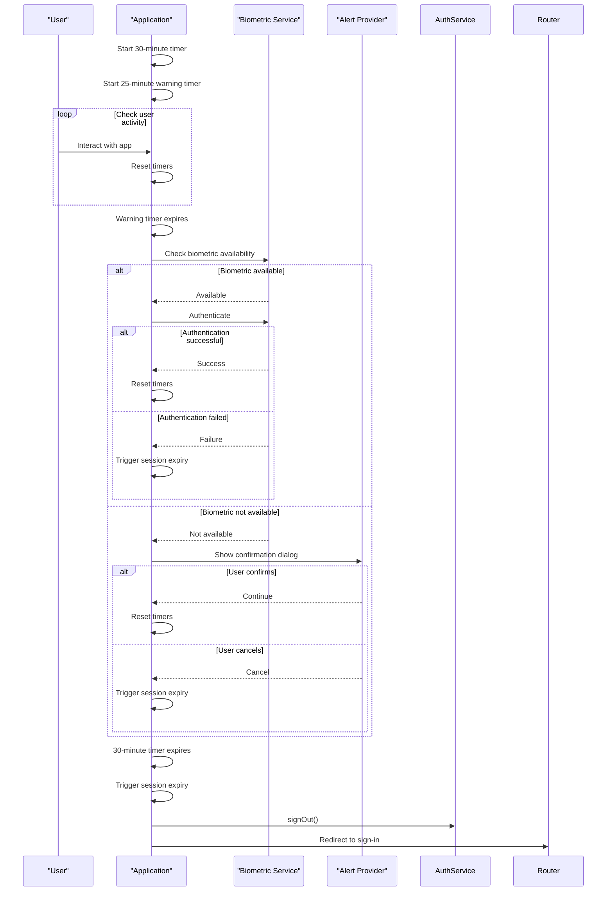
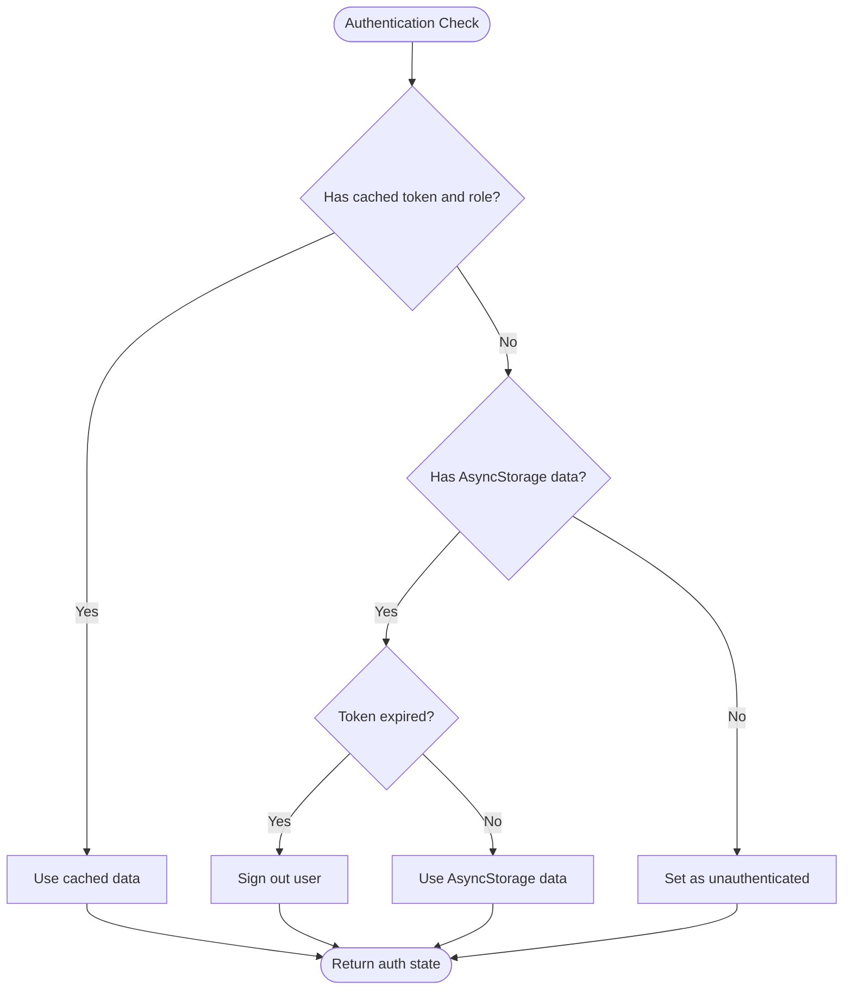
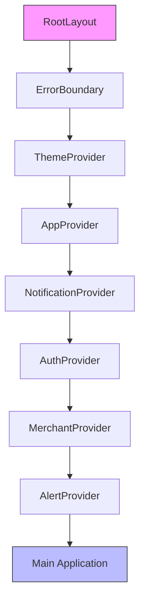

# Authentication State Management

<cite>
**Referenced Files in This Document**   
- [AuthContext.tsx](file://contexts/AuthContext.tsx)
- [useAuth.ts](file://hooks/useAuth.ts)
- [authService.ts](file://services/authService.ts)
- [useSessionTimeout.ts](file://hooks/useSessionTimeout.ts)
- [firebase.ts](file://config/firebase.ts)
- [performance.ts](file://utils/performance.ts)
- [signin.tsx](file://app/auth/signin.tsx)
- [role-selection.tsx](file://app/auth/role-selection.tsx)
- [types.ts](file://services/types.ts)
- [_layout.tsx](file://app/_layout.tsx)
</cite>

## Table of Contents
1. [Introduction](#introduction)
2. [AuthContext State Management](#authcontext-state-management)
3. [Authentication Flow](#authentication-flow)
4. [Role-Based State Management](#role-based-state-management)
5. [Token Persistence and Security](#token-persistence-and-security)
6. [Session Timeout Handling](#session-timeout-handling)
7. [Performance Optimization](#performance-optimization)
8. [Common Issues and Solutions](#common-issues-and-solutions)
9. [Integration with Application](#integration-with-application)
10. [Conclusion](#conclusion)

## Introduction
The authentication state management system in the Brillprime-expo application provides a comprehensive solution for managing user authentication, session state, and role-based access control. This system is built around React Context API, Firebase Authentication, and AsyncStorage for persistent storage. The architecture ensures secure, efficient, and scalable authentication across the application, supporting multiple user roles (consumer, merchant, driver) with appropriate access controls and state management.

**Section sources**
- [AuthContext.tsx](file://contexts/AuthContext.tsx#L1-L148)
- [useAuth.ts](file://hooks/useAuth.ts#L1-L115)

## AuthContext State Management
The AuthContext.tsx file implements a React Context provider that manages global authentication state across the application. This context provides access to user session data, authentication status, and role information through a well-defined interface.

The AuthContextType interface defines the structure of the authentication context, including user object, isAuthenticated boolean, isLoading state, token string, role string, and methods for setUser, signOut, and refreshUser. The AuthProvider component initializes these states and handles the loading of user data from persistent storage during application startup.

**Diagram sources**
- [AuthContext.tsx](file://contexts/AuthContext.tsx#L6-L26)

The loadUserData function is a critical component of the authentication flow, responsible for initializing the authentication state when the application starts. It retrieves stored authentication data from AsyncStorage, including the user token, role, and user data. The function handles various scenarios, such as when a token exists but no role is set (requiring role selection) or when no authentication data is present (indicating a logged-out state).

**Section sources**
- [AuthContext.tsx](file://contexts/AuthContext.tsx#L37-L78)

## Authentication Flow
The authentication flow in the Brillprime-expo application follows a structured process from user login to state propagation throughout the application components. This flow integrates Firebase Authentication with the application's custom authentication service and state management system.

The process begins with the user interacting with authentication screens (signin.tsx, signup.tsx, role-selection.tsx), where credentials are collected and validated. Upon successful authentication, the authService handles the communication with Firebase and the backend API to establish the user session.

**Diagram sources**
- [authService.ts](file://services/authService.ts#L154-L241)
- [signin.tsx](file://app/auth/signin.tsx#L95-L154)

The authentication flow includes several key steps:
1. User enters credentials on the sign-in screen
2. authService calls Firebase's signInWithEmailAndPassword method
3. Firebase returns user credentials and ID token
4. authService synchronizes user data with the backend API
5. Authentication data is stored in AsyncStorage
6. AuthContext updates the global state
7. User is redirected to the appropriate home screen based on their role

**Section sources**
- [authService.ts](file://services/authService.ts#L154-L241)
- [signin.tsx](file://app/auth/signin.tsx#L95-L154)

## Role-Based State Management
The application implements a sophisticated role-based state management system that supports three primary user roles: consumer, merchant, and driver. This system ensures that users have appropriate access to features and data based on their assigned role.

Role selection is a critical part of the authentication process, implemented in the role-selection.tsx component. Users must select their role before proceeding with authentication, and this selection is stored in AsyncStorage as "selectedRole". The role selection process is integrated with the authentication flow, ensuring that users cannot access role-specific features without first selecting their role.

**Diagram sources**
- [role-selection.tsx](file://app/auth/role-selection.tsx#L1-L203)
- [_layout.tsx](file://app/_layout.tsx#L119-L169)

The role-based state management includes several key features:
- Role persistence across application sessions using AsyncStorage
- Role validation during authentication to prevent role mismatch
- Role-specific routing to appropriate home screens
- Integration with the withRoleAccess higher-order component for protecting role-specific routes

The useAuth hook provides a requireRole method that can be used to enforce role-based access to specific components or routes. This method checks the current authentication state and redirects users to appropriate screens if they don't have the required role.

**Section sources**
- [role-selection.tsx](file://app/auth/role-selection.tsx#L1-L203)
- [useAuth.ts](file://hooks/useAuth.ts#L90-L103)

## Token Persistence and Security
The authentication system implements secure token persistence using AsyncStorage to maintain user sessions across application restarts. The token management system is designed to balance security with user convenience, ensuring that users don't need to log in repeatedly while maintaining appropriate security measures.

Tokens are stored in AsyncStorage with a 24-hour expiration time, after which the user must re-authenticate. The system stores multiple pieces of authentication data:
- userToken: The Firebase ID token
- userRole: The user's role (consumer, merchant, driver)
- userData: Serialized user object
- userEmail: User's email address
- tokenExpiry: Timestamp for token expiration

**Diagram sources**
- [authService.ts](file://services/authService.ts#L724-L775)
- [AuthContext.tsx](file://contexts/AuthContext.tsx#L40-L68)

The authService includes a sophisticated token management system that handles token refreshing when needed. The getToken method checks if the current token is nearing expiration and requests a fresh token from Firebase if necessary. This ensures that users maintain an active session without needing to log in again.

Security considerations include:
- Token expiration after 24 hours
- Secure storage using AsyncStorage (which uses platform-specific secure storage mechanisms)
- Token validation on each application startup
- Automatic sign-out when token expires
- Protection against token theft through short expiration times

**Section sources**
- [authService.ts](file://services/authService.ts#L724-L799)
- [AuthContext.tsx](file://contexts/AuthContext.tsx#L40-L68)

## Session Timeout Handling
The application implements a session timeout mechanism through the useSessionTimeout hook, which automatically logs out users after a period of inactivity. This feature enhances security by preventing unauthorized access to user accounts when devices are left unattended.

The session timeout is configured for 30 minutes of inactivity, with a 5-minute warning period before automatic logout. During the warning period, users are prompted to continue their session, with biometric authentication as the preferred method if available.

**Diagram sources**
- [useSessionTimeout.ts](file://hooks/useSessionTimeout.ts#L1-L103)

The useSessionTimeout hook listens for user interactions and application state changes to determine activity. When the app transitions from background to foreground (AppState change to 'active'), it checks if the token needs refreshing and resets the timers. This ensures that users are not logged out simply for switching between apps.

Key features of the session timeout system:
- 30-minute inactivity timeout
- 5-minute warning period with biometric authentication option
- Fallback to confirmation dialog if biometric authentication is not available
- Timer reset on user interaction or app foregrounding
- Integration with authService for secure logout
- Automatic redirection to sign-in screen after logout

**Section sources**
- [useSessionTimeout.ts](file://hooks/useSessionTimeout.ts#L1-L103)

## Performance Optimization
The authentication system incorporates several performance optimization techniques to ensure fast startup times and smooth user experience. These optimizations are particularly important for authentication flows, as delays can negatively impact user perception of the application.

The useAuth hook implements caching through the PerformanceOptimizer utility, which stores authentication data in memory to reduce AsyncStorage access. The checkAuth function first checks for cached data before falling back to AsyncStorage, significantly reducing authentication check time.

**Diagram sources**
- [useAuth.ts](file://hooks/useAuth.ts#L26-L87)
- [performance.ts](file://utils/performance.ts#L97-L139)

Additional performance optimizations include:
- Lazy loading of critical authentication data using preloadCriticalData
- Batch operations for storing multiple authentication items simultaneously
- Memory management through cache cleanup and expiration
- Debounce and throttle utilities for handling rapid authentication events
- Preloading of authentication-related components and assets

The PerformanceOptimizer class provides a comprehensive set of tools for optimizing authentication performance, including:
- In-memory caching with TTL (Time To Live) management
- Preloading of critical data from AsyncStorage
- Batch API calls to reduce network requests
- Image preloading for authentication screens
- Component memoization to prevent unnecessary re-renders

**Section sources**
- [useAuth.ts](file://hooks/useAuth.ts#L26-L87)
- [performance.ts](file://utils/performance.ts#L1-L240)

## Common Issues and Solutions
The authentication system addresses several common issues that can occur in mobile applications, providing robust solutions to ensure a reliable user experience.

### Stale Context Values
Stale context values can occur when the authentication state changes but components don't receive the updated values. The system addresses this through several mechanisms:
- Using useCallback for state update functions to prevent unnecessary re-renders
- Proper dependency arrays in useEffect hooks to ensure timely updates
- The refreshUser function in AuthContext to explicitly refresh user data from the backend

### Race Conditions During Login/Logout
Race conditions during login and logout are mitigated through:
- Proper async/await usage to ensure operations complete before proceeding
- Loading states to prevent multiple simultaneous authentication requests
- Error boundaries to handle unexpected authentication errors
- Atomic operations for clearing authentication data

### Secure Token Storage
While AsyncStorage provides a reasonable level of security, additional measures are implemented:
- Short token expiration times (24 hours)
- Automatic token refreshing before expiration
- Storage of minimal sensitive data
- Integration with biometric authentication for additional security layers

### Error Handling
Comprehensive error handling is implemented throughout the authentication system:
- Try-catch blocks around all asynchronous operations
- Specific error messages for different authentication failure scenarios
- Graceful degradation when network connectivity is lost
- User-friendly error messages that guide users toward solutions

**Section sources**
- [AuthContext.tsx](file://contexts/AuthContext.tsx#L107-L118)
- [authService.ts](file://services/authService.ts#L130-L149)
- [signin.tsx](file://app/auth/signin.tsx#L154-L175)

## Integration with Application
The authentication system is deeply integrated into the application structure, with the AuthProvider wrapped around the entire application in the _layout.tsx file. This ensures that all components have access to the authentication context.

**Diagram sources**
- [_layout.tsx](file://app/_layout.tsx#L83-L115)

The integration includes several key components:
- AuthProvider as a top-level context provider
- useAuth hook for consuming authentication state in components
- Protected routes that check authentication status before rendering
- Role-based access control through the withRoleAccess higher-order component
- Global error boundaries to handle authentication-related errors

The AuthStateHandler component in _layout.tsx manages the initial authentication flow, checking onboarding status, role selection, and authentication state to determine the appropriate initial screen. This centralized approach ensures consistent authentication behavior across the application.

**Section sources**
- [_layout.tsx](file://app/_layout.tsx#L119-L178)
- [withRoleAccess.tsx](file://components/withRoleAccess.tsx#L1-L195)

## Conclusion
The authentication state management system in the Brillprime-expo application provides a robust, secure, and user-friendly solution for managing user sessions and access control. By leveraging React Context API, Firebase Authentication, and AsyncStorage, the system effectively handles the complexities of modern mobile authentication.

Key strengths of the system include:
- Comprehensive role-based access control with seamless role switching
- Secure token management with appropriate expiration and refreshing
- Performance optimizations that ensure fast authentication flows
- Robust error handling and user guidance for authentication issues
- Integration with biometric authentication for enhanced security
- Session timeout protection to prevent unauthorized access

The system is well-structured and maintainable, with clear separation of concerns between the authentication service, context provider, and consumer hooks. This architecture allows for easy extension and modification as the application evolves, while providing a consistent and reliable authentication experience for users.