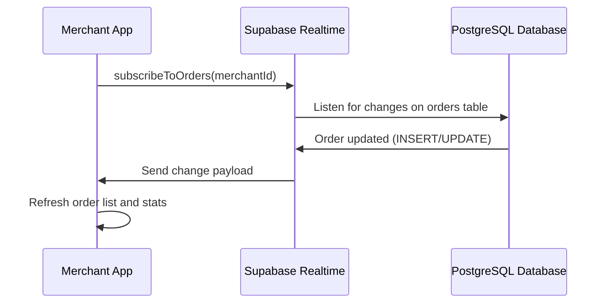
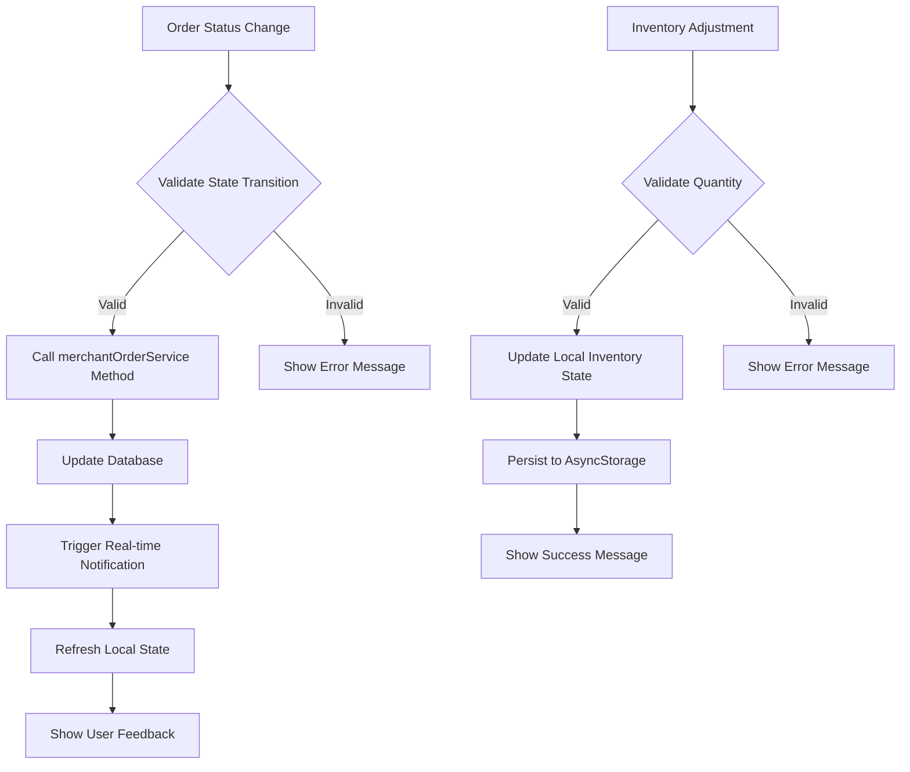
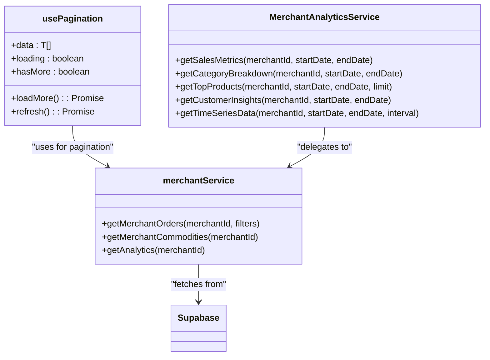
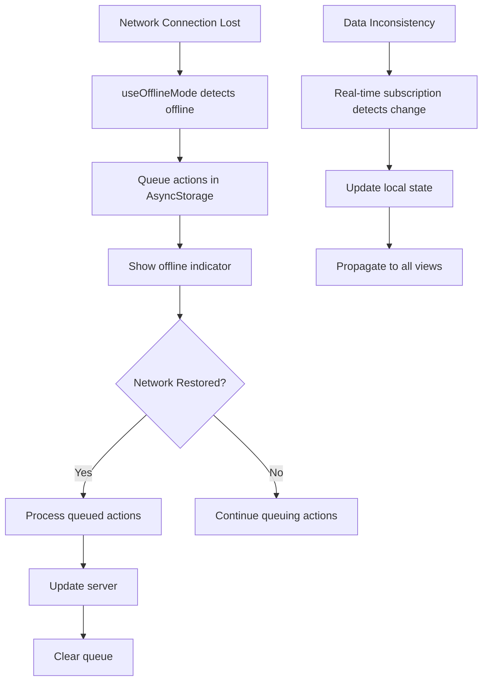

# Merchant Data Management

<cite>
**Referenced Files in This Document**   
- [MerchantContext.tsx](file://contexts/MerchantContext.tsx)
- [merchantService.ts](file://services/merchantService.ts)
- [merchantAnalyticsService.ts](file://services/merchantAnalyticsService.ts)
- [merchantOrderService.ts](file://services/merchantOrderService.ts)
- [usePagination.ts](file://hooks/usePagination.ts)
- [useOfflineMode.ts](file://hooks/useOfflineMode.ts)
- [analytics.tsx](file://app/merchant/analytics.tsx)
- [order-management.tsx](file://app/merchant/order-management.tsx)
- [inventory.tsx](file://app/merchant/inventory.tsx)
- [store-settings.tsx](file://app/merchant/store-settings.tsx)
- [supabase.ts](file://config/supabase.ts)
- [AppContext.tsx](file://contexts/AppContext.tsx)
</cite>

## Table of Contents
1. [Introduction](#introduction)
2. [MerchantContext State Management](#merchantcontext-state-management)
3. [Data Fetching Patterns](#data-fetching-patterns)
4. [Real-time Updates via Supabase Subscriptions](#real-time-updates-via-supabase-subscriptions)
5. [State Synchronization Across Dashboard Views](#state-synchronization-across-dashboard-views)
6. [State Updates During Order Fulfillment and Inventory Changes](#state-updates-during-order-fulfillment-and-inventory-changes)
7. [Performance Considerations for Large Datasets](#performance-considerations-for-large-datasets)
8. [Common Issues and Solutions](#common-issues-and-solutions)
9. [Conclusion](#conclusion)

## Introduction
The MerchantContext state management system is a critical component of the BrillPrime application, designed to handle merchant-specific data including store information, inventory, active orders, and analytics. This documentation provides a comprehensive overview of how the system manages data flow, synchronization, and state updates across various merchant dashboard views. The system leverages React Context for state management, Supabase for real-time data synchronization, and custom hooks for pagination and offline mode handling. The architecture ensures efficient data fetching, real-time updates, and seamless user experience even in offline scenarios.

## MerchantContext State Management
The MerchantContext.tsx file implements a React Context provider that manages the merchant ID state across the application. The context stores the merchant ID in both component state and AsyncStorage for persistence. The MerchantProvider component initializes by attempting to load the merchant ID from the authenticated user data, falling back to AsyncStorage if not found. This dual approach ensures that the merchant ID is available even after app restarts. The context provides three key functions: loadMerchantId to retrieve the merchant ID from storage, setMerchantId to update the merchant ID and persist it, and useMerchant hook for components to access the merchant context. This centralized state management allows all merchant-related components to access the current merchant ID without prop drilling.

**Section sources**
- [MerchantContext.tsx](file://contexts/MerchantContext.tsx#L1-L63)

## Data Fetching Patterns
The merchant data fetching patterns are implemented through a series of service files that abstract API interactions. The merchantService.ts file contains functions for retrieving merchant data including getMerchants, getMerchantById, getMerchantCommodities, and getMerchantOrders. These functions use the apiClient to make authenticated requests to the backend API, with error handling and fallback mechanisms. The merchantAnalyticsService.ts file provides specialized functions for retrieving analytics data such as sales metrics, category breakdown, top products, and customer insights. These services follow a consistent pattern of token authentication, error handling, and data transformation. The data fetching is typically initiated from component useEffect hooks or user interactions, with loading states managed through component state.

**Section sources**
- [merchantService.ts](file://services/merchantService.ts#L1-L401)
- [merchantAnalyticsService.ts](file://services/merchantAnalyticsService.ts#L1-L371)

## Real-time Updates via Supabase Subscriptions
The system implements real-time updates using Supabase's realtime capabilities. The merchantOrderService.ts file contains a subscribeToOrders method that establishes a realtime subscription to order changes for a specific merchant. This subscription listens for postgres_changes events on the orders table filtered by merchant_id, triggering a callback when changes occur. The subscription is set up in the order-management.tsx component when the screen mounts, ensuring that order updates are received in real-time. The Supabase client is configured in supabase.ts with proper authentication headers and error handling. When an order update is received, the system refreshes the order list and statistics, providing immediate feedback to the merchant. This real-time capability is essential for maintaining data consistency and providing a responsive user experience.

**Diagram sources**
- [merchantOrderService.ts](file://services/merchantOrderService.ts#L383-L409)
- [supabase.ts](file://config/supabase.ts#L68-L105)
- [order-management.tsx](file://app/merchant/order-management.tsx#L85-L114)

## State Synchronization Across Dashboard Views
The merchant data is synchronized across various dashboard views through a combination of context providers and service calls. The analytics.tsx component uses the MerchantAnalyticsService to fetch comprehensive analytics data including sales metrics, category breakdown, top products, and customer insights. The order-management.tsx component uses merchantOrderService to retrieve and display orders, with real-time updates via Supabase subscriptions. The inventory.tsx component manages inventory data, storing it in AsyncStorage for offline access. The store-settings.tsx component retrieves and updates store configuration data through merchantService calls. All these components share the merchant ID through the MerchantContext, ensuring they operate on the correct merchant's data. The AppContext provides additional application-wide state including user authentication and online status, which influences data fetching behavior.

**Section sources**
- [analytics.tsx](file://app/merchant/analytics.tsx#L1-L745)
- [order-management.tsx](file://app/merchant/order-management.tsx#L1-L800)
- [inventory.tsx](file://app/merchant/inventory.tsx#L1-L807)
- [store-settings.tsx](file://app/merchant/store-settings.tsx#L1-L552)
- [AppContext.tsx](file://contexts/AppContext.tsx#L1-L148)

## State Updates During Order Fulfillment and Inventory Changes
State updates during order fulfillment and inventory changes follow a consistent pattern of service calls and state management. When an order status changes (e.g., accepted, preparing, ready), the order-management.tsx component calls the appropriate method on merchantOrderService (acceptOrder, startPreparing, markAsReady), which updates the database and triggers real-time notifications. The inventory.tsx component handles inventory changes through restock and adjustment operations, updating the local inventory state and persisting changes to AsyncStorage. Both processes include error handling and user feedback through the AlertProvider. The state updates are designed to be idempotent and include validation to prevent invalid state transitions. After successful updates, components typically refresh their data to ensure consistency with the backend.

**Diagram sources**
- [order-management.tsx](file://app/merchant/order-management.tsx#L135-L202)
- [inventory.tsx](file://app/merchant/inventory.tsx#L191-L225)

## Performance Considerations for Large Datasets
The system addresses performance considerations for large datasets through pagination and caching strategies. The usePagination.ts hook provides a reusable pagination mechanism that loads data in chunks, reducing initial load time and memory usage. The hook manages page state, loading indicators, and "load more" functionality, making it easy to implement infinite scrolling in list views. For analytics data, the system uses caching strategies to minimize redundant API calls. The merchant analytics data is typically requested for specific time periods (7, 30, or 90 days), limiting the dataset size. The Supabase queries are optimized with appropriate indexes and filters to ensure fast response times. For offline scenarios, the inventory data is stored in AsyncStorage, allowing quick access without network requests.

**Diagram sources**
- [usePagination.ts](file://hooks/usePagination.ts#L1-L67)
- [merchantAnalyticsService.ts](file://services/merchantAnalyticsService.ts#L1-L371)
- [merchantService.ts](file://services/merchantService.ts#L1-L401)

## Common Issues and Solutions
The system addresses several common issues in merchant data management. Data inconsistency between merchant and consumer views is mitigated through real-time updates and consistent data sources. When a merchant updates an order status, the change is immediately propagated to consumers through notifications and real-time updates. Offline state management is handled by the useOfflineMode.ts hook, which monitors network connectivity and queues actions when offline. The hook stores the queue in AsyncStorage and processes it when connectivity is restored. For inventory management, the system includes validation to prevent negative stock levels and provides low-stock alerts. Error handling is consistent across services, with network errors distinguished from business logic errors to provide appropriate user feedback.

**Diagram sources**
- [useOfflineMode.ts](file://hooks/useOfflineMode.ts#L1-L65)
- [merchantOrderService.ts](file://services/merchantOrderService.ts#L383-L409)

## Conclusion
The MerchantContext state management system provides a robust foundation for managing merchant data in the BrillPrime application. By leveraging React Context, Supabase realtime capabilities, and well-structured service layers, the system ensures efficient data flow, real-time updates, and consistent state across views. The implementation of pagination and offline mode addresses performance and connectivity challenges, while comprehensive error handling provides a reliable user experience. The separation of concerns between context providers, service layers, and UI components creates a maintainable architecture that can be extended with additional features. Future enhancements could include more sophisticated caching strategies, enhanced offline conflict resolution, and improved data synchronization between merchant and consumer views.