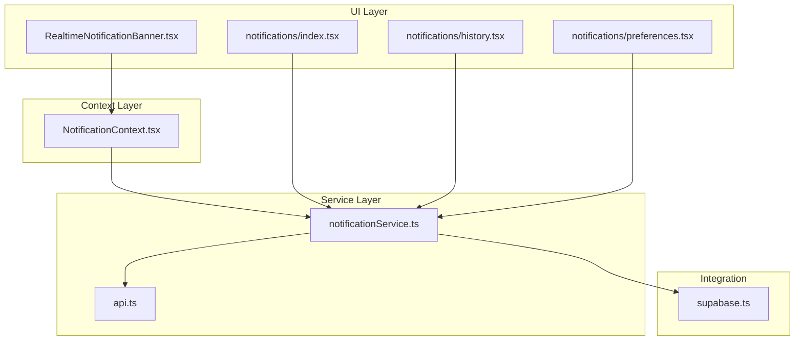
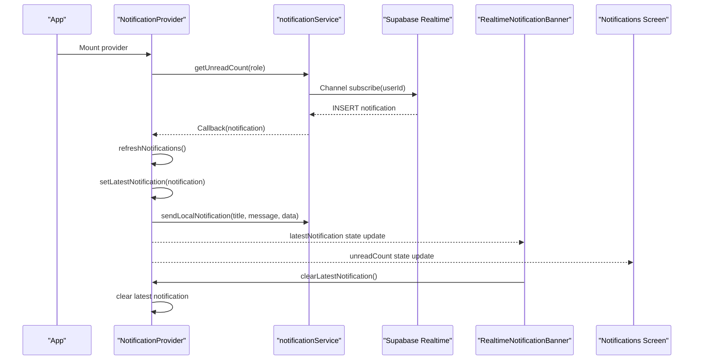
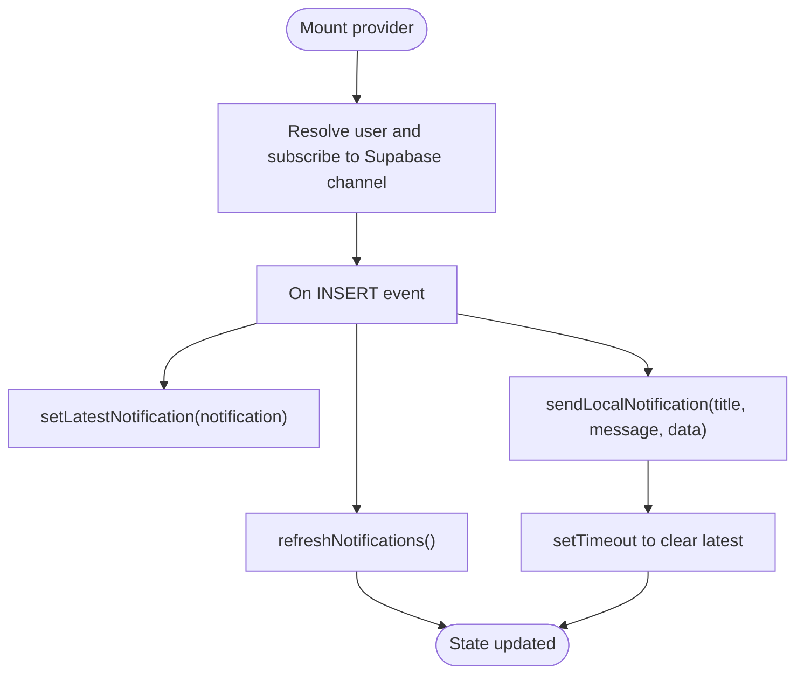
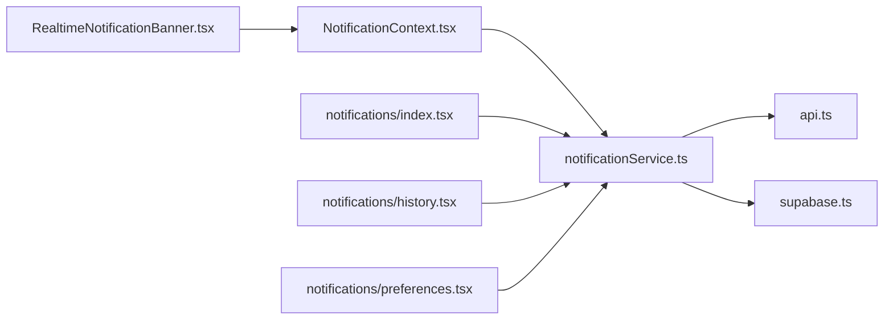

# Notification State Management

<cite>
**Referenced Files in This Document**
- [NotificationContext.tsx](file://contexts/NotificationContext.tsx)
- [notificationService.ts](file://services/notificationService.ts)
- [RealtimeNotificationBanner.tsx](file://components/RealtimeNotificationBanner.tsx)
- [notifications/index.tsx](file://app/notifications/index.tsx)
- [notifications/history.tsx](file://app/notifications/history.tsx)
- [notifications/preferences.tsx](file://app/notifications/preferences.tsx)
- [supabase.ts](file://config/supabase.ts)
- [api.ts](file://services/api.ts)
</cite>

## Table of Contents
1. [Introduction](#introduction)
2. [Project Structure](#project-structure)
3. [Core Components](#core-components)
4. [Architecture Overview](#architecture-overview)
5. [Detailed Component Analysis](#detailed-component-analysis)
6. [Dependency Analysis](#dependency-analysis)
7. [Performance Considerations](#performance-considerations)
8. [Troubleshooting Guide](#troubleshooting-guide)
9. [Conclusion](#conclusion)

## Introduction
This document explains the NotificationContext state management system and how it coordinates real-time notifications, unread counts, notification history, and delivery status. It covers the WebSocket integration with Supabase Realtime for push notifications, a polling fallback mechanism, and the interaction between NotificationContext and notificationService for message queuing and delivery confirmation. It also includes usage examples in RealtimeNotificationBanner.tsx and notifications/index.tsx, along with performance optimization strategies and common issues such as missed notifications during app backgrounding and synchronization conflicts.

## Project Structure
The notification system spans several layers:
- Context Provider: exposes unread count, latest notification, and actions to mark as read/all read.
- Service Layer: encapsulates API calls, real-time subscriptions, retry logic, and delivery status queries.
- UI Screens: display notifications, history, and preferences.
- Supabase Client: provides real-time channels and database access.
- API Client: centralizes HTTP requests with timeouts and error handling.



**Diagram sources**
- [NotificationContext.tsx](file://contexts/NotificationContext.tsx#L1-L164)
- [notificationService.ts](file://services/notificationService.ts#L1-L681)
- [RealtimeNotificationBanner.tsx](file://components/RealtimeNotificationBanner.tsx#L1-L143)
- [notifications/index.tsx](file://app/notifications/index.tsx#L1-L563)
- [notifications/history.tsx](file://app/notifications/history.tsx#L1-L275)
- [notifications/preferences.tsx](file://app/notifications/preferences.tsx#L1-L360)
- [supabase.ts](file://config/supabase.ts#L1-L120)
- [api.ts](file://services/api.ts#L1-L218)

**Section sources**
- [NotificationContext.tsx](file://contexts/NotificationContext.tsx#L1-L164)
- [notificationService.ts](file://services/notificationService.ts#L1-L681)
- [supabase.ts](file://config/supabase.ts#L1-L120)
- [api.ts](file://services/api.ts#L1-L218)

## Core Components
- NotificationContext: Provides unread count, latest notification, refresh, mark-as-read, mark-all-as-read, and clear latest notification. It sets up Supabase Realtime subscriptions and a polling fallback.
- notificationService: Implements API calls for notifications, preferences, history, scheduled notifications, and real-time subscriptions. It includes retry logic, network checks, and local push notifications.
- UI components: RealtimeNotificationBanner displays the latest notification with animated banner and navigation; notifications/index.tsx lists notifications, marks read, and polls periodically.

Key responsibilities:
- Real-time delivery: Supabase Realtime INSERT events for the notifications table.
- Delivery status: Push history endpoint for delivered/failed/pending statuses.
- Synchronization: Polling fallback and focus-triggered refresh to keep counts consistent across devices.

**Section sources**
- [NotificationContext.tsx](file://contexts/NotificationContext.tsx#L1-L164)
- [notificationService.ts](file://services/notificationService.ts#L1-L681)
- [RealtimeNotificationBanner.tsx](file://components/RealtimeNotificationBanner.tsx#L1-L143)
- [notifications/index.tsx](file://app/notifications/index.tsx#L1-L563)

## Architecture Overview
The system integrates Supabase Realtime with a React context provider and service layer. On mount, the provider subscribes to a user-scoped channel and updates state on INSERT events. A periodic poll ensures synchronization when real-time fails or the app backgrounded.



**Diagram sources**
- [NotificationContext.tsx](file://contexts/NotificationContext.tsx#L67-L139)
- [notificationService.ts](file://services/notificationService.ts#L416-L456)
- [RealtimeNotificationBanner.tsx](file://components/RealtimeNotificationBanner.tsx#L1-L103)
- [notifications/index.tsx](file://app/notifications/index.tsx#L1-L120)

## Detailed Component Analysis

### NotificationContext.tsx
Responsibilities:
- Maintains unreadCount and latestNotification state.
- Exposes refreshNotifications, markAsRead, markAllAsRead, clearLatestNotification.
- Subscribes to Supabase Realtime for user-specific notifications.
- Polls every 30 seconds and refreshes on window focus.
- Cleans up subscriptions, intervals, and event listeners on unmount.

Behavior highlights:
- Real-time setup resolves user ID via a database lookup using the stored Firebase UID.
- On each notification, it updates unread count, shows latest notification, sends a local push notification, and auto-clears after a short delay.
- Error handling logs and defaults to zero unread count when fetch fails.



**Diagram sources**
- [NotificationContext.tsx](file://contexts/NotificationContext.tsx#L67-L139)
- [notificationService.ts](file://services/notificationService.ts#L416-L508)

**Section sources**
- [NotificationContext.tsx](file://contexts/NotificationContext.tsx#L1-L164)

### notificationService.ts
Responsibilities:
- Fetch notifications, unread count, history, and preferences.
- Manage real-time subscriptions via Supabase channels.
- Send local push notifications (native and web).
- Retry logic and network connectivity checks.
- Scheduled notifications CRUD and quiet hours management.

Real-time integration:
- Subscribes to postgres_changes INSERT on the notifications table filtered by user_id.
- Converts raw payload to normalized Notification object and invokes callback.

Delivery status:
- getPushHistory supports filtering by status (delivered, failed, pending).

Retry and connectivity:
- withRetry performs exponential backoff.
- checkNetworkConnectivity attempts NetInfo and falls back to fetch-based probe.

```mermaid
classDiagram
class NotificationService {
+getNotifications(filters) ApiResponse~Notification[]~
+getUnreadCount(role) ApiResponse~{count}~
+markAsRead(id) ApiResponse~{message}~
+markAllAsRead() ApiResponse~{message}~
+deleteNotification(id) ApiResponse~{message}~
+getHistory(filters) ApiResponse~Notification[]~
+getSettings() ApiResponse~NotificationSettings~
+updateSettings(prefs) ApiResponse~{message}~
+getPushHistory(filters) ApiResponse~Notification[]~
+scheduleNotification(title, message, type, scheduledFor) ApiResponse~ScheduledNotification~
+getScheduledNotifications(filters) ApiResponse~ScheduledNotification[]~
+cancelScheduledNotification(id) ApiResponse~{message}~
+subscribeToNotifications(userId, callback) {unsubscribe}
+sendLocalNotification(title, message, data) void
-withRetry(fn, retries, delay) Promise
-checkNetworkConnectivity() Promise~boolean~
}
```

**Diagram sources**
- [notificationService.ts](file://services/notificationService.ts#L1-L681)

**Section sources**
- [notificationService.ts](file://services/notificationService.ts#L1-L681)

### RealtimeNotificationBanner.tsx
Responsibilities:
- Animates a banner for the latest notification.
- Navigates to order details or a custom action when tapped.
- Clears the latest notification on close.

Usage:
- Consumes latestNotification from NotificationContext and clears it on dismissal.

**Section sources**
- [RealtimeNotificationBanner.tsx](file://components/RealtimeNotificationBanner.tsx#L1-L143)
- [NotificationContext.tsx](file://contexts/NotificationContext.tsx#L1-L164)

### notifications/index.tsx
Responsibilities:
- Lists notifications with read/unread indicators.
- Marks individual notifications as read and bulk-reads.
- Periodic polling to refresh the list.
- Pull-to-refresh and responsive layout.

Usage:
- Calls notificationService.getNotifications and notificationService.markAsRead.
- Uses AsyncStorage for role-based filtering.

**Section sources**
- [notifications/index.tsx](file://app/notifications/index.tsx#L1-L563)
- [notificationService.ts](file://services/notificationService.ts#L78-L156)

### notifications/history.tsx
Responsibilities:
- Displays push notification delivery history with status filtering.
- Loads paginated history via getPushHistory.

**Section sources**
- [notifications/history.tsx](file://app/notifications/history.tsx#L1-L275)
- [notificationService.ts](file://services/notificationService.ts#L621-L654)

### notifications/preferences.tsx
Responsibilities:
- Manages notification preferences including category-specific channels and quiet hours.
- Saves preferences via updateSettings and updateCategoryPreferences.

**Section sources**
- [notifications/preferences.tsx](file://app/notifications/preferences.tsx#L1-L360)
- [notificationService.ts](file://services/notificationService.ts#L224-L246)

## Dependency Analysis
- NotificationContext depends on notificationService for fetching unread counts and real-time callbacks.
- notificationService depends on api.ts for HTTP requests and supabase.ts for Supabase client and real-time channels.
- UI screens depend on notificationService for data and on NotificationContext for shared state.



**Diagram sources**
- [NotificationContext.tsx](file://contexts/NotificationContext.tsx#L1-L164)
- [notificationService.ts](file://services/notificationService.ts#L1-L681)
- [api.ts](file://services/api.ts#L1-L218)
- [supabase.ts](file://config/supabase.ts#L1-L120)
- [RealtimeNotificationBanner.tsx](file://components/RealtimeNotificationBanner.tsx#L1-L143)
- [notifications/index.tsx](file://app/notifications/index.tsx#L1-L563)
- [notifications/history.tsx](file://app/notifications/history.tsx#L1-L275)
- [notifications/preferences.tsx](file://app/notifications/preferences.tsx#L1-L360)

**Section sources**
- [NotificationContext.tsx](file://contexts/NotificationContext.tsx#L1-L164)
- [notificationService.ts](file://services/notificationService.ts#L1-L681)
- [api.ts](file://services/api.ts#L1-L218)
- [supabase.ts](file://config/supabase.ts#L1-L120)

## Performance Considerations
- Batch updates: The provider updates unreadCount and latestNotification atomically on each real-time insert. Consider debouncing refreshNotifications if high-frequency inserts occur to reduce redundant fetches.
- Memory leak prevention: The provider cleans up the Supabase subscription, polling interval, and focus event listener on unmount. Ensure no external timers or listeners are retained elsewhere.
- Network resilience: notificationService’s getUnreadCount uses retry logic and a timeout to prevent hanging. Use these patterns consistently for other endpoints.
- Polling cadence: The 30-second poll balances freshness and battery/network usage. Adjust based on traffic and device constraints.
- Focus refresh: Refresh on window focus prevents stale counts when the app resumes after backgrounding.

[No sources needed since this section provides general guidance]

## Troubleshooting Guide
Common issues and resolutions:
- Missed notifications during backgrounding:
  - Rely on the 30-second polling fallback and focus-triggered refresh. Ensure the provider remains mounted while the app is active.
  - Verify Supabase channel subscription is established after resolving the user ID.
- Synchronization conflicts between devices:
  - Use the polling fallback to reconcile counts across sessions.
  - Ensure markAsRead/markAllAsRead calls update the backend and trigger refreshNotifications to synchronize UI state.
- Real-time subscription errors:
  - Check Supabase configuration validity and authentication headers.
  - Review Supabase error suppression for known constraint messages and ensure the channel subscribes successfully.
- Delivery status discrepancies:
  - Use getPushHistory to inspect delivered/failed/pending statuses and correlate with backend logs.
- Local push notifications:
  - On web, ensure browser Notification permissions are granted. On native, confirm Expo Notifications availability and handler configuration.

**Section sources**
- [NotificationContext.tsx](file://contexts/NotificationContext.tsx#L67-L139)
- [notificationService.ts](file://services/notificationService.ts#L416-L508)
- [supabase.ts](file://config/supabase.ts#L88-L120)

## Conclusion
The NotificationContext state management system provides a robust foundation for real-time notifications with Supabase Realtime, resilient polling, and clear UI integrations. By leveraging notificationService’s retry logic, network checks, and delivery status APIs, the system maintains consistency across devices and environments. Proper cleanup and adaptive polling help prevent memory leaks and optimize performance.