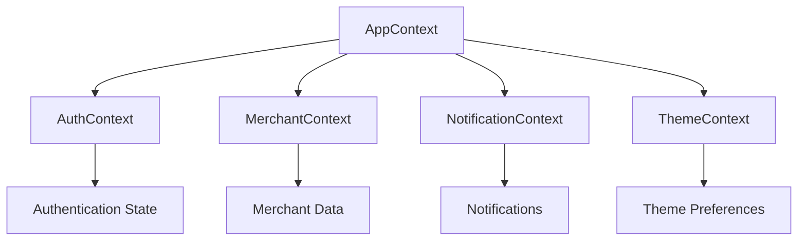
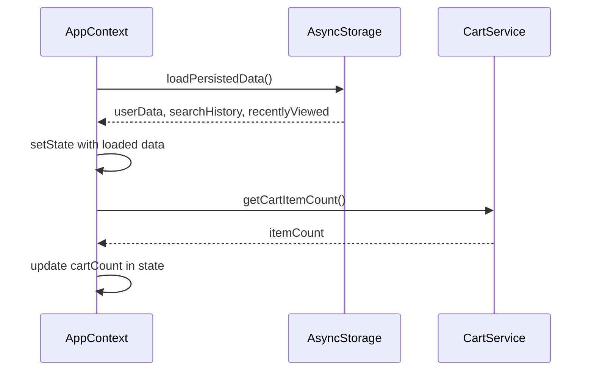
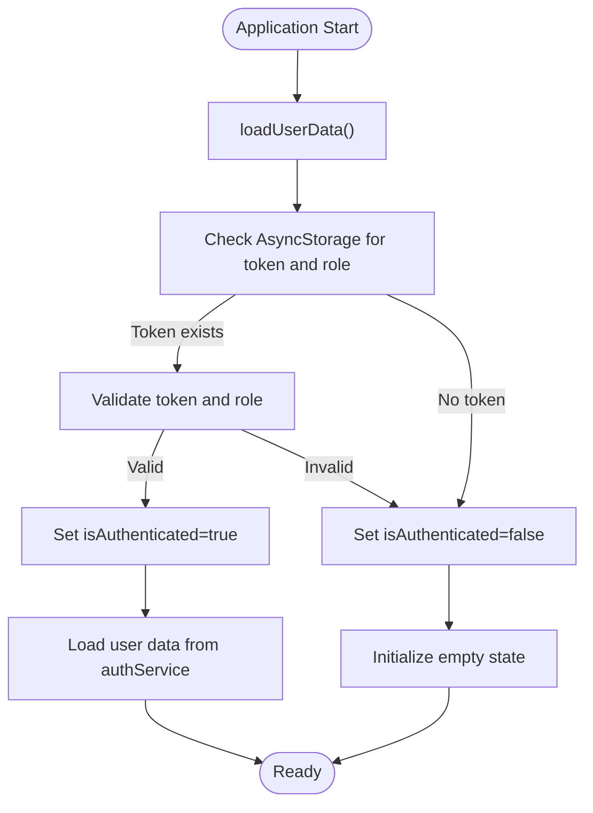
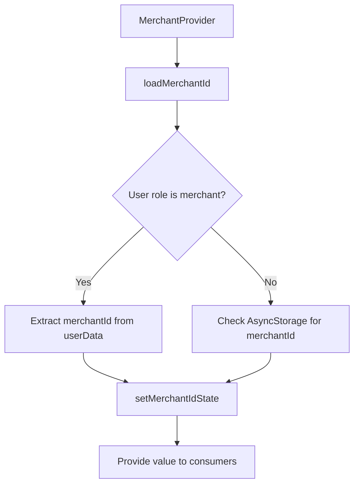
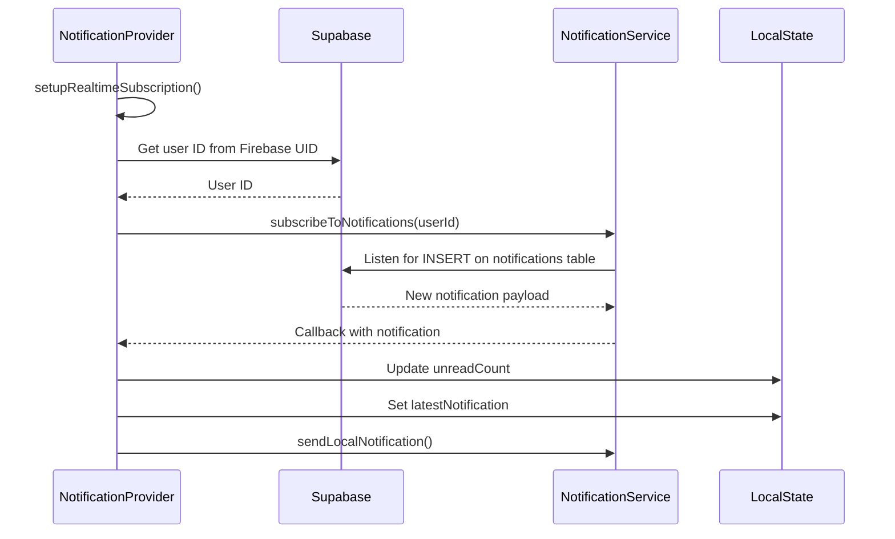
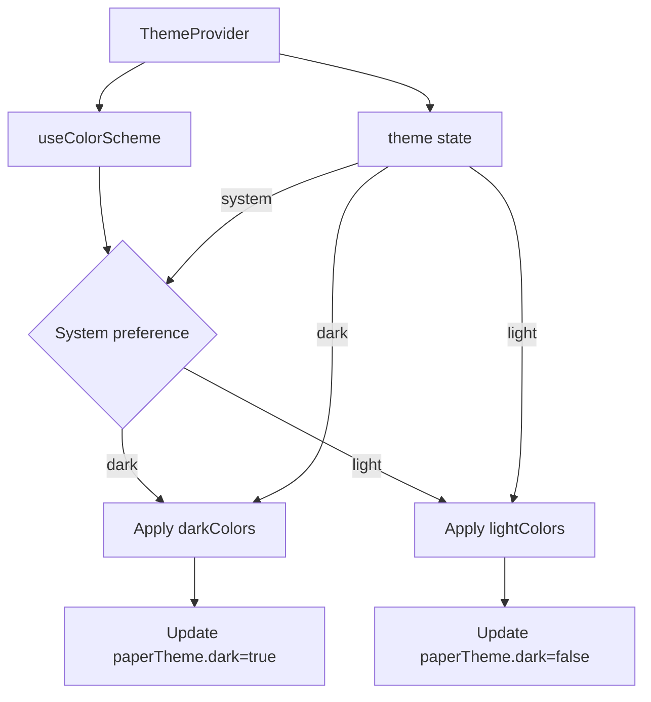
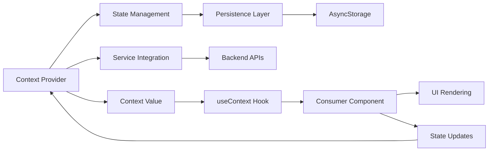
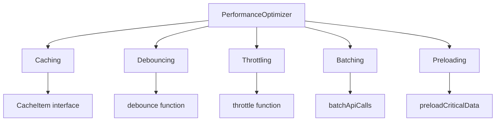
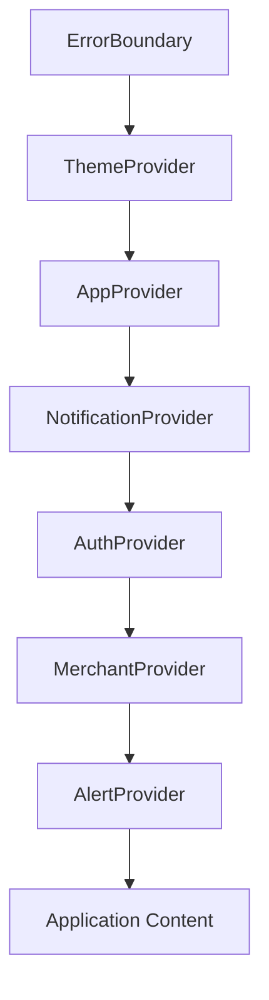

# State Management

<cite>
**Referenced Files in This Document**   
- [AppContext.tsx](file://contexts/AppContext.tsx)
- [AuthContext.tsx](file://contexts/AuthContext.tsx)
- [MerchantContext.tsx](file://contexts/MerchantContext.tsx)
- [NotificationContext.tsx](file://contexts/NotificationContext.tsx)
- [ThemeContext.tsx](file://contexts/ThemeContext.tsx)
- [useAuth.ts](file://hooks/useAuth.ts)
- [authService.ts](file://services/authService.ts)
- [notificationService.ts](file://services/notificationService.ts)
- [performance.ts](file://utils/performance.ts)
- [_layout.tsx](file://app/_layout.tsx)
</cite>

## Table of Contents
1. [Introduction](#introduction)
2. [Core Context Providers](#core-context-providers)
3. [AppContext: Root State Orchestrator](#appcontext-root-state-orchestrator)
4. [AuthContext: Authentication State Management](#authcontext-authentication-state-management)
5. [MerchantContext: Merchant-Specific State](#merchantcontext-merchant-specific-state)
6. [NotificationContext: Real-Time Notifications](#notificationcontext-real-time-notifications)
7. [ThemeContext: Dynamic Theme Management](#themecontext-dynamic-theme-management)
8. [Data Flow and Context Consumption](#data-flow-and-context-consumption)
9. [State Persistence Strategy](#state-persistence-strategy)
10. [Performance Optimization](#performance-optimization)
11. [Custom Hooks Abstraction](#custom-hooks-abstraction)
12. [Context Provider Orchestration](#context-provider-orchestration)
13. [Comparison with Alternative Solutions](#comparison-with-alternative-solutions)
14. [Conclusion](#conclusion)

## Introduction
The Brillprime-expo application implements a comprehensive state management architecture using React Context API to manage global application state across multiple domains. This document details the implementation of context providers for authentication, merchant data, notifications, and theme preferences, with AppContext serving as the root orchestrator. The architecture emphasizes separation of concerns, state persistence, performance optimization, and seamless integration with backend services.

## Core Context Providers
The state management system in Brillprime-expo is built around five primary context providers that manage different aspects of the application state:



**Diagram sources**
- [AppContext.tsx](file://contexts/AppContext.tsx)
- [AuthContext.tsx](file://contexts/AuthContext.tsx)
- [MerchantContext.tsx](file://contexts/MerchantContext.tsx)
- [NotificationContext.tsx](file://contexts/NotificationContext.tsx)
- [ThemeContext.tsx](file://contexts/ThemeContext.tsx)

**Section sources**
- [AppContext.tsx](file://contexts/AppContext.tsx)
- [AuthContext.tsx](file://contexts/AuthContext.tsx)
- [MerchantContext.tsx](file://contexts/MerchantContext.tsx)
- [NotificationContext.tsx](file://contexts/NotificationContext.tsx)
- [ThemeContext.tsx](file://contexts/ThemeContext.tsx)

## AppContext: Root State Orchestrator
AppContext serves as the foundational state provider that manages application-wide state not specific to other contexts. It maintains state for user information, cart count, online status, search history, and recently viewed items.

### State Structure
```typescript
interface AppState {
  user: User | null;
  cartCount: number;
  isOnline: boolean;
  searchHistory: string[];
  recentlyViewed: any[];
}
```

### Key Features
- **State Initialization**: Loads persisted data from AsyncStorage on mount
- **Cart Synchronization**: Integrates with cartService to maintain accurate cart count
- **Search History Management**: Maintains a limited history of user searches
- **Recently Viewed Items**: Tracks recently viewed products or merchants
- **Online Status**: Monitors and updates network connectivity status

The AppContext provider is responsible for initializing the application state by loading persisted data from AsyncStorage, including user data, search history, and recently viewed items. It also provides methods to update these states while automatically persisting changes back to storage.



**Diagram sources**
- [AppContext.tsx](file://contexts/AppContext.tsx#L44-L70)
- [cartService.ts](file://services/cartService.ts)

**Section sources**
- [AppContext.tsx](file://contexts/AppContext.tsx)

## AuthContext: Authentication State Management
AuthContext manages the authentication state of the application, handling user sessions, token management, and role-based access control.

### State Structure
```typescript
interface AuthContextType {
  user: User | null;
  isAuthenticated: boolean;
  isLoading: boolean;
  token: string | null;
  role: string | null;
  setUser: (user: User | null) => void;
  signOut: () => Promise<void>;
  refreshUser: () => Promise<void>;
}
```

### Authentication Flow
The authentication context implements a comprehensive flow for user authentication:



### Key Features
- **Token Persistence**: Stores authentication tokens in AsyncStorage with automatic expiration handling
- **Role Management**: Maintains user role information for access control
- **Session Refresh**: Implements token refresh mechanism to maintain active sessions
- **Error Handling**: Comprehensive error handling for authentication failures
- **Sign Out**: Complete session cleanup including token removal and state reset

The AuthContext integrates with Firebase Authentication for user management while synchronizing user data with the Supabase backend. It handles various authentication methods including email/password, Google, Apple, and Facebook sign-in.

**Section sources**
- [AuthContext.tsx](file://contexts/AuthContext.tsx)
- [authService.ts](file://services/authService.ts)

## MerchantContext: Merchant-Specific State
MerchantContext manages state specific to merchant users, primarily focusing on merchant identification and context.

### State Structure
```typescript
interface MerchantContextType {
  merchantId: string | null;
  setMerchantId: (id: string | null) => void;
  loadMerchantId: () => Promise<void>;
}
```

### Implementation Details
The MerchantContext implementation is streamlined to handle merchant identification:

1. **Initialization**: Attempts to load merchant ID from authenticated user data
2. **Fallback**: Uses AsyncStorage as a backup storage mechanism
3. **Persistence**: Automatically persists merchant ID changes to AsyncStorage

The context checks the authenticated user's role and extracts the merchant ID when the user is a merchant. This allows merchant-specific features to be enabled based on the current user's role and associated merchant account.



**Diagram sources**
- [MerchantContext.tsx](file://contexts/MerchantContext.tsx#L17-L34)

**Section sources**
- [MerchantContext.tsx](file://contexts/MerchantContext.tsx)

## NotificationContext: Real-Time Notifications
NotificationContext manages the application's notification system, providing real-time updates and notification state management.

### State Structure
```typescript
interface NotificationContextType {
  unreadCount: number;
  latestNotification: Notification | null;
  refreshNotifications: () => Promise<void>;
  markAsRead: (id: string) => Promise<void>;
  markAllAsRead: () => Promise<void>;
  clearLatestNotification: () => void;
}
```

### Real-Time Subscription
The notification system implements a sophisticated real-time subscription mechanism:



### Key Features
- **Real-Time Updates**: Uses Supabase's real-time capabilities for instant notification delivery
- **Fallback Polling**: Implements polling every 30 seconds as a backup mechanism
- **Focus Detection**: Refreshes notifications when the application regains focus
- **Local Notifications**: Displays local push notifications for immediate user feedback
- **Auto-Clear**: Automatically clears the latest notification banner after 5 seconds

The context also handles notification persistence, unread count management, and provides methods to mark notifications as read individually or in bulk.

**Section sources**
- [NotificationContext.tsx](file://contexts/NotificationContext.tsx)
- [notificationService.ts](file://services/notificationService.ts)

## ThemeContext: Dynamic Theme Management
ThemeContext manages the application's visual theme, supporting light, dark, and system-preference modes.

### State Structure
```typescript
interface ThemeContextType {
  theme: ThemeType;
  colors: ThemeColors;
  isDark: boolean;
  setTheme: (theme: ThemeType) => void;
  toggleTheme: () => void;
}
```

### Theme Implementation
The theme system implements a comprehensive color scheme for both light and dark modes:



### Color Scheme
The theme defines a comprehensive set of colors for consistent UI rendering:

- **Primary**: Brand color for interactive elements
- **Background**: Main background color
- **Card**: Surface color for cards and containers
- **Text**: Primary text color
- **TextSecondary**: Secondary text color
- **Border**: Border and divider color
- **Notification**: Badge and notification color
- **Success/Error/Warning**: Status colors
- **Disabled**: Disabled state color
- **Placeholder**: Placeholder text color
- **Backdrop**: Modal backdrop color

The context integrates with React Native Paper for component theming, ensuring consistent styling across UI components. It also provides a toggleTheme function for easy theme switching.

**Section sources**
- [ThemeContext.tsx](file://contexts/ThemeContext.tsx)

## Data Flow and Context Consumption
The state management architecture follows a unidirectional data flow pattern, with context providers at the top level and consumers throughout the component tree.

### Data Flow Pattern


### Context Consumption
Components consume context state using custom hooks:

```typescript
const { user, isAuthenticated } = useAuth();
const { unreadCount } = useNotifications();
const { theme, colors, toggleTheme } = useTheme();
```

The architecture ensures that components only re-render when the specific state they consume changes, optimizing performance. Consumer components are responsible for handling loading states and error conditions appropriately.

**Section sources**
- [AppContext.tsx](file://contexts/AppContext.tsx)
- [AuthContext.tsx](file://contexts/AuthContext.tsx)
- [NotificationContext.tsx](file://contexts/NotificationContext.tsx)
- [ThemeContext.tsx](file://contexts/ThemeContext.tsx)

## State Persistence Strategy
The application implements a comprehensive state persistence strategy using AsyncStorage to maintain user state across sessions.

### Persistence Mechanisms
- **Authentication State**: User tokens, roles, and profile information
- **User Preferences**: Theme selection, notification settings
- **Application State**: Search history, recently viewed items
- **Form Data**: Partially completed forms and user inputs

### Key Persistence Points
1. **Authentication**: User tokens and role information are stored with expiration tracking
2. **Search History**: Limited to 10 recent searches, stored as JSON
3. **Recently Viewed**: Limited to 20 items, stored as JSON
4. **Merchant Context**: Merchant ID for quick access
5. **Theme Preferences**: Selected theme mode (light, dark, system)

The persistence strategy balances data availability with security considerations, ensuring sensitive information is properly protected while maintaining a seamless user experience across sessions.

```mermaid
flowchart TD
A[State Change] --> B{Should persist?}
B --> |Yes| C[Serialize to JSON]
C --> D[AsyncStorage.setItem()]
D --> E[Storage Updated]
B --> |No| F[Memory Only]
G[Application Start] --> H[AsyncStorage.getItem()]
H --> I{Data exists?}
I --> |Yes| J[Parse JSON]
J --> K[Initialize State]
I --> |No| L[Initialize Default]
```

**Diagram sources**
- [AppContext.tsx](file://contexts/AppContext.tsx#L49-L62)
- [AuthContext.tsx](file://contexts/AuthContext.tsx#L40-L44)
- [NotificationContext.tsx](file://contexts/NotificationContext.tsx#L25-L26)

**Section sources**
- [AppContext.tsx](file://contexts/AppContext.tsx)
- [AuthContext.tsx](file://contexts/AuthContext.tsx)
- [NotificationContext.tsx](file://contexts/NotificationContext.tsx)

## Performance Optimization
The state management architecture incorporates several performance optimization techniques to ensure smooth application operation.

### Memoization and Callbacks
All state update functions are wrapped in useCallback to prevent unnecessary re-creations:

```typescript
const setUser = useCallback((user: User | null) => {
  setState(prev => ({ ...prev, user }));
}, []);

const updateCartCount = useCallback(async () => {
  // Implementation
}, []);
```

This prevents consumer components from re-rendering due to function reference changes.

### Context Splitting
The architecture follows the principle of context splitting, separating concerns into distinct contexts:

- **AuthContext**: Authentication state only
- **AppContext**: Application state only
- **NotificationContext**: Notification state only
- **ThemeContext**: Theme state only

This prevents the "prop drilling" problem while avoiding the performance issues associated with a single monolithic context.

### Performance Utilities
The application includes a PerformanceOptimizer utility that provides:

- **Caching**: In-memory caching with TTL (Time To Live)
- **Debouncing**: For rapid-fire events like search input
- **Throttling**: For high-frequency operations
- **Batching**: For multiple API calls
- **Preloading**: Critical data preloading



**Diagram sources**
- [performance.ts](file://utils/performance.ts)

**Section sources**
- [AppContext.tsx](file://contexts/AppContext.tsx)
- [performance.ts](file://utils/performance.ts)

## Custom Hooks Abstraction
The application provides custom hooks to abstract context consumption and provide a cleaner API for components.

### useAuth Hook
The `useAuth` hook in the hooks directory provides an alternative interface for authentication state:

```typescript
export const useAuth = () => {
  const router = useRouter();
  const [authState, setAuthState] = useState<AuthState>({
    isAuthenticated: false,
    isLoading: true,
    user: null,
    token: null,
    role: null
  });

  const checkAuth = useCallback(async () => {
    // Implementation
  }, []);

  const requireRole = useCallback((requiredRole: string, redirectTo: string = '/auth/signin') => {
    // Implementation
  }, [authState, router]);

  useEffect(() => {
    checkAuth();
  }, [checkAuth]);

  return {
    ...authState,
    checkAuth,
    requireRole,
    signOut: authService.signOut
  };
};
```

This hook provides additional functionality beyond the basic context, including role-based routing and authentication checking with caching.

### Hook Benefits
- **Simplified API**: Reduces boilerplate code in components
- **Additional Logic**: Adds business logic like role checking
- **Caching**: Implements caching for improved performance
- **Error Handling**: Centralizes error handling logic
- **Navigation Integration**: Integrates with routing for seamless user experience

The custom hooks abstract away the complexity of direct context consumption, providing a more intuitive interface for components.

**Section sources**
- [useAuth.ts](file://hooks/useAuth.ts)
- [AuthContext.tsx](file://contexts/AuthContext.tsx)

## Context Provider Orchestration
The context providers are orchestrated in the application's root layout file, ensuring proper initialization order and dependency management.

### Provider Hierarchy


### Initialization Order
The providers are nested in a specific order to ensure proper dependency resolution:

1. **ThemeProvider**: Applied first to ensure consistent styling
2. **AppProvider**: Core application state
3. **NotificationProvider**: Depends on authentication state
4. **AuthProvider**: Authentication state
5. **MerchantProvider**: Depends on authentication state
6. **AlertProvider**: UI components

### Root Layout Implementation
The `_layout.tsx` file implements the provider hierarchy:

```typescript
export default function RootLayout() {
  return (
    <ErrorBoundary FallbackComponent={ErrorFallback}>
      <ThemeProvider>
        <AppProvider>
          <NotificationProvider>
            <AuthProvider>
              <MerchantProvider>
                <AlertProvider>
                  <View style={styles.container}>
                    <OfflineBanner />
                    <RealtimeNotificationBanner />
                    <AuthStateHandler />
                    <Stack screenOptions={{ headerShown: false }} />
                  </View>
                </AlertProvider>
              </MerchantProvider>
            </AuthProvider>
          </NotificationProvider>
        </AppProvider>
      </ThemeProvider>
    </ErrorBoundary>
  );
}
```

This orchestration ensures that all contexts are available to the application components while maintaining proper dependency relationships.

**Section sources**
- [_layout.tsx](file://app/_layout.tsx)

## Comparison with Alternative Solutions
The React Context API implementation in Brillprime-expo can be compared with alternative state management solutions:

### React Context API vs Redux
| Aspect | React Context API | Redux |
|-------|------------------|-------|
| **Bundle Size** | Minimal (built into React) | Larger (additional library) |
| **Learning Curve** | Low (familiar React patterns) | Medium (new concepts) |
| **DevTools** | Limited | Excellent |
| **Middleware** | Manual implementation | Built-in support |
| **Performance** | Good with proper splitting | Excellent with selectors |
| **Boilerplate** | Low | High |

### React Context API vs Zustand
| Aspect | React Context API | Zustand |
|-------|------------------|---------|
| **Simplicity** | Moderate | High |
| **Immutability** | Manual | Automatic |
| **Middleware** | None | Built-in |
| **Persistence** | Manual | Built-in |
| **DevTools** | Limited | Good |
| **Bundle Size** | Small | Very small |

### React Context API vs MobX
| Aspect | React Context API | MobX |
|-------|------------------|-------|
| **Paradigm** | Imperative | Reactive |
| **Learning Curve** | Low | Medium |
| **Performance** | Good | Excellent |
| **Debugging** | Moderate | Good |
| **Boilerplate** | Low | Very low |
| **Type Safety** | Good | Excellent |

### Justification for React Context API
The choice of React Context API for Brillprime-expo is justified by several factors:

1. **Project Size**: The application's moderate complexity doesn't require the full feature set of Redux
2. **Team Familiarity**: Developers are already proficient with React patterns
3. **Bundle Size**: Minimizing bundle size is important for mobile performance
4. **Integration**: Seamless integration with React Native and Expo ecosystem
5. **Maintenance**: Fewer dependencies reduce maintenance overhead
6. **Performance**: Properly implemented context splitting provides adequate performance

The architecture effectively addresses the limitations of React Context (like unnecessary re-renders) through careful context splitting and memoization techniques.

**Section sources**
- [AppContext.tsx](file://contexts/AppContext.tsx)
- [AuthContext.tsx](file://contexts/AuthContext.tsx)
- [MerchantContext.tsx](file://contexts/MerchantContext.tsx)
- [NotificationContext.tsx](file://contexts/NotificationContext.tsx)
- [ThemeContext.tsx](file://contexts/ThemeContext.tsx)

## Conclusion
The state management architecture in Brillprime-expo effectively leverages React Context API to manage global application state across multiple domains. By implementing a well-structured system of context providers—AppContext, AuthContext, MerchantContext, NotificationContext, and ThemeContext—the application achieves a clean separation of concerns while maintaining excellent performance.

Key strengths of the architecture include:
- **Modular Design**: Each context manages a specific domain of state
- **Persistence**: Comprehensive state persistence using AsyncStorage
- **Performance**: Optimized with memoization and context splitting
- **Real-Time Updates**: Seamless integration with Supabase real-time capabilities
- **Developer Experience**: Clean APIs through custom hooks and proper type safety

The architecture successfully balances the need for global state management with performance considerations, providing a robust foundation for the application's functionality. By avoiding unnecessary complexity while implementing essential features, the state management system supports the application's requirements without introducing undue overhead.

Future enhancements could include:
- **Migration to Zustand**: For even simpler state management
- **Enhanced Error Boundaries**: More granular error handling
- **Server State Management**: Integration with React Query for data fetching
- **Improved Type Safety**: More comprehensive TypeScript interfaces

Overall, the current implementation provides a solid, maintainable foundation for the application's state management needs.