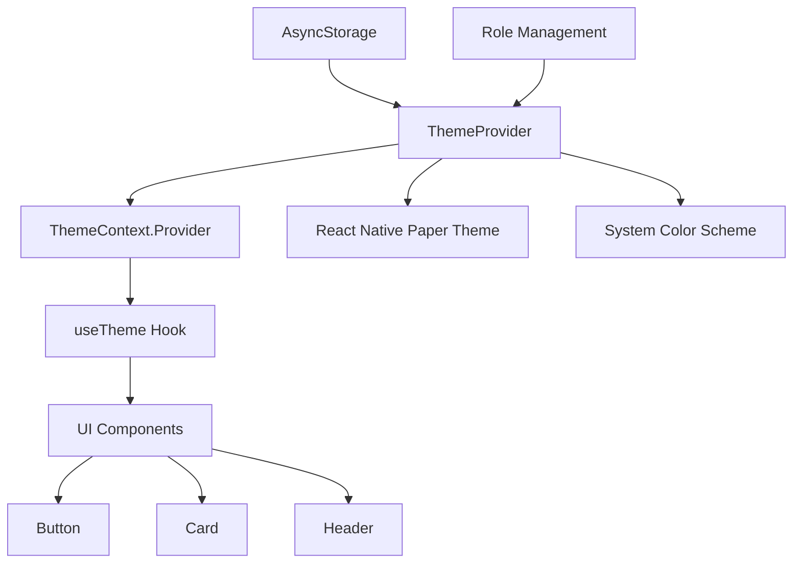
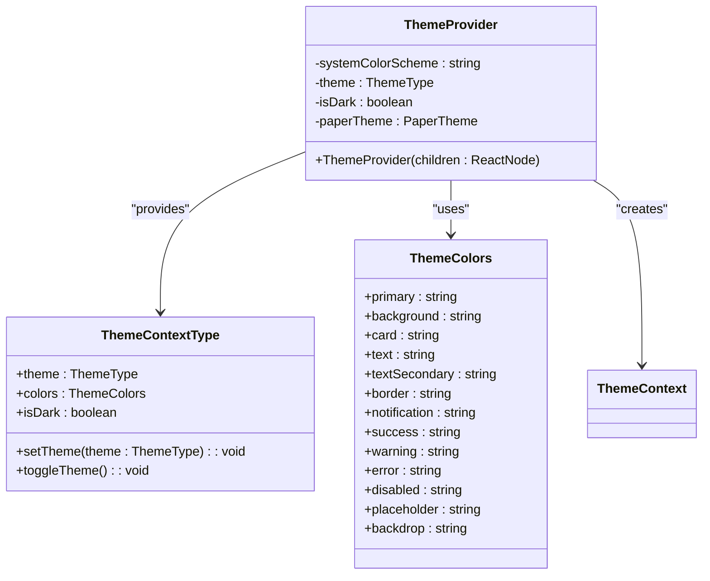
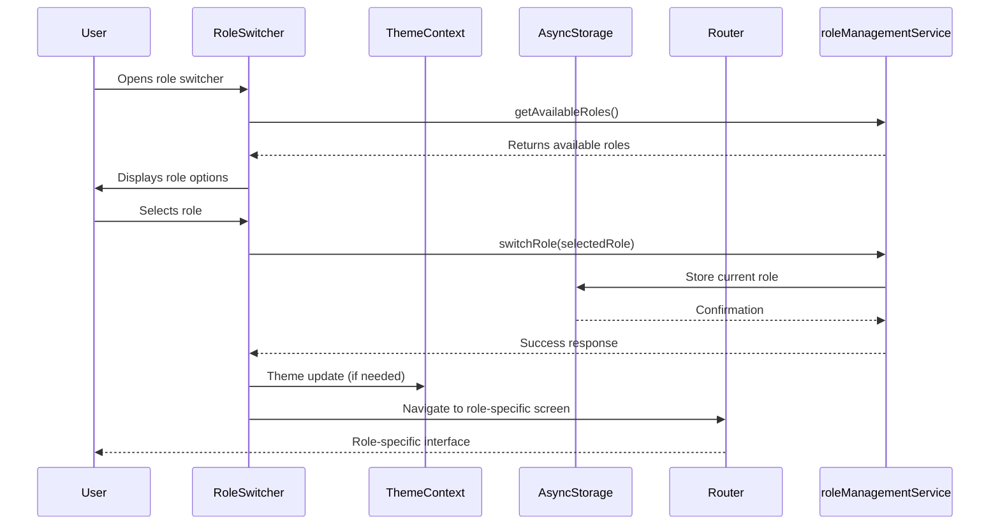
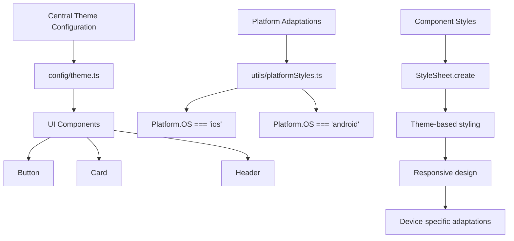
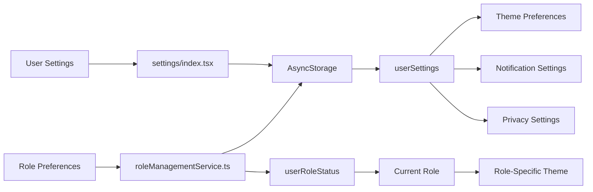

# Theme and UI State Management

<cite>
**Referenced Files in This Document**   
- [ThemeContext.tsx](file://contexts/ThemeContext.tsx)
- [theme.ts](file://config/theme.ts)
- [platformStyles.ts](file://utils/platformStyles.ts)
- [RoleSwitcher.tsx](file://components/RoleSwitcher.tsx)
- [button.tsx](file://components/ui/button.tsx)
- [card.tsx](file://components/ui/card.tsx)
- [settings/index.tsx](file://app/settings/index.tsx)
- [roleManagementService.ts](file://services/roleManagementService.ts)
- [app/_layout.tsx](file://app/_layout.tsx)
</cite>

## Table of Contents
1. [Introduction](#introduction)
2. [ThemeContext Architecture](#themecontext-architecture)
3. [Core Theme Management](#core-theme-management)
4. [Role-Specific Theme Integration](#role-specific-theme-integration)
5. [Dynamic Styling System](#dynamic-styling-system)
6. [Theme Persistence and Storage](#theme-persistence-and-storage)
7. [Performance Considerations](#performance-considerations)
8. [Accessibility and UX](#accessibility-and-ux)
9. [Implementation Examples](#implementation-examples)
10. [Troubleshooting Guide](#troubleshooting-guide)

## Introduction

The Theme and UI State Management system in the Brillprime application provides a comprehensive solution for managing visual presentation states across the platform. This system enables dynamic switching between light and dark modes, supports role-specific themes for different user types (consumer, merchant, driver), and maintains user preferences through persistent storage. The architecture leverages React Context for state management combined with CSS-in-JS styling solutions to ensure consistent theming across all components.

The system is designed to provide a seamless user experience while maintaining performance efficiency and accessibility compliance. It integrates with the application's role management system to deliver contextually appropriate visual experiences based on user roles and preferences.

**Section sources**
- [ThemeContext.tsx](file://contexts/ThemeContext.tsx)
- [theme.ts](file://config/theme.ts)

## ThemeContext Architecture

The ThemeContext system is implemented as a React Context provider that wraps the entire application, making theme state available to all components. The architecture follows a hierarchical approach where theme decisions cascade from system-level settings to component-specific styling.

**Diagram sources**
- [ThemeContext.tsx](file://contexts/ThemeContext.tsx)
- [app/_layout.tsx](file://app/_layout.tsx)

The ThemeContext provider is initialized at the root level of the application in the `_layout.tsx` file, ensuring that all screens and components have access to the current theme state. The context exposes a well-defined API that includes the current theme type, color palette, dark mode status, and functions to modify the theme.

**Section sources**
- [ThemeContext.tsx](file://contexts/ThemeContext.tsx)
- [app/_layout.tsx](file://app/_layout.tsx)

## Core Theme Management

The ThemeContext implementation provides robust management of visual presentation states through a well-structured API. The system supports three theme modes: 'light', 'dark', and 'system', allowing users to choose their preferred visual experience.

**Diagram sources**
- [ThemeContext.tsx](file://contexts/ThemeContext.tsx)

The theme system automatically detects the system's color scheme preference through React Native's `useColorScheme` hook and synchronizes with React Native Paper's theme system to ensure consistency across UI components. When the theme changes, the provider updates both its internal state and the React Native Paper theme configuration.

The color system is defined with a comprehensive palette that includes primary, background, text, and semantic colors (success, warning, error). This ensures consistent color usage across the application while allowing for easy customization and accessibility compliance.

**Section sources**
- [ThemeContext.tsx](file://contexts/ThemeContext.tsx)

## Role-Specific Theme Integration

The theme system integrates with the application's role management to provide contextually appropriate visual experiences for different user types. The RoleSwitcher component serves as the primary interface for role-based theme switching.

**Diagram sources**
- [RoleSwitcher.tsx](file://components/RoleSwitcher.tsx)
- [roleManagementService.ts](file://services/roleManagementService.ts)

The RoleSwitcher component retrieves the user's available roles from the role management service and displays them with appropriate visual indicators. When a user selects a different role, the system updates the persistent storage and navigates to the appropriate role-specific interface. The role-specific themes are implemented through conditional styling based on the current role, with color variations that reflect the different user contexts.

**Section sources**
- [RoleSwitcher.tsx](file://components/RoleSwitcher.tsx)
- [roleManagementService.ts](file://services/roleManagementService.ts)

## Dynamic Styling System

The application's dynamic styling system combines centralized theme configuration with platform-specific adaptations to ensure consistent visual presentation across different devices and operating systems.

**Diagram sources**
- [theme.ts](file://config/theme.ts)
- [platformStyles.ts](file://utils/platformStyles.ts)
- [button.tsx](file://components/ui/button.tsx)
- [card.tsx](file://components/ui/card.tsx)

The `config/theme.ts` file defines the centralized theme configuration with design tokens for colors, typography, spacing, border radius, and shadows. These design tokens are used consistently across all UI components to maintain visual harmony. The `platformStyles.ts` utility provides platform-specific styling adaptations, particularly for shadow effects which differ between iOS and Android.

UI components like Button and Card consume the theme configuration through the `theme` object imported from `config/theme.ts`, ensuring that all visual elements adhere to the defined design system. This approach enables consistent styling while allowing for component-specific variations.

**Section sources**
- [theme.ts](file://config/theme.ts)
- [platformStyles.ts](file://utils/platformStyles.ts)
- [button.tsx](file://components/ui/button.tsx)
- [card.tsx](file://components/ui/card.tsx)

## Theme Persistence and Storage

The theme and user preference system implements persistent storage using AsyncStorage to maintain user settings across application sessions. The settings interface allows users to configure their preferred theme and other visual preferences.

**Diagram sources**
- [settings/index.tsx](file://app/settings/index.tsx)
- [roleManagementService.ts](file://services/roleManagementService.ts)

The settings screen provides a user interface for managing various preferences, including the dark mode setting. When a user toggles the dark mode switch, the application updates both the in-memory state and the persistent storage. The system uses multiple storage keys to manage different aspects of user preferences:

- `userSettings`: Stores general application settings including theme preferences
- `userRoleStatus`: Tracks the user's role registration and verification status
- `currentRole`: Stores the currently active role
- `selectedRole`: Remembers the user's role selection

This distributed storage approach allows for granular control over different aspects of the user experience while ensuring that preferences persist across application restarts.

**Section sources**
- [settings/index.tsx](file://app/settings/index.tsx)
- [roleManagementService.ts](file://services/roleManagementService.ts)

## Performance Considerations

The theme management system has been designed with performance optimization in mind, addressing potential issues related to style recalculations and bundle size.

The implementation minimizes unnecessary re-renders by using React Context efficiently and leveraging React Native's built-in optimization patterns. The theme provider uses memoization and selective state updates to prevent cascading re-renders throughout the component tree.

Bundle size is managed through the centralized theme configuration, which eliminates duplication of style definitions across components. The design token system in `config/theme.ts` ensures that color values, spacing, and other design properties are defined in a single location and imported as needed, rather than being duplicated in multiple component files.

Style recalculations are optimized by using React Native's StyleSheet.create() method, which processes styles at component creation rather than on each render. The platformStyles utility further optimizes performance by providing pre-computed style objects for different platforms, reducing the need for runtime platform detection in individual components.

**Section sources**
- [ThemeContext.tsx](file://contexts/ThemeContext.tsx)
- [theme.ts](file://config/theme.ts)
- [platformStyles.ts](file://utils/platformStyles.ts)

## Accessibility and UX

The theme system incorporates accessibility best practices to ensure an inclusive user experience. The color palette has been designed with sufficient contrast ratios between text and background colors to meet WCAG accessibility standards.

For users with visual impairments, the system provides high-contrast mode options through the combination of light and dark themes. The text colors and background colors are carefully selected to maintain readability in various lighting conditions.

The role switching interface includes visual indicators that are both color-based and icon-based, ensuring that users with color vision deficiencies can distinguish between different role options. The RoleSwitcher component uses distinct icons (🛒 for consumer, 🏪 for merchant, 🚗 for driver) in addition to color coding.

The system also addresses the issue of theme transition flickering by implementing a smooth transition between themes. When the application launches, it quickly determines the appropriate theme based on user preferences and system settings, minimizing the time during which the default theme is displayed.

**Section sources**
- [ThemeContext.tsx](file://contexts/ThemeContext.tsx)
- [RoleSwitcher.tsx](file://components/RoleSwitcher.tsx)

## Implementation Examples

The theme system is implemented consistently across various components in the application. The Button and Card components serve as excellent examples of how the theme configuration is applied in practice.

The Button component uses the centralized theme configuration to define its visual properties, including background colors, text colors, border radius, and spacing. Different variants (default, outline, secondary) are implemented using the theme's color palette, ensuring consistency across the application.

The Card component similarly leverages the theme system for its styling, using theme-defined values for background color, border radius, padding, and shadow effects. The component supports different shadow levels (none, sm, base, md, lg) that correspond to the shadow configurations in the theme file.

These implementation patterns demonstrate the effectiveness of the centralized theme approach, where design decisions are made in a single location and propagated consistently throughout the application.

**Section sources**
- [button.tsx](file://components/ui/button.tsx)
- [card.tsx](file://components/ui/card.tsx)

## Troubleshooting Guide

When encountering issues with the theme management system, consider the following common problems and solutions:

1. **Theme not persisting between sessions**: Verify that AsyncStorage operations are completing successfully and that the storage keys are being set correctly. Check for any errors in the console related to AsyncStorage.

2. **Flickering during theme transitions**: Ensure that the theme is being determined early in the application lifecycle, preferably in the root layout component. Implement a loading state or splash screen if necessary to prevent visual flickering.

3. **Inconsistent styling across components**: Verify that all components are importing the theme configuration from the central `config/theme.ts` file and using the design tokens consistently.

4. **Role-specific themes not applying correctly**: Check that the role management service is properly updating the current role in AsyncStorage and that components are re-rendering when the role changes.

5. **Performance issues with theme switching**: Profile the application to identify any unnecessary re-renders. Ensure that the theme context is not causing the entire component tree to re-render when only specific components need to update.

6. **Accessibility concerns**: Use accessibility testing tools to verify contrast ratios and ensure that all interactive elements are properly labeled for screen readers.

**Section sources**
- [ThemeContext.tsx](file://contexts/ThemeContext.tsx)
- [settings/index.tsx](file://app/settings/index.tsx)
- [roleManagementService.ts](file://services/roleManagementService.ts)