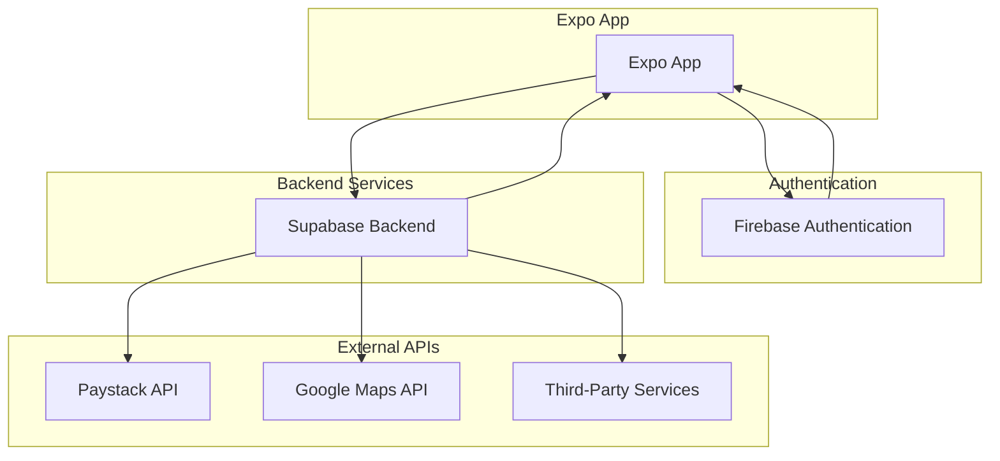
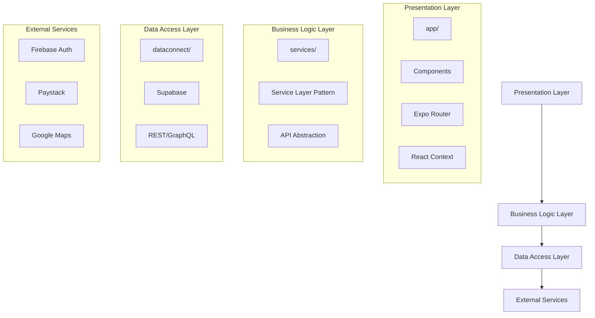
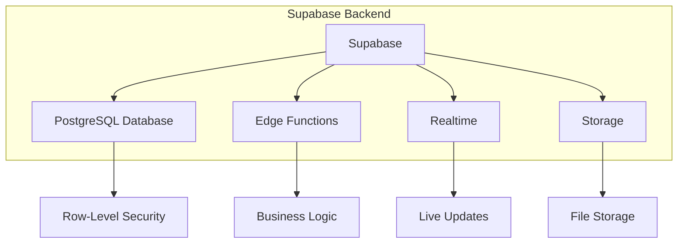
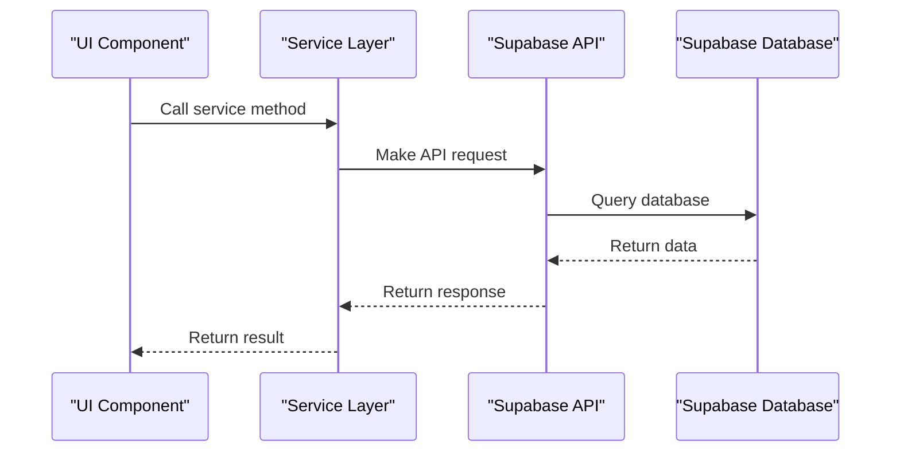
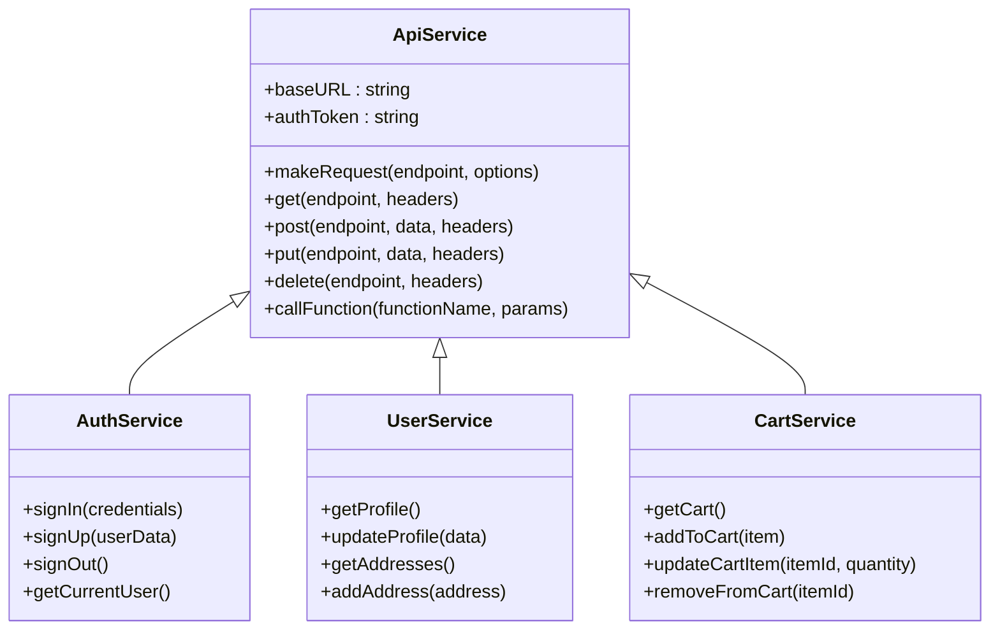

# Architecture Diagram

<cite>
**Referenced Files in This Document**   
- [ARCHITECTURE.md](file://ARCHITECTURE.md)
- [package.json](file://package.json)
- [app.config.js](file://app.config.js)
- [eas.json](file://eas.json)
- [config/supabase.ts](file://config/supabase.ts)
- [config/firebase.ts](file://config/firebase.ts)
- [config/environment.ts](file://config/environment.ts)
- [services/api.ts](file://services/api.ts)
- [services/apiEndpoints.ts](file://services/apiEndpoints.ts)
- [contexts/AuthContext.tsx](file://contexts/AuthContext.tsx)
- [contexts/AppContext.tsx](file://contexts/AppContext.tsx)
- [hooks/useAuth.ts](file://hooks/useAuth.ts)
- [dataconnect/schema/schema.gql](file://dataconnect/schema/schema.gql)
- [dataconnect/example/queries.gql](file://dataconnect/example/queries.gql)
- [supabase/functions/cart-get/index.ts](file://supabase/functions/cart-get/index.ts)
- [supabase/functions/create-order/index.ts](file://supabase/functions/create-order/index.ts)
- [supabase/functions/payment-process/index.ts](file://supabase/functions/payment-process/index.ts)
- [supabase/schema.sql](file://supabase/schema.sql)
</cite>

## Table of Contents
1. [Introduction](#introduction)
2. [System Context Diagram](#system-context-diagram)
3. [Layered Architecture](#layered-architecture)
4. [Frontend Architecture](#frontend-architecture)
5. [Backend Architecture](#backend-architecture)
6. [Data Flow](#data-flow)
7. [Service Layer Pattern](#service-layer-pattern)
8. [Deployment Topology](#deployment-topology)
9. [Security Boundaries](#security-boundaries)
10. [Cross-Platform Compatibility](#cross-platform-compatibility)
11. [Scalability Considerations](#scalability-considerations)

## Introduction
The Brillprime-expo system implements a serverless architecture that combines React Native with Expo for the frontend, Supabase for backend services, Firebase for authentication, and third-party APIs for payment processing and mapping. This architecture enables cross-platform compatibility across Android and iOS while maintaining separation of concerns between authentication and data management. The system leverages Expo Router for navigation, React Context for state management, and a service layer pattern for API abstraction.

**Section sources**
- [ARCHITECTURE.md](file://ARCHITECTURE.md#L1-L132)

## System Context Diagram

**Diagram sources**
- [ARCHITECTURE.md](file://ARCHITECTURE.md#L10-L35)
- [config/firebase.ts](file://config/firebase.ts#L1-L82)
- [config/supabase.ts](file://config/supabase.ts#L1-L120)

## Layered Architecture

**Diagram sources**
- [app.config.js](file://app.config.js#L1-L99)
- [services/api.ts](file://services/api.ts#L1-L218)
- [dataconnect/schema/schema.gql](file://dataconnect/schema/schema.gql#L1-L53)

## Frontend Architecture
The frontend architecture is built on React Native with Expo, providing cross-platform compatibility for Android and iOS. Expo Router handles navigation through file-based routing, where each directory in the app/ folder corresponds to a route. The application uses React Context for state management, with specialized contexts for authentication, application state, and theming. The component structure follows a modular approach with presentation components in app/_components/ and business components in components/. The architecture supports offline functionality through AsyncStorage and implements performance optimizations through code splitting and lazy loading.

**Section sources**
- [package.json](file://package.json#L1-L99)
- [app.config.js](file://app.config.js#L1-L99)
- [eas.json](file://eas.json#L1-L18)
- [contexts/AuthContext.tsx](file://contexts/AuthContext.tsx#L1-L149)
- [contexts/AppContext.tsx](file://contexts/AppContext.tsx#L1-L148)

## Backend Architecture
The backend architecture is serverless, leveraging Supabase for database, authentication, edge functions, and real-time features. Supabase provides a PostgreSQL database with row-level security (RLS) for data protection, edge functions for business logic, and real-time subscriptions for live updates. Firebase is used exclusively for authentication, supporting multiple providers including Email/Password, Google, Facebook, and Apple. The architecture separates authentication (Firebase) from data operations (Supabase), creating a clean separation of concerns. Supabase Edge Functions handle serverless logic for operations like cart management, order creation, and payment processing.

**Diagram sources**
- [ARCHITECTURE.md](file://ARCHITECTURE.md#L5-L29)
- [supabase/schema.sql](file://supabase/schema.sql#L1-L233)
- [supabase/functions/cart-get/index.ts](file://supabase/functions/cart-get/index.ts#L1-L77)
- [supabase/functions/create-order/index.ts](file://supabase/functions/create-order/index.ts#L1-L149)

## Data Flow
The data flow in the Brillprime-expo system follows a structured pattern from UI components through service layers to Supabase via REST and GraphQL. When a user interacts with the application, the UI component calls a service layer method, which in turn makes API requests to Supabase. Authentication flows through Firebase, which returns a Firebase UID and auth token. The application then queries Supabase for user profile data using the firebase_uid reference. All CRUD operations go through Supabase using REST API endpoints or Edge Functions. Real-time updates are handled through Supabase client subscriptions, enabling live data synchronization across clients.

**Diagram sources**
- [services/api.ts](file://services/api.ts#L1-L218)
- [services/apiEndpoints.ts](file://services/apiEndpoints.ts#L1-L197)
- [config/supabase.ts](file://config/supabase.ts#L1-L120)

## Service Layer Pattern
The application implements a service layer pattern for API abstraction, with dedicated service classes in the services/ directory. Each service encapsulates business logic and API interactions for a specific domain, such as user management, authentication, cart operations, and order processing. The ApiService class provides a unified interface for making HTTP requests to Supabase, handling authentication headers, error handling, and response formatting. This pattern decouples the presentation layer from the data access layer, enabling easier testing, maintenance, and future refactoring. Service methods return standardized ApiResponse objects with success status, data, and error information.

**Diagram sources**
- [services/api.ts](file://services/api.ts#L1-L218)
- [services/authService.ts](file://services/authService.ts#L1-L200)
- [services/userService.ts](file://services/userService.ts#L1-L150)
- [services/cartService.ts](file://services/cartService.ts#L1-L120)

## Deployment Topology
The deployment topology is serverless, eliminating the need for traditional server infrastructure. Expo handles OTA (over-the-air) updates, allowing code pushes without app store submissions. Supabase Edge Functions execute serverless logic in response to API requests, scaling automatically with demand. The architecture uses environment variables for configuration, with separate settings for development, preview, and production environments. EAS (Expo Application Services) manages the build and deployment process, with different configurations for development, preview, and production builds. This topology enables rapid iteration, automatic scaling, and reduced operational overhead.

**Section sources**
- [eas.json](file://eas.json#L1-L18)
- [app.config.js](file://app.config.js#L1-L99)
- [supabase/functions](file://supabase/functions#L1-L100)

## Security Boundaries
The architecture establishes clear security boundaries between components. Firebase handles authentication and identity management, while Supabase manages data access and business logic. Row-level security (RLS) policies in Supabase ensure that users can only access data they are authorized to view. The application uses environment variables to store sensitive configuration, with public variables prefixed with EXPO_PUBLIC_ for client-side access. API requests include authentication tokens and Firebase UIDs for authorization. Edge Functions validate user permissions before executing operations, providing an additional security layer. The separation of Firebase (authentication) and Supabase (data) creates a defense-in-depth approach to security.

**Section sources**
- [ARCHITECTURE.md](file://ARCHITECTURE.md#L45-L50)
- [config/supabase.ts](file://config/supabase.ts#L1-L120)
- [config/firebase.ts](file://config/firebase.ts#L1-L82)
- [supabase/rls-policies.sql](file://supabase/rls-policies.sql#L1-L50)

## Cross-Platform Compatibility
The architecture ensures cross-platform compatibility between Android and iOS through Expo's abstraction layer. Expo Router provides a unified navigation system that works consistently across platforms. Platform-specific code is minimized through conditional imports and platform detection utilities. The application uses Expo's built-in components and APIs that are designed to work across platforms, with fallbacks for platform-specific features. The service layer pattern ensures that business logic is shared across platforms, while UI components can be adapted for platform-specific design guidelines. This approach enables a single codebase to deliver native-like experiences on both Android and iOS.

**Section sources**
- [app.config.js](file://app.config.js#L20-L40)
- [package.json](file://package.json#L1-L99)
- [hooks/useAuth.ts](file://hooks/useAuth.ts#L1-L116)

## Scalability Considerations
The serverless architecture provides inherent scalability through automatic scaling of Supabase resources and Edge Functions. The separation of authentication (Firebase) and data operations (Supabase) allows each system to scale independently based on demand. Supabase's PostgreSQL database can handle increased load through connection pooling and query optimization. Edge Functions scale horizontally to handle concurrent requests, with cold start times minimized through efficient initialization. The service layer pattern enables horizontal scaling of business logic, while the React Context state management system handles client-side state efficiently. The architecture is designed to handle increased user load and data volume without requiring infrastructure changes.

**Section sources**
- [ARCHITECTURE.md](file://ARCHITECTURE.md#L101-L107)
- [services/api.ts](file://services/api.ts#L1-L218)
- [config/environment.ts](file://config/environment.ts#L1-L52)