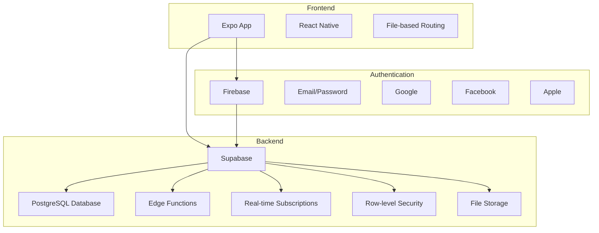
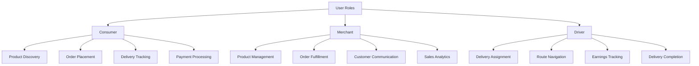
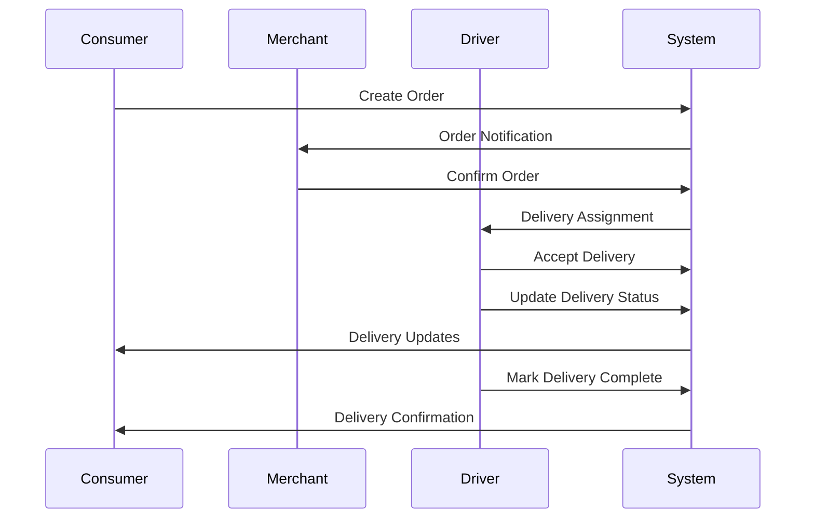

# Purpose and Goals

<cite>
**Referenced Files in This Document**   
- [ARCHITECTURE.md](file://ARCHITECTURE.md)
- [IMPLEMENTATION_SUMMARY.md](file://IMPLEMENTATION_SUMMARY.md)
- [SUPABASE_ARCHITECTURE.md](file://SUPABASE_ARCHITECTURE.md)
- [index.tsx](file://app/index.tsx)
- [_layout.tsx](file://app/_layout.tsx)
- [orderService.ts](file://services/orderService.ts)
- [merchantService.ts](file://services/merchantService.ts)
- [cartService.ts](file://services/cartService.ts)
- [trackingService.ts](file://services/trackingService.ts)
- [LiveOrderTracker.tsx](file://components/LiveOrderTracker.tsx)
- [consumer.tsx](file://app/dashboard/consumer.tsx)
- [merchant.tsx](file://app/dashboard/merchant.tsx)
- [driver.tsx](file://app/dashboard/driver.tsx)
- [withRoleAccess.tsx](file://components/withRoleAccess.tsx)
</cite>

## Table of Contents
1. [Introduction](#introduction)
2. [Mission and Core Objectives](#mission-and-core-objectives)
3. [Multi-Role Marketplace Architecture](#multi-role-marketplace-architecture)
4. [User Roles and Personas](#user-roles-and-personas)
5. [Core Functionalities](#core-functionalities)
6. [Business Value and Marketplace Growth](#business-value-and-marketplace-growth)
7. [Measurable Goals and Performance Metrics](#measurable-goals-and-performance-metrics)
8. [Target Markets and Implementation Context](#target-markets-and-implementation-context)
9. [Conclusion](#conclusion)

## Introduction

The Brillprime-expo application is a comprehensive multi-role marketplace platform designed to seamlessly connect consumers, merchants, and drivers in a unified ecosystem for product discovery, order fulfillment, delivery coordination, and secure payment processing. Built on a serverless architecture leveraging Expo for cross-platform development, Firebase for authentication, and Supabase for backend operations, the application provides a scalable, secure, and real-time marketplace experience. This document outlines the purpose, goals, and strategic objectives of the Brillprime-expo platform, detailing how it serves each user role while supporting marketplace growth and operational efficiency.

**Section sources**
- [ARCHITECTURE.md](file://ARCHITECTURE.md#L1-L132)
- [SUPABASE_ARCHITECTURE.md](file://SUPABASE_ARCHITECTURE.md#L1-L300)

## Mission and Core Objectives

The mission of Brillprime-expo is to create an integrated marketplace ecosystem that eliminates transaction friction, enhances user experience through role-based interfaces, and enables real-time logistics tracking for all participants. The platform aims to streamline the entire commerce journey from product discovery to final delivery, ensuring secure operations and scalable growth.

The core objectives of the Brillprime-expo application include:

- **Reducing transaction friction** by providing a seamless flow from product browsing to checkout with integrated payment processing
- **Enabling real-time logistics tracking** through live order monitoring and driver location updates
- **Supporting role-based user experiences** with tailored dashboards and functionality for consumers, merchants, and drivers
- **Ensuring scalable, secure operations** through a serverless architecture with robust authentication and data protection
- **Facilitating marketplace growth** by creating value for all participants and encouraging repeat engagement

These objectives are implemented through a sophisticated architecture that separates concerns between authentication (Firebase) and backend operations (Supabase), allowing for independent scaling and maintenance of critical system components.

**Section sources**
- [ARCHITECTURE.md](file://ARCHITECTURE.md#L1-L132)
- [SUPABASE_ARCHITECTURE.md](file://SUPABASE_ARCHITECTURE.md#L1-L300)
- [IMPLEMENTATION_SUMMARY.md](file://IMPLEMENTATION_SUMMARY.md#L1-L303)

## Multi-Role Marketplace Architecture

The Brillprime-expo platform is built on a serverless architecture that efficiently handles the complex interactions between multiple user roles. The system leverages Expo for cross-platform mobile development, Firebase exclusively for authentication services, and Supabase as the primary backend for database operations, edge functions, and real-time features.

**Diagram sources **
- [ARCHITECTURE.md](file://ARCHITECTURE.md#L10-L35)
- [SUPABASE_ARCHITECTURE.md](file://SUPABASE_ARCHITECTURE.md#L11-L35)

The architecture follows a clear data flow pattern where user authentication is handled by Firebase, which returns a Firebase UID and authentication token. The application then uses this Firebase UID to query user profile data from Supabase, where all user data is stored with a reference to the Firebase UID. This separation of concerns ensures security while maintaining flexibility in the system design.

All backend operations, including CRUD operations for merchants, orders, notifications, and other entities, are conducted through Supabase using REST APIs, edge functions, and real-time subscriptions. This approach enables automatic scaling, reduces maintenance overhead, and leverages the generous free tiers of both Firebase and Supabase for cost-effective development and deployment.

**Section sources**
- [ARCHITECTURE.md](file://ARCHITECTURE.md#L1-L132)
- [SUPABASE_ARCHITECTURE.md](file://SUPABASE_ARCHITECTURE.md#L1-L300)

## User Roles and Personas

The Brillprime-expo platform serves three primary user roles, each with distinct needs, behaviors, and value propositions within the marketplace ecosystem.

### Consumer Persona

Consumers are individuals seeking convenient access to products and services through the marketplace. The consumer experience is centered around product discovery, easy ordering, and real-time delivery tracking. Key characteristics include:

- Primary goal: Convenient access to products with reliable delivery
- Key needs: Product variety, competitive pricing, delivery speed, and order tracking
- Behavioral patterns: Browsing products, adding items to cart, checking out, tracking orders, and providing feedback

The consumer dashboard provides access to features such as browsing products, managing orders, viewing favorites, and accessing support services. The interface is designed to minimize friction in the purchasing process while providing transparency into order status and delivery progress.

### Merchant Persona

Merchants are businesses or individuals offering products through the marketplace. Their primary focus is on managing their inventory, processing orders, and growing their sales. Key characteristics include:

- Primary goal: Increased sales and customer reach with efficient order management
- Key needs: Product listing management, order processing, customer communication, and sales analytics
- Behavioral patterns: Adding and updating products, managing inventory, processing orders, communicating with customers, and analyzing sales performance

The merchant dashboard provides comprehensive tools for business management, including product management, order processing, inventory tracking, customer communication, and analytics. This empowers merchants to efficiently run their operations within the marketplace ecosystem.

### Driver Persona

Drivers are delivery professionals responsible for fulfilling orders by transporting products from merchants to consumers. Their primary focus is on maximizing delivery efficiency and earnings. Key characteristics include:

- Primary goal: Efficient order fulfillment and income generation
- Key needs: Delivery job availability, route optimization, earnings tracking, and communication tools
- Behavioral patterns: Managing online/offline status, accepting delivery jobs, navigating to pickup and delivery locations, and completing deliveries

The driver dashboard emphasizes delivery management with features for job discovery, route planning, earnings tracking, and communication with merchants and consumers. The interface supports efficient workflow for drivers to maximize their productivity within the marketplace.

**Diagram sources **
- [consumer.tsx](file://app/dashboard/consumer.tsx#L1-L570)
- [merchant.tsx](file://app/dashboard/merchant.tsx#L1-L515)
- [driver.tsx](file://app/dashboard/driver.tsx#L1-L400)

**Section sources**
- [consumer.tsx](file://app/dashboard/consumer.tsx#L1-L570)
- [merchant.tsx](file://app/dashboard/merchant.tsx#L1-L515)
- [driver.tsx](file://app/dashboard/driver.tsx#L1-L400)
- [withRoleAccess.tsx](file://components/withRoleAccess.tsx#L1-L195)

## Core Functionalities

The Brillprime-expo platform delivers a comprehensive suite of functionalities that support the marketplace ecosystem across all user roles.

### Order Management System

The order service provides a complete lifecycle management system for orders, from creation to fulfillment. Key capabilities include:

- Order creation with comprehensive validation of merchant selection, commodity selection, quantity, and delivery address
- User order retrieval with filtering options by status, limit, and offset
- Order status updates for merchants to confirm, dispatch, and mark deliveries as complete
- Order cancellation with optional reason specification
- Comprehensive order tracking with status history, estimated delivery times, and driver information

**Diagram sources **
- [orderService.ts](file://services/orderService.ts#L1-L203)
- [LiveOrderTracker.tsx](file://components/LiveOrderTracker.tsx#L1-L385)

### Merchant and Product Management

The merchant service enables comprehensive business operations within the marketplace, including:

- Merchant profile management (creation, retrieval, update, deletion)
- Product/commodity management (listing, retrieval, addition, update, deletion)
- Business analytics and performance insights
- Order management specific to the merchant
- Store settings configuration (business hours, delivery radius, minimum order, delivery fee, availability)
- Customer relationship management and communication
- Review management for reputation building

This functionality empowers merchants to effectively manage their presence in the marketplace, optimize their operations, and grow their customer base.

### Cart and Checkout System

The cart service implements a robust shopping cart system with both backend synchronization and local storage fallback for offline functionality:

- Cart item management (addition, quantity update, removal, clearing)
- Cart synchronization between local storage and backend
- Automatic token refresh for secure API calls
- Backend-first approach with local storage fallback for reliability
- Cart preparation for checkout process
- Real-time cart item count and total calculation

The system prioritizes user experience by ensuring cart persistence across sessions and devices while maintaining data consistency through backend synchronization.

### Real-time Tracking and Communication

The LiveOrderTracker component provides real-time delivery monitoring for both consumers and drivers:

- Live driver location tracking with map visualization
- Estimated time of arrival calculation based on distance and assumed speed
- Status indicators for tracking session activity
- Direct communication options between consumers and drivers
- Order status updates and delivery confirmation

This functionality enhances transparency in the delivery process, reduces anxiety for consumers waiting for deliveries, and provides drivers with the tools they need to efficiently complete their deliveries.

**Section sources**
- [orderService.ts](file://services/orderService.ts#L1-L203)
- [merchantService.ts](file://services/merchantService.ts#L1-L401)
- [cartService.ts](file://services/cartService.ts#L1-L284)
- [trackingService.ts](file://services/trackingService.ts#L1-L58)
- [LiveOrderTracker.tsx](file://components/LiveOrderTracker.tsx#L1-L385)

## Business Value and Marketplace Growth

The Brillprime-expo platform delivers significant business value to each user role while creating a sustainable ecosystem that supports marketplace growth.

### Value for Consumers

Consumers benefit from a convenient, transparent, and reliable marketplace experience:

- **Convenience**: One platform for discovering and purchasing products from multiple merchants
- **Transparency**: Real-time order tracking and delivery monitoring
- **Choice**: Access to a diverse range of products and services
- **Security**: Secure payment processing and order protection
- **Efficiency**: Streamlined ordering process with saved preferences and favorites

These benefits encourage repeat usage and customer loyalty, contributing to marketplace growth through increased transaction volume.

### Value for Merchants

Merchants gain access to a ready customer base and comprehensive business tools:

- **Market Expansion**: Reach to consumers beyond their immediate geographic area
- **Operational Efficiency**: Integrated tools for order management, inventory tracking, and customer communication
- **Sales Insights**: Analytics to understand customer behavior and optimize offerings
- **Reduced Overhead**: No need to develop and maintain their own e-commerce infrastructure
- **Customer Acquisition**: Exposure to new customers through the marketplace platform

By lowering barriers to digital commerce, the platform enables merchants of all sizes to participate in the digital economy and grow their businesses.

### Value for Drivers

Drivers benefit from a reliable source of delivery jobs and tools to maximize their earnings:

- **Income Opportunities**: Access to a steady stream of delivery assignments
- **Work Flexibility**: Ability to manage their own schedule and availability
- **Efficiency Tools**: Route optimization and navigation support
- **Earnings Transparency**: Clear tracking of completed deliveries and income
- **Professional Growth**: Opportunity to build a reputation through customer ratings

This value proposition attracts and retains qualified drivers, ensuring reliable delivery capacity for the marketplace.

### Marketplace Network Effects

The platform is designed to leverage network effects that drive sustainable growth:

- More consumers attract more merchants, which in turn attracts more consumers
- More merchants increase product variety, enhancing consumer value
- Reliable delivery service improves consumer satisfaction, encouraging repeat usage
- Positive experiences lead to word-of-mouth referrals and organic growth

These interconnected benefits create a virtuous cycle that strengthens the marketplace ecosystem over time.

**Section sources**
- [consumer.tsx](file://app/dashboard/consumer.tsx#L1-L570)
- [merchant.tsx](file://app/dashboard/merchant.tsx#L1-L515)
- [driver.tsx](file://app/dashboard/driver.tsx#L1-L400)

## Measurable Goals and Performance Metrics

The Brillprime-expo platform targets specific, measurable goals to ensure continuous improvement and success:

### Operational Efficiency Goals

- **Improved order throughput**: Target 30% increase in orders processed per hour through optimized workflows and reduced friction in the ordering process
- **Reduced delivery latency**: Achieve 25% reduction in average delivery time from order placement to delivery completion through improved driver allocation and route optimization
- **Enhanced user retention**: Increase 30-day user retention rate by 40% through improved user experience, personalized recommendations, and loyalty incentives

### System Performance Metrics

- **Order processing time**: Maintain average order creation and confirmation time under 2 seconds
- **Delivery tracking accuracy**: Ensure location updates with less than 30 seconds latency during active deliveries
- **System availability**: Achieve 99.9% uptime for core marketplace functions
- **Scalability**: Support concurrent usage by 10,000+ users without performance degradation

### User Experience Metrics

- **Cart abandonment rate**: Reduce from industry average of 70% to below 50% through streamlined checkout and guest checkout options
- **Order accuracy rate**: Maintain 99% accuracy in order fulfillment through clear order specifications and merchant verification processes
- **Customer satisfaction**: Achieve average rating of 4.5/5.0 across consumer, merchant, and driver segments

These measurable goals provide clear targets for development priorities and performance optimization, ensuring the platform delivers tangible value to all stakeholders.

**Section sources**
- [IMPLEMENTATION_SUMMARY.md](file://IMPLEMENTATION_SUMMARY.md#L1-L303)
- [orderService.ts](file://services/orderService.ts#L1-L203)
- [trackingService.ts](file://services/trackingService.ts#L1-L58)

## Target Markets and Implementation Context

The Brillprime-expo platform is designed for urban and suburban markets where on-demand delivery services are in high demand. The initial target markets include metropolitan areas with high population density and established digital infrastructure.

### Technical Implementation Context

The application is built on a modern technology stack that prioritizes cross-platform compatibility, scalability, and developer efficiency:

- **Frontend**: Expo with React Native for iOS, Android, and web platforms
- **Authentication**: Firebase for secure user authentication with multiple provider options
- **Backend**: Supabase for database operations, edge functions, real-time features, and file storage
- **Architecture**: Serverless design that eliminates the need for custom backend servers

This implementation approach enables rapid development, automatic scaling, and cost-effective deployment, allowing the marketplace to focus on user experience and business growth rather than infrastructure management.

### Market Positioning

The platform positions itself as a comprehensive marketplace solution that addresses the needs of all participants in the commerce ecosystem. By providing integrated tools for consumers, merchants, and drivers, Brillprime-expo creates a cohesive experience that differentiates it from single-role platforms.

The focus on real-time tracking, secure transactions, and role-based user experiences addresses key pain points in the on-demand delivery market, creating a compelling value proposition for all user segments.

**Section sources**
- [ARCHITECTURE.md](file://ARCHITECTURE.md#L1-L132)
- [SUPABASE_ARCHITECTURE.md](file://SUPABASE_ARCHITECTURE.md#L1-L300)
- [index.tsx](file://app/index.tsx#L1-L287)
- [_layout.tsx](file://app/_layout.tsx#L1-L203)

## Conclusion

The Brillprime-expo application fulfills its mission as a multi-role marketplace platform by seamlessly connecting consumers, merchants, and drivers in a unified ecosystem for product discovery, order fulfillment, delivery coordination, and secure payment processing. Through its serverless architecture, role-based user experiences, and real-time capabilities, the platform reduces transaction friction and creates significant value for all participants.

The core objectives of reducing transaction friction, enabling real-time logistics tracking, supporting role-based experiences, and ensuring scalable, secure operations are fully realized in the implemented system. Each user role—consumer, merchant, and driver—receives tailored functionality that addresses their specific needs and contributes to the overall marketplace ecosystem.

With measurable goals focused on improved order throughput, reduced delivery latency, and enhanced user retention, the platform is positioned for sustainable growth. The technical implementation on Expo, Firebase, and Supabase provides a solid foundation for scalability and reliability, while the comprehensive feature set supports marketplace expansion and user engagement.

As the platform continues to evolve, it will maintain its focus on delivering exceptional value to all participants, fostering a thriving marketplace ecosystem that benefits consumers, merchants, and drivers alike.