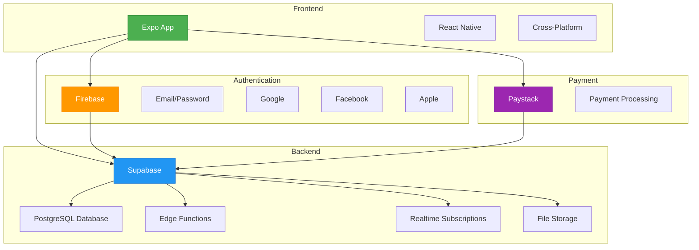
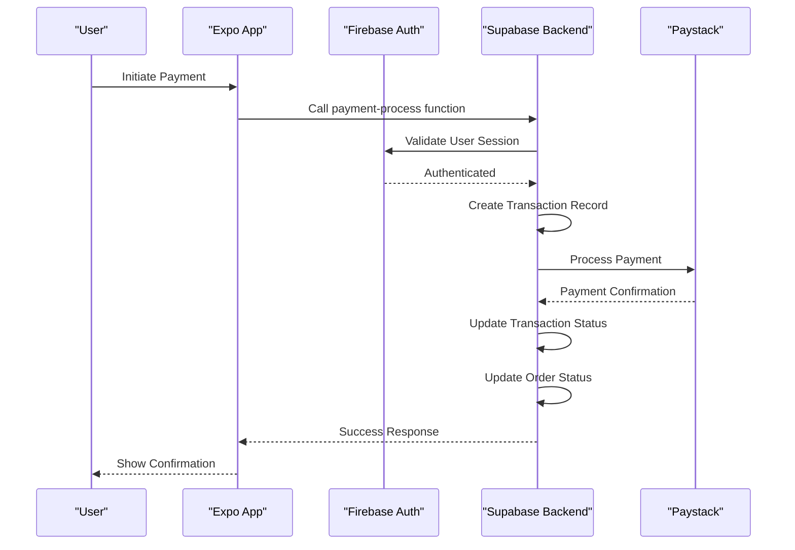

# System Overview

<cite>
**Referenced Files in This Document**   
- [ARCHITECTURE.md](file://ARCHITECTURE.md)
- [SUPABASE_ARCHITECTURE.md](file://SUPABASE_ARCHITECTURE.md)
- [package.json](file://package.json)
- [config/supabase.ts](file://config/supabase.ts)
- [config/firebase.ts](file://config/firebase.ts)
- [config/environment.ts](file://config/environment.ts)
- [services/api.ts](file://services/api.ts)
- [services/apiEndpoints.ts](file://services/apiEndpoints.ts)
- [contexts/AuthContext.tsx](file://contexts/AuthContext.tsx)
- [supabase/functions/payment-process/index.ts](file://supabase/functions/payment-process/index.ts)
- [app/_layout.tsx](file://app/_layout.tsx)
- [eas.json](file://eas.json)
- [app.config.js](file://app.config.js)
</cite>

## Table of Contents
1. [Introduction](#introduction)
2. [Core Architecture](#core-architecture)
3. [Technology Stack](#technology-stack)
4. [System Context Diagram](#system-context-diagram)
5. [Data Flow and Integration](#data-flow-and-integration)
6. [Role-Based Access Control](#role-based-access-control)
7. [Deployment Topology](#deployment-topology)
8. [Scalability and Cross-Platform Considerations](#scalability-and-cross-platform-considerations)

## Introduction

The Brillprime-expo application is a multi-role marketplace platform designed to connect consumers, merchants, and drivers for seamless product discovery, order management, delivery coordination, and payment processing. This document provides a comprehensive overview of the system architecture, detailing the technology stack, component relationships, data flows, and deployment strategy that enable this complex ecosystem to function efficiently across multiple platforms.

**Section sources**
- [ARCHITECTURE.md](file://ARCHITECTURE.md#L1-L132)

## Core Architecture

Brillprime-expo employs a serverless architecture that strategically separates concerns between authentication and backend services. The system leverages Firebase exclusively for authentication while utilizing Supabase for all backend operations, creating a robust and scalable foundation. This hybrid approach combines the strengths of both platforms: Firebase's comprehensive authentication capabilities and Supabase's powerful PostgreSQL-based backend with real-time features.

The architecture follows a clean separation of concerns principle, where the frontend React Native application with Expo serves as the presentation layer, communicating with backend services through well-defined APIs. All data operations, including CRUD operations, business logic execution, and real-time updates, flow through Supabase, which acts as the single source of truth for application data.

This serverless design eliminates the need for traditional backend servers, reducing operational complexity and maintenance overhead while providing automatic scalability to handle varying loads. The architecture is completely serverless, meaning there is no Express server or custom backend to maintain, resulting in simplified deployment and cost-effective scaling.

**Section sources**
- [ARCHITECTURE.md](file://ARCHITECTURE.md#L1-L132)
- [SUPABASE_ARCHITECTURE.md](file://SUPABASE_ARCHITECTURE.md#L1-L300)

## Technology Stack

The Brillprime-expo application utilizes a modern technology stack optimized for cross-platform development and serverless backend operations:

- **Frontend**: React Native with Expo for cross-platform mobile development, enabling code sharing between iOS and Android while providing native performance
- **Authentication**: Firebase Authentication for handling user sign-up, sign-in, and social login providers (Email/Password, Google, Facebook, Apple)
- **Backend**: Supabase for database operations, edge functions, real-time features, and file storage
- **Payments**: Paystack integration for secure payment processing
- **State Management**: React Context API for local state management within the application
- **Offline Support**: AsyncStorage for persistent data storage and offline functionality

The frontend leverages Expo Router for file-based routing, allowing for intuitive navigation structure that maps directly to the app directory. The application uses React Query for data fetching and caching, ensuring efficient data synchronization between the client and server. For real-time updates such as order status changes and chat messages, the system utilizes Supabase's real-time subscriptions capability.

**Section sources**
- [package.json](file://package.json#L1-L99)
- [ARCHITECTURE.md](file://ARCHITECTURE.md#L1-L132)

## System Context Diagram

**Diagram sources**
- [ARCHITECTURE.md](file://ARCHITECTURE.md#L1-L132)
- [SUPABASE_ARCHITECTURE.md](file://SUPABASE_ARCHITECTURE.md#L1-L300)

## Data Flow and Integration

The data flow in Brillprime-expo follows a well-defined pattern that ensures secure and efficient communication between components. The system implements a hybrid authentication and data synchronization model where Firebase handles user authentication while Supabase manages all application data.

During user registration, the flow begins with Firebase creating the authentication account and returning a Firebase UID and token. The application then uses this Firebase UID to create a corresponding user profile in Supabase, establishing a reference between the authentication system and the application database. This separation ensures that authentication concerns are isolated from data management concerns.

For backend operations, all CRUD operations are performed through Supabase using either direct REST API calls or edge functions. The application uses a centralized API client that handles request configuration, error handling, and response parsing. Edge functions deployed on Supabase handle complex business logic such as order creation, payment processing, and inventory management, providing a serverless way to execute backend logic.

The payment integration with Paystack is implemented through a Supabase edge function that orchestrates the payment flow. When a user initiates a payment, the frontend calls the payment-process edge function, which validates the request, creates a transaction record, and interfaces with Paystack's API to complete the payment. Upon successful payment, the edge function updates the transaction status and order payment status in the database.

**Diagram sources**
- [config/supabase.ts](file://config/supabase.ts#L1-L120)
- [config/firebase.ts](file://config/firebase.ts#L1-L82)
- [services/api.ts](file://services/api.ts#L1-L220)
- [supabase/functions/payment-process/index.ts](file://supabase/functions/payment-process/index.ts#L1-L101)

**Section sources**
- [SUPABASE_ARCHITECTURE.md](file://SUPABASE_ARCHITECTURE.md#L1-L300)
- [services/api.ts](file://services/api.ts#L1-L220)

## Role-Based Access Control

The Brillprime-expo application implements a role-based access control (RBAC) system that supports three primary user roles: consumers, merchants, and drivers. Each role has distinct permissions and access to specific features within the application, ensuring that users can only perform actions appropriate to their role.

The RBAC system is implemented at multiple levels:
- **Authentication Level**: Users select their role during the onboarding process, which is stored in AsyncStorage and used to determine the initial navigation flow
- **UI Level**: The application renders different interfaces and navigation options based on the user's role, with merchants accessing store management features, drivers accessing delivery coordination tools, and consumers accessing product browsing and ordering functionality
- **Data Level**: Supabase's Row Level Security (RLS) policies enforce data access restrictions at the database level, ensuring that users can only access data they are authorized to view
- **API Level**: The backend validates user roles and permissions before executing sensitive operations

The role selection process occurs after initial authentication, guiding users through a role selection screen where they choose to operate as a consumer, merchant, or driver. This choice determines their subsequent user experience, including the home screen layout, available features, and navigation options. The selected role is persisted in AsyncStorage and used throughout the session to control access to role-specific functionality.

**Section sources**
- [app/_layout.tsx](file://app/_layout.tsx#L1-L203)
- [contexts/AuthContext.tsx](file://contexts/AuthContext.tsx#L1-L149)

## Deployment Topology

The Brillprime-expo application utilizes Expo's development and deployment workflow in conjunction with Supabase Edge Functions to create a streamlined deployment topology. The frontend application is built and distributed using Expo Application Services (EAS), while backend logic is deployed as edge functions on Supabase.

The deployment configuration is managed through the eas.json file, which defines build profiles for different environments:
- **Development**: Internal distribution for testing and development
- **Preview**: Internal distribution for preview builds
- **Production**: Final production builds with auto-incrementing version numbers

Supabase Edge Functions handle the backend business logic, eliminating the need for traditional server infrastructure. These functions are written in TypeScript and deployed to Supabase, where they run in a serverless environment. The functions are organized by functionality, with separate functions for cart operations, order creation, delivery zone management, and payment processing.

The application's configuration is managed through environment variables, with sensitive credentials stored securely and client-safe configuration exposed through the app.config.js file. This approach allows for different configurations in development, staging, and production environments while maintaining security best practices.

**Section sources**
- [eas.json](file://eas.json#L1-L18)
- [app.config.js](file://app.config.js#L1-L99)
- [supabase/functions](file://supabase/functions)

## Scalability and Cross-Platform Considerations

The Brillprime-expo architecture is designed with scalability and cross-platform compatibility as primary considerations. The serverless nature of the architecture, combining Firebase for authentication and Supabase for backend services, provides automatic scalability to handle varying loads without requiring infrastructure changes.

The React Native with Expo foundation enables true cross-platform compatibility, allowing the application to run seamlessly on both Android and iOS devices with a shared codebase. Expo's managed workflow simplifies the development process by handling platform-specific configurations and providing access to native device features through JavaScript APIs.

For performance optimization, the application implements several strategies:
- **Caching**: Strategic caching of frequently accessed data to reduce network requests
- **Code Splitting**: Modular architecture that loads only necessary components
- **Image Optimization**: Efficient image loading and display using Expo's image components
- **Offline Support**: AsyncStorage integration that allows basic functionality when offline

The system is designed to handle growth in users, transactions, and data volume through the scalable infrastructure provided by Firebase and Supabase. Both services offer generous free tiers for development and scale automatically to accommodate increased usage, making the architecture cost-effective for startups and capable of supporting enterprise-level growth.

**Section sources**
- [ARCHITECTURE.md](file://ARCHITECTURE.md#L1-L132)
- [package.json](file://package.json#L1-L99)
- [config/environment.ts](file://config/environment.ts#L1-L52)