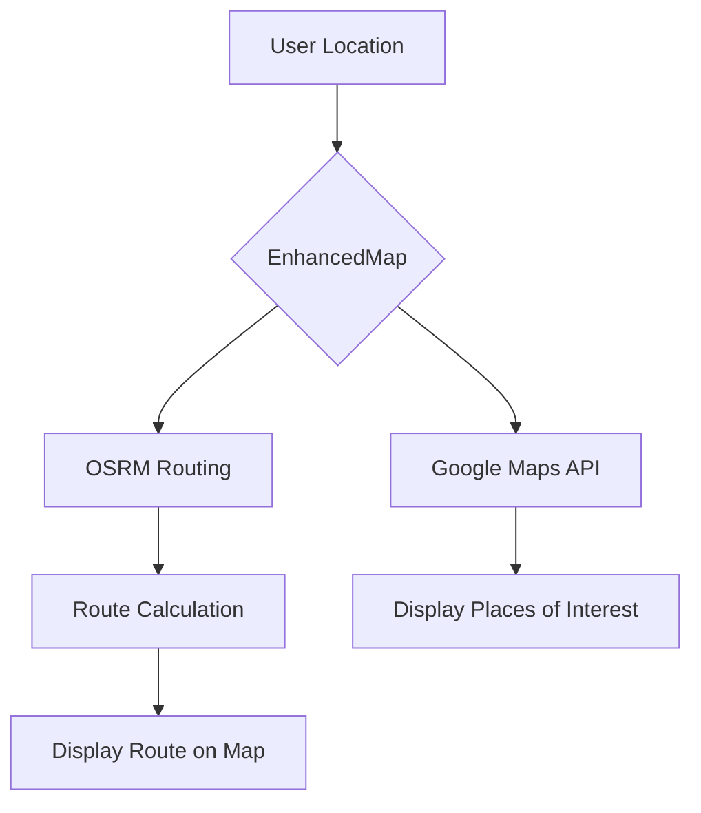
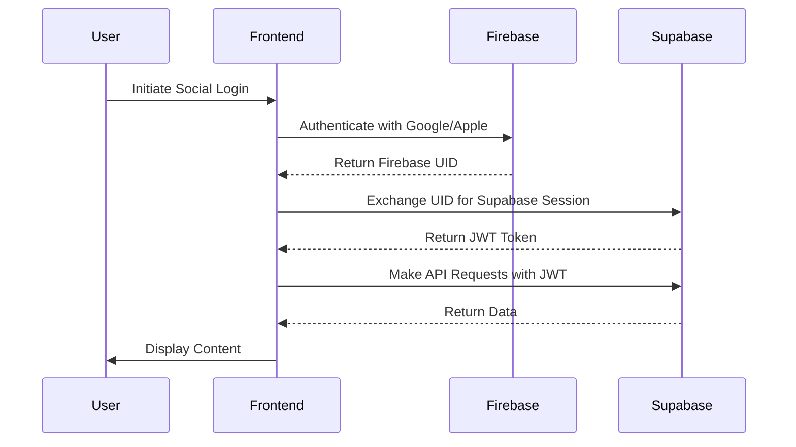

# Technology Stack

<cite>
**Referenced Files in This Document**   
- [package.json](file://package.json)
- [app.config.js](file://app.config.js)
- [eas.json](file://eas.json)
- [metro.config.js](file://metro.config.js)
- [eslint.config.js](file://eslint.config.js)
- [config/supabase.ts](file://config/supabase.ts)
- [config/firebase.ts](file://config/firebase.ts)
- [config/environment.ts](file://config/environment.ts)
- [tsconfig.json](file://tsconfig.json)
- [GOOGLE_MAPS_SETUP.md](file://GOOGLE_MAPS_SETUP.md)
- [app/_layout.tsx](file://app/_layout.tsx)
- [services/api.ts](file://services/api.ts)
- [hooks/useAuth.ts](file://hooks/useAuth.ts)
- [services/paymentService.ts](file://services/paymentService.ts)
- [services/routeService.ts](file://services/routeService.ts)
- [components/EnhancedMap.tsx](file://components/EnhancedMap.tsx)
- [contexts/AuthContext.tsx](file://contexts/AuthContext.tsx)
- [contexts/AppContext.tsx](file://contexts/AppContext.tsx)
</cite>

## Table of Contents
1. [Introduction](#introduction)
2. [Core Frameworks](#core-frameworks)
3. [Backend and Data Services](#backend-and-data-services)
4. [Frontend and UI Libraries](#frontend-and-ui-libraries)
5. [Development and Build Tools](#development-and-build-tools)
6. [Integration Patterns](#integration-patterns)
7. [Version Compatibility and Rationale](#version-compatibility-and-rationale)
8. [Conclusion](#conclusion)

## Introduction
The Brillprime-expo application is a cross-platform mobile solution built with a modern technology stack designed for scalability, performance, and developer efficiency. This document details the core technologies used in the project, including frameworks, libraries, and tools that enable seamless integration between frontend and backend systems. The stack emphasizes type safety, real-time data synchronization, secure authentication, and efficient development workflows.

**Section sources**
- [package.json](file://package.json)
- [app.config.js](file://app.config.js)

## Core Frameworks

### React Native and Expo
The application is built on React Native, leveraging Expo for accelerated development and simplified native functionality access. Expo provides a managed workflow that abstracts native build configurations, enabling rapid iteration and deployment across iOS, Android, and web platforms. The project uses Expo SDK 54, which includes support for modern React features and optimized native modules.

Expo Router is implemented for file-based routing, where the `app/` directory structure directly defines navigation paths. This convention-based routing eliminates the need for manual route configuration and supports dynamic routes (e.g., `[id].tsx`) and nested layouts via `_layout.tsx` files.

### TypeScript for Type Safety
TypeScript is integrated throughout the codebase to enforce type safety and improve code maintainability. The `tsconfig.json` configuration extends Expo's base settings with custom paths (`@/*`) and output directory specifications. TypeScript interfaces are used extensively in services, contexts, and API definitions to ensure consistent data contracts between frontend and backend systems.

### React Query for Data Fetching
`@tanstack/react-query` (v5.90.2) is used for efficient data fetching, caching, and synchronization. It manages server state independently of UI components, providing features like automatic refetching, background updates, and stale-while-revalidate strategies. This enables a responsive user experience with minimal manual state management.

**Section sources**
- [package.json](file://package.json)
- [tsconfig.json](file://tsconfig.json)
- [app/_layout.tsx](file://app/_layout.tsx)

## Backend and Data Services

### Supabase for Real-Time Database and Auth
Supabase serves as the primary backend service, providing PostgreSQL database access, real-time subscriptions, authentication, and storage. The `@supabase/supabase-js` client (v2.84.0) is configured in `config/supabase.ts` with environment-driven initialization. The architecture separates concerns by using Firebase for social login integration while relying on Supabase for all other backend logic, including edge functions for serverless operations.

The configuration includes robust error handling, request interception, and real-time broadcast error suppression. Supabase Edge Functions (e.g., cart management, order creation) are hosted within the `supabase/functions/` directory and deployed via the Supabase CLI.

### Firebase Authentication for Social Login
Firebase Authentication is integrated specifically for social login capabilities, complementing Supabase's native auth system. The `firebase.ts` configuration initializes Firebase services conditionally based on environment variables, supporting web platform compatibility. This hybrid approach allows users to authenticate via Google, Apple, or other providers while maintaining Supabase as the primary data layer.

### Paystack for Payments
The payment system integrates Paystack through a WebView-based implementation (`react-native-paystack-webview`). Payment processing is managed by the `paymentService.ts`, which handles transaction initialization, payment history retrieval, refund requests, and payment method management. The service validates transaction amounts and enforces business rules such as maximum payment limits (₦10,000,000).

### Google Maps and OSRM for Geolocation and Routing
Google Maps is used across all platforms (Web, iOS, Android) for geolocation services, with API keys configured in `app.config.js` and environment variables. The `GOOGLE_MAPS_SETUP.md` guide details the configuration process, including API enablement and key restrictions.

For routing functionality, the application uses OSRM (Open Source Routing Machine) via the `routeService.ts`. This service calculates driving, walking, or bicycling routes between two points, caching results for performance optimization. Route instructions and turn-by-turn navigation are derived from OSRM's step-by-step data.

**Diagram sources**
- [components/EnhancedMap.tsx](file://components/EnhancedMap.tsx)
- [services/routeService.ts](file://services/routeService.ts)
- [config/supabase.ts](file://config/supabase.ts)

**Section sources**
- [config/supabase.ts](file://config/supabase.ts)
- [config/firebase.ts](file://config/firebase.ts)
- [services/paymentService.ts](file://services/paymentService.ts)
- [services/routeService.ts](file://services/routeService.ts)
- [GOOGLE_MAPS_SETUP.md](file://GOOGLE_MAPS_SETUP.md)

## Frontend and UI Libraries

### Tailwind CSS for Styling
Although not explicitly listed in package.json, the styling approach follows utility-first principles similar to Tailwind CSS. Component styles are defined using StyleSheet with modular, reusable style objects. The `platformStyles.ts` utility likely provides responsive styling logic across platforms.

### UI Component Libraries
The application uses `react-native-paper` (v5.11.2) for Material Design components and `@expo/vector-icons` for iconography. Custom UI components are organized in the `components/ui/` directory, including buttons, cards, dialogs, and tabs. These components are designed for reusability and accessibility, with proper error boundaries and loading states.

## Development and Build Tools

### EAS for Builds
Expo Application Services (EAS) is configured via `eas.json` for cloud-based builds and submissions. The configuration defines development, preview, and production build profiles with appropriate distribution settings. This enables consistent native builds without requiring local Xcode or Android Studio installations.

### Metro for Bundling
The Metro bundler is customized in `metro.config.js` to support TypeScript, fonts, and assets. The configuration includes CORS handling for development, platform-specific source extensions, and conditional exclusion of `react-native-maps` from web bundles to prevent compatibility issues.

### Supabase CLI for Local Development
The Supabase CLI is used for local database development, schema management, and migration scripting. SQL files in the `supabase/` directory define table structures, RLS policies, and seed data. Scripts like `setup-database.sh` and `seed-database.sh` automate local environment setup.

### ESLint for Code Quality
ESLint is configured with `eslint-config-expo` for standardized code quality enforcement. The `eslint.config.js` extends Expo's flat config, applying best practices for React and TypeScript. This ensures consistent coding patterns, error prevention, and maintainability across the team.

**Section sources**
- [eas.json](file://eas.json)
- [metro.config.js](file://metro.config.js)
- [eslint.config.js](file://eslint.config.js)
- [supabase/functions/](file://supabase/functions/)
- [scripts/](file://scripts/)

## Integration Patterns

### API Client Architecture
The `api.ts` service implements a centralized API client that routes requests to Supabase's serverless backend. It includes request timeout handling (30s), automatic error mapping, and structured response formatting. The client supports both REST endpoints and Supabase Edge Functions via the `/functions/v1/` path.

Authentication is managed through a hybrid Firebase-Supabase model: Firebase handles social login identity, while Supabase manages session tokens and database access. The `useAuth.ts` hook provides a unified interface for authentication state, role-based access control, and token management.

### Context and State Management
The application uses React Context for global state management, with providers for authentication (`AuthContext`), application state (`AppContext`), merchant data (`MerchantContext`), and notifications (`NotificationContext`). This pattern enables efficient state propagation without prop drilling, while maintaining separation of concerns.

### Environment Configuration
Environment variables are managed through a layered configuration system using `dotenv` and Expo's `extra` configuration in `app.config.js`. The `environment.ts` file centralizes API base URLs, timeouts, and feature flags, allowing different behaviors across development, staging, and production environments.

**Diagram sources**
- [services/api.ts](file://services/api.ts)
- [hooks/useAuth.ts](file://hooks/useAuth.ts)
- [config/firebase.ts](file://config/firebase.ts)
- [config/supabase.ts](file://config/supabase.ts)

**Section sources**
- [services/api.ts](file://services/api.ts)
- [hooks/useAuth.ts](file://hooks/useAuth.ts)
- [contexts/AuthContext.tsx](file://contexts/AuthContext.tsx)
- [contexts/AppContext.tsx](file://contexts/AppContext.tsx)
- [config/environment.ts](file://config/environment.ts)

## Version Compatibility and Rationale

The technology choices in Brillprime-expo reflect a balance between innovation and stability. React Native 0.81.5 and Expo SDK 54 provide access to the latest React 19 features while maintaining backward compatibility. TypeScript 5.9 ensures modern type system capabilities without introducing breaking changes.

Supabase was selected over Firebase Firestore due to its PostgreSQL foundation, enabling complex queries and relational data modeling. Firebase Authentication was retained for its superior social login integration and web compatibility. The hybrid backend approach leverages the strengths of both platforms: Firebase for identity, Supabase for data and functions.

The use of OSRM for routing—rather than Google Maps Directions API—reduces operational costs while providing sufficient accuracy for the application's needs. Google Maps remains the visualization layer, ensuring a familiar user experience.

## Conclusion
The Brillprime-expo technology stack represents a thoughtful integration of modern tools and frameworks designed for performance, scalability, and developer productivity. By combining React Native with Expo, TypeScript, Supabase, and Firebase, the application achieves cross-platform consistency, type safety, real-time capabilities, and secure authentication. The architecture demonstrates a pragmatic approach to technology selection, leveraging each tool for its specific strengths while maintaining a cohesive and maintainable codebase.